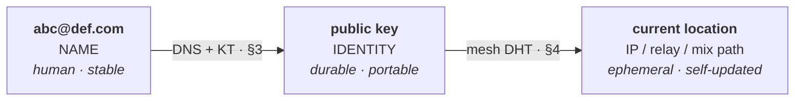
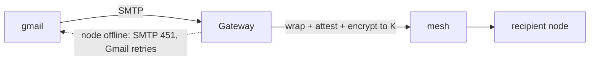
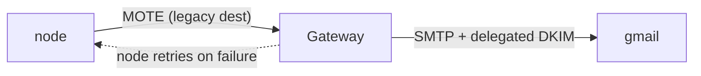

# 0. Overview & Architecture

## 0.1 Goals

DMTAP is a protocol for authenticated, encrypted, metadata-reducing messaging (with an
opt-in, research-tier path toward stronger metadata privacy, §0.6) between self-sovereign
identities, with async (store-and-forward) delivery, no required central party, and an
optional bridge to legacy email. One substrate carries **mail, chat, files**,
and **decentralized identity/login** — the same keypair that receives your mail logs you in
across the web (§13), with no central identity provider.

Concretely, DMTAP MUST provide:

1. **Sovereign identity** — a keypair you own; no account with any provider is required to
   *be* a DMTAP identity. The same identity serves mail, messaging, files, and web login
   (§13).
2. **Reachability without a static IP** — a node behind CGNAT, on a dynamic IP, is
   reachable by its key.
3. **Content, authenticity, and metadata reduction** — messages are end-to-end encrypted and
   signed, and sealed sender keeps the sender's identity out of intermediaries' view by
   default. Hiding the social graph (who talks to whom, when, how much) from a **global
   passive observer** is a stronger property that an **opt-in, research-tier** privacy tier
   works toward (§0.6, §6) — a disclosed roadmap goal, not a default guarantee.
4. **Continuity** — you never lose access to your identity (redundant, rotatable recovery)
   and can migrate your human name without losing existing contacts.
5. **Legacy interoperability** — you can exchange mail with the existing SMTP world, and
   existing OIDC apps can consume DMTAP login through a bridge (§13.6).
6. **Scales across device classes** — always-on nodes (Pi/NAS/VPS) hold the mailbox;
   intermittent devices (laptops, phones) participate as thin clients or push-woken nodes; the
   gateway role scales horizontally (§14).
7. **Future-proofing** — crypto-agility, transport independence, standards reuse; the
   system gets *simpler* as IPv6 spreads and legacy fades.

## 0.2 One binary, several roles

DMTAP is, deliberately, **one piece of software** plus DNS (which we do not build). Not a node
program and a gateway program: **one node binary whose additional functions are roles selected at
run time** — `--relay`, `--mix`, `--gateway`, `--kt-log`, `--rendezvous`. The wire format has
always agreed with this framing: `gateway` is one of the **device capability** strings in
`DeviceCert.caps` (§1.2), alongside `relay` and `mix` — a role a device may participate in, never a
species of machine.

The distinction matters because a list of *components* invites a *class of operator* for each
component, and every operator class is a party the network then depends on. Roles invite
**reciprocal provision** — you run the role because you need it, and running it for yourself
serves others at no extra cost. Exactly one function in this document resists that logic, because
it needs a resource not everyone can get (§0.2.3), and confining the damage to that one function
is the load-bearing structural claim of the whole design.

### 0.2.1 The node — all durable state, all the real work

One binary, installed on any box that runs most of the time. It holds **all durable state**
and does **all the real work**:

- Identity: the root keypair, device subkeys, recovery policy (§1).
- Store: the mailbox and file blobs (encrypted MOTEs + content-addressed chunks) (§2, §5).
- Mesh participation: peer discovery (DHT), relaying for others, delivery (§4).
- Sealed sender: keeps the sender's identity out of intermediaries' view, on by default
  regardless of tier (§2.2, §6.2). Mixnet client (opt-in, research-tier `private` tier):
  onion-wrapping and cover traffic on top of sealed sender (§4.4, non-normative — DIRECTION
  §9).
- Messaging: MLS groups for 1:1, chat, and file folders; MLS KeyPackages (§5.3).
- Client access: **JMAP** (native — the node's only client surface, §8). Legacy client
  protocols (IMAP/POP/SMTP-submission, CalDAV/CardDAV) are served by the **gateway**, not the
  node (§7, §8.2).
- The outbound **retry queue** — durability lives here, not in the middle.

### 0.2.2 The roles any node may take (no scarce resource required)

Every function below is a **role of the same binary**, taken by whoever wants it, needing nothing
rarer than a machine that is up and — for some of them — a public address. None is a service class,
none is sold, and none has a gatekeeper:

| Role | Flag | What it provides | Why anyone can run it |
|------|------|------------------|-----------------------|
| **Relay** | `--relay` | reachability hop for NAT'd peers; content-blind (§4.3) | needs only a public address |
| **Mix** | `--mix` | a mixnet hop for the **opt-in, research-tier** `private` transport tier (§4.4, non-normative — DIRECTION §9) | needs only a public address; the fleet self-provisions with adoption |
| **Buffer / relay-mailbox** | `--mailbox` | short-TTL content-blind hold for an offline peer (§14.3, §14.5) | an **n-of-m** arrangement among peers and the owner's own devices — not a hosted service |
| **KT log** | `--kt-log` | an append-only `name → key` log others audit (§3.5) | append-only storage; verifiers pin a *set*, so more logs is strictly better |
| **Rendezvous** | `--rendezvous` | non-DHT lookup fallback + bootstrap entry (§4.2.1, §4.2.2) | needs only a stable address |

These are **reciprocal**: a node runs the roles it wants to exist. That is not altruism — a KT log
set with one member is worthless to its own operator, a mixnet with one mix hides nothing from
anyone including the party that built it, and a buffer set of one is an outage waiting to happen.
The incentive to provide each of these points the same way as the incentive to consume it.

### 0.2.3 The gateway role — the legacy adapter, and the only operator class

`--gateway` is a role like the others, with one difference that defines it: it is the **only**
function in DMTAP that requires a **scarce resource** — an IP address with enough sending
reputation that strangers' mail servers will accept its connections. Reputation cannot be
reciprocally provisioned, it cannot be derived from a keypair, and it takes weeks to build and
seconds to lose. Everything else in this document is a role; **legacy SMTP egress is the one place
an operator class exists at all.**

Its job is **legacy adaptation and nothing else** (§7.1):

- **inbound** — act as MX for a domain, wrap arriving RFC 5322 into a MOTE, attest it, deliver into
  the mesh; return SMTP `4xx` if the recipient is offline so the *sending* server retries;
- **outbound** — translate a MOTE to RFC 5322 and send it, DKIM-signing as the user's domain via a
  delegated selector (the gateway never holds the user's `IK`);
- **legacy client surfaces** — IMAP/POP3/SMTP-submission/CalDAV/CardDAV plus the ingress that
  carries them (§7.15), which requires decrypting the mailbox, so a non-self-operated gateway can
  read it (an honest, disclosed trust choice, §7.15.3); the native JMAP path stays zero-access;
- **legacy addressing** — the alias forms that exist only because legacy mail cannot route to a key
  (§7.10).

It is **not** the buffer, **not** the relay, **not** a mix, **not** a namer, and **not** a spam
classifier (§7.11.4). **Two DMTAP users never need a gateway — not once** (§7.7). Because a
gateway terminates untrusted connections and runs the most-exploited parsers in mail, "one binary"
never means one address space: gateway mode MUST run as a separate process with no access to
identity keys or the MOTE store (§7.1b).

Its value to a user is **strictly proportional to how many of that user's correspondents are still
on legacy mail**, so it self-extinguishes as adoption grows — nobody has to decide to switch it off
(§7.1c).

### 0.2.4 DNS (not built here)

The naming substrate that maps a human name to a key. We publish and read records; we do
not run DNS. See §3. DNS holds the **stable** binding (name → key); the mesh holds the
**dynamic** binding (key → current location).

## 0.3 The three layers of indirection

The core trick that frees an address from any IP:



- **Name → key** is stable and lives in DNS (+ key transparency). It changes only when you
  migrate names.
- **Key → location** is dynamic and lives in the mesh (a signed, TTL'd DHT record the node
  republishes as its address changes).
- The **key is the identity.** Existing contacts route by key via the mesh and never need
  DNS again after first contact; a lost domain is a change of *name*, not of identity (§1.6).

## 0.4 Message-flow summary

### DMTAP → DMTAP (the common path)

```
1. resolve  abc@def.com → recipient key K            (§3; cached/pinned after first contact)
2. fetch    K's KeyPackages + current location           (§4 DHT, §5.3 KeyPackages)
3. build    a MOTE: sealed-sender, MLS/HPKE-encrypted to K, signed  (§2, §5, §6)
4. send     direct (fast tier, default) or, opt-in, through the mixnet (private tier,
            research-tier) (§4, §6)
5. recipient node receives, verifies, decrypts, stores; acks        (§2, §4)
   (sender's node retries until ack — durability at the edge)
```

No gateway, no SMTP, no plaintext outside the endpoints.

```mermaid
sequenceDiagram
  autonumber
  participant S as Sender node
  participant D as DHT / mixnet
  participant R as Recipient node
  S->>S: resolve abc@def.com → key K (§3, cached after first contact)
  S->>D: fetch K's KeyPackages + current location (§4, §5.3)
  S->>S: build MOTE — sealed-sender, MLS/HPKE to K, signed (§2,§5,§6)
  S->>D: send (direct = fast tier, default; mixnet = private tier, opt-in research-tier)
  D->>R: deliver
  R->>R: verify → decrypt → store
  R-->>S: ack (sender retries until ack — durability at the edge)
```

### Legacy → DMTAP (inbound)



### DMTAP → Legacy (outbound)



## 0.5 Where state lives

| State | Location | Notes |
|-------|----------|-------|
| Keys, mailbox, files, retry queue | **Node** (the edge) | All durable state |
| Name → key | **DNS** + key-transparency log | Stable; small |
| Key → location | **Mesh DHT** | Dynamic; signed; TTL'd; self-republished |
| In-flight ciphertext | **Mixnet / relay / buffer roles** | Held only until delivered; content-blind |
| Legacy IP reputation | **A node in `--gateway` mode** | The one irreducible operator function |

The middle (mesh, mixnet, gateway) holds **no durable user data**. Durability is always
punted to an edge: the sender's node retries; inbound legacy leans on the sending server's
SMTP retry.

**The invariant this table encodes.** Every row but the last is either edge state or a role any
node may take (§0.2.2). The last row is different in kind: **legacy sending reputation is the only
input DMTAP needs that cannot be self-provisioned** — you cannot compute it, derive it from a key,
or get it by volunteering, and no protocol rule can conjure one for you. So it is the only place
where "who operates this?" is a real question, and therefore the only place a durable operator
class can form. Keeping that true everywhere — never letting buffering, relaying, mixing, naming,
key transparency, or filtering acquire an operator class of their own — is the structural claim the
rest of this document is built to protect (§7.1, §12.3, §14.1).

## 0.6 Privacy posture (summary; full model in §6)

- **Content & authenticity:** end-to-end encrypted (MLS/HPKE) and signed. Always.
- **Sender metadata (default, all tiers):** hidden via **sealed sender** — the sender's
  identity and authenticating signature live inside the encrypted payload, so intermediaries
  never learn the sender. This is a metadata *reduction*, not elimination: it does not hide
  the sender's IP, and timing/receipt side channels statistically erode it (§6.2).
- **Social graph & timing (opt-in, research-tier):** the `private` transport tier layers a
  **mixnet** (onion routing + mixing delays) plus **cover traffic** and **size padding** on
  top of sealed sender. It is quarantined as **non-normative research** — its assurance is
  not deployment-grade — and is a stated roadmap goal, not a default guarantee
  ([`docs/research/mixnet.md`](docs/research/mixnet.md), DIRECTION §9). Email's asynchrony is
  what would make full-strength mixing affordable if and when it graduates.
- **Recipient retrieval:** the **always-on node receives by push** over the default
  direct/mesh path (or, opt-in, through the mixnet), so there is no store-and-poll step for a
  local adversary to watch — though a buffered/offline recipient is still a polled store an
  observer can watch (delivery tag, time, volume; see R-9, THREAT-MODEL.md).
- **Discovery:** name→key lookups resolve over the default path by default; routing them
  *through* the opt-in mixnet additionally keeps the directory from learning who is looking
  up whom, for deployments that enable it.
- **Privacy tiers:** messages may choose `fast` (direct/low-hop, seconds — the **default**) or
  `private` (full mixnet, minutes of latency, **opt-in, research-tier**). Bulk file transfer
  uses `fast` for the payload; a control message MAY use `private` where the deployment has
  opted in.

**Honest boundary:** by default, DMTAP reduces metadata exposure **to intermediaries**
(sealed sender) — it does not, by default, resist a **global passive adversary** correlating
IP address and timing. Full graph/timing privacy against a global passive observer is an
**opt-in, research-tier** goal (the `private`/mixnet tier, §4.4, §6, DIRECTION §9), not a
shipping guarantee. Perfect resistance to a global *active* adversary with unlimited resources
is not claimed at any tier; see §6.

## 0.7 Non-goals

- Real-time voice/video (separate WebRTC/SFU architecture).
- Blockchain/consensus (except optional self-sovereign naming in §3).
- Server-side search or server-side spam ML (search is on-device; anti-abuse is §9).

## 0.8 Conventions & normative glossary

**Requirement language.** The key words MUST, MUST NOT, SHOULD, SHOULD NOT, MAY are to be
interpreted as described in BCP 14 (RFC 2119, RFC 8174) when, and only when, in all capitals.

**Glossary (normative).** The following terms are defined once here and used with these meanings
throughout. Where a term has several senses, the qualified forms below are the canonical ones;
body text uses the qualified form wherever the sense is not unambiguous from context, and the
listed deprecated synonyms are read as their canonical term.

- **role** — a function of the **one node binary**, selected at run time by a flag (§0.2): relay,
  mix, buffer/relay-mailbox, KT log, rendezvous, gateway. A role is never a separate program and
  never a class of machine. The term **node class**, used in earlier drafts for relay/mix/gateway,
  is **deprecated** and reads as *role*.
- **gateway** — **one sense only, and it is load-bearing**: the **legacy-mail adapter role** (§7,
  §0.2.3) — MX for a domain, outbound SMTP with delegated DKIM, legacy client surfaces, legacy
  addressing — and the **only** function in DMTAP requiring a scarce resource (a reputable IP,
  unblocked port 25, a domain, §7.1a). Unqualified "gateway" **always** means this. It never means
  a node that serves **public objects**: that surface is the **public-object HTTP endpoint**
  (§22.5.1), served by a **PUB server**, which speaks plain HTTP, needs none of the above, and has
  nothing to do with SMTP. Earlier drafts called that surface the "gateway HTTP profile" /
  "well-known gateway"; the name is **retired** to keep this term single-sense. The rename is
  **documentation-only** — the `/.well-known/dmtap-pub/*` paths and every wire detail are unchanged
  — and the one wire-visible identifier that kept the old spelling, the `endorse.gateway` announce
  kind (§24, code point 80), names a **PUB server**.
- **operator** — whoever runs a role. Because every role but one needs no scarce resource, the term
  carries no implication of a business, a service, or a paying relationship; the **only** function
  for which a distinct operator class exists is legacy SMTP egress (§0.2.3, §0.5, §12.1).
- **MOTE** — the atomic unit of DMTAP: a signed, encrypted, content-addressed message object
  (§2). Mail, chat, file offers, group events, and identity announcements are all MOTEs.
- **identity key (IK)** — the root identity keypair (§1.2); its public half *is* the identity.
  Canonical term. The synonyms "address key" and "identity public key" are **deprecated** — they
  name the same thing, the IK's public half.
- **key-name** — the zero-authority name derived from the IK (`BLAKE3-256(ik)`, word-rendered,
  §3.9.6); the floor of the naming ladder (§3.13).
- **sealing** — four distinct mechanisms, each with its own qualified term, never interchanged:
  **sealed sender** (routing privacy: no sender identity outside the encrypted payload, §2.2,
  §6.2); **payload sealing** (MLS/HPKE encryption of `Payload` into `Envelope.ciphertext`,
  §2.4); **backup sealing** (encrypting the portable mailbox backup under a recovery-derived
  key, §1.4); and the **sealed attestation chain** (the gateway-attestation chain carried inside
  the sealed payload, §2.4, §7.8).
- **epoch** — three unrelated counters, always qualified: the **MLS group epoch** (the group
  ratchet state counter, §5.1); the **mix-key epoch** (the 24 h Sphinx-key rotation period,
  §4.4.4); and the **day-counter epoch** (`epoch_day`, the KDF input of the blinded delivery
  tag, §2.2a).
- **suite** — three distinct registries: the **Envelope suite** (the u8 of §1.1, registry
  §21.15); the **MLS ciphersuite** (the u16 of RFC 9420, §5.1); and the **mix suite** (the
  Sphinx packet-format tag, §4.4.12, §21.23). Their downgrade floors are policed independently
  (§5.1).
- **relay** — four senses: the **mesh circuit relay** (libp2p Circuit Relay v2, rung 3 of the
  reachability ladder, §4.3); the **legacy-client ingress** (a gateway edge surface that
  terminates legacy client protocols, §7.15); the **relay role** (any public-address node
  performing the first sense, §0.2.2, §14.1); and the **relay-mailbox** (a content-blind,
  short-TTL buffer held by an **n-of-m** set of peers and own-devices, §14.3; scaling §14.5).
- **private** — qualified per sense: the **`private` transport tier** (the opt-in, research-tier
  mixnet metadata-privacy tier, §4.6, non-normative); the **private gateway operator mode** (a self-operated gateway
  serving only its operator, §7.15.4); and the **private DHT** (a closed deployment's own
  routing prefix, §4.2).
- **attestation** — three senses: **gateway attestation** (signed provenance of a
  legacy-bridged message, §7.8); **device attestation** (platform/hardware-keystore evidence
  over a device key, §1.2a); and **operator attestation** (a DNS/KT record binding an
  infrastructure node to an accountable operator domain — `_dmtap-gw` §7.2a, `_dmtap-mix`
  §4.4.8).
- **requests area** — the quarantine where a cold sender's unproven MOTEs are deferred: held,
  rate-limited, never surfaced as inbox mail and never acked (§2.7a).
- **key transparency (KT) log** — canonical term for the append-only Merkle log that makes
  `name → key` bindings tamper-evident (§3.5); "KT" alone always refers to it.
- **ARC token** — an Anonymous Rate-limited Credential (Privacy Pass ARC) presented by a cold
  sender as an envelope-level abuse proof (§2.2b, §9.3).
