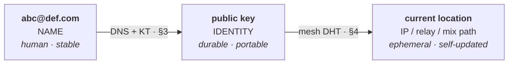
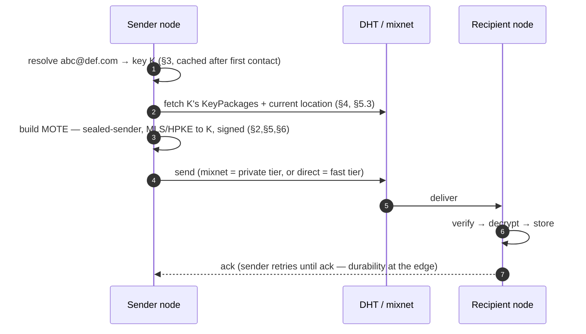
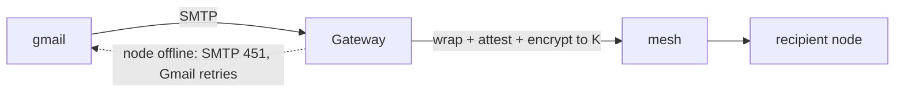
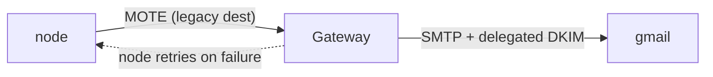

# 0. Overview & Architecture

## 0.1 Goals

DMTAP is a protocol for authenticated, encrypted, metadata-private messaging between
self-sovereign identities, with async (store-and-forward) delivery, no required central
party, and an optional bridge to legacy email. One substrate carries **mail, chat, files**,
and **decentralized identity/login** — the same keypair that receives your mail logs you in
across the web (§13), with no central identity provider.

Concretely, DMTAP MUST provide:

1. **Sovereign identity** — a keypair you own; no account with any provider is required to
   *be* a DMTAP identity. The same identity serves mail, messaging, files, and web login
   (§13).
2. **Reachability without a static IP** — a node behind CGNAT, on a dynamic IP, is
   reachable by its key.
3. **Content, authenticity, and metadata privacy** — messages are end-to-end encrypted and
   signed, and the social graph (who talks to whom, when, how much) is hidden from a global
   passive observer.
4. **Continuity** — you never lose access to your identity (redundant, rotatable recovery)
   and can migrate your human name without losing existing contacts.
5. **Legacy interoperability** — you can exchange mail with the existing SMTP world, and
   existing OIDC apps can consume DMTAP login through a bridge (§13.6).
6. **Scales across device classes** — always-on nodes (Pi/NAS/VPS) hold the mailbox;
   intermittent devices (laptops, phones) participate as thin clients or push-woken nodes;
   gateways scale horizontally (§14).
7. **Future-proofing** — crypto-agility, transport independence, standards reuse; the
   system gets *simpler* as IPv6 spreads and legacy fades.

## 0.2 The two components

DMTAP is, deliberately, only two pieces of software plus DNS (which we do not build):

### The Node (`node/`)

One binary, installed on any box that runs most of the time. It holds **all durable state**
and does **all the real work**:

- Identity: the root keypair, device subkeys, recovery policy (§1).
- Store: the mailbox and file blobs (encrypted MOTEs + content-addressed chunks) (§2, §5).
- Mesh participation: peer discovery (DHT), relaying for others, delivery (§4).
- Mixnet client: onion-wrapping, cover traffic, sealed sender (§4, §6).
- Messaging: MLS groups for 1:1, chat, and file folders; MLS KeyPackages (§5.3).
- Client access: **JMAP** (native — the node's only client surface, §8). Legacy client
  protocols (IMAP/POP/SMTP-submission, CalDAV/CardDAV) are served by the **gateway**, not the
  node (§7, §8.2).
- The outbound **retry queue** — durability lives here, not in the middle.

A node MAY additionally run in **relay mode** (help NAT'd peers, if it has a public
address) or **mix mode** (be a mixnet hop). These are capabilities of the same binary, not
separate programs.

### The Gateway (`gateway/`) — optional

The **sole home of every legacy protocol** and the **only** component that is not content-blind
(the legacy leg is unavoidably plaintext). Because the node is native-only (JMAP + mesh, §8), the
gateway runs all of: **SMTP MX/relay**, **IMAP/POP3/SMTP-submission**, **CalDAV/CardDAV**, and
the **legacy-client reachability ingress** (§7.15). It:

- receives inbound legacy mail (acts as MX), wraps it into a MOTE, attests it, and delivers
  into the mesh; returns SMTP `4xx` if the recipient is offline so the *sending* server
  retries;
- sends outbound legacy mail, DKIM-signing as the user's domain via delegated selectors;
- serves the user's own **legacy client apps** (IMAP/POP/DAV) over the reachability ingress —
  which requires decrypting the mailbox, so a non-private gateway can read it (an honest,
  disclosed trust choice, §7.15.3); the native JMAP path stays zero-access;
- carries the operational weight the system cannot avoid: **IP reputation**.

A node without legacy correspondents never invokes a gateway. At full adoption, the
gateway is unnecessary. The gateway MAY be the node binary run in `--gateway` mode by an
operator with a reputable IP and a domain.

### DNS (not built here)

The naming substrate that maps a human name to a key. We publish and read records; we do
not run DNS. See §3. DNS holds the **stable** binding (name → key); the mesh holds the
**dynamic** binding (key → current location).

## 0.3 The three layers of indirection

The core trick that frees an address from any IP:



- **Name → key** is stable and lives in DNS (+ key transparency). It changes only when you
  migrate names.
- **Key → location** is dynamic and lives in the mesh (a signed, TTL'd DHT record the node
  republishes as its address changes).
- The **key is the identity.** Existing contacts route by key via the mesh and never need
  DNS again after first contact; a lost domain is a change of *name*, not of identity (§1.6).

## 0.4 Message-flow summary

### DMTAP → DMTAP (the common path)

```
1. resolve  abc@def.com → recipient key K            (§3; cached/pinned after first contact)
2. fetch    K's KeyPackages + current location           (§4 DHT, §5.3 KeyPackages)
3. build    a MOTE: sealed-sender, MLS/HPKE-encrypted to K, signed  (§2, §5, §6)
4. send     through the mixnet (private tier) or direct (fast tier) (§4, §6)
5. recipient node receives, verifies, decrypts, stores; acks        (§2, §4)
   (sender's node retries until ack — durability at the edge)
```

No gateway, no SMTP, no plaintext outside the endpoints.



### Legacy → DMTAP (inbound)



### DMTAP → Legacy (outbound)



## 0.5 Where state lives

| State | Location | Notes |
|-------|----------|-------|
| Keys, mailbox, files, retry queue | **Node** (the edge) | All durable state |
| Name → key | **DNS** + key-transparency log | Stable; small |
| Key → location | **Mesh DHT** | Dynamic; signed; TTL'd; self-republished |
| In-flight ciphertext | **Mixnet / relay** | Held only until delivered; content-blind |
| Legacy reputation | **Gateway** | The only non-trivial operational cost |

The middle (mesh, mixnet, gateway) holds **no durable user data**. Durability is always
punted to an edge: the sender's node retries; inbound legacy leans on the sending server's
SMTP retry.

## 0.6 Privacy posture (summary; full model in §6)

- **Content & authenticity:** end-to-end encrypted (MLS/HPKE) and signed. Always.
- **Sender metadata:** hidden via **sealed sender** — intermediaries never learn the sender.
- **Social graph & timing:** hidden via a **mixnet** (onion routing + mixing delays) plus
  **cover traffic** and **size padding**. Email's asynchrony is what makes full-strength
  mixing affordable.
- **Recipient retrieval:** the **always-on node receives by push** through the mixnet, so
  there is *no store-and-poll step to hide* — the hardest metadata problem is dissolved by
  architecture, not by expensive PIR.
- **Discovery:** name→key lookups are routed *through* the mixnet, so the directory does not
  learn who is looking up whom.
- **Privacy tiers:** messages may choose `private` (full mixnet, minutes of latency) or
  `fast` (direct/low-hop, seconds, less metadata protection). Default is `private`; bulk
  file transfer uses `fast` for the payload and `private` for its control message.

**Honest boundary:** DMTAP targets a **global passive adversary**. Perfect resistance to a
global *active* adversary with unlimited resources is not claimed; see §6.

## 0.7 Non-goals

- Real-time voice/video (separate WebRTC/SFU architecture).
- Blockchain/consensus (except optional self-sovereign naming in §3).
- Server-side search or server-side spam ML (search is on-device; anti-abuse is §9).

## 0.8 Conventions & normative glossary

**Requirement language.** The key words MUST, MUST NOT, SHOULD, SHOULD NOT, MAY are to be
interpreted as described in BCP 14 (RFC 2119, RFC 8174) when, and only when, in all capitals.

**Glossary (normative).** The following terms are defined once here and used with these meanings
throughout. Where a term has several senses, the qualified forms below are the canonical ones;
body text uses the qualified form wherever the sense is not unambiguous from context, and the
listed deprecated synonyms are read as their canonical term.

- **MOTE** — the atomic unit of DMTAP: a signed, encrypted, content-addressed message object
  (§2). Mail, chat, file offers, group events, and identity announcements are all MOTEs.
- **identity key (IK)** — the root identity keypair (§1.2); its public half *is* the identity.
  Canonical term. The synonyms "address key" and "identity public key" are **deprecated** — they
  name the same thing, the IK's public half.
- **key-name** — the zero-authority name derived from the IK (`BLAKE3-256(ik)`, word-rendered,
  §3.9.6); the floor of the naming ladder (§3.13).
- **sealing** — four distinct mechanisms, each with its own qualified term, never interchanged:
  **sealed sender** (routing privacy: no sender identity outside the encrypted payload, §2.2,
  §6.2); **payload sealing** (MLS/HPKE encryption of `Payload` into `Envelope.ciphertext`,
  §2.4); **backup sealing** (encrypting the portable mailbox backup under a recovery-derived
  key, §1.4); and the **sealed attestation chain** (the gateway-attestation chain carried inside
  the sealed payload, §2.4, §7.8).
- **epoch** — three unrelated counters, always qualified: the **MLS group epoch** (the group
  ratchet state counter, §5.1); the **mix-key epoch** (the 24 h Sphinx-key rotation period,
  §4.4.4); and the **day-counter epoch** (`epoch_day`, the KDF input of the blinded delivery
  tag, §2.2a).
- **suite** — three distinct registries: the **Envelope suite** (the u8 of §1.1, registry
  §21.15); the **MLS ciphersuite** (the u16 of RFC 9420, §5.1); and the **mix suite** (the
  Sphinx packet-format tag, §4.4.12, §21.23). Their downgrade floors are policed independently
  (§5.1).
- **relay** — four senses: the **mesh circuit relay** (libp2p Circuit Relay v2, rung 3 of the
  reachability ladder, §4.3); the **legacy-client ingress** (a gateway edge surface that
  terminates legacy client protocols, §7.15); the **Relay node class** (§14.1); and the
  **relay-mailbox** (a hosted, content-blind, short-TTL buffer, §14.3; scaling §14.5).
- **private** — qualified per sense: the **`private` transport tier** (the mixnet
  metadata-privacy tier, §4.6); the **private gateway operator mode** (a self-operated gateway
  serving only its operator, §7.15.4); and the **private DHT** (a closed deployment's own
  routing prefix, §4.2).
- **attestation** — three senses: **gateway attestation** (signed provenance of a
  legacy-bridged message, §7.8); **device attestation** (platform/hardware-keystore evidence
  over a device key, §1.2a); and **operator attestation** (a DNS/KT record binding an
  infrastructure node to an accountable operator domain — `_dmtap-gw` §7.2a, `_dmtap-mix`
  §4.4.8).
- **requests area** — the quarantine where a cold sender's unproven MOTEs are deferred: held,
  rate-limited, never surfaced as inbox mail and never acked (§2.7a).
- **key transparency (KT) log** — canonical term for the append-only Merkle log that makes
  `name → key` bindings tamper-evident (§3.5); "KT" alone always refers to it.
- **ARC token** — an Anonymous Rate-limited Credential (Privacy Pass ARC) presented by a cold
  sender as an envelope-level abuse proof (§2.2b, §9.3).
