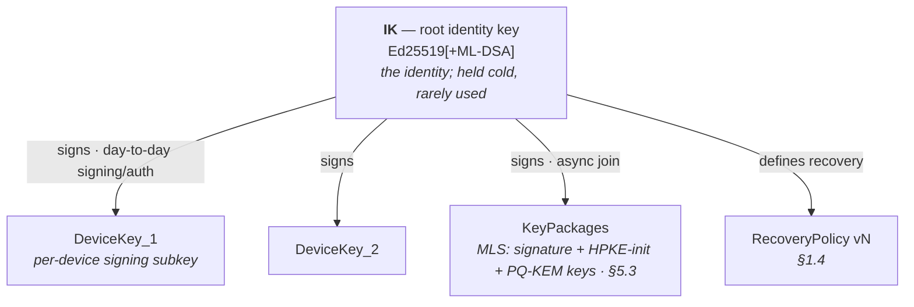

# 1. Identity Lifecycle

Identity is the foundation everything else hangs off. The governing principle:

> **Your key is your identity; names, domains, and providers are replaceable pointers to it.**

**The `identity ≠ name` invariant (normative).** An identity **IS** the key — the root
identity key `IK` (§1.2), plus its derived, zero-authority **key-name** (§3.9.6). A **name** is
only a resolver-provided, replaceable **label** that *points at* that key (§3.12). **A
conformant implementation MUST NOT treat a name as the identity**, and none may authenticate,
route to, or grant on a name without resolving it to a key and verifying that binding against
key transparency (§3.5). This is what makes names — DNS domains, provider handles, crypto
name-chains, petnames — **swappable forever**, and what makes a change of domain, provider,
name, or naming system a **non-event**: the key is unchanged, so existing correspondents follow
by the pinned key and a signed `MoveRecord` (§1.6), never by the abandoned label. The rest of
this section, and all of §3, is written to hold this invariant.

This section defines keys, the key hierarchy, the recovery policy (and how recovery
methods are themselves rotated), key rotation, and name/identity migration. All of these
are **signed, versioned objects** published to the key-transparency log (§3), so every
change is authenticated and every unauthorized change is *detectable*.

## 1.1 Algorithm suites & crypto-agility

Every signed/encrypted object carries a `suite` identifier. Implementations MUST reject
unknown suites (fail closed), never guess.

| `suite` | Sign | KEM / PKE | AEAD | Hash | Status |
|--------:|------|-----------|------|------|--------|
| `0x01`  | Ed25519 | X25519 (HPKE) | ChaCha20-Poly1305 | BLAKE3-256 | LEGACY — accept, never originate |
| `0x02`  | Ed25519 + ML-DSA-65 | X25519 + ML-KEM-768 (hybrid) | ChaCha20-Poly1305 | BLAKE3-256 | **v0 REQUIRED** (PQ-hybrid) |
| `0x03`  | Ed25519 + ML-DSA-65 | X25519 + ML-KEM-768 (hybrid) | AES-256-GCM | BLAKE3-256 | RESERVED (AEAD-diverse emergency target) |
| `0x04`  | Ed25519 + SLH-DSA-128s | X25519 + ML-KEM-768 (hybrid) | ChaCha20-Poly1305 | BLAKE3-256 | RESERVED (signature-diverse emergency target) |
| `0x05`  | Ed25519 + ML-DSA-65 | X25519 + ML-KEM-768 (hybrid) | ChaCha20-Poly1305 | **SHA3-256** | RESERVED (hash-diverse emergency target) |

**PQ-hybrid is the v0 baseline, not a migration target (normative).** Suite `0x02` is what a
conformant v0 implementation **MUST** originate. Suite `0x01` is retained **only** so an
implementation can *verify* historical or constrained-peer objects; a conformant node **MUST NOT
originate** `0x01` and MUST NOT select it for a new relationship
(`ERR_SUITE_BELOW_FLOOR`, `0x0125`, §21.3).

The reason is specific to this protocol and decisive: **mail is the most archival medium there
is**, and a harvest-now-decrypt-later adversary is recording today. A classical-by-default mail
protocol ships a decades-long confidentiality debt on day one. Because DMTAP is greenfield, the
PQ-hybrid floor costs one parameter decision now and a flag day never. The price is size —
ML-DSA-65 signatures are ~3.3 KB and ML-KEM-768 ciphertexts ~1.1 KB — which is why the size
ladder of §16.3 is dimensioned around a PQ envelope from the start (§4.4.1) rather than around a
classical one it would later have to outgrow.

A node MAY hold keys in multiple suites during migration; the transparency log records which
suite is current. Downgrade is prevented by pinning (§3) and by the transparency log's monotonic
history.

**Primitive-family diversity, not merely primitive agility (normative).** Agility that can only
move *within* one mathematical family is not agility. Suites `0x02`, `0x03` and `0x05` share
**ML-DSA** (lattice) signatures and **ML-KEM** (lattice) key establishment, so a structural break
in the lattice assumptions underlying both — a single family, however well-studied — would be
network-wide on the same day. Suites `0x03`–`0x05` are therefore each **reserved in advance**,
diversifying one algorithm family away from `0x02`'s: reserving the code point now, rather than
allocating one under incident pressure, is what turns a family break into a routine capability
negotiation (§10.2) instead of an emergency protocol revision.

| Suite | Diversifies | Distinct why |
|-------|-------------|--------------|
| `0x03` | AEAD → **AES-256-GCM** | `0x02` and legacy `0x01` share **ChaCha20-Poly1305**; a break of ChaCha20 or Poly1305 would be network-wide the same day. `0x03` keeps `0x02`'s PQ-hybrid signature and KEM, so a network can migrate off the ChaCha/Poly monoculture through the ordinary multi-suite mechanism (§1.3) — advertise `0x03`, let senders pick up the intersection, retire the broken suite (§12.8.5) — **without a flag day**. A global kill-switch is deliberately *not* provided (the honest limit of §12.8.5). |
| `0x04` | Signature → **SLH-DSA-128s** | **SLH-DSA** (SPHINCS+, §15) is **hash-based** and rests on no algebraic structure at all, so it survives any lattice break by construction. Its signatures are large (~7.9 KB), which is precisely why it is reserved for the **anchor** layer (§1.2, where signing events are rare) rather than proposed as a general message suite. |
| `0x05` | Hash → **SHA3-256** | Suites `0x01`–`0x04` all carry **BLAKE3-256** — the primitive the rest of the protocol rests on most heavily (every content address §18.9.4, Merkle root §18.9.5, `prev` link, key-transparency leaf §3.5, and pre-hashed signing preimage §18.1.6 is a BLAKE3-256 digest) — which inherits its compression function from BLAKE2, whose round function derives from **ChaCha**: one ARX lineage, shared with the AEAD of three of those four suites, and the largest monoculture in the document. `0x05` keeps `0x02`'s signature, KEM and AEAD unchanged and moves **only** the hash, to a Keccak **sponge** construction sharing no design lineage with the BLAKE line. The §18.1.5 multihash registry already reserves the prefix (`0x16`) such a digest would travel under; `0x05` is what makes it *selectable* rather than merely *expressible*. What reservation **cannot** buy is migrating content that already exists — a new suite re-anchors nothing already published (§11.3). |

**AEAD agility is whole-suite-granular (normative).** A `suite` names its AEAD **together with**
its signature, KEM, and hash — there is no independent AEAD selector, and no way to swap only the
AEAD of an in-use suite; `0x03` above is the AEAD-diverse target reachable only through that
whole-suite mechanism.

Allocation of further `suite` code points: §21.15 — `0x01`–`0x1F` Standards Action,
`0x20`–`0xDF` Specification Required, `0xE0`–`0xFE` Private Use, `0x00`/`0xFF` Reserved.

## 1.2 Keys and the identity hierarchy

An identity is rooted in a **root identity key** (`IK`), an offline-capable long-term
signing keypair. `IK` signs everything authoritative but is used rarely; it SHOULD be held
in cold form / recovery custody (§1.4).

### 1.2.0 The anchor suite — cold and hot keys are dimensioned differently (normative)

`IK` and the device keys beneath it have **opposite** requirements, and DMTAP does not force them
into one algorithm choice:

| | `IK` (cold anchor) | Device / operational keys (hot) |
|---|---|---|
| Lifetime | decades; rotation is a rare migration event (§1.5) | months; rotation is routine hygiene |
| Signing frequency | rare (identity versions, device certs, recovery policy) | constant (every MOTE, every session) |
| Cost of rotation | social — correspondents follow a chain, the key-name changes | none — invisible to correspondents |
| Therefore optimise for | **conservatism** | size and speed |

An `Identity` therefore carries an **anchor suite** (`Identity.anchor_suite`, §1.3) that is
**independent of** the operational `suite` used for messages, and MAY differ from it. Both are
drawn from the same registry (§21.15); the anchor suite governs `IK` and every signature `IK`
itself makes, the operational suite governs everything below.

- A conformant implementation MUST accept an anchor suite that differs from the operational
  suite, and MUST verify each signature under the suite of the key that made it — never under a
  single per-object suite assumed to cover both.
- The anchor suite SHOULD be the most conservative available. Suite `0x04` (**SLH-DSA**,
  hash-based, §1.1) is the intended anchor profile: its ~7.9 KB signatures are irrelevant at
  anchor-signing frequency — a handful of signatures over an identity's whole lifetime — and it
  rests on no algebraic structure, so it survives a break of the lattice family that both `0x02`
  and `0x03` depend on.
- The **key-name derives from `IK`** (`BLAKE3-256(ik)`, §3.9.6) and therefore from the anchor,
  **not** from any operational key. Rotating the operational suite — even migrating it wholesale
  — leaves the key-name, and thus the user's zero-authority name (§3.13), completely untouched.

**Why this is the load-bearing future-proofing decision.** Every other agility mechanism in DMTAP
(multi-suite `Identity`, high-water-marks, capability negotiation) makes migration *possible*.
This one makes it *cheap*, and cheapness is what determines whether migrations actually happen:
hot keys can be migrated continuously and unilaterally because nothing durable is bound to them,
while the one key that is expensive to move is also the one resting on the most conservative
assumption available — so it should need to move least often. This is the cold-key/hot-key
discipline of HSM and root-CA design, applied to a self-sovereign identity. It also directly
strengthens the §1.4 "bottom turtle": the thing that cannot be recovered if lost is now also the
thing least likely to be broken by cryptanalysis.



- **Device keys** authorize a specific device (phone, laptop, the always-on box). Each is a
  signing subkey signed by `IK` (a `DeviceCert`), with a `label`, `created`, and optional
  `expires`. Devices form the owner's **personal cluster** and share the mailbox via the
  encrypted CRDT sync of §5.
- **KeyPackages** (§5.3) let others start an encrypted MLS session with the identity while
  every device is offline. KeyPackages are signed by a device key; one-time KeyPackages are
  consumed per session.
- The key presented to correspondents is the **identity key (IK)** — its public half is the
  stable identity ("address key" is a deprecated synonym, §0.8). Correspondents pin it on
  first use (§3).

### DeviceCert (CBOR)

```
DeviceCert {
  suite:          u8,
  ik:             bytes,        // root identity public key
  device_key:     bytes,        // device signing public key
  label:          tstr,         // "phone", "home-box", ...
  created:        u64,          // ms epoch
  expires:        ?u64,
  caps:           [+ tstr],     // "send","recv","relay","mix","gateway","admin"
  key_protection: ?tstr,        // "software"|"tpm"|"secure-enclave"|"strongbox"|"tee" (§1.2a)
  attestation:    ?bytes,       // OPTIONAL platform attestation evidence over device_key (§1.2a)
  sig:            bytes,        // IK over the CBOR-encoded fields above
}
```

`caps` gates what a device *may participate in*. **No single device — including an `admin`
device — may unilaterally change the recovery policy.** Changing `RecoveryPolicy` (§1.4) always
requires either `IK` directly or satisfaction of the current `rotate_threshold` quorum; an
`admin` device counts only as *one factor* toward that quorum (it may, e.g., be a required
member of the quorum, but never sufficient alone). This prevents a single stolen `admin` device
from locking the owner out by rewriting recovery. See §1.4 for the authoritative signer rule.

### 1.2a Hardware-backed keys & per-device compartmentalization (normative)

A software compromise of a device is the common real-world attack (§6.6 item 3). DMTAP reduces
its blast radius with three device-key mechanisms — the first two SHOULD be used wherever the
platform supports them, all three are buildable from this text:

- **Hardware-backed, non-exportable device keys (SHOULD).** A device's `device_key` — and, where
  the platform allows, the `IK` on the device that holds it — SHOULD be generated **inside a
  hardware keystore** (Apple **Secure Enclave**, a **TPM 2.0**, Android **StrongBox/Keystore**,
  or a **TEE**) as a **non-exportable** key. A software compromise can then only *use* the key
  **while the device is unlocked**; it **cannot exfiltrate** the private key to sign elsewhere or
  after the fact. `DeviceCert.key_protection` records the protection class, and
  `DeviceCert.attestation` (OPTIONAL) carries the platform's **key-attestation** evidence
  (Android Key Attestation / Apple DeviceCheck-style / TPM `AK` quote / FIDO attestation) that the
  key is hardware-resident and non-exportable. A relying context (a group admit, an org
  provisioning, §3.10) MAY **require** an attested `key_protection` and reject a device whose
  attestation is absent or invalid (`ERR_DEVICE_ATTESTATION_INVALID`, `0x0116`). Attestation is an
  **advisory hardening hook**, never a substitute for the KT/quorum authority of §1.4 — a device
  the owner did not authorize is rejected regardless of how well-attested its keystore is.
  **Trust dependency (disclosed).** Verifying key-attestation evidence trusts the platform
  **attestation root** — a **vendor certificate authority** (Google/Apple/a TPM manufacturer / a
  FIDO metadata service). This is a genuine **trusted-third-party dependency**, honestly the same
  class of TTP as a CA in the WebPKI: a context that requires attestation trusts that root to
  vouch that the keystore is genuine. DMTAP confines the dependency to the *advisory* attestation
  gate — it never lets a vendor root override the owner's §1.4 authorization — but the dependency
  exists and is disclosed, not hidden.
  **Attestation lifecycle (normative).** Attestation evidence is **not** verify-once-forever. A
  `DeviceCert.attestation` carries or references the platform evidence's validity window; a
  relying context MUST treat evidence **older than the re-attestation cadence** (a §16-profile
  value; default **≤ 90 days**) or past the evidence's own expiry as **expired**
  (`ERR_DEVICE_ATTESTATION_EXPIRED`, `0x0118`) and require the device to **re-attest** (produce
  fresh evidence over the same non-exportable key) before it is accepted for the attestation-gated
  context. **Attestation-root rotation** is handled like any trust-anchor change: the accepted set
  of platform roots is configuration a deployment MAY update additively; a `DeviceCert` whose
  evidence chains only to a **retired** root is treated as expired (re-attest under a current
  root), never silently accepted. Re-attestation changes **no** authorization — the device's §1.4
  authority is unaffected; only the advisory hardware-backing claim is refreshed.
- **Per-device decryption isolation / compartmentalization (MUST — cross-cluster /
  post-removal session isolation; "per-device sealing" is a deprecated name for this rule —
  it bounds what a device can *decrypt*, and is none of the four "sealing" mechanisms of
  §0.8).** A device's keys **MUST NOT** decrypt content beyond what that device legitimately
  holds **across a trust boundary**: not **other identities'** sessions, not sessions/epochs the
  device was **never** admitted to, and not group content **after the device is removed**. This is
  the property enforced by each device being its **own MLS leaf** (§5.1, §5.6) with its own leaf
  secret and by post-removal epoch advancement (PCS). **Scope, stated honestly:** within a single
  owner's **personal cluster**, the device group's shared mailbox is a **full replica by design**
  (§5.6) — every cluster device legitimately holds the owner's whole mailbox CRDT, so the MUST is
  **not** an intra-cluster "each device sees less than the mailbox" claim; it is **cross-cluster and
  post-removal session isolation**. Seizing one cluster device therefore exposes that owner's
  replicated mailbox (the §6.6 item 3 live-endpoint floor), but **not** other identities'
  sessions and **not** any group's content after that device is evicted. Deniable 1:1 sessions
  (§5.2.1) are per-device-pair, so a seized device exposes only its own pairwise ratchets — and
  those are torn down and re-established on eviction (§5.2.1(f), §6.7).
- **Compromise healing via revocation (MUST, PCS).** Removing/rotating a compromised device
  **heals the cluster forward**: an MLS Remove + `IK`-authorized device-key rotation (§1.5)
  advances every group's epoch so the evicted key decrypts nothing further (post-compromise
  security), and revokes all that device's auth sessions at once (§13.4). The "lost/stolen
  device" flow is exactly this path — see §6.7 for the operational sequence.

## 1.3 The `Identity` object (published)

The current public identity is a signed, versioned object; its hash is the anchor everyone
pins.

```
Identity {
  suites:   [+ u8],         // OPERATIONAL suites this identity supports, preference-ordered
  anchor_suite: u8,         // suite governing IK itself (§1.2.0); MAY differ from `suites`
  iks:      { u8 => bytes },// identity key (IK) public half per suite (Ed25519 for 0x01, +ML-DSA for 0x02)
  version:  u64,            // monotonically increasing
  devices:  [* DeviceCert],
  keypkgs:  KeyPackageBundleRef,  // location + hash of the current KeyPackage bundle (§5.3)
  recovery: RecoveryPolicyRef,   // hash of the current RecoveryPolicy (§1.4)
  names:    [* tstr],            // self-asserted name(s); trust only after forward name→ik verification (§3.9.4)
  deniable_prekeys: ?KeyPackageBundleRef, // OPTIONAL: X3DH/PQXDH prekeys for deniable 1:1 mode (§5.2.1)
  prev:     ?bytes,             // hash of the previous Identity version (hash chain)
  ts:       u64,
  sig:      [+ bytes],         // one signature per suite in `suites`, over all of the above
}
```

**Multi-suite support & PQ transition (normative).** `suites` is a *set*, preference-ordered,
so an identity can hold classical and PQ keys simultaneously during migration. Rules:

- A **sender MUST use the highest suite both parties support** (intersection of the sender's
  supported suites and the recipient's `Identity.suites`); if the intersection is empty, delivery
  fails closed (no silent downgrade).
- **Recipient-side downgrade defense — the suite ratchet (normative).** The sender rule above is
  not self-enforcing: a recipient that still publishes a weaker suite would otherwise accept a
  MOTE encrypted/signed under it even after both parties can do better, so a future break of the
  weaker primitive (e.g. quantum against a classical suite) would defeat the migration. A
  recipient therefore MUST maintain, **per pinned contact**, a **suite high-water-mark** = the
  highest suite it has seen that contact use or advertise (in a validated `Identity`/KeyPackage).
  A subsequent MOTE from that contact using a suite **below** the high-water-mark MUST be rejected
  (`ERR_SUITE_DOWNGRADE`, §21.4) — routed to the requests area with a security warning, never
  silently accepted. The high-water-mark only ratchets **up**; it lowers solely through an
  explicit, `IK`-authorized rotation the owner performs (a genuine suite retirement, §1.5), never
  through an inbound message. An owner MAY additionally publish a signed **`classical_retired`**
  marker in `Identity` that makes rejection of the retired suite unconditional (not merely
  below-high-water-mark). This is the analogue of TLS's downgrade-sentinel: migration to a PQ
  suite delivers protection at **receipt**, not only once the old keys are globally unpublished.
- During transition the `Identity` MUST carry a signature under **every** suite in `suites`
  (`sig` is a list), so a verifier trusting either the classical or the PQ key can validate the
  object — this is what lets the network migrate without a flag day.
- **Hybrid composition within a suite — no intra-suite downgrade (normative).** The
  "either can validate" rule above governs **cross-suite** migration (a legacy verifier that
  supports *only* `0x01` validating an object that also carries a `0x02` signature). It MUST NOT
  be read as permitting a verifier that **does support** a hybrid suite to accept that suite's
  object on **one component alone**. A hybrid suite (`0x02` = Ed25519 **+** ML-DSA-65 signing,
  X-Wing = X25519 **+** ML-KEM-768 KEM, §16.7) is defined so that its security holds if **at
  least one** component is unbroken, and that goal decomposes by primitive:
  - **Signatures compose AND at verification, over one combined message representative.** A
    verifier that supports suite `0x02` MUST require **every** component signature of a `0x02`
    object to verify (Ed25519 **and** ML-DSA-65); a `0x02`-claimed object whose ML-DSA component is
    missing or fails while only the Ed25519 component validates MUST be **rejected** as an
    incomplete/downgraded hybrid (`ERR_HYBRID_SUITE_INCOMPLETE`, §21.4) — never accepted on the
    classical half. Requiring both to verify is what makes forgery need breaking **both**;
    accepting on either half would collapse unforgeability to the *weaker* component and hand a
    quantum adversary a silent strip-the-PQ-half downgrade. Single-component acceptance is
    permitted **only** for a legacy verifier that genuinely supports just one component, which
    thereby obtains **only that component's** assurance and MUST treat the binding at that (lower)
    level, never as full hybrid strength.

    **The two components are NOT independent signatures over the same message (normative).**
    Following the IETF LAMPS composite PQ/T signature construction (`draft-ietf-lamps-pq-composite-sigs`
    — WG-adopted, Standards-Track and submitted to the IESG, a stronger standing than X-Wing's
    below, in the same honest-disclosure symmetry), both components of a hybrid
    `sig-val` sign a single **domain-separated combined message representative** that binds the
    composite algorithm identifier — in DMTAP, the `suite` byte — alongside the object's own
    DS-tag (§18.1.6). A bare "sign the same preimage twice and concatenate" construction is
    **non-conformant**: it leaves each component a *valid standalone single-algorithm signature*
    over the object, so a component can be lifted out of the composite and replayed as though it
    were an `0x01` signature (or an `0x01` signature promoted into a composite), which is exactly
    the non-separability property the composite exists to provide. Binding the suite into the
    representative makes the two components meaningful only *together*, in the composite they were
    produced for.

    **Assurance level, stated exactly.** AND-composition buys **EUF-CMA** (existential
    unforgeability) under the assumption that at least one component is unbroken. It does **not**
    buy **SUF-CMA**: no composite PQ/T variant is known to achieve strong unforgeability against a
    quantum adversary, so a hybrid signature MUST NOT be assumed non-malleable. DMTAP is built so
    that it need not be: no identifier, dedup key, or replay-cache key in this protocol is derived
    from a signature — `Envelope.id` is the content address of `ciphertext` alone (§2.2) — so a
    mauled-but-valid signature yields the same object identity and is caught by the ordinary
    replay cache. An implementation MUST NOT introduce a construction that depends on signature
    uniqueness or non-malleability.
  - **KEM composes with an IND-CCA-robust combiner.** The hybrid KEM MUST be **X-Wing**
    (`draft-connolly-cfrg-xwing-kem`), whose combiner is designed to be IND-CCA-secure if
    **either** the X25519 **or** the ML-KEM-768 share is unbroken; an implementation MUST NOT
    substitute a bare concatenation or accept an establishment derived from a single share.
    Because X-Wing is a single monolithic KEM there is no "classical-only" fallback *inside*
    `0x02` to strip — the combiner is the anti-downgrade guarantee for confidentiality, as
    AND-verification is for authenticity.

    **Standards status, stated accurately (honest limit).** X-Wing is **not a standard**. It is an
    **Independent Submission stream** Internet-Draft (`draft-connolly-cfrg-xwing-kem`, `-10`,
    2026-03-02), **not adopted by the CFRG**, and carries the stream's own boilerplate that it has
    "no formal standing in the IETF standards process". Separately, **FIPS 203 standardizes no KEM
    combiner at all** and explicitly warns that a combined KEM containing ML-KEM "might not meet
    IND-CCA2 security", deferring the question to NIST SP 800-227. DMTAP pins X-Wing because it is
    the best-analysed hybrid construction with a fixed HPKE KEM code point and concrete parameters,
    not because it is blessed — and the choice is confined to one suite byte, so replacing it if
    SP 800-227 lands on a different combiner is a §21.15 code-point allocation, not a redesign.
    This is disclosed here rather than in a footnote because the alternative is the exact failure
    mode this specification refuses elsewhere: an overstated standards claim resting on a draft.

  This makes the PQ migration downgrade-free **in both directions**: the suite high-water-mark
  (above) stops a peer being pushed *back to* `0x01`, and AND-composition + the X-Wing combiner
  stop the PQ half being *stripped from within* `0x02`.
- Per-message suite is negotiated at **KeyPackage granularity** (§5.3): a KeyPackage advertises
  its suite, and the sender selects a recipient KeyPackage of the chosen suite. `Envelope.suite`
  records the suite actually used.
- **Verifier acceptance across suites (normative).** A verifier MUST reject an `Identity` for
  which it cannot validate **at least one** offered suite it supports; it MUST validate **every**
  offered suite it *does* support (the hybrid AND-rule above, applied across the `sig` list); and
  it MUST NOT reject an `Identity` merely because a *higher* offered suite uses primitives the
  verifier does not implement — that is precisely the legacy-verifier case the multi-suite `sig`
  list exists for, and rejecting it would make PQ migration a flag day. The anti-downgrade intent
  is preserved: because `sig` carries one signature per suite over the whole object (including
  `suites` itself), **stripping** a suite from the offered set alters the signed body and remains
  detectable under every surviving signature — a stripped-suite `Identity` fails validation
  rather than passing as a legitimately narrower one.

**`deniable_prekeys` (OPTIONAL).** An identity that offers the deniable 1:1 mode (§5.2.1)
publishes a `DeniablePrekeyBundle` (§18.4.8) and references it here (same `KeyPackageBundleRef`
shape as `keypkgs`). Its absence simply means the identity does not offer deniable sessions; the
default MLS path is unaffected. Wire key `11`; the identity signature stays key `10` (§18.4.1).

`prev` chains versions into a tamper-evident history mirrored in the transparency log (§3).
A verifier accepts an `Identity` only if every `sig` **of a suite it supports** validates under
the corresponding key in `iks` (the verifier-acceptance rule above) and the chain is consistent
with what it has previously pinned/seen.

## 1.4 Recovery policy (and rotating the recovery methods)

Recovery is **not** baked in at setup; it is a first-class, versioned, signed object so the
recovery methods themselves can be rotated.

```
RecoveryPolicy {
  suite:     u8,
  ik:        bytes,
  version:   u64,
  methods: [+ RecoveryMethod],
  recover_threshold: Threshold,   // what regains access
  rotate_threshold:  Threshold,   // higher bar to change THIS policy
  prev:      ?bytes,             // hash chain
  ts:        u64,
  sig:       bytes,             // by IK, OR satisfied rotate_threshold quorum (reactive)
}

RecoveryMethod = PhraseMethod / DeviceMethod / SocialMethod
PhraseMethod { type:"phrase", recovery_key: bytes }            // key derived from a BIP39-style phrase
DeviceMethod { type:"device", device_key: bytes, label: tstr }
SocialMethod { type:"social", guardians: [+ bytes], threshold: u8 }  // Shamir shares

Threshold = { any_of: [+ MethodPredicate] }   // e.g. 1 phrase OR 2 devices OR 2 guardians
```

A **`MethodPredicate`** names a satisfied factor: `Phrase` (the phrase-derived key), `Devices(n)`
(any *n* device factors), `Guardians(n)` (any *n* social shares), or `Ik` (the root key itself).
A `Threshold`'s `any_of` is met when **any** listed predicate is satisfied. §1.4a below defines
`recover_threshold` and `rotate_threshold` together as a single **monotone access structure**
over these factors and gives `RecoveryPolicy::verify()` as a total, decidable check against it —
every threshold comparison and weakening classification the rules below reference is defined
there, not by ad hoc inspection.

**Quorum-signature wire rule (normative).** A signature that satisfies `rotate_threshold` MUST
take one of exactly two forms: **(i)** a **single aggregated threshold signature** (FROST-class
methods — one signature verifying under the threshold-held public key, indistinguishable on the
wire from a single-signer signature); or **(ii)**, for a multi-device predicate (`Devices(n)`)
satisfied by *distinct* per-factor signatures, a **quorum-signature array** — one signature per
contributing factor, each independently verifiable, together satisfying the predicate. The
byte-exact wire form of the array is a flagged follow-up (wire form tracked in §18); no other
encoding of a quorum satisfaction is conformant.

Rules:

1. **Authenticated.** Every version is signed by `IK` (proactive) or by satisfying the
   current `rotate_threshold` (reactive, mid-recovery). Unauthenticated policy changes are
   invalid.
2. **`rotate_threshold` ≥ `recover_threshold` — defined as access-structure domination (§1.4a
   Table B).** A single compromised factor may (perhaps) recover access but MUST NOT be able to
   unilaterally rewrite the policy and lock the owner out. A `Threshold` is
   `any_of: [MethodPredicate]`, a **disjunction over heterogeneous predicates** (`Phrase`,
   `Devices(n)`, `Guardians(n)`, `Ik`) that admits no total order — `{Phrase}` and
   `{Ik, Guardians(2)}` are simply incomparable. "≥" therefore does not mean a numeric comparison
   of the two `Threshold` objects; it means **no clause of `rotate_threshold` is satisfiable by a
   set of factors that `recover_threshold` does not also license at that strength** — a single,
   exhaustive four-case table (§1.4a Table B), evaluated once per `rotate_threshold` clause, not a
   partial order compared by hand. Two consequences of that table are worth stating plainly here:
   counts are monotone within a kind, so a same-kind pair where the *same kind* of factor rotates
   more cheaply than it recovers is rejected (e.g. `recover = {Guardians(2)}`,
   `rotate = {Guardians(1)}`, under which any two guardians could evict the owner); and no
   `rotate_threshold` clause is ever satisfiable by a **single non-`Ik` factor** unless that
   identical factor alone also satisfies `recover_threshold` — which, because kinds are disjoint,
   can only be true for a same-kind singleton, so a genuinely cross-kind singleton clause (e.g.
   `rotate = {Phrase}` under `recover = {Guardians(3)}`) is always rejected. `Ik` clauses are
   exempted from the singleton check — not because `IK` is weak, but because rule 3 independently
   forbids `IK` alone from executing a *weakening* change regardless of what `rotate_threshold`
   contains, so the exemption does not reopen the takeover the check exists to close.

   **Honest limit, stated rather than papered over:** multi-factor cross-kind clauses (`n ≥ 2`)
   remain unconstrained, because there is no principled way to rank "two guardians" against "two
   devices" — inventing an ordering would be false precision, and a naive one (e.g. requiring
   every `rotate_threshold` predicate to also appear in `recover_threshold`) would reject
   legitimate policies such as `recover = {Phrase}`, `rotate = {Ik, Guardians(2)}` (the
   phrase-holder recovers but cannot rotate — safe under this rule's own rationale). A deployment
   wanting stricter cross-kind guarantees expresses them by choosing kinds deliberately, not by
   relying on this check.
3. **Weakening changes need the quorum, not `IK` alone (compromise defense).** A policy change
   classified **weakening** by §1.4a Table D — it drops a method, lowers a threshold, evicts a
   guardian/device, **or re-admits a factor identity currently flagged evicted anywhere in the
   policy's hash chain** — MUST satisfy `rotate_threshold` **even when signed by `IK`**: `IK`
   alone MUST NOT be sufficient to weaken recovery. This closes the *stolen-`IK`* takeover where an
   attacker proactively rewrites recovery to evict the owner and install their own factors.
   **Additive, non-weakening** changes (adding a genuinely new factor) MAY be signed by `IK` alone.

   **Eviction is durable (normative).** Weakening is classified against the `Evicted` ledger of
   §1.4a Table D — a running accumulator over the **whole hash chain** (`prev`, §1.3), not a diff
   against the immediate predecessor alone. Re-admitting a factor an earlier version evicted MUST
   satisfy `rotate_threshold` and the rule-4 veto window exactly as the eviction did, however many
   versions separate the two events: the ledger is cleared only by a later quorum-and-veto-
   conforming readmission, never by comparing two adjacent versions in isolation. A verifier that
   cannot obtain the chain MUST fail closed rather than assume a change is additive. §1.4a walks
   the two-step evasion this closes: a pairwise (version-vs-predecessor-only) reading lets a
   transiently-compromised `IK` re-admit a factor it controls that a genuine quorum had evicted,
   turning a temporary key compromise into a permanent foothold in recovery, reached without ever
   satisfying a quorum — the chain-wide ledger makes that path unreachable.
4. **Asymmetric veto window on weakening changes.** A recovery-weakening change MUST be published
   to the transparency log and take effect only **after a veto/delay window** (§16), during which
   the owner's monitoring devices (§3.5) can detect it and publish a **counter-signed veto/abort**.
   **The veto is deliberately asymmetric** to avoid a deadlock in which a compromised factor
   vetoes its *own* eviction:
   - A veto MUST itself satisfy the **`rotate_threshold`** quorum — a *single* prior factor
     (e.g. the very factor being removed) CANNOT veto. This ensures a stolen single factor cannot
     block its own removal.
   - A recovery change that itself satisfies `rotate_threshold` (a genuine quorum-backed
     recovery, §1.4 reactive path) **overrides any veto** and is NOT blockable — so legitimate
     recovery from compromise always wins over an attacker holding one not-yet-removed factor.

   Because rule 3 already requires *every* weakening change to satisfy `rotate_threshold`, a
   rule-conforming weakening is inherently quorum-backed and thus veto-proof; the veto window is
   therefore **defense-in-depth** — it exists to detect and block a *non-conforming* (lesser-bar)
   weakening that slipped through a buggy/malicious implementation, not to gate normal recovery.
   A weakening change MUST NOT take effect instantly; non-weakening changes are not delayed.
5. **Real revocation.** Rotating a method out MUST re-key the underlying secret, not merely
   edit a list:
   - rotate **phrase** → re-wrap the identity secret under the new phrase-derived key; old
     phrase becomes useless;
   - change **guardians / threshold** → **redistribution / resharing** (a fresh access
     structure, Desmedt–Jajodia style), not merely proactive refresh; old shares fall below
     threshold and cannot reconstruct;
   - remove **device** → rotate any identity/recovery material it held.

   **Recommended primitives (grounded):**
   - Use **Verifiable Secret Sharing** (Feldman or Pedersen VSS), **not** plain Shamir, so
     guardians can detect a corrupt share or a cheating dealer at reconstruction (hostile-
     guardian threat model). Plain Shamir has no cheating detection.
   - **Proactive Secret Sharing** refreshes shares under the *same* (M,N); **redistribution**
     changes the access structure (add/remove guardians, change threshold). Use the correct
     one per operation.
   - Prefer **SLIP-0039** for the mnemonic⊕Shamir encoding (purpose-built: two-level groups,
     checksums, passphrase) over hand-rolling BIP39 + Shamir.
   - **FROST (RFC 9591) threshold Ed25519 is REQUIRED for `SocialMethod` recovery.** Guardians
     MUST *authorize* recovery — by collectively producing a threshold signature (e.g. over a
     `KeyRotation` to a fresh `IK`, §1.5) — **without ever reassembling the secret key in one
     place**, eliminating the single-point-of-compromise moment that Shamir reconstruction
     creates. A `SocialMethod` whose `recover_threshold` path can materialize a full, standalone,
     **takeover-capable** `IK` in one location MUST NOT be used: it would let a bare
     `recover_threshold` quorum reconstruct `IK` and then rotate (§1.5) — collapsing the rule-2
     `rotate_threshold ≥ recover_threshold` guarantee, since reconstruction hands the quorum the
     very key that clears the *rotation* bar. VSS (above) still governs share integrity; FROST is
     what keeps the reconstructed authority from ever existing as a single stealable secret.
6. **Logged & detectable.** Every version is published to the transparency log; the owner's
   other devices monitor it and MUST alert on a change they did not initiate (intrusion
   detection, §3.5).

### 1.4a The recovery access structure (normative)

`recover_threshold` and `rotate_threshold` are re-expressed here as a single formal object so
`RecoveryPolicy::verify()` is a **total, decidable membership test** — no case is settled by
comparing a partial order by hand, and no exception is enumerated after the fact by finding a
counterexample. This is the authoritative definition rules 2–4 above reference; it replaces
hand-patched prose with one closed model, not a weaker or stronger security bar.

**Factors.** A policy version's enrolled factor universe is
`Factors = {phrase} ∪ Devices ∪ Guardians ∪ {ik}`, where `Devices`/`Guardians` are the concrete
device/guardian identities named in `methods` at that version. A signer *presents* a held set
`H ⊆ Factors` — the factors whose signatures accompany the candidate `RecoveryPolicy`.

**Table A — the access structure a `Threshold` generates.**

| `MethodPredicate` clause | Kind | Minimal authorised sets it contributes |
|---|---|---|
| `Phrase` | phrase | `{ {phrase} }` |
| `Devices(n)` | device | every `n`-subset of `Devices` |
| `Guardians(n)` | social | every `n`-subset of `Guardians` |
| `Ik` | ik | `{ {ik} }` |

`Γ(T)` — the access structure `Threshold T` generates — is the **upward closure** (superset
closure) of the union of the minimal sets its `any_of` clauses contribute: `H ∈ Γ(T)` iff some
clause's minimal set is a subset of `H`. Each clause is, on its own, a plain "≥ n distinct factors
of one kind" gate — monotone by itself, since holding *more* of a kind still satisfies "at least
n" — and `any_of` is a disjunction (a union of monotone sets is monotone), so **`Γ(T)` is monotone
by construction**: `H ∈ Γ(T) ∧ H ⊆ H' ⟹ H' ∈ Γ(T)`. This is design goal (a) (no "adding a factor
removes authorisation" pathology) satisfied structurally: `Threshold` has no operator — no
negation, no AND-across-kinds, no "exactly n" — capable of expressing a non-monotone rule, so
review cannot miss one.

*Concrete instance* (used in the walkthrough below): three guardians `{G1, G2, G3}`,
`recover_threshold = rotate_threshold = {Guardians(2)}`. `Γ({Guardians(2)})`'s minimal authorised
sets are exactly `{G1,G2}`, `{G1,G3}`, `{G2,G3}` — any superset (all three guardians, or any of
those pairs plus other factors) is authorised too, by the closure above.

**Table B — well-formedness of `rotate_threshold` against `recover_threshold` (rule 2, exhaustive
and total).** Apply exactly one row to every clause `(kind, n)` in `rotate_threshold.any_of`:

| # | Case | Verdict | Why |
|---|---|---|---|
| B1 | `kind = Ik` | **WF** | rule 3 is an absolute bar on `IK`-alone weakening, independent of what an `Ik` clause would otherwise license |
| B2 | `recover_threshold` has a clause of the **same** kind, count `m` | **WF iff `n ≥ m`** | counts are monotone within a kind; a same-kind pair that rotates more cheaply than it recovers is the shape a numeric comparison must catch |
| B3 | no same-kind `recover_threshold` clause, and `n ≥ 2` | **WF** (unconstrained) | honest residual — no principled ranking between different kinds' multi-factor coalitions, and no single compromised factor reaches a genuine `n ≥ 2` cross-kind clause |
| B4 | no same-kind `recover_threshold` clause, and `n = 1` | **NOT WF** | a lone factor of a kind `recover_threshold` doesn't independently accept at that strength must never be enough to rotate — "no single weak factor rotates" falls out of the table instead of needing its own hand-written rule |

`rotate_threshold` is well-formed (satisfies rule 2) iff **every** clause passes; a non-WF clause
is rejected at publish (`ERR_RECOVERY_THRESHOLD_INVALID`, `0x010C`). B1–B4 are exhaustive over
`(kind, n)` — every clause hits exactly one row — so this is a *total* function of the two
`Threshold`s' clause lists, not a set of cases discovered by inspection.

*Worked check (unchanged outcomes on the existing `DMTAP-IDENT-90` vectors, §21.3):*

| Policy | Clause(s) checked | Row(s) | Verdict |
|---|---|---|---|
| `recover={Guardians(2)}`, `rotate={Guardians(1)}` | `(social,1)` vs. `m=2` | B2 | 1 ≥ 2 false → **reject** |
| `recover={Devices(2),Phrase}`, `rotate={Devices(1),Ik}` | `(device,1)` vs. `m=2`; `(ik,–)` | B2, B1 | 1 ≥ 2 false → **reject** |
| `recover={Phrase}`, `rotate={Ik,Guardians(2)}` | `(ik,–)`; `(social,2)` | B1, B3 | both WF → **accept** |
| `recover=rotate={Guardians(3)}` | `(social,3)` vs. `m=3` | B2 | 3 ≥ 3 → **accept** |
| `recover={Guardians(3)}`, `rotate={Phrase}` | `(phrase,1)`, no same-kind recover clause | B4 | **reject** |
| `recover={Devices(2)}`, `rotate={Guardians(2)}` | `(social,2)`, no same-kind recover clause | B3 | `n=2` → **accept** (honest residual) |

**Table D — weakening classification (rules 3–4, a chain-wide, not pairwise, check).** Let
`Factors_i` be the concrete factor identities `methods` names at version `i`. Define the
**evicted ledger** recursively over the chain: `Evicted_0 = ∅`; for `i > 0`,
`Evicted_i` = (`Evicted_{i-1}` ∪ (`Factors_{i-1}` \ `Factors_i`)) minus whichever identities
version `i` legitimately re-admits (only possible when version `i` itself satisfies the
weakening bar below). In words: every factor identity dropped by any version accumulates into
`Evicted` and is cleared **only** by a later quorum-and-veto-conforming version that re-admits it
— never by a bare `IK` signature. A candidate version `i+1` is **weakening** iff any of:

| Case | Condition |
|---|---|
| D1 (count lowered) | some clause's `n` is lower than the corresponding clause at version `i` |
| D2 (kind dropped) | a kind present at version `i` is absent at version `i+1` |
| D3 (evicted factor re-admitted) | `Factors_{i+1} ∩ Evicted_i ≠ ∅` |

D1/D2 are the ordinary shrink cases; **D3 is the "eviction is durable" fix**, evaluated against
`Evicted_i` — the running, whole-chain accumulator — not against version `i` alone. This is what
makes the two-step (or *n*-step) bypass structurally impossible: evicting a factor at version `i`
puts it in `Evicted_i` **permanently**, until a later version clears it *by satisfying the same
bar the eviction did*. No number of intermediate "looks-additive-against-its-immediate-
predecessor" hops changes that, because the accumulator is reset only by a quorum-and-veto-
conforming readmission — nothing else touches it.

**`RecoveryPolicy::verify()` — total, decidable, no hand-enumerated exceptions.**

```
fn verify(chain: &[RecoveryPolicy], candidate: &RecoveryPolicy) -> Result<(), Error> {
    let prev = chain.last();

    // Rule 1 — authenticated.
    if !(signed_by_ik(candidate)
         || satisfies(candidate.sig, prev.rotate_threshold, prev.factors())) {
        return Err(ERR_RECOVERY_POLICY_UNAUTHENTICATED);        // 0x010B
    }

    // Rule 2 — structural well-formedness (Table B). Pure function of the two Thresholds.
    for clause in &candidate.rotate_threshold.any_of {
        if !well_formed(clause, &candidate.recover_threshold) {
            return Err(ERR_RECOVERY_THRESHOLD_INVALID);         // 0x010C
        }
    }

    // Rules 3/4 — weakening classification against the whole chain (Table D).
    let evicted = evicted_ledger(chain);                        // accumulator, never pairwise
    if is_weakening(prev, candidate, &evicted) {
        if !satisfies(candidate.sig, prev.rotate_threshold, prev.factors()) {
            return Err(ERR_RECOVERY_WEAKENING_UNQUORUMED);      // 0x010E
        }
        if !veto_window_elapsed_unvetoed(candidate) {
            return Err(ERR_RECOVERY_VETO_WINDOW);               // 0x010F
        }
    }

    check_version_and_chain(prev, candidate)                    // 0x0104 / 0x0105, unchanged
}
```

Every branch returns; every predicate (`well_formed`, `is_weakening`, `evicted_ledger`) is a
finite computation over `candidate` and a bounded chain scan. There is no residual case left to
prose or to an implementer's judgement.

**Why this meets the three design goals:**

- **(a) Monotonicity** is structural (Table A) — no clause shape can express a "more factors ⇒
  less authorised" rule, so it cannot occur by construction, not by review.
- **(b) The bypass is structurally excluded** — the only path to a weakening change accepted by
  `verify()` is `is_weakening ⟹ satisfies(rotate_threshold)`; there is no branch that accepts a
  weakening change without a genuine minimal authorised set of `rotate_threshold` behind it, and
  `Evicted` is chain-wide, so no sequence of hops opens a path around that branch.
- **(c) `verify()` above is total and decidable**: B1–B4 and D1–D3 are exhaustive case splits
  fixed by the shape of `Threshold`/`RecoveryPolicy`, not a list grown by finding
  counterexamples.

**Walking the bypass this replaces (verification).** Using the concrete instance above —
guardians `{G1, G2, G3}`, `recover_threshold = rotate_threshold = {Guardians(2)}`:

1. `v1`: `G3` is compromised and evicted — `methods` drops `G3`, quorum-signed by `{G1,G2}`
   (a genuine minimal authorised set of `Γ(rotate_threshold)`), published, and clears the veto
   window. `Factors_1 = {G1, G2}`; `Evicted_1 = {G3}`.
2. `v2`: an attacker holds a transiently-compromised `IK` and publishes a policy that re-adds
   `G3`, signed by `IK` alone. `Factors_2 = {G1, G2, G3}`. Table D: `Factors_2 ∩ Evicted_1 =
   {G3} ≠ ∅` → **D3, weakening** — regardless of the fact that, compared to `v1` alone, `v2` looks
   purely additive. Rule 3 then requires `satisfies(candidate.sig, rotate_threshold, …)`, which is
   **false** for a bare `IK` signature → `verify()` returns `ERR_RECOVERY_WEAKENING_UNQUORUMED`
   (`0x010E`) and `v2` is rejected. `Evicted_2` still contains `G3`.
3. The owner detects the compromise (KT monitoring, rule 6) and rotates `IK` (§1.5). Because `v2`
   was never accepted, `G3` never re-entered `Factors`, and the rotation carries no attacker
   foothold forward — the "temporary key compromise becomes a permanent foothold in recovery"
   escalation has no step at which it can occur.

`G3` can leave `Evicted` again only via a version that is itself `{Guardians(2)}`-quorum-signed
(e.g. `{G1,G2}` deliberately re-admitting `G3`) and survives the veto window — exactly the bar its
eviction required, satisfied genuinely rather than laundered through an `IK`-alone "addition".

**Honest limit (unchanged from rule 2 above).** Multi-factor cross-kind clauses beyond the
singleton case (Table B, row B3) remain unranked by design: there is no principled way to say
"two guardians" dominates or is dominated by "two devices," and inventing one would be false
precision. A deployment wanting a stricter cross-kind bar expresses it by choosing kinds
deliberately, not by relying on this check.

**Future work (informative).** This section's state is small enough — Tables A/B/D plus the
unrelated version/chain check — to be a reasonable Tamarin/ProVerif target: model `RecoveryPolicy`
transitions as a labelled transition system over `(chain, Evicted)` and state the bypass this
section closes (D3) as a reachability query. A machine-checked model is not attempted here; it is
flagged as a natural next step, not a substitute for this section's decidable definition.

### Recovery flows

- **Proactive rotation** (owner has access): publish `version+1` signed by `IK`. Routine
  hygiene; do it whenever a factor is suspected compromised.
- **Reactive recovery** (owner lost access): satisfy `recover_threshold` to reconstruct
  `IK` (or a fresh `IK` authorized by the old under `rotate_threshold`), then immediately
  publish a new policy that invalidates the compromised factor.

### The bottom turtle

There is a foundational anchor (root phrase + social quorum). It is rotatable but requires
the strongest `rotate_threshold`. Two worst cases bound it:

- **Loss.** Losing `IK` **and** enough recovery factors simultaneously is unrecoverable.
- **Compromise (the sharper case).** An attacker who obtains `IK` **plus** enough factors to
  satisfy `rotate_threshold` can rewrite recovery and effect an **owner-unrecoverable takeover** —
  *worse* than loss, because the owner is actively **evicted**, not merely locked out.

Both are mitigated by the same discipline: multiple independent, redundant, rotatable factors so
no single loss is fatal; the weakening-quorum + veto-window rules above so a *partial* compromise
cannot silently escalate to takeover; and KT monitoring (§3.5) so any takeover attempt — whether a
recovery-**weakening** change (rule 4) or a **key rotation** that installs a new authoritative `IK`
(§1.5) — is detectable and vetoable within the window. The veto's reach is precisely the set of
un-vetoable takeover surfaces §1.4 and §1.5 each close; a change that satisfies neither `IK`+quorum
nor publish-and-delay is rejected outright rather than merely watched.

### Backup & restore (content continuity)

Recovery restores the **key**, not the **mailbox**: reconstructing `IK` onto a fresh device
yields an authoritative identity over an **empty store**. Message/file history returns only from a
surviving cluster device (§5.6) or from a **portable encrypted backup**. DMTAP therefore defines a
normative backup primitive: an owner's node MUST be able to export an **encrypted,
integrity-protected backup** of the mailbox/CRDT state (§5.6) and file blobs (§5.5), sealed under
a key derived from the recovery phrase (or a separate backup key held in `RecoveryPolicy`) and
restorable onto an empty store after key recovery. Without a surviving device or such a backup,
recovery preserves the **identity and all relationships** (§1.6) but **not prior content**. See
§14.5 for how this differs from a relay/peer buffer (a buffer is not a backup).

## 1.5 Key rotation

To rotate `IK` (compromise, or scheduled PQ migration):

1. Generate `IK'`.
2. Publish an `Identity` version whose `sig` is by the **old** `IK` and whose body
   authorizes `IK'` (a cross-signed `KeyRotation` record: `old_ik` signs `new_ik` +
   `reason` + `ts`).
3. From then on `IK'` is authoritative; the transparency log's chain proves continuity.
4. Re-issue device certs and KeyPackages under `IK'`. Correspondents update the pin by following
   the signed chain (§3.4).

A verifier MUST accept `IK'` only via a valid chain from a previously-pinned `IK`, or via an
explicit out-of-band re-verification.

**Authorization of the new authoritative key (stolen-`IK` takeover defense, normative).** A
`KeyRotation` installs a **new authoritative key** — an act at least as powerful as a
recovery-*weakening* change (§1.4 rule 3), and in fact stronger, since the new key can subsequently
rewrite recovery outright. An `old_ik`-alone rotation therefore reopens exactly the takeover §1.4
closes: (a) a stolen `IK` could rotate to a key the owner does not hold and evict the owner
**un-vetoably**; (b) an attacker who reconstructed `IK` from a bare `recover_threshold` quorum
could rotate immediately, defeating rule 2's `rotate_threshold ≥ recover_threshold` guarantee.
Accordingly, **when the identity has a published `RecoveryPolicy` (§1.4)**, a `KeyRotation` MUST
satisfy **one** of:

  - **(a) Quorum-backed.** The `KeyRotation` additionally carries a **`rotate_threshold`
    co-signature** over its body (`rotate_quorum`, §18.4.5) — the same quorum authority as a
    reactive `RecoveryPolicy` change (§1.4). It takes effect **immediately**; or
  - **(b) Published-and-delayed.** The `KeyRotation` is published to the transparency log (§3.5)
    and takes effect **only after the §16 veto/delay window** (the same window as a
    recovery-weakening change, §16.8), during which the owner's monitoring devices (§3.5) MAY
    publish a **`rotate_threshold`-backed counter-sign that aborts** the pending rotation. The
    asymmetric-veto rules of §1.4 rule 4 apply unchanged: a single not-yet-rotated factor cannot
    abort, and a genuine `rotate_threshold`-backed rotation (path (a)) overrides any veto.

A `KeyRotation` that satisfies **neither** — signed by `old_ik` alone, with no quorum co-signature
and not yet past its published veto window — MUST be **rejected or held**, never applied to advance
the pin (**`ERR_KEYROTATION_UNAUTHORIZED`**, §21.3). Nothing here impedes a legitimate owner: a
scheduled PQ migration or routine-hygiene rotation performed by an owner in possession of `IK`
simply follows path (a) (co-sign with the recovery quorum) or path (b) (publish and wait out the
window) — the owner always can; only a partial-compromise attacker cannot.

**First contact during a pending path-(b) window (normative).** A resolver performing **first
contact** (§3.3) while a path-(b) `KeyRotation` is published but still inside its veto window MUST
**pin the pre-rotation `IK`** — the rotation is not yet in effect for anyone — and follow the
signed chain to `IK'` only once the window has elapsed **un-aborted**. Pinning the pending `IK'`
early would hand a stolen-`IK` attacker exactly the vetoable-window takeover the delay exists to
block: a rotation the owner is about to abort must not become someone's trusted first pin. (§3.4
points here.)

**No published `RecoveryPolicy` ⇒ `old_ik` alone remains sufficient.** An identity that has never
published a `RecoveryPolicy` has no stronger authority than `IK` for a rotation to have bypassed;
there step 2 stands unchanged. **Publishing a `RecoveryPolicy` is what raises the rotation bar** —
consistent with §1.4, where the same act is what makes recovery-weakening quorum-gated.

**Fork resolution (normative).** If two `KeyRotation` branches present at the same chain position,
a verifier MUST **prefer the `rotate_threshold`-backed branch** (path (a), or a path (b) whose veto
window elapsed un-aborted) over an `old_ik`-alone branch, and treat the losing branch as a takeover
attempt — HALT_ALERT via `ERR_IDENTITY_CHAIN_BROKEN` (§21.3, §1.3). A bare `old_ik`-alone branch
**never** wins against a quorum-backed one.

## 1.6 Identity (name) migration — never losing your address

Because **key is identity**, losing a domain is a change of *name*, not of identity.

A **MoveRecord** rebinds the human name while preserving the key:

```
MoveRecord {
  suite:   u8,
  ik:      bytes,
  from:    tstr,          // "abc@old.com"
  to:      tstr,          // "abc@new.com"  (or a self-sovereign name, §3.6)
  ts:      u64,
  prev:    ?bytes,
  sig:     bytes,         // by IK
}
```

Distribution (all three):

1. **Mesh/DHT** — the key→location record and `Identity.names` carry the new canonical name.
2. **Transparency log** — an auditable, ordered record of the move (and of the key
   discontinuity at the old name, defeating a squatter who later registers `old.com`).
3. **Push to contacts** — a signed MOTE announcing the move.

Because existing contacts **route by key via the mesh** and verify the `MoveRecord` against
`IK`, they follow the owner automatically and cannot be redirected by a forged move. Only
*new* contacts who know only the abandoned name are affected — the same, unavoidable
tradeoff as giving up any domain, but the *identity and all existing relationships survive*.

**Optional maximal durability:** to make the literal address itself un-loseable and
un-seizable, bind the name in a self-sovereign name backend instead of (or in addition to)
DNS (§3.6). This is the only place DMTAP admits a name-chain, and it is confined to the name
layer.

## 1.7 Object summary

| Object | Signed by | Chained | In transparency log |
|--------|-----------|---------|---------------------|
| `Identity` | IK | yes (`prev`) | yes |
| `DeviceCert` | IK | via Identity | via Identity |
| `RecoveryPolicy` | IK or rotate-quorum | yes | yes |
| `KeyRotation` | old IK → new IK | via Identity chain | yes |
| `MoveRecord` | IK | yes | yes |
| `DeniablePrekeyBundle` | device key (+ `spk_sig`) | via Identity (`deniable_prekeys`) | no (like `keypkgs`) |
| `Profile` | IK or IK-authorized device key | yes (`prev`) | yes (KT-audited, §3.9.5) |

All identity-lifecycle operations share one machinery: **signed, versioned objects,
threshold-gated changes, and the transparency log as the audit trail** (§3).
