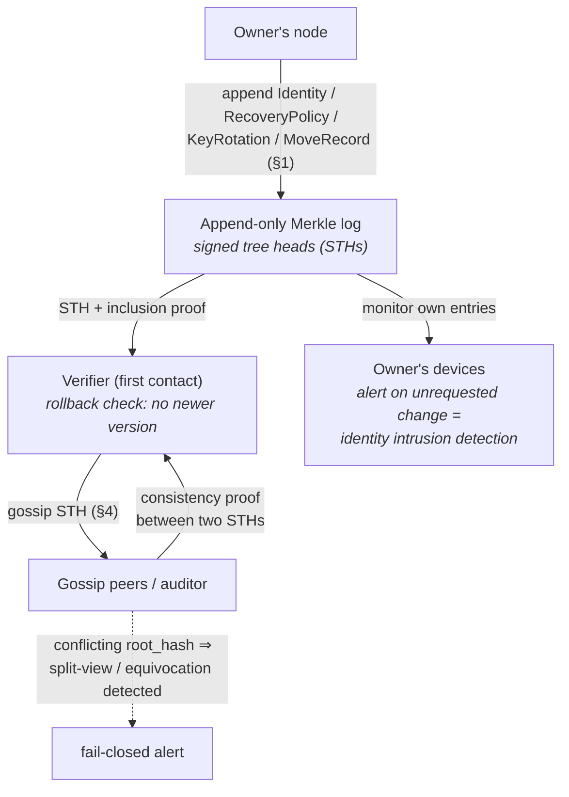

# 3. Naming & Directory (name → key)

Your **key is your identity and the only root of trust** (01-identity.md §1); a
**`name@domain`** is the everyday, human-facing pointer to it, and the mesh finds you by key.
**A conformant implementation MUST NOT treat a name as the identity** (the `identity ≠ name`
invariant, 01-identity.md §1) — DNS is *one* way to discover the pointer, never the identity and
never the proof; §3.12 generalises this to a **pluggable set of resolvers** of which DNS is only
the default. Because the key is the identity, native **delivery and verification require zero
DNS and zero name-chain** (§3.13): a name is an optional discovery convenience layered *over* an
identity that already exists and is already reachable by key. This section covers the **stable**
binding: how `abc@def.com` resolves to an identity key, how that binding is made
tamper-evident, and how it degrades safely.

**The layering (read this first).** Four layers, never conflated:

- **The key is identity and proof.** Authenticity is *always* the key (`IK`, §1.2) — nothing
  else. A name is only a pointer to it.
- **DNS (and any name backend) is *discovery*, never proof.** It tells you which key *claims* a
  name; it does not attest it. A compromised registrar can lie about the pointer, so the pointer
  is never trusted on its own.
- **Key transparency (KT) makes the `name → key` binding tamper-evident**, so a silent key swap
  by DNS/registrar/directory is *detectable* (§3.5) — **relative to a log set the verifier trusts
  independently of that record**. KT is tamper-evidence against a trusted log, not trust from
  nothing: a registrar that substitutes the key *and* the attesting log in one atomic write is
  **not** detectable at genuine first contact, which is why §3.5's bootstrap rule classifies such a
  resolution TOFU-only rather than KT-verified.
- **Pinning (TOFU) makes discovery a one-time event.** After first contact you route by the
  pinned key via the mesh (§4); DNS is not consulted again unless the signed identity chain says
  to. A later DNS/registrar compromise cannot redirect an existing relationship.

**Stable anchor, rotatable keys (the real future-proofing).** The human name binds to a
**stable identity anchor — the root identity key `IK` (§1.2)** — *not* to a rotatable
operational key. Day-to-day signing/device keys rotate *under* the identity without changing the
name; even `IK` itself can rotate, and the suite can migrate to post-quantum, without the name
changing — bridged by the signed hash chain (§1.5) and, for a change of the anchor's name, by
aliases + a signed `MoveRecord` (§1.6). So a `name@domain` **survives ordinary key rotation and
PQ migration**: the `name → key` indirection is exactly what lets the key underneath change while
the address people type stays the same. `IK` rotation is the rare migration event, not the
common case.

## 3.1 Roles (who holds what)

- **The key (`IK`)** is the identity and the sole trust root (§1.2, above).
- **DNS** (we do not run it — registrars/operators do) holds the stable `name → key` *pointer*.
  It is discovery: static and cacheable. It MUST NOT hold location (that is the mesh, §4).
- **Key transparency (KT)** makes the pointer *auditable* (§3.5).
- **The mesh DHT** holds the dynamic `key → location` record (§4).

## 3.2 DNS records

For `abc@def.com`, the resolver queries:

```
abc._dmtap.def.com.  IN  TXT  "v=dmtap1; suite=2; ik=<base64url IK>; id=<hash of Identity §1.3>;
                                kt=<KT log URL>; keypkgs=<KeyPackage bundle locator §5.3>"
_dmtap.def.com.      IN  SVCB 1 . ( ... )     ; optional service params, KT anchors
def.com.             IN  MX   ...             ; only if a legacy gateway serves the domain (§7)
```

- `ik` is the identity public key (or a hash of `Identity` that the mesh resolves to the
  full object). `id` pins the current `Identity` version (§1.3).
- Multiple `ik`/suite entries MAY appear during PQ migration (§1.1).
- DNSSEC SHOULD be enabled; it is not sufficient alone (hence KT).
- **`did:web` consistency (normative, for DMTAP-Auth §13.6).** Where the same identity is also
  published as a `did:web` document (`did.json`), that document's key MUST be **byte-consistent
  with this DNS `name → key` binding and its KT entry** (same `IK`, same `Identity` hash). A
  verifier MUST **cross-check the two and pin** (§3.4); a `did.json` is the same discovery-only
  pointer as DNS and never proof on its own.

## 3.3 Resolution

```
resolve(name):
  1. DNS TXT/SVCB lookup for name → { iks, id, kt, keypkgs }
  2. (first contact) verify against KT (§3.5): fetch a signed tree head + inclusion proof for
     this identity, and confirm no newer version supersedes it (rollback defense).
  3. fetch full Identity (§1.3) from the mesh by `id`; verify sig chain
  4. PIN (name → iks, id) locally (TOFU); offer out-of-band verification to upgrade the pin
  5. thereafter: route by key via the mesh (§4); DNS is not consulted again unless the
     pinned Identity chain says to (rotation/migration)
```

**Fail-closed on unreachable KT (normative, §12 finding).** If KT is unreachable, partitioned,
or censored at **first contact**, the client MUST NOT silently TOFU-pin an unverified key — it
MUST either refuse to pin (block) or hard-warn and require explicit user acceptance, and MUST
prefer out-of-band verification. Silent downgrade to unverified TOFU is prohibited, because it
enables an attacker to replay an old-but-validly-signed `Identity` (e.g. from before a
legitimate rotation) precisely under the network conditions that make KT unreachable. Once a key
is pinned, later KT unavailability does not block routing (the relationship is already
key-based).

DNS is the **front door, used once**. After first contact the relationship is key-based and
DNS-independent — a later DNS/registrar compromise cannot silently redirect an existing
contact.

## 3.4 Trust on first use (TOFU) + pinning

v0 trust model:

- On first resolution, **pin** `(name → ik, id)`.
- Follow the signed `Identity` hash chain (§1.3–1.6) for rotations and migrations; accept a
  new key only via a valid chain from the pinned key. During a pending **path-(b) `KeyRotation`
  veto window** (§1.5), a first-contact resolver MUST pin the **pre-rotation** `IK` and follow
  the chain to the new key only once the window elapses un-aborted (§1.5).
- Offer **out-of-band verification** (safety-number / QR comparison of `ik`, §3.4.1) to upgrade a
  TOFU pin to a verified pin.
- A key that changes *without* a valid chain MUST raise a security warning, never silently
  update.

**Honest limit:** a MITM at the *very first* contact (before KT is consulted or before OOB
verification) can substitute a key. KT (§3.5) closes this; OOB verification closes it
immediately for high-value contacts.

### 3.4.1 Safety numbers (out-of-band key verification)

Out-of-band verification compares the **key**, not the name — it is the strongest trust upgrade
and the one thing that closes a first-contact MITM immediately.

- A **safety number** (Signal-style) is a deterministic fingerprint of the parties' identities.
  Two contacts confirm they see the same value out-of-band — in person, over a trusted channel,
  or by scanning a **QR code**.
- **Computed over the whole multi-suite `Identity`, not a single key (normative).** Because a
  DMTAP identity carries **multiple suite keys** — `iks` is a map `{ suite → ik-pub }` (§1.3,
  §18.4.1), e.g. a classical `0x01` key and a PQ `0x02` key — a safety number MUST be computed
  over the **content-address of the entire `Identity` object** (`Identity_id = prefix ‖
  BLAKE3-256(det_cbor(Identity))`, §18.9.4), which **commits to every suite key** at once, not
  over any one `ik`. Fingerprinting a single suite key would let an attacker who has injected a
  **rogue additional suite key** (e.g. a forged PQ `0x02` entry) sit *behind* a pin the user
  verified only against the classical key. Taking the fingerprint over the whole `Identity`
  binds the OOB check to the full keyset, so a verified pin cannot be bypassed by adding a key.
- **Re-verification on keyset change (normative).** Adding a new suite key (or any other change
  to `iks`) is a new signed `Identity` version (§1.3) with a different content-address, so it
  **changes the safety number**. A client that holds a *verified* (OOB-confirmed) pin MUST treat
  such a change as a **downgrade of that pin to unverified** and MUST prompt the user to
  **re-verify out-of-band** before the pin is treated as verified again — exactly as an
  unchained key change raises a warning (§3.4). It MUST NOT silently carry the verified status
  across a keyset change. (A change that follows a valid signed `Identity`/`KeyRotation` chain is
  accepted for *routing* per §3.4; only the *verified-fingerprint* status resets.)
- **This is verification, not an address.** A safety number / fingerprint is *never* used to
  route or reach someone; it only confirms that the key you pinned is the key you meant. It does
  not appear in `Identity.names` and cannot be typed at to send mail.
- **Word rendering (optional).** Because digit strings are error-prone to compare aloud, a
  fingerprint MAY be rendered as a **word sequence** for easier human comparison:
  `words(fingerprint, wordlist)` over a curated **~1024-word, language-agnostic** list (short,
  pronounceable across major languages, no homophones/confusables/offensive collisions), 10
  bits/word, with a folded **checksum** so a misheard word fails closed rather than comparing as
  a different key. **Proquints** (pronounceable 5-char syllables, 16 bits each) are an allowed
  language-neutral alternative encoding of the same bits.
- The word encoding exists **only** for this verification role — a comparison aid for confirming
  an identity. It is deliberately **not** an address: DMTAP does not name people by their key
  digits. Because the safety number is taken over the full `Identity` (all suite keys, above), it
  carries the keyset's full strength; there is no separate truncated-name address to grind.

## 3.5 Key transparency (KT)

**Status: designed-in, v0 ships a minimal form; full CONIKS/Key-Transparency-style logs are
a v1 hardening.**

- The owner's identity events (`Identity`, `RecoveryPolicy`, `KeyRotation`, `MoveRecord`,
  §1) are appended to an **append-only Merkle log**.
- Verifiers obtain **signed tree heads** and **inclusion/consistency proofs**; they gossip
  tree heads to detect **split-view/equivocation** (the log showing different histories to
  different observers).
- The owner's own devices **monitor** the log for the owner's entries and MUST alert on any
  change the owner did not initiate — turning KT into **identity intrusion detection**.
- Logs MAY be federated; a verifier trusts a *set* of logs and requires consistency across
  them. No single log is authoritative.



Two profiles are defined, both registered as KT log-types (§21.19) and selected by capability
negotiation (§10.2): **v0-minimal (log-type `0x01`)** is the interoperable default every Core
node MUST implement (§10.3); **v1-hardening (log-type `0x02`)** is specified below and used only
between a verifier and a log set that advertise it. v0 stays the floor; v1 closes the
equivocation gap.

### 3.5.1 v0-minimal — the interoperable default (log-type `0x01`)

The default profile, required at **Core** conformance (§10.3), is a **single append-only Merkle
log** (§21.19 `0x01`): signed tree heads (STHs) + inclusion proofs + rollback defence (§3.3
step 2), self-monitored by the owner's own devices (STH poll, §16.2). It is
**tamper-evident-after-the-fact and self-monitorable, but not equivocation-proof** — a single,
non-gossiped log can present a **split view** (different histories to different observers, §6.6
item 6). v0 therefore fails closed on an unreachable log (§3.3, `0x0106`), and a network SHOULD
run more than one independent log and lean on OOB verification (§3.4.1) for high-value contacts
even in v0. Closing the split-view gap is exactly the job of the v1 profile.

### 3.5.2 v1-hardening — federated, gossiped, equivocation-detecting (log-type `0x02`)

The v1 profile is **specified here and negotiated as a capability** (§10.2 — a KT-log-type token
in the `system` MOTE / the `kt=` DNS anchor, §3.2). It is **not** the interoperable default:
v0-minimal (§3.5.1) remains what a Core node MUST implement, and a verifier uses v1 only with a
counterpart and log set that advertise log-type `0x02` (§21.19). v1 makes **no single log
authoritative** and turns a split view from a deterred-but-undetectable weakness into a
**detected, attributable, and responded-to** event. It has four normative parts (a)–(d); the
detection paths carry codes `0x0107`, `0x0110`–`0x0112` (§21.3).

#### (a) STH gossip — split-view detection

- **Who gossips.** Every v1 verifier (client, monitor, auditor, §3.5.2(c)) that fetches an STH
  MUST re-publish the signed head it saw — the tuple `(log signing key, tree_size, root_hash,
  timestamp, log signature)` — to a set of gossip peers (other verifiers, the owner's monitor
  devices, and any configured auditor) over the mesh (§4). Where a node has elected the opt-in,
  research-tier mixnet, it SHOULD route this gossip through it (§6, §3.7) so auditing does not
  leak *who audits whom*. **Default and bootstrap caveat (disclosed):** control traffic —
  gossip included — defaults to `fast` like every other control MOTE (§4.6); the mixnet is an
  opt-in tier a node elects, not something gossip switches onto automatically once one becomes
  reachable. Before the opt-in mixnet is available to a node at all (initial bring-up, or a
  deployment without a live fleet,
  [docs/research/mixnet.md §4.4.11](docs/research/mixnet.md)), gossip MUST be sent over the
  default `fast` tier, which **leaks the who-audits-whom graph** to a network observer. This is a
  disclosed residual of the default tier, not a bootstrap-only condition — a node that wants that
  graph hidden SHOULD deliberately elect the opt-in mixnet for its gossip once a `private` path is
  buildable, the same user-surfaced choice any other sensitive control traffic MAY make.
- **Cross-check (the detection step).** On receiving a gossiped STH for a log it also follows, a
  verifier MUST request a **consistency proof** between its own latest STH and the gossiped one
  and verify that the smaller tree is a **prefix of** the larger (a genuine append-only
  extension). Two validly-signed STHs from the same log with the **same `tree_size` but a
  different `root_hash`**, or a consistency proof that cannot be produced between two heads of
  one log, is cryptographic proof of **equivocation** → `ERR_KT_STH_INCONSISTENT` (`0x0110`) and
  `ERR_KT_EQUIVOCATION` (`0x0107`), handled per (d).
- **Freshness (freeze-attack defence).** Gossip MUST occur at least once per **KT gossip
  interval** (§16.2). A v1 log MUST publish a new STH at least every **maximum merge delay**
  (§16.2) and MUST include every accepted entry in an STH within that bound; a binding it
  accepted but did not include within the MMD is evidence of withholding/censorship. A verifier
  MUST treat an STH older than the **STH freshness window** (§16.2) as stale (`ERR_KT_STH_STALE`,
  `0x0112`) and refresh it — closing the **freeze attack** where a log serves an old but
  internally self-consistent head to a targeted observer.

#### (b) Multi-log federation — quorum-audited bindings

- **Where the log set comes from (normative — the bootstrap rule).** A quorum is only meaningful over
  a set the verifier trusts **independently of the record being checked**. A `kt=` value read from the
  *same* DNS/SVCB answer that carries `ik=` is **attacker-supplied exactly when the zone is**: an
  entity that can rewrite the record can rewrite the log set with it, stand up logs it controls, and
  satisfy any quorum against itself. A verifier MUST therefore classify the outcome:
  - **KT-verified** — only where the attesting quorum lies within a log set the verifier obtained
    **out of band**: shipped with the client, configured by its operator, or carried over from a
    previous pin for this name — **never** taken from the record under verification; or
  - **TOFU-only, NOT KT-verified** — where the only available log set is the one the record itself
    names. Resolution MAY still proceed (running a log is permissionless, §21.19), but a client
    **MUST NOT present the result as KT-verified**, and MUST surface it as ordinary first-contact
    trust (§3.4), exactly as if no KT existed.

  A `kt=` list MAY be used to *discover* logs, and to *propose* additions to a set the user or
  operator chooses to trust; it MUST NOT by itself confer verified status.
- **Pin a set, not a log.** A v1 verifier pins a **set** of logs for a name (the `kt=` DNS/SVCB
  anchor MAY list several, §3.2 — subject to the bootstrap rule above), and accepts a
  `name → ik` binding only when it appears, with a
  valid inclusion proof, in a **`> n/2` quorum** of that pinned set — the same strict-majority
  rule the group committer takeover uses (§5.1, §16.8 roster quorum). A **minority of malicious
  or partitioned logs therefore can neither forge nor suppress** a binding, and **no single log
  is authoritative**.
- **Independence.** Each log identifies itself by its own signing key (§21.19), runs its own
  append-only tree, and the set SHOULD be operated by **distinct operators** so a quorum does not
  share fate; a verifier SHOULD prefer logs under disjoint operational control (analogous to
  S/Kademlia disjoint paths, §4.2).
- **Fail closed below quorum.** If fewer than the quorum of pinned logs attest the binding
  (logs disagree, or too many are unreachable), resolution MUST fail closed →
  `ERR_KT_LOG_QUORUM_UNMET` (`0x0111`); the verifier MUST NOT pin on a sub-quorum view (the same
  fail-closed discipline as v0, §3.3). Bindings SHOULD be **cross-logged** (submitted to every
  log in the set) so the quorum is normally the whole set and auditors (below) can check each
  member log against the others.

#### (c) Monitor and auditor roles

Two distinct roles, which MAY be co-located on one operator but are separate capabilities:

- **Monitor** — watches a *specific identity's* entries. The owner's own devices MUST monitor
  **every log in the identity's pinned set** for any entry under the owner's name/`IK`, and MUST
  `HALT_ALERT` (§21.2) on any change the owner did not initiate — KT as **identity intrusion
  detection** (§3.5 preamble; the same owner-alert obligation as `0x010B`/`0x010E`). A relying
  party MAY additionally monitor the identities it depends on (e.g. a login RP, §13.7).
- **Auditor** — watches a *whole log's* integrity, name-agnostically. An auditor MUST verify
  every STH's signature and that each new STH is a **consistent append-only extension** of the
  heads it has already seen (no rewrite, no rollback of history), and MUST gossip STHs (part (a))
  so its view is cross-checkable against others. An auditor needs **no knowledge of any user's
  key** and SHOULD run the mixnet-side private path (§3.7) so auditing itself leaks no user
  identities. A conformant v1 deployment SHOULD run **≥ 2 independent auditors per log**.
- **Separation of concerns.** Monitors catch a **targeted** key-swap (one bad entry for one
  name); auditors catch **global** misbehavior (a log rewriting or forking its own tree); a
  **split view** (a log self-consistent but showing different observers different heads) is
  caught by the **gossip cross-check** of part (a), which both roles feed.

#### (d) Equivocation detection and response

- **Detection.** Any of the following is proof — under the log's *own* signature — that a log
  equivocated: (i) two validly-signed STHs of one log with equal `tree_size` but differing
  `root_hash`; (ii) two STHs of one log between which no valid consistency proof exists
  (append-only violation); or (iii) a `name → ik@version` binding attested by some quorum members
  and **contradicted** (a different `ik` for the same name and version) by others.
- **Response (normative).** On any of the above a v1 verifier MUST:
  1. **HALT** — stop treating the offending log as authoritative and MUST NOT pin or update any
     `name → ik` binding on its say-so (analogous to committer fork-detection, §5.1, §19.5.6, and
     to `0x0104`/`0x0209`).
  2. **ALERT** — raise a user-/operator-visible security alert (`HALT_ALERT`, §21.2), emitting
     `ERR_KT_EQUIVOCATION` (`0x0107`) and, for the append-only-violation form,
     `ERR_KT_STH_INCONSISTENT` (`0x0110`).
  3. **Publish evidence.** The two conflicting signed STHs (or the contradicting inclusion
     proofs) are **self-contained, transferable proof of misbehavior** — an equivocating log
     signs its own indictment. The verifier SHOULD gossip this evidence to its peers and auditors
     so the equivocation becomes **globally attributable**, not merely locally observed.
  4. **Recover on the honest quorum.** The identity stays verifiable on the **remaining honest
     quorum** of the pinned set (part (b)): if a `> n/2` quorum still agrees on the binding,
     resolution MAY proceed with the offending log **evicted** from the set and its operator
     treated as a reputation signal (as gateway/postage misbehavior is, §7.5, §9.6); if the
     equivocation breaks quorum, resolution fails closed (`0x0111`) and the verifier falls back
     to OOB verification (§3.4.1). For **DMTAP-Auth**, a split view is a silent per-RP
     account-takeover vector, so a high-value login RP MUST require this multi-log quorum or an
     OOB-verified pin (§6.6 item 6, §13.7).

Under log-type `0x02` the honest v0 limit — "tamper-evident after the fact, self-monitorable, but
not equivocation-proof" (§6.6 item 6) — is **closed**: equivocation is detected by gossip,
bounded by the federation quorum, and responded to by halt-alert-and-evict.

## 3.6 Optional: self-sovereign naming (un-loseable addresses)

DNS names can expire or be seized. For a name that is **un-loseable and un-seizable** as
long as the owner holds `IK`, DMTAP defines a pluggable **name backend** interface. A
conforming backend maps `name → ik` such that only `IK` can update the binding and it
cannot lapse without the owner's action. A name-chain (ENS-style) is one such backend.

This is the **only** place DMTAP admits a blockchain, it is **optional**, and it is confined
to the name layer — nothing else in DMTAP depends on it. Resolution (§3.3) treats a
self-sovereign name identically to a DNS name once `ik` is obtained.

## 3.7 Private lookups

Name→key lookups default to a direct query like any other `fast`-tier control traffic (§4.6);
neither the DNS resolver nor a KT log is assumed to be kept from learning *who* is asking. Where
a node has elected the **opt-in, research-tier** mixnet
([docs/research/mixnet.md](docs/research/mixnet.md), §6), it SHOULD route name→key lookups
through it to keep discovery metadata-private. This replaces heavier private-contact-discovery
schemes for v0 *when the opt-in tier is available*; stronger schemes are a v1 option.

## 3.8 Onboarding tiers (day-one setup)

The identity is a **key**; DNS is a generated, auto-managed *projection* of it, never
hand-edited. There are three onboarding tiers. A conformant client SHOULD default to Tier B
(a provider-issued `name@domain`) and never require a user to author DNS.

### Tier A — no domain (pure DMTAP)

Identity = key; the human name is a provider directory name or a self-sovereign name backend
(§3.6) that resolves directly to the key. **No DNS, no domain.** DMTAP↔DMTAP only (the legacy
world cannot resolve the name). Setup: generate key → claim a directory name → join mesh. Most
users instead pick Tier B so their address also works for legacy email.

### Tier B — gateway-owned domain (default; zero user DNS)

The user claims `alice@gw.example`; the **gateway operator owns `gw.example` and maintains all
legacy records once, for all users**:

```
gw.example        MX      → gateway
gw.example        TXT     SPF (gateway sending IPs)
sel._domainkey    TXT     gateway DKIM key
_dmarc.gw.example TXT     DMARC policy
+ *@gw.example name→key directory (service or programmatic/wildcard records)
```

The **user touches zero DNS.** DMTAP-native delivery is key-based; legacy interop works
immediately because the shared domain is pre-configured and its IPs are warmed. Per-user
legacy setup = none. The user receives an address, not a domain — a provider-issued
`you@gw.example` that is a full, first-class `name@domain` (§3.9.1).

### Tier C — vanity custom domain (auto-configured)

For `alice@yourbrand.com`, the domain's own DNS MUST carry MX/SPF/DKIM/DMARC (DMARC alignment
is defined on the `From:` domain — unavoidable while legacy exists). But it MUST NOT be
hand-edited: the provider auto-publishes the full record set via a **registrar API / the Domain
Connect standard** or by hosting the domain's DNS. The user approves once; records self-update
on key rotation.

### DKIM delegation / DMARC alignment (all legacy-facing tiers)

The domain publishes the **gateway's DKIM public key** at `sel._domainkey.<domain>`; the
gateway signs outbound with `d=<domain>`, so DKIM passes and **DMARC aligns** — Gmail/Outlook
accept it as ordinary authenticated mail. The gateway holds only a delegated *DKIM* key, never
the user's DMTAP identity key (§7.3). Inbound legacy uses the domain's MX → gateway (§7.2).

### What cannot be skipped

Exactly one thing is irreducible: **some** operator must configure **one** legacy domain
properly and **warm its sending IPs** (weeks). This is a one-time, per-domain operator task,
amortized across all users on that domain — never a per-user task.

## 3.9 Names (one identity, many pointers)

The identity is always the **key**; every name is a memorable pointer to it, and one identity
MAY hold several names at once — all resolving to the same key. DMTAP has **one recommended,
headline form** and a few optional extras. This is deliberately *not* a ladder of equals.

**Zooko's triangle, stated plainly.** A name cannot be simultaneously *human-meaningful*,
*global*, and *authority-free*. DMTAP's choice: names are human-meaningful and — through DNS
federation — global, and it pays for that with an authority (DNS/registrar). But it
**neutralizes** that authority by keeping the key the sole trust root, KT-auditing the binding
(§3.5), and pinning on first use (§3.4): the authority can help you *discover* a key, it can
never *forge* one undetected. The alternative corner (a flat authority-free name derived from
the key — the **key-name**, §3.9.6) *is* offered, but as the **zero-authority floor**, not as
the headline: it is unwieldy (an 8-word string) and, being derived from `IK`, it changes on the
rare `IK` rotation — so it is the coin-free, DNS-free fallback that no authority can take away,
never the everyday address. The two coexist: `name@domain` is the recommended human address;
the key-name is the floor beneath it that guarantees you are reachable even with no domain, no
chain, and no provider (§3.13 naming ladder).

### 3.9.1 `name@domain` — the primary human address

**`name@domain` is the everyday, recommended, headline address.** It comes in two flavours, one
format:

- **Provider-issued** — `you@envoir.org` and the like (Bluesky-style): the majority who don't
  own a domain get a familiar, handle-shaped address for free from a provider, with zero DNS work
  (Tier B, §3.8).
- **Your own domain** — `you@yourbrand.com`, for full sovereignty (Tier C, §3.8).

Why this is the headline:

- **It survives key rotation and PQ migration.** The name binds to the stable anchor `IK`, not
  to a rotatable key; the key underneath can rotate or migrate to a PQ suite and the address is
  unchanged (`name → key` indirection, §1.5–1.6). This is the real future-proofing.
- **It's federated — no global-namespace squatting.** Uniqueness is *per-domain*, so there is no
  single global registry to squat or race: `alice@a.org` and `alice@b.org` are different people,
  and neither had to win a landrush.
- **One familiar format**, shared with existing email addressing and its tooling.
- **It interoperates with legacy email for free** — the shared or owned domain carries
  MX/DKIM/DMARC (§3.8, §7), so `name@domain` is reachable from Gmail/Outlook on day one.

Authenticity is still the key: a `name@domain` is resolved (§3.3), KT-audited (§3.5), and pinned
(§3.4) — the domain only points, it never proves. For a name that cannot expire or be seized,
the same pointer can live in a self-sovereign name backend instead of DNS (§3.6), with resolution
unchanged.

### 3.9.2 `@handle` — a registered resolver type, NOT part of the naming ladder (opt-in)

**Status (normative).** The flat, global `@handle` registry is **not a rung of the naming ladder**
(§3.13.2) and is **not part of any conformance level**: the `directory` resolver type sits outside
the ladder as a registered-but-unendorsed option, for the reason given at the ladder definition
(§3.13.2, §3.12.4, §21.18). It is described here so that a deployment which wants one has a
specified shape to implement, and so that the reasons it is not endorsed are on the record.

**Why it is out of the ladder.** A flat global handle needs an **arbitrating authority** — an
entity that decides who gets `@alice` — and DMTAP's whole naming argument is that authority over a
namespace should be either **federated** (per-domain, so nobody arbitrates globally) or
**consensus-based and already-existing** (a name-chain DMTAP merely reads, §3.12.5), or absent
entirely (the key-name, §3.9.6). A DMTAP-specific handle registry would be a **new** authority
created by this protocol, which is exactly the kind of thing the rest of the design refuses to
create. That it could be made auditable does not make it unnecessary. Registration in the
resolver-type registry is not endorsement (§3.12.2) — a naming system DMTAP does not endorse is
still one it can resolve without changing anything else.

A conforming client MAY offer an opt-in `@handle` directory. Because a *chosen, globally-unique*
name requires arbitration (Zooko), such a directory MUST: assign each handle once
(first-come-first-served) with an **anti-squat cost** (a small fee or proof-of-work, since
assignment gives uniqueness but not scarcity); publish `handle → key` to a **key-transparency
log** (§3.5), so it is *auditable, not trusted* — it cannot silently repoint a handle without
detection; and be unable to **hijack existing relationships** — contacts route by the pinned key
(§1.6), so the handle is only an introduction.

**Normalisation & consortium recommendation (non-normative detail).** A directory that exists
SHOULD normalise handles (NFC, lowercase, collapse consecutive dots; dots allowed as cosmetic
separators, e.g. `@this.is.my.name`) and reserve confusables/homoglyphs, and SHOULD run as a
**federated consortium under BFT consensus** (no single owner of the namespace, no chain) rather
than a single operator; a name-chain (§3.6) is a further option.

**Honest limit (why it is not merely un-default but un-laddered):** a single global namespace
**reintroduces exactly the global squatting and impersonation that domain-federation avoids** —
every desirable handle becomes a landrush and a phishing target (`@paypa1` vs `@paypal`) — *and* it
requires someone to run the landrush. That is the unavoidable price of a flat global name, and it
is why `name@domain` and chain names are the human-shareable forms DMTAP recognises, while
`@handle` is an out-of-ladder option a deployment may take on its own account.

### 3.9.3 Petnames (local)

A user assigns **petnames** locally to contacts ("Mom" → a key). Petnames are human + zero-
authority but *local-scope only* (not global), and never leave the device cluster (they are a
social-graph artifact and MUST be stored encrypted at rest with the mailbox).

### 3.9.4 Aliases & subaddressing (one identity, many addresses)

For feature parity with legacy email, **one identity MAY hold multiple names** — all resolving
to the same key — and support subaddressing:

- **Aliases.** An identity's `Identity.names` (§1.3) is a *list*: a user can hold several
  `name@domain` addresses (provider-issued and/or own-domain) at once, optionally an `@handle`,
  all pointing to the same key. Mail to any of them arrives in the same mailbox.
- **Retaining a legacy address.** Crucially, a **legacy email address you already own can be an
  alias**: point that domain's MX/DKIM at a gateway (§7) and add the address to `Identity.names`,
  so people who only know your old `you@oldprovider.com` still reach you (via the gateway →
  MOTE), while you migrate. This is the practical migration path — you don't lose your old
  address; it becomes one of your DMTAP aliases.
- **Subaddressing (plus-addressing).** `you+tag@domain` (and, for handles, `@you+tag`) is
  supported: the `+tag` is preserved for client-side filtering/labelling but resolves to the same
  key. Catch-all (`*@yourdomain`) is a domain-owner option (tier C).
- **Security — self-asserted names need forward verification (normative).** `Identity.names` is
  **self-asserted**: an identity can *list* any string, including a **victim's address**. A listed
  name therefore proves **nothing** on its own, and a client MUST trust or display a name in
  `Identity.names` **only after verifying the forward `name → ik` binding** (DNS + KT, §3.3–3.5)
  **also resolves to this same key** — i.e. the name points back. Before accepting a name
  (especially a **legacy alias**), the client MUST require **proof of control**: a DNS challenge
  under that name, or a **KT-anchored per-name record** binding `name → ik`. A name that does not
  verify back MUST be rendered **as unverified**, never shown as an authenticated address, and MUST
  NOT be used to address mail (`ERR_ALIAS_FORWARD_UNVERIFIED`, `0x011C`, FAIL_CLOSED_BLOCK — the
  §3.9.4 rule for an identity's *own* self-asserted list, the analogue of the org-directory
  forward-verify `0x0114`). Given that check, every *verified* alias resolves to the *same key*, so
  it cannot be used to impersonate — authenticity is always the key, not the name. Adding/removing
  an alias is a signed `Identity` version, audited via the same KT (§3.5). A legacy-alias's inbound
  mail is marked *legacy-origin* (not E2E before the gateway, §7.2), so the user sees which messages
  came the old way.
- **Aliases in KT, and how a verifier resolves them to one identity (normative).** N addresses MAY
  bind to one key. The KT/directory records this as **N independent `name → ik` leaves that share
  the same `ik` and `identity_id`**: the KT leaf is `det_cbor([name, ik, version, identity_id])`
  (§18.4.9), so a random-word-combo address, a vanity address, and a bring-your-own-domain address
  on the **same key** are simply three leaves whose `ik`/`identity_id` are identical and whose
  `name` differs. Each is **independently revocable**: revoking one publishes a newer signed
  `Identity` dropping that `name` (and retires its DNS + KT binding), leaving the key and the other
  aliases **untouched and still resolvable**. A verifier **resolves any alias to the same identity**
  by the ordinary path (§3.3): resolve `name → ik`, verify the forward binding and KT inclusion,
  then fetch the `Identity` by `identity_id`; because every verified alias yields the *same*
  `identity_id`, two addresses that resolve to the same identity are recognised as **one person, one
  key** (a client SHOULD coalesce them, and pinning is per-key, §3.4). A binding an owner has
  **revoked** — present in a stale cache but retired in the current signed `Identity` / KT — MUST
  NOT be used to address the identity (`ERR_ALIAS_REVOKED`, `0x011D`, REJECT_NOTIFY); the sender is
  told to use a live alias, or the identity key itself if obtained out-of-band (QR / contact card
  / introduction, §3.13.5) — **not** the key-name, which cannot address anyone (§3.9.6) — and the
  identity's *other* aliases are unaffected.

### 3.9.5 `Profile` — human display data (self-asserted, signed)

A name is a pointer to a key; a **profile** is a pointer to *how a human is shown* — a display
name, an optional given/family name, and an avatar. Like a name, it is a **replaceable pointer,
not the identity**: the key remains the sole trust root, and a profile can be republished any
number of times without touching the identity. DMTAP carries this small, principled object so
that display data is *authenticated to the key* rather than invented by whichever server renders
it.

**The `Profile` object (§18.4.12).** A `Profile` binds an identity's `IK` to:

- `display_name` — the primary human-shown string (REQUIRED);
- `given_name` / `family_name` — OPTIONAL structured name parts (for legacy interop and sorting);
- `avatar` — OPTIONAL: an owner-set **public URL** (`avatar.url`) pointing at the image, plus an
  OPTIONAL **content address** (`avatar.hash` = `0x1e ‖ BLAKE3-256(image_bytes)`, §18.1.5) of the
  exact image bytes the owner signed.

It is **self-asserted and signed by the identity key** (`IK`, or an `IK`-authorised device key,
§1.2) — exactly the authentication model of `Identity.names` (§3.9.4): the signature proves *this
key asserts this display data*, nothing more. It carries a monotonic `version` (rollback-rejected
like `Identity.version`, `ERR_STALE_ROLLBACK` `0x0105`) and is published and pinned the same way
as the rest of an identity's data — via the directory / DNS / KT path (§3.3–3.5, §3.10.3). A
`Profile` whose `sig` does not verify under the identity's `IK` MUST be rejected
(`ERR_PROFILE_SIG_INVALID` `0x0119`, fail closed) and the prior pinned profile (or the fallback
ladder below) used instead.

**Honest scope.** A profile is display data, **not an identity-verification scheme.** A signed
`display_name` proves the *key* chose that string; it does **not** prove the person's legal name,
and a client MUST NOT present a profile field as a verified real-world identity. Impersonation is
prevented where it matters — by the key and the verified `name → ik` binding (§3.9.4) — not by
the profile. Two different keys MAY assert the same `display_name`; the key (and its safety
number, §3.4.1) disambiguates, never the string.

**Avatar tamper-evidence (normative).** The owner *hosts* the avatar wherever they like; DMTAP
does not host images. When `avatar.hash` is present, a client that fetches `avatar.url` MUST
verify the fetched bytes content-address to `avatar.hash` **before displaying them**; on mismatch
it MUST NOT display the fetched image, MUST fall back down the ladder below, and SHOULD surface a
non-blocking warning (`ERR_PROFILE_AVATAR_HASH_MISMATCH` `0x011A`, USER_WARN). This gives
tamper-evidence for the image the owner signed **without** DMTAP hosting or proxying it: a host
that swaps the bytes is caught. When `avatar.hash` is absent, the URL is a best-effort pointer
with no integrity guarantee, and a client SHOULD treat it as untrusted third-party content
(§6 metadata caveats apply — fetching a URL discloses the fetch to its host).

**Avatar fetch is untrusted-URL fetch — SSRF + tracking guard (normative).** `avatar.url` is
attacker-chosen data (any key may publish any `Profile` about itself), so a fetcher MUST treat it
as an untrusted URL, never a trusted resource:

- **Scheme.** The URL scheme MUST be `https`; a fetcher MUST NOT fetch a `Profile` avatar over any
  other scheme (`http`, `file`, `gopher`, `data`, `blob`, …).
- **No internal targets (SSRF).** A fetcher — **especially a server-side renderer** (a webmail,
  gateway, or cache that fetches on the user's behalf) — MUST NOT fetch a URL that resolves to a
  loopback, private (RFC 1918 / RFC 4193 ULA), link-local (incl. `169.254.0.0/16` and the cloud
  metadata endpoint `169.254.169.254`), or otherwise non-global address, and MUST re-check the
  resolved address after any redirect (no redirect to an internal target). A URL failing this check
  MUST NOT be fetched (`ERR_PROFILE_AVATAR_URL_UNSAFE` `0x011B`, FAIL_CLOSED_BLOCK) and the client
  MUST fall back down the ladder below. This turns an owner-set display pointer into a benign
  same-as-any-web-image fetch, not a server-side request-forgery primitive.
- **Tracking-beacon minimization.** Fetching `avatar.url` inevitably discloses the viewer's IP and
  the fetch timing to the **owner-chosen host** — i.e. an owner can use a unique avatar URL as a
  read-beacon that learns *who viewed their profile and when*. A client therefore MUST NOT fetch an
  avatar **eagerly on message arrival** (which would make mere receipt a beacon); it fetches only on
  an explicit display of that identity. When `avatar.hash` is present, a client MUST cache the
  verified image **by its content address** and SHOULD serve later renders from that cache **without
  re-fetching**, so the owner sees at most a first-view fetch, never a per-render beacon. Fetching
  through a shared caching proxy (where the deployment offers one) further blunts the IP disclosure.

**Avatar fallback ladder (normative order).** A client resolving an avatar for display MUST use,
in order:

1. **Owner-set avatar** — `avatar.url`, displayed **only if** it verifies against `avatar.hash`
   when that hash is present (above); if the hash is absent, displayed best-effort.
2. **Key-derived identicon** — a deterministic identicon rendered from the identity's public key
   (e.g. over the §3.9.6 key-name / `BLAKE3-256(ik)` bytes), so every identity always has a
   stable, unspoofable default that needs no hosting and no third party.
3. **Initials** — from `display_name` (or the name the user addresses), as a final text fallback.

**Gravatar and other email-hash avatars (OPTIONAL legacy interop, privacy-caveated).** A client
MAY, as an explicit opt-in, fall back to an email-hash avatar service (e.g. Gravatar, `MD5`/
`SHA-256` of an email address → URL) for a *legacy* address, but this MUST NOT be a default and
MUST be disclosed: it **leaks a hash of the user's email address to a third-party host** on every
render (a well-known privacy and tracking vector), and the returned image is **not** signed by
the key, so it carries none of the tamper-evidence of a `Profile` avatar. The key-derived
identicon (step 2) is the correct zero-authority default; an email-hash service is only a
convenience for interop with an existing legacy identity and ranks **below** a signed `Profile`
avatar, never above it.

### 3.9.6 Key-name — the derived, zero-authority floor (resolver-type `self`)

The **key-name** is the one name that needs **no resolver, no DNS, no name-chain, no registration,
and no `@`**: it is a **deterministic function of the identity key itself**, so anyone who holds
your key already holds your key-name, and no authority can allocate, deny, seize, or repoint it.
It is the **floor of the naming ladder** (§3.13) and the zero-authority escape hatch referenced
throughout (§3.9.4, §3.11.5): whatever else fails, you remain nameable and reachable by key-name.

- **Derivation (normative).** The key-name is a word encoding of a digest over the identity's
  **root key `IK`** (§1.2) — **whose exact preimage is pinned in §18.9.17**, because
  `Identity.iks` is a map of one key *per suite* and "`ik`" alone does not name a value. The hashed
  input is a derivation-version byte, the §18.1.5 prefix of the hash itself, and the entry at
  `Identity.anchor_suite` (§1.2.0) as raw public-key bytes — in v0,
  `BLAKE3-256(0x01 ‖ 0x1e ‖ ik_pub_bytes)`. The algorithm is committed *inside* the input so a
  future hash migration produces a **distinguishable** key-name rather than silently replacing
  every existing one (§18.9.17). Consequently an anchor-suite migration changes the key-name; an
  operational-suite migration does not. The digest is rendered as an **8-word** sequence (80 bits)
  over the same curated, language-agnostic **~1024-word list** and **folded checksum** used for
  safety-number word rendering (§3.4.1), so a single mistyped word **fails closed** rather than
  resolving to a different key. A **12-word** (120-bit) form is REQUIRED in the adversary-proof
  mode (§16.2.1). Distinct keys yield distinct key-names with overwhelming probability, which is what
  makes the key-name **globally unique without any consensus or registry** — the one Zooko corner
  (global + authority-free) a derived name can occupy, at the cost of not being human-*chosen*
  (§3.9, §15.5 Zooko's Triangle).
- **The margin is the TRUNCATION's, not BLAKE3-256's — state it, do not borrow it (normative).**
  The 8-word form is **80 bits** of a 256-bit digest, and truncation does not preserve the
  untruncated function's security level. Against a **chosen** collision — an attacker generating
  two keys of their own whose key-names coincide — the birthday bound gives ≈ **2⁴⁰** work, which
  is *trivially* reachable on commodity hardware. Against a **second preimage** — an attacker
  finding a key matching *your* already-published key-name — the bound is ≈ **2⁸⁰** work, which is
  large but is a **fingerprint-grade**, not a key-grade, margin, and is not a number to build a
  long-lived trust decision on. Calling the derivation a "collision-resistant hash" and stopping
  there borrows BLAKE3-256's property for a value that does not have it; the honest statement is
  the two numbers above. The 12-word form (§16.2.1) raises them to ≈ 2⁶⁰ and ≈ 2¹²⁰ and exists for
  exactly this reason.
- **A key-name MUST NOT be a security-relevant discriminator (normative).** Because the chosen-
  collision margin is ≈ 2⁴⁰, a client **MUST NOT** use a key-name as an allowlist or blocklist
  entry, as a deduplication or database key for identities, as a group-membership or capability
  lookup key, or as the sole basis for any trust decision. Every one of those is a *discriminator*:
  it asks "are these the same identity?", and an attacker who can produce two keys sharing a
  key-name at 2⁴⁰ work answers it wrongly at will. Identities are discriminated by **key** — the
  full `ik`, or a content address over it — everywhere a decision depends on the answer. The
  verification artifact a human compares is the **full-`Identity` safety number** (§3.4.1), which
  covers the whole multi-suite identity at its full length; the key-name is a *convenience
  confirmation* over one key at 80 bits, and the two are not interchangeable. A client MAY display
  a key-name, index a *display cache* by it, or let a user type one to look up a candidate — and
  MUST then verify the recovered key itself before acting on it.
- **A key-name VERIFIES an identity; it does not, by itself, ADDRESS one (normative — read this
  before treating a key-name as an address).** The key-name is a **one-way** function of the key:
  the 80 leading bits of the §18.9.17 digest, rendered to words. Given the key you can compute and
  confirm the name; **given only the name you cannot recover the key**, and the key is what
  addressing actually requires — the HPKE seal (§2.4), the `DeliveryTag` (§2.2a), the `recipient`
  scope of a work proof (§9.4), and the DHT lookup key `hash(ik)` (§4.2) are all functions of
  `ik`, not of its word rendering.
  So a stranger who has *only* a spoken or printed key-name holds a **checksum, not an address**.
  To open a first contact they need the identity key itself, obtained out of band — a QR code, a
  contact card, an introduction (§3.13.5) — at which point the key-name is exactly what lets them
  confirm they got the right one, which is its job. This is a real limit of the zero-authority
  floor and is disclosed as one (§6.6 item 16); an implementation MUST NOT present a bare
  key-name as a sufficient destination.
- **It is `self`-resolving (no lookup).** "No lookup" means **verification is a local derivation**
  — there is no authority to ask whether this name belongs to this key, because the binding *is*
  the key. It does **not** mean a name can be turned into a key without one. In the resolver
  framework (§3.12) the key-name is
  resolver-type **`self`**: "resolution" is a local derivation from the key, not a discovery step,
  so there is nothing to KT-audit (the binding *is* the key). It has **no `@`** and no namespace,
  because it belongs to no authority's namespace (§3.13).
- **Not a safety number.** The key-name (an addressing/identifier floor) and the safety number
  (§3.4.1, an out-of-band *verification* fingerprint over the whole multi-suite `Identity`) are
  **distinct**: the key-name identifies and confirms an identity; the safety number never routes and
  only confirms a pin. Both are word-rendered for human comparison, but they serve different roles.
- **Honest residual (disclosed).** The key-name is derived from `IK`, so it **changes if `IK`
  rotates** (§1.5) — the rare migration event, not the common case (device/operational keys rotate
  *under* `IK` without changing it, §3, and a `name@domain` is unaffected by `IK` rotation because
  it binds to the stable anchor via the signed chain). When `IK` does rotate, existing
  correspondents follow by the **pinned key** and the signed `KeyRotation`/`MoveRecord` chain
  (§1.5–1.6), exactly as for any other name; only a *new* contact who knows only the old key-name
  is affected. This is the honest price of a coin-free global-unique name — disclosed, not implied
  away (§6.6). For a chosen, un-loseable human name a user layers a `name@domain` (§3.9.1) or an
  optional self-sovereign name-chain (§3.6, §3.12) *over* the key-name; none of them replaces it as
  the floor.

### 3.9.7 Canonical name form & confusable defences (normative)

Every name form above is a string a human reads and an attacker can imitate. This subsection
fixes the **one canonical form** of a name and the two **spoofing defences** every conformant
implementation applies. Both defences carry registered error codes (§21.3).

**Canonical form (normative).** A `name@domain` has exactly one canonical form, and comparisons,
pins, KT leaves, and DNS queries all use it:

- the **local part** is Unicode-normalised to **NFC** and **lowercased**;
- the **domain** is processed under **UTS-46 / IDNA2008**, with the **A-label** (Punycode) form
  as the **canonical compared form**; DNS qnames (§3.2) are built from A-labels;
- consequently the **U-label and A-label spellings of one name are ONE identity** — they
  canonicalize to the same compared form, resolve to the same key, and MUST NOT be treated as
  two names (two pins, two KT leaves) anywhere.

**(a) Single-script-per-label rule (registration, parse, and pin time).** Each label of a name
(each dot-separated element of the local part and domain) MUST use characters of **one Unicode
script**. Characters of script `Common` or `Inherited` are exempt, and three legitimate
mixed-script combinations are admitted: **Han + Hiragana + Katakana** (Japanese), **Han +
Hangul** (Korean), and **Han + Bopomofo** (Chinese). Any other mixed-script label — the classic
`pаypal` Latin/Cyrillic homoglyph — is rejected **fail closed** wherever a name enters the
system: at registration (a provider/directory MUST NOT allocate it), at parse, and at pin
(`ERR_NAME_LABEL_MIXED_SCRIPT`, `0x0122`, FAIL_CLOSED_BLOCK, §21.3).

**(b) Pin-time confusable-skeleton check.** Before pinning a newly resolved name (§3.4), the
client MUST compute a **UTS #39-informed confusable skeleton** of the candidate name and compare
it against the skeletons of its **existing pins and petnames**. A skeleton collision with a
**different** pinned name — a candidate that looks like a contact the user already has but
resolves to a different key — is rejected **fail closed**, never pinned silently
(`ERR_NAME_CONFUSABLE_WITH_PIN`, `0x0123`, FAIL_CLOSED_BLOCK, §21.3); the client SHOULD steer
the user to out-of-band verification (§3.4.1) to establish whether the newcomer is genuine.
This is the local-trust-store complement of rule (a): (a) blocks names that are intrinsically
mixed-script forgeries; (b) blocks single-script lookalikes (`paypa1`, `rn` for `m`) *relative
to what this user already trusts*.

Neither defence weakens the invariant that authenticity is the key (§3.1): they protect the
**human comparison step** — the one place where a lookalike string, not a forged key, is the
attack.

## 3.10 Organisation & domain administration

An organisation that controls `@abc.com` needs the things a management console provides — add
users, run a directory, create distribution lists, assign admin roles, offboard people. DMTAP
provides all of them by **composing primitives it already has**, not by bolting on a parallel
system: the domain's DNS + `kt=` anchor (§3.2) is the root of authority for *names*; provisioning
a member is publishing a `name → key` binding (§3.9); the directory is a signed, enumerable
projection of those bindings; org groups are §5.8 group-identities; admin roles are §13.5
capabilities; offboarding is removing a name and revoking capabilities. The sovereignty ethic is
held throughout by one honest invariant: **the org controls names and operations, never a
sovereign member's key** — and where it *does* hold a key, that is disclosed (§3.10.2(b)).

### 3.10.1 Domain authority (what it means to control `@abc.com`)

Controlling `abc.com` means controlling its DNS zone and the `_dmtap` / `kt=` anchors (§3.2) that
state which key each `name@abc.com` points to. That control is the **root of authority for names
under the domain — and only for names, never for keys.** The authority can say *which key a name
points to* and can add or remove names, but it cannot forge, read, or impersonate anything a key
protects, because members hold their own keys (§3.10.2(a)) and KT makes every binding auditable
(§3.5).

- **Who holds it.** The domain authority is an ordinary DMTAP identity (§1.3) whose `IK` is
  published at the domain apex (`_dmtap.abc.com`) and anchored in KT. To avoid a single unilateral
  super-admin over the whole namespace, the authority's signing key SHOULD be **threshold-held by
  the domain-owner / domain-admin set**, reusing the group-key custody discipline (§5.8.6,
  FROST-style over the §1.4 machinery): rotating the domain anchor or the directory-signing key is
  a domain-authoritative act requiring a threshold, not one admin (§13.5.1).
- **Relation to onboarding tiers (§3.8).** A **Tier B** provider *is* the domain authority for
  `gw.example` and administers all its users. A **Tier C** org owning `yourbrand.com` becomes its
  own domain authority, self- or provider-operated. **Tier A** has no domain and therefore no
  domain-administration layer — it is an individual identity, not an org.

### 3.10.2 Member provisioning — two honest models

Creating `alice@abc.com` means publishing the binding `alice@abc.com → alice_ik` under the
domain: a `_dmtap` DNS record (§3.2), a KT entry (§3.5), and a directory entry (§3.10.3). Two
models differ **only in who generates and holds `alice_ik`**, and the difference is a §6.6-style
honest limit that MUST be disclosed. The default SHOULD be sovereign.

**(a) Sovereign member (default, SHOULD).** Alice generates her own `IK` on her own device; the
org merely **publishes the `name → key` binding**. The org can add or revoke the *name*, but
**cannot read her mail, cannot impersonate her, and cannot recover her key** — it never held the
key. This is the model that keeps "your key is your identity" (§1) true *inside* an org, and it is
what makes offboarding a name-revocation rather than a mailbox seizure (§3.10.5).

**(b) Org-managed member (convenience/compliance, disclosed).** The org generates and/or
**escrows** the account key (e.g. as a guardian/quorum in the account's `RecoveryPolicy`, §1.4).
This buys admin password-reset, compliance hold, and legal discovery — at the cost that **the org
CAN access the account and CAN impersonate the user.** That capability MUST be **disclosed and
machine-visible**: the directory entry and the member's `Identity` carry `custody = "org-managed"`
(§18.4.7), rendered to the user and to correspondents as an honest limit exactly like a
legacy-origin marker (§3.9.4). A message from an org-managed identity carries less individual
assurance than a sovereign one and MUST NOT be silently presented as equivalent. **Undisclosed
escrow** — an org-managed account presented as sovereign — MUST fail closed
(`ERR_ORG_MANAGED_UNDISCLOSED`, §21).

Org-managed is opt-in per account, chosen deliberately for a stated compliance need, never the
silent default. Even org-managed does not weaken transport crypto or metadata privacy (§12.3): the
org's access is via **holding the key, disclosed**, not via a protocol backdoor.

### 3.10.3 The organisation directory (GAL)

A `name@abc.com` autocomplete / global address list is a **`DomainDirectory` object (§18.4.7)**: a
signed, versioned, KT-logged enumeration of the domain's member (and group, §3.10.4/§5.8.7)
bindings. This closes the org-directory gap flagged in §17 (item 33).

- **Where it lives.** Published like any identity object — content-addressed in the mesh, located
  via the domain's `_dmtap` anchor (§3.2, a `dir=` locator), and its root **appended to key
  transparency** (§3.5) so its history is append-only and auditable.
- **Authentication.** Signed by the **domain authority** (§3.10.1), i.e. under the threshold-held
  domain key. A verifier MUST reject a directory not validly signed by the pinned authority
  (`ERR_DOMAIN_DIRECTORY_SIG_INVALID`, §21).
- **The directory cannot forge a binding (load-bearing).** Each `DirEntry`'s `name → ik` is only
  an **index**: a client MUST independently verify it against the **forward DNS + KT binding**
  (§3.3–3.5) before trusting or displaying it — the self-asserted-name rule of §3.9.4 applied to
  the org's assertion. An entry that does not resolve forward to the same key MUST be rendered
  unverified and MUST NOT be used to address mail (`ERR_DIRECTORY_ENTRY_UNVERIFIED`, §21). So the
  GAL is a *convenience enumeration of independently-verifiable bindings*, **not a new root of
  trust**: a compromised directory can withhold or mislabel names (a denial/annoyance, detectable
  via KT) but can never make mail encrypt to a key the member does not hold.
- **Query.** Members query the whole directory (autocomplete) via the domain's node; an outsider
  resolves a single `name@abc.com` the ordinary way (§3.3) and needs no directory access at all.
- **Privacy posture (membership is a choice).** `DomainDirectory.membership_visibility` (§18.4.7)
  is `public` or `members-only`, mirroring group membership visibility (§5.8.3). A `public`
  directory (a company staff page) is world-listable; a `members-only` directory serves entries
  only to authenticated members, so the *membership roster* is not a public artifact even though
  each individual `name@abc.com` remains resolvable if you already know it (the same resolvability
  legacy email already exposes). Which posture applies is an org policy choice the org MUST
  disclose to its members.

### 3.10.4 Admin roles (summary; capability machinery in §13.5.1)

Who may add/remove members, edit the directory, and manage groups is expressed as **§13.5
capabilities** delegated from the domain authority, in four roles: **domain-owner**,
**domain-admin**, **user-admin**, **group-admin** (§13.5.1). Domain-authoritative acts — rotating
the domain anchor, changing the directory-signing key — require the domain's **threshold**
(§3.10.1, §5.8.6), so no single admin is a unilateral super-admin over the namespace. The full
capability grammar, attenuation, revocation, and KT-logging are in §13.5.1. Org distribution lists
and team inboxes are in §5.8.7.

### 3.10.5 Offboarding & lifecycle

Removing `alice@abc.com`:

1. **Remove the name binding.** Publish a `DomainDirectory` version dropping her entry and retire
   the `_dmtap` DNS record for `alice` (§3.2); the removal is KT-logged (§3.5), so "who was
   offboarded when" is auditable.
2. **Revoke org capabilities.** Revoke any admin/role capabilities delegated to her (§13.5.1,
   §13.4 revocation) and remove her from org groups via the normal §5.8.2 Remove (which re-keys
   shared folders, §6.7). Losing the name does not by itself evict her from a group — that is a
   separate §5.8 Remove.
3. **Mailbox disposition — this is where the two models diverge honestly.**
   - **Sovereign member (a):** her **key survives** — the org removed only the *name*. Her
     identity, contacts, and history are hers (§1.6); she can rebind the same key to a new name
     (`MoveRecord`, §1.6) and her existing correspondents follow her by key automatically. The org
     retains nothing of hers it did not already hold, and it cannot read a mailbox it never had the
     key to. Offboarding is a **name revocation, not a mailbox seizure**.
   - **Org-managed member (b):** because the org holds/escrows the key (§3.10.2(b)), it CAN retain,
     transfer, or archive the mailbox for continuity/compliance — the disclosed cost of that model.
     A conformant client MUST have shown the user this was possible (the `org-managed` marker,
     §18.4.7) at provisioning, so retention is not a surprise.

A domain-wide teardown (the org shuts down or changes providers) is the domain-authority analog of
individual migration (§1.6): sovereign members keep their keys and re-bind their names elsewhere;
only org-managed accounts depend on the org to move them.

## 3.11 Address provisioning — tiers, aliases & delegation (normative)

§3.8 gives the onboarding tiers and §3.9 the name forms; this section states the **address-allocation
model** that sits on top of them plainly, because "who gives you a `name@domain`, and what happens
if they stop" is the everyday question. The invariant throughout: **the KEY is the identity; a
`name@domain` is a replaceable, KT-tamper-evident pointer to it (§3.9.1); the 8-word key-name
(§3.9.6) is the zero-authority fallback that no provider can take away.**

### 3.11.1 Two distinct roles (state it explicitly)

The **naming / hosting provider** and the **legacy gateway** are **different roles**, and either
can exist without the other:

- **Naming / hosting provider** — a §3.10 **domain operator** that runs the domain's `_dmtap` DNS +
  KT anchor (§3.2) and **allocates addresses to keys** (publishes `name → ik` bindings, §3.10.2),
  and MAY host the mailbox/relay for those names. Its power is over **names**, never keys (§3.10.1).
- **Legacy gateway** — the §7 SMTP bridge that translates between the mesh and legacy email. Its job
  is **interop**, and it is content-visible on the legacy leg only (§7).

**One operator MAY be both** (a provider that also runs a gateway for its domain), but a provider
that allocates names needs **no** gateway (a pure-DMTAP domain, §7.7), and a gateway needs **not**
allocate any name (it can bridge for a domain whose names another provider — or the user —
publishes). Do not conflate them: the naming authority is §3.10.1; the gateway is §7.

### 3.11.2 Provisioning tiers

| Tier | What you get | Who runs DNS/KT | Squat resistance & cost | Residual |
|:----:|--------------|-----------------|-------------------------|----------|
| **0 — provider random word-combo** | an instant, free `random-words@provider` (e.g. `amber-quartz-owl@envoir.org`) | the provider (§3.10.1) | free/instant; **squat-resistant because the localpart is provider-assigned from a large word space**, not user-chosen | availability depends on the provider; the key + key-name are the escape hatch |
| **1 — vanity reserved localpart** | a chosen `alice@provider` | the provider | a **fee** (or PoW) prices the scarcity of a short human localpart — the fee *is* the squat resistance | as tier 0 |
| **2 — bring-your-own-domain** | `alice@abc.com` on a domain you control | **you** publish `_dmtap` (Tier C, §3.8); you **self-host** the mailbox **or delegate hosting** MX-style (§3.11.3) | you own the namespace; no provider can revoke it | the domain (registrar/DNS) can lapse or be seized — mitigated by KT + pinning + optional self-sovereign backend (§3.6) |
| **3 — run your own provider / gateway** | you allocate names for yourself (and others) and/or run the §7 gateway | you | full sovereignty; you bear the operator cost (DNS, KT, IP reputation for the gateway) | none beyond your own operation |

All four tiers are **KT-protected** (§3.5) and all resolve to the **same key model** — the tier
changes *who publishes the pointer and who can revoke the name*, never what the key is or how
authenticity is proved. A conformant client SHOULD default to tier 0/1 (§3.8 Tier B) and never
require the user to author DNS.

### 3.11.3 Aliases — many names, one key (normative)

The directory/KT **MUST** allow **N addresses binding to one identity** (§3.9.4): a tier-0 random
address for signups, a tier-1 vanity address for humans, and a tier-2 own-domain address can **all
sit on one key at once**, each an independent `name → ik` leaf sharing that key's `identity_id`
(§3.9.4, §18.4.9). Each alias is **independently revocable** without touching the others or the key.
A verifier resolves **any** alias to the **same identity** by the §3.3 path — every verified alias
yields the same `identity_id`, so the client recognises one person / one key and pins per-key
(§3.4). This is the mechanism behind "keep your old address while you migrate" (§3.9.4): a legacy
address becomes one more alias, gateway-bridged (§7), on the same key.

### 3.11.4 Delegation idiom — "my domain, someone else's servers"

"My domain, someone else's servers" is **one address on your domain whose `_dmtap` record delegates
hosting/relay to a provider** — `name@abc.com` where `abc.com`'s `_dmtap`/SVCB points hosting at the
provider's node (MX-style delegation, exactly as Tier C delegates DKIM/MX to a gateway, §3.8, §7.3).
It is **NOT** a two-domain address, and the address the user types stays `name@abc.com`. Two-domain
forms are reserved for **§7 legacy bridging** (the gateway-alias `localpart.nativedomain@gateway`,
§7.10) and for **genuine provider sub-namespaces** (a provider that intentionally issues
`name@sub.provider`), never for expressing "hosted elsewhere" — delegation is a DNS pointer under
*your* name, not a change of address.

### 3.11.5 Honest residual

A **provider-issued NAME's availability depends on that provider**: if it disappears or de-allocates
the name, that *pointer* stops resolving. But the **KEY is unaffected**, every **other alias** on the
key keeps working, and the name is **re-pointable** — you rebind it (or a new one) elsewhere and
your pinned correspondents follow you by key (§1.6, §3.4). The **8-word key-name (§3.9.6) is the
zero-authority escape hatch** that no provider gates. So the tiers trade convenience for
provider-dependence **on the name only** — never on the identity, and never irreversibly. This is
disclosed, not implied away (§6.6).

## 3.12 Identity resolvers — a pluggable resolution framework (normative)

Everything above (DNS, self-sovereign backends, `@handle`, petnames, the key-name) is one
mechanism seen from several angles. This section states that mechanism **once, generically**, so
that **any present or future naming system plugs in without changing DMTAP identity, delivery, or
verification.** The framework is deliberately open-ended: DMTAP does **not** pick a winning naming
system: it picks an *invariant* (the key is the identity, §1.2, §3, `identity ≠ name`) and lets
naming systems compete *below* it.

### 3.12.1 Resolution is two steps, always

For **every** resolver type, resolving a name is exactly two steps:

1. **Discover** a `name → identity` pointer via a **resolver** — a mechanism that, given a name,
   returns a candidate identity key (`ik` / `Identity` content-address). Discovery is **never
   proof** (§3.1): a resolver can *point*, it cannot *attest*.
2. **Verify** that pointer against **key transparency** (§3.5) and pin it (§3.4) — the same KT
   machinery for all resolver types. KT is what makes the binding tamper-evident, so a lying
   resolver (a rogue registrar, a captured directory, a manipulated chain record) is **detected**,
   not obeyed. `self` (the key-name, §3.9.6) is the one type where step 1 is a local derivation
   and step 2 is vacuous — the binding *is* the key.

§3.3's `resolve(name)` is the concrete instantiation of these two steps for the DNS resolver; the
generic contract is identical for every other type. **A resolver type never introduces its own
trust root** — authenticity is always the key, verified through KT.

### 3.12.2 The resolver-type registry, and why it is open (normative)

Resolver types are enumerated in the **DMTAP Identity Resolver Types registry** (§21.18),
allocation policy **Specification Required**. Each registration MUST state four things and nothing
that touches identity:

- **(i) identifier** — the resolver-type tag (e.g. `self`, `petname`, `dns`, `name-chain`,
  `directory`);
- **(ii) name syntax** — how a name in this type is written (whether it carries an `@namespace`,
  §3.13, and what the namespace is);
- **(iii) discovery** — how step 1 obtains the `name → ik` pointer;
- **(iv) KT anchoring** — how the binding is anchored in and verified against key transparency
  (§3.5), or, for a derivational type, why verification is vacuous.

**Extensibility (normative, load-bearing).** The resolver set is **open and extensible**: a new
naming system is added **solely by registering a new resolver type** — **nothing else in DMTAP
changes.** Identity (§1), delivery (§2, §4), and verification (§3.4–§3.5) are defined over **keys**,
never over any resolver, so **if a better naming system than DNS or a name-chain emerges, it is
added as a new resolver type and every existing identity, message, pin, and proof keeps working
unmodified.** A conformant implementation MUST treat the resolver set as extensible: it MUST NOT
hard-wire naming assumptions into identity or delivery, MUST accept that a name it cannot resolve
(a resolver type it does not implement) is simply *undiscovered by this node*, not invalid, and
MUST NOT **guess** a binding for an unrecognized resolver type — a name in an unimplemented or
unregistered resolver type is treated as unresolvable and **fails closed**
(`ERR_RESOLVER_TYPE_UNSUPPORTED`, `0x011F`; the same "unknown ⇒ reject, never guess" discipline as
an unknown suite §1.1 or unimplemented transport substrate §4.1/§21.24), while the identity remains
fully reachable via any resolver type — and always via the key-name floor (§3.9.6) — that the node
*does* implement.

### 3.12.3 Multi-resolver discovery — resolvers cross-check each other (normative)

Because **KT anchors every binding to the same key**, resolvers are not merely alternatives — they
are **mutual auditors**. A client MAY query several resolvers for one name **in parallel** (e.g. a
`name@domain`'s DNS pointer *and* a name-chain record the owner also publishes for the same name).
Since a genuine identity has exactly one key, **independent resolvers MUST agree on the resolved
`ik`.** Disagreement — two resolvers returning **different keys** for the same name — is **surfaced
as a potential attack**, never silently reconciled to one: the client MUST NOT pin, MUST raise a
security alert, and MUST fall back to KT-quorum (§3.5.2(b)) or out-of-band verification (§3.4.1) to
decide the true key (`ERR_RESOLVER_DISAGREEMENT`, `0x0120`, HALT_ALERT).

**The cross-check runs only over *step-2-verified* pointers (normative — no bogus-record DoS).**
The agreement test applies **exclusively** to pointers that each **independently passed step 2**
(§3.12.1: KT verification per §3.5, and — for a name-chain — bidirectional binding per §3.12.5(b)).
A pointer that **fails its own step 2** is **discarded as unresolved** under its own error
(`ERR_NAMECHAIN_BINDING_UNVERIFIED` `0x011E`, `ERR_DIRECTORY_ENTRY_UNVERIFIED` `0x0114`,
`ERR_KT_LOG_QUORUM_UNMET` `0x0111`, etc.) — it becomes **"one fewer resolver,"** **not** a
"disagreeing peer." Consequently `0x0120` is raised **only** when **two or more** pointers *each
pass* step 2 yet resolve to **different** keys — a genuine equivocation across trusted channels.
This closes the availability attack where an adversary who can publish **one** bogus record (a
stray `.eth` entry, a poisoned directory row) would otherwise make a victim's name
`HALT_ALERT`-halt everywhere: the bogus pointer never clears step 2, so it is dropped, and
resolution proceeds on the surviving verified pointer(s). An attacker must still corrupt **every**
*verified* channel *and* the KT quorum consistently — strengthening, not weakening, the
anti-equivocation posture of §3.5.

### 3.12.4 The resolver types defined today

| Type | `@`? | Discovery (step 1) | KT anchoring (step 2) | Where specified |
|------|:----:|--------------------|-----------------------|-----------------|
| **`self`** (key-name) | no | **derive** `BLAKE3-256(ik)` → 8-word name; no lookup, no authority | vacuous — the binding *is* the key | §3.9.6 |
| **`petname`** | no | **local** label a user assigns after contact exchange/introduction; no global lookup | vacuous — bound to an already-pinned key | §3.9.3 |
| **`dns`** (DNS + KT) | yes (`local@domain`) | `_dmtap` TXT/SVCB record (§3.2), a **discovery pointer, not a trust root** | forward `name → ik` verified in KT (§3.3, §3.5) | §3.2, §3.5, §3.11 |
| **`name-chain`** (crypto, OPTIONAL) | yes (`local@.eth`/`.sol`) | read the chain's on-chain `name → ik` record (read-only) | bidirectional key↔name binding, KT-audited (below) | §3.6, §3.12.5 |
| **`directory`** (`@handle`) — **registered, NOT in the ladder** | the `@` is the marker | a thin, KT-audited global handle registry (§3.9.2) | `handle → ik` in a KT log (§3.5) | §3.9.2 |

**The ladder is `self` → `name-chain` → `dns`** (§3.13.2). `dns` is the **default and recommended**
resolver (human-meaningful, federated, legacy-interoperable `name@domain` without a chain, §3.9.1);
a **provider** that runs `_dmtap` DNS + KT for its domain and allocates `alice@provider.com` (free
random / paid vanity, §3.11 tiers) is simply **a provider operating the `dns` resolver for its own
domain** — not a new namespace protocol, just the provider-tier machinery of §3.10–§3.11. `self`
and `petname` are the two **zero-authority** types (no `@`, no lookup, no registration); they are
always available and are the reason identity and delivery need no naming system at all (§3.13).

**`directory` is registered but out of the ladder** (§3.9.2, §3.13.2): its presence in the
registry is what extensibility means — **registration is not endorsement** (§3.12.2) — and an
implementation that does not support it simply treats such a name as undiscovered
(`ERR_RESOLVER_TYPE_UNSUPPORTED`, `0x011F`), never invalid.

### 3.12.5 The `name-chain` resolver type — OPTIONAL, with four guardrails (normative)

A crypto **name-chain** is offered for the **one** thing DNS and key-names cannot give: a **bare,
globally-unique, human-*chosen* username**. Two name-chains are registered and supported today —
**ENS `.eth`** (Ethereum; free/instant gasless *off-chain subnames* via CCIP-Read/ENSIP-10, or a
full on-chain name for self-owned trustlessness) and **SNS `.sol`** (Solana Name Service; cheap and
fast). Further chains are added purely by registration in §21.18 — the protocol hard-wires none. Global uniqueness of a chosen string requires consensus (Zooko's Triangle,
§3.9, §15.5), and a name-chain is the consensus mechanism. It is admitted **only** as one resolver
type among several, bound by four normative guardrails:

- **(a) Optional, never required.** A name-chain is **one resolver among several**, never a
  dependency of DMTAP. Identity, delivery, and verification work fully with **no** chain (§3.13);
  nothing in the protocol *requires* a chain, and a deployment that admits none is fully conformant.
- **(b) Identity is still the key — bidirectionally bound.** A chain name is a **label pointing at
  the DMTAP key**, not the identity. The binding MUST be **bidirectional**: the **key claims the
  name** (the name appears in the owner's self-asserted `Identity.names` and forward-verifies,
  §3.9.4), **and** the **chain record points at the key** (the on-chain `name → ik` record resolves
  to the same `IK`). A name-chain resolution where these two directions disagree — a chain record
  naming a key that does not claim the name, or a claimed name whose chain record names a different
  key — MUST fail closed (`ERR_NAMECHAIN_BINDING_UNVERIFIED`, `0x011E`), and the name MUST be
  rendered unverified and MUST NOT be used to address mail. The chain, like DNS, is a
  **discovery pointer that KT audits**, never a trust root.
- **(c) Resolving is free and read-only.** Looking someone up by their chain name, and messaging
  them, requires **no wallet, no token, and no transaction** — resolution reads a public record.
  **Only the registrant pays, once,** to *claim* the name. A recipient never needs on-chain assets
  to be reachable at their chain name.
- **(d) DMTAP has no token of its own.** DMTAP **resolves** names from **existing** chains exactly
  as it resolves DNS; it does **not** define, mint, require, or endorse any coin or token, and a
  name-chain resolver MUST NOT introduce a DMTAP-level payment path. Multiple chains are supported
  **through the resolver-type registry** (§21.18) — DMTAP does **not** hard-wire a single chain.

**Honest residuals (disclosed, §6.6).** Registering a chain name **costs money and needs a wallet**;
on-chain `name → ik` bindings are **public and typically permanent**; and you **inherit that chain's
decentralisation, governance, and fee risk** (congestion, fee spikes, a captured registrar
contract, chain deprecation). These are real costs, which is exactly why the name-chain is the
**optional** path and the **coin-free floor is key-names (§3.9.6) + DNS-provider names (§3.11)**. If
a chain degrades or disappears, the identity is unaffected and **every other resolver — key-name,
DNS, another chain — still resolves it** (§3.12.3); the name-chain is additive, never load-bearing.

## 3.13 Operation without DNS — the naming ladder & the `@` marker (normative)

This section states plainly what the framework buys: **DMTAP identity, delivery, and verification
require zero DNS and zero name-chain.** Names are optional discovery conveniences layered over an
identity that already exists and is already reachable by key.

### 3.13.1 `@` is a namespace marker, not a delivery requirement

**Native delivery is always to a key** (§2, §4): the mesh routes by the pinned identity key, and a
MOTE is addressed to a key, never to a string. The `@` sign is therefore a **namespace marker**,
not a routing requirement — it appears **only** for a **namespaced name** `local@namespace`, where
`namespace` is any resolver type that *has* a namespace: a **DNS domain** (`alice@provider.com`), or
a **crypto name-chain** (`alice@.eth`, `bob@.sol`, `carol@.hns`), or the opt-in handle registry
(`@handle`). Addressing by **key-name** (self-contained, resolver-type `self`, §3.9.6) or by
**petname** (local, resolver-type `petname`, §3.9.3) carries **no `@`**, because neither belongs to
any authority's namespace. Seeing an `@` tells you *which resolver namespace* to look in; its
absence tells you the name is self-contained (key-name) or local (petname) and needs no lookup at
all.

### 3.13.2 The naming ladder

The shareable name forms are a **ladder from zero-authority floor to human convenience**, not a set
of equals — every rung resolves to the **same key**. **The ladder is: key-name → chain name → DNS
domain.**

1. **Key-name** (floor — `self`, §3.9.6): derived from `IK`, **no DNS, no chain, no registration,
   no `@`.** Always available; the guarantee that you are nameable and reachable with nothing but a
   keypair. **Costs nothing and cannot be taken away** — and is not socially shareable (§3.13.4).
2. **Chain name** (`name-chain`, §3.6, §3.12.5): a human-*chosen*, globally-unique name in an
   **existing** consensus namespace DMTAP merely reads (`alice.eth`, `alice.sol`). No registrar can
   revoke it and no provider gates it; **the registrant pays once** to claim it, and resolution is
   free and read-only for everyone else (§3.12.5(c)). Optional, never required.
3. **`name@domain`** (`dns`, §3.9.1): the **recommended everyday** address — human-meaningful,
   federated, legacy-interoperable, and the only form the old email world can route to. It rests on
   a registrar (an authority, neutralized by KT + pinning, §3.5, §3.4) and on continued payment of
   a renewal fee.

**Not rungs, deliberately.** A **petname** (§3.9.3) is a *local* label with no global scope — it is
how you refer to a contact, never how anyone refers to you — so it is a convenience beside the
ladder, not a step on it. A **`@handle`** (§3.9.2) is a registered resolver type but **not part of
the ladder at all**: DMTAP's identity substrate is DNS + cryptographic names only. A **gateway
alias** (§7.10) is not a name in this sense either — it is a legacy-boundary artifact in someone
else's namespace, and a client MUST NOT present one as the user's address (§7.10.6).

Climbing the ladder adds **discoverability and human-friendliness**; it never adds anything to
**identity, delivery, or verification**, which are complete at rung 1. A user with no domain, no
chain, and no provider is a full first-class DMTAP identity — and §3.13.4 states plainly what such
a user does *not* have.

### 3.13.3 Name changes are non-events (continuity)

Because every rung points at the same key, **changing the name — a new domain, a new provider, a
new vanity handle, a switched or dropped name-chain, even a rotated `IK` (§1.5) that changes the
key-name — is a change of *label*, not of identity** (§1.6). Existing correspondents route by the
**pinned key** and follow a signed `MoveRecord` (§1.6, §3.4); they cannot be redirected by a forged
move (§1.6) and are unaffected by which resolver the owner uses this week. Only a *new* contact who
knows solely an abandoned label is affected — the same, unavoidable tradeoff as giving up any name,
with **identity and all existing relationships preserved.** This continuity is precisely what the
`identity ≠ name` invariant (§1, §3) and the pluggable resolver framework (§3.12) exist to
guarantee.

### 3.13.4 The honest residual — there is no free, human-shareable, user-owned name

Every other honest limit in this specification is about privacy or availability. This one is about
naming, and it is not papered over:

**A user who will not pay anybody has no name they can comfortably say out loud.** Concretely:

- **The key-name is free and unrevokable, but it is not socially shareable.** An 8-word phrase
  (§3.9.6) cannot be said across a table, printed on a card, or typed from memory the way
  `alice@example.com` can. It is excellent as a *verification* artifact and as a *machine* address;
  as a name humans hand each other, it is not usable, and pretending otherwise would be the kind of
  claim this document exists not to make.
- **A DNS domain costs money, every year, forever.** It is the recommended everyday form (rung 3)
  and it is a recurring bill plus a registrar who could, in principle, take it away.
- **A chain name costs money once, plus a wallet and a chain's fee dynamics** (§3.12.5 honest
  residuals). Cheaper over time than a domain, but not free, and not legacy-routable.
- **A free user's shareable name is therefore a third-party gateway alias** (`alice@gw.example.net`,
  §7.10.5) — **and that is not portable**: it lives in someone else's namespace, it can be revoked
  or de-allocated, and switching gateways means changing the address and re-telling everyone
  (§7.10.6 tier 3).

**What DMTAP does about it, and what it does not.** It guarantees the things that *can* be
guaranteed without an authority: you are always **nameable** (key-name), always **verifiable**
(§3.4.1, §3.5), always **reachable *by anyone who has your key*** (§4.2), and always
**deliverable-to** (§9.7a) — with no domain, no chain, no provider, and no money.

**The qualifier on "reachable" is load-bearing and was previously missing.** Reachability is a
function of the **key**, not the key-name — a one-way digest that cannot be turned back into a
key (§3.9.6); a stranger holding only the key-name has a checksum, not an address, and must
obtain the key out of band (§3.13.5). A correspondent who already has your key reaches you by the
§4.2.1 ladder — piggybacked location, cache, rendezvous set — and never needs an authority, which
is the guarantee. The only mechanism that could close the stranger's gap for a key-name-only
identity is a DHT lookup keyed on `hash(ik)` — which this specification deliberately relegates to
**opportunistic use only** and says no relationship should depend on (§4.2.1), for the reasons
§4.2's own CAUTION gives. Claiming unqualified reachability while the mechanism providing it is
the one the document elsewhere tells you not to rely on would be exactly the kind of overclaim
§6.6 exists to prevent. See §6.6 item 16.

It does **not** guarantee that you have a short,
memorable, human-shareable string that nobody can take from you, because **Zooko's triangle says
that string cannot exist without an authority or a consensus**, and DMTAP declines to invent
either (§3.9, §3.9.2, §15.5). The gap is real, it is structural, and the honest thing is to name it
rather than to route around it with a registry the protocol would then have to defend.

**The practical consequence for clients (SHOULD).** Because the gap is closed most cheaply by a
domain — which simultaneously solves naming, legacy addressing, and portability (§3.13.5 item 4) —
a client SHOULD surface acquiring one **early**, and MUST NOT present a gateway alias as an
equivalent outcome (§7.10.6 rule (i)).

### 3.13.5 Cold start — a brand-new identity with nothing (normative)

The naming ladder and the anti-abuse floor both assume a user who already has *something*. A user
who has just installed a node has **nothing**: a key-name nobody can use to find them, **no
contacts**, so the contact-bootstrap path (§4.2.2 item 1) is empty, and **no measurements**, so
locally-measured gateway reputation (§7.5) has no data. Every mechanism that makes DMTAP work
gracefully is downstream of a first relationship. This subsection specifies how the first one
happens.

1. **Out-of-band introduction is the PRIMARY first-contact path (normative).** A QR code shown on
   one screen and scanned by another, an invite link, or a contact card carries: the identity key,
   a peer hint (§4.2.2 item 4), and — because the channel is physical or already-trusted — **key
   verification for free** (§3.4.1). A client MUST implement at least one such exchange, and SHOULD
   present it as the *first* thing a new identity does. It works with **zero infrastructure**: no
   DNS, no chain, no KT lookup, no gateway, no rendezvous node, no bootstrap set — two devices and
   a camera, or one link. Nothing else in this specification is that robust at time zero, and the
   thing it produces (a mutually-verified contact) is precisely the input every other mechanism
   wants: contacts *are* the bootstrap set (§4.2.2), a mutual contact makes a vouch possible
   (§9.7), and a pinned key needs no resolver ever again (§1.6).
2. **Then local discovery, then the `BootstrapSet`** — the remaining rungs of §4.2.2, in that
   order, for a user with nobody to scan a code with.
3. **Cold contact still works without any of it.** A stranger who knows only a key-name can reach a
   recipient's requests area with a work proof alone (§9.7a) — the zero-relationship floor exists
   exactly so that "I have no introduction" is not the same as "I am undeliverable."
4. **A client SHOULD surface acquiring a domain early.** One step — buying a domain and pointing
   `_dmtap` at the key (§3.2, Tier C §3.8) — resolves **three** cold-start problems at once: a
   human-shareable name (§3.13.4), a legacy-routable address needing no alias (§7.10), and
   portability across gateways (§7.10.6 tier 1). It is the single highest-leverage action a new
   user can take, and a client that hides it behind an "advanced" screen is optimizing the wrong
   first five minutes. It MUST be presented as optional (nothing in DMTAP requires it, §3.13) and
   with its cost stated (§3.13.4).
