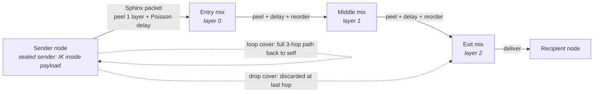
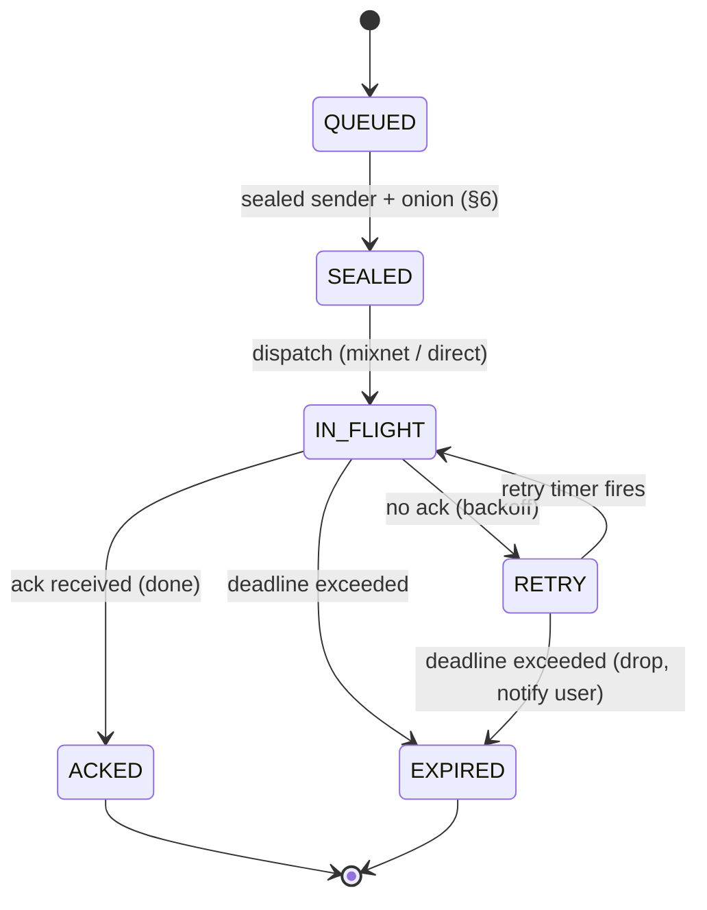

# 4. Transport: Mesh, Mixnet, Delivery

The mesh finds you and moves ciphertext to you; the mixnet hides who is talking to whom.
The node **is** the mesh — relay and mix roles are capabilities of the node binary, not
separate services.

## 4.1 Substrate: libp2p

DMTAP builds on **libp2p** rather than reinventing P2P:

- **Kademlia DHT** — peer routing and the `key → location` record store (see §4.2 for its
  security limits — it is the weakest link).
- **Circuit relay v2** — reachability for NAT'd nodes (the "relay" role).
- **AutoNAT v2 + DCUtR (hole punching)** — direct connections where possible.
- **Noise** (or TLS 1.3) — hop-by-hop channel security (in addition to end-to-end MOTE
  encryption; QUIC carries TLS 1.3 natively).
- **QUIC / TCP / WebSocket / WebRTC / WebTransport** transports.

A node dials **outbound** and holds connections, so CGNAT/dynamic-IP nodes are reachable.

**Substrate seam — libp2p is v0, not a flag day (normative).** libp2p is DMTAP's **v0 substrate**,
but the protocol MUST NOT be *permanently* wedded to it: the `LocationRecord` (§4.2, §18.5.1)
carries an explicit **`substrate` discriminator** — a tag from the **Transport Substrates
registry** (§21.24) — and its `peer_id` / `addrs` are interpreted **relative to that substrate**.
v0 defines exactly one value, `0x01 = libp2p` (peer id = libp2p PeerId, addrs = multiaddrs), and
an absent `substrate` field means libp2p for backward compatibility. A future non-libp2p overlay
is introduced by **registering a new substrate tag** and advertising support via capability
negotiation (§10.2) — the **same additive, dual-stack migration mechanism as a new crypto suite**
(§1.1, §21.25): a resolver dials a record only on a substrate it implements, nodes bridge during
the transition, and the old substrate is retired only once no pinned relationship needs it. A
record on a substrate a resolver does not implement is simply unreachable to it (`0x0303`), never
a parse failure. This keeps `multiaddr` + the registered substrate tag as the abstraction seam so
moving off libp2p is an incremental migration, not a flag day.

**Roaming — honest note:** identity is a persistent keypair, not an IP. When a node's address
changes, roaming is carried primarily by **re-publishing the location record (§4.2) and peers
re-dialing**, not by QUIC connection migration. QUIC migration (RFC 9000) *can* preserve some
live connections, but the Rust QUIC stack (`quinn`) has no multipath and address-change
handling is imperfect; do not rely on it for seamless roaming.

## 4.2 The `key → location` record (DHT)

```
LocationRecord {
  ik:        bytes,        // identity key (DHT key = hash(ik))
  peer_id:   bytes,        // node id, interpreted per `substrate`; MUST be per-epoch unlinkable (below)
  addrs:     [* multiaddr],// current reachability hints (may be relay circuits, mix addrs)
  seq:       u64,          // monotonic sequence number; reject older-or-equal (rollback defense, §16.2)
  ttl:       u64,
  ts:        u64,
  substrate: u8,           // OPTIONAL transport-substrate tag (§21.24); absent ⇒ 0x01 libp2p (§4.1)
  sig:       bytes,        // signed by a device key
}
```

**`peer_id` MUST be per-epoch unlinkable (normative) — the PQ-harvest mitigation.** A node MUST
derive its `peer_id` freshly per **location epoch** (§16.2) rather than holding one stable node
identifier across its lifetime, so that a `peer_id` observed at time *T* cannot be linked to the
same node at *T + Δ* by the identifier alone. This is cheap — a per-epoch keypair, rotated on the
same cadence the record is already republished — and it is what bounds the **harvest-now,
decrypt-later** exposure of the mixnet's routing layer.

The reasoning is spelled out in §4.4.12 and is worth restating here because this field is where
the defense actually lands: v0 Sphinx uses X25519 for the header group element, so an adversary
recording `private`-tier traffic today and holding a cryptographically-relevant quantum computer
later could recover **per-hop routing** across its whole recorded corpus — retroactive
social-graph deanonymization, precisely the graph the mixnet exists to hide. A standardized
PQ mix-packet format does not exist yet and DMTAP does not invent one (§4.4.12). But the *harm*
is not the route; it is that the route names a **durable identity**. Making `peer_id` ephemeral
by construction means a route recovered in 2040 resolves to an identifier that expired in 2026 —
the harvested graph is a graph of expired pseudonyms. The residual (an adversary that also
recorded the DHT record binding `ik → peer_id` for that epoch can still re-link) is bounded by
the same epoch window and by routing that record through the private lookup path of §3.7. Cheap,
available today, and it converts the worst harvest-now exposure in the protocol into a
time-bounded one while the packet format catches up.

The record follows the **IPNS pattern**: a self-certifying **value record** (DHT key =
hash(ik)), signed, with a **monotonic sequence number + EOL/TTL** to defeat rollback/replay,
stored at the **K closest peers**, and **aggressively republished** (DHT record lifetimes are
short — hours — so staleness is a real failure mode). Use value records, not provider records.

### CAUTION — signing does NOT stop eclipse attacks (the DHT is the weakest link)

Signing authenticates record *content*, not *routing*. Because a libp2p PeerId is
`hash(pubkey)`, an attacker can cheaply generate IDs closest (XOR-distance) to a target key,
fill honest routing tables, and control all lookups for that key — returning nothing or an
*old, still-valid signed* record (censorship / rollback) **without forging anything**. This is
a Sybil/eclipse attack at the routing layer, and it is the single most attackable part of
DMTAP. Mitigations DMTAP REQUIRES/RECOMMENDS:

- **S/Kademlia disjoint-path lookups** (parallel, node-disjoint) and **IP-diversity caps** per
  k-bucket.
- **Aggressive republish** + accept only records with a newer sequence number (rollback
  defense).
- Closed/organizational deployments SHOULD use a **private DHT** (own protocol prefix) to
  shrink the Sybil surface.

**IP-diversity caps do not survive IPv6 (disclosed).** The per-k-bucket IP-diversity cap above is
a real defense against an IPv4 adversary, where addresses are scarce and costly. It is **close to
worthless under IPv6**: a single routine allocation yields a /64 — 2⁶⁴ addresses — so per-address
and even per-/64 caps can be defeated for free, and an adversary renting commodity capacity can
mint effectively unlimited distinct-looking peers. Diversity counting therefore MUST be done at a
granularity money cannot trivially multiply — **per announced BGP origin ASN**, and per /48 at
the finest — not per address. This is the same reasoning that drives the ASN-diversity rule for
mix path selection (§4.4.8), and for the same reason: the scarce resource is network
*provenance*, not addresses.

### 4.2.1 Resolution order — the DHT is an accelerator, never a dependency (normative)

Because the DHT is the protocol's most attackable surface and an adversary with rented capacity
can attack it cheaply, DMTAP structures `key → location` resolution so that **no established
relationship ever depends on it.** A resolver MUST try, in order:

1. **Piggybacked location (the primary path).** Every MOTE carries its sender's current signed
   `LocationRecord` alongside the payload (§18). A correspondent therefore learns the sender's
   fresh location **from the correspondence itself**, with no lookup of any kind. An active
   relationship is **self-maintaining**: as long as two parties exchange messages more often than
   either changes address, neither ever performs a location lookup, and no third party — DHT,
   rendezvous, or directory — is involved in routing between them at all. This is the common case
   by a wide margin, and it is entirely lookup-free.
2. **Cached direct addresses** from the pinned relationship, with the record's `seq`/`ttl` rules.
3. **The home rendezvous set.** An `Identity` (§1.3) MAY name a small set of **rendezvous nodes**
   that hold a reservation for the owner and will answer a signed location query for them. The set
   SHOULD contain **≥ 3 nodes under disjoint operators** (the same attested-operator discipline as
   §4.4.8 and the KT log set of §3.5.2(b)), so no single rendezvous operator can censor or
   equivocate about the owner's location, and a resolver SHOULD cross-check the records returned
   by different members and treat disagreement as it treats resolver disagreement (§3.12.3).
4. **The DHT — opportunistic only.** Used solely for a genuinely cold contact for whom no
   piggybacked record, no cache entry, and no rendezvous set exists. A record obtained **only**
   from the DHT MUST be treated as a **hint**: it is usable to attempt a connection, but the
   identity at the far end is authenticated by the pinned `IK` as always (§3.4), so a poisoned
   DHT answer yields an unreachable or unauthenticated peer, never a wrong-but-accepted one.

**What this buys.** The eclipse attack described above is an attack on *lookup*. Steps 1–3 remove
lookup from every path that matters: established correspondence never looks up, and cold contact
resolves against attested, operator-diverse rendezvous nodes rather than an open keyspace anyone
can crowd. The DHT survives as a bootstrapping convenience whose failure degrades reach for
strangers rather than breaking the network — which is the only role a permissionless keyspace can
safely hold in a system that must resist a well-funded adversary.

### 4.2.2 Bootstrap — how a node finds its first peer (normative)

A node with no peers, no cache, and no contacts must reach the network somehow, and **whatever
answers that question is the most centralizing component in any P2P system** — it is consulted by
every node exactly when the node can verify nothing. Leaving it unspecified does not avoid the
centralization; it guarantees it, because every implementation then hardcodes its own vendor's
addresses and those addresses become load-bearing infrastructure nobody chose. DMTAP therefore
specifies bootstrap explicitly, in priority order:

1. **Contacts are the bootstrap set (primary).** A node that has *ever* pinned a contact (§3.4)
   already holds signed, verifiable peers: its correspondents' nodes and their last-known
   addresses. It MUST attempt these **first**. This path is per-user, unenumerable by an outsider,
   requires no infrastructure, and cannot be seized — nobody else knows or controls who your
   contacts are. For every node past its first day, this is the whole answer.
2. **Local discovery.** mDNS / DNS-SD on the local link, for the same-LAN, air-gapped, and
   community-network cases (§4.8).
3. **A signed, multi-operator `BootstrapSet`.** For a genuinely first-run node with no contacts,
   implementations ship a `BootstrapSet`: a signed, versioned, KT-anchored list of long-lived
   entry nodes. Normative constraints:
   - It MUST name **≥ 3 disjoint nodes under ≥ 3 disjoint announced BGP origin ASNs**; a list whose
     entries all sit in one network is non-conformant, because it is indistinguishable from a
     central server. **ASNs, not operators, deliberately:** running a bootstrap entry is an
     ordinary node role needing no scarce resource and no attestation (§0.2.2, §14.1), so requiring
     *attested operators* here would impose a credential on the one path a brand-new network has to
     have working on day one — and would be unsatisfiable at launch, when there are nodes but no
     operators. ASN-disjointness delivers the property that actually matters (no single network,
     datacenter, or legal order controls every entry point) and is checkable from the addresses in
     the list itself.
   - It MUST be **user-inspectable and user-overridable** in the client, and the client MUST
     surface which entry it actually used.
   - It is **discovery only, never trust**: a bootstrap peer can introduce a node to the network
     and can withhold, but every identity learned through it is verified against KT and pinned
     exactly as any other (§3.3). A hostile bootstrap peer yields no peers, never wrong ones.
   - Its role **ends permanently after first successful contact**: once a node has peers, it MUST
     prefer path 1 and MUST NOT re-consult the `BootstrapSet` while any known peer is reachable.
4. **Out-of-band introduction.** A QR code, an invite link, or a contact card carries a peer hint
   directly (§3.4.1), which is also the strongest first-contact path because it comes with
   out-of-band key verification for free.

**The invariant:** bootstrap is consulted **once, at birth**, and never again for the life of the
node. A design where nodes must periodically return to a well-known set has a permanent central
dependency no matter what the ownership of that set looks like.

## 4.3 Reachability ladder

Try in order; fall down only as needed:

1. **Direct** — IPv6, or IPv4 with port-forward/UPnP. No relay.
2. **Hole-punch** — DCUtR between two nodes (both online; always true for always-on boxes).
3. **Circuit relay** — a public-IP node relays; ciphertext-only, content-blind.

As IPv6 spreads, rungs 1–2 dominate and the relay role fades. Downtime is covered by
sender-retry (§2.6) and optional **peer buffering** (buddy nodes hold ciphertext during an
outage) — no central buffer required.

> **This ladder is the node's NATIVE, node↔node reachability** — it carries ciphertext-only,
> content-blind mesh traffic between DMTAP nodes and never speaks a legacy protocol. It is
> **distinct** from the **legacy-client reachability ingress** on the **gateway** (§7.15,
> §8.2), which accepts a raw legacy connection (e.g. an iPhone Mail app over IMAP/TLS) and
> **terminates** it. The Circuit Relay v2 role here (rung 3) is the NATIVE mesh relay and stays
> on the node; the legacy ingress is a gateway edge surface for clients that cannot speak the
> mesh. Do not conflate the two "relays."

## 4.4 The mixnet (metadata privacy)

The `private` tier (the production default for all mail and every control MOTE, §4.6, §10.3) is a
**mixnet**: MOTEs travel as **Sphinx-format**, constant-length, onion-wrapped packets through a
sequence of **mix nodes**, mixed with Poisson delays and cover traffic in the **Loopix/Nym**
operational style. This section specifies it **normatively and by reference** — DMTAP does **not**
invent a mix format. It **profiles** two finalized designs and pins their parameters to §16.3:

- the **Sphinx** packet format (Danezis & Goldberg, *"Sphinx: A Compact and Provably Secure Mix
  Format,"* IEEE S&P 2009) for the on-wire onion packet (§4.4.1); and
- the **Loopix** anonymity system (Piotrowska et al., USENIX Security 2017) and its production
  descendant **Nym** for the operational design — stratified topology, Poisson mixing, loop/drop
  cover, and continuous-time mixing (§4.4.3, §4.4.5).

DMTAP's own contribution is confined to the **binding**: how mixes are discovered and keyed
against the existing DNS/KT trust (§4.4.2), how the tiers compose (§4.6, §10.3), and an honest
low-adoption model (§4.4.11), and the **anti-active-adversary hardening of §4.4.6–§4.4.10**
(replay caches, tagging resistance, Poisson mixing, loop-cover attack detection, entry guards +
operator-diversity, and fail-closed no-downgrade). Mix nodes are the same permissionless,
content-blind contributor
model as relays (the mix role is a capability of the node binary, §4); incentive and
Sybil-resistance are in §6.4 and §9.8. Email's asynchrony is what makes full-strength mixing
affordable: minutes of latency are acceptable for the `private` tier (§16.3).

Baseline guarantees (each detailed below): each mix peels exactly one layer so **no single mix
sees both sender and recipient**; mixes add **randomized (Poisson) delays** and reorder,
defeating timing correlation; nodes emit **loop + drop cover traffic** so an observer cannot tell
when real messages flow; **sealed sender** (§6.2) keeps the sender identity inside the payload,
never in the outer packet; and **size padding** to the bucket ladder (§4.4.1, §16.3) means the
*exact* length leaks nothing — an observer learns only which of the four size buckets (§4.4.1).



*One mix is drawn uniformly at random from each stratified layer (0→1→2); no single mix sees both
sender and recipient. Loop and drop cover traffic hide when real messages flow.*

### 4.4.1 Sphinx packet format (profiled; parameters pinned)

DMTAP uses the **Sphinx packet format** unchanged; this subsection states the profile a
conformant implementation MUST follow and pins every free parameter. A Sphinx packet is a
**fixed-length** structure `(α, β, γ, δ)`:

- **`α` — the header group element** (an elliptic-curve point). v0 uses **X25519 / Curve25519**
  (the KEM group of `suite = 0x01`, §16.7), so `α` is **32 bytes**. Each hop derives a shared
  secret by Diffie–Hellman between `α` and its **Sphinx mix public key** for the target epoch
  (§4.4.4), then **re-randomizes `α`** (multiplies by the derived blinding factor) before
  forwarding, so `α` is unlinkable hop-to-hop.
- **`β` — the encrypted routing information**, a fixed-length onion of per-hop routing commands
  (next-hop address, per-hop Poisson delay, and padding), each layer encrypted with a key derived
  from that hop's shared secret using a **stream cipher** (v0 ChaCha20, matching the suite AEAD
  primitive). `β` is padded so it stays **constant length at every hop** (this constant length is
  what makes Sphinx resistant to length-based tracing).
- **`γ` — the per-hop MAC** over `β`, a **Poly1305** tag (v0) keyed from the hop's shared secret;
  a hop that fails the MAC drops the packet (`ERR_MIX_PACKET_MALFORMED`, `0x0307`) — this is
  Sphinx's integrity guarantee against tagging attacks.
- **`δ` — the payload**, a **constant-length, padded body** transformed at each hop by a
  **wide-block pseudo-random permutation (PRP)** over the entire `δ` block — v0 pins **LIONESS**
  (Anderson–Biham, keyed from the hop's shared secret), exactly as classical Sphinx specifies —
  **not** a stream cipher, and **not** an "AEAD over `δ`". The wide-block property is
  **load-bearing for tagging resistance**: because a LIONESS block is a keyed permutation of the
  whole cell, **any** change to a single ciphertext bit of `δ` at one hop diffuses to the entire
  block on the next unwrap, so a corrupted payload becomes indistinguishable random noise and
  **cannot** be recognised downstream — the payload carries no adversary-recoverable structure to
  tag. (A stream-cipher or AEAD `δ` would be **XOR-affine/malleable**: a controlled bit-flip at
  entry would survive as a *correlatable* mark at the exit, defeating unlinkability. Sphinx's
  tagging resistance for the **payload** comes from this wide-block PRP, **not** from the header
  MAC `γ`, which protects only `β`.) v0 fixes `δ` to the **Sphinx cell size = 2 KiB** (§16.3), the
  constant-length bucket after padding.

**Pinned parameters (v0, §16.3):** path length **ν = 3 hops** (Standard) — but the header `β` is
**sized for the maximum supported path length `r_max = 5`** (the High-security hop count, §4.4.10)
and **zero-padded for shorter paths**, so a 3-hop and a 5-hop packet are **byte-for-byte the same
length** and the packet size **never leaks which profile** a sender uses. Also pinned: cell
payload **`δ` = 2 KiB**; per-hop delay **exp(mean 5 s)**; group **X25519**; **`β` stream cipher
ChaCha20**; per-hop header **MAC Poly1305** (over `β` only); **`δ` payload PRP LIONESS**
(wide-block, over the whole cell); KDF **BLAKE3** (suite hash). These are carried as capabilities
and are versioned with the protocol; a PQ variant is §4.4.12.

**The bucket ladder (reconciles §2.5 inline size with the 2 KiB cell).** A single Sphinx cell
carries **2 KiB** of payload, so a MOTE is not "one packet ≤ 64 KiB" — it is a **whole number of
2 KiB cells**. To keep size from leaking while still allowing multi-KiB inline/normal payloads
(§2.5, §6.5), a sender MUST pad the MOTE up to the next size on a **fixed bucket ladder** and then
fragment it into exactly `bucket / 2 KiB` Sphinx cells, all sent over independently-selected paths
(§4.4.3) and reassembled by the recipient. The v0 ladder (§16.3) is **{16 KiB, 64 KiB}** — i.e.
**8 or 32 cells**. A MOTE that would exceed the top inline rung is a `normal`/`large` file (§2.5)
and its bulk travels per §4.5, not as inline cells.

**Why two rungs, and why the floor is 16 KiB (normative rationale).** Both values follow from
decisions made elsewhere and are stated here because this is where they bite. The floor is stated
as an **explicit byte count derived from the suite lengths §18.2 already pins**, not as a round
number with a hand-wave, so that a later change to a suite length or to the envelope shape cannot
silently invalidate it:

- **The floor is set by the PQ envelope, not by the cell — and the envelope carries the suite's
  lengths more than once.** Under the required originating suite `0x02` (§1.1), §18.2 fixes
  `sig-val` = **3 373 B** (Ed25519 64 ‖ ML-DSA-65 **3 309**, FIPS 204 Table 2),
  `ik-pub`/`sig-pub` = **1 984 B** (32 ‖ ML-DSA-65 public key **1 952**), and the HPKE
  encapsulated key = **1 120 B** (X-Wing: X25519 32 ‖ ML-KEM-768 ciphertext **1 088**, FIPS 203
  Table 3). A minimal MOTE carries **two** signatures (`Envelope.sender_sig` **and** the sealed
  `Payload.sig`, §18.3.1/§18.3.5), **two** public keys (the ephemeral `sender_key` **and**
  `Payload.from`) and **one** encapsulation:

  ```text
  2 × 3 373   sender_sig, Payload.sig                    =  6 746 B
  2 × 1 984   sender_key, Payload.from                   =  3 968 B
  1 × 1 120   X-Wing encapsulated key                    =  1 120 B
                                                  crypto = 11 834 B
  + CBOR framing, id (33 B), to (32 B blinded tag), ts,
    kind, v, suite, AEAD tag                             =    133 B
  ────────────────────────────────────────────────────────────────
  minimum conformant MOTE, empty headers and empty body  = 11 967 B
  ```

  An **8 KiB rung (8 192 B) therefore cannot hold a conformant MOTE at all** — it is short by
  **3 775 B** before a single header byte. The arithmetic that produced it counted **one**
  signature and **one** public key where the object carries **two of each** plus the KEM
  ciphertext; the 2 KiB rung it replaced was wrong for the same reason, one order worse. **16 KiB
  (16 384 B, 8 cells)** is the smallest rung that holds the minimum envelope with real headroom:
  **4 417 B**, ≈ 27% of the rung, for headers, body and inline attachments. If `to` carries a full
  identity key rather than a blinded delivery tag (§2.2a) the minimum rises to **13 919 B** and the
  headroom falls to **2 465 B** — still positive, which is the property a floor has to have under
  *every* legal shape of the object, not the most favourable one.

- **Anchor-signed objects do ride this ladder, and they land on the top rung.** The anchor suite
  (§1.2.0) signs rarely but signs **large**: an `Identity` version, `DeviceCert`, `RecoveryPolicy`,
  `KeyRotation` or `MoveRecord` is announced to correspondents as a `kind = 0x09 identity` MOTE
  (§2.3, §1.6 "push to contacts"), so it is inline traffic like any other message and the ladder
  must hold it. Under the intended anchor profile `0x04` (SLH-DSA-128s, §1.1) a `sig-val` is
  **7 920 B** (Ed25519 64 ‖ SLH-DSA-128s **7 856**, FIPS 205 Table 2) and an `ik-pub` is **64 B**
  (32 ‖ 32) — the signature alone is **95.9% of an 8 KiB rung**, which is the second, independent
  reason that rung was unsound. A worst-case announcement — operational envelope (5 457 B) + X-Wing
  encapsulation + `Payload.from`/`Payload.sig` under the anchor (7 984 B) + the announced object
  carrying its own anchor signature and one operational signature (≈ 11.7 kB) — is **≈ 26 kB**,
  comfortably inside the **64 KiB** top rung with ≈ 38 KiB of slack. Anchor objects are therefore
  **not** excluded from the inline ladder: they are ordinary top-rung MOTEs, and the generic rule
  above (a MOTE exceeding the top rung is `normal`/`large` and its bulk travels per §4.5) is the
  only escape hatch needed. Excluding them normatively was considered and rejected — it would add
  a special case, and a second delivery path for the objects that establish identity, to solve a
  problem that raising the floor already solves by arithmetic.

- **Fewer rungs leak less, and rungs are observable.** §4.4.8 discloses that a pinned entry guard
  necessarily learns which rung each message occupies and when it was sent. Padding hides the
  *true* length; it does not hide the *rung*. Over a long observation window a many-valued rung
  sequence is a far richer behavioral fingerprint than a two-valued one — and against an adversary
  whose advantage is patience and storage, reducing the alphabet of the observable signal is worth
  more than the bandwidth it costs. Two rungs means an observer learns at most **one bit** per
  message about its size. A **third rung was considered and rejected on this ground**: interposing
  32 KiB would save 16 cells on messages between 16 and 32 KiB, but it takes the per-message size
  channel from 1 bit to log₂3 ≈ **1.58 bits** — a ≈ 58% richer signal, permanently, for a
  bandwidth saving confined to one size band. Being fingerprinted by size class over ten years
  costs more than the padding does.

- **What the raised floor costs, stated rather than buried.** The floor is what every small
  message pads up to, so 16 KiB is real bandwidth on every chat message, ack and receipt: **8
  Sphinx cells instead of 4**, doubling both the wire cost and the number of independently-pathed
  cells the mixnet carries and the recipient must reassemble (fragment reliability, below). That is
  the price of a PQ-by-default envelope, and it is charged per *message*, not per byte of content.
  It is nonetheless the cheaper of the two available answers: an 8 KiB floor that no conformant
  MOTE can occupy is not a cheap floor, it is a floor that **does not exist** — every message would
  fall through to the 64 KiB rung at 32 cells, **four times** the cost of the rung pinned here.

**Fragment reliability for multi-cell MOTEs (normative).** A MOTE padded to a top-of-ladder bucket
fragments into as many as **32 independently-pathed cells**, each with its own loss probability; a
naive all-or-nothing scheme would deliver a 32-cell MOTE with probability only `(1−p)^32` and force
a **full** re-onion-wrap (§20.1) on any single lost cell. DMTAP therefore REQUIRES **per-cell
reliability** so a multi-cell MOTE tolerates partial loss:

- The recipient maintains a **bounded partial-reassembly cache** keyed by envelope `id`, holding
  received cells until the MOTE is complete or a **reassembly timeout** (§16.3) elapses; on timeout
  the partial set is discarded (a bounded cache — an adversary cannot pin memory with endless
  half-MOTEs).
- Recovery of missing cells uses **one of** (sender's choice, capability-negotiated §10.2): **(i)
  per-cell SURB-ARQ** — the recipient returns, over a sender-supplied Single-Use Reply Block, a
  compact **still-missing-cell bitmap** for `id`, and the sender **re-onion-wraps and re-dispatches
  only the missing cells** (never identical bytes, per §4.4.6); or **(ii) forward error correction**
  — the sender ships `n > k` cells (an erasure code over the `k` payload cells) so the recipient
  reconstructs the MOTE from **any `k`** received, needing no return channel. FEC trades bandwidth
  for round-trips; SURB-ARQ trades round-trips for bandwidth. Either bounds delivery cost to the
  *lost fraction*, not the whole MOTE, and neither weakens tagging-resistance (each retransmitted or
  parity cell is an ordinary constant-length Sphinx cell).

**Acks and replies.** A delivery `ack` (§2.6) travels the mixnet as its own small `system` MOTE
(one cell); implementations MAY additionally use Sphinx **Single-Use Reply Blocks (SURBs)** so a
recipient can reply/ack without learning the sender's location, and SURBs are the mechanism for
recipient-side loop cover (§4.4.5) and the per-cell SURB-ARQ retransmit above.

### 4.4.2 Mix directory (discovery + keys, bound to DNS/KT)

Senders need the mix fleet's **identities, addresses, Sphinx public keys, and layers** to build
paths — DMTAP distributes them by **reusing DNS + key transparency**, not a new PKI:

- **`MixNodeDescriptor`** (§18.5.2) — each mix publishes a signed descriptor: its identity key
  `node_ik` (an ordinary DMTAP identity, so operators are accountable and KT-auditable), its
  reachability, its **Sphinx mix public key(s) per epoch** (§4.4.4), and its **stratified layer**
  (§4.4.3).
- **`MixDirectory`** (§18.5.3) — **a derived view, not an authority-signed artifact (normative).**
  Each mix publishes its own `MixNodeDescriptor` **directly into the key-transparency logs**
  (§3.5), where it is subject to the same inclusion proofs, gossip, and equivocation detection as
  any `name → key` binding. A client's directory for an epoch is then **computed locally**: it is
  the set of descriptors that (i) carry a valid self-signature under their own `node_ik`, (ii)
  carry a valid `_dmtap-mix` operator attestation (§4.4.8), (iii) name a current-epoch Sphinx key,
  and (iv) appear with a valid inclusion proof in a **`> n/2` quorum of the client's pinned KT log
  set** (§3.5.2(b)). A `MixDirectory` object MAY still be served by any node as a **cache** — a
  convenience bundle saving round-trips — but it is **never authoritative**: a client MUST be able
  to reconstruct the identical fleet view from the logs alone, and MUST NOT accept a served
  directory that contains a descriptor it cannot independently verify against its log quorum.

  **Why this replaces the directory authority.** A signed fleet snapshot makes its signer the most
  powerful party in the protocol: it chooses who is in the anonymity set, and — because path
  building fails closed without a fresh directory — its silence stops all `private`-tier mail
  everywhere. That is a single point of both **censorship** and **liveness** for the entire
  network, concentrated in one key, and no amount of threshold-holding or quorum-attesting removes
  the structural problem that clients must ask *someone specific* what the fleet is. Deriving the
  view instead removes the question: there is nothing to seize, nothing to freeze, and nothing to
  split-view beyond the KT logs, whose equivocation is already detected, attributed, and responded
  to by §3.5.2(d). This is the same discipline the specification already applies to author feeds
  in §22 — *indexes are derived, rebuildable, never authoritative* — applied to the one remaining
  place where DMTAP still had a network-wide authority.

  **Consequences elsewhere.** The freeze-attack defense below still applies, but its subject
  becomes **KT freshness** (§3.5.2(a)) rather than directory freshness — one mechanism instead of
  two. `ERR_MIX_DIRECTORY_SIG_INVALID` (`0x030B`) now applies only to a **cached** directory whose
  contents fail independent verification, never to the absence of an authority signature.

Because the fleet view is derived from KT, a **log** that shows different descriptor sets to
different clients (a split view over the mix set) is **detectable exactly like KT equivocation**
(`0x0107`, §3.5.2) — **but only to the same degree KT itself is, which depends on the KT profile in
force.** Under **v1-hardening KT** (log-type `0x02`, §3.5.2) such a split view is gossip-detected
and quorum-bounded like any equivocation; under **v0-minimal KT** (log-type `0x01`) a single,
non-gossiped log can present a split view that is only tamper-evident *after the fact* (§6.6 item
6), so mix-set equivocation is **deterred, not reliably detected**, in v0. Therefore, for
**high-risk** use while on v0, a client SHOULD (i) pin a **set of independently-operated logs and
require a `> n/2` quorum** (§3.5.2(b)) rather than derive its fleet from one log, and (ii)
**OOB-pin** the logs' keys (§3.4.1) rather than trust a single unaudited anchor. This is the mixnet
instance of the same v0/v1 caveat, and it compounds with the honest low-adoption disclosure
(§4.4.11): early on, few mixes and few logs are a concentrated trust point, disclosed as such. A
cache **indexes; it does not forge**: each `MixNodeDescriptor` self-verifies under its own
`node_ik`, so a hostile cache or log can withhold or reorder mixes (a denial/annoyance, detectable)
but cannot make a sender encrypt to a key an honest mix does not hold — the same "convenience
enumeration of independently-verifiable bindings" discipline as the GAL (§3.10.3). A **cached**
`MixDirectory` whose contents fail independent verification against the client's log quorum is
rejected (`ERR_MIX_DIRECTORY_SIG_INVALID`, `0x030B`); an older-or-equal `version` on a cache is
rejected (rollback defense); a derived view lacking a full stratified layer set makes path-building
fail (`ERR_MIX_PATH_UNBUILDABLE`, `0x030D`).

- **Freshness — freeze-attack defense (MUST).** Rollback defense (rejecting an
  *older-or-equal* `version`) stops an adversary *rewinding* a client, but it does **not** by
  itself stop an adversary *freezing* one: an on-path adversary (or a censoring cache) that
  simply **serves the last honest view forever** presents a validly-derivable, non-rolled-back
  snapshot while withholding every newer one. Left unbounded, a freeze pins the victim to a
  **stale fleet view** — it never learns of newly-joined, operator-diverse honest mixes (so its
  effective diversity and anonymity set stay artificially small and adversary-favourable) even
  though nothing it can see is *invalid*. This is the exact analogue of the KT **freeze attack**
  that STH freshness defends (§3.5.2(a), `0x0112`), and the derived fleet view — being computed
  from KT — inherits the same defense. A client therefore MUST treat a derived view (or a cached
  `MixDirectory`) older than the **mix-directory freshness window** (§16.3, ≤ one mix-key epoch)
  as **stale**, MUST refresh it before building any `private`-tier path, and MUST **fail closed**
  (§4.4.9 — hold, never downgrade) if it cannot obtain a fresh one — raising
  `ERR_MIX_DIRECTORY_STALE` (`0x0311`, FAIL_QUEUED per §10.7.0: a liveness failure delays mail, it
  does not reject it). Because each mix MUST publish a fresh current-epoch descriptor into KT
  (§4.4.2, §4.4.4), a freeze is **detectable**: the client's own log quorum shows no fresh
  descriptors within the window (a withholding signal, gossiped exactly as an unpublished KT entry
  is, §3.5.2(a)), and under v1-hardening KT it is attributable to the withholding log. This makes
  "withhold newer mixes" a **detected, fail-closed** event rather than a silent shrinking of the
  anonymity set — and note that with the directory authority removed (§4.4.2) there is no longer a
  single party whose silence achieves this network-wide; a freeze must now be mounted per-client or
  per-log. In v0, as with all KT, a single-log freeze is only tamper-evident-after-the-fact (§6.6
  item 6); the ≤-one-epoch key rotation (§4.4.4) still bounds the freeze window because a frozen
  view's keys expire and path-building then fails closed regardless.

### 4.4.2a The mix role is default-on for always-on public nodes (normative)

A mixnet with no mixes protects nobody, and DMTAP has no launching operator whose fleet the network
could borrow (§0.2, §12.4). Left as an opt-in, the mix role would face the standard collective-action
failure: everyone wants the anonymity set, nobody is individually obliged to enlarge it, and the
`private` tier — which §10.3 makes the production default for all mail — would be unbuildable at
exactly the moment a network is small enough for it to matter most. So the fleet must
**self-provision**:

- **A node that is always-on and has a public address MUST default to serving the mix role**, and
  MUST publish a `MixNodeDescriptor` (§4.4.2) accordingly. The operator MAY turn it off; the
  requirement is on the **default**, not on the operator's freedom.
- **Intermittent devices, battery- or metered-connection devices, and nodes without a public
  address MUST NOT default to it** — a mix that disappears mid-epoch degrades everyone's paths, and
  a phone paying for cover traffic is a bad trade for its owner and a poor mix for everyone else.
- **Cost.** A mix carries constant-rate Sphinx cells and per-hop delay queues: the cover-traffic
  floor is ≈ 5.6 MB/day (§16.3), and a mix's forwarding load is bounded by its own advertised
  capacity. For the device class this rule targets — mains-powered, unmetered, already holding the
  mailbox — the marginal cost is small and the marginal benefit is direct: the node's *own*
  `private`-tier mail becomes buildable.
- **Reciprocity is the whole argument.** A mix hides nothing from its own operator's adversary if
  it is the only mix; the anonymity set is the product being co-produced. This is the one place in
  the specification where the incentive to consume and the incentive to provide are literally the
  same incentive, and the default is set to match.

**Consequence for growth — a design bet, labelled as one.** Because the fleet is a function of
always-on public nodes rather than of anyone's budget, it *should* grow **in step with adoption**,
which is the schedule on which an anonymity set needs to grow and would make the Bootstrap →
Standard profile progression (§4.4.10) a matter of time rather than of funding. This is a
**prediction about volunteer behaviour, not a measured result**: no deployment of this shape has
been run at scale, the default-on rule is untested against real operator preferences, and if it
does not hold the `private` tier degrades as §11.3 discloses rather than failing quietly. The
Bootstrap profile (§4.4.10a) exists precisely so that being wrong about this is visible and
survivable instead of silent.

### 4.4.3 Path selection (3-hop stratified free-route)

- **Length: 3 hops** (§16.3) — entry, middle, exit — the Loopix/Nym choice: enough that no single
  mix links both ends, short enough to keep email-scale latency and bandwidth bounded (the
  anonymity ↔ latency/bandwidth tradeoff, §6.6 item 1).
- **Topology: stratified (layered), free-route within a layer.** The fleet is partitioned into
  **three layers** by `MixNodeDescriptor.layer` (0=entry/1=middle/2=exit); a path is built by
  drawing **one mix uniformly at random from each layer in order**, weighted by advertised
  capacity/reputation (§9.8). Rationale: a stratified topology (as analyzed for Loopix and
  deployed by Nym) gives a **well-defined anonymity-set analysis and predictable mixing** and
  spreads load evenly, versus an unconstrained free route whose anonymity is harder to reason
  about and whose load concentrates on popular nodes. Layer assignment is part of the directory,
  so all senders draw from the same partition.
- **Fresh path per packet.** A sender MUST select an **independent** path for **each Sphinx cell**
  (including the cells of a multi-cell MOTE, §4.4.1, and each cover packet, §4.4.5); paths are
  never reused across messages, so no persistent circuit exists to correlate.

### 4.4.4 Mix key rotation & epochs

- **Mix-key epochs.** Mix keys are scoped to the **mix-key epoch** (§0.8 — distinct from an MLS
  group epoch); the v0 mix-key epoch is **24 h** (a §16.3 parameter). The `MixDirectory.epoch`
  names the current epoch and each `MixKeyEntry` (§18.5.2) binds a Sphinx mix public key to an
  epoch and a `valid_until`.
- **Rotation with overlap.** A mix MUST generate a fresh Sphinx keypair each epoch and SHOULD
  advertise **both the current and the next** epoch key (an overlap window) so senders can
  pre-build paths across an epoch boundary without a gap. Old epoch private keys are **deleted at
  `valid_until`**, giving the mixnet **forward secrecy against later node compromise** (a seized
  mix cannot retroactively peel captured old packets).
- **Sender obligation.** A sender MUST encrypt each hop to the mix key of the **epoch that hop
  will process the packet in**, and MUST NOT build to an expired epoch key; a packet built to an
  expired/rotated key is dropped by the mix (`ERR_MIX_DESCRIPTOR_STALE`, `0x030C`). Clients
  refresh the `MixDirectory` at least once per epoch.

### 4.4.5 Cover traffic & Loopix loops (normative)

Cover traffic is **load-bearing, not optional** (§6.2, §6.4). Every `private`-tier node MUST emit,
independently of user activity, two Poisson streams (rate per §16.3, default mean 30 s/msg,
tunable — higher rate = more privacy, more bandwidth):

- **Loop cover** — a packet the node sends **through a full 3-hop path back to itself** (via a
  SURB, §4.4.1) at Poisson rate **λ_loop** (§16.3). Loops (a) give the node a steady *sending*
  stream indistinguishable from real traffic, and (b) act as **active-attack detection**: a node
  that stops receiving its own loops at the expected rate has evidence its traffic is being
  dropped/delayed (an `(n-1)`/flooding attack). The **full detection rule, threshold, and
  fail-closed response are normative in §4.4.7** — loops are the key lever that makes active
  attacks detectable-and-responded rather than silent.
- **Drop cover** — a packet addressed to a **random mix that discards it at the last hop**,
  providing link cover on the entry segment.
- **Recipient-side loop cover (normative, §6.4).** An always-on recipient node MUST **also**
  receive a steady loop-cover stream so that **real receipts are indistinguishable from cover** on
  its delivery link — closing the receipt-timing exposure of §6.4 item 2. Without this, an
  observer of the recipient's link learns *when* mail arrives even though it cannot read it.

**Constant-rate cover is the default for always-on nodes (normative).** The two cover regimes are
not merely different settings — they defend against different adversaries, and the stronger one is
free for exactly the device class that holds the mailbox (§14.1):

- **Poisson cover** (mean 30 s/msg) *blurs* the relationship between user activity and traffic. A
  short observation cannot distinguish real from cover, but the envelope still **correlates with
  activity**, so an adversary who records for a long enough window can recover activity patterns
  statistically.
- **Constant-rate cover** emits on a fixed schedule **independently of activity**. The traffic
  envelope is flat and yields *nothing* to traffic analysis, no matter how long the observation.
  Against an adversary whose advantage is patience and storage, this is the difference between
  "eventually solvable" and "information-theoretically empty."

Because an always-on node (§14.1) is mains-powered and on an unmetered link, the cost is
negligible: at one 2 KiB cell per 30 s, constant-rate cover is **≈ 5.6 MB/day**. A conformant
**always-on** node therefore MUST emit **constant-rate** cover for the `private` tier; Poisson
cover remains permitted **only** for battery- or metered-constrained devices (phones, laptops,
§14.1 intermittent class), where the tradeoff is real. Previously this was reserved to the
High-security profile (§4.4.10); it is promoted to the default because the class of node that
holds durable state can afford it, and a defense that is free for the node that matters should
not be an opt-in.

Mixing delay is applied **per hop**: each mix independently holds each packet an exp(mean 5 s,
§16.3) time drawn from the per-hop delay command in `β` (§4.4.1) and forwards in re-randomized
order (continuous-time Poisson mixing, as Loopix specifies), so input and output streams cannot be
timing-correlated. Cover-packet admission is rate-bounded per node (§9.8) so cover cannot be
turned into a flooding vector.

### 4.4.6 Active-attack resistance: replay, tagging, unlinkability, Poisson mixing (normative)

These are the concrete mechanisms that make a **global *active* adversary** (inject/drop/delay,
§6.1) expensive and, where it acts, **detectable** — not an "honest limit," a defense. Each is
profiled from Sphinx/Loopix, made mandatory here.

- **Per-epoch replay cache at every mix (MUST).** Each mix MUST maintain a **replay cache** of the
  Sphinx per-hop **tag** — the value `H(shared_secret)` derived when it peels a packet (a unique,
  unlinkable-across-hops identifier) — for **every packet it has processed in the current mix-key
  epoch** (§4.4.4), and MUST **drop any packet whose tag is already present**
  (`ERR_MIX_REPLAY_DETECTED`, `0x030E`, DROP_SILENT). Because mix keys rotate per epoch and the old
  private key is **deleted at `valid_until`**, a captured packet is replayable only while the key
  it was built to is still usable. The cache MUST therefore cover the **entire lifetime of every
  mix key currently usable at that node — the current epoch AND the overlap window of the next
  epoch's pre-published key (§4.4.4), plus the clock-skew window** (§16.3) — and a per-key cache
  entry may be dropped only once **that** key's `valid_until` has passed. A **hard flush at the
  epoch boundary is forbidden**: because a mix advertises current+next keys so senders can
  pre-build across the boundary, a packet built to a still-valid key must remain replay-protected
  until that specific key expires, not until the nominal epoch ticks over. This stays bounded
  memory (two epochs at most, no permanent log). This is the primary defence against **replay-based
  correlation and (n−1) replay flooding**: an adversary cannot re-inject a target's packet to trace
  it, because the second copy is dropped at the first honest hop. **Corollary for the sender's own
  retries:** because an identical `private` packet would be dropped here as a replay, a `private`
  MOTE that must be retried MUST be **re-onion-wrapped** (fresh paths/`α`/epoch keys, stable
  envelope `id`) rather than re-dispatched byte-for-byte — see the delivery state machine, §20.1;
  only the `fast` tier (no per-hop tag) may resend identical bytes.
- **Tagging-attack resistance (MUST) — header AND payload.** Two distinct mechanisms, one per
  packet part, and both are required: **(header)** each hop verifies the per-hop **MAC `γ` over
  `β`** before any processing (§4.4.1); any adversarial bit-flip of the routing header fails the
  MAC and the packet is dropped (`0x0307`). **(payload)** `δ` is transformed by a **wide-block PRP
  (LIONESS)** at every hop (§4.4.1), so any bit-flip of the payload diffuses across the **entire
  cell** on the next unwrap and becomes unrecognisable random noise downstream — the payload
  carries no malleable, correlatable structure to mark. The header MAC alone does **not** protect
  `δ`; the wide-block PRP is what makes **payload** tagging fail. Together an active adversary
  **cannot mark ("tag") a packet at the entry and recognise the mark at the exit** on either part
  — Sphinx's provable integrity guarantee, and the reason DMTAP uses Sphinx (with a wide-block
  payload) rather than a plain stream-cipher/AEAD layered-encryption onion.
- **Bitwise unlinkability (inherent).** `α` is re-randomised and `β`/`δ` fully re-encrypted at
  every hop (§4.4.1), so a mix's input and output packets share **no correlatable bits**. An
  adversary observing both sides of an honest mix is reduced to **timing** correlation only, which
  the next mechanism defeats.
- **Poisson (exponential, memoryless) mixing (MUST).** Each hop delays each packet by an
  **independent exponential** delay (mean per §16.3), never a fixed or bounded delay. By the
  memoryless property, a packet's **output time is independent of its input time** given the
  exponential hold, so even an adversary that **injects or selectively delays** input cannot use
  inter-arrival timing to correlate a mix's input and output streams (continuous-time mixing, as
  Loopix specifies). Fixed or uniform delays would leak ordering; the exponential distribution is
  **required**, not a tuning choice.

### 4.4.7 Loop cover as active-attack detection & fail-closed response (normative) — the key lever

Cover traffic (§4.4.5) is not only obfuscation: **loop cover is an active-attack *detector***, the
mechanism that converts drop/delay/flooding attacks from **undetectable** to
**detected-and-responded**. This is the single most important lever against an active adversary.

- **Client loops and mix loops (MUST).** Every `private`-tier node emits **client loops** — a
  Sphinx packet sent through a **full 3-hop path back to itself** via a Single-Use Reply Block
  (SURB, §4.4.1) — at Poisson rate **λ_loop** (§16.3); every mix likewise emits **mix loops**
  through the layers back to itself. A node knows exactly which loops it launched, over which
  paths, and the delay budget within which each should return.
- **Detection rule (MUST).** A node MUST track, over a sliding window, the **fraction of its loops
  that return within their expected delay budget** and their **latency distribution**. If the
  return fraction drops below the **loop-loss threshold** (§16.3) or latencies inflate beyond what
  the exponential budget explains, the node MUST **infer an active drop/delay attack on its paths**
  and raise `ERR_MIX_ACTIVE_ATTACK_SUSPECTED` (`0x030F`). Because loops are **Sphinx packets
  indistinguishable from real traffic** on the same paths, an adversary **cannot** selectively
  drop real messages while sparing loops — suppressing traffic on a path necessarily suppresses
  that path's loops, which is exactly what the node measures.
- **Response — rotate, alert, and FAIL CLOSED (MUST; never silently continue).** On an inferred
  active attack the node MUST: (1) **rotate away** from the implicated mixes and **entry guards**
  (§4.4.8) and rebuild over alternate, operator-diverse paths; (2) raise a **`HALT_ALERT`**
  (§21.2) to the user — the private tier is under active attack; and (3) **fail closed for the
  `private` tier** — it MUST NOT silently fall back to `fast` or to a shorter/less-diverse path to
  "get the message through" (that is precisely the adversary's goal, §4.4.9). Silent continuation
  under detected active attack is prohibited.
- **(n−1) / flooding defence (MUST).** To isolate a target packet an adversary must flush all
  other traffic from a mix (the classic n−1 attack). The **steady loop + drop cover from every
  honest node** (§4.4.5) means a mix is **never empty of indistinguishable cover**, so the
  adversary must inject vastly more traffic to dominate a mix (raising cost sharply), and the
  honest nodes whose loops then fail to return **detect** the flush (above). Cover admission is
  **rate-bounded per node** (§9.8) so cover itself cannot be turned into the flood. Loops thus both
  **raise the cost** of and **expose** flooding.

### 4.4.8 Entry guards, operator diversity & mix Sybil resistance (normative)

Long-term **statistical-disclosure / intersection** attacks — an adversary who controls some mixes
correlating a persistent user across many messages — are bounded **structurally**, not merely
disclosed.

- **Entry guards (MUST).** A sender MUST NOT choose a fresh entry mix per packet; instead it pins a
  **small, rotating entry-guard set** of **G = 2** entry-layer mixes (§16.3), reuses them across
  packets, and rotates only every **guard-rotation period** (§16.3, default **30 days**) —
  Tor-style. Rationale: with a fresh random entry per packet, an adversary owning a fraction *f* of
  entry mixes appears on *some* of a victim's paths eventually and, across many messages, mounts an
  intersection attack; pinning guards means the victim is **either persistently clear of the
  adversary's entries (probability ≈ (1−f)^G) or persistently on a known guard** — bounding
  long-term exposure to a one-time draw instead of a cumulative certainty (§6.6, §11.3).

  **Guards MUST be drawn from a persistent sampled set, not redrawn independently (normative) —
  and this rule is what makes the bound above true.** Naive guard *rotation* silently destroys the
  very property guards exist to provide. If each rotation draws fresh guards uniformly from the
  fleet, then over a node's lifetime the draws are **independent and repeated**, and the
  probability of never touching an adversarial guard is not `(1−f)^G` but `(1−f)^(G·r)` for `r`
  rotations. At the §16.3 defaults — `G = 2`, 30-day rotation — a decade is `r ≈ 122`, so even a
  modest `f = 0.05` gives `0.95^244 ≈ 0.0000003`: the "one-time draw" bound has quietly become a
  near-certainty of eventual exposure, and the guard mechanism has bought nothing against a
  patient adversary. This is not hypothetical; it is the failure Tor identified and fixed in its
  guard specification (proposal 271, §15).

  A conformant node therefore maintains a **persistent sampled set** — a larger set of candidate
  entry mixes (the **guard sample**, §16.3) chosen **once**, weighted by capacity and constrained
  by the operator- and ASN-diversity rules below — and draws its `G` active guards **only from
  within that sample**. Rotation moves the active guards *inside* the sample; it does **not**
  re-sample from the fleet. The sample is refreshed only when it is exhausted by nodes going
  permanently offline, or when the owner explicitly re-samples (a disclosed exposure event).
  Long-run exposure is then bounded by the **initial sample** — a single draw — exactly as the
  `(1−f)^G` analysis claims, rather than growing without limit in the number of rotations.
  **Why G = 2 (not Tor's single primary guard).** Tor pins **one** primary guard (with sampled
  backups) to *minimise* the chance of ever touching an adversarial guard; DMTAP pins **two**
  because a mail node's entry mix is also its **cover-loop origin** and reachability anchor, and a
  single guard is a single availability/rotation point whose outage would either stall the node or
  force an unplanned re-draw (itself an exposure event). G = 2 trades a marginally higher
  one-time draw probability (`1−(1−f)²` vs `1−(1−f)¹` of touching *an* adversarial entry) for
  resilience and steadier cover, while still bounding the *long-term* intersection to that
  one-time draw. A deployment MAY instead follow the Tor **1-primary + sampled-backup** shape
  under the same guard-rotation period; both are conformant, the invariant being *persistent* (not
  per-packet-fresh) entry selection. The value is a §16.3 profile parameter.
  **Disclosed guard observation (NIT).** A pinned entry guard, if adversarial, **necessarily sees**
  each of the sender's packets it carries — including the **bucket size** (which of the {16, 64}
  KiB rungs, i.e. the exact **cell count**, §4.4.1, §16.3) and the **send time**. This is inherent to
  being the first hop and is **not** hidden by the mixnet (padding hides *true* length, not which
  *rung*; cover traffic blurs *rate*, not that *this guard* is used). Constant-rate cover
  (High-security, §4.4.10) is the mitigation that most flattens the send-time signal; the residual
  — an adversarial guard learns "this sender sent a bucket-*k* message now" — is a disclosed
  boundary, bounded (not eliminated) by guards being few and rotated.
- **Operator diversity in path selection (MUST) — and only *attested* operators count.** A 3-hop
  path MUST traverse mixes under **three disjoint operators** — no two hops may share a
  `MixNodeDescriptor.operator` (§18.5.2) — mirroring the disjoint-operator discipline of KT log
  sets (§3.5.2(b)) and S/Kademlia disjoint paths (§4.2). **Crucially, a mix contributes a distinct
  operator to this rule *only* if its `operator` claim is backed by a valid `_dmtap-mix` operator
  attestation** under that operator's domain (below). A mix whose `operator` is **absent** or
  **un-attested** MUST **NOT** be treated as its own separate operator for diversity purposes — it
  is either excluded from path selection or counted as an **unknown/shared** operator, never as
  fresh diversity. This is essential: if an absent/self-asserted `operator` counted as diverse, a
  **single** adversary could publish *N* mixes each self-claiming a different operator and defeat
  the whole rule — collapsing the ≈ *a*² fully-compromised-path bound back to ≈ *a* (one adversary
  faking *N* operators). Requiring attestation to count keeps the bound at ≈ *a*² for an adversary
  operating a fraction *a* of the **attested-diverse** fleet, and denies any single operator a
  whole-path view. (While the fleet is single-operator at launch, diversity is necessarily relaxed
  to that operator and **disclosed** per §4.4.11; the rule binds as independent, *attested*
  operators join.)
- **Mix Sybil resistance — attested identity, NO anonymous token (MUST).** Mix admission MUST NOT
  use an anonymous token (that would let one party mint unlimited Sybil mixes). A mix's `node_ik`
  is a **KT-auditable DMTAP identity** (§4.4.2), and its **operator control MUST be attested by a
  DNS/KT record under the operator's domain** — a `_dmtap-mix` attestation directly analogous to
  the gateway attestation `_dmtap-gw` (§7.2a) — so every mix is bound to an **accountable,
  rate-limited real-world operator**. Admission is **not** granted by any authority: because the
  fleet view is *derived* (§4.4.2), a client admits a mix into its own path-selection set exactly
  when that mix's descriptor self-verifies, carries a valid `_dmtap-mix` attestation, names a
  current-epoch key, and appears in a quorum of the client's pinned KT logs — so an unattested mix
  is simply never selected by anyone, rather than being refused entry by a gatekeeper.
  Per the operator-diversity rule above, an **un-attested `operator` claim confers no
  diversity** (a mix counts as a distinct operator toward the disjoint-operator requirement **iff**
  its `_dmtap-mix` attestation validates), which is what stops one adversary minting *N* fake
  operators to defeat the a² bound.
- **ASN and jurisdiction diversity (MUST / SHOULD) — the constraint money cannot cheaply buy.**
  Operator attestation binds a mix to an accountable domain, but a **domain is cheap**: an
  adversary with a modest budget registers fifty domains, publishes fifty `_dmtap-mix`
  attestations, and satisfies the operator-diversity rule above while running every one of those
  mixes on rented capacity in a single datacenter. Attestation proves *accountability*, not
  *independence*. A conformant path therefore MUST additionally traverse mixes under **disjoint
  announced BGP origin ASNs**, and SHOULD traverse **disjoint legal jurisdictions**.

  ASN is the right granularity because it is the one property of a rented fleet the renter cannot
  cheaply diversify: commodity capacity concentrates in a small number of hosting ASNs, so
  requiring three ASN-disjoint hops forces a Sybil adversary to procure capacity across genuinely
  independent networks — a materially higher cost than buying domains, and one that scales with
  the diversity requirement rather than being a fixed entry fee. Jurisdiction-disjointness targets
  the adjacent threat that attestation also fails to address: a single legal order compelling
  several nominally-independent operators at once. Both constraints are evaluated over the
  **attested** operator set, and both compose with — never replace — the operator-diversity rule.

  Path selection **weights mixes by measured reliability/reputation**.

  **On stake and slashing (normative — deliberately NOT specified).** Earlier drafts of this
  section, and §9.6, proposed that operators post a bond that is **slashed** on proven
  misbehavior. DMTAP **does not specify** such a mechanism, and an implementation MUST NOT present
  one as a protocol guarantee. The reason is that a slashing scheme requires an escrow that holds
  the bond and an **adjudicator** empowered to seize it — and any party with that power is a
  central authority with more leverage over the network than anything else in this document,
  reintroduced at exactly the layer the design works hardest to keep authority-free. There is no
  neutral, decentralized adjudicator available that does not itself become the thing to capture.
  An *unspecified* stake requirement is strictly worse than none, because it advertises a
  deterrent that does not exist. DMTAP therefore relies on the three mechanisms that need no
  adjudicator: **attested operator identity** (accountability), **ASN/jurisdiction diversity**
  (structural independence), and **measured reputation** (a misbehaving mix loses path share
  automatically under any conforming weighting, §9.8). Deployments that additionally want a bond
  may run one as **operator policy**, out of scope here. **The exact weight
  function is an implementation choice, not pinned (NIT):** the "measurement hook" is a concrete
  input — each node's loop-return statistics (§4.4.7) feed a reliability score (§9.8) that
  **down-weights mixes that drop or delay** — but the mapping from score to selection probability
  is left to the implementation, so the path distribution is **non-deterministic across
  implementations**; only the hard constraints (one-per-layer, ≥ the in-force profile's disjoint
  **attested** operators, current-epoch keys) are normative. A misbehaving or Sybil mix loses path
  share under any conforming weighting.

### 4.4.9 Fail-closed: minimum viable path, no silent downgrade (normative)

A global active adversary can **DoS mixes specifically to force `private → fast`** — collapsing a
metadata-private message onto a correlatable tier. DMTAP treats this as an attack and **refuses**.

- **The in-force profile's bar IS the fail-closed floor (MUST).** The minimum-viable-path bar is
  **the bar of the profile actually in force for this message**, not a fixed 3-hop base. Under the
  **Bootstrap** profile that is ≥ 3 hops, one per layer, with best-effort ≥ 2 ASN diversity
  (§4.4.10a); under **Standard**, **≥ 3 hops, one per stratified layer, under ≥ 3 disjoint
  operators** (§4.4.8); under **High-security**, **≥ 5 hops and ≥ 5 disjoint operators** (§4.4.10)
  — and in each case that profile's own bar is **itself the floor**. The ladder is climbed
  automatically and **never descended** (§4.4.10a constraints 3–4): a network that has reached
  Standard MUST NOT drop to Bootstrap, which would be this very attack wearing a friendlier label. A high-security packet that can only
  build a shorter or less-diverse path (e.g. only a 3-hop / 3-operator path is currently buildable)
  MUST **fail closed exactly as if no path existed** — it MUST **NOT** silently satisfy the lesser
  base bar, because delivering a message a user marked high-security over a Standard-strength path
  is precisely the covert downgrade an adversary DoSes the fleet to force. All paths use
  **current-epoch** mix keys (§4.4.4). While the fleet is single-operator the operator-diversity
  component is relaxed **and disclosed** (§4.4.11), but the **hop count and per-layer requirement
  are never relaxed**, at whichever profile is in force.
- **Fail closed, never auto-downgrade — across tiers AND across profiles (MUST).** If no path
  meeting the **in-force profile's** bar is buildable from the current `MixDirectory` (too many
  mixes down/attacked, or diversity unmet), the sender MUST **NOT** silently route the MOTE over
  `fast`, over fewer hops, over fewer operators, **or over a lower profile's bar**. It MUST **hold
  the MOTE in its retry queue** (§4.7) and retry, surfacing `ERR_PRIVATE_TIER_DOWNGRADE_REFUSED`
  (`0x0310`) to the user if the condition persists to the retry deadline — the same fail-closed
  stance as unreachable KT (§3.3) and unreachable auth status (§13.4). This error covers **both**
  the tier downgrade (`private → fast`) **and** every profile downgrade (High-security → Standard,
  and Standard → Bootstrap for a contact that has already run at Standard, §4.4.10a): each is a
  refused silent demotion. Downgrading `private → fast`, **or to any lower profile**, is **only
  ever a deliberate, user-surfaced choice** (§4.6, §4.4.10), **never** an automatic reaction to mix
  unavailability. This closes the "DoS the mixnet to strip anonymity"
  vector: an adversary can **delay** delivery but cannot silently **demote** it — not to a weaker
  tier and not to a weaker profile.
- **Triggered by the detector.** The condition is raised either by an empty minimum-viable-path
  build (§4.4.3) or by the loop-cover active-attack inference (§4.4.7); both lead to
  hold-rotate-alert, never to a silent weaker tier.

### 4.4.10 High-security profile (normative, user-selectable)

The Anonymity Trilemma (§6.6, Das et al. 2018) proves strong anonymity **must** cost latency
and/or bandwidth; DMTAP therefore exposes that tradeoff as a **selectable profile**, not a fixed
point — the concrete lever a high-risk user pulls. Three profiles are normative (parameters §16.3):

| Profile | Hops | Per-hop delay | Cover / loop rate | Entry guards | Operator diversity | Intended use |
|---------|:----:|---------------|-------------------|:------------:|--------------------|--------------|
| **Bootstrap** (§4.4.10a) | 3 | exp, mean 5 s | Poisson, mean 30 s; λ_loop mean 30 s | guard sample = **as many as exist, floor 3** | **best-effort ≥ 2** | a network too small to support Standard — **no anonymity claim** |
| **Standard** (default) | 3 | exp, mean 5 s | Poisson, mean 30 s; λ_loop mean 30 s | 2 guards / 30 d, sample 20 | 3 disjoint (all hops) | all mail by default |
| **High-security** | **5** | exp, **mean 30 s** | **constant-rate** (Poisson) mean **5 s**; λ_loop mean **5 s** | **3 guards / 7 d** | **5 disjoint** (all hops) | high-risk users / messages |

The high-security profile trades minutes → tens-of-minutes latency and higher bandwidth for a
larger effective anonymity set, **constant-rate cover** (a flat, activity-independent traffic
envelope that yields nothing to traffic analysis), longer memoryless delays, faster loop-based
detection, and stricter guard/diversity. It is **negotiated as a capability** (§10.2); both parties
MUST support the profile in force, and a recipient **MAY require** it for its inbound `private`
traffic. Profiles are the lever that lets a deployment climb toward the trilemma bound; the
irreducible residual **after** the maximal profile is stated honestly in §6.6. When this profile is
in force, **push wake-signaling jitter/batching (§4.9.1) becomes a MUST, not a MAY** — an
un-jittered per-arrival wake would reopen at the push relay the very recipient-arrival timing
channel this profile's constant-rate cover is spent to close.

**What more hops do — and do not — buy (honest scope).** Raising the hop count (5 vs 3) and the
per-hop delay hardens DMTAP against **timing correlation by a network observer**: more independent
memoryless hops (§4.4.6) mean an observer watching the links must defeat more layers of Poisson
reordering to link a mix's input to its output, so the passive-correlation advantage falls toward
the chance floor as hops and cover grow (measured, §6.10). It does **not**, however, reduce the
probability that the **entry and exit mixes are both adversarial** — the one placement from which a
*colluding* pair correlates a flow regardless of how many honest hops sit between them. That
probability is bounded **only** by entry guards + attested operator diversity (§4.4.8), which hold
it near ≈ *a*² for an adversary operating a fraction *a* of the attested-diverse fleet; adding
middle hops leaves it unchanged. Hop count and operator diversity therefore defend **different**
attacks and neither substitutes for the other — the High-security profile raises **both** (5 hops
*and* 5 disjoint operators / 3 tighter guards) precisely because each closes a gap the other
cannot. This distinction is stated as measured evidence in §6.10.

### 4.4.10a The Bootstrap profile — a small network must still work (normative)

Composed naively, the parameters of §16.3 make a new network **fail closed on every message**: the
guard sample is 20 attested, ASN-disjoint entry mixes (§4.4.8), a path needs ≥ 3 ASN-disjoint hops,
and §4.4.9 correctly refuses to build anything below the in-force profile's bar. A network with
fewer than ~20 ASN-diverse public nodes therefore cannot send `private`-tier mail **at all** — and
since `private` is the standing default for mail and every control MOTE (§4.6, §10.3), a
conforming implementation would be **non-functional by its own rules on day one**. That is not a
safety property; it is a bug that would be worked around in the field, badly, by whoever shipped
first.

The **Bootstrap profile** is the specified answer:

- **Parameters (§16.3):** 3 hops, one per stratified layer; **guard sample = as many attested entry
  mixes as exist, with a floor of 3**; **best-effort diversity ≥ 2** disjoint operator ASNs across
  the path; all other parameters as Standard.
- **It carries NO anonymity claim.** What it provides is encryption, authentication, sealed sender,
  and *some* mixing against a network-local observer — nothing more, and nothing that may be
  described as anonymity.

Four normative constraints keep it from silently becoming permanent:

1. **User-visible (MUST).** A client operating on Bootstrap MUST show that metadata privacy is
   **degraded**, and MUST say **why** — how many mixes and how many ASNs the network currently
   offers against the Standard bar. Silence here would convert a temporary shortfall into an
   invisible one.
2. **No anonymity claim in-product (MUST NOT).** The prohibition of §4.4.11 becomes a **property of
   the profile itself**: while Bootstrap is in force, an implementation or operator MUST NOT
   present the `private` tier as anonymous, MUST NOT report an anonymity-set size, and MUST NOT
   describe the traffic as unlinkable.
3. **Auto-upgrade, never fall back (MUST).** A node MUST re-evaluate its derived fleet view each
   mix-key epoch (§4.4.2, §4.4.4) and MUST move to **Standard** as soon as Standard's bar is
   satisfiable. It MUST NOT return to Bootstrap thereafter (see 4). **This is load-bearing:** if
   Bootstrap were reachable as a fallback, an adversary who DoSes or eclipses enough mixes could
   force every sender down onto it — which is precisely the §4.4.9 downgrade attack, re-opened
   under a friendlier name. Bootstrap is a **floor a young network starts on**, never a step a
   working network takes down.
4. **Per-contact ratchet (MUST).** Profile level ratchets **per correspondent**, exactly like the
   suite high-water-mark of §1.3: once any message in a relationship has been carried at Standard
   (or High-security), Bootstrap is **no longer acceptable for that relationship**, and a
   Bootstrap-tier send to that contact MUST fail closed with
   `ERR_PRIVATE_TIER_DOWNGRADE_REFUSED` (`0x0310`, §4.4.9) rather than be sent. The ratchet is
   per-contact rather than global because that is the granularity an attacker must defeat one
   relationship at a time, and because a new contact on a still-small network must remain reachable
   while an established one is protected.

**Negotiation and wire impact.** Bootstrap is advertised as the capability token
`mix-profile-bootstrap` (§10.2, §21.22) — an **additive** capability announcement, exactly like any
other. **No object gains a field, no CBOR key changes, and the conformance vectors are unaffected**;
the profile is a constraint on path *construction*, which is a sender-side computation over the
same `MixNodeDescriptor`s and the same Sphinx packets.

**Relation to §4.4.9.** The fail-closed rule is unchanged and still governs: the **in-force
profile's** bar is the floor, and no message is silently carried below it. Bootstrap does not
weaken that rule; it defines a third, honestly-labelled bar for a network that does not yet have
enough participants for the second one, and constraints 3–4 ensure the direction of travel is
one-way.

### 4.4.11 Honest low-adoption model (disclosed, §6.6 style)

A mixnet's privacy **is** its anonymity set, and DMTAP does **not** overclaim a day-one one:

- **Early network = a small, self-provisioned fleet.** DMTAP has no launching operator whose fleet
  the network starts with (§0.2, §12.4): the mix layers are staffed by whichever always-on public
  nodes have the role on by default (§4.4.2a), so at the start there are **few mixes, under few
  distinct operators, in few ASNs**. With a fleet that small the guarantee is closer to
  **Tor-with-few-relays** than to a strong global mixnet: it defeats a **network-local passive
  observer** and hides the graph from **any single mix**, but a **small set of colluding
  first-and-last mixes — or any party that happened to run an entire path — could correlate**. This
  is disclosed, not hidden, and it is the state the **Bootstrap profile** (§4.4.10a) names
  explicitly rather than leaving as an unlabelled degradation.
- **Strengthening with adoption, not with funding.** Privacy **increases as more always-on public
  nodes join** and the layers come under **disjoint operational control and disjoint ASNs**
  (§4.4.8; analogous to S/Kademlia disjoint paths, §4.2, and to KT logs under distinct operators,
  §3.5.2(b)). Because the fleet is a function of participants rather than of anyone's budget, the
  anonymity set grows on the same schedule as the user base — the design target is many-operator
  layers where no single party controls a whole path, and the early state is the honest floor, not
  the end state. The observable thresholds are published as network status (§14.6.3).
- **No false anonymity-set claims.** Clients MUST NOT present the `private` tier as "anonymous"
  in absolute terms while the fleet is small; on Bootstrap this is a profile-level MUST NOT
  (§4.4.10a constraint 2). The in-product disclosure follows §6.6. This is the mixnet-specific
  instance of the weakest-link and global-active-adversary boundaries (§6.6 items 1 and 5, §11.3).
- **It may never materialise.** The honest floor beneath the floor: if too few nodes take the mix
  role, `private` is unbuildable and delivery degrades to the `fast` tier — encrypted and
  authenticated, without default metadata privacy (§6.6 item 13).

### 4.4.12 Post-quantum Sphinx (tracked frontier, agility hook)

v0 Sphinx uses **X25519** for `α` (§4.4.1), so the **onion packet is not post-quantum**: a
"harvest-now-decrypt-later" adversary who records `private`-tier packets and later has a quantum
computer could recover **routing metadata** (not content — content is separately MLS/HPKE-sealed
and PQ-migratable, §5.1). **This is not "just metadata":** recovering per-hop routing across a
corpus of recorded traffic is **retroactive social-graph deanonymization** — a future quantum
adversary could reconstruct *who communicated with whom, when* over all `private` traffic it
recorded today, which is precisely the graph the mixnet exists to hide. The exposure is bounded to
the *routing layer* (content stays sealed) but is a serious, disclosed harvest-now risk, not a
cosmetic one. This is an **openly tracked frontier**: standardized PQ mix-packet
formats (lattice-based / hybrid Sphinx constructions) are **active research, not yet finalized**
(§11.3), and DMTAP does **not** invent one.

The **agility seam** is already in place, mirroring the crypto-suite mechanism (§1.1): the
`MixNodeDescriptor` and each `MixKeyEntry` carry a **`suite`** (§18.5.2), and the **Mix Parameters
registry** (§21.23) is where a future PQ-Sphinx packet format + its group/KEM, delay and MAC
primitives are registered. When a PQ mix format is standardized it is added as a **new mix suite**,
advertised in descriptors, negotiated via capability announcements (§10.2), and adopted
dual-stack — old and new packet formats coexisting until the classical format is retired, exactly
as a new crypto suite spreads (§21.25). Classical X25519 Sphinx is the v0 baseline; PQ-Sphinx is
disclosed as the frontier, not silently deferred.

## 4.5 Bulk / file transfer

**Large-tier** blobs (> 4 MiB, §2.5, §5.5) MUST NOT traverse the mixnet (impractical
bandwidth/latency); **normal-tier** chunks (≤ 4 MiB, §2.5) DO ride the mixnet like messages
(§6.5). For the large tier:

- The **control MOTE** (`file_offer`: manifest + key) travels the **private** tier.
- The **chunks** transfer **direct** (fast tier), content-encrypted, **swarmed** from any
  holder (BitTorrent-style), resumable per chunk.

Honest tradeoff: the *fact and size* of a bulk transfer between two nodes is observable
(direct), though the content is encrypted and the control message is private. See §6.

## 4.6 Metadata-privacy tiers (`private` / `fast`)

`private` here is the **transport-tier** sense of the word (§0.8) — distinct from the private
gateway operator mode (§7.15.4) and the private DHT (§4.2). These tiers are the
**metadata-privacy** axis of §2.5; the **durability tiers** of §5.5.1 are orthogonal.

| Tier | Path | Latency | Metadata privacy | Default for |
|------|------|---------|------------------|-------------|
| `private` | mixnet + cover traffic | minutes | strong (global passive) — quantified, see §6.4/§4.4.11 | mail, all control messages |
| `fast` | direct / low-hop mesh | sub-second | content only; graph observable | live chat (both online), bulk chunks |

Default is `private`. `fast` is opt-in per conversation/message. Choosing `fast` is itself
metadata; clients SHOULD keep `private` as the standing default and cover it with cover
traffic (§6).

## 4.7 Delivery state machine (sender)



Durability lives entirely in this sender-side queue. The middle is stateless. The `EXPIRED`
deadline is the MOTE's `expires`; when `expires` is absent it is the §16.1 default maximum
retry lifetime (§2.6) — retry is always bounded.

**RETRY re-sealing by tier (normative).** On `RETRY → IN_FLIGHT`, a `fast` MOTE MAY re-dispatch the
identical sealed bytes (`id` is stable, §2.2), but a `private` MOTE **MUST re-onion-wrap first** —
rebuild fresh mixnet paths, a fresh `α`, and current-epoch mix keys (§4.4.3–§4.4.4), keeping the
stable envelope `id`. An unmodified `private` resend would be dropped at the first honest hop as a
per-hop-tag replay (`0x030E`, §4.4.6), so re-wrapping is what makes the default (`private`) tier
deliverable under packet loss at all. Formalized in §20.1.

## 4.8 Local, isolated, and delay-tolerant networks

DMTAP works in **remote environments with their own networks** — often *more easily than
email*, because email needs an SMTP/IMAP server + MX + DNS, whereas two DMTAP nodes on the same
network need no infrastructure at all.

- **Local discovery (mDNS).** Nodes on the same LAN discover each other via libp2p **mDNS**
  (`_p2p._udp.local`) with **zero configuration, no internet, and no central server**. A ship,
  a remote site, an air-gapped office, or a home LAN can run a fully functional local DMTAP
  mesh with nothing but the nodes. Private networks use a fingerprinted service name so they
  do not cross-discover.
- **Scope of the "easier than email" claim.** True specifically for the **local / same-network
  / isolated** case. Across the open internet, DMTAP still depends on the DHT/relays (§4.2–4.3),
  which have their own fragility.
- **Delay-tolerant store-and-forward is a DMTAP layer, not a libp2p feature.** libp2p is
  connection-oriented and provides no bundle/epidemic DTN routing. DMTAP REQUIRES its own
  store-and-forward: the sender-side retry queue (§4.7), **peer buffering**, and
  **sync-on-reconnect** of the device-cluster CRDT (§5.6). This is what lets an intermittently
  connected site queue locally and reconcile with the wider mesh when connectivity returns.
- **Radio transports (Bluetooth / Wi-Fi Direct / LoRa) are out of scope for v0.** libp2p ships
  no such transport (Briar's offline radio transports are its own Bramble code, not libp2p).
  Supporting them would mean writing a custom libp2p `Transport` — flagged as future work, not
  a v0 claim.

## 4.9 Push wake-signaling (optional)

A mobile device sleeps its radios and its DMTAP process to save battery; while asleep it cannot
hold the mesh connection that §4.3 delivery assumes. Today the only way to wake such a device is
the platform's push service — Apple **APNs** or Google **FCM** — which sees, for every message,
**which device was woken and when**. That is a centralized metadata choke point squarely against
DMTAP's goals (§6). DMTAP therefore defines an **optional**, open wake-signaling layer that
(a) prefers self-hostable, decentralized push transports, (b) carries **no** content and **no**
sender identity in the wake signal, and (c) is originated by the **user's own node**, so no third
party ever sees the social graph. It **reuses existing standards** rather than inventing a push
protocol: **Web Push** (RFC 8030 delivery, RFC 8291 payload encryption, RFC 8292 VAPID) and
**UnifiedPush** (a user-chosen distributor), with **APNs**/**FCM** bridges only where a platform
mandates them (§15.2).

This layer is a **capability, not part of Core** (§10.3): a node that never sleeps (an always-on
box) needs none of it, and a node that implements it advertises the `push-wake` token in capability
negotiation (§10.2, §21.22). It changes nothing about the message spine — the actual MOTE is still
pulled over the ordinary reachability ladder (§4.3) or the mixnet (§4.4); a wake is only a hint to
**reconnect and sync now**, never a delivery path for content.

### 4.9.1 The two objects, and who holds what

A device registers a **`PushSubscription`** (§18.5.5) with **its own node**: the provider kind, the
provider endpoint URL/token, the device's **public push key** (P-256 for Web Push, RFC 8291), and
the RFC 8291 **auth secret**, all **signed by an `IK`-authorized device key** (§1.2) so the
subscription is authenticated to the identity and cannot be forged by another party to register or
redirect a device's wakes. The subscription is published **only to the user's own node(s)** (the
device cluster, §5.6) — never to a global directory, the DHT, or any relay — so no external party
learns that a given device exists or where it is pushed.

When a MOTE arrives for the user, the node emits a **`WakePing`** (§18.5.6) to each of that user's
sleeping devices. A `WakePing` is **content-free and sender-blind**: it carries only an **opaque
"sync now" token** and **no message body, no subject, no recipient, no sender identity, nothing about
the arriving MOTE**. The token is **sealed to the device push key** using **RFC 8291 Web Push
encryption** (ECDH to the push key + `aes128gcm`, the `auth_secret` bound into the HKDF key
derivation), so even the push relay that
carries it — a Web Push server, a UnifiedPush distributor, or APNs/FCM — sees **only ciphertext of
fixed shape**, never a readable payload. The woken device opens the token and **pulls** the actual
sealed MOTE over the normal path (§4.3/§4.4); the wake never carries the message.

Normatively:

- A `WakePing` **MUST NOT** contain plaintext sender, subject, recipient, or content — nor any field
  (outer or in the opened plaintext) beyond the opaque token; a decoded `WakePing` bearing any such
  field **MUST** be rejected fail-closed (`ERR_WAKEPING_CONTENT_PRESENT`, `0x0313`, §21.5).
- The wake token **MUST** be RFC 8291-encrypted to the subscription's push key; a node **MUST NOT**
  emit a readable/unencrypted wake.
- The sealed plaintext **MUST** be a **fresh, unpredictable nonce of ≥ 16 bytes** minted per wake
  (never a fixed or reused value). This is what lets the device detect a **replayed** wake: a push
  relay carrying the token can re-deliver a captured ciphertext to re-wake the device — a battery
  drain the emitting node's rate limiter (§4.9.4) cannot see because the replay never traverses the
  node. The device therefore keeps a bounded replay cache of recently-accepted nonces (§16) and
  treats a wake whose nonce it has already accepted as a replay, dropping it without re-waking
  (`ERR_WAKEPING_REPLAY`, `0x0316`, DROP_SILENT, §4.9.4). RFC 8291's per-message random salt already
  makes the *ciphertext* non-repeating on the wire; the fresh plaintext nonce adds the app-layer
  dedup that makes a re-delivered ciphertext detectable after it opens.
- A node **MAY** jitter and/or batch wakes (add randomized delay, coalesce several arrivals into one
  wake) to blunt timing correlation at the push relay; this trades wake latency for metadata
  resistance and is a per-node policy (§6, §6.6 item 9). **When the High-security profile (§4.4.10)
  is in force this jitter/batching is a MUST, not a MAY:** that profile pins constant-rate cover to
  yield nothing to traffic analysis, and an un-jittered per-arrival wake would reopen at the push
  relay exactly the recipient-arrival timing channel the profile's cover traffic closes.

### 4.9.2 Your node originates the ping (why the graph stays private)

The subscription lives on the **user's own node**, and the node — which already terminates delivery
for its user — is the party that emits the `WakePing`. Consequently the push relay sees only
**"this user's node woke this user's own device,"** a single self-edge, never *who* sent the message
or *whom* the user talks to. No sender, no correspondent, and no other node is exposed to the push
provider. This is the same content-blind, single-choke-point discipline as circuit relays (§4.3) and
the legacy gateway (§7): the push relay is a **thin, content-blind, self-hostable** carrier, subject
to the same non-lock-in framing as the gateway (§7.7) — a user can point their subscription at their
own Web Push / UnifiedPush endpoint and depend on no specific provider.

### 4.9.3 Provider abstraction (all optional; prefer the open ones)

Push transport sits behind a **provider seam**; `PushSubscription.provider` selects one (§18.5.5):

| Provider (tag) | Standard | Openness | Notes |
|---|---|---|---|
| **UnifiedPush** (`0x01`) | user-chosen distributor | **fully open / self-hostable** | the decentralized default on Android/desktop; the user picks the distributor, no platform gatekeeper |
| **Web Push** (`0x02`) | RFC 8030 + 8291 + 8292 (VAPID) | **open / self-hostable** | browsers and any RFC 8030 endpoint; the node acts as the VAPID application server |
| **APNs** (`0x03`) | Apple-mandated | closed bridge | used **only** where the platform (iOS) mandates it (§6.6 item 9) |
| **FCM** (`0x04`) | Google-mandated | closed bridge | used **only** where the platform mandates it |

A conforming node **MUST prefer an open provider (UnifiedPush or Web Push) wherever the platform
allows**, and **MUST fall back to APNs/FCM only on a platform that mandates them** (§6.6 item 9).
Whichever provider carries it, the wake payload is the **same** RFC 8291-sealed content-free token —
the provider choice changes only the transport envelope, never what leaks inside it (which is:
nothing). The provider tags are capability-negotiated (§10.2); an unrecognized tag is treated as an
unsupported provider, never a parse failure.

### 4.9.4 Anti-abuse (a wake costs battery)

A wake spends the target's battery, so wakes are gated, fail-closed:

- **Authenticated to the device.** A `WakePing` is honored only against a `PushSubscription` the
  device itself signed (§4.9.1); a subscription whose device-key signature does not verify **MUST**
  be rejected (`ERR_PUSH_SUBSCRIPTION_SIG_INVALID`, `0x0312`, FAIL_CLOSED_BLOCK) and never acted on.
  Because the token is RFC 8291-sealed under the device push key **and** the `auth_secret` — secrets
  that only the user's own node holds — a wake that fails to open is a forged/unauthenticated wake
  and **MUST** be dropped (`ERR_WAKEPING_AUTH_FAILED`, `0x0314`, DROP_SILENT); it MUST NOT be
  surfaced as a real sync trigger.
- **Rate-limited — at both ends.** The emitting node **MUST** rate-limit wakes per device
  (coalescing bursts into a single wake within a window, §16), and wakes beyond the device's budget
  are dropped (`ERR_WAKEPING_RATE_LIMITED`, `0x0315`). The emitting node's limiter cannot, however,
  see a wake a **push relay** re-delivers on its own (a captured ciphertext replayed to drain the
  target's battery — the replay never traverses the node). The **receiving device** therefore
  enforces the same budget on **inbound** wakes as a fail-closed backstop (`0x0315`), independent of
  which relay delivered them, so a compromised or misbehaving relay cannot exceed the wake budget.
- **Replay-dedup at the device.** Each wake's sealed plaintext is a fresh, unpredictable nonce
  (§4.9.1); the device keeps a bounded cache of recently-accepted nonces (§16) and treats a wake
  whose nonce it has already accepted as a **replay** — it is dropped without re-waking
  (`ERR_WAKEPING_REPLAY`, `0x0316`, DROP_SILENT). This closes the relay-replay battery-drain that the
  emitting node's limiter alone cannot.

All failure modes stop rather than wake the device on faith: an unverifiable subscription
(`0x0312`), a content-bearing wake (`0x0313`), an unauthenticated wake (`0x0314`), an over-budget
wake (`0x0315`, enforced at emitter **and** receiver), and a replayed wake (`0x0316`).
