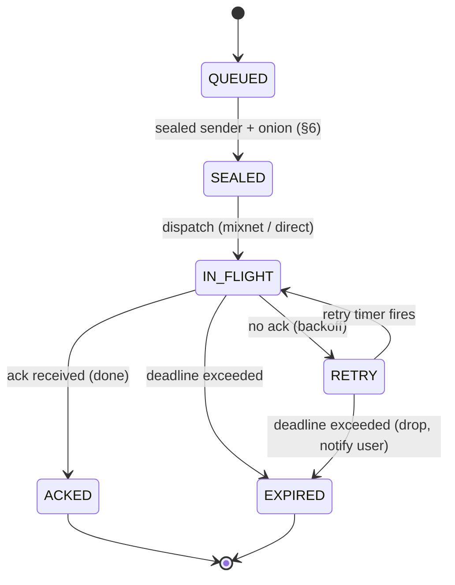

# 4. Transport: Mesh, Mixnet, Delivery

The mesh finds you and moves ciphertext to you, end-to-end encrypted and sealed-sender, over the
**`fast`** tier by default (§4.6). An **opt-in, research-tier mixnet** (§4.4) additionally hides
*who is talking to whom* from a global observer for implementations and users that choose it. The
node **is** the mesh — relay and mix roles are capabilities of the node binary, not separate
services.

## 4.1 Substrate: libp2p

KOTVA builds on **libp2p** rather than reinventing P2P:

- **Kademlia DHT** — peer routing and the `key → location` record store (see §4.2 for its
  security limits — it is the weakest link).
- **Circuit relay v2** — reachability for NAT'd nodes (the "relay" role).
- **AutoNAT v2 + DCUtR (hole punching)** — direct connections where possible.
- **Noise** (or TLS 1.3) — hop-by-hop channel security (in addition to end-to-end MOTE
  encryption; QUIC carries TLS 1.3 natively).
- **QUIC / TCP / WebSocket / WebRTC / WebTransport** transports.

A node dials **outbound** and holds connections, so CGNAT/dynamic-IP nodes are reachable.

**Substrate seam — libp2p is v0, not a flag day (normative).** libp2p is KOTVA's **v0 substrate**,
but the protocol MUST NOT be *permanently* wedded to it: the `LocationRecord` (§4.2, §18.5.1)
carries an explicit **`substrate` discriminator** — a tag from the **Transport Substrates
registry** (§21.24) — and its `peer_id` / `addrs` are interpreted **relative to that substrate**.
v0 defines exactly one value, `0x01 = libp2p` (peer id = libp2p PeerId, addrs = multiaddrs), and
an absent `substrate` field means libp2p for backward compatibility. A future non-libp2p overlay
is introduced by **registering a new substrate tag** and advertising support via capability
negotiation (§10.2) — the **same additive, dual-stack migration mechanism as a new crypto suite**
(§1.1, §21.25): a resolver dials a record only on a substrate it implements, nodes bridge during
the transition, and the old substrate is retired only once no pinned relationship needs it. A
record on a substrate a resolver does not implement is simply unreachable to it (`0x0303`), never
a parse failure. This keeps `multiaddr` + the registered substrate tag as the abstraction seam so
moving off libp2p is an incremental migration, not a flag day.

**Roaming — honest note:** identity is a persistent keypair, not an IP. When a node's address
changes, roaming is carried primarily by **re-publishing the location record (§4.2) and peers
re-dialing**, not by QUIC connection migration. QUIC migration (RFC 9000) *can* preserve some
live connections, but the Rust QUIC stack (`quinn`) has no multipath and address-change
handling is imperfect; do not rely on it for seamless roaming.

## 4.2 The `key → location` record (DHT)

```
LocationRecord {
  ik:        bytes,        // identity key (DHT key = hash(ik))
  peer_id:   bytes,        // node id, interpreted per `substrate`; MUST be per-epoch unlinkable (below)
  addrs:     [* multiaddr],// current reachability hints (may be relay circuits, mix addrs)
  seq:       u64,          // monotonic sequence number; reject older-or-equal (rollback defense, §16.2)
  ttl:       u64,
  ts:        u64,
  substrate: u8,           // OPTIONAL transport-substrate tag (§21.24); absent ⇒ 0x01 libp2p (§4.1)
  sig:       bytes,        // signed by a device key
}
```

**`peer_id` MUST be per-epoch unlinkable (normative) — the PQ-harvest mitigation.** A node MUST
derive its `peer_id` freshly per **location epoch** (§16.2) rather than holding one stable node
identifier across its lifetime, so that a `peer_id` observed at time *T* cannot be linked to the
same node at *T + Δ* by the identifier alone. This is cheap — a per-epoch keypair, rotated on the
same cadence the record is already republished — and it is what bounds the **harvest-now,
decrypt-later** exposure of the mixnet's routing layer.

The full harvest-now, decrypt-later rationale was written against the mixnet's routing layer
(§4.4.12, now [docs/research/mixnet.md §4.4.12](docs/research/mixnet.md)); this field is where
that defense actually lands, and it is worth keeping even for the `fast` tier — a per-epoch
`peer_id` is cheap, general routing-layer hygiene independent of which transport tier is in
force.

The record follows the **IPNS pattern**: a self-certifying **value record** (DHT key =
hash(ik)), signed, with a **monotonic sequence number + EOL/TTL** to defeat rollback/replay,
stored at the **K closest peers**, and **aggressively republished** (DHT record lifetimes are
short — hours — so staleness is a real failure mode). Use value records, not provider records.

### CAUTION — signing does NOT stop eclipse attacks (the DHT is the weakest link)

Signing authenticates record *content*, not *routing*. Because a libp2p PeerId is
`hash(pubkey)`, an attacker can cheaply generate IDs closest (XOR-distance) to a target key,
fill honest routing tables, and control all lookups for that key — returning nothing or an
*old, still-valid signed* record (censorship / rollback) **without forging anything**. This is
a Sybil/eclipse attack at the routing layer, and it is the single most attackable part of
KOTVA. Mitigations KOTVA REQUIRES/RECOMMENDS:

- **S/Kademlia disjoint-path lookups** (parallel, node-disjoint) and **IP-diversity caps** per
  k-bucket.
- **Aggressive republish** + accept only records with a newer sequence number (rollback
  defense).
- Closed/organizational deployments SHOULD use a **private DHT** (own protocol prefix) to
  shrink the Sybil surface.

**IP-diversity caps do not survive IPv6 (disclosed).** The per-k-bucket IP-diversity cap above is
a real defense against an IPv4 adversary, where addresses are scarce and costly. It is **close to
worthless under IPv6**: a single routine allocation yields a /64 — 2⁶⁴ addresses — so per-address
and even per-/64 caps can be defeated for free, and an adversary renting commodity capacity can
mint effectively unlimited distinct-looking peers. Diversity counting therefore MUST be done at a
granularity money cannot trivially multiply — **per announced BGP origin ASN**, and per /48 at
the finest — not per address. This is the same reasoning that drives the ASN-diversity rule for
mix path selection in the opt-in research-tier mixnet
([docs/research/mixnet.md §4.4.8](docs/research/mixnet.md)), and for the same reason: the scarce
resource is network *provenance*, not addresses.

### 4.2.1 Resolution order — the DHT is an accelerator, never a dependency (normative)

Because the DHT is the protocol's most attackable surface and an adversary with rented capacity
can attack it cheaply, KOTVA structures `key → location` resolution so that **no established
relationship ever depends on it.** A resolver MUST try, in order:

1. **Piggybacked location (the primary path).** Every MOTE carries its sender's current signed
   `LocationRecord` alongside the payload (§18). A correspondent therefore learns the sender's
   fresh location **from the correspondence itself**, with no lookup of any kind. An active
   relationship is **self-maintaining**: as long as two parties exchange messages more often than
   either changes address, neither ever performs a location lookup, and no third party — DHT,
   rendezvous, or directory — is involved in routing between them at all. This is the common case
   by a wide margin, and it is entirely lookup-free.
2. **Cached direct addresses** from the pinned relationship, with the record's `seq`/`ttl` rules.
3. **The home rendezvous set.** An `Identity` (§1.3) MAY name a small set of **rendezvous nodes**
   that hold a reservation for the owner and will answer a signed location query for them. The set
   SHOULD contain **≥ 3 nodes under disjoint operators** (the same attested-operator discipline as
   the opt-in research-tier mixnet's guard/operator diversity,
   [docs/research/mixnet.md §4.4.8](docs/research/mixnet.md), and the KT log set of §3.5.2(b)), so
   no single rendezvous operator can censor or
   equivocate about the owner's location, and a resolver SHOULD cross-check the records returned
   by different members and treat disagreement as it treats resolver disagreement (§3.12.3).
4. **The DHT — opportunistic only.** Used solely for a genuinely cold contact for whom no
   piggybacked record, no cache entry, and no rendezvous set exists. A record obtained **only**
   from the DHT MUST be treated as a **hint**: it is usable to attempt a connection, but the
   identity at the far end is authenticated by the pinned `IK` as always (§3.4), so a poisoned
   DHT answer yields an unreachable or unauthenticated peer, never a wrong-but-accepted one.

**What this buys.** The eclipse attack described above is an attack on *lookup*. Steps 1–3 remove
lookup from every path that matters: established correspondence never looks up, and cold contact
resolves against attested, operator-diverse rendezvous nodes rather than an open keyspace anyone
can crowd. The DHT survives as a bootstrapping convenience whose failure degrades reach for
strangers rather than breaking the network — which is the only role a permissionless keyspace can
safely hold in a system that must resist a well-funded adversary.

### 4.2.2 Bootstrap — how a node finds its first peer (normative)

A node with no peers, no cache, and no contacts must reach the network somehow, and **whatever
answers that question is the most centralizing component in any P2P system** — it is consulted by
every node exactly when the node can verify nothing. Leaving it unspecified does not avoid the
centralization; it guarantees it, because every implementation then hardcodes its own vendor's
addresses and those addresses become load-bearing infrastructure nobody chose. KOTVA therefore
specifies bootstrap explicitly, in priority order:

1. **Contacts are the bootstrap set (primary).** A node that has *ever* pinned a contact (§3.4)
   already holds signed, verifiable peers: its correspondents' nodes and their last-known
   addresses. It MUST attempt these **first**. This path is per-user, unenumerable by an outsider,
   requires no infrastructure, and cannot be seized — nobody else knows or controls who your
   contacts are. For every node past its first day, this is the whole answer.
2. **Local discovery.** mDNS / DNS-SD on the local link, for the same-LAN, air-gapped, and
   community-network cases (§4.8).
3. **A signed, multi-operator `BootstrapSet`.** For a genuinely first-run node with no contacts,
   implementations ship a `BootstrapSet`: a signed, versioned, KT-anchored list of long-lived
   entry nodes. Normative constraints:
   - It MUST name **≥ 3 disjoint nodes under ≥ 3 disjoint announced BGP origin ASNs**; a list whose
     entries all sit in one network is non-conformant, because it is indistinguishable from a
     central server. **ASNs, not operators, deliberately:** running a bootstrap entry is an
     ordinary node role needing no scarce resource and no attestation (§0.2.2, §14.1), so requiring
     *attested operators* here would impose a credential on the one path a brand-new network has to
     have working on day one — and would be unsatisfiable at launch, when there are nodes but no
     operators. ASN-disjointness delivers the property that actually matters (no single network,
     datacenter, or legal order controls every entry point) and is checkable from the addresses in
     the list itself.
   - It MUST be **user-inspectable and user-overridable** in the client, and the client MUST
     surface which entry it actually used.
   - It is **discovery only, never trust**: a bootstrap peer can introduce a node to the network
     and can withhold, but every identity learned through it is verified against KT and pinned
     exactly as any other (§3.3). A hostile bootstrap peer yields no peers, never wrong ones.
   - Its role **ends permanently after first successful contact**: once a node has peers, it MUST
     prefer path 1 and MUST NOT re-consult the `BootstrapSet` while any known peer is reachable.
4. **Out-of-band introduction.** A QR code, an invite link, or a contact card carries a peer hint
   directly (§3.4.1), which is also the strongest first-contact path because it comes with
   out-of-band key verification for free.

**The invariant:** bootstrap is consulted **once, at birth**, and never again for the life of the
node. A design where nodes must periodically return to a well-known set has a permanent central
dependency no matter what the ownership of that set looks like.

## 4.3 Reachability ladder

Try in order; fall down only as needed:

1. **Direct** — IPv6, or IPv4 with port-forward/UPnP. No relay.
2. **Hole-punch** — DCUtR between two nodes (both online; always true for always-on boxes).
3. **Circuit relay** — a public-IP node relays; ciphertext-only, content-blind.

As IPv6 spreads, rungs 1–2 dominate and the relay role fades. Downtime is covered by
sender-retry (§2.6) and optional **peer buffering** (buddy nodes hold ciphertext during an
outage) — no central buffer required.

> **This ladder is the node's NATIVE, node↔node reachability** — it carries ciphertext-only,
> content-blind mesh traffic between KOTVA nodes and never speaks a legacy protocol. It is
> **distinct** from the **legacy-client reachability ingress** on the **gateway** (§7.15,
> §8.2), which accepts a raw legacy connection (e.g. an iPhone Mail app over IMAP/TLS) and
> **terminates** it. The Circuit Relay v2 role here (rung 3) is the NATIVE mesh relay and stays
> on the node; the legacy ingress is a gateway edge surface for clients that cannot speak the
> mesh. Do not conflate the two "relays."

## 4.4 The mixnet (metadata privacy) — RELOCATED (non-normative, research-tier)

Metadata-privacy mixing (Sphinx onion packets over a Loopix/Nym-style mix network: mix
directory, path selection, key rotation, cover traffic, active-attack resistance, entry guards,
operator/ASN diversity, fail-closed no-downgrade, the High-security and Bootstrap profiles, and
the post-quantum agility hook) is a **research-tier, OPT-IN** layer — see
[docs/research/mixnet.md](docs/research/mixnet.md), which carries this section's full former
content (§4.4–§4.4.12) verbatim. It is **not normative and not conformance-tested**: an
implementation MAY offer it and a user MAY select it (the `private` tier, §4.6), but nothing in
this specification requires it, and the honest metadata-privacy default is stated in
[06-privacy.md §6.1](06-privacy.md). **The default transport tier is `fast`/direct** (§4.6) —
ordinary end-to-end-encrypted, sealed-sender delivery over the mesh/relays, with no onion
routing.

## 4.5 Bulk / file transfer

**Large-tier** blobs (> 4 MiB, §2.5, §5.5) MUST NOT traverse the mixnet (impractical
bandwidth/latency); **normal-tier** chunks (≤ 4 MiB, §2.5) ride the **same tier the message
itself uses** (§4.6) — `fast`/direct by default, or the opt-in `private` research-tier mixnet
when a sender has selected it (§6.5). For the large tier:

- The **control MOTE** (`file_offer`: manifest + key) travels the **same default-`fast`,
  opt-in-`private` tier as any other control MOTE** (§4.6).
- The **chunks** transfer **direct** (fast tier), content-encrypted, **swarmed** from any
  holder (BitTorrent-style), resumable per chunk.

Honest tradeoff: the *fact and size* of a bulk transfer between two nodes is observable
(direct) unless the sender has opted into the research-tier mixnet for the control message. See
§6.

## 4.6 Metadata-privacy tiers (`private` / `fast`)

`private` here is the **transport-tier** sense of the word (§0.8) — distinct from the private
gateway operator mode (§7.15.4) and the private DHT (§4.2). These tiers are the
**metadata-privacy** axis of §2.5; the **durability tiers** of §5.5.1 are orthogonal.

| Tier | Path | Latency | Metadata privacy | Status | Default for |
|------|------|---------|------------------|--------|-------------|
| `fast` | direct / low-hop mesh | sub-second | sealed sender vs. intermediaries; graph/timing observable to a global observer (§6.1) | **normative, default** | all mail, all control messages, live chat, bulk chunks |
| `private` | mixnet + cover traffic | minutes | additionally hides the graph/timing from a global *passive* observer, subject to [docs/research/mixnet.md §4.4.11](docs/research/mixnet.md)'s honest low-adoption model | **research-tier, OPT-IN** — see [docs/research/mixnet.md](docs/research/mixnet.md) | nothing by default; a deliberate, user-surfaced choice |

**Default is `fast`.** `private` is opt-in per conversation/message, for implementations that
choose to offer the research-tier mixnet (§4.4). Choosing `private` is itself metadata; a client
that offers it SHOULD make the choice deliberate and user-surfaced rather than silently
per-message, and MUST NOT present it as a conformance-required or production-audited guarantee
(§6.1, §6.9 SP-3/SP-4).

## 4.7 Delivery state machine (sender)



Durability lives entirely in this sender-side queue. The middle is stateless. The `EXPIRED`
deadline is the MOTE's `expires`; when `expires` is absent it is the §16.1 default maximum
retry lifetime (§2.6) — retry is always bounded.

**RETRY re-sealing by tier (normative).** On `RETRY → IN_FLIGHT`, a `fast` MOTE MAY re-dispatch the
identical sealed bytes (`id` is stable, §2.2). An implementation that also offers the opt-in
`private` research tier (§4.4, [docs/research/mixnet.md](docs/research/mixnet.md)) MUST instead
**re-onion-wrap first** for a `private` MOTE — rebuild fresh mixnet paths, a fresh `α`, and
current-epoch mix keys ([docs/research/mixnet.md §4.4.3–§4.4.4](docs/research/mixnet.md)), keeping
the stable envelope `id`. An unmodified `private` resend would be dropped at the first honest hop
as a per-hop-tag replay (`0x030E`, [docs/research/mixnet.md §4.4.6](docs/research/mixnet.md)), so
re-wrapping is what makes that opt-in tier deliverable under packet loss at all. Formalized in
§20.1.

## 4.8 Local, isolated, and delay-tolerant networks

KOTVA works in **remote environments with their own networks** — often *more easily than
email*, because email needs an SMTP/IMAP server + MX + DNS, whereas two KOTVA nodes on the same
network need no infrastructure at all.

- **Local discovery (mDNS).** Nodes on the same LAN discover each other via libp2p **mDNS**
  (`_p2p._udp.local`) with **zero configuration, no internet, and no central server**. A ship,
  a remote site, an air-gapped office, or a home LAN can run a fully functional local KOTVA
  mesh with nothing but the nodes. Private networks use a fingerprinted service name so they
  do not cross-discover.
- **Scope of the "easier than email" claim.** True specifically for the **local / same-network
  / isolated** case. Across the open internet, KOTVA still depends on the DHT/relays (§4.2–4.3),
  which have their own fragility.
- **Delay-tolerant store-and-forward is a KOTVA layer, not a libp2p feature.** libp2p is
  connection-oriented and provides no bundle/epidemic DTN routing. KOTVA REQUIRES its own
  store-and-forward: the sender-side retry queue (§4.7), **peer buffering**, and
  **sync-on-reconnect** of the device-cluster CRDT (§5.6). This is what lets an intermittently
  connected site queue locally and reconcile with the wider mesh when connectivity returns.
- **Radio transports (Bluetooth / Wi-Fi Direct / LoRa) are out of scope for v0.** libp2p ships
  no such transport (Briar's offline radio transports are its own Bramble code, not libp2p).
  Supporting them would mean writing a custom libp2p `Transport` — flagged as future work, not
  a v0 claim.

## 4.9 Push wake-signaling (optional)

A mobile device sleeps its radios and its KOTVA process to save battery; while asleep it cannot
hold the mesh connection that §4.3 delivery assumes. Today the only way to wake such a device is
the platform's push service — Apple **APNs** or Google **FCM** — which sees, for every message,
**which device was woken and when**. That is a centralized metadata choke point squarely against
KOTVA's goals (§6). KOTVA therefore defines an **optional**, open wake-signaling layer that
(a) prefers self-hostable, decentralized push transports, (b) carries **no** content and **no**
sender identity in the wake signal, and (c) is originated by the **user's own node**, so no third
party ever sees the social graph. It **reuses existing standards** rather than inventing a push
protocol: **Web Push** (RFC 8030 delivery, RFC 8291 payload encryption, RFC 8292 VAPID) and
**UnifiedPush** (a user-chosen distributor), with **APNs**/**FCM** bridges only where a platform
mandates them (§15.2).

This layer is a **capability, not part of Core** (§10.3): a node that never sleeps (an always-on
box) needs none of it, and a node that implements it advertises the `push-wake` token in capability
negotiation (§10.2, §21.22). It changes nothing about the message spine — the actual MOTE is still
pulled over the ordinary reachability ladder (§4.3) or the mixnet (§4.4); a wake is only a hint to
**reconnect and sync now**, never a delivery path for content.

### 4.9.1 The two objects, and who holds what

A device registers a **`PushSubscription`** (§18.5.5) with **its own node**: the provider kind, the
provider endpoint URL/token, the device's **public push key** (P-256 for Web Push, RFC 8291), and
the RFC 8291 **auth secret**, all **signed by an `IK`-authorized device key** (§1.2) so the
subscription is authenticated to the identity and cannot be forged by another party to register or
redirect a device's wakes. The subscription is published **only to the user's own node(s)** (the
device cluster, §5.6) — never to a global directory, the DHT, or any relay — so no external party
learns that a given device exists or where it is pushed.

When a MOTE arrives for the user, the node emits a **`WakePing`** (§18.5.6) to each of that user's
sleeping devices. A `WakePing` is **content-free and sender-blind**: it carries only an **opaque
"sync now" token** and **no message body, no subject, no recipient, no sender identity, nothing about
the arriving MOTE**. The token is **sealed to the device push key** using **RFC 8291 Web Push
encryption** (ECDH to the push key + `aes128gcm`, the `auth_secret` bound into the HKDF key
derivation), so even the push relay that
carries it — a Web Push server, a UnifiedPush distributor, or APNs/FCM — sees **only ciphertext of
fixed shape**, never a readable payload. The woken device opens the token and **pulls** the actual
sealed MOTE over the normal path (§4.3/§4.4); the wake never carries the message.

Normatively:

- A `WakePing` **MUST NOT** contain plaintext sender, subject, recipient, or content — nor any field
  (outer or in the opened plaintext) beyond the opaque token; a decoded `WakePing` bearing any such
  field **MUST** be rejected fail-closed (`ERR_WAKEPING_CONTENT_PRESENT`, `0x0313`, §21.5).
- The wake token **MUST** be RFC 8291-encrypted to the subscription's push key; a node **MUST NOT**
  emit a readable/unencrypted wake.
- The sealed plaintext **MUST** be a **fresh, unpredictable nonce of ≥ 16 bytes** minted per wake
  (never a fixed or reused value). This is what lets the device detect a **replayed** wake: a push
  relay carrying the token can re-deliver a captured ciphertext to re-wake the device — a battery
  drain the emitting node's rate limiter (§4.9.4) cannot see because the replay never traverses the
  node. The device therefore keeps a bounded replay cache of recently-accepted nonces (§16) and
  treats a wake whose nonce it has already accepted as a replay, dropping it without re-waking
  (`ERR_WAKEPING_REPLAY`, `0x0316`, DROP_SILENT, §4.9.4). RFC 8291's per-message random salt already
  makes the *ciphertext* non-repeating on the wire; the fresh plaintext nonce adds the app-layer
  dedup that makes a re-delivered ciphertext detectable after it opens.
- A node **MAY** jitter and/or batch wakes (add randomized delay, coalesce several arrivals into one
  wake) to blunt timing correlation at the push relay; this trades wake latency for metadata
  resistance and is a per-node policy (§6, §6.6 item 9). **When the opt-in research-tier
  High-security mixnet profile is in force**
  ([docs/research/mixnet.md §4.4.10](docs/research/mixnet.md)) **this jitter/batching is a MUST,
  not a MAY, for implementations offering that profile:** the profile pins constant-rate cover to
  yield nothing to traffic analysis, and an un-jittered per-arrival wake would reopen at the push
  relay exactly the recipient-arrival timing channel that profile's cover traffic closes.

### 4.9.2 Your node originates the ping (why the graph stays private)

The subscription lives on the **user's own node**, and the node — which already terminates delivery
for its user — is the party that emits the `WakePing`. Consequently the push relay sees only
**"this user's node woke this user's own device,"** a single self-edge, never *who* sent the message
or *whom* the user talks to. No sender, no correspondent, and no other node is exposed to the push
provider. This is the same content-blind, single-choke-point discipline as circuit relays (§4.3) and
the legacy gateway (§7): the push relay is a **thin, content-blind, self-hostable** carrier, subject
to the same non-lock-in framing as the gateway (§7.7) — a user can point their subscription at their
own Web Push / UnifiedPush endpoint and depend on no specific provider.

### 4.9.3 Provider abstraction (all optional; prefer the open ones)

Push transport sits behind a **provider seam**; `PushSubscription.provider` selects one (§18.5.5):

| Provider (tag) | Standard | Openness | Notes |
|---|---|---|---|
| **UnifiedPush** (`0x01`) | user-chosen distributor | **fully open / self-hostable** | the decentralized default on Android/desktop; the user picks the distributor, no platform gatekeeper |
| **Web Push** (`0x02`) | RFC 8030 + 8291 + 8292 (VAPID) | **open / self-hostable** | browsers and any RFC 8030 endpoint; the node acts as the VAPID application server |
| **APNs** (`0x03`) | Apple-mandated | closed bridge | used **only** where the platform (iOS) mandates it (§6.6 item 9) |
| **FCM** (`0x04`) | Google-mandated | closed bridge | used **only** where the platform mandates it |

A conforming node **MUST prefer an open provider (UnifiedPush or Web Push) wherever the platform
allows**, and **MUST fall back to APNs/FCM only on a platform that mandates them** (§6.6 item 9).
Whichever provider carries it, the wake payload is the **same** RFC 8291-sealed content-free token —
the provider choice changes only the transport envelope, never what leaks inside it (which is:
nothing). The provider tags are capability-negotiated (§10.2); an unrecognized tag is treated as an
unsupported provider, never a parse failure.

### 4.9.4 Anti-abuse (a wake costs battery)

A wake spends the target's battery, so wakes are gated, fail-closed:

- **Authenticated to the device.** A `WakePing` is honored only against a `PushSubscription` the
  device itself signed (§4.9.1); a subscription whose device-key signature does not verify **MUST**
  be rejected (`ERR_PUSH_SUBSCRIPTION_SIG_INVALID`, `0x0312`, FAIL_CLOSED_BLOCK) and never acted on.
  Because the token is RFC 8291-sealed under the device push key **and** the `auth_secret` — secrets
  that only the user's own node holds — a wake that fails to open is a forged/unauthenticated wake
  and **MUST** be dropped (`ERR_WAKEPING_AUTH_FAILED`, `0x0314`, DROP_SILENT); it MUST NOT be
  surfaced as a real sync trigger.
- **Rate-limited — at both ends.** The emitting node **MUST** rate-limit wakes per device
  (coalescing bursts into a single wake within a window, §16), and wakes beyond the device's budget
  are dropped (`ERR_WAKEPING_RATE_LIMITED`, `0x0315`). The emitting node's limiter cannot, however,
  see a wake a **push relay** re-delivers on its own (a captured ciphertext replayed to drain the
  target's battery — the replay never traverses the node). The **receiving device** therefore
  enforces the same budget on **inbound** wakes as a fail-closed backstop (`0x0315`), independent of
  which relay delivered them, so a compromised or misbehaving relay cannot exceed the wake budget.
- **Replay-dedup at the device.** Each wake's sealed plaintext is a fresh, unpredictable nonce
  (§4.9.1); the device keeps a bounded cache of recently-accepted nonces (§16) and treats a wake
  whose nonce it has already accepted as a **replay** — it is dropped without re-waking
  (`ERR_WAKEPING_REPLAY`, `0x0316`, DROP_SILENT). This closes the relay-replay battery-drain that the
  emitting node's limiter alone cannot.

All failure modes stop rather than wake the device on faith: an unverifiable subscription
(`0x0312`), a content-bearing wake (`0x0313`), an unauthenticated wake (`0x0314`), an over-budget
wake (`0x0315`, enforced at emitter **and** receiver), and a replayed wake (`0x0316`).
