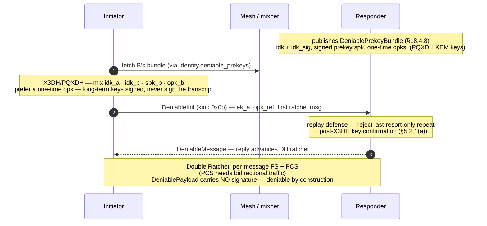

# 5. Messaging & Files (the unified substrate)

Mail, chat, and files are modes over one substrate: **MLS** (RFC 9420) for all session and
group security, MLS **KeyPackages** for async initiation, and **content-addressed chunked
blobs** for files. The same group primitive serves 1:1, group chat, email mailing-lists,
multi-device, and shared file folders.

## 5.1 Why MLS everywhere

DMTAP standardizes on **MLS as the unifying crypto primitive**:

- **1:1** = a 2-member MLS group.
- **Group chat / mailing-list** = an MLS group.
- **Multi-device** = each of the owner's devices is a member (MLS handles this cleanly where
  pairwise ratchets get messy).
- **Shared file folder** = an MLS group over a set of manifests (§5.5).

MLS is **transport- and identity-agnostic** by design (RFC 9420, 2023; architecture in
RFC 9750). Its abstract roles map onto DMTAP:

- **Delivery Service (DS)** → the DMTAP mesh/mixnet (§4).
- **Authentication Service (AS)** → DMTAP identity + KT (§1, §3). KT realizes the AS while
  *reducing* the trust placed in it — a good fit for a decentralized design.

MLS provides group forward secrecy and post-compromise security via the TreeKEM ratchet
tree, with O(log n) member changes. v0 uses ciphersuites `0x0001`
(`MLS_128_DHKEMX25519_AES128GCM_SHA256_Ed25519`) and `0x0003`
(`…CHACHA20POLY1305…`); PQ migration uses MLS's own PQ ciphersuites
(`draft-ietf-mls-pq-ciphersuites`, ML-KEM) and the MLS combiner
(`draft-ietf-mls-combiner`), **not** a bolted-on external handshake.

**Message confidentiality rides the MLS ciphersuite, so PQ must be gated there too (normative).**
The suite high-water-mark of §1.3 polices `Envelope.suite` — the *identity/sealed-sender* layer —
but a group's **message** confidentiality is a property of its **MLS ciphersuite** (a separate
u16), not of `Envelope.suite`. A group could therefore run a **classical** MLS ciphersuite while
every member's *identity* is already PQ (`suite = 0x02`), silently leaving message content exposed
to harvest-now-decrypt-later even though the high-water-mark reads "PQ." DMTAP closes this gap:

- **All-members-PQ ⇒ PQ MLS ciphersuite REQUIRED.** When **every** current member of a group
  advertises a PQ identity suite (`0x02`/`0x03`) and a supported PQ MLS ciphersuite (§10.2), the
  group MUST run a **PQ (or hybrid) MLS ciphersuite**; a Commit that would keep or move the group
  to a classical ciphersuite under that condition MUST be rejected.
- **Per-group MLS-ciphersuite high-water-mark.** Each member maintains, **per group**, the highest
  MLS ciphersuite the group has used, exactly as §1.3 ratchets `Envelope.suite` per contact. A
  Welcome, GroupInfo, or Commit that selects an MLS ciphersuite **below** that high-water-mark is a
  downgrade attempt and MUST be rejected (**`ERR_MLS_CIPHERSUITE_DOWNGRADE`**, §21.6); the
  high-water-mark ratchets **up** only, lowering solely via an explicit member-agreed retirement
  Commit, never via an inbound handshake. The mark and the required floor are advertised as an
  **MLS-ciphersuite-floor** capability token (§10.2, §21.22).

In short: **message-PQ is gated by the MLS ciphersuite, not by `Envelope.suite`** — the two agility
axes are policed independently so neither can silently mask a downgrade on the other.

### CAUTION — epoch ordering is the hard part on a mesh

MLS trusts the DS for exactly one thing: **a total order on epochs** — Commits must be
applied in an agreed order per group. A leaderless mesh has no natural serialization point,
so **this ordering/consensus of Commits is the real difficulty of "MLS over P2P," not the
crypto.** DMTAP REQUIRES that MLS **handshake** messages (Proposal / Commit / Welcome) travel
over an **ordered, reliable channel** per group, while ordinary **application** messages
(mail/chat/files) MAY travel over the reordering mixnet. Sending handshakes over the mixnet
would stall or fork group state.

**v0 ordered-channel: the group committer (normative).** Each group has a **committer** — the
node that serializes handshake messages into an append-only, hash-chained per-group log:

- **Selection:** the group creator is the initial committer. Committer identity is a signed
  field of the group state; every member knows it.
- **Rotation:** any member MAY be promoted to committer by a Commit (so committer role is not
  tied to one device's uptime). Committer SHOULD rotate on the current committer going offline
  past a timeout, or on member vote, via a Commit that all members apply.
- **Failover / liveness & deterministic succession:** if the committer is unreachable, members
  hold pending Proposals and initiate a **takeover that does not depend on the incumbent's
  cooperation**. The successor is **deterministic but not grindable**: among live, non-faulted
  members the one with the lowest **per-epoch rank** `rank = BLAKE3-256(member_signing_key ‖
  group_id ‖ epoch)` is the designated next committer (a raw-key byte-order comparison, then
  earliest join epoch, break the astronomically-unlikely rank tie). Ranking by a per-epoch keyed
  digest — rather than the raw signing key — means a member **cannot grind a low key at join time to
  occupy the committer seat across every epoch**: the winner rotates unpredictably per epoch, so a
  key that wins one epoch does not win the next (a VRF over the same inputs is a stronger,
  OPTIONAL variant that also removes precomputation for a single target epoch). The successor
  proposes a
  **takeover Commit** referencing the last agreed log head; it takes effect **only when it carries
  a threshold of member signatures** (a roster quorum, §16), so a partitioned minority cannot
  install a rival committer and there is no split-brain over *who* takes over. (The heavy
  committer-plus-`> n/2`-takeover machinery in this bullet applies only to **groups of n ≥ 3**; a
  **2-member group (a 1:1) uses the lighter symmetric-ordering path of §5.1.1 instead**, because
  the `> n/2` quorum is unsatisfiable when one of the two peers is dead.) The hash-chained
  log makes a **fork detectable**: two Commits at the same log position with the same predecessor
  is proof of committer misbehavior; members MUST halt and alert (analogous to KT equivocation,
  §3.5) and recover per the fork-recovery path below.
- **Commit-confirmation quorum & committer self-suspend (partition-fork defense, normative):** a
  live but **partitioned incumbent** committer that keeps serializing Commits for a **minority** of
  members would deterministically build a divergent log branch — healing later into a fork, group
  HALT, and manual recovery. To bound this, a committer's Commit is **`confirmed`** only once a
  **`> n/2` apply-ack quorum** (the same roster quorum as takeover, §16.8) of current members has
  acknowledged applying it; an **`unconfirmed`** Commit is provisional and, if later **superseded**
  by a quorum-confirmed Commit at the same log position, is **rolled back by its own author without
  raising a fork** (a superseded-unconfirmed Commit is *not* the two-confirmed-Commits-at-one-
  position condition that constitutes fork evidence). Correspondingly, a committer that cannot
  observe **`> n/2` member heartbeats** within the committer-liveness timeout (§16.8) MUST
  **self-suspend** — stop ordering new Commits and hold pending Proposals — so a partitioned
  minority committer stops manufacturing a branch to reconcile. The **majority** partition proceeds
  via the deterministic takeover (above), whose successor also needs `> n/2`; only one partition can
  ever hold that quorum, so at most one branch is ever confirmed. (For **n = 2** the confirmation
  quorum is both peers; a partition simply leaves each peer's Commits unconfirmed until the pair
  reconnects, resolved by §5.1.1's rank tie-break — no fork.)
- **Censorship is misbehavior — including *selective* censorship:** a committer can *stall* but
  cannot *forge* (every handshake is member-signed). Crucially, a committer that stays live yet
  **withholds ordering of one specific pending, member-signed proposal** (e.g. never orders a
  member's own removal) past the **committer-liveness timeout (§16)** is treated **identically to
  a dead committer** and triggers the deterministic takeover above — total silence is *not*
  required to justify replacement. This defeats the selective-censor-and-block-your-own-
  replacement attack, since the successor rule and member-signature threshold need no consent
  from the incumbent.

**Fork recovery (out of HALT).** A detected fork halts the group (above); recovery is
**out-of-band**. Members compare hash-chained log heads and identify the **last common epoch**
both forks share; an `admin`/`owner` (per §5.8.2 authority) proposes a recovery Commit on top of
that last common epoch, and — **for consistency with committer takeover (§16 roster quorum) and
to deny a single admin unilateral fork-selection power** — the recovery Commit is canonical only
when it carries the same **> n/2 member-signature quorum** as a takeover. This re-establishes a
single canonical head that a strict majority endorsed, not one admin's choice. Members that
applied the losing fork **roll back to the last common epoch** and re-apply from the recovery
Commit; application messages committed only on the abandoned fork are re-submitted by their
senders (sender retry, §2.6). This manual reconciliation is the v0 stopgap; **Decentralized MLS
(`draft-kohbrok-mls-dmls`) is the eventual leaderless fix** that removes the single-orderer fork
surface entirely.

**Metadata exposure (honest, §6.6 item 7).** The committer necessarily sees **all handshake
traffic for its group** — an explicit exception to the "no single node sees both ends" framing.
This is bounded by: the committer sees only *membership-change* metadata (not application
message content or the social graph outside the group), rotating the role spreads exposure, and
application traffic still uses the mixnet. Groups needing stronger metadata protection SHOULD
rotate committer frequently.

Track `draft-kohbrok-mls-dmls` (Decentralized MLS) for a fully leaderless replacement; until it
lands, the committer model above is v0.

### 5.1.1 Lighter ordering for n = 2 (1:1) — symmetric co-committers (normative)

A **1:1 is a 2-member MLS group** (§5.1), and the committer-takeover machinery above **cannot
work for it**: takeover needs a `> n/2` (both-of-two) member-signature quorum, which a live peer
can never assemble when its counterpart is offline or censoring — so a single committer would be
an unremovable single point of failure over the pair's own ordering. DMTAP therefore specifies a
distinct, lighter ordering path for **n = 2** and reserves the committer/quorum machinery for
**n ≥ 3**:

- **Both members are symmetric co-committers.** There is **no single committer** and no takeover:
  each of the two members MAY serialize its own handshake messages (Proposal/Commit/Update). The
  ordered, reliable per-group channel MLS requires (§5.1) is realized by **pairwise handshake
  sequence numbers** rather than one node's log: each member maintains a strictly increasing
  `hs_seq` for the handshakes it originates, and each handshake is chained by `prev` to the last
  handshake that member has applied.
- **Deterministic tie-break on concurrent Commits.** Because either peer may Commit, the two can
  propose **concurrent** Commits against the same epoch. This is resolved without a quorum by a
  fixed rule: the Commit whose **originator has the lower per-epoch rank** `BLAKE3-256(
  member_signing_key ‖ group_id ‖ epoch)` (the same non-grindable total order §5.1 uses for
  successor selection, raw-key then join-epoch as final tie-breaks) is **canonical**; the other
  peer's concurrent Commit is **superseded and re-proposed** on top of the winner (its author
  re-applies it at its next `hs_seq`). Because the rank folds in the epoch, neither peer can grind a
  key that wins **every** concurrent-Commit race for the lifetime of the pair; the winner varies per
  epoch. The order is total (rank ties are astronomically unlikely and fall back to the unique raw
  key), so both peers converge on the identical epoch chain with no vote.
- **No forgery, same fork-evidence.** Each handshake is still **member-signed** (MLS, §5.1), so
  neither peer can forge the other's membership actions; a peer that presents two different
  handshakes at the same `(originator_ik, hs_seq)` produces **self-signed fork evidence**, and the
  other member MUST `HALT_ALERT` exactly as for committer equivocation (§5.1, `0x0404`). The
  hash-chain `prev` still detects reordering and gaps.
- **Censorship degrades to unilateral action, not deadlock.** A 2-party peer cannot *stall* the
  other's ordering (there is no committer to withhold service): each member can order its own
  Commits — including the other's **removal** — so the "censoring committer in a 2-party group"
  dead-end is removed (it is no longer resolved by leaving/recreating the group). A genuine
  divergence (a detected fork) recovers via the §5.1 out-of-band path with the trivial 2-party
  quorum (both members, or re-pair).
- **Growth to n ≥ 3.** The first Commit that grows the group beyond two members installs the
  standard **committer** (§5.1 — the adding member is the initial committer) and the group leaves
  the symmetric path; shrinking back to two members reverts to symmetric co-committers. The
  regime is a pure function of roster size, so both peers always agree on which is in force.

## 5.2 Forward secrecy & (non-)deniability

- **Forward secrecy** comes from MLS epoch advancement. Healing (post-compromise security)
  is **per-epoch/per-Commit**, which is coarser than the Signal Double Ratchet's
  per-message healing — using MLS for 1:1 (§5.1) is a deliberate *simplicity-vs-optimality*
  trade, not a strict improvement over Double Ratchet.
- **Deniability — the default path is non-repudiable; an optional deniable 1:1 mode is
  specified.** MLS is **signature-based and therefore non-repudiable**: every LeafNode and every
  FramedContent (handshake *and* application messages) is signed with the member's signature key,
  and RFC 9750 states plainly that *"MLS does not make any claims with regard to deniability."*
  DMTAP's **default MLS path is therefore non-repudiable**, and DMTAP MUST NOT substitute
  shared-secret MACs for MLS's mandatory signatures *inside MLS* (that would break RFC 9420
  conformance). Deniability is **not** achieved by weakening MLS. Instead, DMTAP specifies a
  **normative, OPTIONAL, capability-negotiated deniable 1:1 mode in §5.2.1** that runs a *separate*
  Signal-style channel (X3DH/PQXDH + Double Ratchet with shared-key-MAC authentication) **beside**
  the 2-member MLS group, giving cryptographic **participation and message repudiation** for
  1:1 conversations. Groups (`n ≥ 3`) stay MLS and remain non-repudiable. The residual is disclosed
  honestly in §5.2.1: deniability is *cryptographic repudiation of the transcript*, not protection
  against a compromised endpoint that logs plaintext.

### 5.2.1 Optional deniable 1:1 mode (normative)

MLS-everywhere buys simplicity and post-compromise security at the cost of **non-repudiation** —
inherent to any signature-authenticated protocol. For users who need **repudiation** (a
whistleblower, a source, a lawyer's off-record channel), DMTAP specifies an OPTIONAL **deniable
1:1 mode**. It does **not** modify MLS; it is a **separate pairwise channel** selected per
conversation, reusing the proven Signal design rather than inventing new cryptography.

**Why not "MLS with MACs."** Deniability cannot be retrofitted onto MLS by dropping its
signatures — that breaks RFC 9420 conformance and the group ratchet's security proof. The clean
construction is a **distinct 1:1 protocol whose authentication is a shared-key MAC**, so *either*
party could have produced any transcript ⇒ neither can prove the other authored it. That protocol
already exists and is deployed at scale: **Signal's X3DH/PQXDH + Double Ratchet**.

#### (a) Handshake — X3DH (classical) / PQXDH (PQ), by reference

Session setup reuses **X3DH** (Marlinspike & Perrin, 2016) for `suite = 0x01` and **PQXDH**
(Kret & Schmidt, 2023) for `suite = 0x02` (ML-KEM-768, matching the suite's X-Wing KEM, §16.7)
— **not reimplemented here**. DMTAP supplies only the binding to its own identity and prekeys:

- **Dedicated long-term identity DH key (NOT `IK`).** X3DH mixes the parties' *long-term identity
  DH keys*. DMTAP's `IK` is an **Ed25519 signing** key; rather than derive an X25519 key from it by
  XEdDSA, an identity that offers the mode provisions a **dedicated long-term X25519
  "deniable-identity DH key" `idk`**, **certified once by an `IK`-authorized device key**
  (`idk_sig`, DS-tag `DMTAP-v0/deniable-idk`, §18.9.10). `idk` — not `IK` — is the X3DH long-term
  DH input on both sides. This is a deliberate change from earlier drafts: it (i) keeps **`IK`
  cold** — `IK` never performs Diffie–Hellman, only certifies — so `IK` can live in a **usage-fixed
  hardware keystore** (Apple Secure Enclave is P-256-only and sign-only; a TPM/StrongBox key can be
  provisioned sign-only) that **cannot** do both signing and DH on one key, making the mode
  **hardware-buildable**; and (ii) preserves deniability exactly, because the only long-term
  signature (`idk_sig`) still covers a *public DH key*, never content or a transcript (below). The
  `IK ↔ name` binding (KT, §3.5) still authenticates the counterpart, and the AD binding
  (`AD = IK_A ‖ IK_B`, oriented initiator‖responder, §18.3.9) still ties the session to the two
  identities.
- **Published deniable prekeys.** An identity that offers the mode publishes a
  **`DeniablePrekeyBundle`** (§18.4.8) located via `Identity.deniable_prekeys` (§1.3, §18.4.1):
  the certified **identity DH key** `idk` (with `idk_sig`), a **signed prekey** `spk` (X25519) with
  its signature, a set of **one-time prekeys** `opks`, and — under `suite = 0x02` — a signed
  **last-resort ML-KEM key** plus one-time KEM keys (PQXDH). The bundle is replenished by the
  owner's node exactly like KeyPackages (§5.3); exhaustion falls back to the signed prekey /
  last-resort key, rate-limited (§16.9). The initiator carries **its own** `idk_a` + `idk_a_cert`
  inline in `DeniableInit` (§18.3.9) so an offline responder can complete the async handshake
  without a round trip.
- **What is signed vs MAC'd (the crux).** The **only** signatures in the whole mode are the
  **identity-DH-key certification** (`idk_sig` / `idk_a_cert`) and the **signed-prekey signature**
  (`spk_sig`) — both of which attest that a *public key was published*. Neither signs any message,
  transcript, or the fact that a conversation occurred; they are exactly the standard X3DH
  prekey-authentication signatures and are what preserve deniability: every long-term signature
  covers a public key, never content. **Every message is authenticated by a shared-key MAC** (the
  Double Ratchet AEAD tag under a per-message key derived from the shared secret), which **both**
  parties can compute ⇒ **participation + message repudiation**.

- **First-message replay defense (last-resort / signed-prekey-only init, normative).** A
  `DeniableInit` that consumes **no one-time prekey** (`opk_ref` absent and, under PQXDH, `kem_ref`
  absent — the last-resort / signed-prekey-only path) is **replayable**: an attacker can resend the
  captured first message and, absent a defense, the responder re-derives the same session and
  re-accepts it. A responder MUST therefore either (i) **prefer a one-time prekey** — reject a
  last-resort-only first contact when an unspent `opk`/one-time-KEM is available in its published
  bundle (the initiator SHOULD always consume one when offered) — or (ii) maintain a **replay cache
  of consumed initiator `ek_a` (and `idk_a`) values** for the lifetime of the signed prekey plus its
  overlap window and drop a repeat, **and** require a **post-X3DH key-confirmation** round before
  the session is treated as established. A repeated last-resort init that fails this check is
  `ERR_DENIABLE_X3DH_FAILED` (`0x040C`). This mirrors Signal's documented X3DH replay caveat and is
  the deniable-mode analog of the MOTE content-address dedup (§2.6).

#### (b) Session — Double Ratchet, by reference

After the handshake yields a root secret, messages travel over the **Double Ratchet**
(Perrin & Marlinspike, 2016): a DH ratchet + symmetric-key chains giving **per-message forward
secrecy and per-message post-compromise security** — *finer* healing than MLS's per-epoch Commit
(§5.2), a bonus of the mode, not a regression. Message keys authenticate via AEAD (a shared-key
MAC), never a signature.



**PCS requires bidirectional traffic (disclosed).** The DH-ratchet step that delivers
post-compromise security only advances when a **reply** is received: healing needs a fresh DH
contribution from the *other* party. A strictly **one-way thread** — the archetypal
whistleblower→journalist channel where the source sends and never receives — therefore **does not
self-heal**; a compromise of either endpoint's chain keys stays effective until a reply flows.
Clients MUST disclose that per-message PCS is a property of **bidirectional** conversations and
that a send-only channel retains only forward secrecy, not post-compromise recovery, until it
turns around.

#### (c) Wire framing

- A deniable MOTE uses **`kind = 0x0b` (`deniable`)** (§21.16). Its `Envelope.ciphertext`
  (§18.3.1) carries a **`DeniableFrame`** (§18.3.9) — a tagged choice of **`DeniableInit`** (the
  X3DH/PQXDH first message, embedding the first ratchet message) or **`DeniableMessage`** (a
  subsequent Double-Ratchet message). Neither carries a `sig-val`.
- The inner plaintext, after ratchet decryption, is a **`DeniablePayload`** (§18.3.10) — the
  structural twin of `Payload` (§2.4) **with the signature field removed** and the real content
  `kind` carried inside. A `DeniablePayload` that carries a signature MUST be rejected
  (`ERR_DENIABLE_SIGNATURE_PRESENT`, `0x040F`); the missing signature is the point.
- The **envelope layer stays deniable-preserving**: `Envelope.sender_sig` (§18.3.1) is a
  **fresh, identity-free, per-message ephemeral** signature over routing metadata only (§18.9.1).
  It binds no long-term key and asserts no identity, so it does **not** make the transcript
  attributable — it only gates abuse (§9). Sealed-sender still applies (the sender's `IK` lives
  inside the ratchet-encrypted `DeniablePayload`, visible only to the recipient).

#### (d) Negotiation, scope, and composition (normative)

- **Capability-negotiated.** The mode is used only when **both** peers advertise the
  **`deniable-1:1`** capability token (§10.2, §21.22) and the initiating **user selects it** —
  it is a user/client-selectable mode, never a silent default. A peer that has not advertised
  it is handled per `ERR_DENIABLE_MODE_UNAVAILABLE` (`0x040E`): the client MUST surface the
  choice (fall back to the non-deniable MLS 1:1, or do not send), never silently downgrade the
  user's *expectation* of deniability.
- **1:1 only; pairwise per device.** Deniability is inherently pairwise. The mode replaces the
  **2-member MLS group** (§5.1.1) as the transport for that 1:1's *content*; it does not apply to
  groups of `n ≥ 3`, which stay MLS and remain non-repudiable. Across a personal cluster (§5.6)
  the mode runs as **one Double-Ratchet session per device-pair** (Signal-Sesame style),
  fanning out to each of the recipient's devices — trading MLS's efficient single-tree cluster
  sync for pairwise deniability. This cost is disclosed; clients SHOULD show that deniable
  threads sync per-device rather than through the shared MLS tree. **Deniable-thread content MUST
  be synchronized across the owner's own cluster ONLY via these per-device-pair Double-Ratchet
  sessions (MAC-authenticated), and MUST NOT be placed into — or referenced by plaintext in — the
  cluster MLS-group CRDT (§5.6).** The cluster CRDT wraps every application entry in a
  member-**signed** `FramedContent` (§5.2); routing deniable plaintext through it would manufacture
  a durable, MLS-signed, seizable copy of the deniable content on the owner's devices — owner-side
  non-repudiable evidence that the shared-key-MAC construction (§5.2.1(c)) exists precisely to deny.
  A cluster CRDT entry embedding a `DeniablePayload` (or its plaintext) MUST be rejected fail-closed
  (`ERR_DENIABLE_SIGNATURE_PRESENT`, `0x040F` — the same "no signature may cover deniable content"
  guard).
- **Identity verification unchanged.** The counterpart's `IK` is still bound to its name via
  KT / OOB safety numbers (§3.4–§3.5); deniability repudiates *authorship of messages*, not the
  *key agreement*. Downgrade defense (§1.3 suite ratchet) and cold-sender anti-abuse (§9) apply
  as for any MOTE.

#### (e) The residual (honest, after the mechanism)

The mode delivers **cryptographic repudiation of the transcript**: given only ciphertext and
keys, neither party (nor a third party) can produce a cryptographic proof that the *other* party
authored a given message, because the authenticator is a shared-key MAC either could have forged.
Two residuals survive and are stated plainly:

1. **Deniability is not endpoint protection.** A compromised or coerced endpoint that **logs the
   plaintext as it is displayed** trivially "proves" content — no repudiation protocol prevents a
   party from keeping and disclosing its own plaintext (this is the same floor as §6.6 item 3).
   Cryptographic deniability defeats a *cryptographic* transcript proof, not a screenshot.
2. **X3DH deniability has known theoretical bounds.** Formal analyses (Vatandas, Gennaro,
   Ithurburn & Krawczyk, ACNS 2020; Unger & Goldberg) show X3DH gives strong **offline**
   deniability but that **online/interactive** deniability against a judge colluding in real time
   with a participant is weaker; the signed prekey and prekey-signing key are long-lived. DMTAP
   inherits these bounds — it does not claim to exceed Signal's proven guarantees.
3. **Offering the mode is itself a durable public signal.** To be reachable async in deniable mode
   an identity MUST publish an `IK`-certified `idk` (`idk_sig`) in a world-fetchable
   `DeniablePrekeyBundle` and advertise the `deniable-1:1` capability — both are non-repudiable
   standing artifacts asserting *"this identity provisions off-record channels."* The mode
   repudiates message **authorship**, not the **fact that the capability is offered**; a user for
   whom that fact is itself incriminating-by-association SHOULD provision `idk`/bundles **on demand**
   via a rendezvous/introduction (the non-DHT §4.2 path) rather than a world-readable standing
   bundle, accepting the loss of cold async first-contact.

This is honest deniability: *repudiation of the cryptographic transcript*, disclosed for what it
is, not a promise that a determined endpoint compromise can be undone.

#### (f) Teardown & re-establishment on device loss / revocation (normative)

The pairwise Double Ratchet is **outside MLS**, so the cluster-healing path of §6.7 (MLS Remove +
device-key rotation) does **not** by itself repair or tear down a deniable session — an MLS Remove
advances group epochs but reaches no 1:1 ratchet. Deniable sessions therefore have their own
explicit lost-/stolen-device flow, tied into §6.7 and recovery §1.4:

- **Prekey withdrawal (MUST).** On revoking a device, the owner MUST publish a new
  `DeniablePrekeyBundle` (§18.4.8) with an incremented `version` that **omits every `spk`/`opk`
  (and PQ KEM key) the revoked device generated or could have exfiltrated**, and — if the revoked
  device could have used the `idk` private key — **rotate `idk`**: provision a fresh dedicated
  identity DH key, certify it with a surviving device key (`idk_sig`), and let the old `idk`
  version age out (rollback defense rejects the withdrawn bundle, `0x040B`). New sessions then
  cannot be initiated against the revoked material.
  - **KT-anchored bundle version (MUST) — first-contact rollback defense.** The simple
    "reject the older `version`" rule only protects a fetcher that already holds the current
    version; on **first contact** an initiator has no prior high-water-mark, and the withdrawn
    bundle's `idk_sig`/`spk_sig`/`opk`s were all validly signed *before* revocation, so they still
    verify — a stolen device that captured bundle v1 can serve it to a new correspondent whose
    fully-reachable KT and correctly-verified `IK` do not detect the rollback, and then complete the
    X3DH against the revoked private keys. The owner therefore MUST **KT-anchor the current
    `DeniablePrekeyBundle` `version`** (bound to the identity's KT record via
    `Identity.deniable_prekeys`, §3.5 / §1.3),
    and a fetching initiator MUST check the fetched bundle's `version` against the KT-logged current
    version and **fail closed if it is older** (`0x040B`) — the same fail-closed-on-unreachable-KT
    stance as §3.3 / §6.6 item 4. This makes prekey withdrawal detectable at first contact, not only
    on a re-fetch by an already-pinned peer.
- **In-flight ratchet teardown (MUST).** Every deniable ratchet the revoked device held is
  considered compromised. The surviving cluster MUST **tear those sessions down** — discard their
  ratchet state and, for conversations the owner wants to keep, **re-establish a fresh session**
  from the new prekeys (a new `DeniableInit`), exactly as a first contact. There is no in-place
  "remove a device from a pairwise ratchet"; re-establishment is the healing primitive, and it is
  what restores post-compromise security for the deniable channel (the DH-ratchet reboot of (b)).
- **Counterpart signal (SHOULD).** The owner's node SHOULD signal active deniable correspondents
  (over the surviving channel, or on next contact) that the prior session is retired so they
  re-establish rather than send into a dead ratchet; a message that fails to decrypt against any
  live ratchet is held for resync (`0x040D`), never silently dropped as forged.
- **Recovery interaction.** After a full identity recovery (§1.4), all prior deniable sessions and
  prekeys are treated as revoked by the same rule — the recovered identity republishes a fresh
  `idk`/bundle and re-establishes sessions, consistent with the "recovery invalidates prior
  authorizations" posture of §13.4 (`0x050A`). This is the deniable-mode entry in the §6.7
  lost-/stolen-device sequence; it introduces no new revocation protocol, only the pairwise
  teardown+re-establish the ratchet already implies.

## 5.3 Async session initiation (MLS-native)

To message an identity whose devices are all offline, DMTAP uses **MLS's own async-join
mechanisms** rather than bolting on a separate PQXDH/X3DH handshake (which would add a second
protocol and a second security proof for no benefit when everything is already MLS):

1. Each device pre-publishes signed **KeyPackages** (located via `Identity.keypkgs`, §1.3) to
   the mesh. A KeyPackage is MLS's prekey: identity/signature key, HPKE init key, and (for PQ)
   an ML-KEM init key via the MLS PQ ciphersuite.
2. The initiator **Adds** the offline member (a Commit) and sends a **Welcome** so the new
   member bootstraps group state on return; or the joiner uses an **External Commit** against
   the group's `GroupInfo` to self-join.
3. Post-quantum protection comes from the **MLS PQ ciphersuite / combiner** (§5.1), keeping a
   single key schedule.

KeyPackages are replenished by the owner's node; last-resort KeyPackages avoid exhaustion.
(PQXDH-for-init would only be relevant if the 1:1 layer were Signal Double Ratchet rather than
MLS; DMTAP chooses MLS everywhere, so it is not used.)

## 5.4 Message kinds in context

- `mail` / `chat` — the same MOTE; differ by default tier (§4.6) and client rendering.
- `reaction` / `edit` / `redact` — reference a prior MOTE by `id` via `refs`.
- `group_event` — MLS handshake messages (add/remove/update/commit).
- `receipt` / `presence` — opt-in, ephemeral, off by default (metadata-sensitive, §6).

## 5.5 Files: content-addressed, chunked, any size

A file is a **BLAKE3 Merkle-DAG manifest** over fixed-size encrypted chunks:

```
Manifest {
  id:        bytes,        // BLAKE3 root over chunk hashes (the content address)
  size:      u64,
  chunk_sz:  u32,          // e.g. 1 MiB
  chunks:    [+ bytes],    // ordered chunk hashes
  suite:     u8,
  // NO key field. The content key is NOT part of the manifest — see below.
}
```

Properties:

- **Any size** — no protocol cap; the file is bounded only by the owner's storage.
- **Resumable / parallel / swarmed** — fetch chunks from any holder, restart per chunk,
  BitTorrent-style; a popular file becomes *more* available as more nodes hold it.
- **Deduplicated — but only within one key scope (privacy, normative).** The content address is
  computed over **ciphertext** chunks (`h_i = prefix ‖ BLAKE3-256(AEAD(key, plaintext_i))`,
  §18.9.5), **never over plaintext**. Two users (or two groups) holding the *same* plaintext file
  encrypt it under **different per-file random keys** (§2.5), so their chunks hash **differently**
  and do **not** collide — dedup is therefore **intra-user / intra-group only**, and there is
  **no cross-user, cross-group dedup**. This is deliberate: hashing plaintext (convergent
  encryption) would let a storage node — or any attacker who can guess or possess a candidate
  plaintext — **confirm which identities hold which file by comparing content addresses** (a CAS
  confirmation attack and a social-graph leak). DMTAP **sacrifices cross-user plaintext dedup for
  privacy** and picks the private default; the earlier "identical files stored once globally"
  framing was a convergent-encryption overclaim and does not hold under ciphertext addressing.

  **Public-object carve-out (normative).** Plaintext content addressing remains **forbidden**
  for the sealed files defined in this section. It is permitted **only** under the DMTAP-PUB
  public-blob profile (§22), which uses a **distinct** domain-separation tag,
  `DMTAP-PUB-v0/manifest`, and only for content published by an explicit, irrevocable act
  (§6.6). There, the CAS-confirmation attack described above is **accepted-by-design**: the
  publisher's holding is public *on purpose*, so there is no social-graph leak to defend
  against. A DMTAP-PUB public manifest is **type-incompatible** with a sealed `Manifest` —
  the distinct DS-tag is never carried as a boolean flag on one shared object; a verifier
  MUST fail closed on any DS-tag mismatch between the two.
- **Streamable** — consume in manifest order before full download.
- **Integrity** — every chunk self-verifies against its hash; the manifest self-verifies
  against `id`.
- **Key is never in the manifest (confidentiality).** The manifest is itself a
  content-addressed blob a fetcher pulls from the swarm to learn the chunk list, so any node
  serving it would also learn an embedded key and could decrypt the whole file. The file content
  key therefore travels **only inside the sealed MOTE** (`Attachment.key`, §2.5/§18.3.7), never
  in the manifest and never alongside the chunks. Chunks are served **blind** — a holder can
  relay encrypted chunks and the manifest without ever being able to read the file. A manifest
  received with a key embedded MUST be rejected as a leak (`ERR_MANIFEST_KEY_PRESENT`, §21), not
  used.

### 5.5.1 Delivery tiers & the durability contract (normative)

A content address is only useful while **some node still serves the bytes**. "Forever access
even after the peer drops" is therefore **not automatic** — it is a *contract*, not a property of
the hash. DMTAP makes the contract explicit with three **delivery tiers** (thresholds in §16.4)
and a **durability descriptor** carried in the sealed MOTE.

| Tier | Size (§16.4) | Mechanism | Durability guarantee |
|------|-------------|-----------|----------------------|
| **Inline** | ≤ 64 KiB | bytes ride **inside** the sealed MOTE payload (`Attachment.inline`, §18.3.7) | **durable-by-delivery** — the bytes land in the recipient's mailbox; no separate fetch; keeps MOTEs light for the mixnet (rides the top bucket rung, §16.3) |
| **Attached** | > 64 KiB, ≤ 25 MiB | content-addressed + chunked, but the chunks are **pushed with the message** into the recipient's store / cloud spool | **durable recipient copy** — once delivered the chunks are the recipient's own copy; **survives the sender dropping permanently** |
| **Referenced** | > 25 MiB (any size) | `ManifestRef` + key travel in the MOTE; chunks are **pulled on demand** from a holder | **best-effort by default** — durable only as strong as the file's **durability class** (below) |

The Inline cap is deliberately **64 KiB (= the top Sphinx bucket rung, §16.3), not larger**: an
inline attachment inflates the MOTE, and a MOTE above the top bucket cannot ride the `private`
mixnet at all (§4.4.1) — a larger inline cap would silently force the fast tier and drop mixnet
privacy. The delivery tier (durability axis: inline / push / pull) is **orthogonal** to the
size/privacy sub-tier of §16.4 (mixnet ≤ 4 MiB vs. bulk > 4 MiB): a 25 MiB **Attached** file is
pushed *and* transits the weaker bulk path (§6.5) — push-vs-pull governs durability, mixnet-vs-bulk
governs metadata privacy.

### 5.5.2 Durability descriptor (normative — the key fix)

A **Referenced** file (and OPTIONALLY an Attached one) carries a `durability` descriptor in its
`ManifestRef` (§18.3.7 — inside the **sealed, signed** MOTE, so it is per-delivery, tamper-proof,
and **not** part of the immutable content-addressed `Manifest`, so re-pinning never changes the
content address). Its `class` is one of:

| `class` | Who serves | Guarantee | Disclosed residual |
|---------|-----------|-----------|--------------------|
| **origin-hold** (0) | the owner's origin node | best-effort while the origin is online + swarm | **MAY become permanently unavailable** if the origin drops **before** the recipient fetches (`ERR_FILE_UNAVAILABLE`, §21). This is the honest default residual, §6.6 item 10. |
| **recipient-pinned** (1) | the recipient pinned a copy | durable at the recipient (survives origin drop) | none beyond the recipient's own storage |
| **cluster-replicated (N)** (2) | a **box-cluster** (§5.6, §14) holds N replicas | tolerates loss of up to **N−1** holders; repair re-replicates from any survivor | file lost only if **all N** holders drop simultaneously |
| **pinned(term)** (3) | a paid relay / pinning host, for a **retention term** | durable until the retention term elapses | after `retention` the host MAY GC (`ERR_FILE_RETENTION_EXPIRED`, §21) — renew before expiry |

Normative rules:

- A **Referenced** file's `ManifestRef` **MUST** carry a `durability` with a **known** `class`;
  a missing/unknown class, a `cluster-replicated` with `replicas < 1`, or a `pinned` with no
  `retention` is malformed → **`ERR_FILE_MANIFEST_INVALID`** (§21), FAIL_CLOSED_BLOCK. Inline and
  Attached files are durable by construction (delivery / push) and MAY omit the descriptor.
- A client **SHOULD auto-pull-and-pin** a Referenced file **below the auto-pull-to-durable
  threshold** (§16.4) on receipt, converting **origin-hold (best-effort) → recipient-pinned
  (durable)** so that a later origin drop cannot lose it. Above the threshold, pinning is an
  explicit user act (it costs real storage).
- `holder_hint` in the descriptor is an **advisory** locator only; a fetcher **MUST** still
  content-verify every chunk (§18.9.5) regardless of where it fetched — a hint cannot forge bytes
  (§5.5.3).

### 5.5.3 Serving integrity, swarm poisoning & repair (normative)

- **A holder cannot serve wrong-but-accepted bytes.** Every chunk self-verifies against its
  BLAKE3-256 content address before use (§18.9.5); a mismatch is **`ERR_CHUNK_HASH_MISMATCH`**
  (`0x0802`) → rotate to another holder. BLAKE3's collision resistance means a malicious holder
  **cannot** substitute different bytes under the same hash, so swarm-fetch **poisoning** is
  reduced to *wasted bandwidth*, bounded by the swarm parallelism cap (≤ 8 sources, §16.4): a
  poisoning holder is detected on first chunk and dropped.
- **Partial-chunk loss & repair.** Under `cluster-replicated(N)` a chunk survives while ≥ 1 of its
  N holders is reachable; **repair** = any survivor re-replicates it (chunks are self-verifying, so
  repair needs no trusted source). If **every** holder of a required chunk is gone the fetch fails
  **`ERR_CHUNK_UNAVAILABLE`** (`0x0803`); if the **whole file** has no reachable holder and no
  durability contract can be satisfied it fails **`ERR_FILE_UNAVAILABLE`** (§21). v0 durability is
  **replication**, not erasure coding; erasure/erasure-repair is an OPTIONAL future profile.

### 5.5.4 GC, retention & deletion (normative, honest)

- **Ref-counted, retention-driven GC.** A holder ref-counts each chunk against the durability
  contracts that reference it and **GCs a chunk once no live contract references it** (and, for
  `pinned(term)`, once `retention` has elapsed).
- **You cannot force-delete bytes others pinned.** Deleting *your* copy stops *you* serving it; it
  does **not** reach a recipient-pinned or cluster copy someone else holds. "Delete for everyone"
  is **cooperative-only**, never a guarantee — the same un-share bound as `redact`/`expires`
  (§6.6 item 8, §6.7). This is stated honestly rather than implied away.

### 5.5.5 Storage-DoS & spool overflow (normative)

Because **Attached** files are *pushed* into the recipient's store, a sender can attempt to
**fill a victim's spool** (a storage-based DoS). Defenses:

- **Inbound spool cap (fail-closed).** A pushed Inline/Attached file that would exceed the
  recipient's inbound spool cap for that sender (§16.4) is **refused**, not silently accepted or
  silently dropped → **`ERR_SPOOL_OVERFLOW`** (§21). An **unproven / cold** sender's pushes count
  against the requests-area budget (§2.7a, §16.5) and the per-poster anti-abuse budget (§9), so a
  cold sender cannot push large attachments to fill a spool before proving legitimacy.
- **Hosted quota exhaustion is fail-closed, never a silent hole.** A hosted-operator storage cap
  reached is **`ERR_STORAGE_QUOTA_EXCEEDED`** (`0x0806`, DENY_POLICY); self-host default is
  unlimited (§12.2, §12.3 — storage exhaustion MUST NOT be a security/crypto gate, only a policy
  deny).

The always-on box gives origin-hold / recipient-pinned for free; "Dropbox-like always available"
for large files is where **pinned(term)** (paid replica / managed host) re-enters. Transfer uses
the fast/direct tier for bulk (§4.5, §6.5).

## 5.6 Multi-device (the personal cluster)

An owner's devices form an MLS group (`caps` per DeviceCert, §1.2). The mailbox, read/flag
state, labels, and file index are replicated across devices as an **encrypted CRDT** synced
over the mesh, converging under out-of-order delivery. Any device can send/receive; the
always-on box is the anchor that guarantees receipt while other devices sleep.

A user who runs **multiple always-on nodes for redundancy** (a laptop + a home box + a VPS, say)
needs all of them to converge on **every** mail, chat, and file — **live and historical** — with
**no primary and no central server**. §5.6.1–§5.6.6 specify that convergence end-to-end:
membership (§5.6.1), live replication (§5.6.2), historical backfill (§5.6.3), the CRDT merge
semantics for mutable metadata (§5.6.4), tombstone GC (§5.6.5), and file redundancy (§5.6.6). The
model is **strong eventual consistency** (Shapiro et al. CRDTs, §15.5): every device that has
received the same set of operations is in the same state regardless of order, with **no
coordination round and no leader**. All sync traffic rides **inside the devices' encrypted MLS
cluster group**, so a relay carries only ciphertext and no non-member can read or inject it.

### 5.6.1 Cluster membership (who is a replica) — normative

The cluster is **exactly the identity's non-revoked devices** (§1.2): each is authenticated by a
`DeviceCert` chaining to the root `IK`, and a device removed by a `KeyRotation` / revocation
(§1.5, §6.7) is **excluded**. Replication is **mutually authenticated** (the normative rule): a
device offering or requesting sync MUST present a `DeviceCert` that (a) verifies under the current
`Identity`'s `IK` and (b) is **not** revoked in the pinned identity chain, and MUST verify the
same of its peer before exchanging any object or op. A peer that cannot present such a cert — or
presents a revoked one — is refused (`ERR_CLUSTER_DEVICE_UNAUTHORIZED`, `0x0410`,
FAIL_CLOSED_BLOCK). Because the sync channel is the devices' **MLS cluster group**, membership
changes are ordinary MLS Add/Remove Commits (§5.8.2): a removed device is cryptographically cut
off from future epochs, and a joining device is admitted only via a Welcome authorized by an
existing member. There is **no primary**; every member is an equal replica.

### 5.6.2 Live replication (immutable objects gossip leaderless)

New content-addressed, immutable, signed objects — MOTEs (§2), file manifests and chunks (§5.5) —
are **gossiped leaderless** to every cluster member over the MLS cluster channel. Because each
object is named by its **content address** (§18.9.4/§18.9.5), *"does peer P already hold object
X?"* is a pure **id check**, and re-delivery of an already-held id is a no-op (dedup by content
address, `STATUS_DUPLICATE_ID` `0x020E`, §2.6). A device pushes an object's id (a `ClusterSyncFrame`
of type `announce`, §18.6.3); a peer lacking it pulls the bytes; a peer holding it ignores the
offer. Ordering is irrelevant — an immutable object means the same thing whenever it arrives — so
live replication needs no sequencing and no coordinator.

### 5.6.3 Backfill (a joining or long-offline node catches up)

A device that joins the cluster, or rejoins after being offline, MUST reconcile its object-id set
against a peer's **without re-downloading everything**. DMTAP specifies two interoperable backfill
methods; a device offers/accepts them via the `cluster-sync` capability (§10.2, §21.22).

**(a) Range-based Merkle set-reconciliation (default).** The two devices reconcile their sets of
object ids using a **Merkle summary over id-ranges** — the Merkle-search-tree / range-based
set-reconciliation technique (Auvolat & Taïani; Meyer; Minsky–Trachtenberg, §15.5). Objects are
ordered by content address, the id-space is split into ranges, and each range carries a
**fingerprint** = the suite hash over the sorted ids it contains (`RangeFingerprint`, §18.6.3).
The exchange:

1. Each side sends a `ClusterSyncFrame` (§18.6.3) of type `recon` carrying a coarse summary — a
   small set of top-level `RangeFingerprint`s spanning the whole id-space.
2. For any range whose fingerprint **matches** on both sides, that entire subtree is **skipped**:
   the two hold the identical ids there, *proven by one hash comparison*, with no further traffic.
3. For any range whose fingerprint **differs**, the side **drills down** — it re-splits that range
   into sub-ranges (fan-out `b`, §16.10) and exchanges their fingerprints, recursing until a
   divergent range is small enough (≤ the reconciliation leaf threshold, §16.10) to **enumerate**
   its ids directly.
4. Each side then **fetches only the ids the other holds that it lacks** (§5.6.2 pull) — never the
   matching bulk.

The cost is **O(differences · log n)**, not O(n): matching subtrees are eliminated in a single
hash comparison, so two nearly-identical replicas exchange a handful of frames. A
`RangeFingerprint` is **self-verifying** — the receiver recomputes it over the ids it holds in the
range — so a peer cannot forge a "we match" claim to suppress objects. A summary whose fingerprints
do not recompute over the claimed range, or that is malformed, is rejected
(`ERR_CLUSTER_RECON_SUMMARY_INVALID`, `0x0411`, FAIL_CLOSED_BLOCK) and reconciliation re-driven
against another peer.

**(b) Journal replay (alternative).** Each account additionally maintains an **append-only,
hash-chained per-account journal**: an ordered log where each entry commits to the object id (or
CRDT op, §5.6.4) it records and to the hash of the prior entry (`prev`) — exactly the append-only
discipline of the committer log (§5.1) and KT log (§3.5). A rejoining device MAY instead **replay
the journal from its last-seen entry**, applying each referenced object/op in order (a
`ClusterSyncFrame` of type `journal`, §18.6.3). A journal whose `prev` chain does not verify (a
fork or rewrite of the owner's *own* log) is rejected (`ERR_CLUSTER_JOURNAL_CHAIN_BROKEN`,
`0x0412`, HALT_ALERT — the same fork-detection posture as a committer fork `0x0404`). Journal
replay is simplest for a briefly-offline device; range reconciliation is cheaper for a device that
is far behind or whose journal position is unknown. Both converge to the identical state — each is
only a way to learn the missing ids/ops, fed into the same §5.6.2/§5.6.4 apply path.

### 5.6.4 CRDT merge semantics for mutable metadata (normative)

Immutable objects need no merge; **mutable metadata** — read/unread, folder/label membership,
flags, moves, deletes — does. DMTAP fixes the **concrete CRDT types** so two implementations
converge **byte-identically**:

- **Label membership** (the many-valued dimension — the set of labels applied to a message) is an
  **Observed-Remove Set (OR-Set)** with tombstones (Shapiro et al., §15.5). Each add carries a
  unique **add-tag** `{device_id, HLC}` (`AddTag`, §18.6.3); a remove tombstones the specific
  add-tags it **observed**. A label is **present iff it has at least one add-tag not covered by a
  tombstone** — so a concurrent re-label *wins over* a remove that did not see it, and the result is
  order-independent. This **add-wins** bias is correct **only** for benign, many-valued labels,
  where a spuriously-resurrected tag is harmless; **folder placement and durable deletions are
  deliberately NOT modeled this way** (next two bullets).
- **Per-field flags & the single current folder** are a **Last-Writer-Wins Register per field**,
  keyed by a **hybrid logical clock (HLC)** (Kulkarni et al., §15.5): `HLC = {wall, counter,
  device_id}` (§18.6.3). read/unread, starred, **and the one folder a message currently sits in**
  are each **single-valued** LWW fields. A message occupies **exactly one** current folder at a
  time; a **move** is a **single LWW write** to that one `folder` field — **not** an OR-Set
  add/remove pair — so two concurrent moves converge on the single greater-HLC destination rather
  than leaving the message filed in two folders at once (the divergence an OR-Set-over-folders would
  produce). The **winner of two concurrent writes to one field is the one with the greater HLC**,
  compared lexicographically as `(wall, counter, device_id)`: larger `wall` wins; ties broken by
  larger `counter`; any remaining tie by the larger `device_id` bytes. This total order makes the
  tiebreak **deterministic on every replica** — never a wall-clock coin-flip, never a lost update
  two devices disagree about. An HLC's `wall` MUST NOT be accepted more than the clock-skew
  tolerance (§16.1) ahead of the receiver's clock; a far-future HLC (a device trying to "win
  forever") is rejected (`ERR_CLUSTER_CRDT_OP_INVALID`, `0x0413`).
- **Deletes have two regimes — benign deletes add-wins, durable deletes remove-wins (normative).**
  A **benign** delete (removing an ordinary label, un-starring) is the OR-Set remove / LWW write
  above — **add-wins**, because an accidental resurrection is harmless. But a **durable,
  confidentiality-bearing** deletion — a **`redact`** (§6.7), a reached **`expires`** (§2.4), or a
  **`sensitive`**-marked removal — MUST use a **remove-wins** dimension that **dominates** the
  OR-Set: a per-object **HLC-keyed `deleted` flag** (a 2P-Set-style "death certificate," itself an
  LWW register over the states `{live, deleted}`). Once a `deleted` flag is observed set, **no
  concurrent OR-Set add-tag can resurrect the object** — a concurrent benign re-label does **not**
  un-redact a message, closing the resurrection hole where an add-wins delete would let a concurrent
  label op revive redacted/expired/sensitive content (a correctness **and** confidentiality
  failure). The **delete/re-add tiebreak is explicit**: because the `deleted` flag is LWW-keyed by
  HLC, only a later **explicit un-delete** — a genuine user action writing `live` with a *greater*
  HLC than the death certificate — can supersede it; a bare OR-Set add-tag (which never writes the
  `deleted` field at all) has no HLC on that field and therefore **never** outranks a set death
  certificate. A "deleted" object is thus one whose `deleted` flag is set (durable path) or whose
  add-tags are all tombstoned (benign path), and the two never race to the object's advantage.

All ops ride **inside the MLS cluster channel** (encrypted + authenticated to the cluster); each op
names its origin `device_id`, and a receiver MUST confirm that device is a **non-revoked member**
(§5.6.1) before applying it. A malformed op — unknown kind, an OR-Set remove citing an unknown
add-tag, an out-of-skew HLC — or one that embeds a `DeniablePayload` or its plaintext (forbidden,
§5.2.1) is rejected (`ERR_CLUSTER_CRDT_OP_INVALID`, `0x0413`, FAIL_CLOSED_BLOCK). Because the
OR-Set (add-wins labels), the per-field LWW-Register (flags + single current folder), and the
remove-wins HLC-keyed `deleted` flag (durable deletion) are all CRDTs, the merge is **associative,
commutative, and idempotent** ⇒ strong eventual consistency with **no primary and no
coordination**; the remove-wins `deleted` dimension dominating the add-wins OR-Set is a fixed
convergence rule, not a coordination point.

### 5.6.5 Tombstone GC (when a delete may be reclaimed) — normative

Tombstones cannot grow without bound. A delete tombstone (and a superseded LWW value) MAY be
**reclaimed** only once it can no longer affect the merge: specifically, once **every current
cluster member has acknowledged an HLC ≥ the tombstone's** — a *stability cut* proving every
replica has observed the removal, so none still holds an un-tombstoned add-tag that could
resurrect it — **and** a minimum **tombstone-retention floor** (§16.10) has elapsed to tolerate a
briefly-offline device. Each device advertises the max HLC it has durably applied as a
per-device **stability mark** in the periodic `ClusterSyncFrame` (`StabilityMark`, §18.6.3); any
device computes the same cut from the same marks, so GC is **leaderless and deterministic**. A
tombstone MUST NOT be GC'd before the stability cut — reclaiming it early could let a partitioned
device's stale add resurrect a deleted object.

**Cluster-member-liveness bound (normative — so a dead device cannot stall GC forever).** As
written, the stability cut waits on *every current member*, so a **dead-but-not-yet-revoked** device
(still a non-revoked member per §5.6.1) would stall GC **indefinitely** — an unbounded tombstone
store. The cut is therefore computed over **live** members only: a device that has not advanced its
`StabilityMark` (nor otherwise been seen on the cluster channel) within the
**cluster-member-liveness timeout (§16.10, mirroring the committer-liveness bound §16.8 at cluster
timescale)** is treated as **stale** and **excluded from the cut**. A device excluded this way
SHOULD additionally be proposed for MLS **Remove** from the cluster group (§5.6.1) — re-admitted by
a fresh Welcome if it returns — so membership converges to the actually-live replica set. Exclusion
affects **only *when* tombstones may be reclaimed**, never **whether an op is authorized** (§5.6.1
authentication is unchanged): a returning device re-syncs via backfill (§5.6.3), pulling current
state (including any `deleted` flags, §5.6.4) *before* it can push, so it cannot resurrect a
GC'd deletion; and the tombstone-retention floor (§16.10) plus the durable seen-id horizon (§16.10)
bound the window in which a stale add could matter at all. GC is therefore safe, **bounded even
against a permanently-dead member**, and coordination-free.

### 5.6.6 Redundancy & files (cheap manifests, swarmed bytes)

Across a redundancy cluster, **file manifests sync cheaply** (a manifest is a small
content-addressed object, replicated like any other, §5.6.2) while **chunk bytes are
swarm-fetched** (§5.5) from whichever member already holds them. A redundancy node SHOULD hold its
files under the §5.5.2 **`cluster-replicated(N)`** durability class (default N = 3, §16.4), which
**eagerly replicates** each chunk to N cluster members and **repairs** from any survivor (§5.5.3),
so a file tolerates the loss of up to N−1 holders. The availability residual is stated honestly
(§6.6): an object is **lost only if every replica holding it dies before it propagates** — a
window that shrinks as N grows and as live replication (§5.6.2) completes, is **tunable** (N, and
whether a class is best-effort `origin-hold` vs eager `cluster-replicated`), and is **disclosed**
to the owner (§5.5.2, §6.6 item 10). Redundancy raises availability; it does not make loss
impossible, and DMTAP says so rather than implying "your box cluster can never lose data."

## 5.7 Three products, shared components

| Component | Mail | Chat | Files |
|-----------|:----:|:----:|:-----:|
| Identity / keys (§1) | ● | ● | ● |
| MOTE object (§2) | ● | ● | ● |
| Mesh + mixnet (§4) | ● | ● | ● (control) |
| **MLS group (§5.1)** | ● (lists) | ● (channels) | ● (folders) |
| MLS KeyPackages (§5.3) | ● | ● | ● |
| Content-addressed blobs (§5.5) | ● (attach) | ● (attach) | ● |
| Fast tier (§4.6) | — | ● (live) | ● (bulk) |
| Device-cluster CRDT (§5.6) | ● | ● | ● |

The one genuinely new component — the **MLS group** — unlocks all three. Real-time
voice/video is **out of scope** (separate WebRTC/SFU architecture).

## 5.8 Groups as addressable identities

A group is an identity that has members. It has its **own keypair** and therefore its **own
name** on the full naming ladder (§3.9): a group key-name, an `@handle` (e.g. `@team`), or a
domain address (`team@company.com`). Sending to a group address delivers to all current members;
membership is the group's MLS roster (§5.1). This single mechanism unifies mailing lists, chat
channels, shared folders, and team inboxes — "a group with an address."

### 5.8.1 Two posting models

| Model | Behavior | Membership visibility |
|-------|----------|-----------------------|
| **Broadcast / list** | post to the address → every member receives a copy (distribution list, announce, team inbox) | typically hidden (subscribers don't see each other) |
| **Collaborative / channel** | shared, ordered conversation + shared state (chat channel, shared folder) | typically member-visible |

Both are MLS groups; they differ only in **posting policy** and **membership-visibility policy**,
which are fields of the group state. A group MAY switch models by policy change (a Commit).

### 5.8.2 Roles & management

Group state carries **roles**: `owner` (≥1), `admin`, `member`, and optional `poster` (may send)
vs `reader`. Management operations are **MLS Commits** ordered by the group committer (§5.1),
authorized by role:

- **Add / remove member** — Add uses the invitee's KeyPackage (§5.3) + Welcome; Remove triggers
  file-key rotation for shared folders (§6.7). Requires `admin`. **Forward-only bound (normative):**
  re-keying protects only files **created (or re-encrypted) under the new, rekeyed epoch** — a
  content-addressed file is **immutable**, so a removed member who already fetched a file keeps the
  per-file key and bytes they hold; immutability means past files **cannot be retroactively
  locked**. Group-file access revocation is thus **forward-only** — it stops the removed member
  reading *future* files, never *already-fetched* ones (§6.7; the un-share limit).
- **Role change / transfer ownership** — requires `admin`/`owner`.
- **Policy change** (posting model, membership visibility, join policy) — requires `admin`.
- **Join policy:** `closed` (invite only), `request` (request → admin approval; a request with no
  admin response auto-expires after the join-request expiry, 30 days, §16.8), `open` (anyone
  with the address may join, rate-limited + anti-abuse §9), or `vouch` (a member introduces).

All membership/role/policy changes are signed and appear in the group's hash-chained handshake
log (§5.1), so a member can audit "who added/removed whom" — the group analog of identity
key-transparency (§3.5). A malicious/coerced committer can stall but not forge (every change is
member-signed); **selective non-ordering of a pending signed management proposal past the
committer-liveness timeout is misbehavior that triggers the deterministic committer takeover
(§5.1)**, and forks are detectable and recoverable (§5.1).

### 5.8.3 Membership privacy (subscriber-list)

Broadcast lists MUST support **hidden membership**: members receive via per-member sealed
delivery (§6) and do not learn the other members' keys. MLS's tree exposes members to *each
other* by default, so hidden-membership lists use a **relay/committer fan-out** where the
list identity re-seals to each member individually rather than a shared member-visible tree —
at the cost of the shared-group efficiency. Channels (member-visible) use the normal MLS tree.
This resolves the earlier mailing-list-privacy gap: choose the model per group, and disclose it.

### 5.8.4 Delivery & scale

- Small groups: standard MLS group message, fan-out to members over the mesh/mixnet.
- Large lists: the committer's ordered log is the source of truth; delivery is **per-member**
  (sealed to each), pull-or-push, so a 10k-member list is 10k individual sealed deliveries, not a
  10k-member MLS tree. This trades cryptographic group-sharing for scalability and hidden
  membership — the right trade for announce lists.
- **Anti-abuse through fan-out (normative, §9.9).** Fan-out is an **amplification vector**: one
  post becomes N deliveries, so the recipient's per-sender policy (§9) MUST apply to the
  **original poster**, not to the list identity. The poster's **ARC token / postage / PoW** (§9)
  MUST be **carried through the fan-out** and presented on each per-member delivery, and each
  recipient evaluates it against the *poster* — no accountability laundering behind the group
  address. Fan-out MUST be **rate-limited per poster**, amplification for `open` (anyone-can-post)
  lists MUST be **capped**, and posting to a **large list** MUST require **postage or PoW**
  commensurate with the fan-out size.

### 5.8.5 Legacy interop

A group MAY have a **legacy address** (`team@company.com`) served by the gateway (§7): inbound
legacy mail to the address is fanned out to members as MOTEs; outbound from the list to legacy
subscribers goes via the gateway. So a DMTAP group is reachable as an ordinary mailing-list
address from the old world, while native members get the full encrypted/group experience.
Legacy fan-out is bound by the **same per-poster anti-abuse carry-through and fan-out rate-limits**
(§5.8.4, §9.9); the gateway attributes the origin (§9.6), so list fan-out cannot launder a
spammer's accountability.

### 5.8.6 Group key custody, recovery & threshold (normative)

A group is an addressable identity (§5.8) with its **own keypair**, so it needs the same custody
discipline as a personal identity (§1) — otherwise a single admin or committer holding the group
key can unilaterally hijack `team@company.com`.

- **Threshold-held signing key.** The group's identity signing key MUST be **threshold-held by
  the group's `owner`/`admin` set** (FROST-style, reusing the §1.4 recovery machinery), so no
  single admin — and no committer — can sign as the group alone. Group-authoritative acts (below)
  require a threshold of admins, not one.
  - **Verifiability of the custody claim (normative + honest bound).** A FROST/threshold Schnorr
    signature is **bit-for-bit indistinguishable** from a single-signer signature, and the group
    public key is a single point — so the signature *alone* does not prove the key is genuinely
    split, and a coerced admin could hold the whole key while advertising `rotate_threshold > 1`.
    To make the MUST **verifiable rather than aspirational**, group key establishment MUST publish a
    **KT-anchored DKG / verifiable-secret-sharing (VSS) commitment** binding the group signing key
    to per-share commitments held by ≥ `rotate_threshold` **distinct** `owner`/`admin` identity
    keys; members MUST reject a group `Identity` whose signing key is not accompanied by a valid
    such commitment and MUST NOT treat an uncommitted group key as threshold-held. **Honest bound:**
    until a deployment carries this commitment, threshold custody is an operational/governance
    property, not one members can cryptographically verify from the signature — the byte-exact
    commitment object is a tracked v0 follow-up (§18), and this is the one group-custody MUST whose
    enforcement is commitment-gated rather than self-evident from the wire.
- **Group `RecoveryPolicy` + `rotate_threshold`.** A group has its own `RecoveryPolicy` (§1.4);
  changes to the group `Identity`, its recovery methods, or its key MUST satisfy the group's
  `rotate_threshold` (the weakening-quorum + veto-window rules of §1.4 apply), so a compromised
  admin device cannot rewrite group recovery or evict co-owners.
- **KT-logged group key events.** Group `Identity` / `KeyRotation` / `RecoveryPolicy` events MUST
  appear in key transparency (§3.5) exactly like personal ones, so members and the wider network
  detect an unauthorized group-key change. The committer (§5.1) orders *handshakes*; it is
  **not** authorized to change the group's identity key — that is a threshold act above the
  committer role.

### 5.8.7 Organization groups & distribution lists (normative)

An org's `team@abc.com`, `all@abc.com`, `support@abc.com` are ordinary **group identities (§5.8)**
whose group *name* is a domain address under the org's domain authority (§3.10.1). Nothing new is
needed; the org-administration layer only adds **who may provision and administer them**:

- **Provisioning.** A `group-admin` or `domain-admin` capability (§13.5.1, §3.10.4) authorizes
  creating a group identity and binding its `team@abc.com` name under the domain (§3.2 record +
  directory entry, §3.10.3) — exactly as a member is provisioned (§3.10.2). A group is "a member
  that has members" (§5.8).
- **Group custody stays threshold-held.** Because the group is domain-addressed and org-critical,
  its signing key MUST be threshold-held by the group's `owner`/`admin` set (§5.8.6), so neither a
  single group-admin nor the committer (§5.1) can unilaterally hijack `team@abc.com`. Org
  provisioning does not override §5.8.6: the domain authority grants the *name*, the group's own
  threshold governs the *key*.
- **Membership maps to the directory.** An org group's roster (§5.8.2) is populated from
  `DomainDirectory` entries (§3.10.3): `all@abc.com` is the group whose members are the directory's
  members, and admin tooling keeps them in sync (adding a person to the org SHOULD offer to add
  them to standing groups). The mapping is convenience only — the **roster remains the group's own
  MLS roster** (the authority), and every add/remove is member-signed and KT-audited (§5.8.2), so
  the org cannot silently inject a listener into a team inbox: a directory-driven add is still a
  signed group Commit, visible in the group's handshake log.
- **Posting model & privacy per group.** `all@abc.com` (announce) SHOULD be a broadcast list with
  hidden membership (§5.8.1, §5.8.3); `team@abc.com` (collaboration) a member-visible channel — the
  org picks per group and discloses it (§5.8.1). Per-poster anti-abuse carry-through and fan-out
  rate-limits (§5.8.4, §9.9) apply unchanged.
- **Offboarding.** Removing a person from the org (§3.10.5) SHOULD remove them from org groups via
  the normal §5.8.2 Remove (re-keying shared state, §6.7), so a departed member loses group access
  even though their **sovereign key survives** (§3.10.2(a)) — the group evicts the *member*, it does
  not touch their *identity*.
