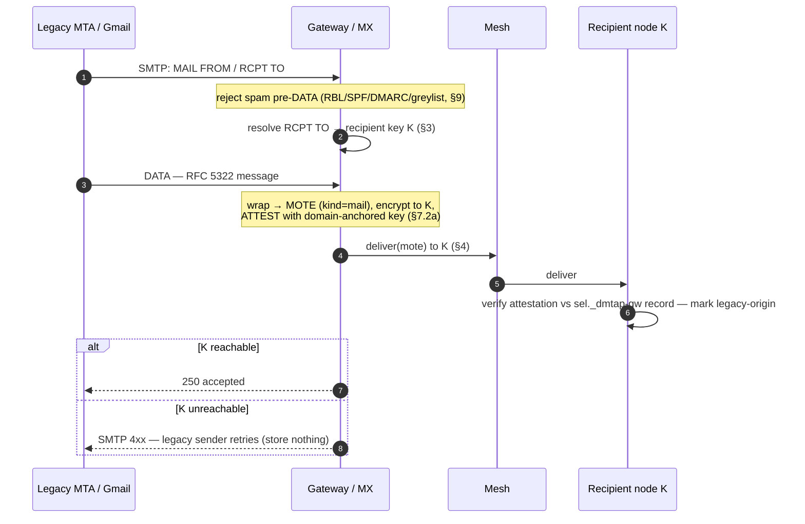
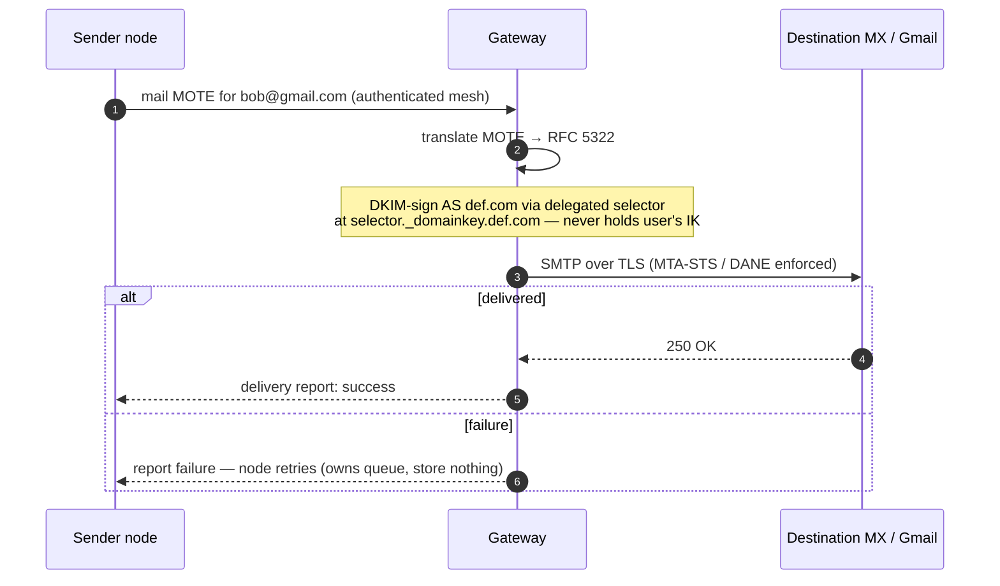

# 7. The Legacy Gateway (optional)

The gateway is the **sole home of every legacy protocol** and the **only** component not
content-blind (the legacy leg is unavoidably plaintext). The **node is native-only** — it speaks
**JMAP + the mesh** and runs **no** legacy protocol server (§8) — so all legacy surfaces live
here:

- **SMTP MX / relay** — interop to and from the outside email world (§7.2, §7.3);
- **IMAP, POP3, SMTP-submission** — legacy mail-client access (§7.15, §8.2);
- **CalDAV / CardDAV** — legacy calendar/contact-client access (§7.15, §8.4);
- the **legacy-client reachability ingress** — the SNI-passthrough / stream routing that accepts
  a raw legacy connection (e.g. an iPhone Mail app) and serves its mailbox (§7.15).

It is **optional** — a node with no legacy correspondents and only native (JMAP) clients never
uses one, and at full DMTAP adoption it is unnecessary and MAY be deprecated. It MAY be the node
binary run in `--gateway` mode by an operator with a reputable IP and a domain.

**Four different "relays," kept distinct** (defined in the §0 glossary). The spec uses "relay"
in four senses: (1) the **native mesh relay** — Circuit Relay v2 / DCUtR (§4.1, §4.3),
content-blind node↔node reachability that lives on the node; (2) the **legacy-client
reachability ingress** (§7.15.2) — the *gateway* surface that accepts a raw legacy connection
and terminates TLS for clients that cannot speak the mesh; (3) the **Relay node class** (§14.1)
— any public-IP node performing sense (1) as a role; and (4) the **relay-mailbox** (§14.3) — the
hosted, content-blind queue a mobile-only user drains. Only sense (2) is a legacy edge surface.
Native nodes reach each other peer-to-peer over the mesh with no gateway in the path (§7.7); the
gateway ingress exists **only** for legacy clients.

## 7.1 Responsibilities

- **Inbound** (legacy → DMTAP): act as MX for a domain, receive SMTP, translate to a MOTE,
  attest it, and deliver into the mesh.
- **Outbound** (DMTAP → legacy): accept a `mail` MOTE marked for a legacy address, translate to
  RFC 5322, DKIM-sign as the sender's domain via **delegated selectors**, and send via SMTP.
- Carry the one irreducible operational cost: **IP reputation** (warmup, feedback loops,
  blocklist remediation, abuse handling).

The gateway holds **no message queue and no mailbox of record**: message durability is punted to
the edges (§7.4). It MAY hold *non-message* operational state — random-alias maps (§7.10.2) and
app-password / legacy-session state (§7.15) — each rebuildable or re-issuable, never a message
store.

## 7.2 Inbound

```
1. Gmail connects to  def.com  MX = gateway; SMTP transaction.
2. Reject spam early, before DATA where possible (RBL/DNSBL, SPF/DMARC, greylisting,
   per-IP rate limits) — never accept the bulk of spam (§9).
3. Look up recipient key K for RCPT TO (via DNS/directory §3).
4. Wrap the RFC 5322 message into a MOTE (kind=mail), encrypt to K, and set an
   ATTESTATION: gateway signs "received via gateway G at T from <SMTP envelope>" **with a
   domain-anchored attestation key** (§7.2a), so the recipient can verify it arrived through a
   gateway genuinely authorized for the recipient's domain.
5. Deliver into the mesh to K (§4). If K's node is unreachable, return SMTP 4xx so the
   SENDING server retries (durability punted to the legacy sender). Store nothing.
```



**Inbound TLS (normative).** The gateway MX MUST offer STARTTLS (RFC 3207) on its SMTP
listener, SHOULD publish an MTA-STS policy in `enforce` mode (RFC 8461) and/or DANE TLSA records
(RFC 7672) for its own MX hostname, and MUST NOT silently downgrade its own advertised TLS
posture inbound: a session that negotiates cleartext where a published policy promised TLS MUST
be refused (SMTP `4xx`), never served in the clear.

### 7.2a Attestation key binding (normative)

An attestation is worthless unless its signing key is provably bound to a gateway the domain
actually authorized — otherwise any operator could forge "legitimate legacy origin" for a domain
it does not serve. Therefore the domain MUST publish the gateway's **attestation public key**,
analogous to DKIM's selector, in DNS (and MAY anchor it in KT):

```
<sel>._dmtap-gw.def.com.  IN  TXT  "v=dmtapgw1; k=<attestation public key>"
```

Recipient nodes **MUST** verify an inbound MOTE's attestation signature against a key published
under the recipient's own domain (or an explicitly trusted gateway set), **MUST** reject
attestations that do not verify, and **MUST** mark accepted ones as *legacy-origin* (not
end-to-end encrypted before the gateway). This upgrades the former "MAY verify" to a default-on
check with a cryptographic anchor.

**Anchor honesty (normative).** The `_dmtap-gw` record is a DNS binding, so the attestation is
only as strong as the record's own anchor: the record SHOULD be **DNSSEC-signed** and SHOULD be
**anchored in KT**. Absent both, the binding inherits the DNS-substitution risk of §13.7 item 6
— a registrar/DNS compromise can substitute the attestation key — and a client MUST NOT present
the attestation to users as a stronger assurance than DKIM-class domain authentication.
High-value recipients MUST require the KT-anchored form.

### 7.2b Internationalized and 8-bit mail (normative)

Legacy mail is not ASCII, and a bridge that mangles it corrupts what it bridges. The rules below
are the v0 floor; the full-EAI path (advertising SMTPUTF8 across all surfaces) is the SHOULD /
v1 target, and a gateway implementing only the floor conforms.

- **8-bit transparency.** A gateway MUST advertise **8BITMIME** (RFC 6152) and MUST carry 8-bit
  message data **byte-exact** through verification and wrapping — DKIM is computed over the
  original bytes, and the bytes wrapped into the MOTE are the bytes received. Lossy re-encoding
  is forbidden: a body that cannot be transcoded to UTF-8 MUST be carried verbatim as opaque
  bytes under its original MIME type, with its original charset declaration preserved so the
  message round-trips exactly.
- **Header encoding.** RFC 2047 encoded-words MUST be decoded to UTF-8 for the native
  subject/display fields of the wrapped MOTE, and non-ASCII header values MUST be (re-)encoded
  per RFC 2047 on the outbound leg.
- **Internationalized domains.** Domains MUST be converted to **A-label** form (RFC 5890) for
  DNS resolution, dialing, and SNI; U-labels are display forms, never wire forms.
- **SMTPUTF8 inbound (RFC 6531).** A v0 gateway SHOULD advertise SMTPUTF8 where its
  alias/directory machinery can carry EAI local-parts. A gateway that does not advertise it MUST
  let a conforming EAI sender fail cleanly at the sender's own MTA (RFC 6531 requires the sender
  to bounce when the capability is absent) — it MUST NOT accept EAI envelopes it cannot carry
  faithfully (never accept-then-mangle).
- **SMTPUTF8 outbound.** When a message requires SMTPUTF8 and the destination MX does not
  advertise it, the gateway MUST fail the send with a specific SMTPUTF8-unsupported error —
  permanent, surfaced to the sender via the §7.3/§7.4 failure report — and MUST NOT emit a
  non-conformant 8-bit envelope. When the message body is 8-bit and the peer lacks 8BITMIME, the
  gateway MUST either down-convert **losslessly** (e.g. content-transfer-encoding) or fail with
  the same specificity; silent corruption is never an option.

## 7.3 Outbound & DKIM delegation

```
1. node → gateway:  a mail MOTE for  bob@gmail.com  (over the mesh, authenticated).
2. gateway translates MOTE → RFC 5322.
3. gateway DKIM-signs as the sender's domain using a DELEGATED selector: the domain owner
   publishes the gateway's DKIM public key at  <selector>._domainkey.def.com  — so the
   gateway signs AS def.com WITHOUT ever holding the user's DMTAP identity key.
4. gateway SMTPs to the destination MX, enforcing TLS via MTA-STS/DANE.
5. On failure, report to the node; the NODE retries (owns the queue). Store nothing.
```



**Outbound TLS (normative).** Where the destination domain publishes **MTA-STS** (RFC 8461) or
**DANE TLSA** (RFC 7672), the gateway MUST enforce TLS to that policy — no downgrade to
cleartext or to an unvalidated peer. Where neither is published, the gateway MUST attempt
opportunistic STARTTLS, and a leg delivered opportunistically or in cleartext MUST be recorded
as **unauthenticated-transport** in the message's `ProvenanceRecord` (§7.8); an operator MAY
refuse cleartext egress outright. A gateway MUST NOT present an opportunistic or cleartext leg
as authenticated transport.

DKIM delegation cleanly separates *deliverability reputation* (the gateway's) from *identity*
(the user's key, never shared).

## 7.4 Statelessness & durability

- Inbound: unreachable recipient → SMTP `4xx` → the **legacy sender** retries.
- Outbound: send failure → the **user's node** retries.
- The gateway holds no message queue and no mailbox of record. It MAY hold non-message
  operational state — random-alias maps (§7.10.2), app-password/legacy-session state (§7.15) —
  which is rebuildable or re-issuable, never a message store. Restart it and nodes/senders
  re-drive; no message is lost or leaked.

## 7.5 Decentralization & economics (summary; anti-abuse in §9)

- Many independent gateway operators MAY register in a directory with `{pubkey, reputation,
  region, price, stake}`; nodes select by reputation-to-destination.
- Per-identity accountability + operator stake keep a shared reputation pool safe to
  decentralize (§9). DKIM delegation makes operators swappable (change the delegated selector).
- Postage (§9) MAY fund outbound legacy sending (the stamp the sender attaches is redeemed by
  the delivering gateway), making it revenue-neutral and doubling as spam pricing.

## 7.6 Dual-stack addressing

A single `abc@def.com` is reachable both ways (§3.2): DMTAP senders resolve name→key and go
native (mesh, no gateway); legacy senders use MX→gateway. Capability is discovered per-sender;
no coordination is required, and native traffic grows while gateway traffic fades.

## 7.7 Fairness, self-host backstop & non-lock-in

DMTAP does not — and cannot — mandate that every gateway serve everyone. It instead makes **no
gateway load-bearing**, so fair access is a structural property, not a rule requiring anyone's
compliance.

### You never need a specific gateway

- **DMTAP-native needs no gateway.** DMTAP↔DMTAP delivery is key-based over the mesh (§4); a user
  with only DMTAP correspondents never invokes one.
- **Self-host is always available.** Any user with a reputable IP and a domain MAY run the
  gateway (§7) themselves and depend on no third party. This **self-host backstop** makes
  gateway access a *right* (you can always serve yourself), not a grant.

### Why a universal-service mandate is infeasible

A protocol rule "every gateway MUST accept all traffic" is:

1. **Unenforceable** — no authority can compel a sovereign operator in a decentralized system;
   refusal or silent degradation cannot be prevented.
2. **Economically self-defeating** — a gateway forced to accept all traffic inherits the abuse
   that destroys its IP reputation, degrading the service for everyone. This is precisely why
   open SMTP relays died.

So DMTAP does not attempt it. Fairness is achieved by the four mechanisms below instead.

### How fairness is achieved

1. **The self-host backstop** (above) — the guaranteed right to serve yourself.
2. **A competitive, swappable market.** DKIM delegation (§7.3) + key-identity (§1) mean **zero
   lock-in**: a user switches operators with a DNS/DKIM change and no data migration (the box
   is the authority). If one operator refuses, another serves; switching is free.
3. **The accountability layer makes open service viable.** Open relays failed because abuse was
   unattributable. DMTAP attributes every send to an anonymous-but-accountable ARC token +
   optional postage + operator stake (§9), so a gateway *can afford* to serve strangers openly
   — abuse is priced and per-token-bannable, not a reputation-destroying free-for-all.
4. **An optional commons gateway.** A non-profit or protocol-funded operator MAY commit to
   universal, non-discriminatory service (a "public option"), funded by postage/donations, as
   **one operator among many** — not a mandate on all. Reputation ratings (§7.5) reward open
   operators and down-rank discriminatory ones, applying soft, market-driven fairness pressure.

The result is stronger than a mandate could enforce: because you can always route around,
self-serve, or switch — and because accountability makes genuinely-open gateways survivable —
no operator can act as a gatekeeper, without any unenforceable obligation being imposed.

## 7.8 Transport-path provenance (what a recipient can prove about a message's path)

The gateway attestation of §7.2a is not only an anti-spoofing check — it is the **seed of a
verifiable transport-path provenance model**. A recipient (and only the recipient) can learn and
verify **which trust boundaries a message crossed on its way in**, enough for a client to render a
transport-path graph (§8.6), **without** learning anything the mesh is designed to hide. The model
has three parts.

### 7.8.1 What a recipient can learn (and what it deliberately cannot)

**(a) Transport tier.** Whether the message arrived on the **`private`** tier (mixnet + cover,
§4.4) or the **`fast`** tier (direct/low-hop, §4.5). The recipient node knows this from *how it
received the packet* — it is an **observation**, not a sender claim.

**(b) Gateway-touched vs. pure-mesh.** A message that transited a **legacy gateway** carries that
gateway's §7.2a attestation (`GatewayAttestation`, §18.3.11) sealed inside its `Payload`
(§18.3.5 key 9) ⇒ it is **legacy-origin / gateway-touched**: it was plaintext at a gateway before
the mesh. A **native** DMTAP↔DMTAP message carries **no attestation at all** ⇒ it is
**provably pure-mesh — never plaintext at any gateway**, end-to-end encrypted the whole way. This
inference is **sound** precisely because §7.2a makes the attestation **mandatory** for legacy
mail and requires the recipient to **reject** unattested legacy-origin mail (`0x0601`/`0x0602`,
§19.3.1): so every *accepted* message is either validly attested (gateway-touched) or attestation-
free (pure-mesh) — there is no third state in which legacy plaintext slips in unmarked.

**(c) A coarse, privacy-safe hop descriptor.** For the `private` tier the recipient learns only the
**profile floor** the message satisfied — `≥ 3` hops (Standard) or `≥ 5` (High-security), §4.4.10 —
**never** the identities, addresses, count-beyond-the-floor, or per-hop timing of the mixes it
traversed. **This is intentional and is the privacy guarantee, not a gap:** the private tier is
*designed* so no party — including the recipient's own node — can reconstruct the path (§6.2,
§4.4). Provenance therefore answers **"which trust boundaries did this cross?"** (a mixnet? a
gateway? whose?) — **never "which nodes carried it?"**. For the `fast` tier the descriptor MAY note
the directly-observed hop, which exposes nothing beyond what `fast` already reveals (the graph is
observable on `fast`, §4.6, §6.5).

### 7.8.2 The provenance record

The recipient node assembles a **`ProvenanceRecord`** (§18.8.1) at reception, composing the
**observed** transport (tier/profile/coarse-hops, part (a)/(c)) with the **verified** sealed
attestation chain (part (b)). It is **node-local** — served only to the owner's own devices over
the authenticated client surface (§8.1, §19.9), never attached to a MOTE or shown to any third
party — and it carries **no mix-node identity** (§6.8). The gateway attestation it verifies
(`GatewayAttestation`, §18.3.11) travels **sealed inside the encrypted `Payload`**, so the gateway
identity, receipt time, and legacy-sender address it names are visible **only to the recipient** —
they are **never** exposed to a mixnet intermediary, preserving §6 metadata privacy in full.

### 7.8.3 Chaining multiple gateways

If more than one gateway bridges a message (uncommon; the dominant case is a single inbound
gateway), `Payload.provenance` carries an **ordered chain** of `GatewayAttestation`s (`seq`,
§18.3.11). Each entry is verified independently against the `_dmtap-gw` key published under **its
own `domain`**; the entry that bridged mail for the recipient MUST verify under the **recipient's
own domain** (§7.2a), and entries under other domains verify only if that domain is in the
recipient's explicitly-trusted gateway set, else they are surfaced as an *unverified hop*. **One**
valid attestation already establishes *gateway-touched*; the chain merely shows the full legacy
path. A **deniable** message (§5.2.1) never carries a chain — deniable traffic is native P2P and
never transits a gateway.

## 7.9 Self-host `@host.net`, gateways, and billing

DMTAP is explicit about who pays for what, and the provenance model (§7.8) makes it
**auditable**.

- **You may self-host your own domain.** A domain owner MAY run their **own node** for
  `you@host.net` — Tier C (§3.8), self-hosted domain authority (§3.10.1) — and reach every other
  DMTAP user **natively over the mesh with no gateway and no operator at all** (§7.7 self-host
  backstop). Native mesh delivery is **key-based and free**: no gateway is involved, so **nothing
  is billable** for it — this is the §12.3 inviolable rule (the seam meters *operations*, never
  native delivery or any privacy/crypto path).
- **Reaching the legacy world uses a gateway, and *that* is the billable event.** To exchange mail
  with legacy (`@gmail.com` etc.) a self-hoster uses a **gateway** — either **their own**
  (self-hosted `--gateway`, §7; then they bear only the IP-reputation cost, and there is no
  third-party bill) or a **third-party operator's**. Billing attaches to **gateway operations
  only** — metered legacy sends/receives (§12.2 Metering, §12.6) — **never** to native mesh
  delivery. Exactly the messages that carry (outbound) or receive (inbound) a §7.2a attestation are
  the ones a bill can reference; a pure-mesh message (§7.8.1(b)) is by construction **not** a
  gateway operation and **not** billable.
- **How a self-hoster is authorized by a third-party gateway.** Using someone else's gateway is a
  **relationship the gateway operator's policy governs** (`GatewayAuthz`, §12.2), not a protocol
  entitlement: the operator authorizes the self-hoster's identity (per-identity accountable token,
  §9), the self-hoster **delegates a DKIM selector** to that gateway for outbound (§7.3, §3.8) and
  points **inbound MX** at it for legacy receipt (§7.2), and the operator meters and bills the
  resulting legacy egress/ingress. Because DKIM delegation is a DNS change with **zero lock-in**
  (§7.7), a self-hoster can switch or drop the gateway at any time and fall back to native-only or
  to self-hosting the gateway.
- **The bill is auditable to the user.** Because every gateway-touched message carries a verifiable
  §7.2a attestation naming the gateway `domain` and receipt time, a user can **cryptographically
  confirm** that each billed legacy operation corresponds to a real message that actually used the
  gateway — "you were billed because *this* message used the gateway" is checkable against the
  message's own `ProvenanceRecord` (§18.8.1, §7.8), not taken on trust. Conversely, a message the
  client shows as **pure-mesh** MUST NOT appear on a gateway bill. This closes the loop between the
  §12 billing seam and what the user can independently verify (§12.7).

## 7.10 Native ↔ legacy address mapping (a swappable gateway alias, normative)

A native DMTAP domain (`imran@mydomain.com` with a `_dmtap` record but **no legacy MX**) must still
interoperate with legacy email (Gmail) through a gateway. The gateway is a **bridge, not an identity
owner**: the **native address is the anchor**, the **gateway alias is a separate, rotatable pointer**,
and the native mesh never touches a gateway (§7.7). This section specifies the address mapping in both
directions and the two alias encodings.

### 7.10.1 Native → legacy (why a reply-path rewrite is required)

When a native user sends to a legacy recipient, the gateway MUST rewrite the **return / reply path**
to a **legacy-routable gateway alias**, because **legacy email cannot route a reply to a non-MX native
address**: a Gmail user replying to `imran@mydomain.com` would have its MTA look up `mydomain.com`'s
MX, find none (native domains publish no MX), and bounce. So the machine `Reply-To:` / envelope-from
MUST be the **gateway alias** (which *does* have an MX → the gateway); the display MAY still show the
friendly native `imran@mydomain.com` (an RFC 5322 display-name/comment) for the human. A legacy reply
then routes to the gateway, is mapped back to the native address (§7.10.3), converted to a MOTE, and
delivered over the mesh.

### 7.10.2 Two alias encodings (offer both — normative tradeoff)

A gateway MUST support at least one and SHOULD offer both; the choice is disclosed to the user:

| Encoding | Form | Gateway state | Privacy tradeoff |
|----------|------|---------------|------------------|
| **Encoded** | `localpart.nativedomain@gateway.domain` | **near-stateless** (self-describing; the alias *is* the mapping) | **reveals the native domain** to the legacy recipient |
| **Random** | `<rand>@gateway.domain` + a gateway `GatewayAliasMap` (§18.3.12) | **stateful** (a per-alias table row) | **hides** the native address (Hide-My-Email-style); supports **per-correspondent, burnable** aliases |

**Encoded local-part format (unambiguous, reversible, RFC 5321-valid).** Pack a native
`localpart@nativedomain` into a **single** SMTP local-part by joining the two with a reserved
separator and **escaping** any separator that occurs inside the parts:

```
encode(localpart, nativedomain):
  esc(s) = replace every "-" with "--", then every "." with "-."   ; reversible escaping
  local  = esc(localpart) ‖ "." ‖ esc(nativedomain)                ; "." at the TOP level is the sole join
  alias  = local ‖ "@" ‖ gateway.domain
decode(local):
  split `local` at the single UNescaped top-level ".", un-escape each half → (localpart, nativedomain)
```

The escaping makes the top-level join `.` **the only unescaped `.`**, so decode is unambiguous and
the round-trip is exact (`imran` + `mydomain.com` → `imran.mydomain-.com@gateway.domain` →
`imran` + `mydomain.com`). The result MUST be RFC 5321-valid: the local-part MUST be ≤ 64 octets and
the whole path ≤ 254 octets (§16.11); an over-length or non-decodable encoding MUST be rejected
(`ERR_GATEWAY_ALIAS_ENCODING_INVALID`, `0x0606`, FAIL_CLOSED_BLOCK — the gateway MUST NOT **guess** a
native address from an ambiguous local-part). A gateway MAY instead use a strict `base32`/`base64url`
packing of `det_cbor([localpart, nativedomain])`; the escaping form above is the normative default so
two gateways interoperate on encoded aliases.

**IDN / EAI (normative).** `nativedomain` MUST be normalized to its **A-label** form (RFC 5890)
before encoding, so an encoded local-part is always ASCII. A `localpart` containing non-ASCII
octets (an EAI local-part, §7.2b) cannot be carried by the encoded form: it MUST be carried
under the **random** alias form or rejected with `ERR_GATEWAY_ALIAS_ENCODING_INVALID`
(`0x0606`). A gateway MUST NOT emit a non-ASCII encoded local-part. Decode converts the A-label
back to its U-label for **display only** — the A-label remains the form used for resolution,
dialing, and SNI (§7.2b).

**Random form.** A `<rand>@gateway.domain` (a high-entropy localpart) is stored in a
`GatewayAliasMap` row (§18.3.12) binding `alias → native`, OPTIONALLY scoped to one `correspondent`
and **burnable** (a per-sender throwaway). It reveals nothing about the native domain, at the cost of
gateway-held state and the availability of that mapping.

### 7.10.3 Legacy → native

The gateway MX receives at the alias, runs the **existing DKIM/SPF/DMARC** anti-spoof checks (§7.2),
maps **alias → native** (decode the encoded form, or look up the `GatewayAliasMap` row; an
unmapped/expired/burned random alias, or a non-decodable encoded one, fails
`ERR_GATEWAY_ALIAS_UNMAPPED`, `0x0605`, RETURN_SENDER_SMTP `550 5.1.1` — "no such user," identical to
the §21.9 non-existent-recipient reply, since the bridge owns no identity to defer to), converts the
RFC 5322 message to a **signed MOTE**, stamps a gateway-touched `GatewayAttestation` /
`ProvenanceRecord` (§7.2a, §7.8), and delivers to the mesh (§4) at the native key.

### 7.10.3a Bounces and delivery status notifications (normative)

A DSN/NDR (RFC 3464; SMTP envelope `MAIL FROM:<>`) inbound to a gateway alias MUST be
recognized as such and exempted from the SPF/DMARC hard-fail and cold-sender gates of §7.11.1
PROVIDED the gateway can correlate it — via `Original-Recipient` and/or the referenced
`Message-ID` — to an outbound message this gateway relayed for that identity within the node's
retry window (§7.4). A null-return-path message the gateway cannot correlate is still gated like
any other inbound (uncorrelated `MAIL FROM:<>` is the classic backscatter/spoof vector). A
correlated bounce is delivered to the native sender as a **system/bounce MOTE**, so a legacy
delivery failure is visible, not swallowed. When the node's outbound retry budget (§7.4)
exhausts, the node MUST surface a permanent-failure notice to the sender — a legacy send never
fails silently.

### 7.10.4 Swappable / ephemeral, and the honest residual

The gateway alias is **separate from identity**: it is **rotatable** (change or burn it with no effect
on the native address or key), **non-permanent**, and **multi-gateway** (the native user MAY bridge
through several gateways at once, each with its own aliases). The **native address is the anchor** —
the thing that survives — exactly as the key is the anchor under the native address (§7.7 non-lock-in,
zero-migration DKIM-delegation switch).

**Residual (disclosed, §6.6).** The legacy leg is **plaintext at the legacy recipient and
gateway-visible** — bridging to old email is **inherently non-private**: the gateway is the one
component that is not content-blind (§7 preamble), the encoded form additionally discloses the native
domain to the recipient, and a legacy MTA sees the mail in the clear. The **native mesh never touches a
gateway** (a pure-mesh message is provably end-to-end, §7.8.1(b)), and every gateway-touched message is
**marked** so the user sees which mail crossed the bridge (`ProvenanceRecord`, §8.6). DMTAP states this
honestly rather than implying the bridge inherits mesh privacy.

### 7.10.5 Aliases the gateway can and cannot mint — vanity local-parts (normative)

A gateway/cloud operator **can only alias what already exists**; it **MUST NOT mint a global name**.
Every DMTAP NAME is **anchored** — to DNS (`local@domain`) or to a crypto name-chain (`name.eth`,
`name.sol`, §3.12.5) — with the derived **8-word key-name (§3.9.6) as the zero-authority floor**
beneath all of them. A gateway alias is therefore **never a new identity**; it is exactly one of two
things:

- **(a) a pointer at the user's own anchor** — the reply-path rewrite and the two encodings of
  §7.10.1–§7.10.2, which merely re-route to an address the user already controls; or
- **(b) a fully-qualified local-part under a domain the GATEWAY owns** — `you@gw.example`, valid
  **only** as `localpart@gatewaydomain`. Because the `@gatewaydomain` suffix disambiguates it, case (b)
  **cannot collide with a network name**: it is a name *in the gateway's own namespace*, not a global
  handle.

**Vanity local-parts (chosen short names on the gateway's own domain).** A **vanity** is a
user-*chosen* local-part in case (b) — `alice@gw.example`. It is the **only** alias form with
**ownership semantics**, and it is fenced in:

- A vanity **MUST be dot-free**, and **MUST** be valid **only** fully-qualified (`vanity@gatewaydomain`),
  **never** as a bare handle. A **bare, un-anchored handle is FORBIDDEN** (§3.13.1): allocating a
  globally-unique name from a bare string is the **flat-namespace consensus problem DMTAP deliberately
  does not solve** (Zooko, §3.9, §15.5); the **key-name is the floor instead** (§3.9.6). A gateway that
  hands out a bare handle would be claiming an authority it does not have.
- **Dotted local-parts are RESERVED** for the forwarded-address encoding `local.nativedomain@gateway`
  (§7.10.2). The **dot-free-vanity vs. dotted-forwarded** split makes the two **unambiguous** at the
  gateway: a `.` in the local-part means "decode a forwarded native address," its absence means "look up
  a vanity registration."
- A vanity is **first-come and revocable** — **yours only as long as you hold the registration on the
  gateway's domain** (§3.11.5's provider-dependence, applied to the gateway's namespace). It carries the
  same honest residual as any tier-1 vanity (§3.11.2): the gateway MAY de-allocate it, and the **key +
  key-name survive** untouched (§3.9.6).
- A vanity **MUST yield to, and MUST NOT shadow, a real network name.** If a resolvable `name@domain`
  or name-chain name exists, that anchored name wins; the gateway MUST NOT let a chosen vanity mask or
  intercept delivery to an anchored name.

**The two AUTO-derived aliases are conflict-free (normative).** Two of a gateway's aliases are
**un-chosen** — they need no registration, cannot collide, and are **always available**:

1. the **key-derived** alias `dmtap1-<base32>@gateway` — a deterministic encoding of the identity key
   (the §3.9.6 key-name family), unique-by-hash exactly as the key-name is; and
2. the **forwarded encoding** `local.nativedomain@gateway` (§7.10.2), self-describing and reversible.

Neither is user-chosen, so neither raises an ownership question and neither can be squatted; both are
offered by default. **Chosen vanity is the ONLY alias form with ownership semantics** — and it is
precisely the form an operator MAY price and revoke (§7.14), because it is the only one that consumes a
scarce, human-chosen local-part in the gateway's namespace.

## 7.11 Bidirectional anti-abuse is mandatory (normative floor)

A gateway sits on the boundary between the accountable mesh (§9) and the open legacy world, so it is
the one component abusable in **both** directions: as an **injector** (legacy spam pushed into the
mesh) and as an **open relay** (the mesh used to blast legacy inboxes). Because no single gateway is
load-bearing (§7.7), a gateway that fails either way poisons the shared reputation pool (§9.6) and
strangers' inboxes. Therefore anti-abuse enforcement is a **MUST in both directions**, and every check
**fails closed**.

### 7.11.1 Inbound (legacy → DMTAP): MUST NOT become a spam injector

Before it injects anything into the mesh (§7.2), a gateway MUST:

1. Apply **legacy sender authentication** — **SPF, DKIM, and DMARC** — and reject on hard fail
   pre-`DATA` where possible (§7.2 step 2 → SMTP `550 5.7.1`, §21.9), alongside the standard
   RBL/DNSBL + greylisting hygiene.
2. Carry the legacy origin through the **cold-sender gate** (§9.2): an injected MOTE from a legacy
   stranger is a **cold contact** and MUST be subject to the recipient's §9 challenge policy exactly
   as a native cold sender is. The gateway MUST NOT inject legacy mail with the standing of an
   established contact, and MUST NOT strip or forge the recipient-facing challenge state; mail it
   cannot qualify defers to the requests area (§9.2), never the inbox.

A gateway MUST NOT emit an inbound MOTE that bypasses either check. This is what stops it from
laundering legacy spam into the accountable mesh.

### 7.11.2 Outbound (DMTAP → legacy): MUST NOT become an open relay

Before it relays a mesh MOTE to a legacy address (§7.3), a gateway MUST:

1. Relay **only for authenticated senders** — one it has an established authorization relationship
   with (`GatewayAuthz`, §12.2; **open** or **key-registered**, §7.12) **or** one presenting valid
   postage (§9.5) redeemable by this gateway. An outbound attempt from a sender the gateway has
   **neither authenticated nor been paid by** MUST be refused, fail-closed, with
   `ERR_GATEWAY_SENDER_UNAUTHENTICATED` (`0x0607`, §21.8). A valid mesh `sender_sig` proves *who
   signed*, **not** *who may relay* — anyone can sign a MOTE — so signature-validity is necessary but
   **not sufficient** to authorize egress. This is the open-relay-prevention floor whose absence
   killed SMTP's open relays (§7.7).
2. Enforce **per-sender rate limits and volume caps** on legacy egress (§9.6 per-identity
   accountability applied as a throttle), so a single authenticated-but-compromised sender cannot
   turn the gateway into a blaster. Exceeding the cap is refused/deferred under the operator's egress
   policy.

### 7.11.3 The floor vs. the numbers

The rules above are the **interoperable security floor**: *that* both directions are gated, *that*
the gates fail closed, and *which* signals gate them (SPF/DKIM/DMARC + cold-sender inbound;
authenticated-sender + rate/volume outbound). The **specific values** — DMARC override handling, RBL
choice, challenge thresholds, egress rates, volume caps, and any pricing — are **operator policy and
out of scope** (§7.13). A gateway MUST implement the floor; it chooses the numbers.

## 7.12 Optional key-authenticated gateway registration (capability-negotiated)

§7.11.2 requires a gateway to relay outbound only for **authenticated** senders, and §7.7 requires
that access never become lock-in. A gateway MAY be **open** (it authorizes senders by some
operator-chosen means — postage alone, or an out-of-band account) or **key-registered** (a sender
authenticates with their **DMTAP identity key**, interoperably, with no operator-specific account
system). This section specifies the OPTIONAL key-registered handshake so a client can register with
**any** key-registered gateway using the same ceremony — the interoperable mechanism behind the
authenticated-sender requirement. It is **DMTAP-Auth (§13) with the gateway as the relying party** and
introduces **no new cryptography**.

### 7.12.1 Capability negotiation (a gateway MAY be open or key-registered)

A gateway advertises its registration modes in its directory descriptor (§7.5): `open`,
`key-registered`, or both. A client MUST NOT assume a mode; it reads the advertised set and, for
`key-registered`, runs §7.12.2. A gateway advertising neither is native-only and performs no
third-party outbound relay. This mirrors the mail native/legacy capability discovery (§7.6) — the
mechanism is **negotiated, never mandated**; the handshake is OPTIONAL on both sides.

### 7.12.2 The registration ceremony (reuse §13.3)

```
1. client → gateway:  register(name)          ; the client's DMTAP name (§3)
2. gateway resolves name → key (§3.3 lookup, pinned §3.4) and returns a Challenge:
     { gw_origin, nonce, issued_at, exp, aud = gateway id, scope = "gateway-egress" }
   (the §13.3 Challenge shape; gw_origin is the gateway's stable identifier)
3. the client's TRUSTED CLIENT (§13.3.1) binds + displays gw_origin, runs user
   verification, and the client's identity/device key signs the §13.3 domain-separated
   "DMTAP-v0/auth-assertion" preimage over the Challenge (with a fresh session cnf).
4. gateway verifies the signature against the pinned key (§3.4), aud == its own id,
   nonce unused, not expired  →  the sender is authenticated; the gateway records a
   per-identity ACCOUNTABLE egress authorization (§9.6) bound to that key.
```

Because it **is** the §13.3 ceremony, it inherits its properties verbatim: origin-binding and
intent-matching (§13.3.1) so a relayed challenge cannot be replayed to register a victim; a **key-bound
(not bearer)** authorization (§13.4); and revocation without rotating `IK` (§13.4). The gateway learns
**which key** registered — it must, for accountability (§9.6) — which is the same deliberate,
per-relationship identity disclosure as any DMTAP-Auth login (§13.7 limit 7), disclosed and **not** a
metadata-privacy regression for the mesh (native mesh delivery never touches a gateway, §7.7).

### 7.12.3 What registration authorizes (and what it does not)

A successful registration authorizes the key for **outbound legacy egress** through this gateway
(satisfying §7.11.2 step 1) and MAY anchor inbound MX/DKIM delegation (§7.2, §7.3, §7.10). It is a
**per-gateway** relationship: it grants nothing on any other gateway, carries **zero lock-in** (drop or
switch it with a DNS/DKIM change, §7.7), and confers **no** entitlement to unlimited or unpriced relay
— the rate/volume caps (§7.11.2 step 2) and any pricing remain operator policy (§7.13). Being **open**
vs. **key-registered** is the operator's choice; both satisfy the §7.11.2 authenticated-sender floor.

## 7.13 In-scope mechanism vs. out-of-scope operator policy (normative boundary)

DMTAP draws the same in-spec-contract / out-of-scope-policy line for the gateway that §3.11 draws for
naming providers: the **interoperable mechanism and the security floor are in-spec**; the
**operational knobs are operator policy**. State it explicitly so neither side is over-claimed.

**In scope (normative — every conformant gateway MUST honor these, or interop/security breaks):**

- the **authorization *mechanism*** — the authenticated-sender requirement and the OPTIONAL key-auth
  handshake (§7.11.2, §7.12);
- the **address mapping** — native↔legacy aliasing and its two encodings (§7.10);
- **provenance** — the §7.2a attestation, the §7.8 `ProvenanceRecord`, and the verifiable
  pure-mesh-vs-gateway-touched distinction;
- the **anti-abuse *floor*** — that both directions are gated and fail closed, and which signals gate
  them (§7.11).

**Out of scope (operator / implementation policy — DMTAP does not specify it, and an implementation
is free to choose):**

- **quota values, rate limits, and volume caps** — the *numbers*, not *whether* they exist;
- **usage-tracking / metering mechanics** — §12.2 meters *operations*; how an operator records
  them is its own concern;
- **pricing and billing** — postage amounts, egress fees, plan structure (§7.5, §7.9, §12).

The dividing rule is identical to §3.11's for names and §12.3's inviolable metering rule: **what two
independent implementations must agree on to interoperate securely is in-spec; what an operator may set
unilaterally without breaking any other party is out of scope.** A gateway that changes its prices or
caps stays conformant; a gateway that skips the §7.11 floor or the §7.12 handshake shape does not.

## 7.14 Gateway/cloud business-model seam (informative)

This section is **informative**. It sketches how an operator MAY build a *business* on top of the
normative floor without any of it entering the interop contract. The §7.13 rule stands — **the interop
and security floor is in-spec; metering and pricing are operator policy** — and what follows is only a
**vendor-neutral reference model** (no company, no price).

**What is always free and works with no operator.** Identity, keys, the key-name (§3.9.6), the
node, the client, and the protocol itself are **free and operator-independent**: a user holding a
keypair is a first-class DMTAP identity — reachable, verifiable, and deliverable-to — with **no**
gateway or cloud in the path (§3.13, §7.7). Nothing an operator sells can gate that, and an operator
that disappears takes only its *conveniences* with it (§3.11.5); self-hosting the same functions costs
the operator nothing to permit (§3.11.2 tier 3).

**What an operator MAY meter.** On top of that floor, a reference operator sells **three usage
meters**, each tied to a convenience the user explicitly opted into:

1. **alias** — a **local-part on the operator's own domain** (a vanity, §7.10.5): the scarce,
   human-chosen name the operator's namespace supplies.
2. **gateway usage** — **legacy bridging** (§7): the SMTP-facing ingress/egress work of translating to
   and from old email, including the IP reputation the operator carries.
3. **node usage** — **hosted storage / relay**: the durability and reachability the operator hosts on
   the user's behalf (§5.5.1 pinning, §14).

**The two seams (all metering rides these).** Every one of the above is expressed through **exactly
two seams**, the *only* operator-specific surfaces:

- an **authorization / quota decision** — "is this request allowed, and is it within quota?" (the
  `GatewayAuthz` / `Policy` decision, §12.2); and
- an **append-only usage meter** — "record that it happened" (the §12.2 operation meter, governed by
  the inviolable metering rule of §12.3).

Both seams are **out of scope for interop** (§7.13): two independent operators need not agree on prices,
quotas, or plans to interoperate, and a user MAY switch operators — or self-host — **without changing
identity or keys**. DMTAP specifies the **seam shape**, never a company, a price, or a plan.

## 7.15 Legacy client access and the reachability ingress (normative)

The node is native-only (§8): it serves **JMAP** over the mesh and runs no legacy protocol
server. Every legacy client surface — and the ingress that carries a legacy client to it — is a
**gateway** surface, specified here. This is the counterpart to §7.2/§7.3 (which bridge the
outside *email world*): §7.15 serves the user's own **legacy client apps** (Apple Mail, Outlook,
Thunderbird, DAVx⁵, old iPhones) that cannot speak JMAP + the mesh.

### 7.15.1 The legacy surfaces the gateway serves

A gateway serving legacy clients MUST project the identity's one MOTE store through the requested
legacy protocol, decrypting as required (§7.15.3):

- **IMAP (RFC 9051 / 3501)** and **POP3 (RFC 1939)** — read access, projecting MOTEs as
  folders/flags (IMAP) or a maildrop (POP3).
- **SMTP-submission (RFC 6409)** — outbound: the gateway converts the submitted RFC 5322 message
  to a MOTE for a native destination, or bridges it to legacy via §7.3.
- **CalDAV (RFC 4791)** and **CardDAV (RFC 6352)** — projecting JSCalendar/JSContact MOTEs as
  iCalendar (RFC 5545) / vCard (RFC 6350) for legacy calendar/contact clients (§8.4).

**Auth = app-passwords.** The gateway issues app-specific passwords mapped to the identity, so a
legacy client authenticates without ever touching the keypair; revoking an app-password revokes
that client. These are the **only** legacy client surfaces; the node exposes **none** of them.

### 7.15.2 The legacy-client reachability ingress

A legacy client opens a raw protocol/TLS connection (e.g. IMAPS on 993, SMTPS on 465) to a
hostname. Because nodes have no static IP and legacy clients cannot speak the mesh, the gateway
provides the **reachability ingress**: it accepts the inbound legacy connection (routing by SNI /
stream to the right mailbox), **terminates TLS**, and speaks the legacy protocol against the
mailbox.

- This ingress is a **gateway** surface. It MUST NOT be confused with the node's **native mesh
  relay** (Circuit Relay v2 / DCUtR, §4.3): the mesh relay carries **ciphertext-only, content-blind**
  node↔node traffic and never speaks a legacy protocol, whereas the legacy ingress terminates a
  cleartext-capable legacy session and therefore sees plaintext (§7.15.3).
- The gateway MAY reach the backing mailbox over the mesh to a native node, but the **legacy
  protocol is terminated at the gateway**, not at the node.

### 7.15.3 Honest-privacy consequence (normative)

To speak IMAP/POP3/SMTP-submission/CalDAV/CardDAV, a gateway **MUST decrypt** the mailbox — the
legacy protocols have no notion of the DMTAP object encryption. Therefore:

- A legacy client's mail (and calendar/contacts) is **visible in the clear to whatever gateway
  serves it**. A gateway serving legacy clients is **not** content-blind for those clients.
- A **private** gateway (§7.15.4, the user's own) means **zero third party** sees it — the
  operator is the user. A **public** (or other third-party) gateway is a **deliberate trust
  decision**, equivalent to choosing Gmail: that operator can read the mail it serves.
- This is **unlike** the node's native path. JMAP + the mesh (§8.1) is **zero-access /
  zero-intermediary**: no gateway is in the path and nothing is decrypted by a third party. A
  client MUST NOT present gateway-served legacy access as end-to-end when served by a non-private
  gateway, and MUST surface which gateway (and thus which trust boundary) serves a legacy
  session.

Legacy client access is gateway-served, and a non-private gateway is an intermediary that can
read the mail it serves. DMTAP states this plainly rather than presenting the legacy path as
private.

### 7.15.4 Operator modes (normative)

A gateway operator **MUST declare exactly one** of three service modes for legacy client access
and **MUST enforce the declared mode**; the mode is disclosed to users (and advertised in the
directory descriptor, §7.5). Advertising a mode while operating another — e.g. advertising
`private` while serving third parties — is non-conformant misrepresentation, not a policy
choice:

| Mode | Who it serves | Trust profile |
|------|---------------|---------------|
| **public** | open registration — any user MAY obtain legacy access | the operator can read the mail of every user it serves; users accept it like a public mail provider |
| **registered-clients-only** | only identities the operator has an established registration relationship with (§7.12) | same read-access for those users; not open to strangers |
| **private** | a single user — the operator themselves (own gateway) | **zero third party**: the only party that can read the mail is the user, because the user *is* the operator |

- The **private** mode is the honest-privacy-preserving option: run your own gateway
  (`--gateway`, §7) for your own legacy clients and no external party ever decrypts your mail.
- **public** and **registered-clients-only** are the same honest trust trade as choosing any
  hosted mail provider — normatively **disclosed** (§7.15.3), never presented as zero-access.
- The mode governs **legacy client access only**; it is orthogonal to the SMTP bridge's
  inbound/outbound anti-abuse floor (§7.11) and to the metering seams (§7.14).

### 7.15.5 Optional and deprecatable

Like the SMTP bridge, the legacy client surfaces are **OPTIONAL** and **deprecatable**: they
exist to onboard clients that cannot yet speak JMAP + the mesh, and they **fade as native
adoption grows**. A node with only native (JMAP) clients needs no gateway at all. Legacy client
support is **not required for node conformance**; it is a RECOMMENDED **gateway** capability for
adoption (§10).
