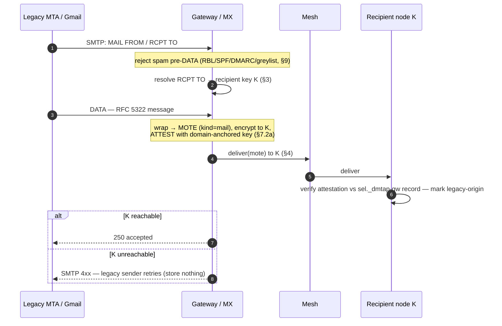
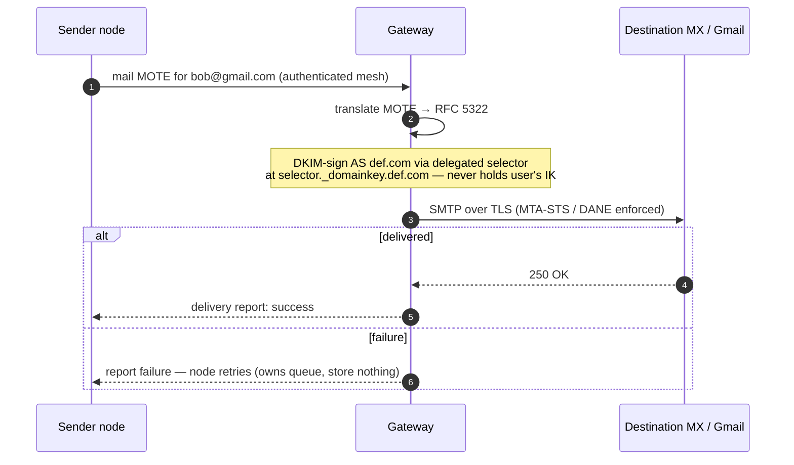

# 7. The Legacy Gateway Role (optional)

The gateway is **not a component and not a class of server**. It is the node binary run with
`--gateway` (§0.2.3) — a **role**, like relay or mix — and its entire job is **adaptation to
legacy mail**. It is the **sole home of every legacy protocol** and the **only** part of DMTAP not
content-blind (the legacy leg is unavoidably plaintext). The **node is native-only** — it speaks
**JMAP + the mesh** and runs **no** legacy protocol server (§8) — so all legacy surfaces live
here:

- **SMTP MX / relay** — interop to and from the outside email world (§7.2, §7.3);
- **IMAP, POP3, SMTP-submission** — legacy mail-client access (§7.15, §8.2);
- **CalDAV / CardDAV** — legacy calendar/contact-client access (§7.15, §8.4);
- the **legacy-client reachability ingress** — the SNI-passthrough / stream routing that accepts
  a raw legacy connection (e.g. an iPhone Mail app) and serves its mailbox (§7.15);
- **legacy addressing** — the alias forms that exist only because legacy mail cannot route to a
  key (§7.10).

It is **optional** — a node with no legacy correspondents and only native (JMAP) clients never
uses one — and it is **transitional by construction** (§7.1c). It is also the one role that needs
something not everyone can get (§7.1a), which is precisely why the specification works so hard to
keep everything else off it.

**"Relay" names several things in this family; only one distinction is load-bearing here** (the
full four-sense disambiguation lives in the §0 glossary). §7's reader must not confuse the
**legacy-client reachability ingress** (§7.15.2) — a *gateway* surface that terminates TLS for a
legacy client that cannot speak the mesh — with the content-blind **native mesh relay** (Circuit
Relay v2 / DCUtR, §4.3), which carries node↔node traffic with no gateway involved. Native nodes
reach each other peer-to-peer over the mesh with no gateway in the path (§7.7); the gateway
ingress exists **only** for legacy clients.

## 7.1 Responsibilities — and the much longer list of non-responsibilities

- **Inbound** (legacy → DMTAP): act as MX for a domain, receive SMTP, translate to a MOTE,
  attest it, and deliver into the mesh.
- **Outbound** (DMTAP → legacy): accept a `mail` MOTE marked for a legacy address, verify the
  submitting identity is authorized to claim the address it is about to sign and send as
  (§7.11.2 step 2), translate to RFC 5322, DKIM-sign as the sender's domain via **delegated
  selectors**, and send via SMTP.
- **Legacy client surfaces and legacy addressing** (§7.15, §7.10).
- Carry the one irreducible operational cost: **IP reputation** (warmup, feedback loops,
  blocklist remediation, abuse handling).

**What a gateway is NOT (normative).** The scope above is exhaustive. A gateway MUST NOT be, and
an implementation MUST NOT require it to be, any of the following — each of which is a node role
anyone may take (§0.2.2), and each of which would, if attached to the gateway, inherit the
gateway's scarce-resource requirement and turn an adapter into infrastructure:

| Not the… | Because that is… |
|----------|------------------|
| **buffer** | an n-of-m role held by peers and the owner's own devices (§14.3, §14.5) |
| **relay** | any public-address node, content-blind (§4.3) |
| **mix** | default-on for always-on public nodes (§4.4.2a) |
| **namer** | DNS + KT + the key-name floor; a gateway can alias, never mint a name (§7.10.5, §3.13) |
| **spam classifier** | recipient-side and on-device, against the user's own corpus (§7.11.4, §9.11) |
| **mailbox of record** | the node is the authority; the gateway holds no message store (§7.4) |

**Two DMTAP users never need a gateway — not once.** Native delivery is key-addressed over the
mesh (§4, §7.7): no gateway is in the path, nothing is decrypted by a third party, and no operator
is present to authorize, meter, or bill anything (§12.3).

The gateway holds **no message queue and no mailbox of record**: message durability is punted to
the edges (§7.4). It MAY hold *non-message* operational state — random-alias maps (§7.10.2) and
app-password / legacy-session state (§7.15) — each rebuildable or re-issuable, never a message
store.

### 7.1a What running the gateway role actually requires (normative)

Stating the requirements plainly matters, because the honest answer determines who *can* be an
operator — and an unstated requirement always resolves into "ask the vendor." To run `--gateway`
you need, and need only:

1. **A public static IP with correct reverse DNS (PTR).** Receiving MTAs check forward-confirmed
   reverse DNS; without it, mail is rejected or scored as spam before content is ever considered.
   The gateway MUST publish a PTR that forward-resolves to the same host, and MUST use a HELO/EHLO
   name matching it.
2. **Unblocked outbound port 25.** This is the **real gating constraint** and the reason the role
   is scarce: most consumer ISPs and a large share of cloud providers block or filter outbound 25
   by default, and unblocking is a per-account decision made by a third party. Nothing in the
   protocol can route around it — SMTP delivery to the legacy world happens on port 25 or not at
   all.
3. **At least one domain**, carrying the records the role needs: **MX** (inbound), **DKIM
   selectors** (delegated per-user signing, §7.3), **SPF** and **DMARC** (so the gateway's own
   sending is authenticated), and the **`_dmtap-gw` attestation** record (§7.2a).
4. **Optionally but desirably, several IPs.** Egress pools (§14.2) let an operator warm addresses
   per receiving ISP and isolate a damaged address rather than losing the whole role.

**A payment method is NOT a requirement, and an implementation MUST NOT imply one.** Nothing in
this section, and nothing anywhere in DMTAP, requires the gateway operator to charge, or the user
to pay, for anything (§12.3). Whether an operator asks for money is that operator's policy
(§7.13), exactly as its rate limits are.

**Consequence.** Requirements 1–3 are why *legacy egress* is the one operator class in DMTAP
(§0.2.3): they cannot be satisfied by wanting to, only by holding a resource somebody else
allocates. Every other function in this document is deliberately kept off that list.

### 7.1b Privilege separation — one binary, separate processes (normative)

The gateway role terminates **untrusted connections from the open internet** on port 25 and runs
SMTP, IMAP, POP3 and MIME parsers over attacker-chosen bytes — historically the most exploited
code in all of mail. Collapsing the gateway into the node's *program* must never collapse it into
the node's *address space*, or the one-binary simplification would trade a deployment convenience
for the worst memory-safety exposure in the system sitting next to `IK`. Therefore:

- Gateway mode **MUST run as a separate process in a separate privilege domain** (distinct OS
  user, and where the platform provides it a distinct container/jail/namespace) from the node's
  identity and store processes. "One binary" is a distribution and configuration property, never
  an isolation property.
- The untrusted SMTP/IMAP/POP3/MIME **parser process MUST NOT have access to any identity key
  material** — not the user's/mailbox-node's `IK`, not device private keys, not recovery material
  — and **MUST NOT have read access to the local MOTE store**. This prohibition is about the
  *user's* keys, not the gateway's own: the gateway node's own attestation `IK` (§7.2a), and any
  IK-authorized gateway device key used to sign an injected MOTE (§7.2 step 4), live in a
  **separate trusted signer process** that the parser process may request a signature from but
  never reads the key material out of — the same process boundary this section requires
  elsewhere, not an exception to it. Its DKIM signing key is its own (§7.3), which is exactly why
  delegated selectors exist: the gateway signs *as the domain* without ever holding the user's
  key.
- Legacy protocol parsers (SMTP, IMAP, POP3, MIME, iCalendar/vCard) **SHOULD** be sandboxed
  further — a seccomp/pledge-class syscall filter, a separate parsing process per connection, or a
  memory-safe parser — and MUST be treated as untrusted input paths in the threat model (§6).
- The legacy-client ingress necessarily *does* hold decrypted mailbox material for the sessions it
  serves (§7.15.3); that is a disclosed trust boundary, and it is confined to the gateway process,
  which is another reason the boundary must be a process boundary.

The rule composes with §7.15.4: a **private** (self-operated) gateway still runs a separate
process, because the threat here is remote code execution by a stranger, not the operator.

### 7.1c The gateway is transitional by construction (normative posture)

A gateway's value to a user is **strictly proportional to how many of that user's correspondents
are still on legacy mail.** That is not a hope about the future, it is an accounting identity: a
message between two DMTAP identities never touches a gateway (§7.7), so the gateway's traffic is
exactly the legacy fraction of a user's correspondence, and shrinks as that fraction shrinks.

The consequence worth stating is **negative**: nobody has to decide to switch gateways off, and
nobody has to be persuaded to give one up. There is no flag day, no deprecation vote, and no
operator whose consent is needed — a user's last gateway becomes unnecessary the moment their last
legacy correspondent leaves, and until then it does one narrowly-scoped job. This is why the role
is specified as an adapter rather than as infrastructure: infrastructure that is loved is
permanent, and permanence is what would make it a power. A conformant client SHOULD therefore make
the gateway's *diminishing* usefulness visible — showing what fraction of a user's mail still
crosses the bridge (§8.6, §7.8) — rather than presenting it as a standing feature.

## 7.2 Inbound

```
1. Gmail connects to  def.com  MX = gateway; SMTP transaction.
2. Reject spam early, before DATA where possible (RBL/DNSBL, SPF/DMARC, greylisting,
   per-IP rate limits) — never accept the bulk of spam (§9).
3. Look up recipient key K for RCPT TO (via DNS/directory §3).
4. Construct a full `Payload` (§18.3.5) — `from` = the gateway's **own** `IK` (§7.2a; never the
   legacy sender's, who has none), `sig` = signed by that `IK` or an IK-authorized gateway device
   key, `headers`/`body` = the RFC 5322 bytes carried byte-exact (§7.2b) with untrusted
   trust-boundary headers stripped first (§7.2c), `provenance` = the `GatewayAttestation` chain
   (§7.2a, §18.3.11) — wrap it into a MOTE (kind=mail), encrypt to K, and set the
   ATTESTATION: gateway signs "received via gateway G at T from <SMTP envelope>" **with a
   domain-anchored attestation key** (§7.2a), so the recipient can verify it arrived through a
   gateway genuinely authorized for the recipient's domain. A gateway-injected MOTE with no
   `Payload`, or one whose `from` is anything other than the gateway's own `IK`, is
   non-conformant: §18.3.5's `from`/`sig` are MUST for every MOTE, legacy-origin included.
5. Deliver into the mesh to K (§4). If K's node is unreachable, return SMTP 4xx so the
   SENDING server retries (durability punted to the legacy sender). Store nothing.
```



**Inbound TLS (normative).** The gateway MX MUST offer STARTTLS (RFC 3207) on its SMTP
listener, SHOULD publish an MTA-STS policy in `enforce` mode (RFC 8461) and/or DANE TLSA records
(RFC 7672) for its own MX hostname, and MUST NOT silently downgrade its own advertised TLS
posture inbound: a session that negotiates cleartext where a published policy promised TLS MUST
be refused (SMTP `4xx`, `ERR_GATEWAY_TLS_POLICY_UNMET`, `0x0608`), never served in the clear.

### 7.2a Attestation key binding (normative)

An attestation is worthless unless its signing key is provably bound to a gateway the domain
actually authorized — otherwise any operator could forge "legitimate legacy origin" for a domain
it does not serve. Therefore the domain MUST publish the gateway's **attestation public key**,
analogous to DKIM's selector, in DNS (and MAY anchor it in KT):

```
<sel>._dmtap-gw.def.com.  IN  TXT  "v=dmtapgw1; suite=<§1.1 suite id>; k=<attestation public key>"
```

**The attestation key IS the gateway's own `IK` (normative).** A gateway is a DMTAP node like any
other (§0.2.3) and holds an identity key under §1.2; the key published here is *that* `IK`, not a
second signing key invented only for attestation. This is what makes §7.2 step 4's `Payload`
construction well-defined: a gateway-injected inbound MOTE's `Payload.from` MUST equal this same
`IK`, and its `sig` MUST verify under it (or under an IK-authorized gateway device key, §18.3.5) —
there is no separate, looser `Payload` shape for gateway traffic. A recipient MUST reject an
inbound MOTE whose `provenance` (§18.3.5 key 9) is present but whose `Payload.from` is not the
`IK` published under the attesting domain's `_dmtap-gw` record — this is the **same** check as an
untrusted attestation key (`ERR_GATEWAY_ATTESTATION_KEY_UNTRUSTED`, `0x0602`), because binding the
attestation key to the gateway's `IK` makes the two comparisons one comparison: whatever wrapped
the message is not the domain's authorized gateway, whatever `provenance` claims.

**Algorithm identifier (normative for the DNS record).** The record's `suite=` parameter names
the §1.1 algorithm suite `k=` is published under, using the same registry every other signed
object in the protocol uses. A record with no `suite=`, or with a `k=` that does not match the
named suite's key length, MUST be treated as **untrusted**
(`ERR_GATEWAY_ATTESTATION_KEY_UNTRUSTED`, `0x0602`) — a verifier MUST NOT infer the algorithm from
key length, which is exactly the ambiguity the §1.1 suite registry exists to remove. Because the
key doubles as the gateway's `IK` (above), `suite=` SHOULD name a suite that `IK` legitimately
holds, so a gateway attestation carries the same PQ-hybrid floor (§1.1) as every other signed
object rather than a silent, unstated exception to it — this is a SHOULD, not yet a MUST, because
verification today relies on the DNS record alone: `GatewayAttestation`'s own wire form
deliberately carries no `suite` field. It becomes a MUST once that field lands — a §18.3.11 change
reported separately, alongside the `_dmtap-gw` registry entry in §21.21 (planned, not present on
the wire today).

Recipient nodes **MUST** verify an inbound MOTE's attestation signature against a key published
under the recipient's own domain (or an explicitly trusted gateway set), **MUST** reject
attestations that do not verify, and **MUST** mark accepted ones as *legacy-origin* (not
end-to-end encrypted before the gateway). This upgrades the former "MAY verify" to a default-on
check with a cryptographic anchor.

**Anchor honesty (normative).** The `_dmtap-gw` record is a DNS binding, so the attestation is
only as strong as the record's own anchor: the record SHOULD be **DNSSEC-signed** and SHOULD be
**anchored in KT**. Absent both, the binding inherits the DNS-substitution risk of §13.7 item 6
— a registrar/DNS compromise can substitute the attestation key — and a client MUST NOT present
the attestation to users as a stronger assurance than DKIM-class domain authentication.
High-value recipients MUST require the KT-anchored form.

### 7.2b Internationalized and 8-bit mail (normative)

Legacy mail is not ASCII, and a bridge that mangles it corrupts what it bridges. The rules below
are the v0 floor; the full-EAI path (advertising SMTPUTF8 across all surfaces) is the SHOULD /
v1 target, and a gateway implementing only the floor conforms.

- **8-bit transparency.** A gateway MUST advertise **8BITMIME** (RFC 6152) and MUST carry 8-bit
  message data **byte-exact** through verification and wrapping — DKIM is computed over the
  original bytes, and the bytes wrapped into the MOTE are the bytes received. Lossy re-encoding
  is forbidden: a body that cannot be transcoded to UTF-8 MUST be carried verbatim as opaque
  bytes under its original MIME type, with its original charset declaration preserved so the
  message round-trips exactly.
- **Header encoding.** RFC 2047 encoded-words MUST be decoded to UTF-8 for the native
  subject/display fields of the wrapped MOTE, and non-ASCII header values MUST be (re-)encoded
  per RFC 2047 on the outbound leg.
- **Internationalized domains.** Domains MUST be converted to **A-label** form (RFC 5890) for
  DNS resolution, dialing, and SNI; U-labels are display forms, never wire forms.
- **SMTPUTF8 inbound (RFC 6531).** A v0 gateway SHOULD advertise SMTPUTF8 where its
  alias/directory machinery can carry EAI local-parts. A gateway that does not advertise it MUST
  let a conforming EAI sender fail cleanly at the sender's own MTA (the sending MSA SHOULD
  reject/bounce a non-downgradable EAI message rather than mangle it, RFC 6531 §3.2) — it MUST NOT accept EAI envelopes it cannot carry
  faithfully (never accept-then-mangle; `ERR_GATEWAY_SMTPUTF8_UNSUPPORTED`, `0x0609`).
- **SMTPUTF8 outbound.** When a message requires SMTPUTF8 and the destination MX does not
  advertise it, the gateway MUST fail the send with a specific SMTPUTF8-unsupported error
  (`ERR_GATEWAY_SMTPUTF8_UNSUPPORTED`, `0x0609`) —
  permanent, surfaced to the sender via the §7.3/§7.4 failure report — and MUST NOT emit a
  non-conformant 8-bit envelope. When the message body is 8-bit and the peer lacks 8BITMIME, the
  gateway MUST either down-convert **losslessly** (e.g. content-transfer-encoding) or fail with
  the same specificity; silent corruption is never an option.

### 7.2c Authentication verdicts, header hygiene, and the byte-exactness boundary (normative)

§7.11.1 step 1 requires SPF/DKIM/DMARC (and AR-Chain) evaluation before injection, but requiring
the check and conveying its result are different things. A verdict that is computed and then
discarded gives the recipient nothing to check the gateway's own conduct against — and, combined
with §7.2b's byte-exactness rule and the no-annotation floor of §7.11.4, leaves an
attacker-supplied `Authentication-Results` (or `ARC-*`) header free to ride the wrapped bytes all
the way into `msg_digest`, where the gateway's own signature then vouches for a verdict it never
computed.

- **Convey the verdict (SHOULD; planned).** The SPF/DKIM/DMARC/AR-Chain result the gateway
  computes at §7.11.1 step 1 SHOULD be carried inside the signed `GatewayAttestation` (§18.3.11)
  as an `AuthResults` map, rather than merely acted on locally and dropped: riding inside the
  signed attestation body would let a recipient distinguish the gateway's own attested verdict
  from anything that arrived inside the message. This is a SHOULD, not yet a MUST:
  `GatewayAttestation` carries no such field today. It becomes a MUST once a §18.3.11 change
  (reported separately) adds one.
- **Strip before you sign.** Before computing `msg_digest` (§18.9.11) over the wrapped RFC 5322
  bytes, a gateway MUST remove every `Authentication-Results` header field (RFC 8601) and every
  `ARC-Seal` / `ARC-Message-Signature` / `ARC-Authentication-Results` header field (RFC 8617 —
  **Experimental**, not Standards Track, a status worth flagging since §7.11.1 relies on
  `arc=pass` as a normative hard-fail-override gate — this document writes **AR-Chain** for RFC
  8617's Authenticated Received Chain, reserving **ARC**
  for the unrelated anti-abuse Anonymous Rate-limited Credential of §9.3, §7.11.1) that it did not
  itself add during this transaction. RFC 8601 §5 requires exactly this of any trust-boundary MTA:
  such a header is meaningful only relative to the boundary that added it, and an inbound gateway
  is such a boundary. A gateway that fails to strip forwards an attacker-supplied verdict — e.g. a
  hand-crafted `Authentication-Results: ...dkim=pass header.d=paypal.com` — into `msg_digest`
  unchanged, where the gateway's own genuine signature over that digest then launders the forged
  verdict as if the gateway itself had vouched for it.
- **This is hygiene, not classification.** Removing an untrusted trust-boundary claim is not the
  content-based judgement §7.11.4 forbids: §7.11.4 bars a gateway from deciding whether a message
  is *wanted*; this rule bars it from relaying a forged claim about *who else already vouched for
  it*. Declining to relay a forgeable claim is not forming a content opinion of one's own.
- **Byte-exactness governs the body, not these headers.** §7.2b's byte-exact carriage protects
  the message body and MIME structure the legacy sender is entitled to have relayed intact; it
  does not extend to trust-boundary header fields the sender was never entitled to inject in the
  first place. Stripping them before wrapping is required by this section, not forbidden by §7.2b.
- **Client presentation.** A client MUST NOT present a message's `legacy_from` (§18.3.11) as
  authenticated, or render it with any visual parity to a verified native sender, unless the
  attestation's `AuthResults` records **DMARC alignment** (`dmarc=pass` with identifier alignment)
  for that `From:` domain. Absent alignment, `legacy_from` is shown only as unauthenticated legacy
  content — the existing "informational... display only" limit on `legacy_from` (§18.3.11), now an
  explicit presentation MUST rather than an implied one.

## 7.3 Outbound & DKIM delegation

```
1. node → gateway:  a mail MOTE for  bob@gmail.com  (over the mesh, authenticated).
2. gateway translates MOTE → RFC 5322.
3. gateway DKIM-signs as the sender's domain using a DELEGATED selector: the domain owner
   publishes the gateway's DKIM public key at  <selector>._domainkey.def.com  — so the
   gateway signs AS def.com WITHOUT ever holding the user's DMTAP identity key.
4. gateway SMTPs to the destination MX, enforcing TLS via MTA-STS/DANE.
5. On failure, report to the node; the NODE retries (owns the queue). Store nothing.
```



**Outbound TLS (normative).** Where the destination domain publishes **MTA-STS** (RFC 8461) or
**DANE TLSA** (RFC 7672), the gateway MUST enforce TLS to that policy — no downgrade to
cleartext or to an unvalidated peer (`ERR_GATEWAY_TLS_POLICY_UNMET`, `0x0608`). Where neither is published, the gateway MUST attempt
opportunistic STARTTLS, and a leg delivered opportunistically or in cleartext MUST be recorded
as **unauthenticated-transport** in the message's `ProvenanceRecord` (§7.8); an operator MAY
refuse cleartext egress outright. A gateway MUST NOT present an opportunistic or cleartext leg
as authenticated transport.

DKIM delegation cleanly separates *deliverability reputation* (the gateway's) from *identity*
(the user's key, never shared).

## 7.4 Statelessness & durability

- Inbound: unreachable recipient → SMTP `4xx` → the **legacy sender** retries.
- Outbound: send failure → the **user's node** retries.
- The gateway holds no message queue and no mailbox of record. It MAY hold non-message
  operational state — random-alias maps (§7.10.2), app-password/legacy-session state (§7.15) —
  which is rebuildable or re-issuable, never a message store. Restart it and nodes/senders
  re-drive; no message is lost or leaked.

## 7.5 Gateway discovery and reputation — locally measured, never globally published (normative)

Gateways are **discovered**, not ranked. Any operator MAY publish a **self-signed gateway
descriptor** under its own domain — `{ gateway_ik, domain, modes (§7.12.1), operator_mode
(§7.15.4), region, attestation selector (§7.2a) }` — which is **discovery-only, self-asserted, and
carries no score**. It contains no reputation field, no price, and no stake: earlier drafts
proposed all three, and each has been removed for a distinct reason (stake, per §4.4.8 and §9.6,
needs an adjudicator empowered to seize funds; price is operator policy, §7.13; reputation is the
subject of the rule below).

**Reputation MUST be locally measured, and MUST NOT be a globally published score.** Each sending
node derives its own view of a gateway from its **own deliverability results** — accept/defer/
reject rates, bounce and complaint feedback, per-destination success — exactly as §9.6 already
specifies, and routes outbound legacy mail accordingly. A node's measurements are its own; they
MAY be shared with explicitly-chosen peers as an input, and MUST NOT be treated as authoritative
when they are.

**Why not a network-wide score.** A global reputation number needs a party to compute it: something
must aggregate everyone's observations, weight them, resist gaming, and publish a result. That
party then decides which gateways receive traffic — which is *precisely* the directory-authority
problem §4.4.2 removed from the mixnet, reappearing one layer over. It would be a single point of
censorship (down-rank an operator into irrelevance), a single point of liveness (its silence stalls
selection), and the obvious thing to capture, coerce, or simply pay. Local measurement has none of
those properties, needs no adjudicator, and has a decisive practical advantage besides:
deliverability is **not a global scalar**. An IP is warm for one receiving ISP and cold for
another, good for your destinations and useless for mine — so the aggregate a global score would
publish is less accurate than the measurement each sender already holds for free.

**Swappability is what makes local measurement sufficient.** A node that measures a gateway to be
performing badly simply stops sending through it: DKIM delegation (§7.3) means switching operators
is a DNS change with no data migration and no address change (§7.7), so a bad measurement is acted
on unilaterally and immediately. No collective judgement, and therefore no judge, is required.

**Postage** (§9.5) MAY be used to pay a gateway for outbound legacy sending where an operator
chooses to ask for it; it is a §7.13 operator-policy matter, never a protocol entitlement or
requirement, and never applies to native delivery (§12.3).

## 7.6 Dual-stack addressing

A single `abc@def.com` is reachable both ways (§3.2): DMTAP senders resolve name→key and go
native (mesh, no gateway); legacy senders use MX→gateway. Capability is discovered per-sender;
no coordination is required, and native traffic grows while gateway traffic fades.

## 7.7 Fairness, self-host backstop & non-lock-in

DMTAP does not — and cannot — mandate that every gateway serve everyone. It instead makes **no
gateway load-bearing**, so fair access is a structural property, not a rule requiring anyone's
compliance.

### You never need a specific gateway

- **DMTAP-native needs no gateway.** DMTAP↔DMTAP delivery is key-based over the mesh (§4); a user
  with only DMTAP correspondents never invokes one. This is the load-bearing half of the argument:
  the backstop below matters only for the shrinking legacy fraction (§7.1c).
- **Self-host is available to anyone who can meet §7.1a.** A user with a public IP, unblocked port
  25, and a domain MAY run `--gateway` themselves and depend on no third party. This **self-host
  backstop** makes gateway access a *right* (you can always serve yourself), not a grant — **with
  one honest qualification**: unlike every other role in DMTAP, this one can be denied to you by
  your ISP or host, who need not explain themselves (§7.1a item 2). The backstop is real but it is
  not universal, which is exactly why the specification confines the requirement to this one
  function instead of letting it spread.

### Why a universal-service mandate is infeasible

A protocol rule "every gateway MUST accept all traffic" is:

1. **Unenforceable** — no authority can compel a sovereign operator in a decentralized system;
   refusal or silent degradation cannot be prevented.
2. **Economically self-defeating** — a gateway forced to accept all traffic inherits the abuse
   that destroys its IP reputation, degrading the service for everyone. This is precisely why
   open SMTP relays died.

So DMTAP does not attempt it. Fairness is achieved by the four mechanisms below instead.

### How fairness is achieved

1. **The self-host backstop** (above) — the guaranteed right to serve yourself.
2. **A competitive, swappable market.** DKIM delegation (§7.3) + key-identity (§1) mean **zero
   lock-in**: a user switches operators with a DNS/DKIM change and no data migration (the box
   is the authority). If one operator refuses, another serves; switching is free.
3. **The accountability layer makes open service viable.** Open relays failed because abuse was
   unattributable. DMTAP attributes every send to an anonymous-but-accountable ARC token +
   optional postage + attested operator identity (§9.6), so a gateway *can afford* to serve strangers openly
   — abuse is priced and per-token-bannable, not a reputation-destroying free-for-all.
4. **An optional commons gateway.** A non-profit or protocol-funded operator MAY commit to
   universal, non-discriminatory service (a "public option"), funded by postage/donations, as
   **one operator among many** — not a mandate on all. It benefits from mechanism 2 like any other
   operator: a node whose own traffic it refuses or degrades switches away unilaterally, on that
   node's own local measurement (§7.5) — there is no network-wide rating that down-ranks a
   discriminatory operator on anyone else's behalf.

The result is stronger than a mandate could enforce: because you can always route around,
self-serve, or switch — and because accountability makes genuinely-open gateways survivable —
no operator can act as a gatekeeper, without any unenforceable obligation being imposed.

## 7.8 Transport-path provenance (what a recipient can prove about a message's path)

The gateway attestation of §7.2a is not only an anti-spoofing check — it is the **seed of a
verifiable transport-path provenance model**. A recipient (and only the recipient) can learn and
verify **which trust boundaries a message crossed on its way in**, enough for a client to render a
transport-path graph (§8.6), **without** learning anything the mesh is designed to hide. The model
has three parts.

### 7.8.1 What a recipient can learn (and what it deliberately cannot)

**(a) Transport tier.** Whether the message arrived on the **`private`** tier (mixnet + cover,
§4.4) or the **`fast`** tier (direct/low-hop, §4.5). The recipient node knows this from *how it
received the packet* — it is an **observation**, not a sender claim.

**(b) Gateway-touched vs. pure-mesh.** A message that transited a **legacy gateway** carries that
gateway's §7.2a attestation (`GatewayAttestation`, §18.3.11) sealed inside its `Payload`
(§18.3.5 key 9) ⇒ it is **legacy-origin / gateway-touched**: it was plaintext at a gateway before
the mesh. A **native** DMTAP↔DMTAP message carries **no attestation at all** ⇒ it is
**provably pure-mesh — never plaintext at any gateway**, end-to-end encrypted the whole way. This
inference is **sound** precisely because §7.2a makes the attestation **mandatory** for legacy
mail and requires the recipient to **reject** unattested legacy-origin mail (`0x0601`/`0x0602`,
§19.3.1): so every *accepted* message is either validly attested (gateway-touched) or attestation-
free (pure-mesh) — there is no third state in which legacy plaintext slips in unmarked.

**(c) A coarse, privacy-safe hop descriptor.** For the `private` tier the recipient learns only the
**profile floor** the message satisfied — `≥ 3` hops (Standard) or `≥ 5` (High-security), §4.4.10 —
**never** the identities, addresses, count-beyond-the-floor, or per-hop timing of the mixes it
traversed. **This is intentional and is the privacy guarantee, not a gap:** the private tier is
*designed* so no party — including the recipient's own node — can reconstruct the path (§6.2,
§4.4). Provenance therefore answers **"which trust boundaries did this cross?"** (a mixnet? a
gateway? whose?) — **never "which nodes carried it?"**. For the `fast` tier the descriptor MAY note
the directly-observed hop, which exposes nothing beyond what `fast` already reveals (the graph is
observable on `fast`, §4.6, §6.5).

### 7.8.2 The provenance record

The recipient node assembles a **`ProvenanceRecord`** (§18.8.1) at reception, composing the
**observed** transport (tier/profile/coarse-hops, part (a)/(c)) with the **verified** sealed
attestation chain (part (b)). It is **node-local** — served only to the owner's own devices over
the authenticated client surface (§8.1, §19.9), never attached to a MOTE or shown to any third
party — and it carries **no mix-node identity** (§6.8). The gateway attestation it verifies
(`GatewayAttestation`, §18.3.11) travels **sealed inside the encrypted `Payload`**, so the gateway
identity, receipt time, and legacy-sender address it names are visible **only to the recipient** —
they are **never** exposed to a mixnet intermediary, preserving §6 metadata privacy in full.

### 7.8.3 Chaining multiple gateways

If more than one gateway bridges a message (uncommon; the dominant case is a single inbound
gateway), `Payload.provenance` carries an **ordered chain** of `GatewayAttestation`s (`seq`,
§18.3.11). Each entry is verified independently against the `_dmtap-gw` key published under **its
own `domain`**; the entry that bridged mail for the recipient MUST verify under the **recipient's
own domain** (§7.2a), and entries under other domains verify only if that domain is in the
recipient's explicitly-trusted gateway set, else they are surfaced as an *unverified hop*. **One**
valid attestation already establishes *gateway-touched*; the chain merely shows the full legacy
path. A **deniable** message (§5.2.1) never carries a chain — deniable traffic is native P2P and
never transits a gateway.

## 7.9 Self-host `@host.net`, gateways, and what can *ever* be charged for

DMTAP is explicit about who can charge whom for what — and the answer, for a self-hosting user
with no legacy correspondents, is **nobody, ever** (§12.3). The provenance model (§7.8) makes the
boundary **auditable by the user**, which is the point: this section is consumer protection, not a
pricing model.

- **You may self-host your own domain.** A domain owner MAY run their **own node** for
  `you@host.net` — Tier C (§3.8), self-hosted domain authority (§3.10.1) — and reach every other
  DMTAP user **natively over the mesh with no gateway and no operator at all** (§7.7 self-host
  backstop). Native mesh delivery is **key-based and free**: no operator is on the path, so there
  is **nothing to bill and no party positioned to bill it** — this is the §12.3 inviolable rule,
  and it holds structurally rather than by anyone's forbearance.
- **Reaching the legacy world uses a gateway, and *that* is the only chargeable event there is.**
  To exchange mail with legacy (`@gmail.com` etc.) a self-hoster uses a **gateway** — either
  **their own** (`--gateway`, §7.1a; then they bear only the IP-reputation cost and there is no
  third party at all) or **someone else's**. If any charge exists anywhere in DMTAP, it attaches to
  **legacy gateway operations only** — never to native mesh delivery, never to any privacy, crypto,
  metadata-privacy or recovery function, and never to a user's access to their own keys, mailbox,
  or export (§12.3). Exactly the messages that carry (outbound) or receive (inbound) a §7.2a
  attestation are the ones a charge could reference; a pure-mesh message (§7.8.1(b)) is by
  construction **not** a gateway operation.
- **How a self-hoster is authorized by a third-party gateway.** Using someone else's gateway is a
  **relationship the gateway operator's policy governs** (`GatewayAuthz`, §12.2), not a protocol
  entitlement: the operator authorizes the self-hoster's identity (per-identity accountable token,
  §9), the self-hoster **delegates a DKIM selector** to that gateway for outbound (§7.3, §3.8) and
  points **inbound MX** at it for legacy receipt (§7.2). Because DKIM delegation is a DNS change
  with **zero lock-in** (§7.7), a self-hoster can switch or drop the gateway at any time and fall
  back to native-only or to self-hosting the gateway.
- **Any claim about your usage is auditable *by you*.** Because every gateway-touched message
  carries a verifiable §7.2a attestation naming the gateway `domain` and receipt time, a user can
  **cryptographically confirm** that each claimed legacy operation corresponds to a real message
  that actually used the gateway — "this operation happened because *this* message used the
  gateway" is checkable against the message's own `ProvenanceRecord` (§18.8.1, §7.8), not taken on
  trust. Conversely, a message the client shows as **pure-mesh** MUST NOT appear on any operator's
  usage claim, because no operator was there to observe it. This is the user's evidence against a
  third-party operator, not the operator's accounting mechanism (§12.7). **This audit is
  one-directional:** it confirms a claimed operation matches a real, attested message, but cannot
  disconfirm a message the gateway itself fabricated — full statement at the §7.10.4 integrity
  residual.

## 7.10 Native ↔ legacy address mapping (a swappable gateway alias, normative)

**Aliases exist only at the legacy boundary. Within DMTAP nobody needs one** — native delivery is
to a key (§3.13.1), reachable via the key-name with no registration of any kind (§3.9.6). Every
construct in §7.10 is therefore an artifact of one fact about the *other* network: legacy SMTP
cannot route to a key, so something legacy-shaped must stand in front of one. Read this section as
a compatibility shim with an expiry date (§7.1c), not as DMTAP's addressing model.

A native DMTAP domain (`imran@mydomain.com` with a `_dmtap` record but **no legacy MX**) must still
interoperate with legacy email (Gmail) through a gateway. The gateway is a **bridge, not an identity
owner**: the **native address is the anchor**, the **gateway alias is a separate, rotatable pointer**,
and the native mesh never touches a gateway (§7.7). This section specifies the address mapping in both
directions, the two alias encodings, the local-part parsing rule, and the normative client rules
that keep an alias from being mistaken for the user's identity (§7.10.6).

**The user who needs none of it.** A user with their own domain needs **no alias at all**:
`abc@abc.com` is their address in both worlds, a gateway operates MX for that domain, and switching
gateways is a **DNS edit with no address change** (§7.7). That case is the target; the alias forms
below exist for users who have not (yet) got a domain.

### 7.10.1 Native → legacy (why a reply-path rewrite is required)

When a native user sends to a legacy recipient, the gateway MUST rewrite the **return / reply path**
to a **legacy-routable gateway alias**, because **legacy email cannot route a reply to a non-MX native
address**: a Gmail user replying to `imran@mydomain.com` would have its MTA look up `mydomain.com`'s
MX, find none (native domains publish no MX), and bounce. So the machine `Reply-To:` / envelope-from
MUST be the **gateway alias** (which *does* have an MX → the gateway); the display MAY still show the
friendly native `imran@mydomain.com` (an RFC 5322 display-name/comment) for the human. A legacy reply
then routes to the gateway, is mapped back to the native address (§7.10.3), converted to a MOTE, and
delivered over the mesh.

### 7.10.2 Two alias encodings (offer both — normative tradeoff)

A gateway MUST support at least one and SHOULD offer both; the choice is disclosed to the user:

| Encoding | Form | Gateway state | Privacy tradeoff |
|----------|------|---------------|------------------|
| **Encoded** | `localpart.nativedomain@gateway.domain` | **near-stateless** (self-describing; the alias *is* the mapping) | **reveals the native domain** to the legacy recipient |
| **Random** | `<rand>@gateway.domain` + a gateway `GatewayAliasMap` (§18.3.12) | **stateful** (a per-alias table row) | **hides** the native address (Hide-My-Email-style); supports **per-correspondent, burnable** aliases |

**Encoded local-part format (unambiguous, reversible, RFC 5321-valid).** Pack a native
`localpart@nativedomain` into a **single** SMTP local-part by joining the two with a reserved
separator and **escaping** any separator that occurs inside the parts:

```
encode(localpart, nativedomain):
  esc(s) = replace every "-" with "--", then every "." with "-."   ; reversible escaping
  local  = esc(localpart) ‖ "." ‖ esc(nativedomain)                ; "." at the TOP level is the sole join
  alias  = local ‖ "@" ‖ gateway.domain
decode(local):
  split `local` at the single UNescaped top-level ".", un-escape each half → (localpart, nativedomain)
```

The escaping makes the top-level join `.` **the only unescaped `.`**, so decode is unambiguous and
the round-trip is exact (`imran` + `mydomain.com` → `imran.mydomain-.com@gateway.domain` →
`imran` + `mydomain.com`). The result MUST be RFC 5321-valid: the local-part MUST be ≤ 64 octets and
the whole path ≤ 254 octets (§16.11); an over-length or non-decodable encoding MUST be rejected
(`ERR_GATEWAY_ALIAS_ENCODING_INVALID`, `0x0606`, FAIL_CLOSED_BLOCK — the gateway MUST NOT **guess** a
native address from an ambiguous local-part). A gateway MAY instead use a strict `base32`/`base64url`
packing of `det_cbor([localpart, nativedomain])`; the escaping form above is the normative default so
two gateways interoperate on encoded aliases.

**IDN / EAI (normative).** `nativedomain` MUST be normalized to its **A-label** form (RFC 5890)
before encoding, so an encoded local-part is always ASCII. A `localpart` containing non-ASCII
octets (an EAI local-part, §7.2b) cannot be carried by the encoded form: it MUST be carried
under the **random** alias form or rejected with `ERR_GATEWAY_ALIAS_ENCODING_INVALID`
(`0x0606`). A gateway MUST NOT emit a non-ASCII encoded local-part. Decode converts the A-label
back to its U-label for **display only** — the A-label remains the form used for resolution,
dialing, and SNI (§7.2b).

**Random form.** A `<rand>@gateway.domain` (a high-entropy localpart) is stored in a
`GatewayAliasMap` row (§18.3.12) binding `alias → native`, OPTIONALLY scoped to one `correspondent`
and **burnable** (a per-sender throwaway). It reveals nothing about the native domain, at the cost of
gateway-held state and the availability of that mapping.

### 7.10.3 Legacy → native

The gateway MX receives at the alias, runs the **existing DKIM/SPF/DMARC** anti-spoof checks (§7.2),
maps **alias → native** (decode the encoded form, or look up the `GatewayAliasMap` row; an
unmapped/expired/burned random alias, or a non-decodable encoded one, fails
`ERR_GATEWAY_ALIAS_UNMAPPED`, `0x0605`, RETURN_SENDER_SMTP `550 5.1.1` — "no such user," identical to
the §21.9 non-existent-recipient reply, since the bridge owns no identity to defer to), converts the
RFC 5322 message to a **signed MOTE**, stamps a gateway-touched `GatewayAttestation` /
`ProvenanceRecord` (§7.2a, §7.8), and delivers to the mesh (§4) at the native key.

### 7.10.3a Bounces and delivery status notifications (normative)

A DSN/NDR (RFC 3464; SMTP envelope `MAIL FROM:<>`) inbound to a gateway alias MUST be
recognized as such and exempted from the SPF/DMARC hard-fail and cold-sender gates of §7.11.1
PROVIDED the gateway can correlate it — via `Original-Recipient` and/or the referenced
`Message-ID` — to an outbound message this gateway relayed for that identity within the node's
retry window (§7.4). A null-return-path message the gateway cannot correlate is still gated like
any other inbound (uncorrelated `MAIL FROM:<>` is the classic backscatter/spoof vector). A
correlated bounce is delivered to the native sender as a **system/bounce MOTE**, so a legacy
delivery failure is visible, not swallowed. When the node's outbound retry budget (§7.4)
exhausts, the node MUST surface a permanent-failure notice to the sender — a legacy send never
fails silently.

### 7.10.4 Swappable / ephemeral, and the honest residual

The gateway alias is **separate from identity**: it is **rotatable** (change or burn it with no effect
on the native address or key), **non-permanent**, and **multi-gateway** (the native user MAY bridge
through several gateways at once, each with its own aliases). The **native address is the anchor** —
the thing that survives — exactly as the key is the anchor under the native address (§7.7 non-lock-in,
zero-migration DKIM-delegation switch).

**Residual (disclosed, §6.6).** The legacy leg is **plaintext at the legacy recipient and
gateway-visible** — bridging to old email is **inherently non-private**: the gateway is the one
component that is not content-blind (§7 preamble), the encoded form additionally discloses the native
domain to the recipient, and a legacy MTA sees the mail in the clear. The **native mesh never touches a
gateway** (a pure-mesh message is provably end-to-end, §7.8.1(b)), and every gateway-touched message is
**marked** so the user sees which mail crossed the bridge (`ProvenanceRecord`, §8.6). DMTAP states this
honestly rather than implying the bridge inherits mesh privacy.

**Integrity residual (disclosed).** The confidentiality residual above is not the only one: a
gateway that sees the legacy leg in the clear can also **alter it**. Inbound, the gateway is the
party that authors the RFC 5322 bytes wrapped into the MOTE and computes `msg_digest`
(§18.9.11) over exactly those bytes — nothing about attestation prevents a gateway from
fabricating a message wholesale and attesting to its own fabrication, because the attestation
proves only "this gateway asserts this arrived through it," never "this content originated
exogenously and reached the gateway unaltered." Outbound, the gateway is the party that
translates the MOTE to RFC 5322 and DKIM-signs the result, so it can alter the text before
signing. A `ProvenanceRecord` marks a message as gateway-touched; it does not, and structurally
cannot, prove the gateway's honesty about *what* it bridged — only *that* it bridged.

### 7.10.5 Aliases the gateway can and cannot mint — vanity local-parts (normative)

A gateway/cloud operator **can only alias what already exists**; it **MUST NOT mint a global name**.
Every DMTAP NAME is **anchored** — to DNS (`local@domain`) or to a crypto name-chain (`name.eth`,
`name.sol`, §3.12.5) — with the derived **8-word key-name (§3.9.6) as the zero-authority floor**
beneath all of them. A gateway alias is therefore **never a new identity**; it is exactly one of two
things:

- **(a) a pointer at the user's own anchor** — the reply-path rewrite and the two encodings of
  §7.10.1–§7.10.2, which merely re-route to an address the user already controls; or
- **(b) a fully-qualified local-part under a domain the GATEWAY owns** — `you@gw.example`, valid
  **only** as `localpart@gatewaydomain`. Because the `@gatewaydomain` suffix disambiguates it, case (b)
  **cannot collide with a network name**: it is a name *in the gateway's own namespace*, not a global
  handle.

**Vanity local-parts (chosen short names on the gateway's own domain).** A **vanity** is a
user-*chosen* local-part in case (b) — `alice@gw.example`. It is the **only** alias form with
**ownership semantics**, and it is fenced in:

- A vanity **MUST be dot-free**, and **MUST** be valid **only** fully-qualified (`vanity@gatewaydomain`),
  **never** as a bare handle. A **bare, un-anchored handle is FORBIDDEN** (§3.13.1): allocating a
  globally-unique name from a bare string is the **flat-namespace consensus problem DMTAP deliberately
  does not solve** (Zooko, §3.9, §15.5); the **key-name is the floor instead** (§3.9.6). A gateway that
  hands out a bare handle would be claiming an authority it does not have.
- **Dotted local-parts are RESERVED** for names that belong to some **other namespace** and are
  merely being carried through the gateway (§7.10.5a). The **dotless-vanity vs. dotted-foreign-name**
  split makes the two **unambiguous** at the gateway: a `.` in the local-part means "this is a name
  from another namespace — resolve it there," its absence means "this is a name in *my* namespace —
  look up a vanity registration."
- A vanity is **first-come and revocable** — **yours only as long as you hold the registration on the
  gateway's domain** (§3.11.5's provider-dependence, applied to the gateway's namespace). It carries the
  same honest residual as any tier-1 vanity (§3.11.2): the gateway MAY de-allocate it, and the **key +
  key-name survive** untouched (§3.9.6).
- A vanity **MUST yield to, and MUST NOT shadow, a real network name.** If a resolvable `name@domain`
  or name-chain name exists, that anchored name wins; the gateway MUST NOT let a chosen vanity mask or
  intercept delivery to an anchored name.

**The two AUTO-derived aliases are conflict-free (normative).** Two of a gateway's aliases are
**un-chosen** — they need no registration, cannot collide, and are **always available**:

1. the **key-derived** alias `dmtap1-<base32>@gateway` — a deterministic encoding of the identity key
   (the §3.9.6 key-name family), unique-by-hash exactly as the key-name is; and
2. the **forwarded encoding** `local.nativedomain@gateway` (§7.10.2), self-describing and reversible.

Neither is user-chosen, so neither raises an ownership question and neither can be squatted; both are
offered by default. **Chosen vanity is the ONLY alias form with ownership semantics** — and it is
precisely the form an operator MAY price and revoke (§7.14), because it is the only one that consumes a
scarce, human-chosen local-part in the gateway's namespace.

### 7.10.5a The local-part parsing rule (normative)

One rule decides everything a gateway does with an inbound local-part, and it is decidable from the
string alone with no state:

```
parse(localpart):
  if localpart contains no unescaped "."      → a VANITY in THIS gateway's namespace  (§7.10.5)
  else if the last label is a registered
       name-chain namespace (§21.18)          → a CHAIN NAME; resolve via the `name-chain`
                                                resolver (§3.12.5) — e.g. alice.sol@gw.example.net
  else                                        → an ENCODED native address; decode per §7.10.2
                                                — e.g. imran.mydomain-.com@gw.example.net
```

- **A dot means "this name is not mine."** The gateway is carrying a name that belongs to another
  namespace and MUST resolve it there — through the chain (`.eth`, `.sol`, … as registered in
  §21.18) or by decoding the DNS address §7.10.2 packed. It MUST NOT treat such a name as a
  registration in its own namespace, and MUST NOT allocate, sell, or squat one.
- **No dot means "this name is mine."** It is a local-part in the gateway's own domain, valid only
  fully-qualified, with the ownership semantics and honest residuals of §7.10.5.
- **Failure is closed and specific.** A dotted local-part whose chain lookup fails, or whose
  encoded form does not decode, is `ERR_GATEWAY_ALIAS_UNMAPPED` (`0x0605`) or
  `ERR_GATEWAY_ALIAS_ENCODING_INVALID` (`0x0606`) as applicable (§7.10.2, §7.10.3) — the gateway
  MUST NOT **guess** which of the two forms was meant, and MUST NOT fall back from a failed chain
  resolution to a vanity lookup (that fallback would let a squatted vanity intercept mail for a
  chain name, defeating the yield-to-anchored-names rule of §7.10.5).
- **The chain resolution is the gateway's, and the legacy sender cannot check it** — a disclosed
  residual, §6.6 item 15.

### 7.10.6 Alias safety tiers and the client rules that drain them (normative)

The three legacy-addressing options are **not equivalent**, and a user cannot be expected to work
out which one strands them. Ranked by what survives a change of gateway:

| Tier | Form | Portable? | What survives switching gateways |
|:----:|------|:---------:|--------------------------------|
| **1 (best)** | **your own domain** — `abc@abc.com`, gateway operates MX | **fully** | everything: the address is unchanged, the switch is a DNS edit (§7.7) |
| **2** | **chain name in the local part** — `alice.sol@gw.example.net` | **partly** | the durable half (`alice.sol`) survives; only the `@gw…` suffix changes |
| **3 (worst)** | **bare alias** — `alice@gw.example.net` | **not at all** | nothing; a new gateway means a new address and re-telling every correspondent |

Tier 3 is acceptable **only because it is not the user's identity** — the key is (§1.2), the
key-name is always available (§3.9.6), and every DMTAP correspondent routes by key regardless
(§1.6). It is an address of convenience in someone else's namespace, and the specification says so
rather than dressing it up.

Two normative client rules follow, and they are what actually make an alias temporary:

- **(i) A client MUST NOT present a legacy alias as the user's address.** It MUST NOT appear in the
  "share your address" / "copy my address" / QR-and-invite flows (§4.2.2 item 4), MUST NOT be
  offered as the identity's display address, and MUST be shown **labelled with its provenance** —
  "legacy alias, issued by `gw.example.net`, not portable" — wherever it does appear (e.g. in the
  account's list of routes into the mailbox). The share flow surfaces the user's **own domain** if
  they have one, otherwise their **chain name**, otherwise the **key-name** (§3.13.2, in that
  order). A client that lets a user hand out a tier-3 alias as "their email address" has quietly
  re-created provider lock-in through the UI, having avoided it in the protocol.
- **(ii) Outbound legacy mail SHOULD advertise the sender's native name**, in **both** a header
  field and a signature line, so correspondents' address books upgrade over time:
  - a `DMTAP-Name:` header field carrying the sender's native name and, optionally, its key-name
    (an RFC 5322 header field, registrable per RFC 3864; no DMTAP wire object changes, §18);
  - a short, human-readable line appended to the body (e.g. *"Reachable directly at
    `alice@alice.example` — dmtap.org"*), because address books are updated by humans reading text,
    not by MUAs parsing unknown headers.

  This is the mechanism that **drains** aliases rather than hoping they drain: every legacy message
  a user sends is an opportunity for the correspondent's records to pick up the durable name, so
  when the alias is dropped the relationship survives. A gateway MUST NOT strip or rewrite either
  advertisement, and a client MUST let the user turn it off (a native name is still an identifier,
  and some correspondence is deliberately compartmented).

## 7.11 Bidirectional anti-abuse is mandatory (normative floor)

A gateway sits on the boundary between the accountable mesh (§9) and the open legacy world, so it is
the one component abusable in **both** directions: as an **injector** (legacy spam pushed into the
mesh) and as an **open relay** (the mesh used to blast legacy inboxes). Because no single gateway is
load-bearing (§7.7), a gateway that fails either way poisons the shared reputation pool (§9.6) and
strangers' inboxes. Therefore anti-abuse enforcement is a **MUST in both directions**, and every check
**fails closed**.

### 7.11.1 Inbound (legacy → DMTAP): MUST NOT become a spam injector

Before it injects anything into the mesh (§7.2), a gateway MUST:

1. Apply **legacy sender authentication** — **SPF, DKIM, and DMARC**, evaluating **AR-Chain**
   (RFC 8617's Authenticated Received Chain; see §7.2c for the AR-Chain-vs-ARC disambiguation)
   **before** applying the hard-fail rule below. A message that fails SPF/DKIM/DMARC at this hop but carries a valid
   AR-Chain (`arc=pass`) — the ordinary signature of a mailing-list or forwarding intermediary
   that legitimately rewrote the envelope or footer — MUST NOT be hard-rejected on that basis
   alone: record `arc=pass` in the attestation's `AuthResults` (§7.2c) and continue to step 2
   rather than `550`-ing it. `arc=pass` MUST NOT be promoted to, or displayed as, `dmarc=pass`: an
   AR-Chain pass is evidence an **earlier** hop authenticated the message, never that *this* hop's
   own DMARC evaluation succeeded, and conflating the two would let a forwarding relationship
   launder alignment it never had. Absent a valid AR-Chain, reject on hard fail pre-`DATA` where
   possible (§7.2 step 2 → SMTP `550 5.7.1`, §21.9), alongside the standard RBL/DNSBL + greylisting
   hygiene.
2. Set `legacy_from` (§18.3.11) — **MUST**, not optional, for the recipient-domain attestation
   entry — to the authenticated legacy sender address evaluated in step 1, and carry the legacy
   origin through the **cold-sender gate** (§9.2): an injected MOTE from a legacy stranger is a
   **cold contact** and MUST be subject to the recipient's §9 challenge policy exactly as a native
   cold sender is. Gating on `Payload.from` alone is insufficient here: every gateway-injected
   MOTE carries the **gateway's own** `IK` as `Payload.from` (§7.2a), so gating on `Payload.from`
   alone would let one accepted legacy correspondent silently extend established-contact standing
   to every other stranger routed through the *same* gateway. The recipient's per-sender policy
   (§9.2) SHOULD therefore also be evaluated against the DMARC-aligned `legacy_from` identifier,
   in addition to `Payload.from` — this is a SHOULD, not yet a MUST: §9.2's `Policy`/`ContactRef`
   model does not today accept a per-legacy-sender key alongside `IK` (a §9.2 change reported
   separately), and becomes a MUST once it does. The gateway MUST NOT inject legacy mail with the
   standing of an established contact, and MUST NOT strip or forge the recipient-facing challenge
   state; mail it cannot qualify defers to the requests area (§9.2), never the inbox.

A gateway MUST NOT emit an inbound MOTE that bypasses either check. This is what stops it from
laundering legacy spam into the accountable mesh.

### 7.11.2 Outbound (DMTAP → legacy): MUST NOT become an open relay

Before it relays a mesh MOTE to a legacy address (§7.3), a gateway MUST:

1. Relay **only for authenticated senders** — one it has an established authorization relationship
   with (`GatewayAuthz`, §12.2; **open** or **key-registered**, §7.12) **or** one presenting valid
   postage (§9.5) redeemable by this gateway. An outbound attempt from a sender the gateway has
   **neither authenticated nor been paid by** MUST be refused, fail-closed, with
   `ERR_GATEWAY_SENDER_UNAUTHENTICATED` (`0x0607`, §21.8). A valid mesh `sender_sig` proves *who
   signed*, **not** *who may relay* — anyone can sign a MOTE — so signature-validity is necessary but
   **not sufficient** to authorize egress. This is the open-relay-prevention floor whose absence
   killed SMTP's open relays (§7.7).
2. **Verify the submitter may claim the address it is about to sign and send as.** Authenticating
   *who is sending* (step 1) and authorizing *which address they may send as* are different
   facts, and the gateway MUST check both before it DKIM-signs and relays. The authenticated
   submitter MUST be authorized for the RFC 5322 `From:` address (and the SMTP envelope
   `MAIL FROM`) the outbound message carries, established by **one** of:
   - resolving the `From:`/`MAIL FROM` domain per §3.3 to an `IK` **equal to the submitter's own
     `IK`** — the ordinary case, where the sender already holds the `name@domain` binding it is
     sending as; or
   - an explicit **per-address grant** naming that address for that `IK`, recorded in the
     operator's `GatewayAuthz` (§12.2 — **planned**: a new grant type there, not yet defined on
     the wire; out of scope for this document to define further, see the report accompanying this
     change). Until that grant type exists, the first bullet is the only usable authorization
     path.

   A submitter that clears step 1 (authenticated to *this gateway*) but clears neither bullet for
   *this address* MUST be refused, fail-closed, with `ERR_GATEWAY_SENDER_ADDRESS_UNAUTHORIZED`
   (`0x060A`, §21.8). **A delegated DKIM selector (§7.3) authorizes the
   *gateway* to sign for a domain; it never authorizes any *submitter* to claim any address within
   that domain.** These are different facts about different parties: a check that the gateway
   itself holds a delegation for the domain (§7.3, §19.7.2 precondition 2) tests only the first,
   never the second. Conflating them is what would let any identity registered at a gateway send
   fully DMARC-aligned mail as any other address the gateway's served domains publish; this step
   is what closes that gap.
3. Enforce **per-sender rate limits and volume caps** on legacy egress (§9.6 per-identity
   accountability applied as a throttle), so a single authenticated-but-compromised sender cannot
   turn the gateway into a blaster. Exceeding the cap is refused/deferred under the operator's egress
   policy.

### 7.11.3 The floor vs. the numbers

The rules above are the **interoperable security floor**: *that* both directions are gated, *that*
the gates fail closed, and *which* signals gate them (SPF/DKIM/DMARC + cold-sender inbound;
authenticated-sender + rate/volume outbound). The **specific values** — DMARC override handling, RBL
choice, challenge thresholds, egress rates, volume caps, and any pricing — are **operator policy and
out of scope** (§7.13). A gateway MUST implement the floor; it chooses the numbers.

### 7.11.4 The gateway authorizes; it never classifies (normative)

The gates of §7.11 are all **authorization** questions — *is this sender who they claim to be, and
are they permitted to send this much?* — and every one of them is answered from **sender identity
and rate**, never from message content:

- **A gateway MUST NOT classify content.** It MUST NOT run content-based spam scoring, Bayesian or
  machine-learned filters, keyword/URL reputation, attachment-content heuristics, or any other
  "is this message wanted?" judgement, and MUST NOT drop, quarantine, re-rank, or annotate a
  message on such a basis. Its permitted inputs are exactly: SPF/DKIM/DMARC validation results,
  the sending IP's standing (RBL/DNSBL, greylisting), the authenticated sender identity, the
  cold-sender state (§9.2), and rate/volume counters (§7.11.1, §7.11.2).
- **Classification is the recipient's, on the recipient's device, against the recipient's own
  corpus** (§9.11, §0.7). "Wanted" is a property of a relationship, not of a string, and only the
  recipient holds both sides of the relationship.
- **A gateway MUST NOT be required to decrypt for anti-abuse purposes**, and MUST NOT present its
  authorization checks as a spam filter to users.

**Why this is a structural rule and not a preference.** A gateway that classifies content becomes
**permanent by construction**. Classification improves with corpus size, so it centralizes; it is
never "finished," so it never self-extinguishes the way an adapter does (§7.1c); and it makes every
user's mail depend on a judgement only the operator can make, which is exactly the power the rest
of this document is arranged to prevent anyone from holding. The measured evidence that this is how
mail centralization actually happens — a second, independently-growing centralized tier made of
anti-abuse vendors — is set out in §9.11, together with the observation that **native DMTAP mail
needs no filter at all**: §9.1's authenticated-by-default model means there is no anonymous
injection to filter.

Legacy mail is different, and honestly so: it *is* anonymously injectable, which is why §7.11.1's
authentication gates exist at all. But the gate is "prove who you are and stay within your rate,"
and what remains after that is the recipient's to judge.

## 7.12 Optional key-authenticated gateway registration (capability-negotiated)

§7.11.2 requires a gateway to relay outbound only for **authenticated** senders, and §7.7 requires
that access never become lock-in. A gateway MAY be **open** (it authorizes senders by some
operator-chosen means — postage alone, or an out-of-band account) or **key-registered** (a sender
authenticates with their **DMTAP identity key**, interoperably, with no operator-specific account
system). This section specifies the OPTIONAL key-registered handshake so a client can register with
**any** key-registered gateway using the same ceremony — the interoperable mechanism behind the
authenticated-sender requirement. It is **DMTAP-Auth (§13) with the gateway as the relying party** and
introduces **no new cryptography**.

### 7.12.1 Capability negotiation (a gateway MAY be open or key-registered)

A gateway advertises its registration modes in its directory descriptor (§7.5): `open`,
`key-registered`, or both. A client MUST NOT assume a mode; it reads the advertised set and, for
`key-registered`, runs §7.12.2. A gateway advertising neither is native-only and performs no
third-party outbound relay. This mirrors the mail native/legacy capability discovery (§7.6) — the
mechanism is **negotiated, never mandated**; the handshake is OPTIONAL on both sides.

### 7.12.2 The registration ceremony (reuse §13.3)

```
1. client → gateway:  register(name)          ; the client's DMTAP name (§3)
2. gateway resolves name → key (§3.3 lookup, pinned §3.4) and returns a Challenge:
     { gw_origin, nonce, issued_at, exp, aud = gateway id, scope = "gateway-egress" }
   (the §13.3 Challenge shape; gw_origin is the gateway's stable identifier)
3. the client's TRUSTED CLIENT (§13.3.1) binds + displays gw_origin, runs user
   verification, and the client's identity/device key signs the §13.3 domain-separated
   "DMTAP-v0/auth-assertion" preimage over the Challenge (with a fresh session cnf).
4. gateway verifies the signature against the pinned key (§3.4), aud == its own id,
   nonce unused, not expired  →  the sender is authenticated; the gateway records a
   per-identity ACCOUNTABLE egress authorization (§9.6) bound to that key.
```

Because it **is** the §13.3 ceremony, it inherits its properties verbatim: origin-binding and
intent-matching (§13.3.1) so a relayed challenge cannot be replayed to register a victim; a **key-bound
(not bearer)** authorization (§13.4); and revocation without rotating `IK` (§13.4). The gateway learns
**which key** registered — it must, for accountability (§9.6) — which is the same deliberate,
per-relationship identity disclosure as any DMTAP-Auth login (§13.7 limit 7), disclosed and **not** a
metadata-privacy regression for the mesh (native mesh delivery never touches a gateway, §7.7).

### 7.12.3 What registration authorizes (and what it does not)

A successful registration authorizes the key for **outbound legacy egress** through this gateway
(satisfying §7.11.2 step 1) and MAY anchor inbound MX/DKIM delegation (§7.2, §7.3, §7.10). It is a
**per-gateway** relationship: it grants nothing on any other gateway, carries **zero lock-in** (drop or
switch it with a DNS/DKIM change, §7.7), and confers **no** entitlement to unlimited or unpriced relay
— the rate/volume caps (§7.11.2 step 2) and any pricing remain operator policy (§7.13). Being **open**
vs. **key-registered** is the operator's choice; both satisfy the §7.11.2 authenticated-sender floor.

## 7.13 In-scope mechanism vs. out-of-scope operator policy (normative boundary)

DMTAP draws the same in-spec-contract / out-of-scope-policy line for the gateway that §3.11 draws for
naming providers: the **interoperable mechanism and the security floor are in-spec**; the
**operational knobs are operator policy**. State it explicitly so neither side is over-claimed.

**In scope (normative — every conformant gateway MUST honor these, or interop/security breaks):**

- the **authorization *mechanism*** — the authenticated-sender requirement, the per-address claim
  binding that keeps an authenticated sender from claiming an address it was never granted
  (§7.11.2 step 2), and the OPTIONAL key-auth handshake (§7.12);
- the **address mapping** — native↔legacy aliasing and its two encodings (§7.10);
- **provenance** — the §7.2a attestation, the §7.8 `ProvenanceRecord`, and the verifiable
  pure-mesh-vs-gateway-touched distinction;
- the **anti-abuse *floor*** — that both directions are gated and fail closed, and which signals gate
  them (§7.11).

**Out of scope (operator / implementation policy — DMTAP does not specify it, and an implementation
is free to choose):**

- **quota values, rate limits, and volume caps** — the *numbers*, not *whether* they exist;
- **usage-tracking / metering mechanics** — §12.2 meters *operations*; how an operator records
  them is its own concern;
- **pricing and billing** — postage amounts, egress fees, plan structure (§7.5, §7.9, §12).

The dividing rule is identical to §3.11's for names and §12.3's inviolable metering rule: **what two
independent implementations must agree on to interoperate securely is in-spec; what an operator may set
unilaterally without breaking any other party is out of scope.** A gateway that changes its prices or
caps stays conformant; a gateway that skips the §7.11 floor or the §7.12 handshake shape does not.

## 7.14 What a third-party gateway operator may condition (informative)

This section is **informative**, and deliberately short: DMTAP has no business model to describe
(§12). It records only what a *third party* running the gateway role for *other people* may
legitimately attach conditions to — because a user handing their legacy mail to someone else should
be able to see the whole list.

**What is free, unconditional, and works with no operator at all.** Identity, keys, the key-name
(§3.9.6), the node, every client surface, native mesh delivery, the mixnet, recovery, and the
protocol itself. A user holding a keypair is a first-class DMTAP identity — reachable, verifiable,
and deliverable-to — with **no** gateway in the path (§3.13, §7.7, §9.7a). **No operator can gate
any of it**, not by policy and not by protocol, because on the native path there is no operator
present to gate anything (§12.3). An operator that disappears takes only its *conveniences* with it
(§3.11.5).

**The three things a third-party operator can legitimately condition**, each requiring the user's
explicit, informed opt-in:

1. **A vanity local-part in the operator's own domain** (§7.10.5) — the one alias form that consumes
   a scarce, human-chosen string in a namespace the operator owns. Tier 3 of §7.10.6; disclose that
   it is not portable.
2. **Legacy bridging** (§7.2, §7.3) — the SMTP ingress/egress work and, behind it, the IP reputation
   requirement of §7.1a. This is the only function whose cost is genuinely irreducible.
3. **Legacy client access** (§7.15) — serving IMAP/POP/DAV for the user's old apps, with the
   plaintext exposure §7.15.3 requires be disclosed.

Everything else on a hosting bill — storage, relaying, buffering, "the node" — is a **role**
(§0.2.2, §14.1) that the user's own hardware, their peers, or any volunteer can serve, and which
this specification therefore refuses to model as a service. A third party MAY run those roles for
someone; it MUST NOT be the case that anyone *must* buy them (§12.3).

**The seams.** Whatever an operator conditions rides the two surfaces of §12.2: an **authorization
decision** (`GatewayAuthz`/`Policy`) and, if the operator wants one, an **optional usage meter**.
Both are **out of scope for interop** (§7.13): two operators need not agree on anything to
interoperate, and a user switches — or self-hosts — **without changing identity or keys**. Payment
mechanics of any kind are operator policy and out of scope entirely (§12.2, §12.4).

## 7.15 Legacy client access and the reachability ingress (normative)

The node is native-only (§8): it serves **JMAP** over the mesh and runs no legacy protocol
server. Every legacy client surface — and the ingress that carries a legacy client to it — is a
**gateway** surface, specified here. This is the counterpart to §7.2/§7.3 (which bridge the
outside *email world*): §7.15 serves the user's own **legacy client apps** (Apple Mail, Outlook,
Thunderbird, DAVx⁵, old iPhones) that cannot speak JMAP + the mesh.

### 7.15.1 The legacy surfaces the gateway serves

A gateway serving legacy clients MUST project the identity's one MOTE store through the requested
legacy protocol, decrypting as required (§7.15.3):

- **IMAP (RFC 9051 / 3501)** and **POP3 (RFC 1939)** — read access, projecting MOTEs as
  folders/flags (IMAP) or a maildrop (POP3).
- **SMTP-submission (RFC 6409)** — outbound: the gateway converts the submitted RFC 5322 message
  to a MOTE for a native destination, or bridges it to legacy via §7.3.
- **CalDAV (RFC 4791)** and **CardDAV (RFC 6352)** — projecting JSCalendar/JSContact MOTEs as
  iCalendar (RFC 5545) / vCard (RFC 6350) for legacy calendar/contact clients (§8.4).

**Auth = app-passwords.** The gateway issues app-specific passwords mapped to the identity, so a
legacy client authenticates without ever touching the keypair; revoking an app-password revokes
that client. These are the **only** legacy client surfaces; the node exposes **none** of them.

### 7.15.2 The legacy-client reachability ingress

A legacy client opens a raw protocol/TLS connection (e.g. IMAPS on 993, SMTPS on 465) to a
hostname. Because nodes have no static IP and legacy clients cannot speak the mesh, the gateway
provides the **reachability ingress**: it accepts the inbound legacy connection (routing by SNI /
stream to the right mailbox), **terminates TLS**, and speaks the legacy protocol against the
mailbox.

- This ingress is a **gateway** surface. It MUST NOT be confused with the node's **native mesh
  relay** (Circuit Relay v2 / DCUtR, §4.3): the mesh relay carries **ciphertext-only, content-blind**
  node↔node traffic and never speaks a legacy protocol, whereas the legacy ingress terminates a
  cleartext-capable legacy session and therefore sees plaintext (§7.15.3).
- The gateway MAY reach the backing mailbox over the mesh to a native node, but the **legacy
  protocol is terminated at the gateway**, not at the node.

### 7.15.3 Honest-privacy consequence (normative)

To speak IMAP/POP3/SMTP-submission/CalDAV/CardDAV, a gateway **MUST decrypt** the mailbox — the
legacy protocols have no notion of the DMTAP object encryption. Therefore:

- A legacy client's mail (and calendar/contacts) is **visible in the clear to whatever gateway
  serves it**. A gateway serving legacy clients is **not** content-blind for those clients.
- A **private** gateway (§7.15.4, the user's own) means **zero third party** sees it — the
  operator is the user. A **public** (or other third-party) gateway is a **deliberate trust
  decision**, equivalent to choosing Gmail: that operator can read the mail it serves.
- This is **unlike** the node's native path. JMAP + the mesh (§8.1) is **zero-access /
  zero-intermediary**: no gateway is in the path and nothing is decrypted by a third party. A
  client MUST NOT present gateway-served legacy access as end-to-end when served by a non-private
  gateway, and MUST surface which gateway (and thus which trust boundary) serves a legacy
  session.

Legacy client access is gateway-served, and a non-private gateway is an intermediary that can
read the mail it serves. DMTAP states this plainly rather than presenting the legacy path as
private.

### 7.15.4 Operator modes (normative)

A gateway operator **MUST declare exactly one** of three service modes for legacy client access
and **MUST enforce the declared mode**; the mode is disclosed to users (and advertised in the
directory descriptor, §7.5). Advertising a mode while operating another — e.g. advertising
`private` while serving third parties — is non-conformant misrepresentation, not a policy
choice:

| Mode | Who it serves | Trust profile |
|------|---------------|---------------|
| **public** | open registration — any user MAY obtain legacy access | the operator can read the mail of every user it serves; users accept it like a public mail provider |
| **registered-clients-only** | only identities the operator has an established registration relationship with (§7.12) | same read-access for those users; not open to strangers |
| **private** | a single user — the operator themselves (own gateway) | **zero third party**: the only party that can read the mail is the user, because the user *is* the operator |

- The **private** mode is the honest-privacy-preserving option: run your own gateway
  (`--gateway`, §7) for your own legacy clients and no external party ever decrypts your mail.
- **public** and **registered-clients-only** are the same honest trust trade as choosing any
  hosted mail provider — normatively **disclosed** (§7.15.3), never presented as zero-access.
- The mode governs **legacy client access only**; it is orthogonal to the SMTP bridge's
  inbound/outbound anti-abuse floor (§7.11) and to the metering seams (§7.14).

### 7.15.5 Optional and deprecatable

Like the SMTP bridge, the legacy client surfaces are **OPTIONAL** and **deprecatable**: they
exist to onboard clients that cannot yet speak JMAP + the mesh, and they **fade as native
adoption grows**. A node with only native (JMAP) clients needs no gateway at all. Legacy client
support is **not required for node conformance**; it is a RECOMMENDED **gateway** capability for
adoption (§10).

## 7.16 Beyond SMTP: the legacy-adapter pattern generalizes (normative pointer)

Everything above is mail-specific. **[`26-legacy-adapters.md`](26-legacy-adapters.md)** generalizes
the same pattern — a pluggable, optional, honestly-accounted bridge to a network DMTAP does not
control — to the other rails a user's correspondents may be reachable only on (SMS, WhatsApp,
Telegram, Discord, Slack), naming the SMTP/mail bridge specified above as the in-tree,
pattern-setting instance (§26.1). Unqualified "gateway" continues to name only the mail adapter
(STYLE §6); §26 is additive and off by default, so a node with only a mail gateway, or none, is
unaffected.
