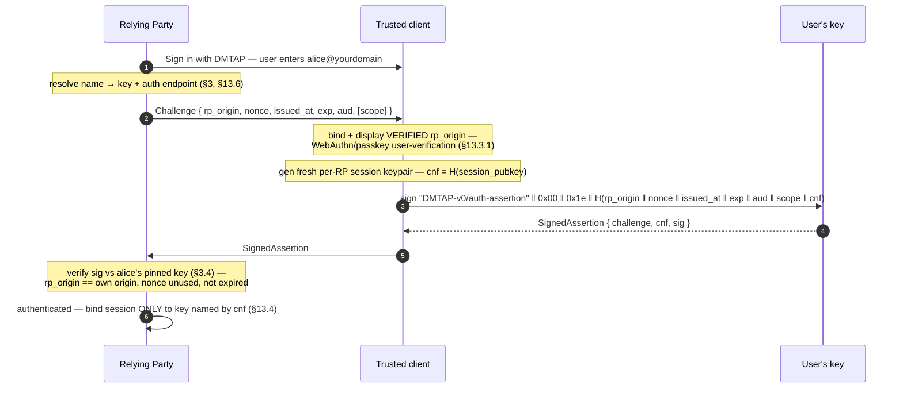

# 13. DMTAP-Auth — Decentralised Identity & Login

Your DMTAP identity is a keypair (§1) with a human name resolvable to that key (§3). The same
identity that receives your mail can log you in **everywhere**, with **no central identity
provider**. This section specifies DMTAP-Auth: sovereign, decentralised web login built on the
identity and naming layers, plus a bridge so existing "Sign in with OIDC" apps work unchanged.

The governing principle mirrors the rest of DMTAP:

> **Your key is your identity — for mail, for messaging, and for login.** No provider can
> revoke it, surveil it, or lock you out. Your node is your identity provider.

## 13.1 Goals & non-goals

DMTAP-Auth MUST provide:

1. **Decentralised login** — a relying party (RP) authenticates you as `alice@yourdomain` by
   verifying a signature from your key; there is no Google/Okta in the middle.
2. **Phishing resistance** — a signature obtained by a look-alike site MUST NOT authenticate to
   the real site.
3. **No bearer tokens after login (native path)** — native sessions are bound to your key
   (proof-of-possession), so a stolen token is useless without the key. (The legacy OIDC *bridge*
   path yields a classical bearer token and forfeits this — see §13.4, §13.6, §13.7.)
4. **Legacy interoperability** — existing OIDC/OAuth relying parties can consume DMTAP-Auth
   through a compatibility bridge.
5. **Recoverable & revocable** — losing a device does not lose your identity (§1.4), and a
   single app/device session can be revoked without rotating your whole identity.

Non-goals: replacing WebAuthn/passkeys (DMTAP-Auth *uses* them); acting as an authorisation
server for arbitrary third-party API scopes beyond login + basic profile + delegated
capabilities (§13.5).

## 13.2 Substrate reuse

DMTAP-Auth introduces almost no new cryptography — it reuses:

- **Identity** (§1): root key `IK`, device subkeys, the signed `Identity` object.
- **Naming** (§3): `name → key` via DNS + key transparency — this *is* issuer discovery.
- **Recovery** (§1.4): because your key now guards *all* your logins, recovery is even more
  load-bearing; DMTAP-Auth inherits it directly.
- **Transparency log** (§3.5): device/session authorisations and revocations are logged, so
  unauthorised login grants are detectable (§13.4).

## 13.3 The native login ceremony

```
1. RP shows "Sign in with DMTAP"; user enters  alice@yourdomain
2. RP resolves name → key + auth endpoint      (§3 lookup; DID/OIDC discovery, §13.6)
3. RP creates a Challenge:
     { rp_origin, nonce, issued_at, exp, aud, [scope] }
4. The challenge is presented to a TRUSTED CLIENT on the user's side (browser/OS/app), which
   binds and displays the VERIFIED rp_origin, and runs a WebAuthn/passkey user-verification
   ceremony (§13.3.1). BEFORE signing, the client generates a fresh per-RP, per-device SESSION
   keypair (§13.4) and computes  cnf = H(session_pubkey).
5. The user's key signs the DOMAIN-SEPARATED preimage
     "DMTAP-v0/auth-assertion" ‖ 0x00 ‖ 0x1e ‖ H(rp_origin ‖ nonce ‖ issued_at ‖ exp ‖ aud ‖ scope ‖ cnf)
   (canonical, §2; scope defaults to the empty array [] when the Challenge omits it; H(...) MUST
    appear in its §18.1.5 multihash form — the 0x1e prefix shown, or 0x16 under suite 0x05 —
    never as a bare digest (§18.1.6); the exact preimage and DS-tag are normative in §18.9.8 —
    like every other DMTAP signature this one is domain-separated, so an assertion can never be
    confused with any other signed object)
6. RP verifies the signature against alice's pinned key (§3.4), that rp_origin == its own
   origin, nonce unused, not expired → authenticated, and binds the session ONLY to the key
   named by cnf (proof-of-possession, §13.4). Because scope is INSIDE the signed preimage, the RP
   reconstructs it using exactly the scope it will grant and MUST NOT grant any scope broader than
   the signed value: a broader grant reconstructs a different preimage, the signature fails to
   verify, and login is refused (scope-elevation is self-defeating, not merely policy —
   0x0508 if surfaced as an over-attenuated delegation). The trusted client MUST have displayed
   that exact scope for user consent before signing.
```



The signed statement is a structured, origin-scoped, nonce-bound challenge (the SIWE/CAIP-122
pattern, hardened — see §13.7). The `aud` field binds the assertion to the intended RP. The
`cnf` field (confirmation key, RFC 7800 style) binds the assertion to the session key the client
generated *before* signing, so a captured assertion — including one seen by the bridge (§13.6) —
**cannot be replayed with an attacker-chosen session key** (session-hijack defence). The RP MUST
bind the session to `cnf` and to nothing else.

### 13.3.1 Origin binding is the load-bearing property (normative)

Phishing resistance comes **entirely** from binding the assertion to the *true* RP origin, and
that binding MUST be injected and enforced by a **trusted client component on the user's side**,
never by the signer trusting a value handed to it by the RP.

- In a browser, this is **WebAuthn** (W3C Rec L2 / CR L3): the browser writes the *observed*
  origin into `clientDataJSON`, the authenticator signs over its hash, and credentials are
  scoped by `rpId`. An assertion produced at `alice-yourdomain.evil.com` cannot validate for
  `yourdomain`. DMTAP-Auth's browser ceremony MUST use WebAuthn for exactly this.
- **The remote-node hazard (CRITICAL).** If the user's *always-on node* signs challenges that
  arbitrary parties relay to it, origin binding **evaporates** — a phisher relays the real
  challenge, gets the node to sign, and replays it. FIDO2 cross-device auth (CTAP 2.2 "hybrid")
  mitigates the analogous remote-approval risk with **BLE proximity**, which a remote node
  cannot use. Therefore DMTAP-Auth REQUIRES, for any node-signed login:
  1. the challenge carries `rp_origin` and `aud`, and the node signs *over them*;
  2. a trusted approval surface (the node's own authenticated client/app, or a paired
     passkey) **displays the verified `rp_origin`** to the human and requires explicit
     approval per login;
  3. the node MUST bind the challenge to a **pending, user-initiated login intent** — a nonce
     the node *itself* minted at the moment the user actively **started** a login on the node's
     own authenticated client. This is what "authenticated request channel" means: the node only
     signs a challenge that **matches an intent it originated a request for**. An unsolicited
     challenge **relayed** by a third party has no matching pending intent and MUST be refused —
     there is nothing for it to match. The node MUST rate-limit and log approvals (consent-farming
     defence).

  Preferred — and, for a remote node, the **only permitted** — design: the **passkey/WebAuthn
  ceremony happens in the user's client**, and the node's key is only invoked *after* a
  successful local user-verification bound to the origin — i.e. the passkey gates the node's
  signature. Concretely, use the **WebAuthn PRF extension** (over CTAP2 `hmac-secret`) so the
  passkey deterministically derives the key that unlocks the node's signing key — the identity
  key never leaves the node and never touches the RP (the deployed wwWallet pattern). A **bare
  node-signed mode** — the node signing on its own authority, without a local
  user-verification bound to the origin — is **FORBIDDEN** for any remote node. Nodes MUST NOT
  offer "approve any challenge" modes.

  **Users without a passkey (availability, normative).** The load-bearing requirement is a
  *trusted client that enforces origin-binding + intent-matching + user-verification* — a FIDO
  passkey is the strongest such client but not the only permitted one. A user with no
  passkey/PRF authenticator MAY instead use an **authenticated paired companion client** (their
  own signed-in Envoir app on a device paired to the node, §5.6) as the trusted client: it
  originates the login intent, performs user verification (biometric/PIN), and only then
  authorises the node's signature.

  **Honest calibration (normative — do not overclaim).** The companion path preserves
  **intent-matching** (a relayed unsolicited challenge has no matching pending intent and is
  refused), so it keeps the H1 relay hole closed. But it is **NOT equivalent to a passkey**: a
  WebAuthn passkey binds the *machine-observed* origin (the browser writes the actual navigated
  origin into `clientDataJSON` and enforces `rpId` scoping), whereas the companion receives
  `rp_origin` as *data* and can only *display* it — degrading origin verification to the
  **user-verified mode that §13.7 limit 1 calls weaker**, leaving residual look-alike/homograph-
  origin exposure. To restore machine-enforced comparison, a companion client MUST
  **TOFU-pin the RP's origin on first login and fail closed on any origin mismatch thereafter**,
  so an established RP cannot later be confused with a look-alike. Passkey (machine origin
  binding) remains the RECOMMENDED mode; the companion path is the acceptable fallback with this
  stated, weaker-against-look-alikes property. What is forbidden is *any* mode with no trusted
  client enforcing intent — never the absence of a FIDO passkey specifically.

## 13.4 Sessions: key-bound, not bearer

After login, the RP and client establish a session that is **sender-constrained to the user's
key**, so a leaked token cannot be replayed by a thief:

- A native session MUST be key-bound: use **DPoP (RFC 9449)** — each request carries a fresh
  proof-of-possession JWT signed by a session key bound at login — or **GNAP (RFC 9635)**
  continuation, which is key-based end to end. A bearer session on the native path is
  non-conformant; the bridge path's bearer ID Token is the disclosed exception (caveat below,
  §13.6).
- Session keys are **per-RP, per-device** ephemeral keys authorised by a device key (§1.2), not
  `IK` itself. This limits blast radius and enables granular revocation.
- **Revocation:** revoking one app/device session publishes a revocation to the transparency
  log and/or a short-lived status endpoint; it MUST NOT require rotating `IK`. Rotating a
  device key (§1.5) revokes all its sessions at once. Losing `IK` and recovering (§1.4) MUST
  invalidate all prior session authorisations.
- **Bounded re-validation (normative).** Because an RP validates the login-time delegation
  **once**, IK rotation (§1.5), device revocation, or recovery (§1.4) would not otherwise reach a
  live RP session. Therefore session authorisations MUST be **short-lived** (DMTAP-Auth session
  TTL + idle-timeout, §16), and an RP MUST NOT treat a login-time delegation as valid
  indefinitely: it MUST **re-validate the delegation** against the user's status endpoint or KT
  head at a **bounded interval** (RP re-validation interval, §16), or bind the session to a
  **revocation-list epoch** it MUST refresh at that interval. A session whose delegation no longer
  validates MUST be terminated at the next check. The two options are **not** freely
  interchangeable for the recovery case: a bare revocation list enumerates *explicitly revoked*
  sessions, but a recovering owner (fresh device, empty store, §1.4) does not know which RPs hold
  live sessions and so cannot populate it — leaving a pre-recovery session alive and silently
  defeating the "recovery MUST invalidate all prior session authorisations" rule above. Therefore
  the revocation-list epoch MUST be **keyed to `Identity.version`** (and bumped by any
  `KeyRotation`/recovery event): a session carries the `Identity.version` under which it was
  authorised, and a re-validation MUST terminate it when the current `Identity.version` is higher
  (recovery advances the version, §1.4/§1.5), so a wholesale recovery invalidates every
  pre-recovery delegation without the owner enumerating RPs. An RP that cannot bind its
  revocation-list epoch to `Identity.version` MUST use the delegation-re-chain option instead.
- **On unreachable status/KT (normative, sensible default).** If the status endpoint / KT head is
  unreachable at a re-validation check, the RP MUST NOT honour the session indefinitely (fail-open
  would let an attacker who partitions the endpoint keep a revoked session alive) and SHOULD NOT
  hard-fail instantly (that would log everyone out on a transient outage). Instead the RP MUST
  honour the last successfully-validated delegation only until a bounded **grace window** (= 2×
  the re-validation interval, §16), then fail closed and require re-authentication. This bounds
  an attacker's post-revocation persistence to the grace window while tolerating brief outages —
  mirroring §3.3's fail-closed-on-unreachable-KT stance.
- **Bridge path caveat (honest).** These key-bound / proof-of-possession guarantees hold on the
  **native** path. A **bridged** login (§13.6) mints a classical OIDC ID Token — a *bearer* token
  — so the "stolen token is useless without the key" property (goal 3) is **forfeited on the
  bridge path**: it inherits classical OIDC bearer-token risk. Only the native path is key-bound
  end to end. Implementers MUST NOT assume proof-of-possession on bridged sessions.

## 13.5 Capabilities & delegation

For "let this app act on my behalf" (beyond login), DMTAP-Auth uses **capability delegation**
rather than opaque scopes: a signed, offline-verifiable, attenuable capability token
(**UCAN-style**, informative) delegates a *specific, least-privilege* right (e.g. "read
calendar MOTEs for 24h") from `IK`/device key to an app or another of the user's nodes.
Delegations are attenuable (a device can only sub-delegate a subset), time-bound, and
revocable. This also carries authorisation **across the user's own device cluster** (§5.6).

**Owner-visible grants (BEC defence, normative).** A new capability delegation, a new RP-session
authorisation (§13.4), and any **auto-forward / redirection rule** change MUST be routed through
the owner's **device-cluster notification + KT self-monitoring path** (§3.5), exactly like
identity events (§1.4) — so a **silent grant** an attacker installs (the classic business-email-
compromise move: quietly delegating access or auto-forwarding mail) is **visible to the owner's
other devices** and alertable. Silent, unlogged authorisation is prohibited.

### 13.5.1 Organisational admin roles as capabilities (normative)

Org / domain administration (§3.10) introduces **no new authorisation machinery**: an admin role
is a §13.5 UCAN-style capability rooted at the **domain authority** key (§3.10.1) and delegated to
an admin's device/identity. Four standard roles, least-privilege and attenuable:

| Role | Least-privilege capability | Delegated from |
|------|----------------------------|----------------|
| **domain-owner** | full domain authority, incl. rotating the domain anchor and the directory-signing key | the domain authority itself (a **threshold** act, §3.10.1) |
| **domain-admin** | provision/offboard members, edit the directory (§3.10.3), create org groups (§5.8.7), delegate user-/group-admin | domain-owner |
| **user-admin** | provision/offboard members and edit their directory entries only | domain-owner / domain-admin |
| **group-admin** | create and administer org groups (§5.8.7) only | domain-owner / domain-admin |

Rules — all reuse machinery already defined:

- **Delegable & attenuable.** A capability may be sub-delegated only to a subset (a `user-admin`
  cannot mint a `domain-admin`); attenuation and offline verification are exactly §13.5.
- **Revocable.** A role is revoked like any session/capability (§13.4): publish a revocation to the
  transparency log / status endpoint; it MUST NOT require rotating the domain `IK`. Offboarding an
  admin (§3.10.5) revokes their role capabilities this way.
- **KT-logged & owner-visible.** Every role grant/revocation MUST be routed through the domain
  authority's KT self-monitoring path (§3.5), exactly like the owner-visible-grants rule above — a
  silently installed admin grant is detectable and alertable. Silent, unlogged org-admin
  authorisation is prohibited.
- **No unilateral super-admin where it matters (mirror §5.8.6).** A **domain-authoritative act** —
  rotating the domain anchor `IK`, or changing the directory-signing key — MUST satisfy the
  domain's **threshold** (§3.10.1, the §5.8.6 discipline), not one admin's capability. A single
  `domain-admin` may add/remove ordinary members (a bounded, KT-logged, reversible act) but MUST
  NOT be able to seize the whole namespace by rotating the anchor. An over-broad, expired, or
  over-attenuated org capability is rejected as `ERR_CAPABILITY_DELEGATION_INVALID` (`0x0508`, §21)
  — the same check as any other delegated capability.

## 13.6 Legacy bridge: OIDC / OAuth compatibility

Existing apps speak "Sign in with Google/OIDC," not DMTAP-Auth. The bridge makes DMTAP identity
consumable by them — the same native-path/legacy-bridge duality as mail (§7):

- **Per-user issuer (native-ish).** OpenID Connect Discovery 1.0 (Final) permits
  WebFinger-based **issuer discovery** from a user identifier, with the issuer at any host. So
  `alice@yourdomain` can advertise her **own node as her OIDC issuer**, self-issuing ID Tokens
  (the **SIOP v2** shape — a draft, not final). Deployed precedent: **Solid-OIDC** (user-controlled
  OPs; note it trusts a WebID-named *issuer*, it does not embed keys) and **IndieAuth** (identity =
  a URL you own; a W3C Note + IndieWeb living standard, not a Recommendation — cite the living
  standard). DMTAP-Auth expresses the binding as **`did:web` rooted at the user's mail domain**
  (`did:web:yourdomain:users:alice` → `did.json`), the DID method that matches §3's DNS name→key.
  The `did.json` MUST be **byte-consistent with the §3 DNS `name → key` binding and its KT entry**
  (same `IK`, same current `Identity` hash); an RP MUST **cross-check the `did.json` key against
  DNS + KT and pin it** (§3.4), never trusting the DID document alone — it is the same
  discovery-not-proof pointer as DNS (§3.2).
- **Hosted bridge (compat).** Because mainstream RP libraries assume a *fixed* issuer allowlist
  and rarely implement WebFinger discovery or dynamic client registration, DMTAP-Auth defines a
  **bridge OIDC Provider**: a standard, well-known OP whose backend is DMTAP-Auth. Legacy RPs
  add it like any OIDC provider; the bridge performs the §13.3 ceremony and mints a standard ID
  Token. **The bridge signs that ID Token with its OWN key, so a compromised bridge could forge
  logins for its RPs exactly as any classical IdP could.** DMTAP-Auth bounds this two ways:
  (a) the minted ID Token MUST **embed the user's own §13.3 signed assertion** (and its `cnf`) as
  a verifiable claim, so an RP MAY additionally **verify the user's key directly** and stop
  trusting the bridge's signature alone. To make that direct verification meaningful and prevent
  **cross-RP assertion reuse**, the bridge MUST run a **distinct §13.3 ceremony per consuming RP**,
  with the assertion's `rp_origin`/`aud` set to the **target RP's** identifier (carried through the
  OIDC `client_id`/`aud`) and a **fresh per-RP `cnf`** — never one bridge-audienced assertion
  replayed into several RPs' tokens (which would both let the assertion authenticate to any of the
  bridge's RPs and collapse the per-RP `cnf` unlinkability of §13.7 limit 7). An RP verifying the
  embedded assertion directly MUST check `assertion.aud == its own RP identifier` (as on the native
  path), failing closed on mismatch (`0x0501`). (b) every token the bridge mints MUST be appended to a
  **bridge-transparency log** (KT-style, §3.5) that the user's node **monitors**, so a bridge
  minting a login the user never performed is **detectable** (the same intrusion-detection
  posture as identity KT). The bridge is a *convenience operator*, swappable and self-hostable —
  it sees login events but never the user's key (it verifies signatures), and it is content-blind
  to mail. **Honest framing:** a bridge-mediated login trusts the bridge **to the same degree as
  any classical IdP**; only the **native path** (RPs verifying the user's signature directly,
  §13.3) removes the trusted third party entirely (§13.7).
- **DID interop.** `alice@yourdomain`'s `name→key` binding is expressible as **`did:web`**
  (DNS/HTTPS-rooted, matching §3) so DID-aware verifiers and Verifiable-Credential ecosystems
  (OID4VP, Final) can consume DMTAP identities. `did:key` expresses a raw-key identity (tier A,
  §3.6).

Adoption grows exactly like mail: native RPs verify signatures directly; legacy RPs use the
bridge; the bridge's importance fades as native support spreads.

## 13.7 Grounding & honest limits

Grounded standards (verified):

| Layer | Standard | Status |
|-------|----------|--------|
| Origin-bound ceremony | WebAuthn (W3C Rec L2, CR L3) + CTAP2 (FIDO2) | Rec / final |
| Challenge pattern | SIWE **ERC-4361** (Final) + **CAIP-122** | final |
| Keypair web-auth precedent | Nostr **NIP-07 / NIP-98** | deployed |
| Key-bound sessions | **DPoP RFC 9449** / **GNAP RFC 9635** | RFC |
| Capability delegation | **UCAN v1.0** | community spec (informative) |
| Issuer discovery / self-issued | **OIDC Discovery 1.0** (Final) + **SIOP v2** (draft) | final / draft |
| User-controlled OP precedent | **Solid-OIDC**, **IndieAuth** (living std) | deployed |
| Identifier interop | **DID Core** (W3C Rec), `did:web`/`did:key` | Rec / community |
| Modern OAuth security | **OAuth 2.1** (draft) + **RFC 9700** BCP | draft / RFC |

Honest limits (stated in-product):

1. **Origin binding depends on a trusted client.** The anti-phishing guarantee holds only where
   a trusted browser/OS/app enforces `rp_origin` (WebAuthn). Raw keypair signing where the
   *user visually verifies* the origin (SIWE/NIP-98 style) is **weaker** and MUST NOT be the
   only mode; DMTAP-Auth improves on it via §13.3.1 but a compromised or absent trusted client
   degrades to user-verified security.
2. **Remote-node consent farming.** A remote always-on node approving relayed challenges cannot
   use proximity; the mitigations in §13.3.1 (pending-intent binding, origin display, per-login
   approval, rate-limit, log) bound but do not eliminate the risk. Passkey-gated signing is
   therefore the **only permitted** remote-node mode (bare node-signed is forbidden, §13.3.1).
3. **Key loss = login loss.** Your key now guards every login, so recovery UX (§1.4) is
   critical; this raises the stakes on getting recovery right, not a new vulnerability.
4. **RP adoption is chicken-and-egg.** The OIDC bridge (§13.6) is what makes DMTAP-Auth useful
   before native RP support exists — the same bootstrap strategy as the mail gateway.
5. **SIOP v2 is a draft** and WebFinger issuer discovery is the least-implemented corner of
   OIDC; the hosted bridge is required precisely for this reason, not optional polish.
6. **No PKI beyond DNS/CA.** `did:web` (and DNS-rooted naming, §3) bottoms out at DNS + TLS/CA —
   there is no independent proof binding domain to key, so a DNS/registrar/CA compromise is an
   identity compromise. Key transparency (§3.5) makes such a substitution *detectable*, not
   impossible; high-value use SHOULD add out-of-band verification. **For AUTH specifically**, a
   v0 single KT log that can present a **split view** (§6.6 item 6) is a **silent per-RP account
   takeover**, so DMTAP-Auth REQUIRES — even in v0 — that high-value login RPs verify the
   `name → key` binding against **multiple independent KT logs** (consistency across them) or an
   **out-of-band-verified pin**, never a single unaudited log.
7. **Login is a deliberate identity disclosure.** Authenticating to a relying party intentionally
   reveals your identity *to that RP*; this is opt-in and per-RP, and MUST NOT be conflated with
   or allowed to weaken the mail/messaging metadata-privacy guarantees (§6). Session keys are
   per-RP (§13.4) so RPs cannot correlate you across sites via the auth layer. This cross-site
   unlinkability holds **against the RPs**, not against the **bridge** (§13.6), which sees *all*
   of a user's bridged logins, nor against the user's own **issuing node/host**, which learns
   *which RP* a login resolves to. To bound the bridge's view, the bridge SHOULD issue
   **pairwise/blinded subject identifiers** (a distinct `sub` per RP), never one global subject.
   This stays a SHOULD, not a MUST, for one reason: some deployed RP ecosystems require a
   stable, portable `sub` (cross-service account linkage, or migrating an RP off the bridge to
   native verification), which pairwise identifiers would break. A bridge that issues a global
   `sub` MUST disclose to the user that its RPs can correlate the user across sites by it.
8. **The hosted bridge is a trusted third party.** A bridge-mediated login (§13.6) trusts the
   bridge's signing key **to the same degree as any classical IdP** — a compromised bridge can
   forge logins for its RPs. The embedded user assertion + `cnf` (so an RP MAY verify the user's
   key directly) and the bridge-transparency log the user's node monitors (§13.6) **bound and
   make detectable** this risk, but do not remove it. Only the **native path** (§13.3, RPs
   verifying the user's signature) eliminates the trusted third party.
