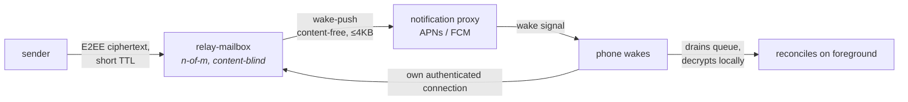

# 14. Scaling & Deployment

DMTAP must work for a user with only a phone, a user with an always-on box, and a node serving many
mailboxes at once — and the gateway role must scale horizontally. This section specifies the two
**device classes**, the **roles** layered over them, the reachability/buffer arrangements, and the
scaling patterns, grounded in how production mail and P2P systems actually operate.

## 14.1 Device classes and roles

There are exactly **two device classes**, distinguished by whether they hold durable state:

| Device class | Examples | What it is | Durable state? |
|--------------|----------|------------|:--------------:|
| **Always-on node** | Pi, NAS, home server, VPS | The authority — holds the mailbox, does the work, participates in the mesh | **Yes** |
| **Intermittent node / thin client** | Laptop, phone | A client that syncs to an always-on node it trusts (usually the owner's) | No (cache only) |

Everything else people call a "server" is a **role** of that same node binary (§0.2), taken by
whoever wants it:

| Role | Who can take it | What it does | Durable state? | Needs a scarce resource? |
|------|-----------------|--------------|:--------------:|--------------------------|
| **Relay** | any node with a public address | reachability hop for NAT'd nodes; content-blind (§4.3) | No | No |
| **Mix** | any always-on node with a public address — **opt-in, research-tier, NOT default-on** ([docs/research/mixnet.md §4.4.2a](docs/research/mixnet.md)) | a hop for the opt-in, research-tier mixnet ([docs/research/mixnet.md §4.4](docs/research/mixnet.md), §6); content-blind | No | No |
| **Buffer / relay-mailbox** | peers, the owner's other devices, optionally a third party — an **n-of-m** set (§14.3) | short-TTL content-blind hold for an offline identity | No (TTL'd ciphertext) | No |
| **KT log** | anyone with append-only storage | tamper-evident `name → key` history others audit (§3.5) | log only | No |
| **Rendezvous / bootstrap entry** | any node with a stable address | non-DHT lookup fallback and first-contact entry (§4.2.1, §4.2.2) | No | No |
| **Gateway** | an operator meeting §7.1a | legacy SMTP bridge + legacy client surfaces (§7); the only non-content-blind role | No (short retry queue only) | **Yes** — a reputable IP, port 25, a domain |

**The last column is the whole architecture.** Every role but one is **reciprocally provisioned**:
you run it because you want it to exist, and running it for yourself provides it to others at
essentially no marginal cost. Only legacy SMTP egress requires something you must be *granted* by a
third party (§7.1a), which is why it is the only place a durable operator class can form (§0.5),
and why this specification is careful never to let another function acquire that property.

A phone is **never** a durable endpoint (§14.3). An always-on node is the durable authority
(§14.4). Relay, mix, buffer, KT-log, rendezvous and gateway are stateless (or TTL-bounded) middle
roles that scale horizontally (§14.2, §14.5).

## 14.2 Horizontally-scalable gateway role (normative patterns)

An operator running the gateway role (§7) at any volume is stateless and MUST scale as a
**shared-nothing worker fleet**:

1. **Identical, interchangeable instances.** Every gateway instance runs the same config; there
   is no whole-cluster coordination on the hot path (coordination is a scaling bottleneck —
   the KumoMTA design principle). Add instances to add capacity.
2. **IPs owned by an egress layer, not the instances.** Outbound source IPs are selected by an
   egress-proxy layer (weighted round-robin over **egress pools** of warmed IPs), so worker
   instances stay stateless and IPs are managed independently of instance count.
3. **DKIM keys distributed read-only** to all instances (never generated per-instance), so
   signing is stateless-safe.
4. **Per-ISP warmup state.** An IP is "warm for Gmail, cold for Outlook" independently; pool
   sizing and warmup track **per receiving ISP** (the SES managed-pool model), spilling
   overflow to a shared pool during warmup.
5. **One coordinating tier for the irreducible shared state.** IP reputation and rate/throttle
   counters are the *one* thing a shared-nothing fleet cannot make node-local; hold them in a
   small shared store (Redis-style) feeding automated **health-check pool demotion**
   (Good/Poor/New by bounce & complaint rates), not in the workers.
6. **Inbound MX at scale:** DNS MX priority + equal-preference randomization (RFC 5321 §5.1) for
   coarse load spreading, Anycast receiving IPs, and accept-then-forward MTAs behind a
   source-IP-preserving LB (XCLIENT/PROXY protocol) so downstream filtering still sees the true
   sender.

**Honest limits (MUST disclose):** IP reputation is irreducibly shared mutable state — the one
non-local part of an otherwise shared-nothing fleet. **Warm-IP inventory is a hard scaling
floor:** you cannot grow outbound faster than you can warm IPs (weeks), so burst capacity is
bounded by the pre-warmed pool, not by instance count. DNS MX round-robin is sender-controlled
(you cannot force even distribution). Anycast inbound must be paired with stable routing so a
route flap does not break a live SMTP session.

## 14.3 The mobile-only user (no always-on box)

A phone cannot hold a socket open or be reachable, and platform push is **best-effort, not
guaranteed** on both APNs and FCM. Therefore a phone is a **push-woken thin client that drains
a queue it does not host** — never a durable node. When the user has no always-on box, the queue is
a **content-blind relay-mailbox** (the Chatmail model) — held **not by a hosted service but by an
n-of-m set** (§14.3a):

Requirements:

- **Push carries no content** — only a wake signal (the device token is itself encrypted where
  possible). Apple/Google never see plaintext. The design is **wake-and-fetch**, never
  deliver-in-push (APNs payload ≤4KB; silent push is throttled if excessive).
- **Push is a latency optimisation, not delivery.** The client MUST still poll/reconcile on
  foreground; DMTAP MUST NOT treat a push as delivery confirmation. Wakes SHOULD be
  coalesced/batched to avoid iOS silent-push throttling.
- **The relay-mailbox is a buffer, not an archive** (§14.5): short TTL (~weeks), content-blind,
  delete-after-inactivity. The durable copy lands on the device once fetched.

This is the *only* architecture that works for a user with no home box, and it matches deployed
practice (Delta Chat/Chatmail, Signal, Matrix/Sygnal — all wake-and-fetch with content-free
push).

### 14.3a The buffer is an n-of-m role, not a hosted service (normative)

**The relay-mailbox is a role (§14.1), and it MUST be usable as an `n`-of-`m` arrangement rather
than a single provider.** A conformant node offers its ciphertext to **`m` holders** — any mix of
(a) peers who have agreed to buffer for it, (b) **the owner's own other devices** (a second box, a
desktop that is usually on — the cheapest and most trustworthy holders a user has), and (c)
optionally a third party — and treats delivery as buffered when **`n` of them acknowledge custody**
(§16.6). No single holder is load-bearing, and a holder that vanishes costs redundancy, not mail.
Holders are content-blind (they see TTL'd ciphertext addressed to a key), so `m` can be raised
freely: adding a holder adds no trust.

**Why this is structural and not a convenience.** Two measured findings from the decentralised web
make the single-holder buffer indefensible, and both point the same way:

- **Volunteer edge availability is poor.** In the Mastodon measurement study (Raman et al., ACM IMC
  2019, §15.5), instances had a **mean downtime of 10.95%** — against **1.25%** for 2007-era Twitter
  — and **21.3% of instances went offline permanently within 15 months**. A buffer whose durability
  is one volunteer's uptime is therefore not a rounding error away from reliable; it is roughly an
  order of magnitude worse than the centralised service it replaces.
- **Unreplicated federated state collapses.** The same study found that removing the **10** most
  popular instances erased **62.69%** of all content, whereas replication reduced the loss to
  **2.1%**. Concentration plus non-replication is the failure mode; replication is the fix, and it
  is cheap here precisely because the holders learn nothing.

**Two consequences the specification takes seriously.** First, **buffering is a permanent structural
need, not a transitional service**: intermittent devices are not going away, so something must hold
ciphertext for an absent recipient forever, and the only question is whether that something is a
market of one or a set of `m`. Second, it must therefore be **commoditised across many providers
rather than purchased from one** — which is exactly why the role requires no scarce resource
(§14.1) and why `m` includes the user's own hardware. A design in which the buffer is bought is a
design in which someone can stop selling it.

**Interaction with the honest limit below (§14.5): a buffer is still not an archive.** `n`-of-`m`
raises availability within the TTL; it does not extend the TTL, and durability still lands at the
recipient's edge once fetched.

## 14.4 The always-on-box user

The Pi/NAS/VPS is the **durable authority**: it holds the mailbox, serves its **native** client
surface (JMAP, §8.1 — the node runs no legacy protocol server; IMAP and the other legacy surfaces
live on the gateway, §7.15), and participates in the mesh. The owner's phone/laptop are thin
clients that
sync to it (§5.6 device cluster). Reachability (the box is usually NAT'd) comes from the relay
layer (§14.5). Brief box downtime is covered by the same relay-mailbox/gateway short-queue
buffer as §14.3; once the box returns and fetches, the durable copy lives on the box.

## 14.5 Relay & buffer scaling

**Relays (reachability).** Run **many small, independent, stateless relay nodes** — libp2p
circuit-relay v2 needs zero coordination between relays, so the fleet scales by adding cheap
nodes. Relays are a **reachability hop only**, with tight caps (go-libp2p defaults: ~128
reservations, 16 circuits/peer, 2 min / 128 KB per circuit). Discovery SHOULD use an
**operator-run static/rendezvous list**, not sole reliance on the public DHT.

> **Honest limit (MUST disclose):** the public libp2p/IPFS DHT + relay path is designed for
> *brief hole-punch assistance*, not sustained mailbox sync — undialable-peer dial timeouts and
> republish load make it unsuitable as the sole production discovery/relay path. DMTAP
> deployments SHOULD run their own relay fleet with tuned caps and rendezvous discovery, using
> the DHT (if at all) only for opportunistic discovery. Direct connectivity (IPv6, hole-punch)
> is always preferred; relays carry the residual hard-NAT minority (§4.3).

**Buffers (offline holding).** Ciphertext for an offline node is held in a **content-blind
relay-mailbox with a short TTL and delete-after-inactivity** (Chatmail model: ~20-day message
TTL, ~90-day inactive-account purge as reference defaults), by an **`n`-of-`m` holder set**
(§14.3a) — peers, the owner's own devices, optionally a third party. Because holders are
content-blind, `m` is raised freely, which is what decouples availability from any single peer's
uptime while keeping per-holder cost near-zero (no long-term archive). Single-holder peer buffering
(§4.3) is the degenerate `n = m = 1` case and inherits that peer's uptime — the measured reason
§14.3a requires the general form. The gateway's short queue (§7.4) is only the legacy-translation
hop and MUST NOT become a store; the buffer role is **not** a gateway function (§7.1).

> **Honest limit (retrieval is not anonymous, MUST disclose):** a holder indexes its held
> ciphertext by the recipient's per-recipient delivery tag (§16.6), and retrieval is a **plain
> poll against that index** — there is no retrieval ceremony, no blinded-pickup object, and no
> state machine here or anywhere in this specification that would decouple *which* tag was
> fetched from *who* fetched it. A holder — or anyone observing it — that serves a returning node
> therefore learns **that node's tag set, the arrival and pickup timing of each item, and the
> volume moved**: exactly the untrusted-shared-store access pattern PIR exists to remove, restated
> for a mailbox instead of a database (§6.6 item 17, which owns this residual; §6.4 owns the
> always-on-push case this does not cover). This section MUST NOT describe retrieval as anonymous
> or unlinkable — content-blindness (above) is not the same property. Closing this for real means
> either running PIR against the buffer or specifying a genuine blinded-retrieval mechanism (its
> own credential, a defined wire object, and a retrieval state machine) — neither exists today, and
> **which of the two DMTAP adopts, if either, is an open founder decision**, not resolved here.

> **Honest limit:** a relay-mailbox is a **buffer, not an archive** — a node offline past the
> TTL loses undelivered mail. Durability MUST land at the recipient's edge once fetched. Senders
> retry (§2.6) within their own deadline regardless.

**Buffer is not backup (§1.4).** Neither a relay-mailbox nor a peer buffer (§4.3, peer-buffer TTL
§16.6) is a **content backup**: each holds only *undelivered* ciphertext within its TTL, and key
recovery (§1.4) restores onto an **empty store**. Durable content continuity requires a surviving
cluster device (§5.6) or the **portable encrypted backup** of §1.4 — not the buffer.

## 14.6 Network status — what a public status page may measure (normative)

For an implementation that offers the opt-in, research-tier mixnet
([docs/research/mixnet.md](docs/research/mixnet.md)), the network's *size and diversity* is
operationally significant to that tier: which mixnet profile a sender may use
(Bootstrap / Standard / High-security,
[docs/research/mixnet.md §4.4.10](docs/research/mixnet.md)) depends on how
many ASN-diverse mixes exist, and the **Bootstrap → Standard** progression is a
threshold the client must be able to observe
([docs/research/mixnet.md §4.4.10](docs/research/mixnet.md), §16.3). Something must therefore
publish an **observation of the network**. This section bounds what that may be, because a status
page is the most natural place for an authority to grow back. Most of what a status page reports
(§14.6.1) is basic mesh liveness with no dependency on the mixnet; only the mix-role/ASN-diversity
figure and §14.6.3's profile table are specific to an implementation that offers the opt-in
`private` tier.

### 14.6.1 What it measures (the network, never users)

A conformant public status page reports **only** aggregate network-shape figures:

| Measure | Why it matters |
|---------|----------------|
| Reachable nodes | basic liveness of the mesh |
| Always-on nodes (public address) | the pool from which the roles below are drawn |
| **Mix-role nodes, and their ASN diversity** (only meaningful where the opt-in mixnet is offered) | decides which mixnet profile the network supports ([docs/research/mixnet.md §4.4.10](docs/research/mixnet.md)) |
| KT logs (and how many are independently operated) | whether a `> n/2` quorum over disjoint operators is achievable (§3.5.2(b)) |
| Rendezvous nodes / bootstrap entries | whether §4.2.2's multi-node, multi-ASN requirement is satisfiable |
| Gateways (count, and ASN/jurisdiction spread) | the health of the one scarce role (§7.1a) |
| **Estimated** active identities | adoption, stated as an estimate with its method |

### 14.6.2 What it must not be, and must not reveal (normative)

- **It is a DERIVED observation, never a registry.** Figures are computed from
  **self-reported-and-cross-checked** observations — a node's own published descriptor, corroborated
  by other observers' reachability probes — exactly as the (opt-in) mix fleet view is derived
  rather than signed ([docs/research/mixnet.md §4.4.2](docs/research/mixnet.md)). No node registers
  with it, no node needs its approval, and **no protocol
  behaviour may depend on trusting it**: a client that offers the mixnet MUST make its own profile
  determination from its own derived fleet view
  ([docs/research/mixnet.md §4.4.2, §4.4.9](docs/research/mixnet.md)), and MAY use a status page
  only as a human-facing corroboration. A status page that becomes load-bearing has become the
  directory authority [docs/research/mixnet.md §4.4.2](docs/research/mixnet.md) deleted.
- **It MUST NOT deanonymize a user or reveal any part of the social graph.** No per-identity data,
  no per-mailbox data, no message counts attributable to anyone, no correspondent pairs, no
  per-node traffic volumes that could be intersected with a target's activity. Aggregate counts of
  *infrastructure*, never of *behaviour*.
- **It measures the NETWORK, not users' activity.** Message volume, delivery latency histograms
  and similar activity series are **out of scope** — they are exactly the timing corpus the
  opt-in mixnet exists to deny for implementations that offer it
  ([docs/research/mixnet.md §4.4.5](docs/research/mixnet.md), §6.6 item 1). An implementation MUST
  NOT emit per-user telemetry to any such service, and MUST NOT make participation in measurement a
  condition of anything.
- **Multiple, competing status pages are the healthy state.** Anyone may run one; disagreement
  between two is information, not an error. There is no canonical publisher, and this specification
  names none.

### 14.6.3 Tie-in to the (opt-in) mixnet profiles — applies only where the mixnet is offered (non-normative for a conformant node)

For an implementation that offers the opt-in, research-tier mixnet, the status page's mix-count
and ASN-diversity figures are the human-readable form of the same
thresholds [docs/research/mixnet.md §4.4.10](docs/research/mixnet.md) sets for that tier. None of
this table is required of a conformant DMTAP node — the default tier is `fast`, and offering the
`private` tier at all is opt-in:

| Observed fleet | Profile the (opt-in) mixnet can support |
|----------------|---------------------------------|
| < 3 ASN-diverse public mixes | no `private` tier at all — `fast` only, disclosed (§6.6 item 13) |
| ≥ 3 ASN-diverse mixes, < 20-node guard sample | **Bootstrap** profile: 3 hops, degraded, no anonymity claim, auto-upgrading ([docs/research/mixnet.md §4.4.10](docs/research/mixnet.md)) |
| ≥ 20-node ASN-diverse guard sample, ≥ 3 disjoint operator ASNs | **Standard** — the mixnet's own default profile when the opt-in `private` tier is in use (§16.3) |
| ≥ 5 disjoint operator ASNs with capacity for 5-hop paths | **High-security** available to those who select it ([docs/research/mixnet.md §4.4.10](docs/research/mixnet.md)) |

A client that offers the mixnet MUST derive its own answer to this question
([docs/research/mixnet.md §4.4.9](docs/research/mixnet.md)); the table exists so that a human
reading a status page and a node computing a path are looking at the same thresholds.

## 14.7 Grounding

Patterns grounded in: KumoMTA (shared-nothing MTA, egress pools), AWS SES (per-ISP managed
warmup), SendGrid/Mailgun (per-stream pools, health-check demotion), RFC 5321 §5.1 (MX
priority), Cloudflare (Anycast inbound), Delta Chat/Chatmail + Signal + Matrix/Sygnal
(wake-and-fetch push, relay-mailbox), APNs/FCM (best-effort, ≤4 KB, throttling), libp2p
circuit-relay v2 + Protocol Labs DHT findings (relay caps, discovery), and **Raman, Joglekar,
De Cristofaro, Sastry & Tyson, "Challenges in the Decentralised Web: The Mastodon Case," ACM IMC
2019** (volunteer-instance downtime, permanent-departure rate, and the content-loss/replication
measurements that make the buffer an `n`-of-`m` role, §14.3a). See §11 for the full bibliography.
