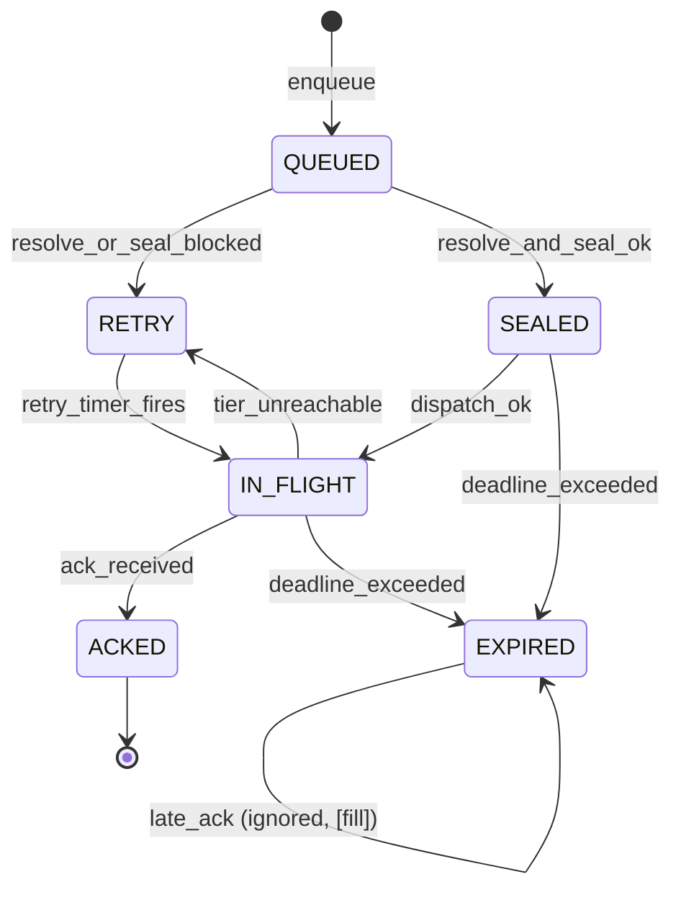

# 20. Appendix C: State Machines

This appendix restates the protocol's dynamic behavior as formal, **total** state machines: for
every machine, every state, and every event applicable to that machine, the next state and the
required action are defined. No `(state, event)` pair is left to implementer discretion where the
body of the spec (§1–§16) settles it; where the body does *not* settle it, this appendix makes a
conservative normative choice and marks it **[fill]**, and where it settles it but leaves a real
operational gap, this appendix marks it **[gap]**. §20.9 collects every `[fill]`/`[gap]` marker in
one place, in the spirit of the "honest limits" sections elsewhere (§6.6, §13.7).

## 20.0 Conventions

- **MUST / MUST NOT / SHOULD / SHOULD NOT / MAY** are RFC 2119 / RFC 8174, as in the rest of this
  spec.
- Each machine is given as: **states**, **events**, a **transition table** (rows are `(state,
  event)`; the table is exhaustive for every event applicable to that machine), **entry/exit
  actions**, **timeouts** (citing §16), and an **ASCII state diagram**.
- **Terminal state** = no outgoing transition changes protocol-visible state further (a terminal
  state MAY still accept and silently absorb further events, per its own row — "terminal" does not
  mean "unreachable by events," it means "no event moves it elsewhere").
- A transition table row of the form `state | event | → state′ | action` is read: *in `state`,
  receiving `event`, transition to `state′` and perform `action`*.
- Numeric parameters are cited as `[§16.x: name]` and are the v0 defaults; implementations MAY
  tune within stated bounds (§16 preamble) but conformance testing (§10.3) checks the defaults.
- These seven machines **compose**: §20.1 (sender) invokes §20.4 (reachability) for its `fast`-tier
  branch; §20.2 (recipient) is the per-MOTE unit run by §20.7 (node lifecycle) during `DRAINING`;
  §20.5's committer sub-machine gates §20.5's epoch sub-machine; §20.6 reuses §20.3's pinning
  result to verify the login signature. Composition points are called out inline.

---

## 20.1 Outbound MOTE delivery (sender side)

Formalizes §2.6 (delivery semantics) and §4.7 (delivery state machine), with the retry
backoff/deadline of §16.1, the dedup-ack of §2.6, and the `private`-vs-`fast` tier branch of §4.6.

### States

| State | Meaning |
|-------|---------|
| `QUEUED` | MOTE constructed and admitted to the sender's outbound queue; not yet sealed. |
| `SEALED` | Envelope encrypted (MLS/HPKE) and, for the `private` tier, onion-wrapped (§4.4); tier fixed for this MOTE. |
| `IN_FLIGHT` | Handed to the transport: mixnet hops (`private`) or the reachability ladder, §20.4 (`fast`). |
| `RETRY` | Backing off after a failed/blocked attempt; will re-enter `IN_FLIGHT` (or retry sealing) when its timer fires or its precondition clears. |
| `ACKED` | Terminal (success). Recipient's `ack(id)` received (§2.6), or dedup-acked. |
| `EXPIRED` | Terminal (failure). §16.1's 72 h retry deadline elapsed; user notified. |

### Events

`enqueue`, `resolve_and_seal_ok`, `resolve_or_seal_blocked` (transient — DNS/DHT/KT lag, or
fail-closed-at-first-contact per §3.3), `dispatch_ok`, `tier_unreachable` (mixnet hop failure, or
§20.4 reaches `UNREACHABLE`), `ack_received` (includes recipient-side dedup-ack, §2.6 — the sender
cannot and need not distinguish the two), `retry_timer_fires` [§16.1: backoff], `deadline_exceeded`
[§16.1: retry deadline] (checked on every timer tick, in every non-terminal state), `late_ack`
(an `ack_received` arriving after `EXPIRED` — see 20.1's fill below).

### Transition table

| State | Event | → State | Action |
|---|---|---|---|
| `QUEUED` | `enqueue` | `QUEUED` | Start the 72 h deadline timer [§16.1]; begin recipient resolution (§20.3) and, if this is an async/offline recipient, MLS async join (§5.3). |
| `QUEUED` | `resolve_and_seal_ok` | `SEALED` | Fix `tier` (message-kind default, §4.6, or explicit override); build Envelope; onion-wrap if `tier=private` (§4.4). |
| `QUEUED` | `resolve_or_seal_blocked` | `RETRY` | Start/continue backoff timer [§16.1]. **[fill]** §3.3's fail-closed-at-first-contact (KT unreachable) is a *user-trust* decision, not a transient fault, but it re-enters exactly this bounded retry loop: held pending either KT recovery or explicit user/OOB action (§20.3), capped by the same 72 h deadline. |
| `QUEUED` | `deadline_exceeded` | `EXPIRED` | Notify user: undelivered, resolution never completed. |
| `SEALED` | `dispatch_ok` | `IN_FLIGHT` | Hand sealed object to mixnet (3 hops, §16.3) if `tier=private`; else invoke §20.4 reachability ladder if `tier=fast`. |
| `SEALED` | `deadline_exceeded` | `EXPIRED` | Notify user. |
| `IN_FLIGHT` | `ack_received` | `ACKED` | Cancel deadline timer; mark delivered. |
| `IN_FLIGHT` | `tier_unreachable` | `RETRY` | Start backoff timer [§16.1: base 30 s, exp, cap 1 h, jittered]. |
| `IN_FLIGHT` | `deadline_exceeded` | `EXPIRED` | Notify user. |
| `RETRY` | `retry_timer_fires` | `IN_FLIGHT` | Re-dispatch the same `SEALED` object (no re-sealing needed; `id` is stable, §2.2). |
| `RETRY` | `ack_received` | `ACKED` | A duplicate in-flight copy was delivered before the retry fired; cancel timer. |
| `RETRY` | `deadline_exceeded` | `EXPIRED` | Notify user. |
| `ACKED` | `ack_received` | `ACKED` | No-op (idempotent; further acks for the same `id` are ignored). |
| `EXPIRED` | `late_ack` | `EXPIRED` | **[fill]** §4.7/§2.6 do not address an ack arriving after the sender has already given up (e.g. peer-buffer drain, §14.5, delivers late). Sender MUST treat this idempotently: surface a "delivered late" correction, MUST NOT re-send, MUST NOT re-open the deadline. State remains `EXPIRED` (the *protocol* outcome doesn't reverse; only the user-facing status corrects). |

### Entry/exit actions

- **Entry `QUEUED`:** allocate retry-deadline timer at `now + 72h` [§16.1].
- **Entry `IN_FLIGHT`:** record `tier` used, for later mismatch diagnostics; **[gap]** §2.6/§4.7 do
  not specify the transport carriage of `ack(id)` itself — whether it is a MOTE, a mixnet
  single-use-reply mechanism, or a lower-level transport ack is unspecified in §2/§4. This
  machine treats `ack_received` as an abstract event regardless of its wire realization.
- **Exit `RETRY`:** cancel backoff timer.
- **Entry `EXPIRED`/`ACKED`:** these are terminal for the *sending* queue slot; the queue entry MAY
  be garbage-collected after a client-defined UI grace period (out of protocol scope).

### Timeouts

| Timer | Value | Cite |
|---|---|---|
| Retry deadline | 72 h from `QUEUED` entry | §16.1 |
| Retry backoff | exponential, base 30 s, cap 1 h, jittered | §16.1 |
| Clock-skew tolerance (affects `ts` validity downstream, §20.2) | ±120 s | §16.1 |

### Diagram



*ACKED is reachable only from IN_FLIGHT via `ack_received`; the terminal `EXPIRED` absorbs a
late ack rather than resurrecting the send.*

---

## 20.2 Inbound MOTE validation (recipient side)

Formalizes the §2.7 ordered validation pipeline as a state machine, with the drop / defer
(requests-area) / accept terminal states of §2.7a. This machine runs **once per received MOTE**
(it is the per-message unit invoked by §20.7's `DRAINING` state, and by ordinary online receipt).

### States

| State | Meaning |
|---|---|
| `RECEIVED` | Envelope bytes in hand (outer mixnet/direct unwrap already done by transport). |
| `VERSION_OK` | `v`/`suite` accepted (§2.7 step 1). |
| `ADDR_OK` | `id` matches content address of `ciphertext` (§2.7 step 2). |
| `SIG_OK` | `sender_sig` over `(id‖to‖ts‖kind‖challenge)` verified (§2.7 step 3). |
| `RESOLVED` | `to` resolves to this node or a group it belongs to (§2.7 step 4). |
| `PRE_DECRYPT` | Sender classified `known` (fast path), or cold sender passed the abuse gate — ready to decrypt (§2.7 steps 5–7). |
| `COLD_GATE` | Cold/unknown sender; §9 challenge under evaluation (§2.7 step 6). |
| `DECRYPTED` | Ciphertext decrypted (§2.7 step 7). |
| `PAYLOAD_OK` | `Payload.sig` verified under `Payload.from`; pin applied/TOFU'd or re-checked (§2.7 step 8). |
| `STORED` | `expires`/`refs`/`kind` applied and message stored (§2.7 step 9). |
| `ACKED` | Terminal — accept. |
| `DROPPED` | Terminal — silent discard, **no** `ack` (§2.7a "invalid or forged"). |
| `DEFERRED` | Terminal — requests area, rate-limited, **no** `ack`, not surfaced as a normal message (§2.7a "absent/below threshold"). |

### Events

`check_version` {`ok`/`fail`}, `verify_address` {`ok`/`fail`}, `check_duplicate` {`duplicate`/
`not_duplicate`}, `verify_sender_sig` {`ok`/`fail`}, `resolve_to` {`ok`/`fail`}, `classify_sender`
{`known`/`cold`}, `evaluate_challenge` {`valid_and_sufficient`/`absent_or_below_threshold`/
`invalid_or_forged`}, `decrypt` {`ok`/`fail`}, `verify_payload` {`ok`/`fail`/
`revealed_from_blocked`}, `apply_and_store`, `ack`.

### Transition table

| State | Event | → State | Action |
|---|---|---|---|
| `RECEIVED` | `check_version` = ok | `VERSION_OK` | — |
| `RECEIVED` | `check_version` = fail | `DROPPED` | Unknown `v`/`suite`: fail closed (§2.7 step 1). No ack. |
| `VERSION_OK` | `verify_address` = ok | `ADDR_OK` | — |
| `VERSION_OK` | `verify_address` = fail | `DROPPED` | `id` mismatch (§2.7 step 2). No ack. |
| `ADDR_OK` | `check_duplicate` = duplicate | `ACKED` | Dedup: already hold `id` (§2.6). Ack immediately, do not reprocess. **[fill]** §2.7's ordered list does not state whether the duplicate check precedes or follows `verify_sender_sig`; this machine checks duplicate first, consistent with the "cheapest-and-anonymous-first" ordering principle stated in §2.7's own preamble. |
| `ADDR_OK` | `check_duplicate` = not_duplicate, `verify_sender_sig` = ok | `SIG_OK` | — |
| `ADDR_OK` | `verify_sender_sig` = fail | `DROPPED` | (§2.7 step 3). No ack. |
| `SIG_OK` | `resolve_to` = ok | `RESOLVED` | — |
| `SIG_OK` | `resolve_to` = fail | `DROPPED` | `to` does not resolve here (§2.7 step 4). No ack. |
| `RESOLVED` | `classify_sender` = known | `PRE_DECRYPT` | Fast path: skip abuse gate (§2.7 "known contacts MAY skip step 6"). |
| `RESOLVED` | `classify_sender` = cold | `COLD_GATE` | — |
| `COLD_GATE` | `evaluate_challenge` = valid_and_sufficient | `PRE_DECRYPT` | Passed §9 gate; proceeds identically to a known contact from here. |
| `COLD_GATE` | `evaluate_challenge` = invalid_or_forged | `DROPPED` | §2.7a: discard silently, no user-visible effect, no ack. |
| `COLD_GATE` | `evaluate_challenge` = absent_or_below_threshold | `DEFERRED` | §2.7a: hold in requests area [§16.5: 30-day retention], rate-limited; user MAY promote (pins sender as a contact for *future* MOTEs — does not change this instance's `DEFERRED` status). No ack. |
| `PRE_DECRYPT` | `decrypt` = ok | `DECRYPTED` | MLS epoch key or HPKE-to-recipient-key (§2.7 step 7). |
| `PRE_DECRYPT` | `decrypt` = fail | `DROPPED` | (§2.7 step 7 "drop on failure"). No ack. |
| `DECRYPTED` | `verify_payload` = ok | `PAYLOAD_OK` | Verify `Payload.sig` under `Payload.from`; match pinned identity (known contact) or TOFU-pin (first contact, §3.4); for a cold sender, re-apply block/allow now that `from` is revealed (§2.7 step 8). |
| `DECRYPTED` | `verify_payload` = fail | `DROPPED` | **[fill]** §2.7 step 8 does not explicitly restate "drop on failure" the way steps 1–4 and 7 do; this machine applies the same fail-closed default for consistency with §9.1 principle 1 ("authenticated-by-default"). No ack. |
| `DECRYPTED` | `verify_payload` = revealed_from_blocked | `DROPPED` | **[fill]** Cold sender's re-applied block/allow list (§2.7 step 8) finds `from` blocked; treated as a drop, symmetric with the pre-decryption block case. No ack. |
| `PAYLOAD_OK` | `apply_and_store` | `STORED` | Apply `expires`/`refs`/`kind` semantics (§2.7 step 9); persist. Local storage failure (disk, quota) is an operational condition outside protocol scope, not modeled here. |
| `STORED` | `ack` | `ACKED` | Confirm receipt of `id` (§2.6). |
| `ACKED` | (any further `check_duplicate` for the same `id`, from a redelivered copy) | `ACKED` | Idempotent — see `ADDR_OK`'s duplicate row; a redelivered copy of an already-`ACKED` `id` is a fresh machine instance that dedup-shortcuts straight to `ACKED`. |
| `DROPPED` | — | `DROPPED` | Terminal; no further protocol action. Sender's own §20.1 retry logic (unaware of the drop) will eventually re-deliver a fresh copy, which is a new instance of this machine. |
| `DEFERRED` | — | `DEFERRED` | Terminal for this instance; entry lives in the requests area until [§16.5: 30 days] retention elapses (silent purge) or the user promotes the sender. By the time a 30-day retention elapses, the sender's own §20.1 has independently reached `EXPIRED` [§16.1: 72 h] long before — no ack was ever owed. |

### Entry/exit actions

- **Entry `COLD_GATE`:** load recipient `Policy` (§9.2: `allow`/`challenge`/`block`/`rate`).
- **Entry `DEFERRED`:** start [§16.5: 30-day] retention timer; expose in the client's "requests"
  affordance (§2.7a — MUST NOT surface as a normal message).
- **Entry `PAYLOAD_OK`:** on first contact, this is the TOFU-pin moment feeding §20.3's `PINNED`
  state for this sender's identity key.

### Timeouts

| Timer | Value | Cite |
|---|---|---|
| Requests-area retention | 30 days | §16.5 |
| Clock-skew tolerance (bounds acceptable `ts`) | ±120 s | §16.1 |
| Replay cache retention (covers dedup window) | ≥ 300 s | §16.1 |

### Diagram

```
RECEIVED─check_version:fail──────────────────────────────────────────▶ DROPPED
   │ ok
   ▼
VERSION_OK─verify_address:fail────────────────────────────────────────▶ DROPPED
   │ ok
   ▼
ADDR_OK──check_duplicate:duplicate────────────────────────────────────▶ ACKED
   │ not_duplicate
   ├─verify_sender_sig:fail──────────────────────────────────────────▶ DROPPED
   │ ok
   ▼
SIG_OK──resolve_to:fail────────────────────────────────────────────────▶ DROPPED
   │ ok
   ▼
RESOLVED──classify_sender:cold──▶ COLD_GATE ──invalid_or_forged───────▶ DROPPED
   │ known                          │  absent_or_below_threshold ─────▶ DEFERRED
   │                                │  valid_and_sufficient
   ▼                                ▼
PRE_DECRYPT ◀───────────────────────┘
   │ decrypt:fail ─────────────────────────────────────────────────────▶ DROPPED
   │ ok
   ▼
DECRYPTED──verify_payload:{fail,revealed_from_blocked}────────────────▶ DROPPED
   │ ok
   ▼
PAYLOAD_OK──apply_and_store──▶ STORED──ack──▶ ACKED
```

---

## 20.3 Name resolution & pinning

Formalizes `resolve()` (§3.3), TOFU + pinning (§3.4), and key transparency (§3.5), including the
pinned-follow-chain path for key rotation (§1.5) and name migration (§1.6).

### States

| State | Meaning |
|---|---|
| `UNRESOLVED` | No local pin for this name. |
| `RESOLVING` | DNS TXT/SVCB lookup in flight (§3.2, §3.3 step 1). |
| `KT_VERIFY` | First-contact only: fetching signed tree head + inclusion proof, checking for a superseding version (§3.3 step 2). |
| `FETCHING_IDENTITY` | Fetching the full `Identity` object by `id` from the mesh; verifying its signature chain (§3.3 step 3). |
| `PINNED` | Stable: `(name → iks, id)` pinned; routing is by key via the mesh; DNS not re-consulted except as the pinned chain dictates (§3.3 step 5). |
| `VERIFYING_CHAIN` | A new `Identity`/`KeyRotation`/`MoveRecord` version observed for an already-pinned identity; validating it chains from the pinned key (§1.5, §1.6). |
| `SECURITY_ALERT` | Key changed *without* a valid chain from the pinned key (§3.4: "MUST raise a security warning, never silently update"). |
| `FAIL_CLOSED_BLOCKED` | KT unreachable/censored at first contact and local policy is "block" (§3.3 normative). |
| `OOB_REQUIRED` | KT unreachable/censored at first contact and local policy is "hard-warn"; awaiting explicit user decision (§3.3 normative). |

### Events

`begin_resolve`, `dns_ok`, `dns_fail`, `kt_reachable_confirmed`, `kt_reachable_but_superseded`,
`kt_unreachable` (branches by local policy: `policy=block` / `policy=warn`), `fetch_ok_chain_valid`,
`fetch_fail`, `sig_chain_invalid`, `oob_verify_ok`, `rotation_or_move_seen`, `chain_valid`,
`chain_invalid`, `user_accepts_with_warning`, `user_declines`, `user_overrides_with_oob`,
`user_dismisses`, `user_blocks_contact`, `user_provides_oob_verification`, `retry_later`,
`name_reresolve_requested` (no pending rotation).

### Transition table

| State | Event | → State | Action |
|---|---|---|---|
| `UNRESOLVED` | `begin_resolve` | `RESOLVING` | Issue DNS TXT/SVCB query (§3.2). |
| `RESOLVING` | `dns_ok` | `KT_VERIFY` | This is necessarily first contact (no prior pin exists in `UNRESOLVED`). |
| `RESOLVING` | `dns_fail` | `UNRESOLVED` | **[fill]** §3.3 does not classify a plain DNS miss (NXDOMAIN/timeout/malformed record) among its three named outcomes — that clause is about *KT* unreachability, not DNS itself. This machine bounces back to `UNRESOLVED` and surfaces "name not found" to the caller (e.g. §20.1's `resolve_or_seal_blocked` → `RETRY`). |
| `KT_VERIFY` | `kt_reachable_confirmed` | `FETCHING_IDENTITY` | No newer version supersedes the DNS-returned pointer (§3.3 step 2 rollback defense). |
| `KT_VERIFY` | `kt_reachable_but_superseded` | `RESOLVING` | **[fill]** A newer KT-visible version supersedes what DNS returned (DNS lagging KT): reject the stale pointer and re-query DNS, bounded by the caller's own deadline (§20.1). |
| `KT_VERIFY` | `kt_unreachable`, policy=block | `FAIL_CLOSED_BLOCKED` | §3.3 normative: MUST NOT silently TOFU-pin; refuse. |
| `KT_VERIFY` | `kt_unreachable`, policy=warn | `OOB_REQUIRED` | §3.3 normative: hard-warn + require explicit acceptance, prefer OOB. |
| `FETCHING_IDENTITY` | `fetch_ok_chain_valid` | `PINNED` | TOFU-pin `(name → iks, id)` (§3.3 step 4); offer OOB upgrade (§3.4.1). |
| `FETCHING_IDENTITY` | `fetch_fail` | `RESOLVING` | **[fill]** Mesh does not (yet) have the object, or times out; retry, bounded by caller's deadline — not itself a trust failure. |
| `FETCHING_IDENTITY` | `sig_chain_invalid` | `FAIL_CLOSED_BLOCKED` | **[fill]** Not explicit text in §3.3 step 3, but consistent with the spec's uniform fail-closed-on-invalid-signature posture (§1.3, §2.7, §9.1): an `Identity` whose chain does not validate is rejected outright, not merely retried. |
| `PINNED` | `name_reresolve_requested` | `PINNED` | No-op: return the cached pin; DNS is not re-consulted (§3.3 step 5). |
| `PINNED` | `oob_verify_ok` | `PINNED` | Upgrade pin tier TOFU → VERIFIED (§3.4.1); no key change. |
| `PINNED` | `rotation_or_move_seen` | `VERIFYING_CHAIN` | A new signed `Identity`/`KeyRotation`/`MoveRecord` observed (§1.5, §1.6). |
| `VERIFYING_CHAIN` | `chain_valid` | `PINNED` | Chain validly signed from the previously-pinned key (§1.5 step 4 / §1.6); adopt new key/name, re-pin. |
| `VERIFYING_CHAIN` | `chain_invalid` | `SECURITY_ALERT` | §3.4: key changed without a valid chain — MUST raise a security warning, MUST NOT silently update. |
| `SECURITY_ALERT` | `user_overrides_with_oob` | `PINNED` | Manual re-verification accepts the new key (pin tier VERIFIED, new key). |
| `SECURITY_ALERT` | `user_dismisses` | `SECURITY_ALERT` | **[fill]** No event moves state; §3.4 only forbids *silent* update. Safe default: continue routing to the OLD pinned key (message flows via §20.1 are unaffected); the new key is never adopted without explicit action. |
| `SECURITY_ALERT` | `user_blocks_contact` | `FAIL_CLOSED_BLOCKED` | Explicit user decision to stop trusting this identity entirely. |
| `FAIL_CLOSED_BLOCKED` | `user_provides_oob_verification` | `PINNED` | §3.3: "MUST... prefer out-of-band verification." |
| `FAIL_CLOSED_BLOCKED` | `retry_later` | `UNRESOLVED` | **[fill]** KT becomes reachable later; re-run `resolve()` fresh (no special-cased memory of the earlier block beyond ordinary UI history). |
| `OOB_REQUIRED` | `user_accepts_with_warning` | `PINNED` | Pin tier = TOFU-UNVERIFIED-ACCEPTED (weaker than the ordinary TOFU pin: KT itself was never actually consulted). |
| `OOB_REQUIRED` | `user_declines` | `FAIL_CLOSED_BLOCKED` | — |
| `OOB_REQUIRED` | `oob_verify_ok` | `PINNED` | Pin tier = VERIFIED (strongest — bypasses the KT gap entirely). |

### Entry/exit actions

- **Entry `RESOLVING`:** issue/re-issue DNS query; **exit:** cache raw record for §3.5 audit.
- **Entry `KT_VERIFY`:** fetch signed tree head + inclusion proof for this identity.
- **Entry `PINNED`:** persist `(name, iks, id, pin_tier)`; register for §3.5 self-monitoring
  (owner's own devices monitor the log for the owner's *own* entries — a distinct, symmetric
  concern from this per-contact machine, §1.4 rule 4).
- **Entry `FAIL_CLOSED_BLOCKED` / `OOB_REQUIRED`:** surface to the user *before* any message is
  queued to this name (gates §20.1's `resolve_and_seal_ok`).

### Timeouts

| Timer | Value | Cite |
|---|---|---|
| KT signed-tree-head poll (self-monitoring, distinct concern) | ≤ 6 h | §16.2 |
| DHT location-record TTL (downstream, for the resolved key's reachability, §20.4) | 2 h | §16.2 |
| Location seq-number | monotonic, reject older-or-equal | §16.2 |

### Diagram

```
UNRESOLVED──begin_resolve──▶ RESOLVING ──dns_fail──▶ UNRESOLVED (loop)
                                │ dns_ok
                                ▼
                            KT_VERIFY ──kt_reachable_but_superseded──▶ RESOLVING
                                │
                    ┌───────────┼───────────────────┐
       kt_reachable_confirmed   │ kt_unreachable      │ kt_unreachable
                    │        (policy=block)          (policy=warn)
                    ▼           ▼                     ▼
          FETCHING_IDENTITY  FAIL_CLOSED_BLOCKED   OOB_REQUIRED
             │        │         │    ▲               │   │   │
   fetch_ok_ │   sig_chain_     │    │ user_          │   │   └─oob_verify_ok──▶ PINNED
   chain_valid  invalid         │    │ provides_oob    │   └─user_declines──────▶ FAIL_CLOSED_BLOCKED
             │        │         │    │                └─user_accepts_with_warning─▶ PINNED
             ▼        ▼         └────┘
           PINNED  FAIL_CLOSED_BLOCKED    (fetch_fail ─▶ RESOLVING, not drawn)
             │  ▲
   rotation_ │  │ chain_valid / oob_verify_ok / name_reresolve_requested (self-loop)
   or_move_  │  │
   seen      ▼  │
      VERIFYING_CHAIN ──chain_invalid──▶ SECURITY_ALERT ──user_overrides_with_oob──▶ PINNED
                                              │        └─user_blocks_contact──▶ FAIL_CLOSED_BLOCKED
                                              └─user_dismisses (self-loop, routes on OLD key)
```

---

## 20.4 Reachability establishment

Formalizes the reachability ladder (§4.3) and the location-record republish loop (§4.2), invoked
by §20.1 for the `fast` tier and by §20.7 on reconnect.

### States

| State | Meaning |
|---|---|
| `IDLE` | Not currently attempting to reach this peer. |
| `TRY_DIRECT` | Rung 1: IPv6, or IPv4 + UPnP/port-forward (§4.3). |
| `TRY_HOLEPUNCH` | Rung 2: DCUtR hole-punch, both peers online (§4.3). |
| `TRY_RELAY` | Rung 3: libp2p circuit-relay v2 (§4.3). |
| `CONNECTED` | Live channel established, at whichever rung succeeded. |
| `REPUBLISHING` | Publishing a fresh, monotonic-seq `LocationRecord` to the DHT (§4.2). |
| `UNREACHABLE` | Terminal for this attempt: all three rungs exhausted. |

### Events

`start_dial`, `direct_ok`, `direct_fail`, `holepunch_ok`, `holepunch_fail`, `relay_ok`,
`relay_fail`, `local_addr_changed`, `ttl_near_expiry`, `republish_ok`, `republish_fail`,
`disconnect`, `retry_request`.

### Transition table

| State | Event | → State | Action |
|---|---|---|---|
| `IDLE` | `start_dial` | `TRY_DIRECT` | — |
| `TRY_DIRECT` | `direct_ok` | `CONNECTED` | No relay needed. |
| `TRY_DIRECT` | `direct_fail` | `TRY_HOLEPUNCH` | No IPv6/port-forward available or dial timed out. |
| `TRY_HOLEPUNCH` | `holepunch_ok` | `CONNECTED` | DCUtR succeeded (requires both peers online, §4.3). |
| `TRY_HOLEPUNCH` | `holepunch_fail` | `TRY_RELAY` | Peer offline for punching, or attempts exhausted. |
| `TRY_RELAY` | `relay_ok` | `CONNECTED` | Circuit obtained [§16.6: reservation TTL 1 h, per-circuit cap 2 min/128 KiB — "brief hole-punch assist," §14.5 honest limit]. |
| `TRY_RELAY` | `relay_fail` | `UNREACHABLE` | No relay reachable / no reservation available. |
| `CONNECTED` | `local_addr_changed` | `REPUBLISHING` | Own reachability info changed (new IP, new relay circuit). |
| `CONNECTED` | `ttl_near_expiry` | `REPUBLISHING` | Background timer [§16.2: republish interval 45 min < TTL 2 h]. |
| `CONNECTED` | `disconnect` | `IDLE` | Peer offline, NAT rebind, or relay circuit hit its cap. If outbound traffic is still queued (§20.1), immediately re-fire `start_dial`. |
| `REPUBLISHING` | `republish_ok` | `CONNECTED` | New signed `LocationRecord`, seq+1, stored at K closest peers (§4.2). |
| `REPUBLISHING` | `republish_fail` | `CONNECTED` | **[fill]** §4.2 does not state the outcome of a failed republish attempt (e.g. eclipse/censorship at the DHT routing layer — §4.2's own "weakest link" caution). This machine resumes the *existing* live connection unaffected and schedules an earlier retry; a stale/absent record degrades *future third-party* discovery of this node, not the connection already in hand. |
| `UNREACHABLE` | `retry_request` | `IDLE` | New/queued traffic re-triggers the full ladder (e.g. from §20.1's `RETRY` backoff firing); addresses may have changed since the last attempt. |

### Entry/exit actions

- **Entry `TRY_DIRECT`:** attempt IPv6 / UPnP mapping.
- **Entry `CONNECTED`:** cancel any pending ladder timers; start the republish background timer
  [§16.2: 45 min].
- **Entry `REPUBLISHING`:** sign new `LocationRecord` with incremented monotonic sequence number
  (§4.2 rollback defense).
- Note: the `private`-tier mixnet path (§20.1, §4.4) does **not** invoke this machine — mix-hop
  connectivity to permissionless, generally-available mix infrastructure is a separate, simpler
  libp2p-connection concern, not gated by the peer-specific reachability ladder.

### Timeouts

| Timer | Value | Cite |
|---|---|---|
| DHT location-record TTL | 2 h | §16.2 |
| DHT republish interval | 45 min (< TTL, jittered) | §16.2 |
| Relay reservation TTL | 1 h | §16.6 |
| Relay per-circuit cap | 2 min / 128 KiB | §16.6 |

### Diagram

```
IDLE──start_dial──▶TRY_DIRECT──direct_fail──▶TRY_HOLEPUNCH──holepunch_fail──▶TRY_RELAY
       ▲                │ direct_ok               │ holepunch_ok               │relay_ok │relay_fail
       │                ▼                         ▼                           ▼         ▼
       │            CONNECTED◀──────────────────────────────────────────────────    UNREACHABLE
       │             │    │  ▲                                                          │
       │  disconnect │    │  │republish_ok / republish_fail                    retry_request
       │             │    ▼  │                                                          │
       └─────────────┘  REPUBLISHING◀── local_addr_changed / ttl_near_expiry            │
       └──────────────────────────────────────────────────────────────────────────────────┘
```

---

## 20.5 MLS group / committer

Formalizes group epoch advancement and the committer lifecycle of §5.1, converging in the shared
`HALT` terminal on fork detection.

### 20.5.1 Group epoch advancement

**States:** `STABLE` (epoch N), `PROPOSALS_PENDING`, `COMMIT_APPLIED`, `RESYNCING`, `HALT`
(terminal, shared with §20.5.2).

**Events:** `propose`, `application_message` (ordinary traffic, epoch-tagged, no epoch change),
`commit_received_valid`, `commit_received_fork_evidence`, `additional_proposal_while_pending`,
`committer_unreachable` (cross-reference to §20.5.2), `applied_locally_ok`, `apply_local_fail`,
`external_commit_ok`, `external_commit_fail`, `fork_detected`.

| State | Event | → State | Action |
|---|---|---|---|
| `STABLE` | `propose` | `PROPOSALS_PENDING` | Broadcast Proposal to the committer's ordered channel (§5.1). |
| `STABLE` | `application_message` | `STABLE` | Self-loop: application traffic never changes epoch state (§5.1 caution — only handshake messages need the ordered channel). |
| `STABLE` | `fork_detected` | `HALT` | Equivocation discovered even while otherwise stable (e.g. via gossip of the hash-chained log). |
| `PROPOSALS_PENDING` | `additional_proposal_while_pending` | `PROPOSALS_PENDING` | Batch into the same pending set (standard MLS: one Commit may cover multiple Proposals). |
| `PROPOSALS_PENDING` | `committer_unreachable` | `PROPOSALS_PENDING` | Hold pending Proposals (§5.1: "members hold pending Proposals and either wait... or elect a new committer") while §20.5.2 runs its election. |
| `PROPOSALS_PENDING` | `commit_received_valid` | `COMMIT_APPLIED` | Commit is next-in-chain, correctly predecessor-linked, member-signed. |
| `PROPOSALS_PENDING` | `commit_received_fork_evidence` | `HALT` | Two Commits at the same log position with the same predecessor (§5.1: proof of committer misbehavior). |
| `COMMIT_APPLIED` | `applied_locally_ok` | `STABLE` | Epoch N+1: TreeKEM-derive new keys; update `Envelope.epoch` reference used by future MOTEs. |
| `COMMIT_APPLIED` | `apply_local_fail` | `RESYNCING` | **[fill]** §5.1 does not describe a member falling behind a validly-ordered Commit it cannot apply (e.g. missing key material); this machine routes it through §5.3's External Commit / `GroupInfo` mechanism, the tool the spec provides for exactly this recovery. |
| `RESYNCING` | `external_commit_ok` | `STABLE` | Re-joined at current epoch via External Commit against `GroupInfo` (§5.3). |
| `RESYNCING` | `external_commit_fail` | `RESYNCING` | **[fill]** Retry; §5 specifies no protocol-level deadline for this — bounded only by implementation policy. |
| `HALT` | `recovery_commit_agreed` | `STABLE` | §5.1 "Fork recovery (out of HALT)": members roll back to the **last common epoch** and re-apply from a recovery Commit that an `admin`/`owner` proposes on top of it, canonical only with a **`> n/2` member-signature quorum** (denying any single admin unilateral fork-selection). Abandoned-fork application messages are re-sent by sender retry (§2.6). This is the v0 out-of-band stopgap; Decentralized MLS (`draft-kohbrok-mls-dmls`) is the eventual leaderless elimination of the fork surface. |
| `HALT` | (other events) | `HALT` | Remain halted for handshake purposes until a quorum-backed recovery Commit is agreed; already-decrypted application messages under the last-agreed epoch continue to render (§19.5.6). |

### 20.5.2 Committer lifecycle

**States:** `ACTIVE`, `UNREACHABLE_TIMEOUT`, `ELECTION`, `ROTATED` (transient, immediately
re-enters `ACTIVE` under the new committer identity). `HALT` is shared with §20.5.1.

**Events:** `activity_seen`, `liveness_timeout_exceeded`, `voluntary_step_down`,
`committer_returns`, `election_triggered`, `election_commit_agreed`, `election_fork`.

| State | Event | → State | Action |
|---|---|---|---|
| `ACTIVE` | `activity_seen` | `ACTIVE` | Self-loop; business as usual. |
| `ACTIVE` | `liveness_timeout_exceeded` | `UNREACHABLE_TIMEOUT` | The **committer-liveness timeout is 5 min (§16.8)**; it fires only after **2 consecutive misses** (takeover hysteresis, §16.8), so a transient NAT/relay blip does not move the machine. This applies equally to a silent committer and one that selectively withholds ordering of a specific member-signed proposal (§5.1). |
| `ACTIVE` | `voluntary_step_down` | `ELECTION` | Member vote, or committer itself proposes rotation (§5.1). |
| `UNREACHABLE_TIMEOUT` | `committer_returns` | `ACTIVE` | Old committer resumes; any Proposals queued during the gap are ordered now. |
| `UNREACHABLE_TIMEOUT` | `election_triggered` | `ELECTION` | Continued absence, or explicit member vote. The **deterministic successor** is the live member with the lowest signing key (§5.1). |
| `ELECTION` | `election_commit_agreed` | `ROTATED` | A takeover Commit promoting the deterministic successor, referencing the last agreed log head **and carrying a `> n/2` roster quorum of member signatures (§16.8)**, is validly ordered and applied — processed through §20.5.1's `commit_received_valid` → `COMMIT_APPLIED` path; the two sub-machines couple exactly here. A quorum below `> n/2` MUST NOT rotate (split-brain prevention). |
| `ELECTION` | `election_fork` | `HALT` | Two competing election-Commits at the same log position (general fork case, §5.1). |
| `ROTATED` | (immediate) | `ACTIVE` | New committer identity bound and published as a signed field of group state (§5.1). |

### Entry/exit actions

- **Entry `PROPOSALS_PENDING`:** start committer-liveness observation.
- **Entry `HALT`:** alert all members (§5.1); log the fork evidence for out-of-band dispute
  resolution.
- **Entry `ELECTION`:** nominate candidate committer(s) per group policy (§5.8.2 role rules —
  rotation is itself a Commit, authorized like any membership/role Commit).

### Timeouts

| Timer | Value | Cite |
|---|---|---|
| Committer liveness timeout | **5 min** | §16.8 |
| Committer-takeover hysteresis | **2 consecutive misses** | §16.8 |
| Committer roster quorum (for takeover) | **> n/2** (⌈(n+1)/2⌉ of members) | §16.8, §5.1 |
| (Group handshake channel itself has no retry/backoff parameter in §16 — ordering liveness is bounded by the committer-liveness timeout above, not a separate §16 entry.) | — | — |

### Diagram

```
                                            propose
STABLE(N) ──────────────────────────────────────────▶ PROPOSALS_PENDING ──commit_received_
   │▲ application_message (loop)                        │  ▲                fork_evidence
   │└─────────────────────────────                       │  │additional_proposal   │
   │                              fork_detected           │  (loop)               ▼
   └───────────────────────────────────────────▶ HALT ◀──┼──────────────────────HALT
                                                    ▲      │ commit_received_valid
                                          election_fork    ▼
                                                     COMMIT_APPLIED ──applied_locally_ok──▶ STABLE(N+1)
                                                          │ apply_local_fail
                                                          ▼
                                                     RESYNCING ──external_commit_ok──▶ STABLE
                                                          └──external_commit_fail (loop)

  Committer:  ACTIVE ──liveness_timeout_exceeded──▶ UNREACHABLE_TIMEOUT ──election_triggered──▶ ELECTION
                 ▲│                                    │committer_returns                        │
                 │└────────voluntary_step_down─────────┼─────────────────────────────────────────┘
                 │                                     ▼                        election_commit_agreed
                 └─────────────────ROTATED◀─────────────────────────────────────────┘
                                                     ELECTION──election_fork──▶ HALT
```

---

## 20.6 DMTAP-Auth session

Formalizes the login ceremony (§13.3), origin-binding/approval gate (§13.3.1), and key-bound
session lifecycle (§13.4).

### States

| State | Meaning |
|---|---|
| `NO_SESSION` | No authenticated session with this RP. |
| `CHALLENGE_ISSUED` | RP's `Challenge{rp_origin, nonce, issued_at, exp, aud}` presented to the trusted client (§13.3 steps 3–4). |
| `APPROVAL_GATE` | Remote-node-signing path only: a trusted approval surface displays the verified `rp_origin` and requires explicit per-login approval before the node signs (§13.3.1). |
| `ASSERTION_VERIFIED` | Signature produced and verified by the RP: pinned key matches, `rp_origin` matches RP's own origin, nonce unused, not expired; the RP binds the session **only** to the assertion's `cnf = H(session_pubkey)` (§13.3 steps 4–6, proof-of-possession). |
| `SESSION_ACTIVE` | Key-bound session established (DPoP/GNAP, per-RP per-device ephemeral key, §13.4). |
| `REFRESHED` | Session key rotated while the logical session continues (§13.4). |
| `REVOKED` | Terminal: explicit revocation, device-key rotation, or `IK` recovery (§13.4). |
| `EXPIRED` | Terminal: session lifetime elapsed. |

### Events

`login_started`, `webauthn_ok`, `webauthn_fail`, `node_signing_requested`,
`channel_unattributable`, `user_approves`, `user_denies`, `approval_timeout`, `rate_limited`,
`nonce_expired`, `rp_verify_ok`, `rp_verify_fail`, `establish_session`, `dpop_proof_ok`,
`dpop_proof_fail`, `session_key_rotation`, `revoke_requested`, `device_key_rotated`,
`ik_recovered`, `session_timeout`.

### Transition table

| State | Event | → State | Action |
|---|---|---|---|
| `NO_SESSION` | `login_started` | `CHALLENGE_ISSUED` | RP resolves `name → key + auth endpoint` (§3, §13.6 — reuses §20.3); RP creates and presents the Challenge. Start [§16.1: 120 s] nonce validity timer. |
| `CHALLENGE_ISSUED` | `webauthn_ok` and `rp_verify_ok` | `ASSERTION_VERIFIED` | Browser/passkey path: origin auto-bound by WebAuthn (§13.3.1); PRF-derived key unlocks node signing key without exposing it to the RP. |
| `CHALLENGE_ISSUED` | `webauthn_ok` and `rp_verify_fail` | `NO_SESSION` | Nonce reused/expired or origin mismatch despite a valid ceremony (edge case); surface auth failure. |
| `CHALLENGE_ISSUED` | `webauthn_fail` | `NO_SESSION` | User cancels / biometric fails. |
| `CHALLENGE_ISSUED` | `node_signing_requested` | `APPROVAL_GATE` | Remote-always-on-node path (§13.3.1). |
| `CHALLENGE_ISSUED` | `nonce_expired` | `NO_SESSION` | [§16.1: 120 s] window elapsed with no signature. |
| `APPROVAL_GATE` | `channel_unattributable` | `NO_SESSION` | Node MUST reject: it cannot attribute `rp_origin` to an authenticated request channel (§13.3.1 point 3). Log the rejected attempt. |
| `APPROVAL_GATE` | `user_approves` and `rp_verify_ok` | `ASSERTION_VERIFIED` | Explicit, rate-limited, logged approval (§13.3.1 point 2); node signs. |
| `APPROVAL_GATE` | `user_approves` and `rp_verify_fail` | `NO_SESSION` | Signature produced but RP verification failed regardless. |
| `APPROVAL_GATE` | `user_denies` | `NO_SESSION` | Aborted; no signature produced. |
| `APPROVAL_GATE` | `approval_timeout` | `NO_SESSION` | [§16.1: 120 s] nonce window elapsed unattended. |
| `APPROVAL_GATE` | `rate_limited` | `NO_SESSION` | Node's own rate limit on approvals (§13.3.1 point 2, consent-farming defense) refuses this attempt; logged. |
| `ASSERTION_VERIFIED` | `establish_session` | `SESSION_ACTIVE` | Mint per-RP, per-device ephemeral session key authorized by a device key (§13.4), not `IK` itself. |
| `SESSION_ACTIVE` | `dpop_proof_ok` | `SESSION_ACTIVE` | Self-loop: steady state of normal use. |
| `SESSION_ACTIVE` | `dpop_proof_fail` | `SESSION_ACTIVE` | **[fill]** §13.4 does not state whether a single bad proof-of-possession tears down the whole session or only that one request. This machine rejects the request only and keeps the session alive — consistent with DPoP's inherently per-request nature; a stolen bearer token is "useless without the key" precisely because *each* request re-proves possession, not because one failure is terminal. |
| `SESSION_ACTIVE` | `session_key_rotation` | `REFRESHED` | Periodic re-keying of the ephemeral session key, same logical session. |
| `SESSION_ACTIVE` | `revoke_requested` | `REVOKED` | Published to transparency log / short-lived status endpoint (§13.4); MUST NOT require rotating `IK`. |
| `SESSION_ACTIVE` | `device_key_rotated` | `REVOKED` | Rotating the authorizing device key revokes all its sessions at once (§13.4). |
| `SESSION_ACTIVE` | `ik_recovered` | `REVOKED` | §13.4: recovering `IK` (§1.4) MUST invalidate all prior session authorizations. |
| `SESSION_ACTIVE` | `session_timeout` | `EXPIRED` | Fires at the **session TTL = 24 h** (absolute) or **idle timeout = 30 min**, whichever first (§16.8); an RP also re-validates delegation status at **≤ 15 min** (§16.8), so a revoked-but-not-yet-expired session is caught within that window. |
| `REFRESHED` | (immediate) | `SESSION_ACTIVE` | New ephemeral session key now current; old one retired. |
| `REVOKED` | (any event) | `REVOKED` | Terminal; a fresh `NO_SESSION → ...` ceremony is required. |
| `EXPIRED` | (any event) | `EXPIRED` | Terminal; behaviorally identical to `REVOKED`, differing only in the audit-log reason recorded. |

### Entry/exit actions

- **Entry `CHALLENGE_ISSUED`:** RP-side nonce single-use marking begins immediately (replay
  defense, §16.1).
- **Entry `APPROVAL_GATE`:** display verified `rp_origin` on the trusted approval surface
  (§13.3.1 point 2) — never on a value handed to it by the RP directly.
- **Entry `SESSION_ACTIVE`:** bind session to the per-RP, per-device ephemeral key; register for
  revocation propagation (device-key rotation, `IK` recovery).
- **Entry `REVOKED`/`EXPIRED`:** invalidate the session key; no `IK` rotation required unless the
  trigger was `ik_recovered`.

### Timeouts

| Timer | Value | Cite |
|---|---|---|
| Challenge/nonce validity window | 120 s | §16.1 |
| Replay cache retention | ≥ 300 s | §16.1 |
| Clock-skew tolerance | ±120 s | §16.1 |
| Session TTL (absolute) | **24 h** | §16.8 |
| Session idle timeout | **30 min** | §16.8 |
| RP delegation re-validation interval | **≤ 15 min** | §16.8 |

### Diagram

```
NO_SESSION──login_started──▶CHALLENGE_ISSUED
                                 │        │
                    webauthn_ok  │        │ node_signing_requested
                    +rp_verify_ok        ▼
                       │           APPROVAL_GATE──channel_unattributable/user_denies/
                       │              │  │          approval_timeout/rate_limited───▶NO_SESSION
                       │  user_approves+rp_verify_ok
                       ▼              ▼
                  ASSERTION_VERIFIED◀──┘
                       │ establish_session
                       ▼
                  SESSION_ACTIVE ──dpop_proof_ok/fail (loop)
                   │   │    │  │
   session_key_    │   │    │  └─session_timeout──▶EXPIRED
   rotation         │   │    └─revoke_requested/device_key_rotated/ik_recovered──▶REVOKED
                    ▼   │
                REFRESHED┘ (immediate return to SESSION_ACTIVE)
```

---

## 20.7 Node lifecycle / offline buffering

Formalizes §14.3 (mobile-only push-woken thin client) and §14.4/§14.5 (always-on box + relay/peer
buffering), as one machine with two operating profiles.

### States

| State | Meaning |
|---|---|
| `ONLINE` | Node reachable and participating in the mesh (durable for always-on nodes, §14.4; a brief foreground window for a phone, §14.3 — never durable). |
| `OFFLINE` | Node unreachable; buffers (peer-buffer or hosted relay-mailbox) accumulate sealed ciphertext on its behalf. |
| `RECONNECTING` | Re-establishing reachability (invokes §20.4's ladder). |
| `DRAINING` | Authenticated connection open to the buffer(s); fetching/decrypting/reconciling queued ciphertext (each item runs through §20.2). |

### Events

`connectivity_lost`, `push_wake_received` [§16.6: ≤4 KiB, content-free], `manual_reconnect`,
`buffer_ttl_expired_no_reconnect` [§16.6: 20-day offline-buffer TTL], `inactive_account_purge_reached`
[§16.6: 90-day purge], `reachability_established`, `reachability_failed`,
`push_wake_but_no_connectivity`, `fetch_ok_more_remaining`, `fetch_ok_queue_empty`,
`fetch_partial_fail`, `connection_dropped_mid_drain`.

### Transition table

| State | Event | → State | Action |
|---|---|---|---|
| `ONLINE` | `connectivity_lost` | `OFFLINE` | Peers/relay begin buffering. Always-on: peer buffering (§4.3). Mobile: hosted content-blind relay-mailbox, [§16.6: ~20-day TTL] (§14.3). |
| `OFFLINE` | `push_wake_received` | `RECONNECTING` | Mobile-only path (§14.3): content-free wake signal; client will open its own authenticated connection. |
| `OFFLINE` | `manual_reconnect` | `RECONNECTING` | Always-on: power/network restored. Mobile: foregrounded by user without a push. |
| `OFFLINE` | `buffer_ttl_expired_no_reconnect` | `OFFLINE` | Self-loop with data loss: buffered ciphertext past [§16.6: 20-day] TTL is unrecoverable via that buffer. Senders' own §20.1 will independently reach `EXPIRED` within their [§16.1: 72 h] deadline — long before a 20-day TTL lapses in the common case. |
| `OFFLINE` | `inactive_account_purge_reached` | `OFFLINE` | **[fill]** §14.5's [§16.6: 90-day] inactive-account purge is account-level, not message-level; this machine treats it as an edge condition adjacent to, but distinct from, its normal online/offline cycle (effectively account-closure territory, out of this machine's ordinary scope). |
| `RECONNECTING` | `reachability_established` | `DRAINING` | §20.4 reaches `CONNECTED`. |
| `RECONNECTING` | `reachability_failed` | `OFFLINE` | §20.4 reaches `UNREACHABLE`; retry later (push wakes SHOULD be coalesced/batched, §14.3, to avoid repeated futile attempts). |
| `RECONNECTING` | `push_wake_but_no_connectivity` | `OFFLINE` | Benign, expected: push is wake-and-fetch, never delivery confirmation (§14.3) — e.g. airplane mode. |
| `DRAINING` | `fetch_ok_more_remaining` | `DRAINING` | Self-loop: continue draining; reconciles relay-mailbox, any peer-buffers, and direct sender retries concurrently. |
| `DRAINING` | `fetch_partial_fail` | `DRAINING` | A given item fails decrypt/verify; delegate to §20.2 (which may itself terminate in `DROPPED`/`DEFERRED`) — does not block draining the rest. |
| `DRAINING` | `connection_dropped_mid_drain` | `RECONNECTING` | Network blip; already-fetched items are retained (not re-fetched); any re-delivery is covered by §20.2's dedup. |
| `DRAINING` | `fetch_ok_queue_empty` | `ONLINE` | Durable copy now lives on this node/device; device-cluster CRDT reconciles across the owner's other devices (§5.6). Always-on node: republish a fresh `LocationRecord` (§20.4's `REPUBLISHING`) since its address may have changed while offline. |

### Entry/exit actions

- **Entry `OFFLINE`:** start buffer-TTL clock at the buffering layer (not the node itself, which
  is unreachable by definition).
- **Entry `RECONNECTING`:** invoke §20.4 from `IDLE`.
- **Entry `DRAINING`:** open authenticated session to each active buffer source; per fetched item,
  invoke §20.2.
- **Entry `ONLINE`:** for a mobile thin client this is transient — client MUST still
  poll/reconcile on foreground even absent a push (§14.3: "push is a latency optimization, not
  delivery"); for an always-on node this is the durable steady state (§14.4).

### Timeouts

| Timer | Value | Cite |
|---|---|---|
| Offline-buffer TTL (relay-mailbox) | ~20 days | §16.6 |
| Inactive-account purge (relay-mailbox) | ~90 days | §16.6 |
| Push payload | ≤ 4 KiB, content-free | §16.6 |
| (Peer-buffering has no fixed TTL — durability is tied to the buffering peer's own uptime, §14.5 honest limit, not a §16 parameter.) | **[gap]** | §14.5 |

### Diagram

```
ONLINE──connectivity_lost──▶OFFLINE
   ▲                          │  │  │
   │                push_wake_│  │  └─inactive_account_purge_reached (loop)
   │                received  │  └─buffer_ttl_expired_no_reconnect (loop)
   │                          │
   │              manual_reconnect
   │                          ▼
   │                     RECONNECTING──reachability_failed/push_wake_but_no_connectivity──▶OFFLINE
   │                          │ reachability_established
   │                          ▼
   │                      DRAINING──fetch_ok_more_remaining/fetch_partial_fail (loop)
   │                          │  └─connection_dropped_mid_drain──▶RECONNECTING
   └──────fetch_ok_queue_empty┘
```

---

## 20.8 Composition summary (non-normative)

```
 §20.1 Outbound delivery ──fast tier──▶ §20.4 Reachability
      │  └─private tier──▶ mixnet (§4.4, not a state machine in this appendix)
      │
      └─(resolve step)──▶ §20.3 Name resolution & pinning ◀──(login sig check)── §20.6 DMTAP-Auth

 §20.7 Node lifecycle ──DRAINING, per item──▶ §20.2 Inbound validation
      └─RECONNECTING──▶ §20.4 Reachability

 §20.5 MLS group/committer: self-contained; Commits it applies may themselves be carried as
      MOTEs validated by §20.2 (kind 0x06 group_event) before ever reaching the committer log.
```

## 20.9 Honest gaps & normative fills (meta)

Per this appendix's own totality requirement, every `[fill]`/`[gap]` inline marker above is
collected here. A **[fill]** is a conservative, spec-consistent choice this appendix makes where
§1–§16 are silent; a **[gap]** is a genuine operational gap this appendix states rather than
papers over (matching the "honest limits" style of §6.6/§13.7/§14.2/§14.5).

1. **§20.1** — the wire mechanism by which `ack(id)` itself travels back to the sender (a MOTE?
   a mixnet reply mechanism? a transport-level ack?) is not specified by §2.6/§4. **[gap]**
2. **§20.1** — behavior for an `ack` arriving after the sender has already reached `EXPIRED` is
   not addressed by §2.6/§4.7; this appendix specifies idempotent late-correction. **[fill]**
3. **§20.1** — fail-closed-at-first-contact (§3.3) folded into the sender's ordinary `RETRY`
   loop rather than a distinct sender-side terminal. **[fill]**
4. **§20.2** — the relative order of the duplicate-`id` check versus `sender_sig` verification
   within §2.7's ordered list is not stated; this appendix checks duplicate first. **[fill]**
5. **§20.2** — §2.7 step 8 (Payload signature verification) does not explicitly restate
   "drop on failure" the way steps 1–4 and 7 do; this appendix applies the same fail-closed
   default. **[fill]**
6. **§20.2** — the disposition when a cold sender's re-applied block/allow list finds `from`
   blocked (post-decryption) is not explicit; treated as a drop. **[fill]**
7. **§20.3** — a plain DNS lookup failure (as opposed to KT unreachability) is not one of
   §3.3's three named outcomes; this appendix bounces to `UNRESOLVED`. **[fill]**
8. **§20.3** — behavior on `kt_reachable_but_superseded` (DNS lagging KT) and on
   `fetch_fail`/`sig_chain_invalid` at the identity-fetch step is not spelled out. **[fill]** ×3
9. **§20.3** — retry semantics after `FAIL_CLOSED_BLOCKED` (does a later attempt remember the
   block?) are not specified; this appendix re-runs `resolve()` fresh each time. **[fill]**
10. **§20.4** — the outcome of a failed DHT republish write is not specified by §4.2; this
    appendix keeps the existing connection alive and retries republish. **[fill]**
11. **§20.5** — **RESOLVED.** §5.1 "Fork recovery (out of HALT)" now defines the recovery
    transition: members identify the **last common epoch**, an `admin`/`owner` proposes a
    recovery Commit on top of it that is canonical only with a **`> n/2` member-signature
    quorum**, losing-fork members roll back and re-apply, and abandoned-fork messages are re-sent
    by sender retry (§2.6). Decentralized MLS remains the eventual leaderless elimination of the
    fork surface. (Was previously the largest undefined surface; now specified.)
12. **§20.5** — **RESOLVED.** §16.8 pins the **committer-liveness timeout = 5 min** with a
    **takeover hysteresis of 2 consecutive misses** and a **`> n/2` roster quorum**; §20.5.2's
    timers table and transitions now cite these directly.
13. **§20.5** — a member's response when it cannot apply a validly-ordered Commit (falls behind)
    is not described in §5.1; this appendix routes it through §5.3's External Commit. **[fill]**
14. **§20.6** — whether a single failed DPoP proof tears down the whole session or only that
    request is not stated by §13.4; this appendix rejects the request only. **[fill]**
15. **§20.6** — **RESOLVED.** §16.8 now pins **session TTL = 24 h**, **idle timeout = 30 min**,
    and **RP delegation re-validation ≤ 15 min**; §20.6's `session_timeout` transition and timers
    table cite these.
16. **§20.7** — peer-buffering (the non-hosted alternative to the relay-mailbox) has no fixed
    TTL at all — its honest-limit framing in §14.5 ties durability to the buffering peer's own
    uptime, which is explicitly *not* a fixed parameter. **[gap]**

Machine count: **7** state machines (§20.1–§20.7), plus the shared `HALT` terminal common to
§20.5's two coupled sub-machines, plus the non-normative composition map (§20.8).
