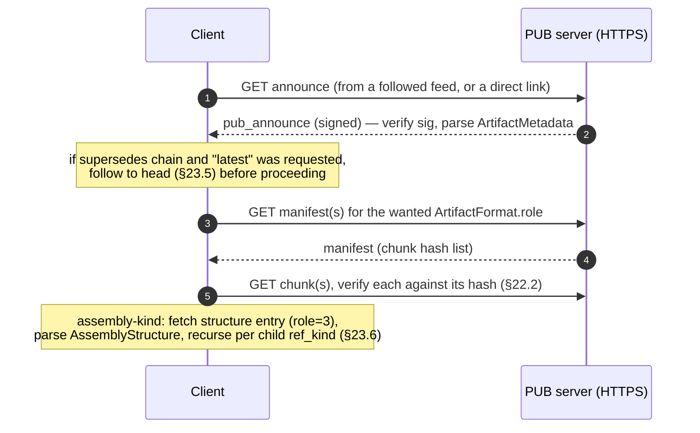

# 23. CAD / Artifact Profile (over DMTAP-PUB)

The key words **MUST**, **MUST NOT**, **REQUIRED**, **SHALL**, **SHOULD**, **SHOULD NOT**,
**RECOMMENDED**, **MAY**, and **OPTIONAL** are to be interpreted as in RFC 2119 / RFC 8174.

## 23.1 Scope & goals

This document is an **application profile** over the DMTAP-PUB extension (§22): a metadata
schema and a set of publishing conventions for sharing **engineering artifacts** — CAD parts,
PCBs, assemblies, schematics, drawings, and the datasets/documents around them — as public
objects. It defines:

- one CBOR metadata schema, `ArtifactMetadata` (§23.3), carried inside a `pub_announce`'s
  metadata (§22.3);
- one CBOR structure schema, `AssemblyStructure` (§23.6.2), for the parts-DAG of an assembly,
  itself published as an ordinary §22 public blob;
- conventions for licensing (§23.4), revision lineage and forking (§23.5), assembly BOM walks
  (§23.6), "workshop" client behavior (§23.7), and first-deployment PUB-server usage (§23.8).

**This profile introduces zero new wire mechanisms and zero new crypto.** It allocates no
message kind, no capability token, no DS-tag, and no error block — every byte this document
defines is either (a) unsigned application data that inherits its authenticity from already
living inside a signed `pub_announce` (§22.3) or an already content-addressed public blob
(§22.2), or (b) a plain convention a CAD-aware client applies when interpreting such data.
A node implementing only §22 with no CAD awareness already stores, serves, and swarms every
object this profile defines; it simply does not parse `ArtifactMetadata`. Conformance to this
profile is therefore additive and orthogonal to §22/§21 conformance — a node can be §22-conformant
without ever having heard of this document, and a CAD client is §22-conformant-by-construction
because it is only a consumer/producer of §22 objects.

**Definitions.** An **artifact** is a versioned engineering design — a part, assembly, PCB,
schematic, drawing, dataset, or supporting document — published as one or more public blobs
(§22 public-blob profile) referenced from a `pub_announce` (§22.3) that carries an
`ArtifactMetadata` map. A **revision** is one such announce. An artifact's history is the
`supersedes` chain (§22.3, §23.5) of its revisions, each independently signed by the
publishing identity.

## 23.2 Relationship to §22 (informative recap)

This profile is built entirely on §22 primitives it does not redefine: **`pub_announce`**
(kind `0x40`, §22.3, a signed plaintext CBOR announcement referencing a manifest root +
structured metadata, with `supersedes` for revision chains); **public-blob manifests** (§22.2,
plaintext-addressed under DS-tag `DMTAP-PUB-v0/manifest`, type-incompatible with the
sealed manifests of §5.5); **author feeds** (§22.4, per-identity append-only monotonic-`seq`
logs); **public-object HTTP serving** (§22.5, plain-HTTPS feed/announce/manifest/chunk endpoints,
§23.8); and **irrevocability** (§22.7, §6.6 item 11 — a published object cannot be
unpublished; deprecation is a new fact, never a deletion, §23.5). Where this document says "the
announce" or "the manifest" without qualification, it means these §22 objects — consult §22 for
their exact wire grammar.

## 23.3 Artifact metadata schema

### 23.3.1 `ArtifactMetadata`

Carried in a `pub_announce`'s `meta` map (§22.3.1) under the profile-named text key
**`"artifact"`**, as a `bytes` value containing the deterministically encoded (§18.1.1,
§18.1.2) `ArtifactMetadata` map below. This embedding keeps both grammars intact: `meta` stays
a text-keyed `ext-value` map (§18.3.6) that a generic §22 reader parses unchanged — ignoring
the unrecognized `"artifact"` key per the forward-compat rule (§21.20) — while the profile
schema keeps the compact integer-keyed per-object-type convention of the core wire format even
though it is not itself part of the core registry (§21). The embedded bytes ride inside the
signed announce body, so they are covered by the announce's signature like every other `meta`
value (§22.3.1).

**Forward compatibility (normative).** A CAD client MUST ignore unrecognized integer keys in
`ArtifactMetadata`, `ArtifactFormat`, `AssemblyStructure`, and `AssemblyChild`, MUST NOT treat
their presence as fatal, and MUST preserve them on re-serialize; keys **≥ 64** are reserved for
future revisions of this profile. (These are *unsigned* application maps embedded in an
already-signed announce, so §18.1.2's unsigned-object ignore rule is the one that applies —
there is no signing preimage of their own to keep unambiguous.)

```cddl
ArtifactMetadata = {
  1  => tstr,                 ; name           human-readable artifact name (UTF-8)
  2  => tstr,                 ; description    free-form description; MAY be empty
  3  => uint,                 ; artifact_kind  §23.3.2
  4  => [+ ArtifactFormat],   ; formats        at least one rendition, §23.3.4
  5  => Units,                ; units          explicit unit declaration, §23.3.3
  ? 6  => [* tstr],           ; tags           free-form; index-derived, never authoritative, §23.7
  7  => tstr,                 ; license        SPDX license expression, REQUIRED, §23.4
  ? 8  => bool,               ; deprecated     true iff this revision deprecates/yanks the artifact, §23.5
  ? 9  => tstr,               ; deprecation_reason  human reason; MUST be present iff deprecated = true
  ? 10 => hash,               ; derived_from   announce id of the ancestor this artifact forks from, §23.5
}
```

| Field | Key | Type | Presence | Meaning & constraints |
|-------|----:|------|----------|-----------------------|
| `name` | 1 | `tstr` | MUST | Human-readable artifact name. UTF-8. Not unique — disambiguation is the publisher's identity + feed, not the name. |
| `description` | 2 | `tstr` | MUST (MAY be empty) | Free-form prose description. |
| `artifact_kind` | 3 | `uint` | MUST | One of the values in §23.3.2. An unrecognized value MUST NOT be treated as fatal by a generic index (it is preserved and surfaced as "unknown kind"), but a client that renders/BOM-walks artifacts MUST refuse to do so for a kind it does not implement. |
| `formats` | 4 | `[+ ArtifactFormat]` | MUST (≥ 1) | The artifact's renditions (§23.3.4). |
| `units` | 5 | `Units` | MUST | Explicit unit declaration (§23.3.3). |
| `tags` | 6 | `[* tstr]` | OPTIONAL | Free-form category/search tags. Purely advisory index input (§23.7); carries no protocol meaning. |
| `license` | 7 | `tstr` | MUST | SPDX license expression (§23.4). |
| `deprecated` | 8 | `bool` | OPTIONAL | Present and `true` iff this revision's purpose is to mark the artifact deprecated/yanked (§23.5). Absent ⇒ `false`. |
| `deprecation_reason` | 9 | `tstr` | MUST iff `deprecated = true` | Human-readable reason. A `deprecated = true` announce with this field absent is malformed for this profile and SHOULD be flagged by a CAD-aware index (see §23.10, CAD-7). |
| `derived_from` | 10 | `hash` | OPTIONAL | Content address (announce id, §22.3) of the ancestor artifact/revision this one forks from (§23.5). Distinct from `supersedes`, which is same-identity revision history; `derived_from` is cross-identity provenance. |

### 23.3.2 Artifact-kind and format registries (profile-local)

These are conventions of this document, not entries in the core §21 IANA registries — extending
them is a matter of revising this profile, not the core protocol.

| `artifact_kind` | Meaning |
|----------------:|---------|
| `1` | part — a single-body mechanical/physical component |
| `2` | assembly — a composition of parts/sub-assemblies (§23.6) |
| `3` | pcb — a printed-circuit-board design |
| `4` | schematic — an electrical/logical schematic |
| `5` | drawing — a 2D engineering drawing |
| `6` | dataset — non-CAD engineering data (simulation results, test data, material tables) |
| `7` | doc — supporting documentation |

| `format_id` | Meaning | Typical `role` |
|-------------:|---------|-----------------|
| `1` | STEP (AP242) | canonical-source (if no native file is published) or derived-rendition |
| `2` | native parametric source (vendor-specific feature-tree format) | canonical-source |
| `3` | glTF / mesh (tessellated geometry) | derived-rendition, always |
| `4` | ECAD (KiCad and equivalent PCB/schematic formats) | canonical-source (for `pcb`/`schematic` kinds) |
| `5` | PDF drawing | derived-rendition (typically), or canonical-source for a `drawing`-kind artifact authored directly as PDF |
| `6` | assembly-structure (the `AssemblyStructure` CBOR document, §23.6.2) | structure |
| `7` | opaque dataset/document blob (arbitrary bytes with no assumed CAD structure — simulation data, test logs, material tables, prose documents) | canonical-source (for `dataset`/`doc` kinds, §23.3.4) or derived-rendition |

| `role` | Meaning |
|-------:|---------|
| `1` | canonical-source — the authoritative rendition (§23.3.4) |
| `2` | derived-rendition — a convenience rendition generated from a source (§23.3.4) |
| `3` | structure — the assembly BOM graph (§23.6); applies only to `artifact_kind = assembly` |

### 23.3.3 Units (normative)

```cddl
Units = {
  1  => tstr,          ; length_unit   REQUIRED, explicit — no implied default
  ? 2  => tstr,         ; angle_unit    default "rad" if absent
  ? 3  => tstr,         ; mass_unit     OPTIONAL, for BOM mass properties
}
```

`length_unit` is an SI or SI-derived token (`"m"`, `"mm"`, `"um"`; non-SI tokens such as `"in"` MAY
appear but MUST be explicit). It **MUST always be present and MUST NOT be defaulted or inferred**
by any producer or consumer — unit ambiguity in interchanged engineering data is a
well-documented, catastrophic-failure-class bug, and this profile closes it structurally rather
than by convention: an `ArtifactMetadata` with `units.length_unit` absent is malformed for this
profile, and a conformant CAD client MUST refuse to interpret the artifact's geometry (it MAY
still display name/description/license) until the publisher corrects it in a superseding
revision (§23.5). `angle_unit` defaults to radians when absent; `mass_unit` is informational,
relevant chiefly to BOM mass roll-ups for `assembly`-kind artifacts (§23.6.3).

### 23.3.4 `ArtifactFormat` and the canonical-source rule (normative)

```cddl
ArtifactFormat = {
  1  => uint,           ; format_id            §23.3.2
  2  => hash,           ; manifest_root        §22 public-blob manifest root for this rendition
  3  => uint,           ; role                 canonical-source(1) / derived-rendition(2) / structure(3)
  ? 4 => hash,           ; derived_from_format  manifest_root this rendition was generated from
  ? 5 => tstr,           ; format_version       free-form tool/variant string, e.g. "AP242 ED2", "KiCad 8.0"
}
```

| Field | Key | Type | Presence | Meaning & constraints |
|-------|----:|------|----------|-----------------------|
| `format_id` | 1 | `uint` | MUST | Rendition format (§23.3.2). |
| `manifest_root` | 2 | `hash` | MUST | The §22 public-blob manifest root for this rendition's bytes. Fetched exactly as any §22 public manifest (§23.8); content-verified per §18.9.5-style chunk hashing, inherited unchanged from §22. |
| `role` | 3 | `uint` | MUST | `1` canonical-source, `2` derived-rendition, `3` structure (§23.3.2). |
| `derived_from_format` | 4 | `hash` | MUST iff `role = 2` | The `manifest_root` of the format entry this rendition was generated from — normally the canonical-source entry, or (for an assembly) the `structure` entry when the derived rendition is a composed/baked mesh of the whole assembly. Forms a shallow provenance pointer, not a chain a client is required to walk. |
| `format_version` | 5 | `tstr` | OPTIONAL | Free-form authoring-tool or format-variant string. Display/index hint only. |

**The canonical-source rule (load-bearing, normative).** The parametric source is the canonical
artifact; a derived mesh or tessellation is a convenience rendition, never the artifact of
record. Concretely:

- `formats` MUST contain **at least one** entry.
- For `artifact_kind` other than `assembly` (§23.3.2), exactly one entry MUST carry
  `role = 1` (canonical-source), and that entry MUST be the artifact's native
  parametric/original-authoring format (`format_id = 2` native, or `4` ECAD for `pcb`/`schematic`
  kinds, or a directly-authored `format_id = 5` PDF for a `drawing`-kind artifact with no separate
  source). A STEP (AP242) entry (`format_id = 1`) MAY serve as canonical-source **only** when no
  native parametric source is published for that artifact (a pure interchange-only publication);
  where a native source exists, STEP MUST be `role = 2` (derived-rendition). For a `dataset`
  (`artifact_kind = 6`) or `doc` (`artifact_kind = 7`) artifact — which has no parametric source
  by nature — the canonical-source entry MAY be a `format_id = 7` (opaque dataset/document blob)
  entry: the opaque bytes *are* the artifact of record for these kinds.
- For `artifact_kind = assembly`, exactly one entry MUST carry `role = 3` (structure,
  `format_id = 6`, §23.6.2); a native assembly-authoring file, if published, MAY additionally
  carry `role = 1`. An assembly with no `structure` entry is malformed for this profile.
- **A `format_id = 3` (glTF/mesh) entry MUST always carry `role = 2`.** A mesh/tessellation MUST
  NOT be marked `canonical-source` under any circumstance — this is the profile's central
  integrity guarantee: a consumer that needs to re-derive dimensions, edit features, or verify
  tolerances can always find the source, never only a lossy tessellation of it.
- Every `role = 2` entry MUST carry `derived_from_format`, pointing at the `manifest_root` of the
  entry it was generated from (the canonical-source entry, or, for assemblies, optionally the
  structure entry). A client MAY follow this pointer to reach the canonical rendition; it MUST
  NOT assume a derived rendition is dimensionally authoritative in its absence.

## 23.4 Licensing (normative)

Every `pub_announce` publishing an artifact under this profile MUST carry a `license` field
(`ArtifactMetadata` key 7) — an SPDX license expression (SPDX License List, or a valid SPDX
license expression per the SPDX specification for combinations, e.g. `"MIT OR Apache-2.0"`).
There is no "no license" state in this profile: an announce omitting `license` is malformed
for this profile (a generic §22 node will still store and serve it — §22 has no concept of
licensing — but a CAD-aware client/index SHOULD refuse to index it as a usable artifact and
SHOULD surface the omission to the publisher, §23.10 CAD-1).

**Hardware licenses are first-class.** Because this profile's primary motivating use case is
open-hardware part sharing (ROADMAP), the CERN Open Hardware Licence family is named explicitly
alongside the usual software/content licenses:

| Domain | Representative SPDX identifiers |
|--------|----------------------------------|
| Hardware (CERN OHL v2) | `CERN-OHL-S-2.0` (strong reciprocal), `CERN-OHL-W-2.0` (weak reciprocal), `CERN-OHL-P-2.0` (permissive) |
| Documentation / content | `CC0-1.0`, `CC-BY-4.0`, `CC-BY-SA-4.0` |
| Software (firmware, scripts, generator code shipped alongside an artifact) | `MIT`, `Apache-2.0`, `BSD-3-Clause`, `GPL-3.0-only` |

This list is illustrative, not a closed enum — `license` is free-text SPDX, not a `uint` from a
profile-local registry, so any valid SPDX expression is admissible.

**License is metadata of the whole revision, and it is immutable for that revision.** `license`
is a top-level field of `ArtifactMetadata`, not a per-`ArtifactFormat` field: one license governs
every rendition an announce references. Because `ArtifactMetadata` rides inside the signed
`pub_announce` (§22.3), the license string is covered by the same signature as everything
else in that revision — it cannot be edited after publication any more than the manifest root
can. **A license change is therefore only expressible as a new revision**: the publisher issues a
new `pub_announce` with `supersedes` pointing at the prior one (§22.3, §23.5) and the new
`license` value. The prior revision's bytes remain published under their original terms forever
(irrevocability, §23.2) — a license change is forward-only and does not retroactively relicense
what a holder already has.

## 23.5 Revision lineage, deprecation & forks (normative)

**Revisions.** An artifact's history is its `supersedes` chain (§22.3), borrowing `edit`
semantics (§2.3 `kind = 0x03`, by analogy — the announce equivalent for public objects):
each revision is a fresh signed `pub_announce` naming the announce id of the revision it
supersedes. Consumers SHOULD follow a chain to its head to resolve "the current version" of an
artifact, and MAY instead pin to a specific revision (§23.6.1) when reproducibility matters more
than freshness.

**Deprecation and yank are announcements, never deletions.** Consistent with the irrevocability
of publishing (§22.7, §6.6 item 11): there is no operation that removes a
previously published artifact revision from existence. To mark a revision (or the whole artifact
lineage) as deprecated or unsafe to use, the publisher issues a **successor announcement** —
`supersedes` the deprecated revision, and its `ArtifactMetadata` carries `deprecated = true` with
a human-readable `deprecation_reason` (§23.3.1). A CAD-aware client MUST surface a deprecated
head revision distinctly from a live one (e.g. a warning banner) and MUST NOT silently hide the
deprecated bytes — they remain fetchable, only their status changes.

**Forks are provenance, not permission.** A **fork** is simply a new `pub_announce`, published by
a **different identity**, whose `ArtifactMetadata.derived_from` (key 10) names the ancestor
artifact's announce id. No `supersedes` relationship exists between the fork and its ancestor —
`supersedes` is strictly same-identity revision history; `derived_from` is cross-identity
provenance. Publishing a `pub_announce` requires no cooperation, consent, or capability grant
from the original publisher (there is nothing to grant — the artifact is public), so forking is
unconditional by construction; `derived_from` exists purely so provenance is discoverable, not so
it can be gated. A client SHOULD display fork provenance in its UI but MUST NOT interpret the
presence of `derived_from` as endorsement, authorization, or any relationship beyond "this
publisher asserts this ancestry" — the field is an unverified, self-asserted pointer (the
DAG-of-parts pointers in §23.6 are the only content-addressed, dedup-bearing references this
profile defines; `derived_from` is metadata, not a Merkle edge).

## 23.6 Assemblies as Merkle DAGs of parts

An `assembly`-kind artifact's composition is a **content-addressed DAG**: each sub-part or
sub-assembly is referenced by content address, so identical children dedup automatically
wherever they recur (within one assembly or across many), and BOM extraction is an ordinary
tree/DAG walk over already-content-addressed, already-integrity-checked (§22.2) references.

### 23.6.1 Reference modes: pin vs track (normative)

An assembly child references another artifact one of two ways:

| Mode | References | Resolves to |
|------|------------|-------------|
| **pin** | a `manifest_root` (a §22 public-blob manifest root) | exact bytes, forever — the same content address always names the same bytes |
| **track** | a `pub_announce` id | whatever the current head of that announce's `supersedes` chain is (§23.5), resolved at fetch time |

Both are `hash`-typed content addresses (§18.1.5-style multihash addressing, inherited from §22);
they differ in *what* they are addresses of.

**Tradeoffs (normative guidance).** `pin` gives an assembly a reproducible, exact BOM —
re-resolving the same structure at any later time yields byte-identical children, because a
manifest root cannot change meaning (§22's content addressing). This is correct for anything
that must build/manufacture identically on re-fetch — a released product BOM, an archival
snapshot, a manufacturing hand-off. Its cost: a pinned child never receives upstream fixes, and
if every holder of that exact manifest stops serving it (§22 durability is best-effort per
holder, not a guarantee), the reference can become unresolvable even though the artifact it came
from is alive at a newer revision. `track` always resolves to the live head, so an assembly
automatically picks up upstream fixes without itself being re-published. Its cost: the effective
BOM is **not stable over time** — walking the same `AssemblyStructure` bytes on two different
days can yield different children, since tracking follows whatever the sub-part's publisher has
since done, including deprecating it (§23.5). A consumer needing a frozen record of "what this
build actually used" MUST resolve every `track` reference to a concrete revision at the time
that matters and, if reproducibility is required going forward, republish that resolution as
`pin` references — tracking is a live view, not a durable record. Neither mode is a default; a
publisher chooses per child, and nothing requires uniformity within one assembly.

### 23.6.2 `AssemblyStructure`

Published as an ordinary §22 public blob (its bytes are the content of a `manifest_root` named by
an `ArtifactFormat` entry with `role = 3`, `format_id = 6`, §23.3.4) — it carries no signature of
its own; its authenticity is exactly the authenticity of the manifest that names it (content
addressing, §22.2), which is in turn named from the signed `pub_announce`.

```cddl
AssemblyStructure = {
  1 => [+ AssemblyChild],   ; children   one or more sub-part/sub-assembly references
}

AssemblyChild = {
  1 => uint,             ; ref_kind    pin(1) / track(2), §23.6.1
  2 => hash,             ; ref         manifest_root (pin) or pub_announce id (track)
  3 => uint,             ; quantity    instance count of this child in the parent; MUST be >= 1
  ? 4 => bytes,          ; transform   OPTIONAL placement/orientation data
}
```

| Field | Key | Type | Presence | Meaning & constraints |
|-------|----:|------|----------|-----------------------|
| `children` | 1 | `[+ AssemblyChild]` | MUST (≥ 1) | The assembly's direct children. An assembly with zero children is malformed for this profile (use a `part`-kind artifact instead). |
| `ref_kind` | 1 (`AssemblyChild`) | `uint` | MUST | `1` pin, `2` track (§23.6.1). |
| `ref` | 2 | `hash` | MUST | A `manifest_root` when `ref_kind = 1`, or a `pub_announce` id when `ref_kind = 2`. |
| `quantity` | 3 | `uint` | MUST | Number of instances of this child in the parent (e.g. `4` for four identical bolts). MUST be `>= 1`; a quantity of `0` is expressed by omitting the child, not by a zero count. |
| `transform` | 4 | `bytes` | OPTIONAL | Placement/orientation data (e.g. a transform matrix) positioning this instance within the parent. **Its byte format is explicitly out of scope for this profile** — left to a future geometry/kinematics profile layered the same way this one is layered on §22. A client that does not understand the transform encoding MAY still perform BOM extraction and dedup (§23.6.3), which do not depend on it. |

### 23.6.3 BOM extraction, dedup, and cycle rejection (normative)

BOM (bill-of-materials) extraction is a walk of the DAG rooted at an `assembly`-kind artifact's
`structure` entry: fetch the `AssemblyStructure`, resolve each child (`pin` directly to its
manifest; `track` by following `supersedes` to the current head, §23.5), and recurse into any
child that is itself `assembly`-kind.

- **Dedup composes automatically.** Because children are content-addressed (`pin`) or resolve to
  a content-addressed manifest (`track`, once resolved to a specific revision), two occurrences of
  the identical part — whether within one assembly or across many different assemblies published
  by anyone — collapse to the same reference during a walk. A BOM tool needs no explicit
  deduplication step beyond the ordinary "have I already visited this content address" check any
  DAG walk performs; this is the same property that makes §22 public-blob storage itself
  cross-user-deduplicating (§22.2), extended one layer up to the artifact graph.
- **Cycles MUST be rejected.** A `pin` reference cannot participate in a cycle — content
  addressing is acyclic by construction, since a manifest root is a hash of content computed
  after that content exists. A `track` reference **can** form a cycle across revisions (assembly
  A's live head tracks part B, and B's publisher — maliciously or by error — later publishes B as
  an assembly that tracks back to A). A conformant BOM-walking client MUST maintain the set of
  content-addresses (`pin`) and resolved-announce-ids at the visited revision (`track`) on the
  current path, and MUST treat re-encountering one on the same path as a fatal structural error
  for that subtree: abort the walk there, do not extract a BOM through it, and surface the cycle
  to the user. This is a client-side validation rule, not a protocol-level rejection at publish
  time — §22 has no mechanism to prevent a cycle, since `track` references resolve after the
  fact, at fetch time. The profile's integrity guarantee is that no conformant client silently
  produces a wrong or infinitely-recursing BOM, not that a cyclic publication is impossible.
- **Quantity multiplies along the path.** The effective quantity of a leaf part in a BOM is the
  product of `quantity` at every level of the path from the assembly root to that leaf (standard
  multi-level BOM semantics); a walker accumulates this product per distinct content address.

## 23.7 Workshop conventions

A **workshop** is purely client-side state: the set of author feeds (§22.4) a user follows.
It is not a protocol object, has no wire representation, and no node other than the user's own
client(s) needs to know its contents.

- **Category and search indexes are derived data.** Any node — the user's own client, a community
  index service, a search engine — can rebuild a browsable index of artifacts by crawling the
  feeds it knows about and reading each `pub_announce`'s `ArtifactMetadata` (`artifact_kind`,
  `tags`, `license`, `name`/`description`). **No index is authoritative.** Two indexes MAY
  disagree (different crawl coverage, different staleness, different tag-derivation heuristics)
  without either being "wrong" in a protocol sense — the ground truth is always the signed
  announces themselves, fetchable per §23.8, and any client MAY recompute an index from scratch.
  This mirrors §22's own posture toward indexes over feeds (§22.4).
- **Publishing to a workshop is publishing to your own feed.** There is no separate "workshop
  publish" operation: an artifact is published exactly as any §22 object is — sign and append a
  `pub_announce` to the publisher's own author feed (§22.4). "Adding it to a workshop" from
  a consumer's perspective is simply following that feed. A publisher MAY additionally notify one
  or more index services out-of-band (e.g. an HTTP ping asking a crawler to re-fetch sooner) —
  this is a convenience integration outside the DMTAP wire protocol, not a normative part of this
  profile, exactly as a website ping-submitting itself to a search engine is outside HTTP.

## 23.8 Public-object HTTP endpoint usage

Nothing in this profile requires a mesh transport for a first deployment: this profile's objects
are ordinary §22 objects, so they are served exactly by §22's public-object HTTP endpoint (§22.5.1) —
a plain-HTTPS surface with no protocol change needed. The table below restates that surface as
this profile uses it; the normative endpoint grammar is §22.5.1's.

| Purpose | Endpoint (normative grammar: §22.5.1) |
|---------|----------------------------------------------------------------------|
| Fetch a publisher's feed | `GET /.well-known/dmtap-pub/feed/{pub}/head`, then `…/feed/{pub}/range?from=&to=` — the signed head plus verified `FeedEntry` slices (§22.4.4) |
| Fetch one announce | `GET /.well-known/dmtap-pub/announce/{id}` — the signed `pub_announce` CBOR (its `meta["artifact"]` bytes embed `ArtifactMetadata`, §23.3.1) |
| Fetch a manifest | `GET /.well-known/dmtap-pub/manifest/{id}` — the `PubManifest` chunk-hash list (§22.2.1) |
| Fetch chunk bytes | `GET /.well-known/dmtap-pub/chunk/{h}` — raw plaintext chunk bytes, self-verifying against `h` |

A CAD client's resolution sequence for one artifact, over that surface alone:



A PUB server serving this surface needs **no CAD-specific code**: it stores and serves opaque
signed/content-addressed §22 objects. All artifact-schema interpretation — `ArtifactMetadata`,
`AssemblyStructure`, licensing, kind/format enums — happens entirely client-side. This is what
lets a first deployment be one plain-HTTPS PUB server with zero mesh participation (§23.9,
Appendix A).

## 23.9 Privacy & security notes (informative)

This profile inherits its privacy posture unchanged from §22: publishing under DMTAP-PUB is a
deliberate, irrevocable act of making content public, and the CAS-confirmation attack that §5.5
sacrifices cross-user dedup to avoid is *accepted by design* here, because the publisher's
holding is public on purpose (the §5.5 public-object carve-out, §22.2.4). Nothing this profile adds changes that
posture: `ArtifactMetadata`, `AssemblyStructure`, and every referenced manifest are plaintext by
construction, exactly like every other §22 public object. This profile makes no confidentiality
claim whatsoever — an artifact published under it is, by definition, not a private document; a
publisher who needs confidentiality for a design uses the sealed-file model of §5.5 instead, not
this profile.

## 23.10 Conformance checklist (profile-level MUSTs)

| # | Requirement | Ref |
|---|-------------|-----|
| CAD-1 | Every artifact `pub_announce`'s `ArtifactMetadata` carries a `license` field (SPDX expression) | §23.4 |
| CAD-2 | `formats` contains at least one entry | §23.3.4 |
| CAD-3 | Exactly one `formats` entry carries `role = canonical-source` (non-assembly kinds) or `role = structure` (assembly kind) | §23.3.4 |
| CAD-4 | No `format_id = gltf/mesh` entry ever carries `role = canonical-source` | §23.3.4 |
| CAD-5 | Every `role = derived-rendition` entry carries `derived_from_format` | §23.3.4 |
| CAD-6 | `units.length_unit` is present and explicit; a client MUST NOT default it | §23.3.3 |
| CAD-7 | `deprecated = true` is always accompanied by `deprecation_reason` | §23.3.1 |
| CAD-8 | Deprecation/yank is expressed only as a successor announcement, never as deletion | §23.5 |
| CAD-9 | Assembly children reference exclusively by `pin` (manifest root) or `track` (announce id) | §23.6.1 |
| CAD-10 | A BOM-walking client MUST detect and reject a cycle in an assembly's resolved DAG rather than recurse indefinitely or silently drop it | §23.6.3 |
| CAD-11 | No client treats any single index (category/search/workshop) as authoritative over the signed announces it was derived from | §23.7 |

> **Conformance-suite note.** The `format_id = 7` (opaque dataset/document blob) addition in
> §23.3.2/§23.3.4 widens the admissible canonical-source formats for `dataset`/`doc` kinds, which
> touches the semantics exercised by the CAD-2/CAD-3 cases in `conformance/SUITE.md` /
> `conformance/suite.json`. Those artifacts are maintained by the conformance workstream and are
> **not** updated here; they require a suite regeneration to cover `format_id = 7`.

## Appendix A: Mapping to the kerf Workshop (informative)

This appendix illustrates, non-normatively, how the motivating deployment (ROADMAP) uses this
profile. It does not define new protocol behavior.

kerf's Workshop publish flow maps onto this profile as follows:

1. **Build a public manifest from project files.** kerf already content-addresses project files
   as Git LFS objects, keyed by SHA-256. DMTAP's hash-agility prefix (§18.1.5) is a multihash-
   style byte in front of the digest, so a kerf-built §22 public manifest MAY address its chunks
   under the SHA-256 prefix (`0x12`) using the LFS objects' existing digests directly — no
   re-hash needed. **Stated honestly**: `0x12` is RESERVED, not v0-REQUIRED, so a peer
   implementing only the v0-REQUIRED BLAKE3 prefix (`0x1e`) will not recognize these chunks; kerf
   accepts this narrower near-term interoperability surface and migrates to native BLAKE3
   addressing as that becomes the common case, via the same agility mechanism the core protocol
   already provides for exactly this migration (§2.2) — no new addressing scheme, no flag day.
2. **Sign a `pub_announce`** carrying an `ArtifactMetadata` map (§23.3) built from the kerf
   project's metadata: name, description, `artifact_kind` from the project type, the format list
   (native kerf/OCCT source as canonical, STEP/glTF exports as derived renditions, §23.3.4),
   units, and the project's declared SPDX license (§23.4).
3. **Append to the author feed** (§22.4) — the publishing identity's own feed; there is no
   separate "kerf server feed."
4. **PUB servers serve over plain HTTPS** (§23.8) — kerf's hosted server is **one server among
   equals**, exactly as any self-hosted or third-party DMTAP-PUB server; it holds no special
   protocol role. This preserves the clean seam already established for kerf's architecture:
   kerf cloud is billing + provisioning + fleet, never a required intermediary for the artifact
   itself to exist or be fetched.
