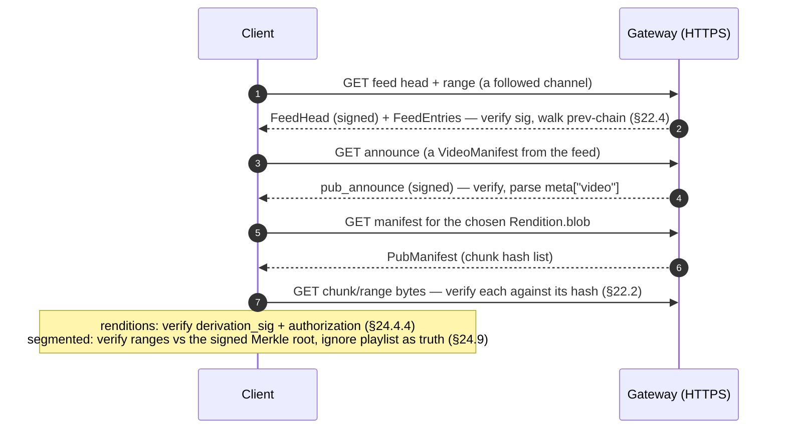

# 24. Video / Media Profile (over DMTAP-PUB)

The key words **MUST**, **MUST NOT**, **REQUIRED**, **SHALL**, **SHOULD**, **SHOULD NOT**,
**RECOMMENDED**, **MAY**, and **OPTIONAL** are to be interpreted as in RFC 2119 / RFC 8174.

## 24.1 Scope & goals

This document is an **application profile** over the DMTAP-PUB extension (§22): a set of metadata
schemas and publishing conventions for sharing **video and time-based media** — uploaded videos,
their transcoded renditions, captions, channels, comments, reactions, playlists, and live
streams — as public objects. It is the **convergence path** for the *vidmesh* protocol, an
independently-designed video-sharing protocol that reinvented §22's ground (signed
content-addressed records, per-author append-only history, trustless serving, plaintext blobs)
with **incompatible bytes**. This profile carries vidmesh's *application semantics* — its manifest
shape, its verifiable-derivation rule, its channel/social/live model, its "aggregates are claims"
and "no protocol takedown" postures — onto DMTAP-PUB's *wire substrate*, so that one object model,
one identity system, and one serving surface underlie both. Where vidmesh and this profile describe
the same fact, this profile's bytes are the DMTAP-PUB bytes; §24.14 states exactly what a
vidmesh-format record must change to become a conforming public object.

It defines:

- one CBOR metadata schema, `VideoManifest` (§24.4), carried inside a `pub_announce`'s metadata
  (§22.3), describing an original media file plus **signed rendition derivations**, captions, a
  thumbnail, a license, and fetch hints;
- a **channel** convention (§24.5) mapping vidmesh channels onto author feeds (§22.4);
- **social objects** — comment, reaction, follow, playlist (§24.6) — each an ordinary
  `pub_announce` on the actor's own feed referencing a subject by content address;
- **lineage** conventions (§24.7) mapping vidmesh's `supersede` / `retract` / `mirror` / `derived_from`
  onto §22's existing supersede-chain, deprecation-as-successor, cache/pin, and cross-identity
  provenance;
- the **aggregates-are-claims** posture for view/reaction counts (§24.8);
- **segmented serving** — HLS/DASH — as a *serving-layer* concern where segments are
  content-addressed blob ranges and playlists are gateway-local, unsigned, regenerable (§24.9);
- **live streaming** (§24.10) as an *optional capability* (`vid-live-1`): rolling signed segment
  batches that close into an ordinary VOD `VideoManifest`;
- **licensing** (§24.11), **gateway usage** (§24.12), the **content-moderation posture** (§24.13),
  the **vidmesh migration note** (§24.14), and the **profile conformance checklist** (§24.15).

**What this profile does and does not add to the core.** Like §23 (CAD), this profile allocates
**no core message kind, no DS-tag in the §21 registry, and no §21 error block**: every metadata map
it defines is *unsigned application data* embedded in an already-signed `pub_announce.meta` (§22.3.1),
and every media file it references is an ordinary §22 public blob (§22.2). A node implementing only
§22 with no video awareness already stores, serves, and swarms every object this profile defines; it
simply does not parse the metadata maps. **One deliberate exception, disclosed up front:** unlike
§23, this profile defines **one profile-local signed structure** — the *rendition-derivation
statement* (§24.4.4) — so an untrusted third party can transcode a video and sign accountability for
the result. That statement reuses the core's Ed25519 signing and DS-tag domain-separation discipline
(§18.1.6) unchanged, allocates **no** entry in the core §21 registry, and is verified by exactly the
same `IK`/`DeviceCert` authorization chain as a `pub_announce` signer (§22.3.3); it is a
*profile-scoped* signing context (`"DMTAP-VID-v0/derivation"`), not a new core primitive.

**Definitions.** A **video** is a piece of time-based media published as one or more §22 public
blobs referenced from a `pub_announce` (§22.3) carrying a `VideoManifest` map — the canonical
identity of the video, to which every comment, reaction, receipt, and claim refers (never a raw
blob). A **rendition** is a transcoded encoding of that video, referenced from the same manifest,
carrying a signed derivation statement (§24.4.4). A **channel** is a named grouping of one
publisher's videos; the publisher's **author feed** (§22.4) is the channel-of-record (§24.5).

## 24.2 Relationship to §22 and to vidmesh (informative recap)

**Built on §22 primitives, redefining none:** **`pub_announce`** (kind `0x40`, §22.3, a signed
plaintext CBOR announcement referencing manifests + structured metadata, with `supersedes` for
same-identity revision chains); **public-blob manifests** (§22.2, plaintext-addressed under DS-tag
`DMTAP-PUB-v0/manifest`); **author feeds** (§22.4, per-identity append-only monotonic-`seq` logs with
a signed `FeedHead` and `prev` hash-chain); **gateway HTTP serving** (§22.5.1); and **irrevocability**
(§22.7 — a published object cannot be unpublished; deprecation is a new fact, never a deletion). See
also [`substrate/FEEDS.md`](substrate/FEEDS.md), which extracts this machinery for non-mail products.

**Convergence with vidmesh.** vidmesh is a signed-record video protocol whose kernel independently
arrived at DMTAP-PUB's design — CBOR records, a signing identity that *is* a keypair, content-addressed
blobs with a BLAKE3 chunk tree, dumb relays, edge-selected moderation — but expressed it in bytes
incompatible with §22 (a different envelope, a different signing preimage, bare `b3-256` blob ids with
no multihash prefix, and **no signed feed head**). This profile is not a translation layer bolted
between two live protocols; it is the statement that vidmesh's *semantics* are correct and its *wire*
should be DMTAP-PUB's. A publisher that adopts this profile publishes DMTAP-PUB bytes and is
interoperable with every other §22 reader; §24.14 is the one-time record-shape migration.

## 24.3 Object model — the mapping

Everything a publisher emits is a `pub_announce` on **its own** author feed (§22.4); an object refers
to another by that other's content address (announce id or manifest root). The profile's objects, and
the vidmesh kind each converges from:

| Profile object | Carried in | vidmesh kind | Maps onto §22 mechanism |
|----------------|-----------|--------------|--------------------------|
| **VideoManifest** (§24.4) | `meta["video"]` | `manifest` (16) | signed `pub_announce` + public-blob manifest roots |
| **Channel** (§24.5) | `meta["channel"]` | `channel` (36) | a `pub_announce`; the author feed is the channel-of-record |
| **Comment** (§24.6.1) | `meta["comment"]` | `comment` (32) | `pub_announce` on the commenter's feed; `subject` = target announce id |
| **Reaction** (§24.6.2) | `meta["reaction"]` | `reaction` (33) | `pub_announce`; later same-author reaction `supersedes` earlier (for counting) |
| **Follow** (§24.6.3) | `meta["follow"]` | `follow` (34) | `pub_announce`; `subject` = followed identity's `IK` (portable social graph) |
| **Playlist** (§24.6.4) | `meta["playlist"]` | `playlist` (35) | `pub_announce`; ordered list of manifest announce ids in the body |
| **Rendition** (§24.4.3) | inside `VideoManifest` | (manifest field) | derived §22 public blob + signed derivation statement (§24.4.4) |
| **Mirror** (§24.7) | `meta["mirror"]` | `mirror` (19) | a serving *assertion*; maps to the cache/pin role ([`substrate/ROLES.md § 6`](substrate/ROLES.md)) |
| **LiveManifest** (§24.10) | `meta["live"]` | `live.manifest` (112) | rolling series of `pub_announce`s; optional `vid-live-1` |
| **LiveChat** (§24.10) | `meta["live_chat"]` | `live.chat` (113) | `pub_announce`; `subject` = stream id; MAY be expired aggressively |
| **RightsClaim** (§24.11) | `meta["claim"]` | `claim.*` (48–51) | `pub_announce` asserting a claim; presented with provenance, never as truth |
| **Delegate grant** (§24.4.4) | `meta["delegate"]` | `delegate` (3) | a `pub_announce` authorizing a `rendition` producer; revoked by successor |

Two structural notes that hold throughout:

- **A publisher only ever writes its own feed.** A comment on someone else's video is not appended to
  the video author's feed — it is a `pub_announce` on the *commenter's* feed that names the video's
  announce id as its `subject`. This is exactly §22.4's single-author-feed model, and it is why the
  social graph needs no shared mutable object: threads, reactions, and follows are reassembled by any
  index that crawls the participating feeds (§24.8). vidmesh's relay-`refs` filtering (its
  `["REQ", …, {refs:[…]}]` subscription) is the crawl input; the ground truth is the signed feeds.
- **`subject` is always a content address.** Where a schema below carries a `subject` field, it is the
  `hash`-typed content address (§18.1.5 multihash) of the referenced object — an announce id for a
  record subject, a `manifest_root` for a blob subject — inheriting §22's integrity checking unchanged.

## 24.4 `VideoManifest` metadata schema

Carried in a `pub_announce`'s `meta` map (§22.3.1) under the profile-named text key **`"video"`**, as
a `bytes` value containing the deterministically encoded (§18.1.1, §18.1.2) `VideoManifest` map below.
As in §23.3.1, this keeps both grammars intact: `meta` stays a text-keyed `ext-value` map a generic
§22 reader parses unchanged (ignoring the unrecognized `"video"` key per §21.20), while the profile
schema keeps the compact integer-keyed convention. The embedded bytes ride inside the signed announce
body, so they are covered by the announce's signature like every other `meta` value.

**Forward compatibility (normative).** A video client MUST ignore unrecognized integer keys in
`VideoManifest`, `Media`, `Rendition`, `Caption`, and every other profile map, MUST NOT treat their
presence as fatal, and MUST preserve them on re-serialize; keys **≥ 64** are reserved for future
revisions of this profile. (These are *unsigned* application maps in an already-signed announce, so
§18.1.2's unsigned-object ignore rule applies — there is no signing preimage of their own to keep
unambiguous, **except** the derivation statement of §24.4.4, which is signed and whose preimage rules
are stated there.)

### 24.4.1 `VideoManifest`

```cddl
VideoManifest = {
  1  => tstr,            ; title          human-readable title (UTF-8), REQUIRED
  ? 2  => tstr,          ; description    free-form; MAY be empty
  ? 3  => [* tstr],      ; tags           ≤ 32 tags, each ≤ 64 bytes; advisory, never authoritative
  ? 4  => tstr,          ; language       BCP 47 tag for the primary audio/subject language
  5  => Media,           ; original       the source encoding, REQUIRED (§24.4.2) — the canonical rendition
  ? 6  => [* Rendition], ; renditions     derived encodings (§24.4.3), each a signed derivation
  ? 7  => [* Caption],   ; captions       subtitle/caption tracks (§24.4.2)
  ? 8  => hash,          ; thumbnail      manifest_root of a still-image public blob
  9  => tstr,            ; license        SPDX expression or a profile consent token (§24.11), REQUIRED
  ? 10 => hash,          ; channel        announce id of a Channel this video joins (§24.5)
  ? 11 => [* Hint],      ; hints          advisory retrieval hints for the referenced blobs (§24.4.5)
  ? 12 => bool,          ; retracted      true iff this revision withdraws the video (§24.7)
  ? 13 => tstr,          ; retract_reason human reason; MUST be present iff retracted = true
  ? 14 => hash,          ; derived_from   announce id of an ancestor video this remixes/reuploads (§24.7)
}
```

| Field | Key | Type | Presence | Meaning & constraints |
|-------|----:|------|----------|-----------------------|
| `title` | 1 | `tstr` | MUST | Human-readable title. UTF-8, ≤ 512 bytes RECOMMENDED. Not unique — disambiguation is the publisher's identity + feed, not the title. |
| `description` | 2 | `tstr` | OPTIONAL | Free-form prose. ≤ 16384 bytes RECOMMENDED. |
| `tags` | 3 | `[* tstr]` | OPTIONAL | ≤ 32 tags, each ≤ 64 bytes. Purely advisory index input (§24.8); carries no protocol meaning. |
| `language` | 4 | `tstr` | OPTIONAL | BCP 47 tag. |
| `original` | 5 | `Media` | MUST | The source encoding — the **canonical rendition** of the video (§24.4.2, §24.4.3). |
| `renditions` | 6 | `[* Rendition]` | OPTIONAL | Derived encodings, each carrying a signed derivation statement (§24.4.3, §24.4.4). |
| `captions` | 7 | `[* Caption]` | OPTIONAL | Caption/subtitle tracks (§24.4.2). |
| `thumbnail` | 8 | `hash` | OPTIONAL | `manifest_root` of a still-image public blob. |
| `license` | 9 | `tstr` | MUST | SPDX expression or one of the profile consent tokens (§24.11). |
| `channel` | 10 | `hash` | OPTIONAL | Announce id of a `Channel` object this video joins (§24.5). The channel's author MUST equal the video's author. |
| `hints` | 11 | `[* Hint]` | OPTIONAL | Advisory retrieval hints (§24.4.5) for every blob this manifest references. |
| `retracted` | 12 | `bool` | OPTIONAL | Present and `true` iff this revision withdraws the video (§24.7). Absent ⇒ `false`. |
| `retract_reason` | 13 | `tstr` | MUST iff `retracted = true` | Human-readable reason. A `retracted = true` manifest with this absent is malformed for this profile (VID-7). |
| `derived_from` | 14 | `hash` | OPTIONAL | Announce id of an ancestor video this one remixes or re-uploads (§24.7). Self-asserted provenance, never endorsement. |

### 24.4.2 `Media` and `Caption` (normative)

```cddl
Media = {
  1 => hash,     ; blob        manifest_root of the encoded file's §22 public blob
  2 => u64,      ; size        total plaintext byte size
  3 => tstr,     ; codec       RFC 6381 codecs string, e.g. "av01.0.08M.08", "avc1.640028"
  4 => u64,      ; duration    milliseconds
  5 => u32,      ; width       pixels
  6 => u32,      ; height      pixels
  ? 7 => u64,    ; bitrate     bits/second (advisory; REQUIRED in a Rendition, §24.4.3)
}

Caption = {
  1 => hash,     ; blob        manifest_root of the caption file's §22 public blob
  2 => tstr,     ; language    BCP 47 tag
  3 => tstr,     ; format      caption format token, e.g. "vtt", "srt"
}
```

`Media.blob` (and `Caption.blob`) is a §22 public-blob `manifest_root` (§22.2.1), fetched exactly as
any §22 public manifest and content-verified per §22.2's chunk hashing, inherited unchanged. There is
**no separate `chunk_root` field** as in vidmesh: the §22 public-blob manifest *is* the chunk-hash
list and its DS-tagged Merkle root is the integrity anchor; per-chunk verification and verified range
reads are §22 machinery (and are strengthened by the optional range-proof endpoint proposed in
§24.16 / [`substrate/FEEDS.md`](substrate/FEEDS.md)). RFC 6381 `codec` strings carry over from vidmesh
unchanged — a display/decode hint, not a protocol enum.

### 24.4.3 `Rendition` and the canonical-original rule (normative)

A **rendition** is a transcoded encoding of the same video — a lower resolution, a different codec, an
audio-only extraction. Renditions share the manifest's identity: byte-different encodings of one video
do not fragment into separate "videos" (this is vidmesh §004 §3, carried over).

```cddl
Rendition = {
  1 => hash,     ; blob            manifest_root of this rendition's §22 public blob
  2 => u64,      ; size
  3 => tstr,     ; codec
  4 => u64,      ; duration
  5 => u32,      ; width
  6 => u32,      ; height
  7 => u64,      ; bitrate         REQUIRED for a rendition
  8 => hash,     ; produced_by     IK of the identity that transcoded (§24.4.4)
  9 => bytes,    ; derivation_sig  signature over the derivation statement (§24.4.4)
  ? 10 => hash,  ; derived_from    manifest_root this rendition was produced from; default = original.blob
}
```

**The canonical-original rule (load-bearing, normative).** The `original` media (`VideoManifest` key
5) is the artifact of record; every `Rendition` is a convenience encoding, never the source of truth.
Concretely, mirroring §23.3.4's mesh-is-never-canonical guarantee:

- `original` (key 5) MUST be present and is always the canonical rendition. A consumer that needs the
  highest-fidelity source can always find it at `original.blob`, never only a lossy transcode.
- Every `Rendition` MUST carry `produced_by` (key 8) and a valid `derivation_sig` (key 9) over the
  derivation statement (§24.4.4). A `Rendition` missing either, or whose signature does not verify, is
  **not an authorized rendition**: a conformant client MUST NOT present it as an equivalent encoding of
  the video (it MAY be shown, clearly labeled, as an unverified third-party encoding, or dropped).
- `derived_from` (key 10), when present, is the `manifest_root` the rendition was produced from; when
  absent it defaults to `original.blob`. A rendition MAY be derived from another rendition (a
  transcode chain), but the derivation statement always names the concrete input it was produced from,
  so accountability is never ambiguous.

### 24.4.4 The rendition-derivation statement (the one profile-local signed structure)

This is the single place §24 goes beyond §23's "zero new signed structures." It exists so an
**untrusted third party** can transcode a creator's video and publish the rendition with cryptographic
*accountability* — the property vidmesh calls a *verifiable derivation* (§004 §3), which lets gateways
serve third-party renditions "without blind trust." A derivation signature proves **accountability,
not fidelity** — a malicious transcoder can sign an unfaithful rendition; the remedy is revocation
plus edge reputation (§24.13), never a protocol guarantee of transcode correctness.

The producer signs the derivation statement:

```
stmt = det_cbor([ derived_from, rendition.blob, codec, width, height, bitrate ])
       ; derived_from defaults to original.blob when Rendition key 10 is absent
       ; all six elements are exactly the Rendition's key-10(or-original)/1/3/5/6/7 values
derivation_sig = Sign( producer_device_key,
                       "DMTAP-VID-v0/derivation" ‖ 0x00 ‖ BLAKE3-256(stmt) )
```

- The statement binds the **input→output blob pair together with the codec/resolution/bitrate tuple**,
  so a signature cannot be replayed onto a different quality claim for the same blob pair (vidmesh
  §004 Decisions, carried over).
- The signature reuses the **core signing discipline unchanged**: Ed25519 v0 with per-object suite
  agility (§1.1), a DS-tag prefix with the `0x00` separator (§18.1.6), signed by a **device key that
  chains to `produced_by` via a `DeviceCert`** exactly as a `pub_announce` signer chains to its `pub`
  (§22.3.3 step 4). No new algorithm, no §21 registry entry — a *profile-scoped* DS-tag string is the
  only new byte, and it is domain-separated from every core context by construction (§18.1.6).
- **Authorization.** A rendition is *authorized* iff `produced_by` is the manifest's author, **or** an
  identity holding an unrevoked, unexpired **`rendition` delegate grant** from the author (§24.4.6). A
  client MUST verify both the derivation signature *and* the authorization before treating a rendition
  as an equivalent encoding; an unauthorized-but-validly-signed rendition is a labeled third-party
  encoding (the signature still names *who* asserts it), not an authorized one.

### 24.4.5 `Hint` — advisory retrieval hints

```cddl
Hint = [ hint_type: uint, value: tstr ]
```

`hints` (in `VideoManifest`, `Mirror`, and live objects) are **advisory and additive**: any host
answering for a content address is equivalent, because the address proves integrity regardless of
origin (§22.5.1). A client MUST NOT treat a blob fetched from an unlisted source differently, and MUST
NOT treat a hint as authoritative over the content address. The profile-local hint-type registry
(proposed additively for the whole waist in §24.16 / [`substrate/FEEDS.md`](substrate/FEEDS.md)):

| `hint_type` | Name | Value |
|------------:|------|-------|
| `1` | `https` | URL serving the blob with HTTP Range (a §22 gateway `chunk` surface, or any range server) |
| `2` | `torrent-v2` | BitTorrent v2 infohash, lowercase hex |
| `3` | `relay-blob` | base URL of a relay/gateway blob surface (§22.5.1) |
| `4` | `bundle` | locator of a self-verifying bundle (§24.14 note) containing the blob |

New transports are new hint types; unrecognized types MUST be ignored, never rejected.

### 24.4.6 `Delegate` grant for `rendition` producers

A `Delegate` object (`meta["delegate"]`) grants the `rendition` capability from the video author to a
producer identity, so a transcoding service can publish *authorized* renditions on the author's behalf.

```cddl
Delegate = {
  1 => hash,       ; grantee     IK of the identity receiving the capability
  2 => tstr,       ; capability  registered capability name; "rendition" at launch
  ? 3 => u64,      ; expires_at  Unix seconds; absent = until revoked
  ? 4 => bool,     ; revoked     true revokes the grant named by supersedes
}
```

A grant is a `pub_announce` with `Delegate.revoked` absent. A revocation is a **successor
`pub_announce`** whose `supersedes` names the grant and whose `Delegate.revoked = true`, `grantee` and
`capability` matching the grant (irrevocability + supersede-only, §22.3.4). Delegation never transfers
identity; it authorizes exactly the `rendition` action §24.4.4 consults. This maps vidmesh's `delegate`
(kind 3) onto the §22 supersede mechanism with no new machinery.

## 24.5 Channels are author feeds

A **channel** is a named grouping of one publisher's videos. The mapping has two layers:

- **The author feed is the channel-of-record.** A publisher's §22 author feed (§22.4) — its
  per-identity, `seq`/`prev`-chained, signed-`FeedHead` log — *is* its channel: to "subscribe to a
  channel" is to follow that feed (§24.6.3), and every video the publisher announces appears on it in
  order, with anti-rollback and equivocation detection for free (§22.4.2). No separate channel object
  is required for the common one-identity-one-channel case.
- **Sub-channels for publishers who want more than one.** A publisher MAY partition its feed into named
  sub-channels by publishing a `Channel` object and having each video reference it via
  `VideoManifest.channel` (key 10). This carries over vidmesh's "an identity MAY have many channels."

```cddl
Channel = {
  1 => tstr,     ; title        REQUIRED
  ? 2 => tstr,   ; description
  ? 3 => hash,   ; avatar       manifest_root of an image blob
  ? 4 => hash,   ; banner       manifest_root of an image blob
}
```

A `Channel` is a `pub_announce` on the publisher's own feed; a video "joins" it by naming its announce
id in `VideoManifest.channel`. A client MUST reject a `channel` reference whose named announce has a
different `pub` than the video's author (a video cannot join another identity's channel) — this is the
same-author constraint vidmesh states in §003 §4.1, enforced here by comparing the two announces' `pub`
(exactly the §22.3.3-style `pub`-match already required for `supersedes`).

## 24.6 Social objects

Each social object is an ordinary `pub_announce` on the **actor's own** feed. None mutates the
subject's feed; a crawler reassembles threads, tallies, and graphs from the participating feeds
(§24.8). All carry `subject` as a content address (§24.3).

### 24.6.1 `Comment`

```cddl
Comment = {
  1 => hash,     ; subject   announce id of the VideoManifest or LiveManifest commented on
  2 => tstr,     ; text      non-empty, ≤ 8192 bytes
  ? 3 => hash,   ; parent    announce id of a parent Comment, for threading
  ? 4 => [* hash]; media     manifest_roots of attached media blobs
}
```

Threads merge by reference in any arrival order (partition posture). A `parent`, when present, MUST
itself reference the same `subject` (a reply cannot jump subjects) — a client validating a thread MUST
enforce this (VID-9). Editing a comment is a same-author `supersede` (§24.7); the original announce id
remains the stable reference for replies.

### 24.6.2 `Reaction`

```cddl
Reaction = {
  1 => hash,     ; subject    announce id of the reacted-to record
  2 => tstr,     ; reaction   single emoji grapheme cluster or registered token, ≤ 32 bytes
}
```

**Later supersedes earlier, for counting.** An identity's newer reaction to the same subject
`supersedes` (§22.3, §24.7) its earlier one — a same-author supersede chain per (subject, actor), so an
index counts **at most one** current reaction per identity per subject (vidmesh §003 §5.2, carried
over). Removing a reaction is a `retract`-style successor (§24.7).

### 24.6.3 `Follow`

```cddl
Follow = {
  1 => hash,     ; subject   the followed identity's IK (§1.2) — a key, used as a content ref
  ? 2 => tstr,   ; note
}
```

A follow's `subject` is the **followed identity's `IK`**, not an announce id — following an *identity*
(its whole feed / channel-of-record, §24.5), not one video. Publishing the follow as a `pub_announce`
(rather than keeping it client-side as §23's "workshop" does) makes the **social graph portable**: any
index that crawls follows can reconstruct any identity's follower/following graph, and no gateway owns
it (vidmesh §003 §5.3). Unfollowing is a `retract`-style successor (§24.7). A client that prefers a
private follow set MAY instead keep it client-side (the §23.7 workshop model) and simply not publish
`Follow` objects — publishing is opt-in, and an unpublished follow is invisible by construction.

### 24.6.4 `Playlist`

```cddl
Playlist = {
  1 => tstr,        ; title       REQUIRED
  ? 2 => tstr,      ; description
  3 => [+ hash],    ; entries     ordered announce ids of VideoManifests; non-empty
}
```

Entries live in the body (not in refs) so that **reordering is an ordinary same-author `supersede`**
with a replacement `Playlist` body (vidmesh §003 §5.4, carried over). The original announce id remains
the playlist's stable identity across reorderings.

## 24.7 Lineage — supersede, retract, mirror, remix

All four map onto §22's **existing** lineage mechanics; the profile adds no new lineage machinery.

- **Revisions = same-author `supersedes` (§22.3, §24.5-style `pub`-match).** Editing any object — a
  video's metadata, a comment's text, a playlist's order — is a fresh signed `pub_announce` naming the
  announce id it supersedes; `supersedes` is strictly *same-identity* history, and a reader following a
  chain to its head resolves "the current version." This is vidmesh's `supersede` (kind 17) with its
  "complete replacement body, not a diff" rule preserved: the new `meta[<key>]` map is the whole new
  state.
- **Retract = deprecation-as-successor, never deletion (§22.3.4, §22.7).** To withdraw a video, the
  publisher issues a **successor** `pub_announce` that `supersedes` the prior one with
  `VideoManifest.retracted = true` and a `retract_reason` (§24.4.1). Consistent with irrevocability,
  the retracted bytes remain fetchable — only their status changes. A conformant client MUST surface a
  retracted head distinctly (e.g. a banner) and MUST NOT silently hide it, and MUST NOT present any
  operation as *deleting* the prior bytes (VID-8). This is vidmesh's `retract` (kind 18) — "a request,
  not an erasure" — realized as §22 supersede-only.
- **Mirror = a serving *assertion*, mapped to the cache/pin role.** A `Mirror` object
  (`meta["mirror"]`) is one identity asserting "I serve these blobs, here":

  ```cddl
  Mirror = {
    1 => [+ hash],   ; subjects   manifest_roots (pin the blob) and/or VideoManifest announce ids
                     ;            (pin every blob that manifest references)
    ? 2 => [* Hint], ; hints      where the author serves them (§24.4.5)
  }
  ```

  A mirror **drives discovery and holder-set membership**; it asserts intent, not an enforceable
  promise — availability is the emergent sum of independent holder choices (§22.6.2). This is exactly
  the **cache/pin infrastructure role** ([`substrate/ROLES.md § 6`](substrate/ROLES.md)): pinning is a
  deliberate, real-storage durability act, and serving public plaintext is explicit opt-in
  (`pub-1`, §22.6.1), never automatic. vidmesh's `mirror` (kind 19) *is* a pin-assertion; here it is a
  discovery hint over the §22 cache/pin role.
- **Remix / re-upload = cross-identity `derived_from` (§23.5-style provenance).** A different identity
  republishing or remixing a video sets `VideoManifest.derived_from` (key 14) to the ancestor's announce
  id. As in §23.5, this is **self-asserted provenance, not permission or endorsement**: publishing a
  `pub_announce` needs no consent from the original publisher (the video is public), so `derived_from`
  exists only so provenance is *discoverable*, never so it can be gated. A client MUST NOT interpret it
  as authorization. (Note the distinction from `mirror`: a mirror serves the *same* bytes under the
  *same* manifest; a `derived_from` remix is *new* bytes by a *new* author citing an ancestor.)

## 24.8 Aggregates are claims, never truth

View counts, reaction tallies, "trending," and recommendation rankings are **per-gateway computed
claims**, not protocol facts — the posture both vidmesh (§006 §7, §009 §6) and DMTAP-PUB (§22.4,
§23.7) already hold identically.

- **Any node can compute an aggregate; none is authoritative.** A gateway, a client, or a community
  index sums reactions or estimates views by crawling the feeds it knows about. Two indexes MAY
  legitimately disagree (different crawl coverage, staleness, or heuristics) without either being
  "wrong": the ground truth is the signed `pub_announce`s themselves, re-derivable by any client.
- **Published tallies are attestations.** A gateway MAY publish a signed count as a `RightsClaim`-style
  attestation (`meta["attest"]`, converging vidmesh's `attest` kind 82) — "gateway G asserts this video
  reached X views on G" — that others may display or sum. Such a tally is worth exactly the attester's
  reputation; a client that shows it MUST label it as a per-gateway claim ("views on this gateway"),
  never as a network-wide truth. Fraud-proof global counting is out of scope for both systems by design.
- **Reaction counting specifically** uses the supersede-latest rule of §24.6.2: an index counts each
  identity's current reaction per subject, discarding superseded ones.

## 24.9 Segmented serving (HLS / DASH) — a serving-layer concern

Adaptive streaming (HLS, MPEG-DASH) is realized **entirely at the serving layer**, changing nothing
about what is signed. This design is carried over from vidmesh unchanged, because it is correct.

- **Segments are content-addressed blob ranges.** A player fetches byte ranges of a signed rendition's
  §22 public blob (via §22's `chunk` surface, or the optional range-proof endpoint of §24.16) and
  verifies each range against the rendition's DS-tagged Merkle root — the same integrity a whole-file
  fetch has, at segment granularity.
- **Playlists are gateway-local, unsigned, and regenerable.** An `.m3u8` / DASH MPD is **serving-layer
  output a gateway synthesizes on demand** from the signed manifest — it points at segment/range reads
  of the signed rendition blobs. It is **not an object of record**: it carries no signature, is not
  content-addressed, and MUST NOT be treated as authoritative. A gateway MAY regenerate a playlist at
  will (different segment durations, different CDN base URLs); two gateways' playlists for the same
  video may differ byte-for-byte while both stream the identical signed bytes.
- **Only whole-file renditions are signed.** The unit of signed truth is the rendition's *whole-file*
  §22 public blob + its derivation statement (§24.4.4). Per-segment objects are never separately signed
  (there is nothing to sign — they are byte ranges of an already-signed, already-Merkle-rooted blob).
  A conformant client MUST verify streamed segments against the signed rendition's Merkle root and MUST
  NOT accept a playlist's segment list as a substitute for that verification (VID-11).

## 24.10 Live streaming (optional capability `vid-live-1`)

Live streaming is an **optional capability**, advertised by the profile-local capability token
**`vid-live-1`** using the core capability machinery (§10.2) — a publisher advertises it; a consumer
that has not advertised it simply does not do low-latency live follow, and its silence is never a fault
(capability-absence rule, §21.22). The base video profile (VOD, §24.4–§24.9) rides on `pub-1` alone,
exactly as §23 rides on `pub-1`; `vid-live-1` is additive on top.

A live stream is a **rolling series of signed `pub_announce`s** on the streamer's own feed, each
carrying a `LiveManifest`:

```cddl
LiveManifest = {
  ? 1 => tstr,          ; title      REQUIRED in the first record of a stream; absent thereafter
  2 => u64,             ; seq        0 in the stream's first record, then strictly +1 (stream-local)
  3 => [+ LiveSegment], ; segments   ordered segment batch appended by this record
  4 => bool,            ; final      true closes the stream
  ? 5 => hash,          ; stream     announce id of the first LiveManifest (the stream id); absent in the first
  ? 6 => [* Hint],      ; hints
}

LiveSegment = [ blob: hash, duration_ms: uint ]   ; blob = manifest_root of a 2–6 s media blob
```

- **The first record is the stream id.** The first `LiveManifest` (`seq = 0`) carries `title` and no
  `stream` field; its announce id *is* the stream id. Every later record carries `stream` = that id and
  `seq` = previous + 1. Comments and `LiveChat` reference the stream id as their `subject` (§24.6.1).
- **Every segment self-verifies.** Segments are ordinary §22 public blobs (2–6 s of media each);
  because each `LiveManifest` is a signed `pub_announce`, a viewer verifies each segment's
  `manifest_root` against the signed rolling manifest — live content has the **same integrity as VOD**,
  delayed by one manifest publication (vidmesh §004 §6, carried over).
- **`seq` gaps are tolerated.** Consumers order by `seq`, not arrival (partition posture); the feed's
  own `prev`-chain and signed `FeedHead` (§22.4) give the anti-rollback vidmesh's bare relay-`seq`
  could not.
- **`final: true` → publish a VOD.** After closing the stream, the creator SHOULD publish an ordinary
  `VideoManifest` (§24.4) whose `original` is the concatenation (or a proper re-encode) of the
  stream's segments — the durable VOD record, superseding the ephemeral live chain for archival
  purposes. `LiveChat` (`meta["live_chat"]`, a `pub_announce` with `subject` = stream id and non-empty
  `text` ≤ 2048 bytes) is ephemeral in spirit: a serving node MAY expire `live_chat` announces
  aggressively (a serve-policy choice, not a deletion — other holders and archives are unaffected).

## 24.11 Licensing

Every `VideoManifest` MUST carry a `license` field (`VideoManifest` key 9). As in §23.4, there is no
"no license" state in this profile: a manifest omitting `license` is malformed (a generic §22 node
still stores/serves it, but a video-aware client SHOULD refuse to index it as usable, VID-1). Unlike
§23 (pure SPDX), this profile admits **either** an SPDX license expression **or** one of three
**profile-local serving-consent tokens** carried over from vidmesh (§004 §4), because the primary case
is republication/serving consent rather than reuse licensing:

| Value | Meaning |
|-------|---------|
| `all-rights-reserved` | No republication consent expressed |
| `mirror-freely` | Anyone may pin and serve the unmodified bytes |
| `endorsed-only` | Serving intended for gateways the creator endorses (an endorsement announce, §24.13) |

Any valid SPDX expression (e.g. `CC-BY-4.0`, `CC0-1.0`, `CC-BY-SA-4.0`) is equally admissible. The
field **enforces nothing** — it makes violations legible and gives compliant nodes something to honor
automatically (e.g. a node auto-pinning only `mirror-freely` content, §24.7 mirror). As in §23.4,
`license` rides inside the signed announce and is immutable for that revision: a license change is
expressible **only** as a new revision (`supersedes` + the new value), and the prior revision's bytes
remain published under their original terms forever (irrevocability, §22.7). A `RightsClaim`
(`meta["claim"]`, converging vidmesh's `claim.license` kind 49) MAY assert a later licensing position
of the rights chain; interpreters present the latest position **with provenance, as a claim, never as
verified truth** (§24.8, §24.13).

## 24.12 Gateway HTTP profile usage

Nothing in this profile requires a mesh transport for a first deployment: its objects are ordinary §22
objects, served by §22's gateway HTTP profile (§22.5.1) — a plain-HTTPS surface, no protocol change.
The normative endpoint grammar is §22.5.1's; this table restates it as the profile uses it (identical
to §23.8, with segmented playback layered on the `chunk` surface):

| Purpose | Endpoint (normative grammar: §22.5.1) |
|---------|----------------------------------------|
| Fetch a channel/publisher's feed | `GET /.well-known/dmtap-pub/feed/{pub}/head`, then `…/feed/{pub}/range?from=&to=` |
| Fetch one announce (video, comment, live, …) | `GET /.well-known/dmtap-pub/announce/{id}` — the signed `pub_announce`; its `meta[<key>]` embeds the profile object |
| Fetch a manifest (media/rendition/caption blob) | `GET /.well-known/dmtap-pub/manifest/{id}` |
| Fetch chunk bytes / a playback range | `GET /.well-known/dmtap-pub/chunk/{h}` — raw plaintext chunk bytes, self-verifying against `h` |
| *(optional, proposed §24.16)* verify one chunk out-of-order | `GET /.well-known/dmtap-pub/manifest/{id}/proof?chunk=i` — O(log n) Merkle inclusion proof |

A gateway serving this surface needs **no video-specific code**: it stores and serves opaque
signed/content-addressed §22 objects. All schema interpretation — `VideoManifest`, renditions,
channels, comments, aggregates, HLS playlist synthesis — happens client-side or as gateway *product*
(§24.13), not as protocol. A first deployment is one plain-HTTPS gateway with zero mesh (the HTTP test,
[`substrate/README.md § 4.2`](substrate/README.md)).



## 24.13 Content moderation, privacy & security

**Moderation posture — edge-selected, no protocol takedown (both systems already agree).** This is the
load-bearing security-relevant design, and vidmesh (§009) and DMTAP-PUB (§22.6.2,
[`substrate/FEEDS.md § 7`](substrate/FEEDS.md)) hold it identically:

- **Selection is the moderation model.** A gateway indexes and serves a *selection* of the substrate;
  non-serving is a first-class, instant, local operation. Nothing a gateway does removes anything from
  the substrate — there is **no protocol-level takedown** (§22.6.2), because any mechanism strong
  enough to force one holder's removal is strong enough to censor the network. A publisher's video
  persists exactly as long as *some* holder serves it (availability ≠ durability, §22.9).
- **Serving public plaintext is opt-in and shifts liability.** Unlike a sealed-chunk relay (blind
  ciphertext), a video holder serves **plaintext it can read** (§22.6.1) — so serving MUST be an
  explicit operator choice (`pub-1`), and each holder applies its own serve policy, declining any
  object with `ERR_PUB_NOT_SERVED` (`0x090C`, a fetcher rotates to another holder). This is the cache/pin
  "not blind" rule ([`substrate/ROLES.md § 6`](substrate/ROLES.md)).
- **Compliance is expressed as subscribable claims, applied at the edge.** vidmesh's `notice.takedown`
  / `notice.counter` / `feed.takedown` (kinds 64–66) and its per-gateway compliance-feed subscription
  converge onto **ordinary `pub_announce`s carrying claim/notice metadata** (`meta["claim"]`,
  `meta["notice"]`, `meta["compliance_feed"]`): a structured legal notice is a *signed record*, a
  compliance feed is one identity's `seq`-ordered author feed of add/remove batches, and a gateway
  *subscribes per its jurisdiction* and de-indexes matched subjects locally. A notice **obligates no
  one by protocol**; feeds are plural, opt-in, and auditable (an over-blocking feed loses subscribers
  to a competitor). Interpreters MUST present every claim/notice **with provenance, as an assertion,
  never as verified truth** (§24.8). CSAM handling, jurisdictional legal toolkits, and mandatory
  custody-exit are **reference-gateway / trademark-program obligations** (vidmesh §009 §4–§5), not
  kernel rules the protocol can enforce — carried over as such: they live in a conformant reference
  gateway, not in these profile bytes.

**Privacy posture (inherited from §22, unchanged).** Publishing under this profile is a **deliberate,
irrevocable** act of making media public; the CAS-confirmation the sealed model of §5.5 sacrifices
dedup to avoid is *accepted by design* here (§22.2.4). `VideoManifest`, every media/rendition/caption
blob, the channel, and every social object are **plaintext by construction**. This profile makes **no
confidentiality claim** — a publisher who needs a private video uses the sealed-file model of §5.5,
not this profile. For the rare encrypted-media case, vidmesh's `keygrant` (kind 97) and `encryption`
manifest field are explicitly **out of scope** for this public profile; they belong to the sealed path
(§5.5, §8-privacy), and mixing them into a public `VideoManifest` is a category error a conformant
client SHOULD refuse.

**Honest limits (from §22.9,** [`substrate/FEEDS.md § 8`](substrate/FEEDS.md)**):** irrevocability
(a published video cannot be recalled once any holder retains it); publisher metadata is public by
design (who published what, and when, is the verifiable fact); dedup reveals content equality across
publishers; availability is not durability (best-effort, opt-in serving); signing-key compromise scope
(a compromised operational key publishes under the identity until revoked, and what it published is
itself irrevocable — keep `IK` cold, §1.2a); and no read privacy — a holder sees which reader fetched
which public video, so a reader needing to hide *that they watched* must supply their own transport
anonymity.

## 24.14 Migration from vidmesh-format records

vidmesh independently reinvented §22 with incompatible bytes. A vidmesh record becomes a conforming
DMTAP-PUB object by the following **one-time, mechanical** changes. Because vidmesh already chose the
*same cryptographic primitives* DMTAP requires at the v0 floor — Ed25519 (RFC 8032) and BLAKE3-256 —
convergence is a re-framing of *structure*, never a re-hash of content or a re-choice of algorithm.

1. **Envelope → `pub_announce`.** A vidmesh record is a CBOR map with integer envelope keys 1–7
   (`kind`/`author`/`created_at`/`refs`/`body`/`sig_alg`/`sig`) signed as
   `Sign(k, "vidmesh:record:v1" ‖ id)` where `id = BLAKE3-256(det_cbor(keys 1..6))`. It becomes a §22
   **`pub_announce`** (kind `0x40`): the vidmesh `body` moves into `meta[<profile-key>]` (e.g.
   `meta["video"]` for a `manifest`), `author` becomes the announce's `pub` (root `IK`) + `signer`
   (operational key), and the object is signed under the **§22 announce preimage and its
   `"DMTAP-PUB-v0/..."` DS-tag** (§22.3, §18.9), not `"vidmesh:record:v1"`. The `announce_id` is
   `0x1e ‖ BLAKE3-256(det_cbor(pub_announce))` (§22.3).
2. **DS-tags.** Every signing/hashing context changes from a `"vidmesh:*"` prefix to the corresponding
   `"DMTAP-PUB-v0/*"` DS-tag (announce, feed, manifest) — **except** the rendition-derivation statement,
   which this profile deliberately keeps as a profile-scoped `"DMTAP-VID-v0/derivation"` context
   (§24.4.4), domain-separated from every core context by construction.
3. **Multihash prefix on blob ids.** vidmesh blob ids are **bare 32-byte BLAKE3** (`b3-256:<hex>`, no
   prefix). DMTAP content addresses carry the **multihash prefix `0x1e ‖`** (BLAKE3-256, §18.1.5). A
   vidmesh blob id maps to `0x1e ‖ <same 32 bytes>` — a **one-byte prepend, no re-hash**, because both
   are BLAKE3-256. (This is the cleanest part of convergence: unlike the kerf-pub reference, which
   ships SHA-256 under prefix `0x12` and must migrate, vidmesh already matches the v0-REQUIRED BLAKE3
   prefix.)
4. **Chunk root → §22 `PubManifest` root.** vidmesh's `Media.chunk_root` is a BLAKE3 chunk tree with
   `0x00`/`0x01` leaf/interior domain separation (kernel §8). A conforming media blob is a §22
   `PubManifest` whose chunks are the same 1 MiB plaintext chunks, but whose Merkle root folds the
   **`"DMTAP-PUB-v0/manifest"` DS-tag** into every leaf and node (§22.2.2). The **chunk leaf hashes are
   identical** (bare-chunk BLAKE3); only the tree's domain separation differs, so re-derivation is a
   **tree recompute over the existing chunk hashes**, not a re-read of the media bytes. The separate
   `chunk_root` field disappears — the `PubManifest` *is* the chunk list and its root.
5. **FeedHead / anti-rollback adoption (the substantive gap).** vidmesh has **no signed feed head**: it
   orders records by a **relay-local, unauthenticated `seq` receipt counter** (§006 §2), which gives no
   per-author anti-rollback and no equivocation evidence — a relay can silently omit or reorder an
   author's records. DMTAP-PUB **mandates** a per-author **signed `FeedHead`** (`seq` + `tip` + a
   `prev`-chained `FeedEntry` log, §22.4). To converge, a vidmesh identity MUST **adopt a signed feed
   head**: publish each announce as a `FeedEntry` (strictly increasing `seq`, `prev` = the prior
   entry's content address) and sign the `FeedHead` over the tip (DS-tag `"DMTAP-PUB-v0/feed"`). Readers
   then get **anti-rollback** (reject a lower `seq`, `ERR_PUB_FEED_ROLLBACK` `0x0907`) and **fork/
   equivocation detection** (two entries at one `seq`, or a broken `prev`, is `ERR_PUB_FEED_CHAIN_BROKEN`
   `0x0908`, HALT_ALERT) that vidmesh's relay-`seq` model structurally cannot provide. This is the one
   place convergence *hardens* vidmesh rather than merely re-encoding it. (vidmesh's `anchor` kind 96 —
   external-timestamp Merkle batching — remains useful as a portable *ordering-evidence* layer over
   the signed feed and MAY be carried as `meta["anchor"]`, but it is not a substitute for the signed
   head.)
6. **`refs` → typed subjects.** vidmesh positional `refs` (`[ref_type, hash]`, type 0 = record, type 1
   = blob) become the named `subject`/`parent`/`channel`/`derived_from` fields of the profile schemas
   above (each a `hash` content address), so an interpreter no longer relies on ref *position*.

**Bundles.** vidmesh's `.vmsh` bundle (a magic-prefixed CBOR sequence of records + blobs with an `end`
count, §007) is a useful **partition-tolerant export** for DTN/sneakernet/archival. It carries over as
an informative packaging of DMTAP-PUB objects: a bundle of `pub_announce`s + `PubManifest`s + chunk
blobs, import-verified exactly as §22 verifies each object (signature + content address). It is
referenced by the `bundle` hint type (§24.4.5) and is not a normative part of this profile.

## 24.15 Conformance checklist (profile-level MUSTs)

| # | Requirement | Ref |
|---|-------------|-----|
| VID-1 | Every `VideoManifest` carries a `license` field (SPDX expression or a profile consent token) | §24.11 |
| VID-2 | `original` (key 5) is present and is the canonical rendition — a `Rendition` is never the artifact of record | §24.4.3 |
| VID-3 | Every `Rendition` carries `produced_by` and a `derivation_sig` that verifies over the derivation statement | §24.4.3, §24.4.4 |
| VID-4 | A rendition is treated as an *authorized* encoding only if `produced_by` is the manifest author or holds an unrevoked `rendition` delegate grant | §24.4.4, §24.4.6 |
| VID-5 | The derivation statement binds `derived_from`→`rendition.blob` + codec/width/height/bitrate, signed under the `"DMTAP-VID-v0/derivation"` DS-tag by a device key chaining to `produced_by` | §24.4.4 |
| VID-6 | A video's `channel` reference resolves to an announce with the same `pub` as the video's author | §24.5 |
| VID-7 | `retracted = true` is always accompanied by `retract_reason` | §24.4.1 |
| VID-8 | Retraction/removal is expressed only as a successor `supersedes` announcement, never as deletion; a client MUST NOT imply deletion of prior bytes | §24.7 |
| VID-9 | A threaded `Comment` with a `parent` references the same `subject` as its parent | §24.6.1 |
| VID-10 | A `Reaction` is counted at most once per identity per subject — a later same-author reaction supersedes the earlier | §24.6.2 |
| VID-11 | Segmented playback verifies segment/range bytes against the signed rendition's Merkle root; the HLS/DASH playlist is unsigned serving output and is never treated as authoritative | §24.9 |
| VID-12 | Live streaming is gated behind the `vid-live-1` capability; a consumer lacking it treats its absence as a fact, not a fault | §24.10 |
| VID-13 | View/reaction/trending aggregates are presented as per-gateway claims, never as network-wide truth | §24.8 |
| VID-14 | No client treats any single index (search/recommendation/compliance) as authoritative over the signed announces/feeds it was derived from | §24.8, §24.13 |
| VID-15 | Encrypted-media fields (`keygrant`/`encryption`) do not appear in a public `VideoManifest` — the public profile makes no confidentiality claim | §24.13 |

> **Conformance-suite note.** These MUSTs are catalogued as the `VIDEO` category in
> [`conformance/SUITE.md`](conformance/SUITE.md) / [`conformance/suite.json`](conformance/suite.json)
> as `construction-todo` stubs: like §23's `CAD` family, the profile allocates no wire bytes of its
> own, so each case is a construction recipe over the CDDL above. VID-3/VID-5 (the derivation
> statement) are the exception — they *do* have a signable preimage, so they become byte-backed KATs
> once a fixed-input derivation vector is generated (the `"DMTAP-VID-v0/derivation"` context is
> deterministic and re-derivable with `blake3` + `ed25519`, no reference implementation required).

## 24.16 Additive proposals contributed upstream (informative)

Three pieces of vidmesh are genuinely superior to what §22 currently offers and are proposed as
**additive** contributions to the waist (not part of this profile's required bytes). They are written
up where they belong so any product — not only video — can use them:

1. **Chunk-tree range-proof endpoint** — an optional gateway endpoint returning an O(log n) Merkle
   inclusion proof for one chunk, so a client can fetch and verify a *middle* chunk of a large blob
   (seek into a 2 GB video) without downloading the whole chunk-hash list. §22 gateways currently serve
   whole chunks against the full manifest. Proposed in [`substrate/FEEDS.md`](substrate/FEEDS.md) and
   [`substrate/ROLES.md`](substrate/ROLES.md) as `GET …/manifest/{id}/proof?chunk=i`.
2. **Fetch-hint types registry** — the advisory `Hint` type registry of §24.4.5
   (`https`/`torrent-v2`/`relay-blob`/`bundle`) generalized as a waist-wide advisory registry in
   [`substrate/FEEDS.md`](substrate/FEEDS.md); hints are never authoritative over the content address.
3. **Rotation-log contest-window finality** — vidmesh's deterministic theft-recovery rule
   (recovery-authorized rotation beats a signing-key rotation until it is *final*, i.e. first-observed
   more than `contest_window` seconds ago, then a bytewise record-id tiebreak) is proposed as an
   informative note in [`substrate/IDENTITY.md`](substrate/IDENTITY.md) for the **zero-DNS / zero-KT
   key-name floor**, where no transparency log exists to anchor rotation ordering.

## Appendix A: vidmesh kind → profile object mapping (informative)

Non-normative crosswalk of vidmesh's 27 record kinds (§003) onto this profile. Kinds that converge to
core DMTAP mechanisms (identity, feeds) are noted as such; a few are reference-gateway obligations, not
profile bytes.

| vidmesh kind | id | Converges to |
|--------------|---:|--------------|
| `rotation` | 1 | core Identity — the identity's rotation log ([`substrate/IDENTITY.md`](substrate/IDENTITY.md), §1); genesis id = identity id |
| `profile` | 2 | a `pub_announce` carrying profile display data (name/avatar/payment); latest-wins by chain order |
| `delegate` | 3 | `Delegate` grant (§24.4.6) — authorizes `rendition` producers |
| `manifest` | 16 | **`VideoManifest`** (§24.4) |
| `supersede` | 17 | §22 same-author `supersedes` (§24.7) |
| `retract` | 18 | deprecation-as-successor: `retracted = true` (§24.7) |
| `mirror` | 19 | `Mirror` serving-assertion over the cache/pin role (§24.7) |
| `similarity` | 20 | a near-duplicate *claim* (`meta["claim"]`); evidence, never truth (§24.8) — gateways MUST NOT auto-merge on it alone |
| `comment` | 32 | `Comment` (§24.6.1) |
| `reaction` | 33 | `Reaction` (§24.6.2) |
| `follow` | 34 | `Follow` (§24.6.3) — portable social graph |
| `playlist` | 35 | `Playlist` (§24.6.4) |
| `channel` | 36 | `Channel` (§24.5); the author feed is the channel-of-record |
| `claim.author` / `.license` / `.transfer` / `.dispute` | 48–51 | `RightsClaim` (`meta["claim"]`, §24.11); presented with provenance, never as truth |
| `notice.takedown` / `.counter` | 64–65 | `meta["notice"]` signed legal notices; obligate no one by protocol (§24.13) |
| `feed.takedown` | 66 | `meta["compliance_feed"]` — a `seq`-ordered author feed of add/remove batches; gateways subscribe per jurisdiction, de-index at the edge (§24.13) |
| `endorse.gateway` | 80 | `meta["endorse"]` — a `pub_announce` naming a creator's designated gateway (`endorsed-only` licensing, §24.11) |
| `receipt` | 81 | `meta["receipt"]` — a signed payment statement (tip/superchat); rails prove settlement, not the protocol |
| `attest` | 82 | `meta["attest"]` — portable third-party reputation / aggregate tally (§24.8) |
| `anchor` | 96 | `meta["anchor"]` — external-timestamp ordering evidence over the signed feed (§24.14 note 5) |
| `keygrant` | 97 | **out of scope** for this public profile — belongs to the sealed path (§5.5, §24.13) |
| `live.manifest` | 112 | **`LiveManifest`** (§24.10), optional `vid-live-1` |
| `live.chat` | 113 | `LiveChat` (§24.10) — ephemeral, aggressively expirable |
