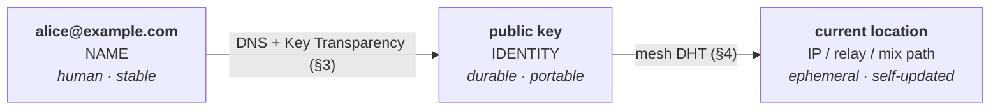
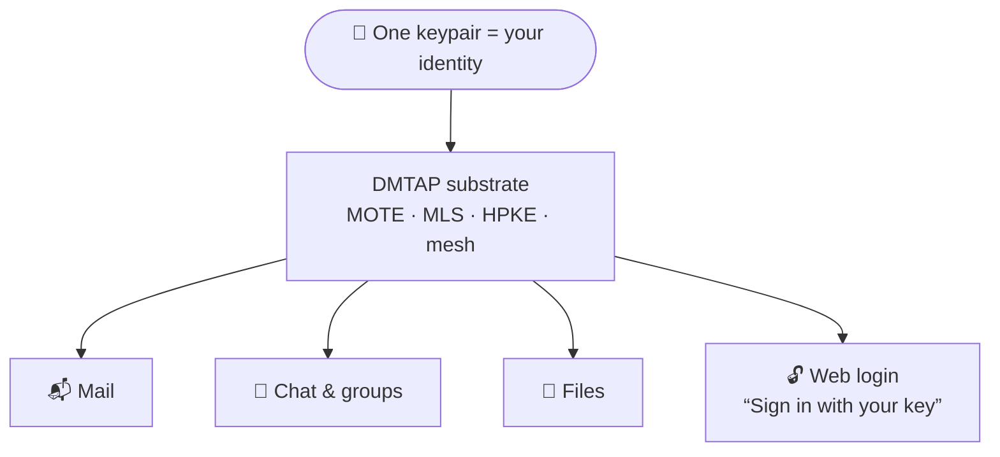
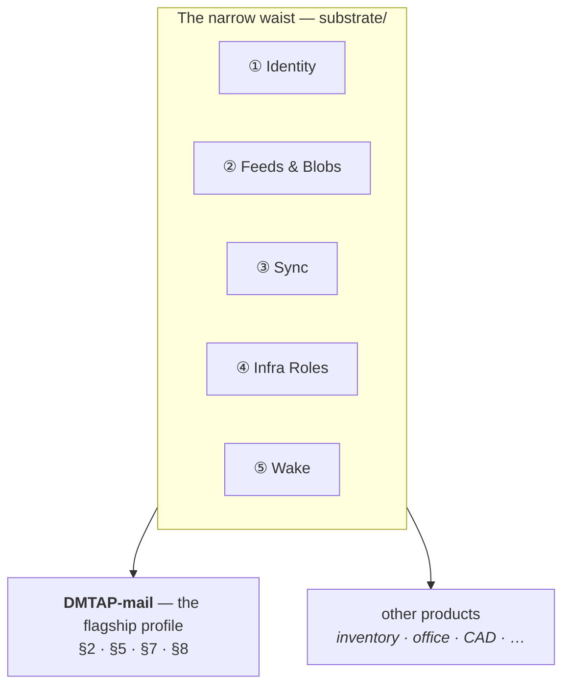
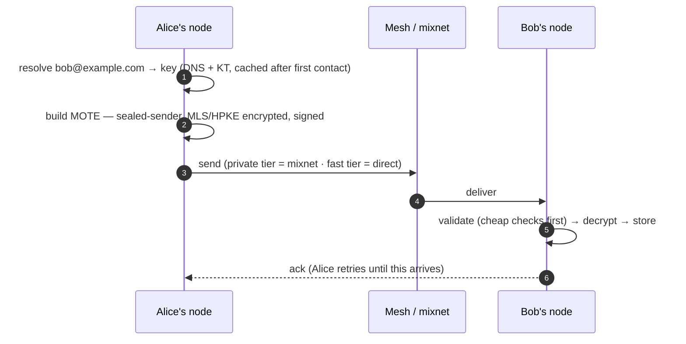
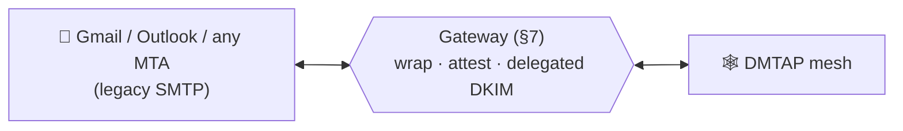

<div align="center">

# DMTAP

### Decentralized Message Transfer & Access Protocol

**Email, reimagined from the keypair up.** One open protocol for sovereign, end-to-end-encrypted,
metadata-private **mail · chat · files · identity** — over a peer-to-peer mesh, with an optional
bridge to the legacy email world so it works on day one.

*Your key is your identity. A name is just a pointer to it. No provider can lock you out.*

</div>

---

## The one idea

Classic email welds three things together that should never have been: **who you are** (an address
at a provider), **where your mail lives** (that provider's server), and **how you're reached** (their
IP). Lose the provider, lose everything.

DMTAP splits them into three independent layers, so an address is free of any server or IP:



- **Name → key** lives in DNS + a key-transparency log. It changes only when you *choose* to
  migrate names.
- **Key → location** lives in the mesh — a signed, self-refreshing record, so a node behind CGNAT
  or on a dynamic IP is still reachable *by its key*.
- **The key is the identity.** Contacts route to you by key and never need DNS again after first
  contact. A lost domain is a change of *name*, not of *identity*.

## One substrate, every mode

The same keypair and the same message object (a **MOTE** — signed, encrypted, content-addressed)
carry everything. The web-login use case is the same identity: the key that receives your mail
signs you into apps, with no central identity provider.



## The narrow waist: one substrate, many products — mail is the flagship

Five of DMTAP's capabilities turned out to be **general** — nothing about them is about mail. They form a
**narrow waist** that products beyond mail (inventory, office, CAD, and more) can adopt **à la carte**,
without reading a line of the mail spec. In this framing, **DMTAP-mail is the *first profile* built on the
waist**, not the whole protocol — it stands beside the other products, adopting all five capabilities and
adding the sealed, metadata-private message spine (§2, §5, §6) and the legacy bridge (§7) on top.

The strategy is deliberate: **monolithic messaging protocols (XMPP, Matrix) died of their mandatory
weight; tiny cores (HTTP, Nostr, AT Protocol) won by being small enough to adopt piecemeal.** The waist is
DMTAP's tiny core, pulled to the surface.



The five capabilities, and where each is specified:

| # | Capability | What it is | Substrate doc | Core home |
|---|------------|------------|---------------|-----------|
| ① | **Identity** | keypair = identity: Ed25519 `IK`, `DeviceCert`, `name→key` + KT, 8-word key-name floor | [`substrate/IDENTITY.md`](substrate/IDENTITY.md) | §1, §3 |
| ② | **Feeds & Blobs** | signed append-only author feeds + public content-addressed blobs, over plain HTTPS | [`substrate/FEEDS.md`](substrate/FEEDS.md) | §22 |
| ③ | **Sync** | signed multi-author CRDT op algebra + reconciliation + snapshots + sparse sync (**the one new spec**) | [`substrate/SYNC.md`](substrate/SYNC.md) | new; grounded in §5.6 |
| ④ | **Infra Roles** | open, key-addressed roles: announce/resolve, signaling, circuit relay, content-blind mailbox, cache/pin | [`substrate/ROLES.md`](substrate/ROLES.md) | §4, §14 |
| ⑤ | **Wake** | content-free, sender-blind push wake-signaling | [`substrate/ROLES.md § Wake`](substrate/ROLES.md#wake) | §4.9 |

Start at [`substrate/README.md`](substrate/README.md) for the waist model, the adoption rules (*a product
MAY adopt any subset; if it implements a capability's function it MUST speak that capability's spec*), and
the two litmus tests that keep the waist honest — the **flowstock test** (sync inventory by reading only
the waist docs) and the **HTTP test** (transports pluggable, HTTPS first-class). The substrate directory is
**additive**: it re-presents parts of §1–§24 as a standalone waist and cross-references them; it renumbers
and changes nothing in the numbered sections, which remain the normative source of truth.

## How a message moves

Messages are **sealed-sender** (intermediaries never see who sent them), **end-to-end encrypted**
(MLS/HPKE), and **signed**. The default tier routes through a **mixnet** so *who talks to whom* is
hidden from a global passive observer. Delivery is store-and-forward with durability at the edges
(the sender retries until an ack — no central queue).



## Works with the world you already have

Nobody switches to a network of zero users. DMTAP gets a real `you@provider` address on day one
and the **legacy gateway role** bridges to and from ordinary email — so you can mail Gmail
immediately, and adoption is incremental, never a flag day.

The gateway is **not a separate program and not a service class**: it is the same node binary run
with `--gateway` (§0.2), doing one job — legacy adaptation — and nothing else. It is not the
buffer, not the relay, not a mix, not a namer, and not a spam filter. **Two DMTAP users never need
one.** Its value shrinks in exact proportion to how many of your correspondents are still on
legacy mail, so it retires itself without anyone deciding to switch it off (§7.1c).



Running the gateway role needs one thing nothing else in DMTAP needs: a **public IP with reverse
DNS, unblocked outbound port 25, and a domain** (§7.1a). That is the *only* scarce resource in the
whole design — every other function (relaying, mixing, buffering, key-transparency logging,
rendezvous, bootstrap) is a role any node can take, needing nothing but a machine that is up. A
**payment method is not required, and DMTAP never implies one.**

Existing clients work too — through the **gateway**, not the node. The **node is native-only**:
it speaks **JMAP** (§8.1). The **gateway** speaks the legacy protocols — **IMAP / POP3 /
SMTP-submission / CalDAV / CardDAV** — with autodiscovery, so Apple Mail, Outlook, Thunderbird,
even old iPhones configure themselves (§7.15, §8.2). A gateway must decrypt to speak legacy, so a
non-private gateway can read that mail — run your own (private mode) for zero third parties; the
native JMAP path stays zero-access (§7.15.3).

---

## What you get

| Property | How |
|---|---|
| **Sovereign identity** | A keypair *you* own; no account with any provider required to *be* an identity (§1) |
| **Reachable without a static IP** | Reached by key via the mesh; works behind CGNAT / dynamic IP (§4) |
| **End-to-end encrypted** | MLS (RFC 9420) for all sessions/groups; HPKE (RFC 9180) for sealing (§2, §5) |
| **Metadata-private** | Sealed sender + mixnet + cover traffic vs a global *passive* adversary (§6) |
| **Continuity** | Redundant, rotatable recovery; migrate your human name without losing contacts (§1.4–1.6) |
| **Legacy-compatible** | **Gateway** bridges SMTP both directions and serves legacy clients (IMAP/POP/DAV); the node stays native (JMAP) (§7, §7.15, §8) |
| **Decentralized login** | The same key signs into apps — WebAuthn-bound, key-bound sessions, OIDC bridge (§13) |
| **Post-quantum ready** | Per-object algorithm agility; PQ suites (X-Wing / ML-KEM / ML-DSA) slot in with no name change (§1) |
| **Org & domain admin** | Own `@company.com` → provision users (sovereign *or* disclosed-managed), directory, groups, roles (§3.10) |

## Built by composing standards — not inventing crypto

The novelty is the *composition and transport*, not new primitives. DMTAP profiles proven work:

| Layer | Standard |
|---|---|
| Sessions & groups | **MLS** (RFC 9420) |
| Sealing | **HPKE** (RFC 9180), X25519 · ChaCha20-Poly1305 |
| Signatures / hashing | **Ed25519** (RFC 8032) · **BLAKE3** |
| Wire format | Deterministic **CBOR** (RFC 8949 §4.2), COSE/CWT-style integer keys |
| Client sync (node, native) | **JMAP** (8620/8621) |
| Legacy clients (gateway only) | IMAP4rev2 (9051) · POP3 (1939) · SMTP submission (6409) · CalDAV/CardDAV |
| Mesh transport | **libp2p** (Kademlia · Circuit Relay v2 · DCUtR) |
| Metadata privacy | **Sphinx / Loopix** mix format |
| Trust / anti-equivocation | **Key Transparency** (CONIKS / IETF keytrans style) |
| Anti-abuse | **Privacy Pass** anonymous tokens (RFC 9576–9578) |
| Login | **WebAuthn** · **OAuth/OIDC** · **DPoP** (RFC 9449) · **did:web** |
| Post-quantum | **ML-KEM / ML-DSA / SLH-DSA** (FIPS 203/204/205) · **X-Wing** hybrid KEM (an Independent-Submission draft, *not* a standard — §1.3) |

Genuine new ground is confined to exactly two places it's actually required: the `name→key→location`
composition itself, and mesh **epoch ordering** for MLS groups (the committer, §5.1) — everything
else points at an existing spec.

## Names: one identity, many pointers

The ladder is **key-name → chain name → DNS domain** (§3.13.2). Identity rests on DNS and
cryptography only — there is no DMTAP-run handle registry, because that would be a new authority
this protocol declines to create.

- **the key** — the real, durable identity underneath. Names point to it; it survives name changes
  and key rotation.
- **an 8-word key-name** — derived from your key. Free, unrevokable, needs no DNS, no chain, and no
  provider; also a *safety number* for verifying you hold the right key (à la Signal).
- **a chain name** (`alice.eth`, `alice.sol`) — optional, human-chosen, in an existing consensus
  namespace DMTAP merely reads. Paid once, revocable by nobody.
- **`name@domain`** — the everyday address (provider-issued like `you@provider.example`, or your own
  domain). Human, familiar, interoperates with legacy email; rests on a registrar and a renewal fee.

**Honest residual (§3.13.4):** there is **no free, human-shareable, user-owned name.** Key-names are
not the kind of thing you say across a table; domains and chain names cost money; and a free user's
shareable name ends up being a third-party gateway alias, which is **not portable**. DMTAP
guarantees you are always nameable, reachable, verifiable and deliverable-to with nothing but a
keypair — it does not pretend to have solved Zooko's triangle.

---

## Repository & project

This repo is the **protocol specification** — the neutral, open standard, and the source of truth.

| Piece | What | Where |
|---|---|---|
| **DMTAP** | The protocol (this repo) | open standard |
| **MOTE** | The message object (signed · encrypted · content-addressed) | §2 |
| **Implementations** | Independent implementations and apps | external — none required or endorsed here |

> DMTAP is an open standard in the way Matrix or JMAP are: implementations exist around it, but
> none is part of the standard and none is required to speak it. There is **no control plane, no
> vendor, and nothing sold** — people run the infrastructure roles because they want the network to
> exist (§12.4).

## The specification

Independent implementations MUST be buildable **from this text alone**, without reading the
reference code. Where the reference and the spec disagree, **the spec wins**. Byte-exact
[conformance vectors](conformance/) pin the wire format.

| # | File | Contents |
|---|------|----------|
| 0 | [`00-overview.md`](00-overview.md) | Architecture, components, data flows, threat-model summary |
| 1 | [`01-identity.md`](01-identity.md) | Keys, identity lifecycle, recovery policy + rotation, name migration |
| 2 | [`02-mote.md`](02-mote.md) | The MOTE object: format, hashing, signing, encryption, validation order |
| 3 | [`03-naming.md`](03-naming.md) | Names → keys: DNS, TOFU + pinning, key transparency (v0 + v1 federation), org/domain admin |
| 4 | [`04-transport.md`](04-transport.md) | Mesh (libp2p), mixnet, sealed sender, cover traffic, reachability, bulk transfer |
| 5 | [`05-messaging.md`](05-messaging.md) | MLS everywhere, 1:1/chat/groups/files, KeyPackage async join, the committer |
| 6 | [`06-privacy.md`](06-privacy.md) | Threat model, metadata-privacy guarantees, privacy tiers, honest limits |
| 7 | [`07-gateway.md`](07-gateway.md) | The legacy adapter **role**: what it requires to run, privilege separation, SMTP bridge (in/out, DKIM, attestation), legacy-client surfaces (IMAP/POP/DAV), legacy addressing, authorize-never-classify |
| 8 | [`08-clients.md`](08-clients.md) | Node native-only: JMAP is the node's only client surface; legacy client protocols are gateway-served (§7.15) |
| 9 | [`09-anti-abuse.md`](09-anti-abuse.md) | Anonymous rate-limit tokens, proof-of-work, postage, recipient policy |
| 10 | [`10-conformance.md`](10-conformance.md) | Versioning, capability negotiation, conformance levels, governance |
| 11 | [`11-grounding-and-references.md`](11-grounding-and-references.md) | Verified standards, corrections, honest limits, bibliography |
| 12 | [`12-operators.md`](12-operators.md) | Deployment shapes, the operator seam, the inviolable rule + the never-chargeable list, no control plane |
| 13 | [`13-identity-auth.md`](13-identity-auth.md) | DMTAP-Auth: sovereign web login (your key = your identity everywhere) |
| 14 | [`14-scaling.md`](14-scaling.md) | Device classes vs roles, horizontally-scalable gateway role, the n-of-m buffer, network status |
| 15 | [`15-references.md`](15-references.md) | Normative & informative references (the RFCs/specs DMTAP profiles) |
| 16 | [`16-parameters.md`](16-parameters.md) | Numeric parameters (v0): time/replay windows, KT/DHT, mixnet, file tiers, suites |
| 17 | [`17-parity.md`](17-parity.md) | Feature-parity audit: every legacy mail/calendar/contacts feature → DMTAP, sense-checked |
| 18 | [`18-wire-format.md`](18-wire-format.md) | **Appendix A** — Wire format: CDDL for every object, per-field semantics, signing preimages |
| 19 | [`19-operations.md`](19-operations.md) | **Appendix B** — Operations: every op (params/pre/post/errors) + worked traces; JMAP mapping |
| 20 | [`20-state-machines.md`](20-state-machines.md) | **Appendix C** — State machines: delivery, validation, resolution, group/committer, auth, node |
| 21 | [`21-errors-iana.md`](21-errors-iana.md) | **Appendix D** — Error/status registry + IANA registries + extension/versioning procedure |
| 22 | [`22-public-objects.md`](22-public-objects.md) | **DMTAP-PUB** (extension) — public signed announces, plaintext-addressed public blobs, author feeds, trustless serving |
| 23 | [`23-cad-artifact-profile.md`](23-cad-artifact-profile.md) | **CAD / artifact profile** over DMTAP-PUB — artifact metadata & licensing (SPDX), revisions/forks, assembly Merkle-DAG / BOM |
| 24 | [`24-video-profile.md`](24-video-profile.md) | **Video / media profile** over DMTAP-PUB (the vidmesh convergence path) — channels=feeds, VideoManifest + signed rendition derivations, comments/reactions/follows, HLS as serving-layer, optional live streaming |

A typeset PDF ([`dmtap.pdf`](dmtap.pdf)) is generated from these files.

**The substrate (the narrow waist).** The [`substrate/`](substrate/) directory re-presents five general
capabilities as a small, standalone waist that products beyond mail adopt à la carte — see *The narrow
waist* above. It is **additive**: it profiles and cross-references §1–§24 without renumbering or changing
them (the numbered sections govern the normative bytes).

| File | Capability | Contents |
|------|-----------|----------|
| [`substrate/README.md`](substrate/README.md) | — | The waist model: five capabilities, adoption rules, the flowstock & HTTP litmus tests, how mail is the first profile |
| [`substrate/IDENTITY.md`](substrate/IDENTITY.md) | ① Identity | Profile of §1/§3: `IK`, `DeviceCert`, `name→key` + KT, the 8-word key-name floor, for non-mail use |
| [`substrate/FEEDS.md`](substrate/FEEDS.md) | ② Feeds & Blobs | Standalone extraction of §22 DMTAP-PUB: signed author feeds + public blobs over plain HTTPS |
| [`substrate/SYNC.md`](substrate/SYNC.md) | ③ Sync | **The one new spec** — signed multi-author CRDT ops, version-vector + range-Merkle reconciliation, signed snapshots, sparse namespace sync |
| [`substrate/ROLES.md`](substrate/ROLES.md) | ④ Roles + ⑤ Wake | Infrastructure roles as an open key-addressed protocol + content-free wake (RFC 8030/8291/8292) |

**Conformance coverage (honest status).** The [`conformance/`](conformance/) catalog has **229
numbered cases** (SUITE.md ≡ suite.json). **52 are byte-runnable today** — 46 vectored cases
backed by known-answer vectors (**68 core vectors** in `vectors/vectors.json` + **15 DMTAP-PUB
vectors** in `vectors/pub_vectors.json`) plus 6 self-contained canonical-CBOR reject cases; **166
carry an exact construction recipe** and expected §21 error, pending vectors for subsystems not
yet byte-pinned (mixnet / MLS / gateway / auth and the wave-2/3 families, the wave-6 anti-drift
families `MIXPROF`/`FLEET`/`GUARD`/`LOC`/`FLOOR`/`FAILCLASS`/`GWROLE`, the gateway families
`GWOPS`/`GWSMTP`/`GWATT`/`GWNAME`/`GWFLOOR`/`GWLEG`, plus the profile-level `CAD`/`VIDEO`
checklists); and 11 are manual-attestation cases — the MUSTs with no wire bytes to
recompute at all (an in-product disclosure, a client's claim about a session or an address, a
process boundary, or the population a deployment serves), verified by implementer or
deployment review rather than by a runner (46 + 6 + 166 + 11 = 229). Every reject
case names one of the **144 codes** in the §21 registry. So the runnable ratio is **52/229 today**,
growing as each subsystem gains a fixed-input KAT.

## Building the PDF

The spec is plain Markdown → HTML → PDF via headless Chrome, with **highlight.js** syntax
highlighting and **mermaid** diagrams (no LaTeX):

```sh
cd build
npm install       # markdown-it, highlight.js, mermaid, puppeteer-core
npm run build     # → ../dmtap.pdf
```

It drives the Chrome already on the machine (`CHROME_PATH=…` to override); nothing is fetched at
render time. Diagrams are authored inline as ` ```mermaid ` fences, so they live in the same
Markdown a reader edits. See [`build/`](build/) for the script, cover metadata, and stylesheet.

---

## Conventions

RFC 2119 / RFC 8174 keywords (**MUST**, **SHOULD**, **MAY**, …) apply throughout.

- **Serialization** — deterministic CBOR (RFC 8949 §4.2), integer-keyed maps; JSON only at the JMAP
  client boundary.
- **Hashing** — BLAKE3-256 for content addressing (multihash-prefixed for agility).
- **Signatures** — Ed25519 (v0); every signed structure carries a negotiable `suite` id (§1).
- **Sealing** — HPKE (RFC 9180): X25519 + ChaCha20-Poly1305 (v0).
- **Sessions/groups** — MLS (RFC 9420); async init via MLS-native KeyPackages + external commits.
- Integers big-endian; timestamps are explicit unsigned-ms (no reliance on synchronized clocks for
  correctness — only ordering hints and expiry).

**Crypto-agility.** Unknown suites MUST be rejected, never guessed. PQ hybrids (X-Wing KEM,
ML-DSA signatures) are reserved and slot in per-object without changing any name or address.

## Honest limits (not hidden — see §6.6)

DMTAP states what it *cannot* do rather than overclaim:

- Strong metadata privacy targets a global **passive** adversary; a global **active** adversary with
  unlimited resources is bounded by the Anonymity Trilemma, not defeated.
- A first-contact MITM before key-transparency/out-of-band verification is possible; safety numbers
  and KT close it.
- Endpoint compromise is hardened (hardware-backed non-exportable keys, unlock-gated at-rest
  encryption, per-device sealing, fast revocation) down to one floor: a device **actively
  compromised while unlocked and in use** reads your plaintext (as on any system).
- The legacy-email leg is, by construction, plaintext at the far end — and a third-party gateway
  reads inbound legacy mail in the clear. Run the gateway role yourself where that matters.
- The default MLS path is signature-based (non-repudiable); an **optional deniable 1:1 mode**
  (Signal-style X3DH/PQXDH + Double Ratchet) gives cryptographic repudiation when you choose it.
- **The volunteer infrastructure may not materialise.** Mixes, KT logs, rendezvous nodes and
  buffers are roles participants take, not services anyone is paid to run. If too few take them,
  delivery degrades to the `fast` tier — still encrypted and authenticated, without default
  metadata privacy. Nothing here is silent: the degraded state is a named profile with no anonymity
  claim (§4.4.10a).
- **There is no free, human-shareable, user-owned name** (§3.13.4, above).

## Non-goals

- **Real-time voice/video** — different architecture (WebRTC/SFU); out of scope.
- **Blockchain / token** — DMTAP uses **no** chain and **no** cryptocurrency. Self-sovereign naming
  (§3.6) is the only place an optional name-chain backend is even offered.
- **Perfect anonymity against an omnipotent active adversary** — see honest limits above.

## License

The **specification** (this repository) is licensed **[CC BY 4.0](LICENSE.md)** — implement, quote,
translate, and build on it freely, with attribution. The **reference implementation** (a separate
repository) is dual-licensed **MIT OR Apache-2.0**. Both © VulOS.

The protocol is free for anyone to implement; no permission required, and there is no control
plane, licence server, or hosted component to talk to (§12.4).

---

<p align="center">
  <a href="https://vulos.org"></a><br>
  <sub><a href="https://vulos.org"><b>vulos</b></a> — open by design</sub>
</p>
