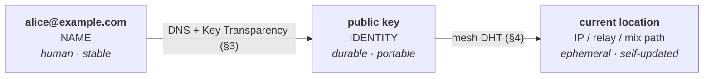
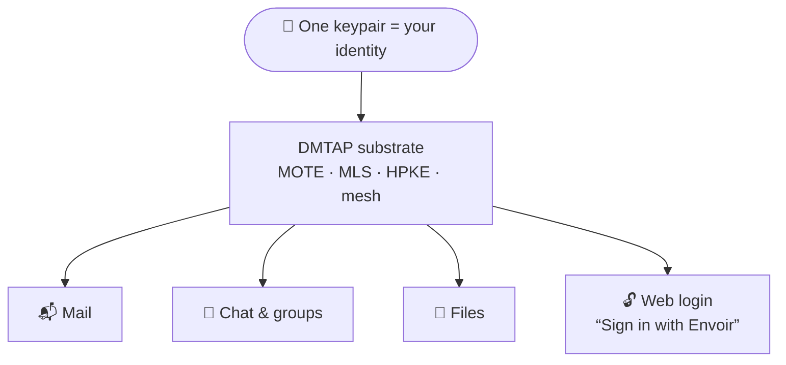
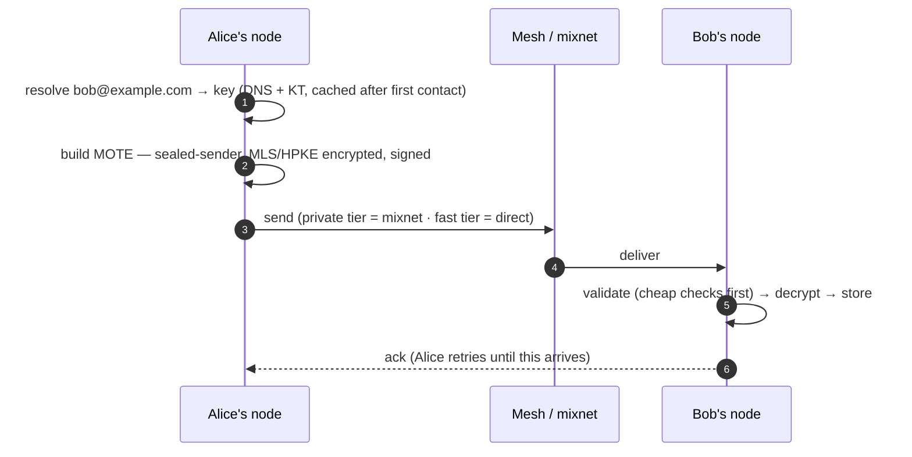
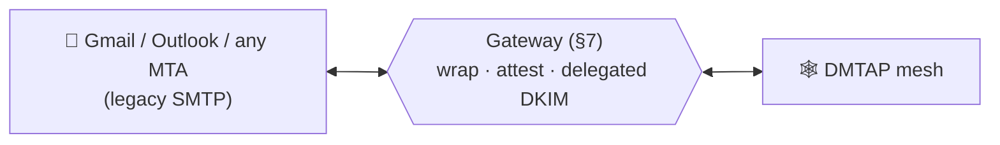

<div align="center">

# DMTAP

### Decentralized Message Transfer & Access Protocol

**Email, reimagined from the keypair up.** One open protocol for sovereign, end-to-end-encrypted,
metadata-private **mail · chat · files · identity** — over a peer-to-peer mesh, with an optional
bridge to the legacy email world so it works on day one.

*Your key is your identity. A name is just a pointer to it. No provider can lock you out.*

</div>

---

## The one idea

Classic email welds three things together that should never have been: **who you are** (an address
at a provider), **where your mail lives** (that provider's server), and **how you're reached** (their
IP). Lose the provider, lose everything.

DMTAP splits them into three independent layers, so an address is free of any server or IP:



- **Name → key** lives in DNS + a key-transparency log. It changes only when you *choose* to
  migrate names.
- **Key → location** lives in the mesh — a signed, self-refreshing record, so a node behind CGNAT
  or on a dynamic IP is still reachable *by its key*.
- **The key is the identity.** Contacts route to you by key and never need DNS again after first
  contact. A lost domain is a change of *name*, not of *identity*.

## One substrate, every mode

The same keypair and the same message object (a **MOTE** — signed, encrypted, content-addressed)
carry everything. The web-login use case is the same identity: the key that receives your mail
signs you into apps, with no central identity provider.



## How a message moves

Messages are **sealed-sender** (intermediaries never see who sent them), **end-to-end encrypted**
(MLS/HPKE), and **signed**. The default tier routes through a **mixnet** so *who talks to whom* is
hidden from a global passive observer. Delivery is store-and-forward with durability at the edges
(the sender retries until an ack — no central queue).



## Works with the world you already have

Nobody switches to a network of zero users. DMTAP gets a real `you@provider` address on day one
and a **legacy gateway** bridges to and from ordinary email — so you can mail Gmail immediately,
and adoption is incremental, never a flag day.



Existing clients work too: the node speaks **IMAP / SMTP-submission / POP3 / JMAP** with
autodiscovery, so Apple Mail, Outlook, Thunderbird, even old iPhones configure themselves (§8).

---

## What you get

| Property | How |
|---|---|
| **Sovereign identity** | A keypair *you* own; no account with any provider required to *be* an identity (§1) |
| **Reachable without a static IP** | Reached by key via the mesh; works behind CGNAT / dynamic IP (§4) |
| **End-to-end encrypted** | MLS (RFC 9420) for all sessions/groups; HPKE (RFC 9180) for sealing (§2, §5) |
| **Metadata-private** | Sealed sender + mixnet + cover traffic vs a global *passive* adversary (§6) |
| **Continuity** | Redundant, rotatable recovery; migrate your human name without losing contacts (§1.4–1.6) |
| **Legacy-compatible** | SMTP gateway + IMAP/JMAP client surface, both directions (§7, §8) |
| **Decentralized login** | The same key signs into apps — WebAuthn-bound, key-bound sessions, OIDC bridge (§13) |
| **Post-quantum ready** | Per-object algorithm agility; PQ suites (X-Wing / ML-KEM / ML-DSA) slot in with no name change (§1) |
| **Org & domain admin** | Own `@company.com` → provision users (sovereign *or* disclosed-managed), directory, groups, roles (§3.10) |

## Built by composing standards — not inventing crypto

The novelty is the *composition and transport*, not new primitives. DMTAP profiles proven work:

| Layer | Standard |
|---|---|
| Sessions & groups | **MLS** (RFC 9420) |
| Sealing | **HPKE** (RFC 9180), X25519 · ChaCha20-Poly1305 |
| Signatures / hashing | **Ed25519** (RFC 8032) · **BLAKE3** |
| Wire format | Deterministic **CBOR** (RFC 8949 §4.2), COSE/CWT-style integer keys |
| Client sync & legacy | **JMAP** (8620/8621) · IMAP4rev2 (9051) · SMTP submission (6409) · CalDAV/CardDAV |
| Mesh transport | **libp2p** (Kademlia · Circuit Relay v2 · DCUtR) |
| Metadata privacy | **Sphinx / Loopix** mix format |
| Trust / anti-equivocation | **Key Transparency** (CONIKS / IETF keytrans style) |
| Anti-abuse | **Privacy Pass** anonymous tokens (RFC 9576–9578) |
| Login | **WebAuthn** · **OAuth/OIDC** · **DPoP** (RFC 9449) · **did:web** |
| Post-quantum | **X-Wing** hybrid KEM · **ML-KEM / ML-DSA** (FIPS 203/204) |

Genuine new ground is confined to exactly two places it's actually required: the `name→key→location`
composition itself, and mesh **epoch ordering** for MLS groups (the committer, §5.1) — everything
else points at an existing spec.

## Names: one identity, many pointers

- **`name@domain`** — the everyday address (provider-issued like `you@envoir.org`, or your own
  domain). Human, familiar, interoperates with legacy email.
- **the key** — the real, durable identity underneath. Names point to it; it survives name changes
  and key rotation.
- **an 8-word phrase** — a *safety number* for verifying you hold the right key (à la Signal), **not**
  an address. Easy to read aloud; carries the key's full strength.

---

## Repository & project

This repo is the **protocol specification** — the neutral, open standard, and the source of truth.

| Piece | What | Where |
|---|---|---|
| **DMTAP** | The protocol (this repo) | open standard |
| **MOTE** | The message object (signed · encrypted · content-addressed) | §2 |
| **Envoir** | Reference implementation + apps (node, gateway, clients) | open source, MIT |
| **Envoir Cloud** | Optional hosted operator (a thin billing layer; never gates privacy) | private |

> DMTAP is to Envoir what Matrix is to Element, or JMAP is to Fastmail: an open standard with an
> independent reference implementation and an optional hosted service — none required to speak it.

## The specification

Independent implementations MUST be buildable **from this text alone**, without reading the
reference code. Where the reference and the spec disagree, **the spec wins**. Byte-exact
[conformance vectors](conformance/) pin the wire format.

| # | File | Contents |
|---|------|----------|
| 0 | [`00-overview.md`](00-overview.md) | Architecture, components, data flows, threat-model summary |
| 1 | [`01-identity.md`](01-identity.md) | Keys, identity lifecycle, recovery policy + rotation, name migration |
| 2 | [`02-mote.md`](02-mote.md) | The MOTE object: format, hashing, signing, encryption, validation order |
| 3 | [`03-naming.md`](03-naming.md) | Names → keys: DNS, TOFU + pinning, key transparency (v0 + v1 federation), org/domain admin |
| 4 | [`04-transport.md`](04-transport.md) | Mesh (libp2p), mixnet, sealed sender, cover traffic, reachability, bulk transfer |
| 5 | [`05-messaging.md`](05-messaging.md) | MLS everywhere, 1:1/chat/groups/files, KeyPackage async join, the committer |
| 6 | [`06-privacy.md`](06-privacy.md) | Threat model, metadata-privacy guarantees, privacy tiers, honest limits |
| 7 | [`07-gateway.md`](07-gateway.md) | Legacy SMTP bridge: inbound, outbound, DKIM delegation, attestation |
| 8 | [`08-clients.md`](08-clients.md) | JMAP native; IMAP / POP / SMTP-submission compatibility; autodiscovery |
| 9 | [`09-anti-abuse.md`](09-anti-abuse.md) | Anonymous rate-limit tokens, proof-of-work, postage, recipient policy |
| 10 | [`10-conformance.md`](10-conformance.md) | Versioning, capability negotiation, conformance levels, governance |
| 11 | [`11-grounding-and-references.md`](11-grounding-and-references.md) | Verified standards, corrections, honest limits, bibliography |
| 12 | [`12-operators.md`](12-operators.md) | Deployment modes, the operator seam, the inviolable rule, licensing model |
| 13 | [`13-identity-auth.md`](13-identity-auth.md) | DMTAP-Auth: sovereign web login (your key = your identity everywhere) |
| 14 | [`14-scaling.md`](14-scaling.md) | Node classes, horizontally-scalable gateways, relay/buffer scaling, hosted topology |
| 15 | [`15-references.md`](15-references.md) | Normative & informative references (the RFCs/specs DMTAP profiles) |
| 16 | [`16-parameters.md`](16-parameters.md) | Numeric parameters (v0): time/replay windows, KT/DHT, mixnet, file tiers, suites |
| 17 | [`17-parity.md`](17-parity.md) | Feature-parity audit: every legacy mail/calendar/contacts feature → DMTAP, sense-checked |
| 18 | [`18-wire-format.md`](18-wire-format.md) | **Appendix A** — Wire format: CDDL for every object, per-field semantics, signing preimages |
| 19 | [`19-operations.md`](19-operations.md) | **Appendix B** — Operations: every op (params/pre/post/errors) + worked traces; JMAP mapping |
| 20 | [`20-state-machines.md`](20-state-machines.md) | **Appendix C** — State machines: delivery, validation, resolution, group/committer, auth, node |
| 21 | [`21-errors-iana.md`](21-errors-iana.md) | **Appendix D** — Error/status registry + IANA registries + extension/versioning procedure |

A typeset PDF ([`dmtap.pdf`](dmtap.pdf)) is generated from these files.

## Building the PDF

The spec is plain Markdown → HTML → PDF via headless Chrome, with **highlight.js** syntax
highlighting and **mermaid** diagrams (no LaTeX):

```sh
cd build
npm install       # markdown-it, highlight.js, mermaid, puppeteer-core
npm run build     # → ../dmtap.pdf
```

It drives the Chrome already on the machine (`CHROME_PATH=…` to override); nothing is fetched at
render time. Diagrams are authored inline as ` ```mermaid ` fences, so they live in the same
Markdown a reader edits. See [`build/`](build/) for the script, cover metadata, and stylesheet.

---

## Conventions

RFC 2119 / RFC 8174 keywords (**MUST**, **SHOULD**, **MAY**, …) apply throughout.

- **Serialization** — deterministic CBOR (RFC 8949 §4.2), integer-keyed maps; JSON only at the JMAP
  client boundary.
- **Hashing** — BLAKE3-256 for content addressing (multihash-prefixed for agility).
- **Signatures** — Ed25519 (v0); every signed structure carries a negotiable `suite` id (§1).
- **Sealing** — HPKE (RFC 9180): X25519 + ChaCha20-Poly1305 (v0).
- **Sessions/groups** — MLS (RFC 9420); async init via MLS-native KeyPackages + external commits.
- Integers big-endian; timestamps are explicit unsigned-ms (no reliance on synchronized clocks for
  correctness — only ordering hints and expiry).

**Crypto-agility.** Unknown suites MUST be rejected, never guessed. PQ hybrids (X-Wing KEM,
ML-DSA signatures) are reserved and slot in per-object without changing any name or address.

## Honest limits (not hidden — see §6.6)

DMTAP states what it *cannot* do rather than overclaim:

- Strong metadata privacy targets a global **passive** adversary; a global **active** adversary with
  unlimited resources is bounded by the Anonymity Trilemma, not defeated.
- A first-contact MITM before key-transparency/out-of-band verification is possible; safety numbers
  and KT close it.
- Endpoint compromise is hardened (hardware-backed non-exportable keys, unlock-gated at-rest
  encryption, per-device sealing, fast revocation) down to one floor: a device **actively
  compromised while unlocked and in use** reads your plaintext (as on any system).
- The legacy-email leg is, by construction, plaintext at the far end.
- The default MLS path is signature-based (non-repudiable); an **optional deniable 1:1 mode**
  (Signal-style X3DH/PQXDH + Double Ratchet) gives cryptographic repudiation when you choose it.

## Non-goals

- **Real-time voice/video** — different architecture (WebRTC/SFU); out of scope.
- **Blockchain / token** — DMTAP uses **no** chain and **no** cryptocurrency. Self-sovereign naming
  (§3.6) is the only place an optional name-chain backend is even offered.
- **Perfect anonymity against an omnipotent active adversary** — see honest limits above.

## License

The specification is open (see the repository license). The Envoir reference implementation is
MIT-licensed. The protocol is free for anyone to implement; no permission required.
