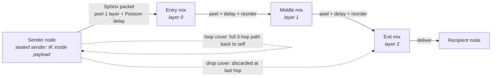

# Research: Mixnet (Sphinx/Loopix metadata-privacy mixing)

> **STATUS — NON-NORMATIVE / EXPERIMENTAL.** This document is quarantined research, not part of
> the KOTVA conformance surface ([DIRECTION §9](../../DIRECTION.md), [docs/research/README.md
> §5](README.md)). It is **not conformance-tested** and an implementation MAY ignore it entirely
> and still be a fully conformant KOTVA node. It is retained **verbatim**, in full, so that a
> future graduation of this layer back into the normative spec (`04-transport.md`) has a complete,
> unmodified starting point — nothing below was cut or summarised in the move.
>
> **Why it moved (2026-07 spec-perfection pass).** `04-transport.md §4.4` (this content) and
> `09-anti-abuse.md §9.4.1` ([docs/research/vdf.md](vdf.md)) previously read as normative,
> conformance-mandatory machinery. Neither has shipped, been formally audited, nor been measured
> against a real fleet — the "measured evidence" cited throughout below is a mechanism-model
> simulation (see the caveat repeated at every citation of it), not a production result, and no
> deployment of this shape has been run at scale (§4.4.2a's own "design bet, labelled as one"
> admission). Carrying that as MUST-level spec text overclaimed an assurance level the design does
> not yet have. See [THREAT-MODEL.md SEC-9](../../THREAT-MODEL.md) and
> [`04-transport.md §4.4`](../../04-transport.md) for the current normative status.
>
> **Current normative position (04-transport.md).** The transport-tier **default is now `fast`
> (direct, sealed-sender, E2E-encrypted delivery over the mesh/relays — no onion routing)**. The
> `private` tier described below — the Sphinx/Loopix mixnet — is **selectable, opt-in, and
> research-tier**: an implementation MAY offer it, a user MAY choose it, but no conformance vector
> requires it and no default guarantee depends on it. Metadata-privacy claims made *by default*
> (sealed sender vs. intermediaries) are stated honestly in
> [`06-privacy.md §6.1`](../../06-privacy.md); the stronger graph/timing-privacy-vs-a-global-passive-adversary
> claim this mechanism was built to support is demoted to research-tier alongside it (SP-3/SP-4,
> [`06-privacy.md §6.9`](../../06-privacy.md)).
>
> **What follows is the mixnet specification exactly as it read in the normative spec before this
> demotion** — the Sphinx packet format, the mix directory, path selection, key rotation, cover
> traffic, active-attack resistance, entry guards and operator/ASN diversity, the fail-closed
> no-downgrade rule, the High-security and Bootstrap profiles, the honest low-adoption model, and
> the post-quantum agility hook. Section numbers (`§4.4`–`§4.4.12`) and all cross-references
> **within this document** are preserved unchanged from the original `04-transport.md` so that (a)
> a future graduation can move this text back with a pure copy, and (b) any external reference to
> the old numbering (`§4.4.8`, `§4.4.10`, …) still resolves to the right subsection here, just in a
> different file. Cross-references that pointed to sections *outside* old §4.4 (e.g. `§6.2`,
> `§16.3`, `§9.8`) still point at those sections in their home documents, unchanged.

---

## 4.4 The mixnet (metadata privacy)

The `private` tier (the production default for all mail and every control MOTE, §4.6, §10.3) is a
**mixnet**: MOTEs travel as **Sphinx-format**, constant-length, onion-wrapped packets through a
sequence of **mix nodes**, mixed with Poisson delays and cover traffic in the **Loopix/Nym**
operational style. This section specifies it **normatively and by reference** — KOTVA does **not**
invent a mix format. It **profiles** two finalised designs and pins their parameters to §16.3:

- the **Sphinx** packet format (Danezis & Goldberg, *"Sphinx: A Compact and Provably Secure Mix
  Format,"* IEEE S&P 2009) for the on-wire onion packet (§4.4.1); and
- the **Loopix** anonymity system (Piotrowska et al., USENIX Security 2017) and its production
  descendant **Nym** for the operational design — stratified topology, Poisson mixing, loop/drop
  cover, and continuous-time mixing (§4.4.3, §4.4.5).

KOTVA's own contribution is confined to the **binding**: how mixes are discovered and keyed
against the existing DNS/KT trust (§4.4.2), how the tiers compose (§4.6, §10.3), and an honest
low-adoption model (§4.4.11), and the **anti-active-adversary hardening of §4.4.6–§4.4.10**
(replay caches, tagging resistance, Poisson mixing, loop-cover attack detection, entry guards +
operator-diversity, and fail-closed no-downgrade). Mix nodes are the same permissionless,
content-blind contributor
model as relays (the mix role is a capability of the node binary, §4); incentive and
Sybil-resistance are in §6.4 and §9.8. Email's asynchrony is what makes full-strength mixing
affordable: minutes of latency are acceptable for the `private` tier (§16.3).

Baseline guarantees (each detailed below): each mix peels exactly one layer so **no single mix
sees both sender and recipient**; mixes add **randomized (Poisson) delays** and reorder,
defeating timing correlation; nodes emit **loop + drop cover traffic** so an observer cannot tell
when real messages flow; **sealed sender** (§6.2) keeps the sender identity inside the payload,
never in the outer packet; and **size padding** to the bucket ladder (§4.4.1, §16.3) means the
*exact* length leaks nothing — an observer learns only which of the **two** size buckets (§4.4.1), i.e. at most one bit of size per message.

*One mix is drawn uniformly at random from each stratified layer (0→1→2); no single mix sees both
sender and recipient. Loop and drop cover traffic hide when real messages flow.*

### 4.4.1 Sphinx packet format (profiled; parameters pinned)

KOTVA uses the **Sphinx packet format** unchanged; this subsection states the profile a
conformant implementation MUST follow and pins every free parameter. A Sphinx packet is a
**fixed-length** structure `(α, β, γ, δ)`:

- **`α` — the header group element** (an elliptic-curve point). v0 uses **X25519 / Curve25519**
  (the KEM group of `suite = 0x01`, §16.7), so `α` is **32 bytes**. Each hop derives a shared
  secret by Diffie–Hellman between `α` and its **Sphinx mix public key** for the target epoch
  (§4.4.4), then **re-randomizes `α`** (multiplies by the derived blinding factor) before
  forwarding, so `α` is unlinkable hop-to-hop.
- **`β` — the encrypted routing information**, a fixed-length onion of per-hop routing commands
  (next-hop address, per-hop Poisson delay, and padding), each layer encrypted with a key derived
  from that hop's shared secret using a **stream cipher** (v0 ChaCha20, matching the suite AEAD
  primitive). `β` is padded so it stays **constant length at every hop** (this constant length is
  what makes Sphinx resistant to length-based tracing).
- **`γ` — the per-hop MAC** over `β`, a **Poly1305** tag (v0) keyed from the hop's shared secret;
  a hop that fails the MAC drops the packet (`ERR_MIX_PACKET_MALFORMED`, `0x0307`) — this is
  Sphinx's integrity guarantee against tagging attacks.
- **`δ` — the payload**, a **constant-length, padded body** transformed at each hop by a
  **wide-block pseudo-random permutation (PRP)** over the entire `δ` block — v0 pins **LIONESS**
  (Anderson–Biham, keyed from the hop's shared secret), exactly as classical Sphinx specifies —
  **not** a stream cipher, and **not** an "AEAD over `δ`". The wide-block property is
  **load-bearing for tagging resistance**: because a LIONESS block is a keyed permutation of the
  whole cell, **any** change to a single ciphertext bit of `δ` at one hop diffuses to the entire
  block on the next unwrap, so a corrupted payload becomes indistinguishable random noise and
  **cannot** be recognised downstream — the payload carries no adversary-recoverable structure to
  tag. (A stream-cipher or AEAD `δ` would be **XOR-affine/malleable**: a controlled bit-flip at
  entry would survive as a *correlatable* mark at the exit, defeating unlinkability. Sphinx's
  tagging resistance for the **payload** comes from this wide-block PRP, **not** from the header
  MAC `γ`, which protects only `β`.) v0 fixes `δ` to the **Sphinx cell size = 2 KiB** (§16.3), the
  constant-length bucket after padding.

**Pinned parameters (v0, §16.3):** path length **ν = 3 hops** (Standard) — but the header `β` is
**sized for the maximum supported path length `r_max = 5`** (the High-security hop count, §4.4.10)
and **zero-padded for shorter paths**, so a 3-hop and a 5-hop packet are **byte-for-byte the same
length** and the packet size **never leaks which profile** a sender uses. Also pinned: cell
payload **`δ` = 2 KiB**; per-hop delay **exp(mean 5 s)**; group **X25519**; **`β` stream cipher
ChaCha20**; per-hop header **MAC Poly1305** (over `β` only); **`δ` payload PRP LIONESS**
(wide-block, over the whole cell); KDF **BLAKE3** (suite hash). These are carried as capabilities
and are versioned with the protocol; a PQ variant is §4.4.12.

**The bucket ladder (reconciles §2.5 inline size with the 2 KiB cell).** A single Sphinx cell
carries **2 KiB** of payload, so a MOTE is not "one packet ≤ 64 KiB" — it is a **whole number of
2 KiB cells**. To keep size from leaking while still allowing multi-KiB inline/normal payloads
(§2.5, §6.5), a sender MUST pad the MOTE up to the next size on a **fixed bucket ladder** and then
fragment it into exactly `bucket / 2 KiB` Sphinx cells, all sent over independently-selected paths
(§4.4.3) and reassembled by the recipient. The v0 ladder (§16.3) is **{16 KiB, 64 KiB}** — i.e.
**8 or 32 cells**. A MOTE that would exceed the top inline rung is a `normal`/`large` file (§2.5)
and its bulk travels per §4.5, not as inline cells.

**Why two rungs, and why the floor is 16 KiB (normative rationale).** Both values are pinned in
§16.3, not arbitrary: the 16 KiB floor holds the minimum conformant PQ envelope under the required
suite `0x02` — two signatures, two public keys, and one X-Wing KEM encapsulation (§18.2) — with
real headroom (an 8 KiB floor cannot hold that envelope at all, and a third rung was rejected
because it would widen the observable size-channel the entry guard sees, §4.4.8, from 1 bit to
~1.58 bits per message). Anchor-signed objects (`Identity`, `DeviceCert`, `KeyRotation`,
`MoveRecord`, §1.2.0) ride the same ladder and land comfortably inside the 64 KiB top rung; they
need no special-case handling.

**Fragment reliability for multi-cell MOTEs (normative).** A MOTE padded to a top-of-ladder bucket
fragments into as many as **32 independently-pathed cells**, each with its own loss probability; a
naive all-or-nothing scheme would deliver a 32-cell MOTE with probability only `(1−p)^32` and force
a **full** re-onion-wrap (§20.1) on any single lost cell. KOTVA therefore REQUIRES **per-cell
reliability** so a multi-cell MOTE tolerates partial loss:

- The recipient maintains a **bounded partial-reassembly cache**, keyed by the cell's **`msg_id`**
  (the `SphinxFragmentHeader` field, §18.5.4) — **not** the envelope `id`, and this correction is
  itself normative: the envelope's content-addressed `id` is the BLAKE3-256 digest of the fully
  **reassembled** `ciphertext` (§2.2), so it does not exist and cannot be computed until
  reassembly completes — a cache keyed by it is unimplementable as an earlier revision of this
  subsection stated it. §18.5.4 already keys its own description of the cache by `msg_id`; this
  text now agrees with it. The cache holds received cells until the MOTE is complete or a
  **reassembly timeout** (§16.3) elapses; on timeout the partial set is discarded.
- **Cache is capped, per delivering connection (normative).** A node MUST bound, **per delivering
  connection/relay** (mirroring the per-connection PoW-verification budget of §9.4 and the
  per-connection mix-admission budget of §9.8): (a) the number of **distinct concurrently-open
  `msg_id` reassembly slots** it will hold cells for from that connection, and (b) the
  **aggregate bytes** buffered across them (both pinned in §16.3). A cell that would open a new
  slot beyond either cap is dropped **without allocating a slot** — the sender's own retry
  recovers it (§4.7) — which is what bounds the cheaper variant of the attack below: flooding many
  distinct `msg_id`s at `frag_count = 32` to pin reassembly memory now costs the recipient no more
  than a fixed, small, per-connection ceiling, not unbounded slots.
- **Reassembly failure feeds active-attack detection, not only a silent drop (normative).** A
  colliding `frag_index` within one `msg_id`, an out-of-range `frag_index`/`frag_count`, a
  cross-`msg_id` mixing, or a timeout with an incomplete set are each still dropped per-cell
  (`ERR_MIX_PACKET_MALFORMED`, `0x0307`, §19.3.1) — but an adversary who **injects** an extra
  colliding-index cell rather than dropping one is invisible to §4.4.7's loop-return-fraction
  detector, which is built to catch *suppression*, not *insertion*: the attacker adds a cell,
  reassembly yields corrupt bytes, the corrupt result drops silently, and nothing about that path
  looks like a dropped loop. A node MUST therefore additionally maintain a **sliding-window
  reassembly-failure counter** (collisions, out-of-range indices, cross-`msg_id` mixing, and
  cap-exceeded rejections — tracked separately from ordinary uncompleted-reassembly timeouts, which
  are consistent with benign loss) and feed an anomalous rate on it into the **same**
  `ERR_MIX_ACTIVE_ATTACK_SUSPECTED` (`0x030F`) inference and response as §4.4.7's loop-return check
  (rotate away from the implicated path + `HALT_ALERT` + fail-closed for `private`, never silent
  continuation) — this is a second, independent input to that inference, not a new one, covering
  the *insertion* half of active-path tampering the loop-return check alone cannot see. **The
  anomaly threshold and counting window are new §16.3 parameters, reported to the §16 owner
  alongside the two cache caps above; not fixed in this text.**
- Recovery of missing cells uses **one of** (sender's choice, capability-negotiated §10.2): **(i)
  per-cell SURB-ARQ** — the recipient returns, over a sender-supplied Single-Use Reply Block, a
  compact **still-missing-cell bitmap** for `id`, and the sender **re-onion-wraps and re-dispatches
  only the missing cells** (never identical bytes, per §4.4.6); or **(ii) forward error correction**
  — the sender ships `n > k` cells (an erasure code over the `k` payload cells) so the recipient
  reconstructs the MOTE from **any `k`** received, needing no return channel. FEC trades bandwidth
  for round-trips; SURB-ARQ trades round-trips for bandwidth. Either bounds delivery cost to the
  *lost fraction*, not the whole MOTE, and neither weakens tagging-resistance (each retransmitted or
  parity cell is an ordinary constant-length Sphinx cell).

**Acks and replies.** A delivery `ack` (§2.6) travels the mixnet as its own small `system` MOTE
(one cell); implementations MAY additionally use Sphinx **Single-Use Reply Blocks (SURBs)** so a
recipient can reply/ack without learning the sender's location, and SURBs are the mechanism for
recipient-side loop cover (§4.4.5) and the per-cell SURB-ARQ retransmit above.

### 4.4.2 Mix directory (discovery + keys, bound to DNS/KT)

Senders need the mix fleet's **identities, addresses, Sphinx public keys, and layers** to build
paths — KOTVA distributes them by **reusing DNS + key transparency**, not a new PKI:

- **`MixNodeDescriptor`** (§18.5.2) — each mix publishes a signed descriptor: its identity key
  `node_ik` (an ordinary KOTVA identity, so operators are accountable and KT-auditable), its
  reachability, its **Sphinx mix public key(s) per epoch** (§4.4.4), and its **stratified layer**
  (§4.4.3).
- **`MixDirectory`** (§18.5.3) — **a derived view, not an authority-signed artifact (normative).**
  Each mix publishes its own `MixNodeDescriptor` **directly into the key-transparency logs**
  (§3.5), where it is subject to the same inclusion proofs, gossip, and equivocation detection as
  any `name → key` binding. A client's directory for an epoch is then **computed locally**: it is
  the set of descriptors that (i) carry a valid self-signature under their own `node_ik`, (ii)
  carry a valid `_dmtap-mix` operator attestation (§4.4.8), (iii) name a current-epoch Sphinx key,
  and (iv) appear with a valid inclusion proof in a **`> n/2` quorum of the client's pinned KT log
  set** (§3.5.2(b)). A `MixDirectory` object MAY still be served by any node as a **cache** — a
  convenience bundle saving round-trips — but it is **never authoritative**: a client MUST be able
  to reconstruct the identical fleet view from the logs alone, and MUST NOT accept a served
  directory that contains a descriptor it cannot independently verify against its log quorum.

  **Why this replaces the directory authority.** A signed fleet snapshot makes its signer the most
  powerful party in the protocol: it chooses who is in the anonymity set, and — because path
  building fails closed without a fresh directory — its silence stops all `private`-tier mail
  everywhere. That is a single point of both **censorship** and **liveness** for the entire
  network, concentrated in one key, and no amount of threshold-holding or quorum-attesting removes
  the structural problem that clients must ask *someone specific* what the fleet is. Deriving the
  view instead removes the question: there is nothing to seize, nothing to freeze, and nothing to
  split-view beyond the KT logs, whose equivocation is already detected, attributed, and responded
  to by §3.5.2(d). This is the same discipline the specification already applies to author feeds
  in §22 — *indexes are derived, rebuildable, never authoritative* — applied to the one remaining
  place where KOTVA still had a network-wide authority.

  **Consequences elsewhere.** The freeze-attack defence below still applies, but its subject
  becomes **KT freshness** (§3.5.2(a)) rather than directory freshness — one mechanism instead of
  two. `ERR_MIX_DIRECTORY_SIG_INVALID` (`0x030B`) now applies only to a **cached** directory whose
  contents fail independent verification, never to the absence of an authority signature.

Because the fleet view is derived from KT, a **log** that shows different descriptor sets to
different clients (a split view over the mix set) is **detectable exactly like KT equivocation**
(`0x0107`, §3.5.2) — **but only to the same degree KT itself is, which depends on the KT profile in
force.** Under **v1-hardening KT** (log-type `0x02`, §3.5.2) such a split view is gossip-detected
and quorum-bounded like any equivocation; under **v0-minimal KT** (log-type `0x01`) a single,
non-gossiped log can present a split view that is only tamper-evident *after the fact* (§6.6 item
6), so mix-set equivocation is **deterred, not reliably detected**, in v0. Therefore, for
**high-risk** use while on v0, a client SHOULD (i) pin a **set of independently-operated logs and
require a `> n/2` quorum** (§3.5.2(b)) rather than derive its fleet from one log, and (ii)
**OOB-pin** the logs' keys (§3.4.1) rather than trust a single unaudited anchor. This is the mixnet
instance of the same v0/v1 caveat, and it compounds with the honest low-adoption disclosure
(§4.4.11): early on, few mixes and few logs are a concentrated trust point, disclosed as such. A
cache **indexes; it does not forge**: each `MixNodeDescriptor` self-verifies under its own
`node_ik`, so a hostile cache or log can withhold or reorder mixes (a denial/annoyance, detectable)
but cannot make a sender encrypt to a key an honest mix does not hold — the same "convenience
enumeration of independently-verifiable bindings" discipline as the GAL (§3.10.3). A **cached**
`MixDirectory` whose contents fail independent verification against the client's log quorum is
rejected (`ERR_MIX_DIRECTORY_SIG_INVALID`, `0x030B`); an older-or-equal `version` on a cache is
rejected (rollback defence); a derived view lacking a full stratified layer set makes path-building
fail (`ERR_MIX_PATH_UNBUILDABLE`, `0x030D`).

- **Freshness — freeze-attack defence (MUST).** Rollback defence (rejecting an
  *older-or-equal* `version`) stops an adversary *rewinding* a client, but it does **not** by
  itself stop an adversary *freezing* one: an on-path adversary (or a censoring cache) that
  simply **serves the last honest view forever** presents a validly-derivable, non-rolled-back
  snapshot while withholding every newer one. Left unbounded, a freeze pins the victim to a
  **stale fleet view** — it never learns of newly-joined, operator-diverse honest mixes (so its
  effective diversity and anonymity set stay artificially small and adversary-favourable) even
  though nothing it can see is *invalid*. This is the exact analogue of the KT **freeze attack**
  that STH freshness defends (§3.5.2(a), `0x0112`), and the derived fleet view — being computed
  from KT — inherits the same defence. A client therefore MUST treat a derived view (or a cached
  `MixDirectory`) older than the **mix-directory freshness window** (§16.3, ≤ one mix-key epoch)
  as **stale**, MUST refresh it before building any `private`-tier path, and MUST **fail closed**
  (§4.4.9 — hold, never downgrade) if it cannot obtain a fresh one — raising
  `ERR_MIX_DIRECTORY_STALE` (`0x0311`, FAIL_QUEUED per §10.7.0: a liveness failure delays mail, it
  does not reject it). Because each mix MUST publish a fresh current-epoch descriptor into KT
  (§4.4.2, §4.4.4), a freeze is **detectable**: the client's own log quorum shows no fresh
  descriptors within the window (a withholding signal, gossiped exactly as an unpublished KT entry
  is, §3.5.2(a)), and under v1-hardening KT it is attributable to the withholding log. This makes
  "withhold newer mixes" a **detected, fail-closed** event rather than a silent shrinking of the
  anonymity set — and note that with the directory authority removed (§4.4.2) there is no longer a
  single party whose silence achieves this network-wide; a freeze must now be mounted per-client or
  per-log. In v0, as with all KT, a single-log freeze is only tamper-evident-after-the-fact (§6.6
  item 6); the ≤-one-epoch key rotation (§4.4.4) still bounds the freeze window because a frozen
  view's keys expire and path-building then fails closed regardless.

### 4.4.2a The mix role is default-on for always-on public nodes (normative)

A mixnet with no mixes protects nobody, and KOTVA has no launching operator whose fleet the network
could borrow (§0.2, §12.4). Left as an opt-in, the mix role would face the standard collective-action
failure: everyone wants the anonymity set, nobody is individually obliged to enlarge it, and the
`private` tier — which §10.3 makes the production default for all mail — would be unbuildable at
exactly the moment a network is small enough for it to matter most. So the fleet must
**self-provision**:

- **A node that is always-on and has a public address MUST default to serving the mix role**, and
  MUST publish a `MixNodeDescriptor` (§4.4.2) accordingly. The operator MAY turn it off; the
  requirement is on the **default**, not on the operator's freedom.
- **Intermittent devices, battery- or metered-connection devices, and nodes without a public
  address MUST NOT default to it** — a mix that disappears mid-epoch degrades everyone's paths, and
  a phone paying for cover traffic is a bad trade for its owner and a poor mix for everyone else.
- **Cost.** A mix carries constant-rate Sphinx cells and per-hop delay queues: the cover-traffic
  floor is ≈ 5.6 MB/day (§16.3), and a mix's forwarding load is bounded by its own advertised
  capacity. For the device class this rule targets — mains-powered, unmetered, already holding the
  mailbox — the marginal cost is small and the marginal benefit is direct: the node's *own*
  `private`-tier mail becomes buildable.
- **Reciprocity is the whole argument.** A mix hides nothing from its own operator's adversary if
  it is the only mix; the anonymity set is the product being co-produced. This is the one place in
  the specification where the incentive to consume and the incentive to provide are literally the
  same incentive, and the default is set to match.

**Consequence for growth — a design bet, labelled as one.** Because the fleet is a function of
always-on public nodes rather than of anyone's budget, it *should* grow **in step with adoption**,
which is the schedule on which an anonymity set needs to grow and would make the Bootstrap →
Standard profile progression (§4.4.10) a matter of time rather than of funding. This is a
**prediction about volunteer behaviour, not a measured result**: no deployment of this shape has
been run at scale, the default-on rule is untested against real operator preferences, and if it
does not hold the `private` tier degrades as §11.3 discloses rather than failing quietly. The
Bootstrap profile (§4.4.10a) exists precisely so that being wrong about this is visible and
survivable instead of silent.

### 4.4.3 Path selection (3-hop stratified free-route)

- **Length: 3 hops** (§16.3) — entry, middle, exit — the Loopix/Nym choice: enough that no single
  mix links both ends, short enough to keep email-scale latency and bandwidth bounded (the
  anonymity ↔ latency/bandwidth tradeoff, §6.6 item 1).
- **Topology: stratified (layered), free-route within a layer.** The fleet is partitioned into
  **three layers** by `MixNodeDescriptor.layer` (0=entry/1=middle/2=exit); a path is built by
  drawing **one mix from each layer in order** — **layer 0 from the sender's active entry guards
  (§4.4.8), NOT uniformly at random**, and layers 1..n−1 uniformly at random within the layer,
  weighted by advertised
  capacity/reputation (§9.8). Rationale: a stratified topology (as analysed for Loopix and
  deployed by Nym) gives a **well-defined anonymity-set analysis and predictable mixing** and
  spreads load evenly, versus an unconstrained free route whose anonymity is harder to reason
  about and whose load concentrates on popular nodes. Layer assignment is part of the directory,
  so all senders draw from the same partition.
- **Fresh path per packet — for the MIDDLE and EXIT hops only.** A sender MUST select an
  **independent** middle and exit for **each Sphinx cell**
  (including the cells of a multi-cell MOTE, §4.4.1, and each cover packet, §4.4.5); no persistent
  middle/exit circuit exists to correlate.
  **The entry is deliberately NOT fresh, and the two rules are not in tension.** An earlier
  revision of this section said a path is built by drawing uniformly at random from *each* layer
  and that every cell gets a fully independent path — which directly contradicted §4.4.8's
  `MUST NOT choose a fresh entry mix per packet` and, followed literally, destroyed the very bound
  guards exist to provide: a fresh entry per cell means a 64 KiB MOTE draws **32 independent
  entries**, so an adversary holding a fraction *f* of entry mixes lands on *some* of a victim's
  paths almost immediately and the `(1−f)^G` one-time-draw bound collapses into cumulative
  certainty (§4.4.8, §6.6 item 1). Freshness at the **middle and exit** is what prevents circuit
  correlation; persistence at the **entry** is what bounds long-term intersection. They defend
  different attacks and neither substitutes for the other.

### 4.4.4 Mix key rotation & epochs

- **Mix-key epochs.** Mix keys are scoped to the **mix-key epoch** (§0.8 — distinct from an MLS
  group epoch); the v0 mix-key epoch is **24 h** (a §16.3 parameter). The `MixDirectory.epoch`
  names the current epoch and each `MixKeyEntry` (§18.5.2) binds a Sphinx mix public key to an
  epoch and a `valid_until`.
- **Rotation with overlap.** A mix MUST generate a fresh Sphinx keypair each epoch and SHOULD
  advertise **both the current and the next** epoch key (an overlap window) so senders can
  pre-build paths across an epoch boundary without a gap. Old epoch private keys are **deleted at
  `valid_until`**, giving the mixnet **forward secrecy against later node compromise** (a seized
  mix cannot retroactively peel captured old packets).
- **Sender obligation.** A sender MUST encrypt each hop to the mix key of the **epoch that hop
  will process the packet in**, and MUST NOT build to an expired epoch key; a packet built to an
  expired/rotated key is dropped by the mix (`ERR_MIX_DESCRIPTOR_STALE`, `0x030C`). Clients
  refresh the `MixDirectory` at least once per epoch.

### 4.4.5 Cover traffic & Loopix loops (normative)

Cover traffic is **load-bearing, not optional** (§6.2, §6.4). Every `private`-tier node MUST emit,
independently of user activity, two Poisson streams (rate per §16.3, default mean 30 s/msg,
tunable — higher rate = more privacy, more bandwidth):

- **Loop cover** — a packet the node sends **through a full 3-hop path back to itself** (via a
  SURB, §4.4.1) at Poisson rate **λ_loop** (§16.3). Loops (a) give the node a steady *sending*
  stream indistinguishable from real traffic, and (b) act as **active-attack detection**: a node
  that stops receiving its own loops at the expected rate has evidence its traffic is being
  dropped/delayed (an `(n-1)`/flooding attack). The **full detection rule, threshold, and
  fail-closed response are normative in §4.4.7** — loops are the key lever that makes active
  attacks detectable-and-responded rather than silent.
- **Drop cover** — a packet addressed to a **random mix that discards it at the last hop**,
  providing link cover on the entry segment.
- **Recipient-side loop cover (normative, §6.4).** An always-on recipient node MUST **also**
  receive a steady loop-cover stream so that **real receipts are indistinguishable from cover** on
  its delivery link — closing the receipt-timing exposure of §6.4 item 2. Without this, an
  observer of the recipient's link learns *when* mail arrives even though it cannot read it.

**Constant-rate cover is the default for always-on nodes (normative).** The two cover regimes are
not merely different settings — they defend against different adversaries, and the stronger one is
free for exactly the device class that holds the mailbox (§14.1):

- **Poisson cover** (mean 30 s/msg) *blurs* the relationship between user activity and traffic. A
  short observation cannot distinguish real from cover, but the envelope still **correlates with
  activity**, so an adversary who records for a long enough window can recover activity patterns
  statistically.
- **Constant-rate cover** emits on a fixed schedule **independently of activity**. The traffic
  envelope is flat and yields *nothing* to traffic analysis, no matter how long the observation.
  Against an adversary whose advantage is patience and storage, this is the difference between
  "eventually solvable" and "information-theoretically empty."

Because an always-on node (§14.1) is mains-powered and on an unmetered link, the cost is
negligible: at one 2 KiB cell per 30 s, constant-rate cover is **≈ 5.6 MB/day**. A conformant
**always-on** node therefore MUST emit **constant-rate** cover for the `private` tier; Poisson
cover remains permitted **only** for battery- or metered-constrained devices (phones, laptops,
§14.1 intermittent class), where the tradeoff is real. Previously this was reserved to the
High-security profile (§4.4.10); it is promoted to the default because the class of node that
holds durable state can afford it, and a defence that is free for the node that matters should
not be an opt-in.

Mixing delay is applied **per hop**: each mix independently holds each packet an exp(mean 5 s,
§16.3) time drawn from the per-hop delay command in `β` (§4.4.1) and forwards in re-randomized
order (continuous-time Poisson mixing, as Loopix specifies), so input and output streams cannot be
timing-correlated. Cover-packet admission is rate-bounded per node (§9.8) so cover cannot be
turned into a flooding vector.

### 4.4.6 Active-attack resistance: replay, tagging, unlinkability, Poisson mixing (normative)

These are the concrete mechanisms that make a **global *active* adversary** (inject/drop/delay,
§6.1) expensive and, where it acts, **detectable** — not an "honest limit," a defence. Each is
profiled from Sphinx/Loopix, made mandatory here.

- **Per-epoch replay cache at every mix (MUST).** Each mix MUST maintain a **replay cache** of the
  Sphinx per-hop **tag** — the value `H(shared_secret)` derived when it peels a packet (a unique,
  unlinkable-across-hops identifier) — for **every packet it has processed in the current mix-key
  epoch** (§4.4.4), and MUST **drop any packet whose tag is already present**
  (`ERR_MIX_REPLAY_DETECTED`, `0x030E`, DROP_SILENT). Because mix keys rotate per epoch and the old
  private key is **deleted at `valid_until`**, a captured packet is replayable only while the key
  it was built to is still usable. The cache MUST therefore cover the **entire lifetime of every
  mix key currently usable at that node — the current epoch AND the overlap window of the next
  epoch's pre-published key (§4.4.4), plus the clock-skew window** (§16.3) — and a per-key cache
  entry may be dropped only once **that** key's `valid_until` has passed. A **hard flush at the
  epoch boundary is forbidden**: because a mix advertises current+next keys so senders can
  pre-build across the boundary, a packet built to a still-valid key must remain replay-protected
  until that specific key expires, not until the nominal epoch ticks over. This stays bounded
  memory (two epochs at most, no permanent log). This is the primary defence against **replay-based
  correlation and (n−1) replay flooding**: an adversary cannot re-inject a target's packet to trace
  it, because the second copy is dropped at the first honest hop. **Corollary for the sender's own
  retries:** because an identical `private` packet would be dropped here as a replay, a `private`
  MOTE that must be retried MUST be **re-onion-wrapped** (fresh paths/`α`/epoch keys, stable
  envelope `id`) rather than re-dispatched byte-for-byte — see the delivery state machine, §20.1;
  only the `fast` tier (no per-hop tag) may resend identical bytes.
- **Tagging-attack resistance (MUST) — header AND payload.** Two distinct mechanisms, one per
  packet part, and both are required: **(header)** each hop verifies the per-hop **MAC `γ` over
  `β`** before any processing (§4.4.1); any adversarial bit-flip of the routing header fails the
  MAC and the packet is dropped (`0x0307`). **(payload)** `δ` is transformed by a **wide-block PRP
  (LIONESS)** at every hop (§4.4.1), so any bit-flip of the payload diffuses across the **entire
  cell** on the next unwrap and becomes unrecognisable random noise downstream — the payload
  carries no malleable, correlatable structure to mark. The header MAC alone does **not** protect
  `δ`; the wide-block PRP is what makes **payload** tagging fail. Together an active adversary
  **cannot mark ("tag") a packet at the entry and recognise the mark at the exit** on either part
  — Sphinx's provable integrity guarantee, and the reason KOTVA uses Sphinx (with a wide-block
  payload) rather than a plain stream-cipher/AEAD layered-encryption onion.
- **Bitwise unlinkability (inherent).** `α` is re-randomised and `β`/`δ` fully re-encrypted at
  every hop (§4.4.1), so a mix's input and output packets share **no correlatable bits**. An
  adversary observing both sides of an honest mix is reduced to **timing** correlation only, which
  the next mechanism defeats.
- **Poisson (exponential, memoryless) mixing (MUST).** Each hop delays each packet by an
  **independent exponential** delay (mean per §16.3), never a fixed or bounded delay. By the
  memoryless property, a packet's **output time is independent of its input time** given the
  exponential hold, so even an adversary that **injects or selectively delays** input cannot use
  inter-arrival timing to correlate a mix's input and output streams (continuous-time mixing, as
  Loopix specifies). Fixed or uniform delays would leak ordering; the exponential distribution is
  **required**, not a tuning choice.

### 4.4.7 Loop cover as active-attack detection & fail-closed response (normative) — the key lever

Cover traffic (§4.4.5) is not only obfuscation: **loop cover is an active-attack *detector***, the
mechanism that converts drop/delay/flooding attacks from **undetectable** to
**detected-and-responded**. This is the single most important lever against an active adversary.

- **Client loops and mix loops (MUST).** Every `private`-tier node emits **client loops** — a
  Sphinx packet sent through a **full 3-hop path back to itself** via a Single-Use Reply Block
  (SURB, §4.4.1) — at Poisson rate **λ_loop** (§16.3); every mix likewise emits **mix loops**
  through the layers back to itself. A node knows exactly which loops it launched, over which
  paths, and the delay budget within which each should return.
- **Detection rule (MUST).** A node MUST track, over a sliding window, the **fraction of its loops
  that return within their expected delay budget** and their **latency distribution**. If the
  return fraction drops below the **loop-loss threshold** (§16.3) or latencies inflate beyond what
  the exponential budget explains, the node MUST **infer an active drop/delay attack on its paths**
  and raise `ERR_MIX_ACTIVE_ATTACK_SUSPECTED` (`0x030F`). Because loops are **Sphinx packets
  indistinguishable from real traffic** on the same paths, an adversary **cannot** selectively
  drop real messages while sparing loops — suppressing traffic on a path necessarily suppresses
  that path's loops, which is exactly what the node measures.
- **Response — rotate, alert, and FAIL CLOSED (MUST; never silently continue).** On an inferred
  active attack the node MUST: (1) **rotate away** from the implicated mixes and **entry guards**
  (§4.4.8) and rebuild over alternate, operator-diverse paths; (2) raise a **`HALT_ALERT`**
  (§21.2) to the user — the private tier is under active attack; and (3) **fail closed for the
  `private` tier** — it MUST NOT silently fall back to `fast` or to a shorter/less-diverse path to
  "get the message through" (that is precisely the adversary's goal, §4.4.9). Silent continuation
  under detected active attack is prohibited.
- **(n−1) / flooding defence (MUST).** To isolate a target packet an adversary must flush all
  other traffic from a mix (the classic n−1 attack). The **steady loop + drop cover from every
  honest node** (§4.4.5) means a mix is **never empty of indistinguishable cover**, so the
  adversary must inject vastly more traffic to dominate a mix (raising cost sharply), and the
  honest nodes whose loops then fail to return **detect** the flush (above). Cover admission is
  **rate-bounded per node** (§9.8) so cover itself cannot be turned into the flood. Loops thus both
  **raise the cost** of and **expose** flooding.
- **A second, independent input: reassembly-failure anomaly rate (MUST, §4.4.1).** The loop-return
  check above is built to catch *suppression* (drop/delay); it does not fire when a hostile exit
  mix instead **injects** an extra, colliding-`frag_index` cell into a multi-cell MOTE, corrupting
  reassembly without dropping a single loop. The **sliding-window reassembly-failure counter**
  (§4.4.1's cache-cap rule) feeds the identical `ERR_MIX_ACTIVE_ATTACK_SUSPECTED` (`0x030F`)
  inference and the same rotate + `HALT_ALERT` + fail-closed response as an anomalous loop-return
  fraction — this is the detector's *insertion*-side counterpart, not a separate mechanism.

### 4.4.8 Entry guards, operator diversity & mix Sybil resistance (normative)

Long-term **statistical-disclosure / intersection** attacks — an adversary who controls some mixes
correlating a persistent user across many messages — are bounded **structurally**, not merely
disclosed.

- **Entry guards (MUST).** A sender MUST NOT choose a fresh entry mix per packet; instead it pins a
  **small, rotating entry-guard set** of **G = 2** entry-layer mixes (§16.3), reuses them across
  packets, and rotates only every **guard-rotation period** (§16.3, default **30 days**) —
  Tor-style. Rationale: with a fresh random entry per packet, an adversary owning a fraction *f* of
  entry mixes appears on *some* of a victim's paths eventually and, across many messages, mounts an
  intersection attack; pinning guards means the victim is **either persistently clear of the
  adversary's entries (probability ≈ (1−f)^G) or persistently on a known guard** — bounding
  long-term exposure to a one-time draw instead of a cumulative certainty (§6.6, §11.3).

  **Guards MUST be drawn from a persistent sampled set, not redrawn independently (normative) —
  and this rule is what makes the bound above true.** Naive guard *rotation* silently destroys the
  very property guards exist to provide. If each rotation draws fresh guards uniformly from the
  fleet, then over a node's lifetime the draws are **independent and repeated**, and the
  probability of never touching an adversarial guard is not `(1−f)^G` but `(1−f)^(G·r)` for `r`
  rotations. At the §16.3 defaults — `G = 2`, 30-day rotation — a decade is `r ≈ 122`, so even a
  modest `f = 0.05` gives `0.95^244 ≈ 0.0000003`: the "one-time draw" bound has quietly become a
  near-certainty of eventual exposure, and the guard mechanism has bought nothing against a
  patient adversary. This is not hypothetical; it is the failure Tor identified and fixed in its
  guard specification (proposal 271, §15).

  A conformant node therefore maintains a **persistent sampled set** — a larger set of candidate
  entry mixes (the **guard sample**, §16.3) chosen **once**, weighted by capacity and constrained
  by the operator- and ASN-diversity rules below — and draws its `G` active guards **only from
  within that sample**. Rotation moves the active guards *inside* the sample; it does **not**
  re-sample from the fleet. The sample is refreshed only when it is exhausted by nodes going
  permanently offline, or when the owner explicitly re-samples (a disclosed exposure event).
  Long-run exposure is then bounded by the **initial sample** — a single draw — exactly as the
  `(1−f)^G` analysis claims, rather than growing without limit in the number of rotations.
  **Why G = 2 (not Tor's single primary guard) — pinned (normative).** Tor pins **one** primary
  guard (with sampled backups) to *minimise* the chance of ever touching an adversarial guard;
  KOTVA pins **two** because a mail node's entry mix is also its **cover-loop origin** and
  reachability anchor, and a single guard is a single availability/rotation point whose outage
  would either stall the node or force an unplanned re-draw (itself an exposure event). G = 2
  trades a marginally higher one-time draw probability (`1−(1−f)²` vs `1−(1−f)¹` of touching *an*
  adversarial entry) for resilience and steadier cover, while still bounding the *long-term*
  intersection to that one-time draw. `G = 2`, sample 20 (§16.3) is the conformant guard scheme;
  the invariant is *persistent* (not per-packet-fresh) entry selection.
  **Disclosed guard observation (NIT).** A pinned entry guard, if adversarial, **necessarily sees**
  each of the sender's packets it carries — including the **bucket size** (which of the {16, 64}
  KiB rungs, i.e. the exact **cell count**, §4.4.1, §16.3) and the **send time**. This is inherent to
  being the first hop and is **not** hidden by the mixnet (padding hides *true* length, not which
  *rung*; cover traffic blurs *rate*, not that *this guard* is used). Constant-rate cover
  (High-security, §4.4.10) is the mitigation that most flattens the send-time signal; the residual
  — an adversarial guard learns "this sender sent a bucket-*k* message now" — is a disclosed
  boundary, bounded (not eliminated) by guards being few and rotated.
- **Operator diversity in path selection (MUST) — and only *attested* operators count.** A 3-hop
  path MUST traverse mixes under **three disjoint operators** — no two hops may share a
  `MixNodeDescriptor.operator` (§18.5.2) — mirroring the disjoint-operator discipline of KT log
  sets (§3.5.2(b)) and S/Kademlia disjoint paths (§4.2). **Crucially, a mix contributes a distinct
  operator to this rule *only* if its `operator` claim is backed by a valid `_dmtap-mix` operator
  attestation** under that operator's domain (below). A mix whose `operator` is **absent** or
  **un-attested** MUST **NOT** be treated as its own separate operator for diversity purposes — it
  is either excluded from path selection or counted as an **unknown/shared** operator, never as
  fresh diversity. This is essential: if an absent/self-asserted `operator` counted as diverse, a
  **single** adversary could publish *N* mixes each self-claiming a different operator and defeat
  the whole rule — collapsing the ≈ *a*² fully-compromised-path bound back to ≈ *a* (one adversary
  faking *N* operators). Requiring attestation to count keeps the bound at ≈ *a*² for an adversary
  operating a fraction *a* of the **attested-diverse** fleet, and denies any single operator a
  whole-path view. (While the fleet is single-operator at launch, diversity is necessarily relaxed
  to that operator and **disclosed** per §4.4.11; the rule binds as independent, *attested*
  operators join.)
- **Mix Sybil resistance — attested identity, NO anonymous token (MUST).** Mix admission MUST NOT
  use an anonymous token (that would let one party mint unlimited Sybil mixes). A mix's `node_ik`
  is a **KT-auditable KOTVA identity** (§4.4.2), and its **operator control MUST be attested by a
  DNS/KT record under the operator's domain** — a `_dmtap-mix` attestation directly analogous to
  the gateway attestation `_dmtap-gw` (§7.2a) — so every mix is bound to an **accountable,
  rate-limited real-world operator**. Admission is **not** granted by any authority: because the
  fleet view is *derived* (§4.4.2), a client admits a mix into its own path-selection set exactly
  when that mix's descriptor self-verifies, carries a valid `_dmtap-mix` attestation, names a
  current-epoch key, and appears in a quorum of the client's pinned KT logs — so an unattested mix
  is simply never selected by anyone, rather than being refused entry by a gatekeeper.
  Per the operator-diversity rule above, an **un-attested `operator` claim confers no
  diversity** (a mix counts as a distinct operator toward the disjoint-operator requirement **iff**
  its `_dmtap-mix` attestation validates), which is what stops one adversary minting *N* fake
  operators to defeat the a² bound.
- **ASN and jurisdiction diversity (MUST / SHOULD) — the constraint money cannot cheaply buy.**
  Operator attestation binds a mix to an accountable domain, but a **domain is cheap**: an
  adversary with a modest budget registers fifty domains, publishes fifty `_dmtap-mix`
  attestations, and satisfies the operator-diversity rule above while running every one of those
  mixes on rented capacity in a single datacenter. Attestation proves *accountability*, not
  *independence*. A conformant path therefore MUST additionally traverse mixes under **disjoint
  announced BGP origin ASNs**, and SHOULD traverse **disjoint legal jurisdictions**.

  ASN is the right granularity because it is the one property of a rented fleet the renter cannot
  cheaply diversify: commodity capacity concentrates in a small number of hosting ASNs, so
  requiring three ASN-disjoint hops forces a Sybil adversary to procure capacity across genuinely
  independent networks — a materially higher cost than buying domains, and one that scales with
  the diversity requirement rather than being a fixed entry fee. Jurisdiction-disjointness targets
  the adjacent threat that attestation also fails to address: a single legal order compelling
  several nominally-independent operators at once. Both constraints are evaluated over the
  **attested** operator set, and both compose with — never replace — the operator-diversity rule.

  Path selection **weights mixes by measured reliability/reputation**.

  **On stake and slashing (normative — deliberately NOT specified).** Earlier drafts of this
  section, and §9.6, proposed that operators post a bond that is **slashed** on proven
  misbehavior. KOTVA **does not specify** such a mechanism, and an implementation MUST NOT present
  one as a protocol guarantee. The reason is that a slashing scheme requires an escrow that holds
  the bond and an **adjudicator** empowered to seize it — and any party with that power is a
  central authority with more leverage over the network than anything else in this document,
  reintroduced at exactly the layer the design works hardest to keep authority-free. There is no
  neutral, decentralised adjudicator available that does not itself become the thing to capture.
  An *unspecified* stake requirement is strictly worse than none, because it advertises a
  deterrent that does not exist. KOTVA therefore relies on the three mechanisms that need no
  adjudicator: **attested operator identity** (accountability), **ASN/jurisdiction diversity**
  (structural independence), and **measured reputation** (a misbehaving mix loses path share
  automatically under any conforming weighting, §9.8). Deployments that additionally want a bond
  may run one as **operator policy**, out of scope here. **The exact weight
  function is an implementation choice, not pinned (NIT):** the "measurement hook" is a concrete
  input — each node's loop-return statistics (§4.4.7) feed a reliability score (§9.8) that
  **down-weights mixes that drop or delay** — but the mapping from score to selection probability
  is left to the implementation, so the path distribution is **non-deterministic across
  implementations**; only the hard constraints (one-per-layer, ≥ the in-force profile's disjoint
  **attested** operators, current-epoch keys) are normative. A misbehaving or Sybil mix loses path
  share under any conforming weighting.

### 4.4.9 Fail-closed: minimum viable path, no silent downgrade (normative)

A global active adversary can **DoS mixes specifically to force `private → fast`** — collapsing a
metadata-private message onto a correlatable tier. KOTVA treats this as an attack and **refuses**.

- **The in-force profile's bar IS the fail-closed floor (MUST).** The minimum-viable-path bar is
  **the bar of the profile actually in force for this message**, not a fixed 3-hop base. Under the
  **Bootstrap** profile that is ≥ 3 hops, one per layer, with best-effort ≥ 2 ASN diversity
  (§4.4.10a); under **Standard**, **≥ 3 hops, one per stratified layer, under ≥ 3 disjoint
  operators** (§4.4.8); under **High-security**, **≥ 5 hops and ≥ 5 disjoint operators** (§4.4.10)
  — and in each case that profile's own bar is **itself the floor**. The ladder is climbed
  automatically and **never descended** (§4.4.10a constraints 3–4): a network that has reached
  Standard MUST NOT drop to Bootstrap, which would be this very attack wearing a friendlier label. A high-security packet that can only
  build a shorter or less-diverse path (e.g. only a 3-hop / 3-operator path is currently buildable)
  MUST **fail closed exactly as if no path existed** — it MUST **NOT** silently satisfy the lesser
  base bar, because delivering a message a user marked high-security over a Standard-strength path
  is precisely the covert downgrade an adversary DoSes the fleet to force. All paths use
  **current-epoch** mix keys (§4.4.4). While the fleet is single-operator the operator-diversity
  component is relaxed **and disclosed** (§4.4.11), but the **hop count and per-layer requirement
  are never relaxed**, at whichever profile is in force.
- **Fail closed, never auto-downgrade — across tiers AND across profiles (MUST).** If no path
  meeting the **in-force profile's** bar is buildable from the current `MixDirectory` (too many
  mixes down/attacked, or diversity unmet), the sender MUST **NOT** silently route the MOTE over
  `fast`, over fewer hops, over fewer operators, **or over a lower profile's bar**. It MUST **hold
  the MOTE in its retry queue** (§4.7) and retry, surfacing `ERR_PRIVATE_TIER_DOWNGRADE_REFUSED`
  (`0x0310`) to the user if the condition persists to the retry deadline — the same fail-closed
  stance as unreachable KT (§3.3) and unreachable auth status (§13.4). This error covers **both**
  the tier downgrade (`private → fast`) **and** every profile downgrade (High-security → Standard,
  and Standard → Bootstrap for a contact that has already run at Standard, §4.4.10a): each is a
  refused silent demotion. Downgrading `private → fast`, **or to any lower profile**, is **only
  ever a deliberate, user-surfaced choice** (§4.6, §4.4.10), **never** an automatic reaction to mix
  unavailability. This closes the "DoS the mixnet to strip anonymity"
  vector: an adversary can **delay** delivery but cannot silently **demote** it — not to a weaker
  tier and not to a weaker profile.
- **Triggered by the detector.** The condition is raised either by an empty minimum-viable-path
  build (§4.4.3) or by the loop-cover active-attack inference (§4.4.7); both lead to
  hold-rotate-alert, never to a silent weaker tier.

### 4.4.10 High-security profile (normative, user-selectable)

The Anonymity Trilemma (§6.6, Das et al. 2018) proves strong anonymity **must** cost latency
and/or bandwidth; KOTVA therefore exposes that tradeoff as a **selectable profile**, not a fixed
point — the concrete lever a high-risk user pulls. Three profiles are normative (parameters §16.3):

| Profile | Hops | Per-hop delay | Cover / loop rate | Entry guards | Operator diversity | Intended use |
|---------|:----:|---------------|-------------------|:------------:|--------------------|--------------|
| **Bootstrap** (§4.4.10a) | 3 | exp, mean 5 s | Poisson, mean 30 s; λ_loop mean 30 s | guard sample = **as many as exist, floor 3** | **best-effort ≥ 2** | a network too small to support Standard — **no anonymity claim** |
| **Standard** (default) | 3 | exp, mean 5 s | constant-rate (always-on nodes); Poisson, mean 30 s (intermittent/battery class, §4.4.5); λ_loop mean 30 s | 2 guards / 30 d, sample 20 | 3 disjoint (all hops) | all mail by default |
| **High-security** | **5** | exp, **mean 30 s** | **constant-rate**, mean **5 s**; λ_loop mean **5 s** | **3 guards / 7 d** | **5 disjoint** (all hops) | high-risk users / messages |

The high-security profile trades minutes → tens-of-minutes latency and higher bandwidth for a
larger effective anonymity set, **constant-rate cover** (a flat, activity-independent traffic
envelope that yields nothing to traffic analysis), longer memoryless delays, faster loop-based
detection, and stricter guard/diversity. It is **negotiated as a capability** (§10.2); both parties
MUST support the profile in force, and a recipient **MAY require** it for its inbound `private`
traffic. Profiles are the lever that lets a deployment climb toward the trilemma bound; the
irreducible residual **after** the maximal profile is stated honestly in §6.6. When this profile is
in force, **push wake-signaling jitter/batching (§4.9.1) becomes a MUST, not a MAY** — an
un-jittered per-arrival wake would reopen at the push relay the very recipient-arrival timing
channel this profile's constant-rate cover is spent to close.

**What more hops do — and do not — buy (honest scope).** Raising the hop count (5 vs 3) and the
per-hop delay hardens KOTVA against **timing correlation by a network observer**: more independent
memoryless hops (§4.4.6) mean an observer watching the links must defeat more layers of Poisson
reordering to link a mix's input to its output, so the passive-correlation advantage falls toward
the chance floor as hops and cover grow (measured, §6.10). It does **not**, however, reduce the
probability that the **entry and exit mixes are both adversarial** — the one placement from which a
*colluding* pair correlates a flow regardless of how many honest hops sit between them. That
probability is bounded **only** by entry guards + attested operator diversity (§4.4.8), which hold
it near ≈ *a*² for an adversary operating a fraction *a* of the attested-diverse fleet; adding
middle hops leaves it unchanged. Hop count and operator diversity therefore defend **different**
attacks and neither substitutes for the other — the High-security profile raises **both** (5 hops
*and* 5 disjoint operators / 3 tighter guards) precisely because each closes a gap the other
cannot. This distinction is stated as measured evidence in §6.10.

### 4.4.10a The Bootstrap profile — a small network must still work (normative)

Composed naively, the parameters of §16.3 make a new network **fail closed on every message**: the
guard sample is 20 attested, ASN-disjoint entry mixes (§4.4.8), a path needs ≥ 3 ASN-disjoint hops,
and §4.4.9 correctly refuses to build anything below the in-force profile's bar. A network with
fewer than ~20 ASN-diverse public nodes therefore cannot send `private`-tier mail **at all** — and
since `private` is the standing default for mail and every control MOTE (§4.6, §10.3), a
conforming implementation would be **non-functional by its own rules on day one**. That is not a
safety property; it is a bug that would be worked around in the field, badly, by whoever shipped
first.

The **Bootstrap profile** is the specified answer:

- **Parameters (§16.3):** 3 hops, one per stratified layer; **guard sample = as many attested entry
  mixes as exist, with a floor of 3**; **best-effort diversity ≥ 2** disjoint operator ASNs across
  the path; all other parameters as Standard.
- **It carries NO anonymity claim.** What it provides is encryption, authentication, sealed sender,
  and *some* mixing against a network-local observer — nothing more, and nothing that may be
  described as anonymity.

Four normative constraints keep it from silently becoming permanent:

1. **User-visible (MUST).** A client operating on Bootstrap MUST show that metadata privacy is
   **degraded**, and MUST say **why** — how many mixes and how many ASNs the network currently
   offers against the Standard bar. Silence here would convert a temporary shortfall into an
   invisible one.
2. **No anonymity claim in-product (MUST NOT).** The prohibition of §4.4.11 becomes a **property of
   the profile itself**: while Bootstrap is in force, an implementation or operator MUST NOT
   present the `private` tier as anonymous, MUST NOT report an anonymity-set size, and MUST NOT
   describe the traffic as unlinkable.
3. **Auto-upgrade, never fall back (MUST).** A node MUST re-evaluate its derived fleet view each
   mix-key epoch (§4.4.2, §4.4.4) and MUST move to **Standard** as soon as Standard's bar is
   satisfiable. It MUST NOT return to Bootstrap thereafter (see 4).

   **The upgrade GROWS the guard sample; it MUST NOT re-draw it (MUST).** Bootstrap's sample is
   floor 3, Standard's is 20 (§16.3), so the transition necessarily enlarges the sample — and a
   naive enlargement is a **fresh draw from the current fleet view at a moment an adversary
   chooses**, which is exactly the re-sampling §4.4.8 forbids and which the `(1−f)^G` bound cannot
   survive. Therefore, on the Bootstrap→Standard transition:
   - existing sample members are **retained**, never discarded;
   - the sample is **topped up** toward 20, and the top-up is **spread over ≥ 4 mix-key epochs**
     (§16.3) so **no single epoch's fleet view determines the sample**;
   - members that disappear shortly after admission are treated as an **exhaustion/exposure event**
     (`HALT_ALERT`, §4.4.8), not silently refilled.

   Without this, an adversary rents capacity in a few ASNs, publishes valid `_dmtap-mix`
   attestations — §4.4.8 concedes attestation proves *accountability, not independence*, and that
   domains are cheap — and pushes descriptors into KT until a young target's derived view crosses
   20 attested ASN-disjoint entry mixes in **one epoch**, while honest mixes number a handful. The
   target MUST then upgrade and MUST populate a 20-member sample drawn overwhelmingly from the
   adversary's mixes. The surplus is withdrawn; the sample is **never re-drawn** (§16.3 refreshes
   only on exhaustion), so those guards hold the target's entry position **for the life of the
   node**. Neither §4.4.9 nor the rest of this section fires, because this is an *upgrade*.

   **This is load-bearing:** if
   Bootstrap were reachable as a fallback, an adversary who DoSes or eclipses enough mixes could
   force every sender down onto it — which is precisely the §4.4.9 downgrade attack, re-opened
   under a friendlier name. Bootstrap is a **floor a young network starts on**, never a step a
   working network takes down.
4. **Per-contact ratchet (MUST).** Profile level ratchets **per correspondent**, exactly like the
   suite high-water-mark of §1.3: once any message in a relationship has been carried at Standard
   (or High-security), Bootstrap is **no longer acceptable for that relationship**, and a
   Bootstrap-tier send to that contact MUST fail closed with
   `ERR_PRIVATE_TIER_DOWNGRADE_REFUSED` (`0x0310`, §4.4.9) rather than be sent. The ratchet is
   per-contact rather than global because that is the granularity an attacker must defeat one
   relationship at a time, and because a new contact on a still-small network must remain reachable
   while an established one is protected.

   **Scope limit — the per-contact ratchet applies ONLY to a node that has never reached Standard
   (MUST).** Constraints 3 and 4 otherwise disagree, and the disagreement is exploitable. Once a
   node has **ever** operated at Standard, it MUST NOT build a Bootstrap path for **any** contact,
   new ones included; a new contact it cannot reach at Standard is **FAIL-QUEUED** (§10.7.0,
   `0x0310`), held and retried, never Bootstrapped.

   Without this limit, constraint 3's own argument defeats itself. An adversary who suppresses a
   target's **derived** fleet view — feasible in v0, since §4.4.2 concedes a single non-gossiped KT
   log can present a split view over the mix set and only *SHOULD*s multi-log pinning — makes
   Standard unsatisfiable. Established contacts then correctly fail closed (§4.4.9), but every
   **new** contact drops to Bootstrap: 3 hops, best-effort ≥ 2 ASN diversity, guard sample floor 3
   — a path the adversary's own mixes may occupy end to end. Constraint 1 makes this user-visible,
   but **a small fleet and an eclipsed view are indistinguishable to the client**, so the
   disclosure reads as "the network is young" rather than "you are under attack". That is the
   §4.4.9 downgrade re-opened under a friendlier name, which is precisely what constraint 3 exists
   to prevent.

   **Fleet-view shrinkage is an anomaly, not a return to youth (MUST).** A derived fleet view that
   falls **below a size this node has previously observed to satisfy Standard** MUST raise
   `HALT_ALERT` (§21.2) rather than being treated as the network having become small again. Mixes
   leave networks; they do not un-exist in bulk, and a young network grows monotonically in the
   ordinary case. A sudden contraction is far more likely to be suppression than attrition, and it
   is the only signal that distinguishes the two.

**Negotiation and wire impact.** Bootstrap is advertised as the capability token
`mix-profile-bootstrap` (§10.2, §21.22) — an **additive** capability announcement, exactly like any
other. **No object gains a field, no CBOR key changes, and the conformance vectors are unaffected**;
the profile is a constraint on path *construction*, which is a sender-side computation over the
same `MixNodeDescriptor`s and the same Sphinx packets.

**Relation to §4.4.9.** The fail-closed rule is unchanged and still governs: the **in-force
profile's** bar is the floor, and no message is silently carried below it. Bootstrap does not
weaken that rule; it defines a third, honestly-labelled bar for a network that does not yet have
enough participants for the second one, and constraints 3–4 ensure the direction of travel is
one-way.

### 4.4.11 Honest low-adoption model (disclosed, §6.6 style)

A mixnet's privacy **is** its anonymity set, and KOTVA does **not** overclaim a day-one one:

- **Early network = a small, self-provisioned fleet.** KOTVA has no launching operator whose fleet
  the network starts with (§0.2, §12.4): the mix layers are staffed by whichever always-on public
  nodes have the role on by default (§4.4.2a), so at the start there are **few mixes, under few
  distinct operators, in few ASNs**. With a fleet that small the guarantee is closer to
  **Tor-with-few-relays** than to a strong global mixnet: it defeats a **network-local passive
  observer** and hides the graph from **any single mix**, but a **small set of colluding
  first-and-last mixes — or any party that happened to run an entire path — could correlate**. This
  is disclosed, not hidden, and it is the state the **Bootstrap profile** (§4.4.10a) names
  explicitly rather than leaving as an unlabelled degradation.
- **Strengthening with adoption, not with funding.** Privacy **increases as more always-on public
  nodes join** and the layers come under **disjoint operational control and disjoint ASNs**
  (§4.4.8; analogous to S/Kademlia disjoint paths, §4.2, and to KT logs under distinct operators,
  §3.5.2(b)). Because the fleet is a function of participants rather than of anyone's budget, the
  anonymity set grows on the same schedule as the user base — the design target is many-operator
  layers where no single party controls a whole path, and the early state is the honest floor, not
  the end state. The observable thresholds are published as network status (§14.6.3).
- **No false anonymity-set claims.** Clients MUST NOT present the `private` tier as "anonymous"
  in absolute terms while the fleet is small; on Bootstrap this is a profile-level MUST NOT
  (§4.4.10a constraint 2). The in-product disclosure follows §6.6. This is the mixnet-specific
  instance of the weakest-link and global-active-adversary boundaries (§6.6 items 1 and 5, §11.3).
- **It may never materialise.** The honest floor beneath the floor: if too few nodes take the mix
  role, `private` is unbuildable and delivery degrades to the `fast` tier — encrypted and
  authenticated, without default metadata privacy (§6.6 item 13).

### 4.4.12 Post-quantum Sphinx (tracked frontier, agility hook)

v0 Sphinx uses **X25519** for `α` (§4.4.1), so the **onion packet is not post-quantum**: a
"harvest-now-decrypt-later" adversary who records `private`-tier packets and later has a quantum
computer could recover **routing metadata** (not content — content is separately MLS/HPKE-sealed
and PQ-migratable, §5.1). **This is not "just metadata":** recovering per-hop routing across a
corpus of recorded traffic is **retroactive social-graph deanonymization** — a future quantum
adversary could reconstruct *who communicated with whom, when* over all `private` traffic it
recorded today, which is precisely the graph the mixnet exists to hide. The exposure is bounded to
the *routing layer* (content stays sealed) but is a serious, disclosed harvest-now risk, not a
cosmetic one. This is an **openly tracked frontier**: standardised PQ mix-packet
formats (lattice-based / hybrid Sphinx constructions) are **active research, not yet finalised**
(§11.3), and KOTVA does **not** invent one.

The **agility seam** is already in place, mirroring the crypto-suite mechanism (§1.1): the
`MixNodeDescriptor` and each `MixKeyEntry` carry a **`suite`** (§18.5.2), and the **Mix Parameters
registry** (§21.23) is where a future PQ-Sphinx packet format + its group/KEM, delay and MAC
primitives are registered. When a PQ mix format is standardised it is added as a **new mix suite**,
advertised in descriptors, negotiated via capability announcements (§10.2), and adopted
dual-stack — old and new packet formats coexisting until the classical format is retired, exactly
as a new crypto suite spreads (§21.25). Classical X25519 Sphinx is the v0 baseline; PQ-Sphinx is
disclosed as the frontier, not silently deferred.

