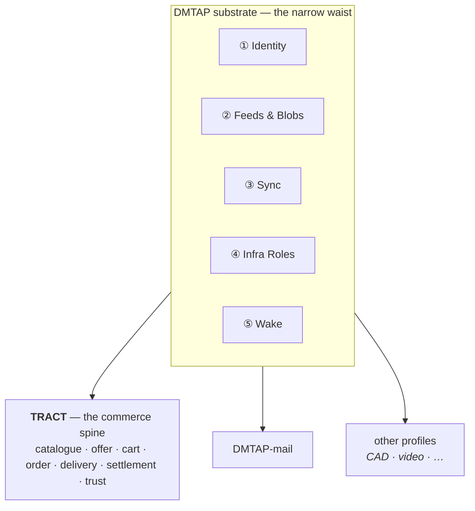

# 0. Overview & Architecture

## 0.1 Goals

TRACT is a protocol for **commerce between self-sovereign identities** — goods, services,
rentals, subscriptions, and the delivery and settlement around them — with **no marketplace
operator**, no registrar, and no token. A seller's catalogue is a signed feed the seller alone
controls; a buyer's cart is state the buyer alone holds; the network in between stores nothing
durable and adjudicates nothing.

Concretely, TRACT MUST provide:

1. **Sovereign selling** — a keypair is a store. No account with any platform is required to
   *be* a seller, and no party can delist, suspend, or edit a seller's catalogue (§1, §2).
2. **One product, many sellers** — a product record is content-addressed, so two sellers
   publishing the same record converge on the same address *by construction*. "Who sells this?"
   is a derived index anyone can rebuild, never a registry anyone runs (§2). **This is the
   mechanism, not yet a demonstrated solution** — independent publishers describing the same
   physical product do not produce identical bytes, and no deployed system achieves
   cross-publisher product identity without a licensed registry (§21.2).
3. **One shape for every trade** — goods, services, rentals, bookings, subscriptions, licences
   and made-to-order work all express as one four-axis offer, without a plugin per category (§3–§5).
4. **One cart across independent sellers** — a buyer assembles a cart spanning sellers who have
   never heard of each other, and checks out once (§6, §7).
5. **Delivery computed, not brokered** — carriers, distributors and peer couriers publish rate
   cards as public objects; routing and consolidation are computed **on the buyer's own node**
   from those objects, so no party sees the whole cart (§8).
6. **Settlement without a payment monopoly** — a provider-agnostic seam carries signed payment
   attestations; the protocol never holds funds and names no provider (§9).
7. **Trust without an authority** — reviews are signed objects proven against real purchases,
   and ranking is derived data any node computes. There is no global score, because computing
   one requires a party that aggregates and ranks (§10).
8. **Lawful by construction, worldwide** — jurisdiction, tax anchors and the responsible party
   are machine-readable fields on every offer and order, not an afterthought bolted onto a
   platform's terms of service (§11).
9. **Future-proofing** — crypto-agility and transport independence inherited from the substrate;
   standards reuse everywhere a standard exists (§20).

## 0.2 What TRACT is not

- **Not a marketplace.** There is no operator that lists sellers, ranks them, takes a cut, or
  can remove them. Where this document says "index" it always means derived, rebuildable data
  (§2.6).
- **Not a payment network.** TRACT specifies no rail, no currency, no token, and no ledger. It
  specifies a *seam* (§9) and the attestations that cross it.
- **Not a courier.** TRACT computes routes over published rate cards; it moves nothing.
- **Not an arbiter.** Where a dispute needs an adjudicator with power to seize funds, TRACT
  names the one role that may hold that power and confines it (§0.4, §9.6) rather than
  pretending the protocol can settle it.
- **Not a new cryptosystem.** Every primitive is inherited from the DMTAP substrate (§0.3),
  which in turn profiles existing RFCs.

## 0.3 TRACT stands on the DMTAP substrate

TRACT is not a new stack. It **adopts** the five substrate capabilities defined in the DMTAP
substrate directory, under that directory's à-la-carte adoption rule — *if a product implements
a capability's function, it MUST speak that capability's spec* — and adds only the commerce
spine on top.

| # | Substrate capability | What TRACT uses it for |
|---|----------------------|------------------------|
| ① | **Identity** — keypair `IK`, `DeviceCert`, DNS `name→key`, key transparency, 8-word key-name | seller, buyer, courier, distributor and gateway identity (§1) |
| ② | **Feeds & Blobs** — signed append-only per-author feeds, plaintext content-addressed blobs, servable over plain HTTPS | catalogues, offers, rate cards, capacity, reviews (§2, §8, §10) |
| ③ | **Sync** — signed CRDT op algebra, range-Merkle reconciliation | carts across a buyer's devices, inventory across a seller's replicas (§6) |
| ④ | **Infrastructure Roles** — announce/resolve, signaling, circuit relay, short-TTL content-blind mailbox, cache/pin | reachability for stores and buyers behind NAT (§1.5) |
| ⑤ | **Wake** — content-free, sender-blind push | waking a sleeping seller node when an order arrives (§1.5) |

Sealed order messages (§7) ride the DMTAP **MOTE** (its §2) and its message kinds. TRACT
allocates no new cryptography, no new hash construction, and no new signature framing.



**The consequence worth stating up front:** a seller's identity, a buyer's identity, and a mail
identity are the *same key*. A shopper does not create an account to buy; they already have one,
and it is theirs.

## 0.4 Roles, and the one operator class

Like the substrate, TRACT is **roles, not node types**. Every function below is a role of the
same software, taken by whoever wants it, requiring nothing rarer than a machine that is up —
with exactly one exception, and confining that exception is the structural claim of this
document.

### 0.4.1 The roles anyone may take

| Role | What it does | Why anyone can run it |
|------|--------------|-----------------------|
| **Seller** | publishes a catalogue feed; receives sealed orders | a keypair and a box that is up |
| **Buyer** | holds a cart; sends sealed orders; computes routing | a keypair |
| **Courier** | publishes a rate card; accepts consignments | a keypair; a bicycle is enough |
| **Distributor** | publishes storage/consolidation capacity; holds goods in transit | a keypair and space |
| **Index** | builds search/aggregation over public feeds | derived data; anyone may build one, none is authoritative (§2.6) |
| **Cache / pin** | serves content-addressed objects | inherited substrate role |

None of these is sold, gatekept, or registered. An index in particular is **not** a marketplace:
it holds no authority, and a disagreement between an index and a feed is always resolved in
favour of the feed.

> **The gap between permission and practice (§21.3).** "Any node MAY build an index" does not mean
> many will. A content-addressed substrate offers no global index, so discovery is the **first**
> function to re-centralize: whichever index becomes economically dominant becomes a de facto
> content-policy gatekeeper, regardless of what this document permits. That happened to the closest
> deployed relative of this design, and the largest live decentralized-commerce network avoided it
> only by adopting a central approval-gating registry (§21.4). No protocol rule here prevents it.
> Multiple competing indexers with verifiable completeness or censorship proofs are a candidate
> answer with **no deployed precedent** (§21.8). This is the weakest load-bearing claim in the
> document and is marked as such rather than defended.

### 0.4.2 The gateway — the only operator class

A **gateway** is a role like the others, with one difference that defines it: it is the **only**
function in TRACT that requires **scarce resources** — a domain with TLS and uptime, and, where
it settles payments, a payment-provider relationship, a money float, and jurisdiction-specific
licensing. None of that can be derived from a keypair or provisioned reciprocally.

A gateway does two things, and they bundle because the same commercial and legal standing
underwrites both:

- **Storefront** (§12) — renders signed catalogue objects into ordinary HTML over ordinary
  HTTPS, so a shopper with no TRACT client and no keypair can browse and buy. It offers stores a
  subdomain and accepts custom domains.
- **Settlement and escrow** (§9.6) — holds funds between order and delivery under its own
  payment-provider relationship, and rules on release or refund.

It is **not** the catalogue (that is the seller's feed), **not** the index (derived, and anyone
may build one), **not** the courier, **not** the reputation authority (§10.4), and **not** a
holder of anyone's identity keys — ever. Two TRACT-native parties never need a gateway to
transact; it exists for the legacy web and for buyers who want recourse.

Gateways are **permissionless to enter and competing**: a seller may list through several at
once, and moving between them costs a DNS change, because the store *is* the feed.

### 0.4.3 Honest departure from DMTAP's structural claim

DMTAP confines its one operator class to legacy SMTP egress, and that class **self-extinguishes**
as adoption grows. TRACT's does not:

- The **storefront** function is permanent, because browsers are permanent. A shopper without a
  keypair cannot verify a signature, so they trust the gateway rendered honestly. That is a real
  trust downgrade and it is disclosed as one (§12.6), mitigated but not removed by the fact that
  any node can re-render the same store and be compared byte-for-byte.
- The **escrow** function is permanent, because holding money for strangers is a licensed
  activity and physical custody cannot be made trustless (§9.6.4).

TRACT is therefore **structurally less pure than DMTAP**, and this document says so rather than
discovering it later. What is preserved is that the class is *one*, entered permissionlessly,
competed for, chosen per-order by both parties, replaceable without loss, and never in
possession of identity keys.

## 0.5 The two quadrants — what is public, what is sealed

The substrate's Feeds capability provides authenticity **without** confidentiality; its MOTE
provides confidentiality **and** authenticity. TRACT splits commerce along exactly that seam,
and the split is a hard rule, not a convention:

| Public — signed, content-addressed, irrevocable | Sealed — encrypted, per-party, deletable |
|---|---|
| product records, offers, prices | orders, order lines |
| availability and stock signals | buyer name, address, contact |
| carrier and distributor rate cards | payment references and receipts |
| storefront render bundles | consignment routing detail |
| reviews (pseudonymous, §10.3) | dispute correspondence |

> **Normative (§0.5.1).** **No personal data may enter the public quadrant.** Published objects
> are irrevocable and content-addressed; a right to erasure cannot be satisfied against them.
> An implementation MUST NOT publish, plaintext-address, or serve any object containing personal
> data. Orders are sealed, always. The residual case — reviews, which are public by nature and
> signed by a person — is bounded in §10.3 and disclosed in §14 as an honest limit.

## 0.6 The shape of a trade

```mermaid
sequenceDiagram
  autonumber
  participant B as Buyer node
  participant F as Public feeds
  participant S as Seller node(s)
  participant G as Gateway (optional)
  B->>F: fetch product records, offers, rate cards (pull, anonymous)
  B->>B: build cart (local CRDT); compute routing + total (local)
  B->>S: sealed order, one per seller (§7)
  S-->>B: accept / decline / counter
  opt escrow chosen by both
    B->>G: pay; G holds
  end
  S->>S: fulfil (ship / perform / grant)
  B->>G: confirm receipt
  G->>S: release
  B->>F: publish purchase-attested review (§10)
```

The buyer's node is the orchestrator. There is no party that sees the whole cart, and no party
whose absence prevents the trade — except a gateway, when the parties chose one.

## 0.7 Where state lives

| State | Location | Notes |
|-------|----------|-------|
| Catalogue, offers, rate cards, capacity | **Seller / courier / distributor node** (the edge) | published as signed feeds |
| Cart, wishlist, purchase history | **Buyer node** (the edge) | CRDT across the buyer's own devices; survives any store closing |
| Orders | **Both endpoints**, sealed | never in the middle, never public |
| Product records | **Content-addressed swarm** | globally deduplicated; any holder may serve |
| Indexes, search, rankings | **Anywhere** | derived, rebuildable, never authoritative |
| Funds in escrow | **A node in gateway mode** | the one irreducible operator function |
| Reachability (key → location) | **Substrate mesh / HTTPS** | signed, TTL'd, self-republished |

Every row but the escrow row is either edge state or derived data. That is the invariant the
rest of this document protects.

**The liveness caveat, stated where the table is rather than late (§21.5).** Durability at the
edges covers *orders* — a sender's node retries, and an offline seller's orders wait. It does not
cover *catalogues*. A seller whose node is offline is not slow; they are **invisible**. The one
deployed system closest to this design measured a bounded listing lifetime and whole
catalogues disappearing when a merchant node departed (§21.5). Any deployment therefore depends on
third-party caching or pinning of public objects for sellers who are not always on — and unpaid
replication is precisely what that system did not get. Whether pinning needs an incentive, and
whether that incentive creates another operator, is open (§21.8).

## 0.8 Document map

| § | Title | Covers |
|---|-------|--------|
| §1 | Actors & identity | seller/buyer/courier/distributor/gateway identity, reachability |
| §2 | Catalogue | product records, the product-identity ladder, offers, variants, indexes |
| §3 | Availability | stock, time slots, capacity, made-to-order |
| §4 | Fulfilment | ship, collect, digital grant, perform-at, perform-remote, access, return |
| §5 | Consideration | fixed, tiered, recurring, metered, deposit, quote/RFQ; tax |
| §6 | Cart | buyer-side CRDT cart, live availability, holds and reservations |
| §7 | Order | the sealed order object and its state machine |
| §8 | Delivery | rate cards, legs, consolidation, distributors, local route computation |
| §9 | Settlement | the payment seam, rail classes, escrow, the gateway's money role |
| §10 | Trust | purchase-attested reviews, local ranking, why no global score |
| §11 | Jurisdiction | the four anchors, scope declarations, tax and consumer-law fields |
| §12 | Gateway | storefront rendering, domains, origin isolation, honest trust limits |
| §13 | Analytics | privacy-preserving measurement; what a merchant gains and loses |
| §14 | Anti-abuse | listing spam, review manipulation, Sybil, and the honest limits |
| §15 | Conformance | profiles and the auditable fail-closed set |
| §16 | Wire format | deterministic CBOR object definitions |
| §17 | Errors & registries | the `ERR_TRACT_*` block and IANA-style registries |
| §18 | State machines | offer, order, consignment, escrow |
| §19 | Parameters | timeouts, limits, defaults |
| §20 | References | normative and informative standards |
| §21 | Grounding | what the evidence supports, and what it contradicts |
| §22 | Erasure | the erasure-rights conflict, candidate mechanisms, and the residual left unresolved |

## 0.9 Conventions & normative glossary

**Requirement language.** The key words MUST, MUST NOT, SHOULD, SHOULD NOT, MAY are to be
interpreted as described in BCP 14 (RFC 2119, RFC 8174) when, and only when, in all capitals.

**Glossary (normative).** Defined once here, used with these meanings throughout.

- **product record** — a content-addressed public object describing *what a thing is*, not who
  sells it or for how much. Shared across sellers by construction (§2.2).
- **offer** — a signed announcement by **one** seller that it will supply a product record's
  subject on stated terms. An offer is always one seller's claim; a product record is nobody's
  (§2.2).
- **the four axes** — every offer declares **Item**, **Availability**, **Fulfilment**, and
  **Consideration** (§2.3). Together they express goods, services, rentals, subscriptions and
  bookings without category-specific machinery.
- **index** — derived, rebuildable aggregation over public feeds. **Never authoritative**;
  a disagreement with a feed resolves in favour of the feed (§2.6). The term *marketplace* is
  **not used** in this document for anything TRACT defines, precisely because an index is not one.
- **gateway** — **one sense only**: the operator-class role of §0.4.2 — storefront rendering
  and/or settlement and escrow. It never means an index, a courier, or a relay.
- **consignment** — physical goods in transit under someone else's custody: a courier leg or a
  distributor hold (§8.4).
- **leg** — one movement of goods between two places, priced by one rate card (§8.2).
- **rate card** — a signed public object from which a leg's price and transit estimate are
  **computed locally**, as opposed to quoted by a call to the carrier (§8.2).
- **place of supply** — the jurisdictional anchor derived from the **Fulfilment** axis, distinct
  from seller establishment, buyer residence, and delivery destination (§11.2). Getting these
  four confused is the most common commerce-tax error and this document keeps them separate by
  construction.
- **rail** — a settlement mechanism behind the payment seam, classified `CustodialReversible`
  or `NonCustodialFinal`. The class is part of the type because it changes the buyer's recourse
  (§9.2).
- **purchase attestation** — a signed proof that a review's author actually transacted, issued
  by the seller or by an escrow gateway (§10.2).
- **personal data** — as defined by the applicable regime (GDPR Art 4(1), POPIA §1, LGPD Art 5);
  for this document's purposes, any datum relating to an identified or identifiable natural
  person, **including a pseudonymous key that is linkable to one**.
