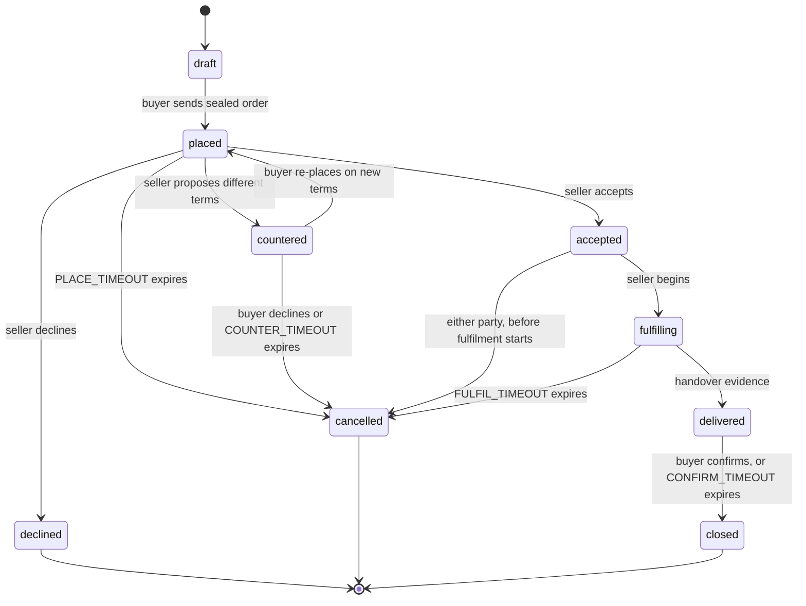

# 18. State machines

> **Drafting status.** This section is scoped but not yet normative. It states what it will
> specify, which existing standards it profiles, and the decisions still open. Nothing here is
> implementable yet; text becomes normative when the RFC 2119 keywords appear.

## 18.1 Scope

The state machines, collected in one place so they can be checked against §7's prose rather than
inferred from it — and so that the question this section exists to force gets asked of every edge:
**what happens when the counterparty never answers?**

That question is the whole point. A protocol between sovereign parties has no supervisor to notice
a stalled trade, so a transition without a defined expiry is not an edge case, it is where money
and goods sit indefinitely with nobody empowered to move them. Every table below therefore carries
a timeout column, and "none" appears only where waiting forever is genuinely correct.

## 18.2 Offer

The simplest machine, and the only one with no counterparty: an offer is one seller's unilateral
publication.

| From | To | Trigger | Signed by | Timeout |
|---|---|---|---|---|
| — | `published` | the seller publishes | seller | none |
| `published` | `superseded` | a later offer replaces it | seller | none |
| `published` | `withdrawn` | the seller stops offering | seller | none |

**Withdrawal is not deletion.** A published offer is content-addressed and irrevocable (§0.5),
so `withdrawn` is a successor object stating the offer no longer stands, not an erasure of the
original. A buyer holding a cached offer learns it is withdrawn by fetching the seller's feed;
until they do, they may present terms the seller has stopped honouring, which is why acceptance is
the seller's (§18.3) and not automatic.

## 18.3 Order

| From | To | Trigger | Signed by | Timeout → behaviour |
|---|---|---|---|---|
| `draft` | `placed` | buyer sends | buyer | none — a draft is local |
| `placed` | `accepted` / `declined` / `countered` | seller responds | seller | `PLACE_TIMEOUT` → `cancelled`. **A silent seller cancels; it never accepts.** |
| `countered` | `placed` / `cancelled` | buyer responds | buyer | `COUNTER_TIMEOUT` → `cancelled` |
| `accepted` | `fulfilling` | seller begins | seller | none |
| `fulfilling` | `delivered` | handover evidence (§18.4) | carrier or seller | `FULFIL_TIMEOUT` → `cancelled`, and escrow refunds (§18.5) |
| `delivered` | `closed` | buyer confirms | buyer | `CONFIRM_TIMEOUT` → `closed`. **A silent buyer closes; escrow releases.** |

The two asymmetric defaults are deliberate and pull in opposite directions, which is the honest
part:

- **Silence before acceptance cancels.** A seller who never answers must not be bound, and a buyer
  must not have funds committed against an order nobody acknowledged.
- **Silence after delivery closes.** A buyer who received goods and then stops responding must not
  be able to strand the seller's money forever by doing nothing. This is the one place the protocol
  favours the seller, and it does so because the alternative — funds held until a buyer
  affirmatively acts — makes non-response a free option to withhold payment.

`CONFIRM_TIMEOUT` is therefore the most consequential parameter in §19, and it is a genuine
trade-off rather than a tuning detail: too short and a buyer with a real complaint loses recourse
by being slow; too long and every seller carries the float. It is stated here so the choice is made
visibly rather than inherited from whatever a first implementation happened to pick.

**Cancellation is not symmetric with acceptance.** After `fulfilling` begins, a unilateral buyer
cancellation is a *request*, not a transition — goods may already be in a courier's hands, and §8
custody has its own machine (§18.4). What the buyer can always do is refuse to confirm, which is
what routes the trade to a dispute rather than to `closed`.

## 18.4 Consignment

Physical custody, which is the one machine whose transitions correspond to something happening in
the world rather than a message being sent.

| From | To | Trigger | Signed by | Timeout → behaviour |
|---|---|---|---|---|
| — | `created` | seller books a leg | seller | none |
| `created` | `accepted` | carrier or distributor takes custody | **the receiving party** | `PICKUP_TIMEOUT` → `created` again, so the seller re-books |
| `accepted` | `in-custody` | held at a hub | custodian | `HOLD_TIMEOUT` → alert; consolidation is waiting on a slower seller (§8.3) |
| `in-custody` | `handed-off` | passed to the next leg | **both** outgoing and incoming | none |
| `handed-off` | `delivered` | final handover | recipient, or carrier proof-of-delivery | `TRANSIT_TIMEOUT` → `lost` |
| any | `lost` | declared | current custodian, or by timeout | terminal |

**Custody transitions are signed by the party taking custody, not the party giving it up.** A
handoff attested only by the sender proves someone *tried* to hand something over; attested by the
receiver, it proves the chain actually moved. This matters because the whole value of the chain is
being able to say who held the goods when they went missing.

**And it proves transfer, not recoverability.** §8.4 says this and §18 has to repeat it here rather
than let a tidy state machine imply otherwise: `lost` is a terminal state with a signed history and
no remedy attached. Where the goods went is answerable; getting them back, or being paid for them,
is §9's problem or nobody's.

## 18.5 Escrow

Only present when both parties chose an operator whose scope covers the trade (§9.4).

| From | To | Trigger | Signed by | Timeout → behaviour |
|---|---|---|---|---|
| — | `funded` | buyer pays | operator attests | `FUND_TIMEOUT` → order `cancelled` |
| `funded` | `held` | seller dispatches | operator attests | — |
| `held` | `released` | buyer confirms, or order reaches `closed` | operator | `CONFIRM_TIMEOUT` (§18.3) → `released` |
| `held` | `refunded` | order reaches `cancelled`, or ruling | operator | — |
| `held` | `split` | ruling | operator | — |
| `held` | `held` | dispute raised | either party | `DISPUTE_TIMEOUT` → **see below** |

**The edge with no good answer.** A dispute where neither party will move is exactly what escrow
exists for, and it is also where non-custodial programmatic escrow deadlocks (§9.6). A custodial
operator resolves it by ruling, which is why it is an operator class at all — and that ruling is
published as a signed object (§9.5), so an operator that rules badly accumulates a record of it.

For a **non-custodial** rail there is no such move available. The honest options are a timeout that
defaults to one party — which is a policy choice favouring whoever it defaults to, not a neutral
mechanism — or indefinite lock. This section does not pretend a third option exists. What it
requires is that the choice is **disclosed before the trade**, because a buyer who learns at
dispute time that no one can release the funds was mis-sold the arrangement.

## 18.6 What every transition carries

- **Which party signs it.** A transition nobody signed is not evidence of anything.
- **What evidence it produces**, and whether that evidence is public (an escrow ruling, §9.5) or
  sealed (an order transition, §16.6).
- **Its timeout, and the state that timeout leads to.** Never "expires" alone: expiring *into*
  somewhere is the whole requirement.
- **Whether it is reversible**, and by whom. Most are not, which is why acceptance and confirmation
  are the two places a party gets to think.

## 18.7 Open

- **Whether `CONFIRM_TIMEOUT` is a protocol parameter or an offer-level term.** A seller of
  perishables and a seller of furniture want very different values, which argues for the offer; a
  buyer comparing offers should not have to read a timeout to know their recourse, which argues for
  the protocol. Currently leaning protocol floor with an offer-level extension upward only.
- **Whether a dispute pauses `CONFIRM_TIMEOUT` or runs alongside it.** Pausing lets a bad-faith
  buyer stall indefinitely by disputing; not pausing lets a slow operator time out a real dispute
  into an automatic release.
- **Whether `lost` needs a distinct `disputed-lost`**, given that custodian and recipient may
  disagree about whether delivery happened at all.
