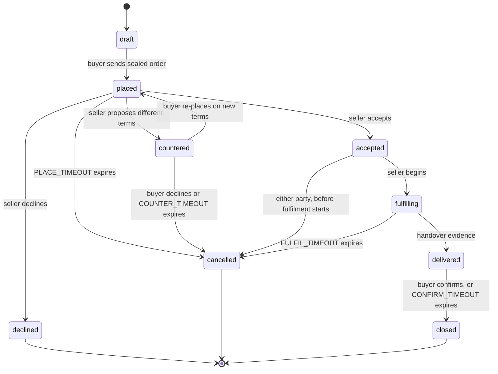

# 18. State machines

> **Drafting status: partially normative.** The state machines TRACT **owns** are authored to
> normative RFC 2119 text, aligned exactly to the frozen §16 grammar: the offer machine (§18.2), the
> **order backbone** (§18.3, over `OrderState` 0..8 of §16.6), the *state machine* of escrow (§18.5),
> and the transition-invariant rules (§18.6). The **consignment machine (§18.4) is WRAP's, not
> TRACT's**: its custody lifecycle bytes (`Progress`/`Attestation`) are specified **once** in WRAP
> and referenced here, never re-specified (§8.9, §8.4). What remains **scoped, not normative** is
> marked inline as **PROVISIONAL — pending decision** and collected in §18.7: whether
> `CONFIRM_TIMEOUT` is a protocol floor or an offer-level term; whether a dispute pauses it; whether
> `lost` needs a distinct `disputed-lost`; how a `recurring` consideration (§5.6) or a `metered`
> total (§5.7) maps onto a single-shot order backbone; and the escrow state-transition and ruling
> wire objects the frozen §16 does not yet carry (§9.4.3, §9.7). Timeout **values** are §19
> proposals, not frozen; the timeout **destinations** below are settled and normative. The key words
> MUST, MUST NOT, SHOULD, SHOULD NOT and MAY are to be interpreted as in BCP 14 (RFC 2119, RFC 8174)
> wherever they appear below.

## 18.1 Scope

The state machines, collected in one place so they can be checked against §7's prose rather than
inferred from it — and so that the question this section exists to force gets asked of every edge:
**what happens when the counterparty never answers?**

That question is the whole point. A protocol between sovereign parties has no supervisor to notice
a stalled trade, so a transition without a defined expiry is not an edge case, it is where money
and goods sit indefinitely with nobody empowered to move them. Every machine below therefore names,
for each transition, **who signs it**, **what evidence it produces**, and **its timeout and the
state that timeout leads to** — with "none" appearing only where waiting forever is genuinely
correct (§18.6).

Two of these machines are TRACT's and one is not. The offer machine (§18.2), the order backbone
(§18.3), and the escrow machine (§18.5) are TRACT's own and are specified here against the §16
grammar. The **consignment machine (§18.4) belongs to WRAP** — physical custody is
work-coordination, not commerce (§8.9, C2) — and this section **references** it rather than defining
a custody object of its own. TRACT introduces no new state-machine bytes beyond the `OrderState`
enumeration already frozen in §16.6.

The signer of every TRACT transition is an `IK` (the substrate's identity;
`github.com/vul-os/dmtap/blob/main/substrate/IDENTITY.md`), and a transition attested by no `IK` is
not evidence of anything (§18.6). TRACT defines no new signature framing for these transitions; the
substrate's is used unchanged.

## 18.2 Offer

The simplest machine, and the only one with no counterparty: an offer is one seller's unilateral
publication.

| From | To | Trigger | Signed by | Timeout |
|---|---|---|---|---|
| — | `published` | the seller publishes | seller | none |
| `published` | `superseded` | a later offer replaces it | seller | none |
| `published` | `withdrawn` | the seller stops offering | seller | none |

Every transition of this machine MUST be signed by the seller's `IK`; no other party may advance it,
because an `Offer` is one seller's claim to supply (§16.5.2) and nobody else's to move. There is no
timeout on any transition: an offer that stands until its seller changes it is exactly correct, and
"none" here is not an omission (§18.6).

**Withdrawal is not deletion.** A published `Offer` is content-addressed and irrevocable (§0.5,
§16.4), so `withdrawn` MUST be expressed as a **successor object** stating the offer no longer
stands, and MUST NOT be expressed as an erasure of the original — there is no erasure available
against a published object. A buyer holding a cached offer learns it is withdrawn by fetching the
seller's feed (`github.com/vul-os/dmtap/blob/main/substrate/FEEDS.md`); until they do, they MAY
present terms the seller has stopped honouring, which is why acceptance is the seller's (§18.3) and
never automatic.

**A withdrawn or superseded offer is bounded by publisher liveness.** A seller whose node is offline
cannot serve the successor object that announces the withdrawal, so a buyer relying on a cached copy
may act on stale terms until they can reach the feed — availability is bounded by publisher
liveness, as measured on OpenBazaar's median listing lifetime (§21.5). This is a real limit of
the offer machine, not an edge case, and is why the
binding moment is the seller's acceptance in §18.3 rather than the buyer's reading of the offer.

## 18.3 Order

This is the backbone. It runs over the `OrderState` enumeration frozen in §16.6 — `0` draft, `1`
placed, `2` accepted, `3` declined, `4` countered, `5` fulfilling, `6` delivered, `7` closed, `8`
cancelled — and introduces no order-state bytes of its own.

| From | To | Trigger | Signed by | Timeout → behaviour |
|---|---|---|---|---|
| `draft` (0) | `placed` (1) | buyer sends the sealed order | buyer | none — a draft is local |
| `placed` (1) | `accepted` (2) / `declined` (3) / `countered` (4) | seller responds | seller | `PLACE_TIMEOUT` → `cancelled` (8). **A silent seller cancels; it never accepts.** |
| `countered` (4) | `placed` (1) / `cancelled` (8) | buyer responds | buyer | `COUNTER_TIMEOUT` → `cancelled` (8) |
| `accepted` (2) | `fulfilling` (5) | seller begins | seller | none |
| `accepted` (2) | `cancelled` (8) | either party, before fulfilment starts | the cancelling party | none |
| `fulfilling` (5) | `delivered` (6) | handover evidence (§18.4, WRAP) | carrier or seller | `FULFIL_TIMEOUT` → `cancelled` (8), and escrow refunds (§18.5) |
| `delivered` (6) | `closed` (7) | buyer confirms | buyer | `CONFIRM_TIMEOUT` → `closed` (7). **A silent buyer closes; escrow releases.** |

Normative rules for the machine:

- Each transition MUST be signed by the party named in the "Signed by" column, using that party's
  `IK`. A transition presented without that party's signature MUST be rejected fail-closed. A
  transition that is not an edge of this machine (for example `accepted` → `closed`, skipping
  delivery) MUST be rejected; the two order endpoints are the only authorities on their own order
  state, and neither may record a transition the other did not participate in where the table names
  both.
- An `Order` is a **sealed** object (§16.6): every transition and its evidence live at the two
  endpoints, are per-party and deletable, and MUST NOT be produced into any public object (§16.4).
  The only public trace an order may ever leave is a `PurchaseAttestation` referencing it **by
  address only** (§16.5.5, §10), never its contents or state.
- `declined` (3), `cancelled` (8), and `closed` (7) are terminal. There is no edge out of a terminal
  state; a party who wants to trade again places a fresh order from `draft`.
- The timeout **destinations** in the table are normative. The timeout **values** —
  `PLACE_TIMEOUT`, `COUNTER_TIMEOUT`, `FULFIL_TIMEOUT`, `CONFIRM_TIMEOUT` — are §19.2 parameters
  and are proposed defaults, not measured or frozen (§19.8). `FULFIL_TIMEOUT` is offer-declared
  rather than a single number, because a made-to-order lead time and an instant digital grant have
  nothing in common (§19.2, §3); it is a floor on how long a buyer MUST wait before they MAY cancel,
  not the fulfilment duration itself.

The two asymmetric defaults are deliberate and pull in opposite directions, which is the honest
part:

- **Silence before acceptance cancels.** A seller who never answers MUST NOT be bound, and a buyer
  MUST NOT have funds committed against an order nobody acknowledged. `PLACE_TIMEOUT` and
  `COUNTER_TIMEOUT` therefore expire into `cancelled`, and a silent seller is never treated as
  having accepted.
- **Silence after delivery closes.** A buyer who received goods and then stops responding MUST NOT
  be able to strand the seller's money forever by doing nothing. This is the one place the protocol
  favours the seller, and it does so because the alternative — funds held until a buyer
  affirmatively acts — makes non-response a free option to withhold payment.

`CONFIRM_TIMEOUT` is therefore the most consequential parameter in §19, and it is a genuine
trade-off rather than a tuning detail: too short and a buyer with a real complaint loses recourse by
being slow; too long and every seller carries the float. It is stated here so the choice is made
visibly rather than inherited from whatever a first implementation happened to pick.

**PROVISIONAL — pending decision.** Whether `CONFIRM_TIMEOUT` is a **protocol floor** or an
**offer-level term** is unresolved (§18.7, §19.8). A seller of perishables and a seller of furniture
want very different values, which argues for the offer; a buyer comparing offers should not have to
read a timeout to know their recourse, which argues for the protocol. Until this is settled, an
implementation MUST NOT treat any single `CONFIRM_TIMEOUT` value as authoritative-by-construction;
the value in §19.2 is a proposed default, not a normative constant. Recorded for the founder-decision
list.

**Cancellation is not symmetric with acceptance.** Before `fulfilling` (5) begins, either party MAY
cancel an `accepted` order, and that cancellation is a transition. **After `fulfilling` (5) begins, a
unilateral buyer cancellation is a *request*, not a transition** — goods may already be in a
courier's custody, whose lifecycle is WRAP's (§18.4), and TRACT's order machine MUST NOT record a
buyer-driven cancel out of `fulfilling`. What the buyer can always do is refuse to confirm, which is
what routes the trade toward dispute (§18.5) rather than to `closed`. This departs deliberately from
a merchant-as-sole-authority order flow (§21.7, the NIP-15 caution): the buyer's counter-signed
confirmation is the point, and the added state is accepted honestly as the cost of it.

**PROVISIONAL — pending decision (recurring renewal, §5.6).** This machine is **single-shot**: it
runs once from `draft` (0) to a terminal state and does not loop. A `recurring` consideration
(§16.5.2 key 2; §5.6) has no renewal path described here. Whether each renewal period is a fresh
`Order` — the leaning answer, since `Order` is a lightweight sealed object and "was this specific
charge accepted" is naturally per-period — or one `Order` that persists across periods, is not
decided, and this document specifies no renewal semantics either way. An implementation MUST NOT
assume a renewal semantics this document has not specified. Surfaced from §5.6; recorded for the
founder-decision list.

**PROVISIONAL — pending decision (metered total, §5.7).** This machine assumes an order whose
`total` (§16.6 key 4, mandatory) is knowable at `placed` (1). A `metered` consideration (§16.5.2 key
4; §5.7) is billed after consumption, so its final figure is not known until after `delivered` (6).
Whether a metered order's `total` is an estimate, a cap, or requires a different order shape and a
usage-attestation object §16 does not yet carry is unresolved (§5.7, §5.13). An implementation MUST
NOT place a metered `total` as if it were the final settled figure. Surfaced from §5.7; recorded for
the founder-decision list.

## 18.4 Consignment — WRAP's machine, referenced not re-specified

Physical custody is the one lifecycle whose transitions correspond to something happening in the
world rather than a message being sent — and it is **not TRACT's to define**. Custody handoff is
work-coordination, and the whole of it lives in **WRAP** (`github.com/vul-os/wrap`), on the same
DMTAP substrate and the same `IK` identity as TRACT (§8.9, C2).

**Normative seam:**

- TRACT defines **no** custody object, no consignment record, and no handoff transition of its own.
  An implementation MUST use WRAP's `Progress` and `Attestation` (WRAP §3.7–§3.8) for the custody
  lifecycle and MUST NOT introduce a parallel TRACT-native one. Where this section and WRAP would
  disagree about the custody machine, **WRAP governs**.
- The custody lifecycle is `created → accepted → in-custody → handed-off → delivered`, with `lost`
  as a terminal state, specified **once** as WRAP's delivery profile and referenced here for
  cross-checking against §7's order prose and §8's delivery reasoning only — not restated as TRACT
  bytes (§8.9). It is shown for orientation, and WRAP is its authority:

  | From | To | Signed by (WRAP) | Timeout → behaviour |
  |---|---|---|---|
  | — | `created` | seller books a leg | none |
  | `created` | `accepted` | **the receiving party** takes custody | `PICKUP_TIMEOUT` → `created` again, so the seller re-books |
  | `accepted` | `in-custody` | custodian | `HOLD_TIMEOUT` → alert; consolidation is waiting on a slower seller (§8.3) |
  | `in-custody` | `handed-off` | **both** outgoing and incoming | none |
  | `handed-off` | `delivered` | recipient, or carrier proof-of-delivery | `TRANSIT_TIMEOUT` → `lost` |
  | any | `lost` | current custodian, or by timeout | terminal |

- The timeout **values** referenced above — `PICKUP_TIMEOUT`, `HOLD_TIMEOUT`, `TRANSIT_TIMEOUT` —
  are TRACT §19.3 parameters that bound the delivery leg's expected timing; their **destinations**
  are WRAP states. `delivered` here is the custody event that produces the handover evidence which
  advances the **order** machine's `fulfilling` (5) → `delivered` (6) transition (§18.3).

**Custody transitions are signed by the party taking custody, not the party giving it up.** This is
the one property §8.4 states and this section restates because a tidy machine must not be allowed to
imply otherwise: a handoff attested only by the sender proves someone *tried* to hand something over;
attested by the receiver, it proves the chain actually moved. The whole value of the chain is being
able to say who held the goods when they went missing. The authority for this rule is WRAP's
`Attestation` model; §8.4 and this subsection reference it, and it is written a third time nowhere.

**And it proves transfer, not recoverability.** `lost` is a terminal state with a signed history and
**no remedy attached**. Where the goods went is answerable; getting them back, or being paid for
them, is §9's problem or nobody's (§8.7). A state machine MUST NOT be read as implying a recovery
path that no object provides.

**PROVISIONAL — pending decision (`disputed-lost`, §18.7).** Custodian and recipient may disagree
about whether delivery happened at all, which the single terminal `lost` cannot distinguish from an
agreed loss. Whether the lifecycle needs a distinct `disputed-lost` state is open — and because the
custody machine is **WRAP's**, adding it is a **WRAP** profile change, not a §16 grammar change.
Recorded for the founder-decision list.

## 18.5 Escrow

Present only when both parties chose an operator whose `EscrowScope` (§16.5.4) covers the trade
(§9.4.2, §9.4.3). This machine is **owned by §18.5** and referenced, not restated, by §9 (§9.4.3);
its timeouts are §19.4 parameters.

| From | To | Trigger | Signed by | Timeout → behaviour |
|---|---|---|---|---|
| — | `funded` | buyer pays | operator attests | `FUND_TIMEOUT` → order `cancelled` (§18.3) |
| `funded` | `held` | seller dispatches | operator attests | — |
| `held` | `released` | buyer confirms, or order reaches `closed` (7) | operator | `CONFIRM_TIMEOUT` (§18.3) → `released` |
| `held` | `refunded` | order reaches `cancelled` (8), or ruling | operator | — |
| `held` | `split` | ruling | operator | — |
| `held` | `held` | dispute raised | either party | `DISPUTE_TIMEOUT` → **see below** |

Normative rules for the machine:

- The escrow lifecycle is **fund → hold → release / refund / split** (§9.4.3). It advances in
  lock-step with the order machine (§18.3): an order reaching `closed` (7) releases a `held` escrow,
  and an order reaching `cancelled` (8) refunds it. An implementation MUST NOT release a `held`
  escrow while its order is still open and undisputed, and MUST NOT leave an escrow `held` after its
  order has reached `closed` (7) or `cancelled` (8).
- The `RailClass` (§9.3, §16.5.4 key 6) elected for the trade MUST be honoured by this machine and
  MUST NOT be substituted mid-trade without a fresh recorded agreement (§9.3,
  `ERR_TRACT_RAIL_CLASS_SUBSTITUTED`).

**PROVISIONAL — pending decision (§9.4.3, §9.7).** The frozen §16 grammar carries **no object for an
escrow state transition** (`funded` / `held` / `released` / `refunded` / `split`) and **no object
for an escrow ruling**. §16 has `EscrowScope` (public) and `PaymentAttestation` (sealed) and nothing
that carries a transition's signer, its from/to state, or a ruling's disposition. This machine names
those states and names a "ruling" as a trigger, but nothing on the wire carries the ruling itself.
Making "each step is a signed object" and "every ruling is published as a signed object" (§9.5)
normative therefore requires a §16 **MAJOR** grammar change — an escrow-transition object carrying
the operator's signature, the from/to state, the order address, and any evidence reference; and, for
a ruling, its disposition including a `split`'s per-party amounts (§9.7). This section does not
invent those bytes. Until §16 carries them, this machine's *published-ruling* property is an
intended guarantee not yet expressible on the wire. Recorded for the founder-decision list and the
grammar-change list.

**The edge with no good answer.** A dispute where neither party will move is exactly what escrow
exists for, and it is also where non-custodial programmatic escrow deadlocks (§9.6, §18.5 below). A
**custodial** operator resolves it by ruling — which is why it is an operator class at all (§0.4.2,
§9.5) — and `DISPUTE_TIMEOUT` (§19.4) is operator-declared and expires into that ruling. A ruling
SHOULD be published as a signed object so that an operator that rules badly accumulates a permanent,
verifiable record (§9.5) — an intended guarantee gated on the §16 gap above.

For a **non-custodial** rail (`RailClass = 1`, §9.3) there is no such move available. The honest
options are a timeout that defaults to one party — which is a policy choice favouring whoever it
defaults to, not a neutral mechanism — or an indefinite lock. This section does not pretend a third
option exists. What it **requires** is that the choice is **disclosed before the trade**: an
implementation MUST present a non-custodial dispute's default-to-one-party-or-lock behaviour to both
parties before they commit, because a buyer who learns at dispute time that no one can release the
funds was mis-sold the arrangement (§9.6). `DISPUTE_TIMEOUT` on a non-custodial rail therefore has
no ruling to expire into, and the disclosed default is what governs (§19.4).

**Honesty (§21).** Escrow's failure modes are **measured outcomes**, not hypotheticals: opt-in
escrow is declined by exactly the bad actors it targets (§9.5a, §21.6), and the whole of
trust/dispute/tax returned **nothing verified** across three grounding passes (§21.1, §21.10,
§21.11). This machine is design reasoning checked for internal consistency; nothing in §21 may be
cited as *support* for it (§21.9, C6). Non-custodial deadlock in particular has no good answer on the
evidence, only the disclosed trade-off above (§21.11).

## 18.6 What every transition carries

For every transition in every machine above, four things MUST be determinate:

- **Which party signs it.** A transition nobody signed is not evidence of anything, and MUST be
  rejected fail-closed. The signer is an `IK` (§18.1).
- **What evidence it produces**, and whether that evidence is **public** (an offer succession,
  §18.2; an escrow ruling once §16 carries one, §9.5) or **sealed** (an order transition, §16.6,
  §18.3). Public evidence is irrevocable and carries no personal data (§16.4); sealed evidence is
  per-party and deletable. A transition MUST NOT produce its evidence in the wrong family.
- **Its timeout, and the state that timeout leads to.** Never "expires" alone: expiring *into* a
  named state is the whole requirement (§18.1). "none" is permitted only where waiting forever is
  correct (§18.2 offer publication; the reversible edges before a party is meant to think).
- **Whether it is reversible**, and by whom. Most transitions are not, which is why **acceptance**
  (§18.3, `placed` → `accepted`) and **confirmation** (§18.3, `delivered` → `closed`) are the two
  places a party gets to think — a design MUST NOT quietly make either automatic.

## 18.7 Open — collected for the founder-decision list

Each item below is marked **PROVISIONAL** in the subsection that raises it. None may be resolved by
inventing a founder call; two require or interact with a §16/WRAP grammar change.

- **Is `CONFIRM_TIMEOUT` a protocol parameter or an offer-level term?** A seller of perishables and
  a seller of furniture want very different values, which argues for the offer; a buyer comparing
  offers should not have to read a timeout to know their recourse, which argues for the protocol.
  Leaning **protocol floor with an offer-level extension upward only** (§18.3, §19.8).
- **Does a dispute pause `CONFIRM_TIMEOUT` or run alongside it?** Pausing lets a bad-faith buyer
  stall indefinitely by disputing; not pausing lets a slow operator time out a real dispute into an
  automatic release (§18.5).
- **Does `lost` need a distinct `disputed-lost`?** Custodian and recipient may disagree about
  whether delivery happened at all. Because the custody machine is **WRAP's** (§18.4), this is a
  WRAP profile change, not a §16 change.
- **How does a `recurring` consideration renew against a single-shot order backbone?** §18.3 runs
  once and does not loop; leaning **fresh `Order` per period** (§5.6, §5.13). Surfaced from §5.6.
- **How does a `metered` order satisfy a mandatory `total` not knowable until after fulfilment?**
  Estimate, cap, or a different order shape plus a usage-attestation object §16 does not yet carry
  (§5.7, §5.13). Surfaced from §5.7; interacts with a §16 change.
- **The escrow state-transition and ruling wire objects.** §16 carries neither; making §18.5's
  "each step is signed" and §9.5's "every ruling is published" normative requires a §16 MAJOR change
  (§9.4.3, §9.7).
