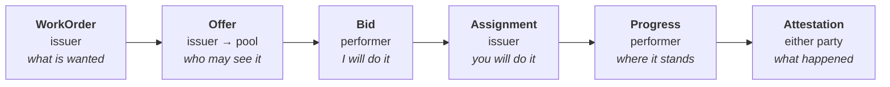

# 3. Object model

## 3.1. Overview

WRAP defines six object kinds. Every object is signed by its author,
content-addressed, and immutable once created. State changes are expressed by
*adding objects*, never by mutating them — which is what lets WRAP carry its
state as substrate Sync ops and Feed entries (§7) rather than inventing a merge
algebra of its own.

| Kind | Value | Author | Substrate primitive (§7.2) |
|---|---|---|---|
| `WorkOrder` | `0x01` | Issuer | Immutable content object (SYNC §4.9; FEEDS §3) |
| `Offer` | `0x02` | Issuer | OR-Set add (SYNC §4.3) |
| `Bid` | `0x03` | Performer | OR-Set, add-wins observed-remove (SYNC §4.3) |
| `Assignment` | `0x04` | Issuer **only** | LWW register (SYNC §4.4) |
| `Progress` | `0x05` | Assigned performer | OR-Set / append (SYNC §4.3) |
| `Attestation` | `0x06` | Any party | Author-feed entry (FEEDS §4) |

Kinds `0x40`–`0x7f` are reserved for profile-specific objects (§12). Kinds
`0x80` and above are reserved for future core use. An implementation
encountering an unknown kind MUST ignore it silently (§4.4).

## 3.2. Common header

Every object carries the same first five fields.

| Key | Name | Type | Notes |
|---|---|---|---|
| 0 | — | — | **FORBIDDEN.** See §4.5. |
| 1 | `v` | uint | Format version. `0` for this document. |
| 2 | `kind` | uint | Object kind from §3.1. |
| 3 | `id` | bstr | Substrate content address `0x1e ‖ BLAKE3-256(canonical body)` (§4.3; FEEDS §3.2). |
| 4 | `author` | bstr(32) | Ed25519 `IK` public key of the signer (IDENTITY §2). |
| 5 | `ts` | Hlc | Substrate hybrid logical clock (SYNC §3). |

`id` is computed over the canonical encoding of the object *excluding* key 3 and
the signature, so it is stable and self-verifying. `author` and `ts` are the same
identity key and HLC the substrate carries in every `SyncOp` and `FeedEntry`; WRAP
adds no clock or identity type of its own (§7.1).

## 3.3. WorkOrder (`0x01`)

The unit of work. Immutable once issued.

| Key | Name | Type | Req | Notes |
|---|---|---|---|---|
| 6 | `profile` | tstr | MUST | e.g. `"delivery/v0"`, `"trades/v0"` (§12) |
| 7 | `title` | tstr | MUST | Short human summary |
| 8 | `detail` | tstr | MAY | Free text |
| 9 | `places` | array | MAY | Ordered `Place` list (§3.9) |
| 10 | `window` | map | MAY | `Window` (§3.10) — when it may happen |
| 11 | `comp` | map | MAY | `Compensation` (§3.11) — terms only, never settlement |
| 12 | `needs` | array of tstr | MAY | Capability requirements, e.g. `"vehicle:bicycle"` |
| 13 | `expires` | uint | MUST | Unix seconds. After this, no new `Bid` or `Assignment` is valid. |
| 14 | `refs` | map | MAY | Opaque external identifiers, e.g. `{"order":"BB-4417"}` |
| 15 | `body` | map | MAY | Profile-specific fields (§12.1) |

A `WorkOrder` MUST NOT be edited. To change terms, the issuer issues a new
`WorkOrder` referencing the old one in `refs` and cancels the original with a
`Progress` object (§3.7).

`expires` is REQUIRED and has no default. A pool full of work orders that never
expire is indistinguishable from a pool of stale work orders, and performers
stop trusting all of it.

## 3.4. Offer (`0x02`)

Binds a work order to an audience. One `Offer` per pool; several MAY exist for
one work order.

| Key | Name | Type | Req | Notes |
|---|---|---|---|---|
| 6 | `order` | bstr | MUST | `WorkOrder.id` |
| 7 | `pool` | bstr(32) | MUST | Pool Principal, or the issuer's own key for a direct offer |
| 8 | `mode` | uint | MUST | `0` direct, `1` open bid, `2` sealed bid |
| 9 | `closes` | uint | MAY | Unix seconds; bidding window. Defaults to `WorkOrder.expires`. |

A direct offer (`mode = 0`) names its intended performer in `needs` on the work
order or by convention in the pool; it exists so that the common case — a shop
and its own driver, a homeowner and their regular plumber — requires no pool
infrastructure at all.

## 3.5. Bid (`0x03`)

A performer's response. Optional in direct mode.

| Key | Name | Type | Req | Notes |
|---|---|---|---|---|
| 6 | `order` | bstr | MUST | `WorkOrder.id` |
| 7 | `offer` | bstr | MUST | `Offer.id` the bid answers |
| 8 | `quote` | map | MAY | `Compensation` (§3.11) if the performer names terms |
| 9 | `eta` | uint | MAY | Unix seconds, performer's estimate |
| 10 | `note` | tstr | MAY | Free text |

Bids are a substrate **OR-Set** (§7.2; SYNC §4.3). Concurrent bids from
performers who cannot see each other all survive the merge; a bid is never lost
because two people bid at the same moment. **Withdrawal is the OR-Set's
observed-remove** — a remove op citing the add-tags of the bid it retracts (SYNC
§4.3) — not a second `Bid` object carrying a flag. A performer's withdraw races
only its own add, never another performer's bid.

## 3.6. Assignment (`0x04`)

The issuer's decision. **The issuer is the only valid author.** An
`Assignment` whose `author` is not the `WorkOrder.author` MUST be rejected with
`ERR_NOT_ISSUER` (§13).

| Key | Name | Type | Req | Notes |
|---|---|---|---|---|
| 6 | `order` | bstr | MUST | `WorkOrder.id` |
| 7 | `performer` | bstr(32) | MUST | Assigned Principal |
| 8 | `terms` | map | MAY | Agreed `Compensation`; defaults to the accepted bid's quote |
| 9 | `revoked` | bool | MAY | `true` unassigns (performer no-show, cancellation) |

`Assignment` is a substrate **LWW register** (§7.2; SYNC §4.4): the current
assignment is the highest-HLC op among *admissible* ones. Because admission
(§5.5) has already reduced the register's writers to one — the issuer — the
last-writer-wins resolution is unambiguous. This is the entire reason WRAP needs
no consensus: the contended decision has a single authorized author, so
"concurrent conflicting assignments" is not a state the protocol can reach
between honest participants.

A malicious issuer *can* sign two assignments. That is not a distributed
systems failure — it is a party misbehaving in a way that is signed, permanent,
and attributable. §14.3 discusses the consequences.

## 3.7. Progress (`0x05`)

An append-only event on an assigned work order.

| Key | Name | Type | Req | Notes |
|---|---|---|---|---|
| 6 | `order` | bstr | MUST | `WorkOrder.id` |
| 7 | `state` | tstr | MUST | Lifecycle state (§6) |
| 8 | `at` | map | MAY | `Place` (§3.9), if the event is located |
| 9 | `note` | tstr | MAY | Free text |
| 10 | `body` | map | MAY | Profile-specific |

Valid authors are the assigned performer and the issuer. Progress objects are
never removed; a correction is a later `Progress`, and read-time state is the
highest-`ts` event that is reachable in the state machine (§6.3).

## 3.8. Attestation (`0x06`)

A signed claim about an outcome. This is what makes reputation portable.

| Key | Name | Type | Req | Notes |
|---|---|---|---|---|
| 6 | `order` | bstr | MUST | `WorkOrder.id` |
| 7 | `subject` | bstr(32) | MUST | Principal the claim is about |
| 8 | `outcome` | uint | MUST | `0` completed, `1` failed, `2` cancelled, `3` disputed |
| 9 | `rating` | uint | MAY | `1`–`5` |
| 10 | `proof` | map | MAY | Fulfilment proof (§10) |
| 11 | `note` | tstr | MAY | Free text |

An attestation is meaningful only in the light of who signed it (§9.3).
Implementations MUST NOT aggregate attestations without regard to author; a
self-signed five-star rating is worth exactly nothing and MUST NOT be counted.

## 3.9. Place

| Key | Name | Type | Notes |
|---|---|---|---|
| 1 | `role` | tstr | e.g. `"pickup"`, `"dropoff"`, `"site"` |
| 2 | `lat` | float | WGS84 |
| 3 | `lon` | float | WGS84 |
| 4 | `label` | tstr | Human address |
| 5 | `detail` | tstr | Access notes, unit number, gate code |
| 6 | `geo` | tstr | Optional GeoJSON for areas rather than points |

## 3.10. Window

| Key | Name | Type | Notes |
|---|---|---|---|
| 1 | `earliest` | uint | Unix seconds |
| 2 | `latest` | uint | Unix seconds |
| 3 | `duration` | uint | Expected seconds of work |
| 4 | `kind` | uint | `0` immediate, `1` scheduled appointment |

`kind = 1` is what makes non-delivery work expressible. A plumber booked for
Thursday between 09:00 and 12:00 is an ordinary work order, not a special case.

## 3.11. Compensation

Terms only. WRAP never moves money (§1.3).

| Key | Name | Type | Notes |
|---|---|---|---|
| 1 | `currency` | tstr | ISO 4217, e.g. `"ZAR"` |
| 2 | `amount` | int | Minor units (cents). Fixed component. |
| 3 | `rate` | int | Minor units per `unit` |
| 4 | `unit` | tstr | e.g. `"km"`, `"hour"` |
| 5 | `max` | int | Cap on the variable component |
| 6 | `note` | tstr | e.g. `"materials billed separately"` |
