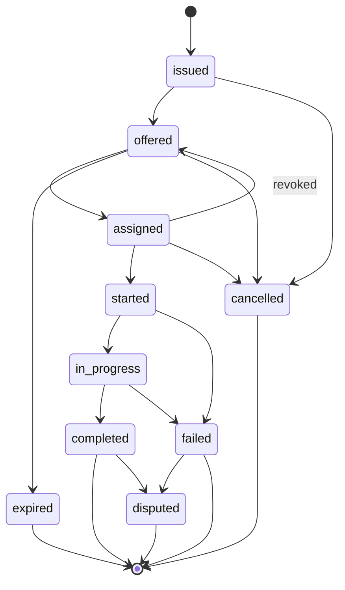

# 6. Lifecycle

## 6.1. States

| State | Meaning | Set by |
|---|---|---|
| `issued` | Work order exists, not yet offered | Implicit on `WorkOrder` |
| `offered` | Visible to at least one pool | Implicit on `Offer` |
| `assigned` | A performer is committed | Implicit on `Assignment` |
| `started` | Performer has begun (departed, en route, arrived) | `Progress` |
| `in_progress` | Substantive work under way | `Progress` |
| `completed` | Work done | `Progress` + `Attestation` |
| `failed` | Attempted, not achieved | `Progress` |
| `cancelled` | Called off before completion | `Progress` |
| `expired` | `expires` passed with no assignment | Implicit, computed |
| `disputed` | Outcome contested | `Attestation` with `outcome = 3` |

## 6.2. Transitions

Transitions are not commands; they are *derived* from the objects present.
There is no transition message and no acknowledgement. An implementation
computes the current state by folding the object set (§6.3).

`expired` is computed, never signed: any work order whose `expires` has passed
without a valid `Assignment` is expired everywhere, simultaneously, with no
message required. This is deliberate — expiry is the one state change that must
work when the parties cannot reach each other.

`assigned → offered` occurs when an `Assignment` carries `revoked = true`
(§3.6). The work order returns to its pools and may be re-assigned; earlier
bids remain valid unless withdrawn.

## 6.3. Computing current state

Given the verified object set for one work order, the state is:

1. If any `Progress` reports a **terminal** state (`completed`, `failed`,
   `cancelled`), the state is the terminal one with the highest `ts`.
2. Otherwise, if a valid non-revoked `Assignment` exists, the state is the
   highest-`ts` `Progress` state reachable from `assigned`, defaulting to
   `assigned`.
3. Otherwise, if `now >= expires`, the state is `expired`.
4. Otherwise, if any `Offer` exists, the state is `offered`.
5. Otherwise, `issued`.

The fold is a **pure function of the object set** and therefore order-
independent: two replicas holding the same objects compute the same state
regardless of arrival order. This is what lets participants sync in any
direction, at any time, over any transport, without a session or a handshake.

Implementations MUST discard a `Progress` object whose `state` is not reachable
from the state implied by the objects preceding it in `ts` order — a performer
cannot report `completed` on a work order they were never assigned. Such an
object is not an error to be surfaced; it is simply not applied, and MAY be
logged.

## 6.4. Timeouts

WRAP defines no timers beyond `expires` (§3.3) and `closes` (§3.4). Deployments
requiring "assign within N seconds" or "auto-fail if not completed by T" MUST
express these as profile fields (§12) and enforce them locally.

This is a deliberate omission. Protocol-level timers require agreement on time
and on what a timeout *means*, and both are exactly the kind of coordination
WRAP exists to avoid. Local policy over shared clocks.
