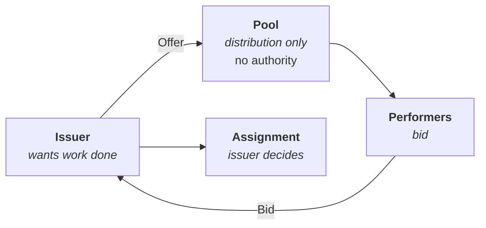

<div align="centre">

# WRAP

### Work Request & Assignment Protocol

**Coordinating work without a middleman.** One open protocol for issuing,
offering, assigning, tracking and proving **work** — couriers, plumbers, field
service, mutual aid — between independent parties, with no central operator, no
platform account, and no cut taken.

*Your key is your identity. Your work history belongs to you. Any pool you join, you can leave.*

</div>

---

## The one idea

Every platform that coordinates work does it the same way: put one company in
the middle, let it hold every identity, every job record and every reputation,
and let it take a cut. The coordination is not the hard part. The
centralisation is a business model wearing the costume of an architecture.

Look at what actually *forces* a central operator and it comes down to one
thing: **somebody must decide who gets the job.** Almost every platform runs
first-come-claim — broadcast the job, workers race, first tap wins. A race
needs an arbiter. An arbiter is a central server. And once it exists,
everything else gets absorbed into it.

WRAP removes the race:



> **The issuer assigns.** The only contended decision is made by the party who
> is already its natural authority — the one who wants the work done. Whoever
> cooked the food decides who carries it.

That single choice removes consensus, leader election and distributed locking
from the protocol. What's left is a set of signed objects that merge
deterministically — exchangeable over any transport, in any order, with
arbitrary delay, and they still converge.

## Built on the DMTAP substrate

WRAP is not a new stack. It adopts [DMTAP](https://github.com/vul-os/dmtap)'s five
substrate capabilities — Identity, Feeds & Blobs, Sync, Infrastructure Roles,
Wake — under that directory's à-la-carte rule, and adds only the work-coordination
spine: six object kinds and the *issuer-assigns* rule. **No new cryptography, no
new hash construction, no new signature framing, no new CRDT.** A `WorkOrder` is a
substrate content object; `Offer`/`Bid`/`Assignment`/`Progress` are substrate Sync
ops; an `Attestation` is a substrate author-feed entry — so a worker's identity and
history are the same bytes every other DMTAP product speaks. Its sibling
[TRACT](https://github.com/vul-os/tract) is the *commerce* spec on the same
substrate; TRACT references WRAP for the delivery/dispatch leg of an order rather
than re-specifying work coordination.

## Properties

- **Offline-first.** A courier in a tunnel, a plumber in a basement, a café
  whose connection dies mid-service. Everyone keeps working; state converges
  afterwards. Nothing blocks.
- **No privileged nodes.** Some infrastructure is unavoidable for open
  discovery — the spec is explicit about why. WRAP requires only that it be
  *replaceable*: anyone can run a pool, you can join several, and losing one
  costs reachability, never identity, history or data.
- **Portable reputation.** Attestations are signed by counterparties and held
  by both sides. Leave a pool and your record comes with you.
- **Domain-neutral.** Delivery and skilled trades ship as profiles in v0.
  Field service, mutual aid, municipal reporting, medical courier and remote
  freelance work are all expressible — geography is an optional field.
- **Implementable in an afternoon.** WRAP rides the substrate (Ed25519,
  deterministic CBOR, three Sync endpoints, the Feeds HTTP surface) and adds only
  six object kinds and one assignment rule on top.

## What it deliberately isn't

- **Not a payment system.** Work orders carry compensation *terms*; settlement
  happens out of band. No escrow, no currency, no blockchain.
- **Not a mesh.** Broadcasting work orders would publish customer addresses to
  strangers and invite spam. Point-to-point plus pools.
- **Not trustless.** Open participation admits Sybils. WRAP makes the trust
  source explicit and replaceable — curated pools — rather than pretending it
  isn't there.
- **Not anonymous.** It protects integrity and ownership of history, not
  metadata privacy.
- **Not a governance framework.** How a pool decides who belongs is for the
  people affected, not for a protocol author.
- **Not a substrate, and not commerce.** WRAP defines no identity, encoding,
  merge, or transport of its own — it adopts DMTAP's substrate for those — and it
  coordinates *work*, not catalogues, carts, or orders. Commerce is
  [TRACT](https://github.com/vul-os/tract)'s job.

## The spec

| § | Document | |
|---|---|---|
| 1 | [Overview](00-overview.md) | The idea, scope, constraints |
| 2 | [Identity](01-identity.md) | Keypairs, roles, key names |
| 3 | [Objects](02-objects.md) | WorkOrder, Offer, Bid, Assignment, Progress, Attestation |
| 4 | [Wire format](03-wire-format.md) | Substrate primitives + WRAP field registry |
| 5 | [Signing](04-signing.md) | Sign the object, not the frame (substrate COSE + DS-tag) |
| 6 | [Lifecycle](05-lifecycle.md) | States, transitions, computed expiry |
| 7 | [Merge](06-merge.md) | Object → substrate CRDT-primitive mapping |
| 8 | [Pools](07-pools.md) | Discovery via substrate roles, no privileged nodes |
| 9 | [Trust](08-trust.md) | Sybils, curated pools, inverted reputation |
| 10 | [Fulfilment](09-fulfilment.md) | Handoff codes and honest weak proofs |
| 11 | [Transport](10-transport.md) | Rides the substrate Sync + Feeds wire |
| 12 | [Profiles](11-profiles.md) | Delivery, trades, and other domains |
| 13 | [Errors](12-errors.md) | Codes, and what is deliberately not an error |
| 14 | [Security](13-security.md) | Including what it does *not* protect |
| 15 | [Conformance](14-conformance.md) | Vectors are normative |
| 16 | [References](15-references.md) | Prior art and debts |

Build the PDF:

```bash
cd build && npm install && npm run build   # -> wrap.pdf
```

## Status

**Version 0. No compatibility guarantee.** This describes an implementation in
progress. It is written with the rigour of a standards document because that
discipline produces better designs — not because stability is being claimed.

It is not an RFC and does not seek to be one yet. A specification with a single
implementation is a description, not a standard; promoting it is a question for
the day a second implementer appears.

## License

Specification: [CC BY 4.0](LICENSE.md) — implement, quote and build on it
freely, with attribution.

<div align="centre">
<sub><em>Vulos — rooted in <strong>vula</strong>, the Zulu and Xhosa word for <strong>open</strong>.</em></sub>
</div>

---

<p align="centre">
  <a href="https://vulos.org"></a><br>
  <sub><a href="https://vulos.org"><b>vulos</b></a> — open by design</sub>
</p>
