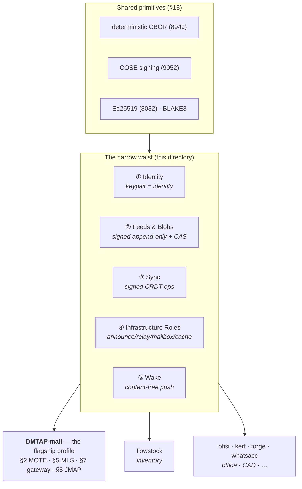

# The DMTAP Substrate — the narrow waist

> **Status:** additive companion to the core specification (§0–§27). This directory does **not**
> renumber, replace, or amend any existing section; it **re-presents** parts of the core spec as a
> small, standalone substrate that products other than mail may adopt à la carte, and cross-references
> the normative text that governs each. Where this directory and a numbered section (§1–§27) appear to
> differ, **the numbered section governs the normative bytes and behavior**; these documents govern the
> framing and the adoption rules.

DMTAP began as *email reimagined from the keypair up* (see the repository [`README`](../README.md)).
In building it, five capabilities turned out to be **general** — nothing about them is about mail. This
directory names those five capabilities, extracts them as a **narrow waist**, and re-frames DMTAP-mail
(§2, §5, §7, §8) as the **first profile** built on top of that waist rather than as the whole protocol.

The key words **MUST**, **MUST NOT**, **REQUIRED**, **SHALL**, **SHOULD**, **SHOULD NOT**,
**RECOMMENDED**, **MAY**, and **OPTIONAL** are to be interpreted as in RFC 2119 / RFC 8174, consistent
with the rest of this specification.

---

## 1. Why a waist, and why now

Federated-messaging history has one loud lesson: **monolithic protocols die of their own weight, and
tiny cores win.**

- **XMPP** (2000s) and **Matrix** (2014–) are technically complete and genuinely federated, yet both
  carry a large mandatory surface — presence, rosters, MUC/room-state resolution, a sprawl of
  extensions (XEPs) or a heavy room-DAG — that every server must implement to interoperate. The weight,
  not the idea, is what kept the network of servers small.
- **HTTP** did the opposite. The core is almost nothing — a request line, headers, a body, a small set
  of verbs — and *everything* (the web, REST APIs, WebDAV, gRPC-over-HTTP2, ActivityPub) is a profile
  layered on that waist. Its narrowness is exactly why it became universal.
- **Nostr** reduced a social network to *"a signed JSON event, relayed by dumb relays,"* and **AT
  Protocol** to *"a signed content-addressed repo with pluggable identity."* Both won adoption by being
  small enough that a new client or a new application *kind* did not have to swallow the whole thing.

DMTAP's core already has the right shape — *signed, content-addressed objects over pluggable transports,
with identity underneath and names on top* — but it is **written as a mail spec**. A product that wants
only "sync my data across my devices" or "publish a signed feed" or "resolve a key to a location" should
not have to read about SMTP bridging, MLS group epochs, or requests-area quarantine to find the 20% it
needs. This directory is that 20%, pulled to the surface.

**Design discipline (unchanged from the core, §11, repository README):** the waist **invents only where
no standard exists.** Everywhere a proven RFC or well-worn design fits, the waist *profiles* it —
Ed25519 (RFC 8032), HPKE (RFC 9180), deterministic CBOR (RFC 8949 §4.2), COSE (RFC 9052), Web Push
(RFC 8030/8291/8292), Merkle transparency (RFC 6962), libp2p Circuit Relay v2. Exactly **one** waist
capability contains genuinely new normative ground — [Sync](SYNC.md) — because no single deployed
standard covers *signed, deterministic, multi-author CRDT operations with snapshot and sparse-sync*.
Everything else points at an existing spec.

---

## 2. The five capabilities

The waist is five capabilities. A product **MAY** adopt any subset; the capabilities are independent and
compose without ordering constraints. Each has a normative home in the core spec and a substrate document
that profiles it for non-mail use.

| # | Capability | What it is | Substrate doc | Normative home | Profiles (standards) |
|---|------------|------------|---------------|----------------|----------------------|
| 1 | **Identity** | A keypair *is* the identity: Ed25519 `IK`, `DeviceCert` subkeys, DNS `name→key` binding, KT transparency, 8-word key-name floor | [`IDENTITY.md`](IDENTITY.md) | §1, §3 | Ed25519 (8032), CBOR (8949), CONIKS/keytrans, RFC 6962 |
| 2 | **Feeds & Blobs** | Signed append-only per-author feeds + plaintext content-addressed blobs, self-verifying, servable over plain HTTPS with no mesh | [`FEEDS.md`](FEEDS.md) | §22 (DMTAP-PUB) | Nostr-class signed events, IPFS-class CAS, RFC 6962 Merkle, HTTP caching |
| 3 | **Sync** | A signed CRDT op algebra + range-Merkle reconciliation + snapshots + sparse sync — multi-author, deterministic, COSE-signed | [`SYNC.md`](SYNC.md) | **new** (this directory); semantics grounded in §5.6 device-cluster sync | CBOR/COSE, HLC, version vectors, range-based set reconciliation |
| 4 | **Infrastructure Roles** | Open, key-addressed roles any node MAY serve: announce/resolve, signaling, circuit relay, short-TTL content-blind mailbox, cache/pin | [`ROLES.md`](ROLES.md) | §4, §14 | libp2p (Kademlia, Circuit Relay v2, DCUtR), Chatmail relay-mailbox |
| 5 | **Wake** | Content-free, sender-blind push wake-signaling so a sleeping device reconnects and syncs — never a delivery path | [`ROLES.md § Wake`](ROLES.md#wake) | §4.9 | Web Push (RFC 8030/8291/8292 VAPID), UnifiedPush |

> **Wake** is listed as a first-class capability because a product may want it *without* running any of
> the other roles (a lone always-off client that only needs to be woken). Its normative profile lives
> inside [`ROLES.md`](ROLES.md) alongside the other infrastructure roles, since a *wake origin* is an
> infrastructure role like a relay or a mailbox; it is called out at the top level here because *needing
> to be woken* is a product-facing capability, not an operator-facing one.

### The layering picture

Mail sits **beside** the other products, not beneath them: it is the profile that adopts *all five*
capabilities and adds the sealed, metadata-private message path (§2, §5, §6) and the legacy bridge (§7)
on top. Nothing in the waist depends on anything mail-specific.

---

## 3. Adoption rules (normative)

The waist is an **à-la-carte** contract. The rules that make "à la carte" safe rather than a
compatibility swamp:

1. **A product MAY adopt any subset of the five capabilities.** There is no ordering, no prerequisite
   bundle, and no "core profile" a product must swallow first. A product that adopts zero waist
   capabilities is simply not a DMTAP product; a product that adopts one is a conformant user of that one.

2. **If a product implements a capability's *function*, it MUST speak that capability's *spec*.** This is
   the load-bearing rule. A product that syncs structured state across replicas **MUST** use the
   [Sync](SYNC.md) op algebra and wire protocol — it **MUST NOT** invent a parallel CRDT format and call
   it DMTAP-sync. A product that publishes signed author feeds **MUST** use [Feeds](FEEDS.md)
   (`PubAnnounce`/`FeedHead`/`FeedEntry`, §22), not a bespoke JSON feed. A product that resolves a key to
   a location **MUST** use the [Roles](ROLES.md) announce/resolve records (§4.2). The point of the waist
   is that two independently-built products interoperate on any capability they *both* adopt; that only
   holds if adopting a capability means adopting its bytes, not merely its idea.

3. **Adoption is capability-negotiated, never assumed.** Each capability is advertised by the same
   capability-token machinery the core uses (§10.2): a peer that has not advertised a capability is never
   expected to serve it, and its silence is never a fault (the capability-absence rule, §21.22). A product
   pins the exact token set it speaks; an unadvertised or unknown token is treated as *unsupported*, never
   as a parse failure (§10.2). Absence of a capability is not a downgrade — it is a fact about that peer.

4. **The shared primitives are non-negotiable.** Everything a waist capability signs or serializes uses
   the **same** deterministic-CBOR encoding (RFC 8949 §4.2, §18.1.1) and the **same** signing discipline —
   Ed25519 v0 with per-object suite agility (§1.1), COSE-style structured signatures where a signature
   envelope is called for, DS-tag domain separation on every signing preimage (§18.1.6). A product does
   not get to pick its own hash, its own canonical form, or its own signature framing; those are the
   waist's floor, so that an Identity minted for mail verifies unchanged when Feeds or Sync reference it.

5. **A capability MUST NOT be silently degraded.** Every waist capability inherits the core's fail-closed
   governance (§10.7): a security-relevant failure is either refused (fail closed) or surfaced as an
   explicit user choice — never a silent fallback to an unauthenticated or unencrypted path. Each
   substrate document carries its own fail-closed table cross-referenced into §10.7.

6. **DNS stays the naming root; key authority sits underneath it — never inverted.** The waist does not
   move the naming ladder (§3.13). A **name resolves to a key**; a **key is the identity**; the key is the
   root of *authority*, DNS is the root of *discovery*. A waist capability MUST NOT introduce a naming
   scheme in which a name is authoritative over a key, or in which possessing a name confers identity. The
   8-word **key-name** (§3.9.6) remains the zero-authority floor every product inherits for free; `name@domain`
   (§3.9.1) remains an optional convenience layered *over* the key, neutralized by KT + pinning. See
   [`IDENTITY.md § The naming ladder is not inverted`](IDENTITY.md#the-naming-ladder-is-not-inverted).

---

## 4. Litmus tests

Two tests keep the waist honest. Each substrate document restates the test it must pass.

### 4.1 The flowstock test — *"can a product sync without reading mail?"*

> **flowstock** (inventory) syncs stock levels, item records, and movements across a shop's devices and,
> optionally, a shared cloud replica. To do that correctly, a flowstock implementer **MUST be able to read
> only the waist documents** — [`IDENTITY.md`](IDENTITY.md) (whose devices are these) and
> [`SYNC.md`](SYNC.md) (how ops merge and reconcile) — and **MUST NOT need to open §2 (MOTE), §5 (MLS
> groups), §7 (gateway), or §8 (JMAP)** to build a correct, interoperable sync.

The test passes iff [`SYNC.md`](SYNC.md) is self-contained: the CRDT op algebra, the signing rules, the
version-vector + range-Merkle reconciliation wire protocol, snapshots, and sparse sync are all specified
there without a forward reference into the mail spec that a reader *must* follow to implement correctly.
References into the core for *grounding* (e.g. "these semantics match §5.6's device-cluster CRDTs") are
allowed; references a reader must chase to get the bytes right are not. Flowstock's stateless
`GET /sync/vector` · `POST /sync/pull` · `POST /sync/ops` shape is the concrete proof-of-life for this
test (see [`SYNC.md`](SYNC.md)).

### 4.2 The HTTP test — *"are transports pluggable, with HTTPS first-class?"*

> A waist capability **MUST** be servable over **plain HTTPS with no mesh, no relay, and no libp2p
> present**, and a fetcher **MUST** verify identically regardless of which transport delivered the bytes,
> because every object is self-authenticating (signed or content-addressed). The mesh (§4) is *one*
> binding, never *the* binding.

This is already true for Feeds: **kerf-pub** (the reference implementation at
`/Users/pc/code/vulos/kerf/packages/kerf-pub`) serves the §22 `/.well-known/dmtap-pub/…` surface as static
files behind an ordinary web server and **proves §22 works over plain HTTPS with no mesh** — a fetcher
validates the signed `FeedHead`, walks the `prev` chain, and checks each content address, trusting the
server for *nothing* (§22.5.1). Identity resolves over DNS + KT with no mesh (§3.3). Sync's wire protocol
is three ordinary HTTP endpoints (§4.1 of [`SYNC.md`](SYNC.md)). Roles degrade to an HTTPS announce/resolve
and an HTTPS mailbox where no mesh exists. The mesh binding adds swarming, NAT traversal, and mixnet
privacy on top — it is never a *requirement* to speak a capability.

---

## 5. How DMTAP-mail is the first profile

Mail is not privileged; it is **complete**. DMTAP-mail is the profile that:

- adopts **Identity** unchanged (§1, §3) — the same `IK`/`DeviceCert`/KT/key-name every product uses;
- adopts **Sync** for the device-cluster mailbox (§5.6 is the CRDT replica whose op algebra
  [`SYNC.md`](SYNC.md) generalizes);
- adopts **Feeds & Blobs** for public list archives / release announcements (§22, and the engineering-artifact facet §24.18,
  the Video/Media profile §24, and pubsub over the same feeds §25 are *further* applications over the
  same substrate — proof the waist already carries far more than mail; the video profile is also the
  convergence path for the independently built *vidmesh* protocol onto DMTAP-PUB's wire);
- adopts **Infrastructure Roles** — announce/resolve for reachability (§4.2), circuit relay for NAT'd
  boxes (§4.3, §14.5), and the short-TTL content-blind relay-mailbox for offline holding (§14.3, §14.5);
- adopts **Wake** for the push-woken mobile client (§4.9, §14.3);
- **and then adds the mail-only surface on top:** the sealed, metadata-private MOTE (§2), MLS sessions and
  groups (§5), the mixnet privacy tiers (§6), the anti-abuse cold-contact economics (§9), and the legacy
  SMTP/IMAP/JMAP bridge (§7, §8).

Everything above the last bullet is shared substrate; only the last bullet is mail. That is the whole
restructuring: the waist is what *any* product stands on, and mail is the profile that happens to stand
on all of it and add the messaging spine.

---

## 6. Reference implementations (informative, non-normative)

Per the repository's implementation-neutral stance (repository README), no implementation is part of the
standard or required to speak it. These are named only as existence proofs that the waist is buildable:

| Capability | Reference implementation | Proves |
|------------|--------------------------|--------|
| Feeds & Blobs | **kerf-pub** (`/Users/pc/code/vulos/kerf/packages/kerf-pub`) | §22 served over plain HTTPS, no mesh (the HTTP test) |
| Sync | **flowstock** stateless sync (`/Users/pc/code/vulos/flowstock`); **dmtap-clustersync** CRDTs (`/Users/pc/code/vulos/envoir`) | the op algebra + `/sync/vector`·`/sync/pull`·`/sync/ops` wire (the flowstock test) |
| Infrastructure Roles + Wake | **vulos-relayd** (intended) | key-addressed relay / mailbox / wake origin |

Independent implementations **MUST** be buildable from the substrate documents and the core spec alone,
without reading any of the above (repository README). Where a reference and the spec disagree, the spec wins.

**One core, many surfaces, and today's honest gap.** The suite currently has roughly five independently
hand-rolled sync/identity/feed implementations across its products, none byte-interoperable with any other.
[`BINDINGS.md`](BINDINGS.md) is the plan for closing that the right way — one compiled Rust core
(`dmtap-core`/`dmtap-clustersync`/`dmtap-sync` in `/Users/pc/code/vulos/envoir`), thin per-language bindings
(native Rust, C-ABI/cgo for Go, WASM for browser/JS, UniFFI for mobile if ever needed), and the frozen
conformance vectors as the cross-surface proof that a binding is byte-identical to the core rather than a
sixth reimplementation. [`ADOPTION.md`](ADOPTION.md) is the honest, per-product status matrix that plan is
the answer to: which product implements which capability today, to-spec or independently, read directly
from each repository rather than assumed.

---

## 7. Document index

- [`IDENTITY.md`](IDENTITY.md) — Capability ①: keys, `DeviceCert`, `name→key`, KT, key-name floor.
- [`FEEDS.md`](FEEDS.md) — Capability ②: signed append-only author feeds + public content-addressed blobs.
- [`SYNC.md`](SYNC.md) — Capability ③: the signed CRDT op algebra and reconciliation wire protocol (the one new spec).
- [`ROLES.md`](ROLES.md) — Capabilities ④+⑤: open, key-addressed infrastructure roles and content-free wake.
- [`BINDINGS.md`](BINDINGS.md) — informative: the one-core/many-surfaces bindings plan (native Rust, cgo/C-ABI, WASM, UniFFI).
- [`ADOPTION.md`](ADOPTION.md) — informative: today's per-product adoption-status matrix across all five capabilities.
